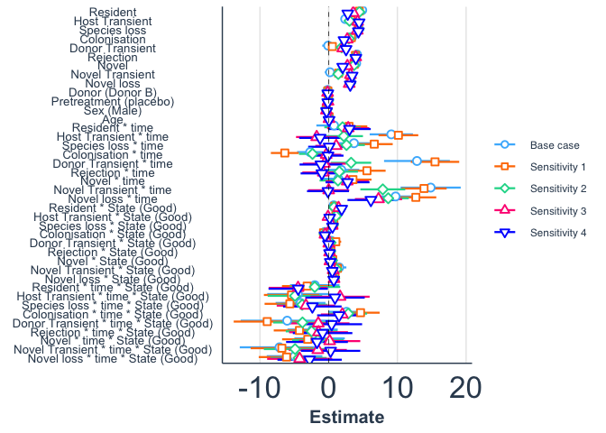
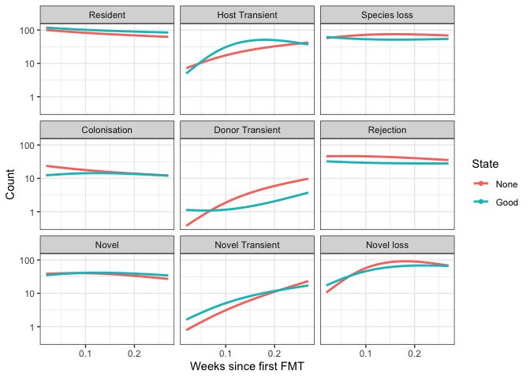
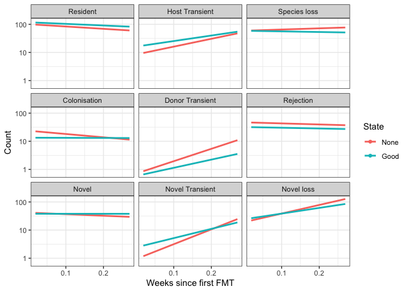
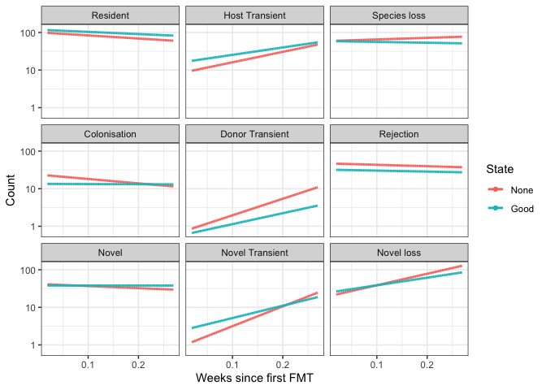

Compare scenarios
================
S. Pinto
2023-06-16

## Load required packages

``` r
library( dplyr )
library( magrittr )
library( knitr )
library( tidyverse )
library( reshape2 )
```

``` r
library( phyloseq )
library( microbiome )
library( devtools )
library( stringr )
```

``` r
library( aod )
library( nlme )
library( lme4 )
library( splines )
library( jtools )
```

## Load the data

Here we use the relative abundance dataset.

# Model the data

## Scenario 1

``` r
Scenario1.model <- Scenario1
# Remove category 'Absent', because always 9
Scenario1.model <- Scenario1.model  %>% filter( category != "Absent" )
# make time categorical (translate to weeks)
Scenario1.model$time <- 0
Scenario1.model$time[ Scenario1.model$timepoint == "Post_1" ] <- 1
Scenario1.model$time[ Scenario1.model$timepoint == "Post_2" ] <- 2
Scenario1.model$time[ Scenario1.model$timepoint == "Post_3" ] <- 3
Scenario1.model$time[ Scenario1.model$timepoint == "Post_4" ] <- 4
Scenario1.model$time[ Scenario1.model$timepoint == "Week8" ] <- 8
Scenario1.model$time[ Scenario1.model$timepoint == "Week10" ] <- 10
Scenario1.model$time[ Scenario1.model$timepoint == "Week14" ] <- 14
# Rescale time, because of the warning (Model is nearly unidentifiable: very large eigenvalue)
Scenario1.model$time2 <- Scenario1.model$time / 52
Scenario1.model$Scenario1[Scenario1.model$category == "Host Transient" & (Scenario1.model$time2 ==1/52)] <- NA
```

    ## Warning: Unknown or uninitialised column: `Scenario1`.

``` r
Scenario1.model$Scenario1[Scenario1.model$category == "Donor Transient" & (Scenario1.model$time2 ==1/52)] <- NA
Scenario1.model$Scenario1[Scenario1.model$category == "Novel Transient" & (Scenario1.model$time2 ==1/52 | Scenario1.model$time2 ==2/52)] <- NA
Scenario1.model$Scenario1[Scenario1.model$category == "Novel loss" & (Scenario1.model$time2 ==1/52 )] <- NA
# Rescale age
Scenario1.model$Age <- Scenario1.model$Age %>% as.numeric()
Scenario1.model$Age2 <- Scenario1.model$Age / 10
# reorder state
Scenario1.model$State <- Scenario1.model$State %>% factor(levels = c("None", "Good"))
# combine transient
# Transient in rest group, if not present by definition name NA
Scenario1.model.transient <- Scenario1.model
Scenario1.model.transient$category[Scenario1.model.transient$category %in% c("Host Transient", "Donor Transient", "Novel Transient")] <- "Transient"
```

``` r
# without intercept
# model 1
model.eco.scenario1 <- glmer.nb( Scenario1 ~ -1 + time2  * category * State + Donor + Pretreatment + Age2 + Sex +  ( 1 | Patient_ID ), 
                        data = Scenario1.model, verbose = 2 )
summary( model.eco.scenario1 ) 
save( model.eco.scenario1, file = "/Volumes/My Passport for Mac/FECBUD studie/FECBUD GitHub/Data/model.eco.scenario1.Rda" )

model.eco.scenario1.transient <- glmer.nb( Scenario1 ~ -1 + time2  * category * State + Donor + Pretreatment + Sex +  ( 1 | Patient_ID ),
                        data = Scenario1.model.transient, verbose = 2 )
# this model failed to converge with Age2
summary( model.eco.scenario1.transient )
save( model.eco.scenario1.transient, file = "/Volumes/My Passport for Mac/FECBUD studie/FECBUD GitHub/Data/model.eco.scenario1.transient.Rda" )
```

## Scenario 2

``` r
Scenario2.model <- Scenario2
# Remove category 'Absent', because always 9
Scenario2.model <- Scenario2.model  %>% filter( category != "Absent" )
# make time categorical (translate to weeks)
Scenario2.model$time <- 0
Scenario2.model$time[ Scenario2.model$timepoint == "Post_1" ] <- 1
Scenario2.model$time[ Scenario2.model$timepoint == "Post_2" ] <- 2
Scenario2.model$time[ Scenario2.model$timepoint == "Post_3" ] <- 3
Scenario2.model$time[ Scenario2.model$timepoint == "Post_4" ] <- 4
Scenario2.model$time[ Scenario2.model$timepoint == "Week8" ] <- 8
Scenario2.model$time[ Scenario2.model$timepoint == "Week10" ] <- 10
Scenario2.model$time[ Scenario2.model$timepoint == "Week14" ] <- 14
# Rescale time, because of the warning (Model is nearly unidentifiable: very large eigenvalue)
Scenario2.model$time2 <- Scenario2.model$time / 52
Scenario2.model$Scenario2[Scenario2.model$category == "Host Transient" & (Scenario2.model$time2 ==1/52 | Scenario2.model$time2 ==2/52)] <- NA
```

    ## Warning: Unknown or uninitialised column: `Scenario2`.

``` r
Scenario2.model$Scenario2[Scenario2.model$category == "Donor Transient" & (Scenario2.model$time2 ==1/52 | Scenario2.model$time2 ==2/52 | Scenario2.model$time2 ==3/52)] <- NA
Scenario2.model$Scenario2[Scenario2.model$category == "Novel Transient" & (Scenario2.model$time2 ==1/52 | Scenario2.model$time2 ==2/52 | Scenario2.model$time2 ==3/52)] <- NA
Scenario2.model$Scenario2[Scenario2.model$category == "Novel loss" & (Scenario2.model$time2 ==1/52 )] <- NA
# Rescale age
Scenario2.model$Age <- Scenario2.model$Age %>% as.numeric()
Scenario2.model$Age2 <- Scenario2.model$Age / 10

# reorder state
Scenario2.model$State <- Scenario2.model$State %>% factor(levels = c("None", "Good"))

# combine transient
# Transient in rest group, if not present by definition name NA
Scenario2.model.transient <- Scenario2.model
Scenario2.model.transient$category[Scenario2.model.transient$category %in% c("Host Transient", "Donor Transient", "Novel Transient")] <- "Transient"
```

``` r
# model 2
model.eco.scenario2 <- glmer.nb( Scenario2 ~ -1 + time2  * category * State + Donor + Pretreatment + Sex + ( 1 | Patient_ID ), data = Scenario2.model, verbose = 2 )
summary( model.eco.scenario2 ) 
save( model.eco.scenario2, file = "/Volumes/My Passport for Mac/FECBUD studie/FECBUD GitHub/Data/model.eco.scenario2.Rda" )
# model failed to converge because of Age2

#model.eco.scenario2.int <- glmer.nb( Scenario2 ~ time2  * category * State + Donor + Pretreatment + Sex +  ( 1 | Patient_ID ), 
                      #  data = Scenario2.model)
# model failed to converge because of Age2

model.eco.scenario2.splines <- glmer.nb( Scenario2 ~ -1 + ns( time2, df = 1)  * category * State + Donor + Pretreatment + Age2 + Sex +  ( 1 | Patient_ID ), 
                        data = Scenario2.model, verbose = 2 )
summary( model.eco.scenario2.splines ) 
save( model.eco.scenario2.splines, file = "/Volumes/My Passport for Mac/FECBUD studie/FECBUD GitHub/Data/model.eco.scenario2.spline.Rda" )

model.eco.scenario2.splines2 <- glmer.nb( Scenario2 ~ -1 + ns( time2, df = 2)  * category * State + Donor + Pretreatment + Age2 + Sex +  ( 1 | Patient_ID ), 
                        data = Scenario2.model, verbose = 2 )
summary( model.eco.scenario2.splines2 ) 
save( model.eco.scenario2.splines2, file = "/Volumes/My Passport for Mac/FECBUD studie/FECBUD GitHub/Data/model.eco.scenario2.spline2.Rda" )

# failed because of age
model.eco.scenario2.splines3 <- glmer.nb( Scenario2 ~ -1 + ns( time2, df = 3)  * category * State + Donor + Pretreatment + Age2 + Sex +  ( 1 | Patient_ID ), 
                        data = Scenario2.model, verbose = 2 )
summary( model.eco.scenario2.splines3 ) 
save( model.eco.scenario2.splines3, file = "/Volumes/My Passport for Mac/FECBUD studie/FECBUD GitHub/Data/model.eco.scenario2.spline3.Rda" )

model.eco.scenario2.transient <- glmer.nb( Scenario2 ~ -1 + time2  * category * State + Donor + Pretreatment + Age2 + Sex +  ( 1 | Patient_ID ), 
                        data = Scenario2.model.transient, verbose = 2 )
summary( model.eco.scenario2.transient ) 
save( model.eco.scenario2.transient, file = "/Volumes/My Passport for Mac/FECBUD studie/FECBUD GitHub/Data/model.eco.scenario2.transient.Rda" )
```

## Scenario 2 NO NA

``` r
Scenario2_sens.model <- Scenario2_sens
# Remove category 'Absent', because always 9
Scenario2_sens.model <- Scenario2_sens.model  %>% filter( category != "Absent" )
# make time categorical (translate to weeks)
Scenario2_sens.model$time <- 0
Scenario2_sens.model$time[ Scenario2_sens.model$timepoint == "Post_1" ] <- 1
Scenario2_sens.model$time[ Scenario2_sens.model$timepoint == "Post_2" ] <- 2
Scenario2_sens.model$time[ Scenario2_sens.model$timepoint == "Post_3" ] <- 3
Scenario2_sens.model$time[ Scenario2_sens.model$timepoint == "Post_4" ] <- 4
Scenario2_sens.model$time[ Scenario2_sens.model$timepoint == "Week8" ] <- 8
Scenario2_sens.model$time[ Scenario2_sens.model$timepoint == "Week10" ] <- 10
Scenario2_sens.model$time[ Scenario2_sens.model$timepoint == "Week14" ] <- 14
# Rescale time, because of the warning (Model is nearly unidentifiable: very large eigenvalue)
Scenario2_sens.model$time2 <- Scenario2_sens.model$time / 52
Scenario2_sens.model$Scenario2_sens[Scenario2_sens.model$category == "Host Transient" & (Scenario2_sens.model$time2 ==1/52 )] <- NA
```

    ## Warning: Unknown or uninitialised column: `Scenario2_sens`.

``` r
Scenario2_sens.model$Scenario2_sens[Scenario2_sens.model$category == "Donor Transient" & (Scenario2_sens.model$time2 ==1/52 | Scenario2_sens.model$time2 ==2/52 )] <- NA
Scenario2_sens.model$Scenario2_sens[Scenario2_sens.model$category == "Novel Transient" & (Scenario2_sens.model$time2 ==1/52 | Scenario2_sens.model$time2 ==2/52 )] <- NA
Scenario2_sens.model$Scenario2_sens[Scenario2_sens.model$category == "Novel loss" & (Scenario2_sens.model$time2 ==1/52 )] <- NA
# Rescale age
Scenario2_sens.model$Age <- Scenario2_sens.model$Age %>% as.numeric()
Scenario2_sens.model$Age2 <- Scenario2_sens.model$Age / 10
# reorder state
Scenario2_sens.model$State <- Scenario2_sens.model$State %>% factor(levels = c("None", "Good"))

# combine transient
# Transient in rest group, if not present by definition name NA
Scenario2_sens.model.transient <- Scenario2_sens.model
Scenario2_sens.model.transient$category[Scenario2_sens.model.transient$category %in% c("Host Transient", "Donor Transient", "Novel Transient")] <- "Transient"
```

``` the
# model 2
model.eco.scenario2_sens <- glmer.nb( Scenario2_sens ~ -1 + time2  * category * State + Donor + Pretreatment + Age2 + Sex +  ( 1 | Patient_ID ), 
                        data = Scenario2_sens.model, verbose = 2 )
summary( model.eco.scenario2_sens ) 
save( model.eco.scenario2_sens, file = "/Volumes/My Passport for Mac/FECBUD studie/FECBUD GitHub/Data/model.eco.scenario2_sens.Rda" )

model.eco.scenario2_sens.transient <- glmer.nb( Scenario2_sens ~ -1 + time2  * category * State + Donor + Pretreatment + Age2 + Sex +  ( 1 | Patient_ID ), 
                        data = Scenario2_sens.model.transient, verbose = 2 )
summary( model.eco.scenario2_sens.transient ) 
save( model.eco.scenario2_sens.transient, file = "/Volumes/My Passport for Mac/FECBUD studie/FECBUD GitHub/Data/model.eco.scenario2_sens.transient.Rda" )
```

## Model 3

``` r
Scenario3.model <- Scenario3
# Remove category 'Absent', because always 9
Scenario3.model <- Scenario3.model  %>% filter( category != "Absent" )
# make time categorical (translate to weeks)
Scenario3.model$time <- 0
Scenario3.model$time[ Scenario3.model$timepoint == "Post_1" ] <- 1
Scenario3.model$time[ Scenario3.model$timepoint == "Post_2" ] <- 2
Scenario3.model$time[ Scenario3.model$timepoint == "Post_3" ] <- 3
Scenario3.model$time[ Scenario3.model$timepoint == "Post_4" ] <- 4
Scenario3.model$time[ Scenario3.model$timepoint == "Week8" ] <- 8
Scenario3.model$time[ Scenario3.model$timepoint == "Week10" ] <- 10
Scenario3.model$time[ Scenario3.model$timepoint == "Week14" ] <- 14
# Rescale time, because of the warning (Model is nearly unidentifiable: very large eigenvalue)
Scenario3.model$time2 <- Scenario3.model$time / 52
Scenario3.model$Scenario3[Scenario3.model$category == "Novel loss" & (Scenario3.model$time2 ==1/52 )] <- NA
```

    ## Warning: Unknown or uninitialised column: `Scenario3`.

``` r
Scenario3.model$Age <- Scenario3.model$Age %>% as.numeric()
Scenario3.model$Age2 <- Scenario3.model$Age / 10
# reorder state
Scenario3.model$State <- Scenario3.model$State %>% factor(levels = c("None", "Good"))

# combine transient
# Transient in rest group, if not present by definition name NA
Scenario3.model.transient <- Scenario3.model
Scenario3.model.transient$category[Scenario3.model.transient$category %in% c("Host Transient", "Donor Transient", "Novel Transient")] <- "Transient"
```

``` r
# model 3
model.eco.scenario3 <- glmer.nb( Scenario3 ~ -1 + time2  * category * State + Donor + Pretreatment + Age2 + Sex +  ( 1 | Patient_ID ), 
                        data = Scenario3.model, verbose = 2 )
summary( model.eco.scenario3 ) 
save( model.eco.scenario3, file = "/Volumes/My Passport for Mac/FECBUD studie/FECBUD GitHub/Data/model.eco.scenario3.Rda" )

model.eco.scenario3.transient <- glmer.nb( Scenario3 ~ -1 + time2  * category * State + Donor + Pretreatment + Age2 + Sex +  ( 1 | Patient_ID ), 
                        data = Scenario3.model.transient, verbose = 2 )
summary( model.eco.scenario3.transient ) 
save( model.eco.scenario3.transient, file = "/Volumes/My Passport for Mac/FECBUD studie/FECBUD GitHub/Data/model.eco.scenario3.transient.Rda" )
```

## Model 3 No NA

``` r
Scenario3_sens.model <- Scenario3_sens
# Remove category 'Absent', because always 9
Scenario3_sens.model <- Scenario3_sens.model  %>% filter( category != "Absent" )
# make time categorical (translate to weeks)
Scenario3_sens.model$time <- 0
Scenario3_sens.model$time[ Scenario3_sens.model$timepoint == "Post_1" ] <- 1
Scenario3_sens.model$time[ Scenario3_sens.model$timepoint == "Post_2" ] <- 2
Scenario3_sens.model$time[ Scenario3_sens.model$timepoint == "Post_3" ] <- 3
Scenario3_sens.model$time[ Scenario3_sens.model$timepoint == "Post_4" ] <- 4
Scenario3_sens.model$time[ Scenario3_sens.model$timepoint == "Week8" ] <- 8
Scenario3_sens.model$time[ Scenario3_sens.model$timepoint == "Week10" ] <- 10
Scenario3_sens.model$time[ Scenario3_sens.model$timepoint == "Week14" ] <- 14
# Rescale time, because of the warning (Model is nearly unidentifiable: very large eigenvalue)
Scenario3_sens.model$time2 <- Scenario3_sens.model$time / 52
Scenario3_sens.model$Scenario3_sens[Scenario3_sens.model$category == "Novel loss" & (Scenario3_sens.model$time2 ==1/52 )] <- NA
```

    ## Warning: Unknown or uninitialised column: `Scenario3_sens`.

``` r
Scenario3_sens.model$Age <- Scenario3_sens.model$Age %>% as.numeric()
Scenario3_sens.model$Age2 <- Scenario3_sens.model$Age / 10
# reorder state
Scenario3_sens.model$State <- Scenario3_sens.model$State %>% factor(levels = c("None", "Good"))

# combine transient
# Transient in rest group, if not present by definition name NA
Scenario3_sens.model.transient <- Scenario3_sens.model
Scenario3_sens.model.transient$category[Scenario3_sens.model.transient$category %in% c("Host Transient", "Donor Transient", "Novel Transient")] <- "Transient"
```

``` the
# model 3
model.eco.scenario3_sens <- glmer.nb( Scenario3_sens ~ -1 + time2  * category * State + Donor + Pretreatment + Age2 + Sex +  ( 1 | Patient_ID ), 
                        data = Scenario3_sens.model, verbose = 2 )
summary( model.eco.scenario3_sens ) 
save( model.eco.scenario3_sens, file = "/Volumes/My Passport for Mac/FECBUD studie/FECBUD GitHub/Data/model.eco.scenario3_sens.Rda" )

model.eco.scenario3_sens.transient <- glmer.nb( Scenario3_sens ~ -1 + time2  * category * State + Donor + Pretreatment  + Sex +  ( 1 | Patient_ID ), 
                        data = Scenario3_sens.model.transient, verbose = 2 )
# model failed to converge because of Age2
summary( model.eco.scenario3_sens.transient ) 
save( model.eco.scenario3_sens.transient, file = "/Volumes/My Passport for Mac/FECBUD studie/FECBUD GitHub/Data/model.eco.scenario3_sens.transient.Rda" )
```

# Load the results of all the models

``` r
load("/Volumes/My Passport for Mac/FECBUD studie/FECBUD GitHub/Data/model.eco.scenario1.Rda")
load("/Volumes/My Passport for Mac/FECBUD studie/FECBUD GitHub/Data/model.eco.scenario1.transient.Rda")
load( "/Volumes/My Passport for Mac/FECBUD studie/FECBUD GitHub/Data/model.eco.scenario2.Rda" )
load( "/Volumes/My Passport for Mac/FECBUD studie/FECBUD GitHub/Data/model.eco.scenario2.transient.Rda" )
load( "/Volumes/My Passport for Mac/FECBUD studie/FECBUD GitHub/Data/model.eco.scenario2_sens.Rda" )
load("/Volumes/My Passport for Mac/FECBUD studie/FECBUD GitHub/Data/model.eco.scenario2_sens.transient.Rda")
load( "/Volumes/My Passport for Mac/FECBUD studie/FECBUD GitHub/Data/model.eco.scenario2.spline2.Rda" )
load("/Volumes/My Passport for Mac/FECBUD studie/FECBUD GitHub/Data/model.eco.scenario3.Rda")
load("/Volumes/My Passport for Mac/FECBUD studie/FECBUD GitHub/Data/model.eco.scenario3.transient.Rda")
load("/Volumes/My Passport for Mac/FECBUD studie/FECBUD GitHub/Data/model.eco.scenario3_sens.Rda")
load("/Volumes/My Passport for Mac/FECBUD studie/FECBUD GitHub/Data/model.eco.scenario3_sens.transient.Rda")
```

# Plot the results of scenario 2

``` r
custom_order <- c("categoryResident", "categoryHost Transient", "categorySpecies loss",
                  "categoryColonisation", "categoryDonor Transient", "categoryRejection",
                  "categoryNovel", "categoryNovel Transient", "categoryNovel loss",
                  "DonorDonor B", "Pretreatmentplacebo", "SexM",
                  "time2:categoryResident", "time2:categoryHost Transient",
                  "time2:categorySpecies loss", "time2", "time2:categoryDonor Transient",
                  "time2:categoryRejection", "time2:categoryNovel",
                  "time2:categoryNovel Transient", "time2:categoryNovel loss",
                  "categoryResident:StateGood", "categoryHost Transient:StateGood",
                  "categorySpecies loss:StateGood", "StateGood",
                  "categoryDonor Transient:StateGood", "categoryRejection:StateGood",
                  "categoryNovel:StateGood", "categoryNovel Transient:StateGood",
                  "categoryNovel loss:StateGood", "time2:categoryResident:StateGood",
                  "time2:categoryHost Transient:StateGood", "time2:categorySpecies loss:StateGood",
                  "time2:StateGood", "time2:categoryDonor Transient:StateGood",
                  "time2:categoryRejection:StateGood", "time2:categoryNovel:StateGood",
                  "time2:categoryNovel Transient:StateGood", "time2:categoryNovel loss:StateGood")

custom_labels <- c("categoryResident" = "Resident",
                   "categoryHost Transient" = "Host Transient",
                   "categorySpecies loss" = "Species loss",
                   "categoryColonisation" = "Colonisation",
                   "categoryDonor Transient" = "Donor Transient",
                   "categoryRejection" = "Rejection",
                   "categoryNovel" = "Novel",
                   "categoryNovel Transient" = "Novel Transient",
                   "categoryNovel loss" = "Novel loss",
                   
                   "DonorDonor B" = "Donor (Donor B)",
                   "Pretreatmentplacebo" = "Pretreatment (placebo)",                        
                   "SexM" = "Sex (Male)",
                   
                   "time2:categoryResident" = "Resident * time",               
                   "time2:categoryHost Transient" = "Host Transient * time",  
                   "time2:categorySpecies loss" = "Species loss * time",  
                   "time2" = "Colonisation * time",
                   "time2:categoryDonor Transient" = "Donor Transient * time",
                   "time2:categoryRejection" = "Rejection * time",  
                   "time2:categoryNovel" = "Novel * time",
                   "time2:categoryNovel Transient" = "Novel Transient * time",
                   "time2:categoryNovel loss" = "Novel loss * time",  
                   
                   "categoryResident:StateGood" = "Resident * State (Good)",  
                   "categoryHost Transient:StateGood" = "Host Transient * State (Good)",
                   "categorySpecies loss:StateGood" = "Species loss * State (Good)",  
                   "StateGood" = "Colonisation * State (Good)",                             
                   "categoryDonor Transient:StateGood" = "Donor Transient * State (Good)",  
                   "categoryRejection:StateGood" = "Rejection * State (Good)",               
                   "categoryNovel:StateGood" = "Novel * State (Good)",  
                   "categoryNovel Transient:StateGood" = "Novel Transient * State (Good)",  
                   "categoryNovel loss:StateGood" = "Novel loss * State (Good)",        
                   
                   "time2:categoryResident:StateGood" = "Resident * time * State (Good)",  
                   "time2:categoryHost Transient:StateGood" = "Host Transient * time * State (Good)",           
                   "time2:categorySpecies loss:StateGood" = "Species loss * time * State (Good)",  
                  "time2:StateGood" = "Colonisation * time * State (Good)",        
                   "time2:categoryDonor Transient:StateGood" = "Donor Transient * time * State (Good)", 
                   "time2:categoryRejection:StateGood" = "Rejection * time * State (Good)",        
                   "time2:categoryNovel:StateGood" = "Novel * time * State (Good)",  
                   "time2:categoryNovel Transient:StateGood" = "Novel Transient * time * State (Good)", 
                   "time2:categoryNovel loss:StateGood" = "Novel loss * time * State (Good)" 
                   )

#ggplot(data = Scenario2.model, aes(x = time2, y = Scenario2, color = State)) +
#ggplot(data = Scenario2.model, aes(x = time2, y = Scenario2, color = State)) +
 # geom_point() +
  
# Plots
plot_summs( model.eco.scenario2 ) +
theme( panel.grid.major = element_line(),
    panel.grid.minor = element_blank(),
    panel.border = element_blank(),
    axis.line = element_line(),
    text = element_text( family = 'Helvetica' ),
    legend.title = element_blank(), 
    axis.text = element_text( size = 25 ),
    axis.title = element_text( size = 15 )) +
  scale_y_discrete(labels = custom_labels, limits = rev(custom_order))
```

    ## Warning: Could not calculate r-squared. Try removing missing data before fitting the
    ## model.

    ## Loading required namespace: broom.mixed

<!-- -->

``` r
custom_order <- c("categoryResident", "categoryHost Transient", "categorySpecies loss",
                  "categoryColonisation", "categoryDonor Transient", "categoryRejection",
                  "categoryNovel", "categoryNovel Transient", "categoryNovel loss",
                  "DonorDonor B", "Pretreatmentplacebo", "SexM", "Age2",
                  "ns(time2, df = 2)1:categoryResident", "ns(time2, df = 2)2:categoryResident", 
                  "ns(time2, df = 2)1:categoryHost Transient", "ns(time2, df = 2)2:categoryHost Transient",
                  "ns(time2, df = 2)1:categorySpecies loss", "ns(time2, df = 2)2:categorySpecies loss", 
                  "ns(time2, df = 2)1", "ns(time2, df = 2)2",
                  "ns(time2, df = 2)1:categoryDonor Transient", "ns(time2, df = 2)2:categoryDonor Transient",
                  "ns(time2, df = 2)1:categoryRejection","ns(time2, df = 2)2:categoryRejection", 
                  "ns(time2, df = 2)1:categoryNovel", "ns(time2, df = 2)2:categoryNovel",
                  "ns(time2, df = 2)1:categoryNovel Transient", "ns(time2, df = 2)2:categoryNovel Transient", 
                  "ns(time2, df = 2)1:categoryNovel loss", "ns(time2, df = 2)2:categoryNovel loss",
                  "categoryResident:StateGood", "categoryHost Transient:StateGood",
                  "categorySpecies loss:StateGood", "StateGood",
                  "categoryDonor Transient:StateGood", "categoryRejection:StateGood",
                  "categoryNovel:StateGood", "categoryNovel Transient:StateGood",
                  "categoryNovel loss:StateGood", 
                  "ns(time2, df = 2)1:categoryResident:StateGood", "ns(time2, df = 2)2:categoryResident:StateGood",
                  "ns(time2, df = 2)1:categoryHost Transient:StateGood", "ns(time2, df = 2)2:categoryHost Transient:StateGood", 
                  "ns(time2, df = 2)1:categorySpecies loss:StateGood", "ns(time2, df = 2)2:categorySpecies loss:StateGood",
                  "ns(time2, df = 2)1:StateGood", "ns(time2, df = 2)2:StateGood", 
                  "ns(time2, df = 2)1:categoryDonor Transient:StateGood", "ns(time2, df = 2)2:categoryDonor Transient:StateGood",
                  "ns(time2, df = 2)1:categoryRejection:StateGood",  "ns(time2, df = 2)2:categoryRejection:StateGood", 
                  "ns(time2, df = 2)1:categoryNovel:StateGood", "ns(time2, df = 2)2:categoryNovel:StateGood",
                  "ns(time2, df = 2)1:categoryNovel Transient:StateGood", "ns(time2, df = 2)2:categoryNovel Transient:StateGood", 
                  "ns(time2, df = 2)1:categoryNovel loss:StateGood", "ns(time2, df = 2)2:categoryNovel loss:StateGood")

custom_labels <- c("categoryResident" = "Resident",
                   "categoryHost Transient" = "Host Transient",
                   "categorySpecies loss" = "Species loss",
                   "categoryColonisation" = "Colonisation",
                   "categoryDonor Transient" = "Donor Transient",
                   "categoryRejection" = "Rejection",
                   "categoryNovel" = "Novel",
                   "categoryNovel Transient" = "Novel Transient",
                   "categoryNovel loss" = "Novel loss",
                   
                   "DonorDonor B" = "Donor (Donor B)",
                   "Pretreatmentplacebo" = "Pretreatment (placebo)",                        
                   "SexM" = "Sex (Male)",
                   "Age2" = "Age",
                   
                   "ns(time2, df = 2)1:categoryResident" = "Resident * time(1)",
                   "ns(time2, df = 2)2:categoryResident" = "Resident * time(2)",               
                   "ns(time2, df = 2)1:categoryHost Transient" = "Host Transient * time(1)",
                   "ns(time2, df = 2)2:categoryHost Transient" = "Host Transient * time(2)",
                   "ns(time2, df = 2)1:categorySpecies loss" = "Species loss * time(1)", 
                   "ns(time2, df = 2)2:categorySpecies loss" = "Species loss * time(2)",  
                   "ns(time2, df = 2)1" = "Colonisation * time(1)",
                   "ns(time2, df = 2)2" = "Colonisation * time(2)",
                   "ns(time2, df = 2)1:categoryDonor Transient" = "Donor Transient * time(1)",
                   "ns(time2, df = 2)2:categoryDonor Transient" = "Donor Transient * time(2)",
                   "ns(time2, df = 2)1:categoryRejection" = "Rejection * time(1)",  
                   "ns(time2, df = 2)2:categoryRejection" = "Rejection * time(2)",  
                   "ns(time2, df = 2)1:categoryNovel" = "Novel * time(1)",
                   "ns(time2, df = 2)2:categoryNovel" = "Novel * time(2)",
                   "ns(time2, df = 2)1:categoryNovel Transient" = "Novel Transient * time(1)",
                   "ns(time2, df = 2)2:categoryNovel Transient" = "Novel Transient * time(2)",
                   "ns(time2, df = 2)1:categoryNovel loss" = "Novel loss * time(1)",  
                   "ns(time2, df = 2)2:categoryNovel loss" = "Novel loss * time(2)",  
                   
                   "categoryResident:StateGood" = "Resident * State (Good)",  
                   "categoryHost Transient:StateGood" = "Host Transient * State (Good)",
                   "categorySpecies loss:StateGood" = "Species loss * State (Good)",  
                   "StateGood" = "Colonisation * State (Good)",                             
                   "categoryDonor Transient:StateGood" = "Donor Transient * State (Good)",  
                   "categoryRejection:StateGood" = "Rejection * State (Good)",               
                   "categoryNovel:StateGood" = "Novel * State (Good)",  
                   "categoryNovel Transient:StateGood" = "Novel Transient * State (Good)",  
                   "categoryNovel loss:StateGood" = "Novel loss * State (Good)",        
                   
                   "ns(time2, df = 2)1:categoryResident:StateGood" = "Resident * time(1) * State (Good)",  
                   "ns(time2, df = 2)2:categoryResident:StateGood" = "Resident * time(2) * State (Good)",  
                   "ns(time2, df = 2)1:categoryHost Transient:StateGood" = "Host Transient * time(1) * State (Good)", 
                   "ns(time2, df = 2)2:categoryHost Transient:StateGood" = "Host Transient * time(2) * State (Good)",
                   "ns(time2, df = 2)1:categorySpecies loss:StateGood" = "Species loss * time(1) * State (Good)", 
                   "ns(time2, df = 2)2:categorySpecies loss:StateGood" = "Species loss * time(2) * State (Good)", 
                   "ns(time2, df = 2)1:StateGood" = "Colonisation * time(1) * State (Good)",       
                   "ns(time2, df = 2)2:StateGood" = "Colonisation * time(2) * State (Good)",  
                   "ns(time2, df = 2)1:categoryDonor Transient:StateGood" = "Donor Transient * time(1) * State (Good)", 
                   "ns(time2, df = 2)2:categoryDonor Transient:StateGood" = "Donor Transient * time(2) * State (Good)", 
                   "ns(time2, df = 2)1:categoryRejection:StateGood" = "Rejection * time(1) * State (Good)",     
                   "ns(time2, df = 2)2:categoryRejection:StateGood" = "Rejection * time(2) * State (Good)",      
                   "ns(time2, df = 2)1:categoryNovel:StateGood" = "Novel * time(1) * State (Good)",  
                   "ns(time2, df = 2)2:categoryNovel:StateGood" = "Novel * time(2) * State (Good)",  
                   "ns(time2, df = 2)1:categoryNovel Transient:StateGood" = "Novel Transient * time(1) * State (Good)", 
                   "ns(time2, df = 2)2:categoryNovel Transient:StateGood" = "Novel Transient * time(2) * State (Good)", 
                   "ns(time2, df = 2)1:categoryNovel loss:StateGood" = "Novel loss * time(1) * State (Good)",
                   "ns(time2, df = 2)2:categoryNovel loss:StateGood" = "Novel loss * time(2) * State (Good)" 
                   )

#ggplot(data = Scenario2.model, aes(x = time2, y = Scenario2, color = State)) +
#ggplot(data = Scenario2.model, aes(x = time2, y = Scenario2, color = State)) +
 # geom_point() +
  
# Plots
plot_summs( model.eco.scenario2.splines2 ) +
theme( panel.grid.major = element_line(),
    panel.grid.minor = element_blank(),
    panel.border = element_blank(),
    axis.line = element_line(),
    text = element_text( family = 'Helvetica' ),
    legend.title = element_blank(), 
    axis.text = element_text( size = 25 ),
    axis.title = element_text( size = 15 )) +
  scale_y_discrete(labels = custom_labels, limits = rev(custom_order))
```

    ## Warning: Could not calculate r-squared. Try removing missing data before fitting the
    ## model.

<!-- -->

## Plot sums all scenarios together

``` r
custom_order <- c("categoryResident", "categoryHost Transient", "categorySpecies loss",
                  "categoryColonisation", "categoryDonor Transient", "categoryRejection",
                  "categoryNovel", "categoryNovel Transient", "categoryNovel loss",
                  "DonorDonor B", "Pretreatmentplacebo", "SexM", "Age2",
                  "time2:categoryResident", "time2:categoryHost Transient",
                  "time2:categorySpecies loss", "time2", "time2:categoryDonor Transient",
                  "time2:categoryRejection", "time2:categoryNovel",
                  "time2:categoryNovel Transient", "time2:categoryNovel loss",
                  "categoryResident:StateGood", "categoryHost Transient:StateGood",
                  "categorySpecies loss:StateGood", "StateGood",
                  "categoryDonor Transient:StateGood", "categoryRejection:StateGood",
                  "categoryNovel:StateGood", "categoryNovel Transient:StateGood",
                  "categoryNovel loss:StateGood", "time2:categoryResident:StateGood",
                  "time2:categoryHost Transient:StateGood", "time2:categorySpecies loss:StateGood",
                  "time2:StateGood", "time2:categoryDonor Transient:StateGood",
                  "time2:categoryRejection:StateGood", "time2:categoryNovel:StateGood",
                  "time2:categoryNovel Transient:StateGood", "time2:categoryNovel loss:StateGood")

custom_labels <- c("categoryResident" = "Resident",
                   "categoryHost Transient" = "Host Transient",
                   "categorySpecies loss" = "Species loss",
                   "categoryColonisation" = "Colonisation",
                   "categoryDonor Transient" = "Donor Transient",
                   "categoryRejection" = "Rejection",
                   "categoryNovel" = "Novel",
                   "categoryNovel Transient" = "Novel Transient",
                   "categoryNovel loss" = "Novel loss",
                   
                   "DonorDonor B" = "Donor (Donor B)",
                   "Pretreatmentplacebo" = "Pretreatment (placebo)",                        
                   "SexM" = "Sex (Male)",
                   "Age2" = "Age",
                   
                   "time2:categoryResident" = "Resident * time",               
                   "time2:categoryHost Transient" = "Host Transient * time",  
                   "time2:categorySpecies loss" = "Species loss * time",  
                   "time2" = "Colonisation * time",
                   "time2:categoryDonor Transient" = "Donor Transient * time",
                   "time2:categoryRejection" = "Rejection * time",  
                   "time2:categoryNovel" = "Novel * time",
                   "time2:categoryNovel Transient" = "Novel Transient * time",
                   "time2:categoryNovel loss" = "Novel loss * time",  
                   
                   "categoryResident:StateGood" = "Resident * State (Good)",  
                   "categoryHost Transient:StateGood" = "Host Transient * State (Good)",
                   "categorySpecies loss:StateGood" = "Species loss * State (Good)",  
                   "StateGood" = "Colonisation * State (Good)",                             
                   "categoryDonor Transient:StateGood" = "Donor Transient * State (Good)",  
                   "categoryRejection:StateGood" = "Rejection * State (Good)",               
                   "categoryNovel:StateGood" = "Novel * State (Good)",  
                   "categoryNovel Transient:StateGood" = "Novel Transient * State (Good)",  
                   "categoryNovel loss:StateGood" = "Novel loss * State (Good)",        
                   
                   "time2:categoryResident:StateGood" = "Resident * time * State (Good)",  
                   "time2:categoryHost Transient:StateGood" = "Host Transient * time * State (Good)",           
                   "time2:categorySpecies loss:StateGood" = "Species loss * time * State (Good)",  
                  "time2:StateGood" = "Colonisation * time * State (Good)",        
                   "time2:categoryDonor Transient:StateGood" = "Donor Transient * time * State (Good)", 
                   "time2:categoryRejection:StateGood" = "Rejection * time * State (Good)",        
                   "time2:categoryNovel:StateGood" = "Novel * time * State (Good)",  
                   "time2:categoryNovel Transient:StateGood" = "Novel Transient * time * State (Good)", 
                   "time2:categoryNovel loss:StateGood" = "Novel loss * time * State (Good)" 
                   )

custom_colors <- c("Base case" = "#74C476",  "Sensitivity 1" = "#E6550D", "Sensitivity 2" = "#FDB366", 
                   "Sensitivity 3" = "#6BAED6", "Sensitivity 4" ="#BDD7E7")

plot_summs( model.eco.scenario2, model.eco.scenario2_sens, model.eco.scenario1, model.eco.scenario3, model.eco.scenario3_sens, model.names = c("Base case", "Sensitivity 1", "Sensitivity 2", "Sensitivity 3", "Sensitivity 4"),
            point.shape = 16) +
theme( panel.grid.major = element_line(),
    panel.grid.minor = element_blank(),
    panel.border = element_blank(),
    axis.line = element_line(),
    text = element_text( family = 'Helvetica' ),
    legend.title = element_blank(), 
    axis.text = element_text( size = 25 ),
    axis.title = element_text( size = 15 )) +
  scale_y_discrete(labels = custom_labels, limits = rev(custom_order)) +
  scale_color_manual(values = custom_colors) +
  guides(fill = FALSE)
```

    ## Warning: Could not calculate r-squared. Try removing missing data before fitting the
    ## model.
    ## Could not calculate r-squared. Try removing missing data before fitting the
    ## model.
    ## Could not calculate r-squared. Try removing missing data before fitting the
    ## model.
    ## Could not calculate r-squared. Try removing missing data before fitting the
    ## model.
    ## Could not calculate r-squared. Try removing missing data before fitting the
    ## model.

    ## Scale for colour is already present.
    ## Adding another scale for colour, which will replace the existing scale.

    ## Warning: The `<scale>` argument of `guides()` cannot be `FALSE`. Use "none" instead as
    ## of ggplot2 3.3.4.
    ## This warning is displayed once every 8 hours.
    ## Call `lifecycle::last_lifecycle_warnings()` to see where this warning was
    ## generated.

<!-- -->

``` r
custom_order1 <- custom_order[1:9]
custom_labels1 <- custom_labels[1:9]

pl1 <- plot_summs( model.eco.scenario2, model.eco.scenario2_sens, model.eco.scenario1, model.eco.scenario3, model.eco.scenario3_sens, model.names = c("Base case", "Sensitivity 1", "Sensitivity 2", "Sensitivity 3", "Sensitivity 4"),
            point.shape = 16) +
theme( panel.grid.major = element_line(),
    panel.grid.minor = element_blank(),
    panel.border = element_blank(),
    axis.line = element_line(),
    text = element_text( family = 'Helvetica' ),
    legend.title = element_blank(), 
    axis.text = element_text( size = 25 ),
    axis.title = element_text( size = 15 )) +
  scale_y_discrete(labels = custom_labels1, limits = rev(custom_order1)) +
  scale_color_manual(values = custom_colors) +
  guides(fill = FALSE)
```

    ## Warning: Could not calculate r-squared. Try removing missing data before fitting the
    ## model.
    ## Could not calculate r-squared. Try removing missing data before fitting the
    ## model.
    ## Could not calculate r-squared. Try removing missing data before fitting the
    ## model.
    ## Could not calculate r-squared. Try removing missing data before fitting the
    ## model.
    ## Could not calculate r-squared. Try removing missing data before fitting the
    ## model.

    ## Scale for colour is already present.
    ## Adding another scale for colour, which will replace the existing scale.

``` r
custom_order2 <- custom_order[10:13]
custom_labels2 <- custom_labels[10:13]

pl2 <- plot_summs( model.eco.scenario2, model.eco.scenario2_sens, model.eco.scenario1, model.eco.scenario3, model.eco.scenario3_sens, model.names = c("Base case", "Sensitivity 1", "Sensitivity 2", "Sensitivity 3", "Sensitivity 4"),
            point.shape = 16) +
theme( panel.grid.major = element_line(),
    panel.grid.minor = element_blank(),
    panel.border = element_blank(),
    axis.line = element_line(),
    text = element_text( family = 'Helvetica' ),
    legend.title = element_blank(), 
    axis.text = element_text( size = 25 ),
    axis.title = element_text( size = 15 )) +
  scale_y_discrete(labels = custom_labels2, limits = rev(custom_order2)) +
  scale_color_manual(values = custom_colors) +
  guides(fill = FALSE)
```

    ## Warning: Could not calculate r-squared. Try removing missing data before fitting the
    ## model.
    ## Could not calculate r-squared. Try removing missing data before fitting the
    ## model.
    ## Could not calculate r-squared. Try removing missing data before fitting the
    ## model.
    ## Could not calculate r-squared. Try removing missing data before fitting the
    ## model.
    ## Could not calculate r-squared. Try removing missing data before fitting the
    ## model.

    ## Scale for colour is already present.
    ## Adding another scale for colour, which will replace the existing scale.

``` r
custom_order3 <- custom_order[14:22]
custom_labels3 <- custom_labels[14:22]

pl3 <- plot_summs( model.eco.scenario2, model.eco.scenario2_sens, model.eco.scenario1, model.eco.scenario3, model.eco.scenario3_sens, model.names = c("Base case", "Sensitivity 1", "Sensitivity 2", "Sensitivity 3", "Sensitivity 4"),
            point.shape = 16) +
theme( panel.grid.major = element_line(),
    panel.grid.minor = element_blank(),
    panel.border = element_blank(),
    axis.line = element_line(),
    text = element_text( family = 'Helvetica' ),
    legend.title = element_blank(), 
    axis.text = element_text( size = 25 ),
    axis.title = element_text( size = 15 )) +
  scale_y_discrete(labels = custom_labels3, limits = rev(custom_order3)) +
  scale_color_manual(values = custom_colors) +
  guides(fill = FALSE)
```

    ## Warning: Could not calculate r-squared. Try removing missing data before fitting the
    ## model.
    ## Could not calculate r-squared. Try removing missing data before fitting the
    ## model.
    ## Could not calculate r-squared. Try removing missing data before fitting the
    ## model.
    ## Could not calculate r-squared. Try removing missing data before fitting the
    ## model.
    ## Could not calculate r-squared. Try removing missing data before fitting the
    ## model.

    ## Scale for colour is already present.
    ## Adding another scale for colour, which will replace the existing scale.

``` r
custom_order4 <- custom_order[23:31]
custom_labels4 <- custom_labels[23:31]

pl4 <- plot_summs( model.eco.scenario2, model.eco.scenario2_sens, model.eco.scenario1, model.eco.scenario3, model.eco.scenario3_sens, model.names = c("Base case", "Sensitivity 1", "Sensitivity 2", "Sensitivity 3", "Sensitivity 4"),
            point.shape = 16) +
theme( panel.grid.major = element_line(),
    panel.grid.minor = element_blank(),
    panel.border = element_blank(),
    axis.line = element_line(),
    text = element_text( family = 'Helvetica' ),
    legend.title = element_blank(), 
    axis.text = element_text( size = 25 ),
    axis.title = element_text( size = 15 )) +
  scale_y_discrete(labels = custom_labels4, limits = rev(custom_order4)) +
  scale_color_manual(values = custom_colors) +
  guides(fill = FALSE)
```

    ## Warning: Could not calculate r-squared. Try removing missing data before fitting the
    ## model.
    ## Could not calculate r-squared. Try removing missing data before fitting the
    ## model.
    ## Could not calculate r-squared. Try removing missing data before fitting the
    ## model.
    ## Could not calculate r-squared. Try removing missing data before fitting the
    ## model.
    ## Could not calculate r-squared. Try removing missing data before fitting the
    ## model.

    ## Scale for colour is already present.
    ## Adding another scale for colour, which will replace the existing scale.

``` r
custom_order5 <- custom_order[32:40]
custom_labels5 <- custom_labels[32:40]

pl5 <- plot_summs( model.eco.scenario2, model.eco.scenario2_sens, model.eco.scenario1, model.eco.scenario3, model.eco.scenario3_sens, model.names = c("Base case", "Sensitivity 1", "Sensitivity 2", "Sensitivity 3", "Sensitivity 4"),
            point.shape = 16) +
theme( panel.grid.major = element_line(),
    panel.grid.minor = element_blank(),
    panel.border = element_blank(),
    axis.line = element_line(),
    text = element_text( family = 'Helvetica' ),
    legend.title = element_blank(), 
    axis.text = element_text( size = 25 ),
    axis.title = element_text( size = 15 )) +
  scale_y_discrete(labels = custom_labels5, limits = rev(custom_order5)) +
  scale_color_manual(values = custom_colors) +
  guides(fill = FALSE)
```

    ## Warning: Could not calculate r-squared. Try removing missing data before fitting the
    ## model.
    ## Could not calculate r-squared. Try removing missing data before fitting the
    ## model.
    ## Could not calculate r-squared. Try removing missing data before fitting the
    ## model.
    ## Could not calculate r-squared. Try removing missing data before fitting the
    ## model.
    ## Could not calculate r-squared. Try removing missing data before fitting the
    ## model.

    ## Scale for colour is already present.
    ## Adding another scale for colour, which will replace the existing scale.

``` r
library(ggplot2)
library(ggpubr)
figure <- ggarrange(pl1, pl2, pl3, pl4, pl5,
                    labels = c("A", "B", "C", "D", "E"),
                    ncol = 2, nrow = 3,
                    common.legend = TRUE,
  align = "v" )
```

    ## Warning: Removed 154 rows containing missing values (`geom_pointrange()`).

    ## Warning: Removed 154 rows containing missing values (`geom_pointrange()`).

    ## Warning: Removed 180 rows containing missing values (`geom_pointrange()`).

    ## Warning: Removed 154 rows containing missing values (`geom_pointrange()`).
    ## Removed 154 rows containing missing values (`geom_pointrange()`).
    ## Removed 154 rows containing missing values (`geom_pointrange()`).

``` r
figure
```

<!-- -->

``` r
# no transient
plot_summs( model.eco.scenario2, model.eco.scenario2_sens, model.eco.scenario1, model.eco.scenario3, model.eco.scenario3_sens, model.names = c("Base case", "Sensitivity 1", "Sensitivity 2", "Sensitivity 3", "Sensitivity 4") ) +
theme( panel.grid.major = element_line(),
    panel.grid.minor = element_blank(),
    panel.border = element_blank(),
    axis.line = element_line(),
    text = element_text( family = 'Helvetica' ),
    legend.title = element_blank(), 
    axis.text = element_text( size = 25 ),
    axis.title = element_text( size = 15 )) +
  scale_y_discrete(labels = custom_labels, limits = rev(custom_order))
```

    ## Warning: Could not calculate r-squared. Try removing missing data before fitting the
    ## model.
    ## Could not calculate r-squared. Try removing missing data before fitting the
    ## model.
    ## Could not calculate r-squared. Try removing missing data before fitting the
    ## model.
    ## Could not calculate r-squared. Try removing missing data before fitting the
    ## model.
    ## Could not calculate r-squared. Try removing missing data before fitting the
    ## model.

<!-- -->

# Plot the lines over the points for scenario 2 (with and without spine)

``` r
# install.packages(
#     c("model.adapter", "partial.plot"), type = "source",
#     repos = c(
#         "http://florivory.net/R/repos", options()$repos
#     )
# )
# 
# library("model.adapter")
# library("partial.plot")
# 
# pp <- partial.plot(model.eco.scenario2, c("time2", "category"))
# pp.legend(pp, "topright")
# 


#install.packages("gamlss")
#install.packages("ggplot2")

library(gamlss)
```

    ## Loading required package: gamlss.data

    ## 
    ## Attaching package: 'gamlss.data'

    ## The following object is masked from 'package:datasets':
    ## 
    ##     sleep

    ## Loading required package: gamlss.dist

    ## Loading required package: MASS

    ## 
    ## Attaching package: 'MASS'

    ## The following object is masked from 'package:dplyr':
    ## 
    ##     select

    ## Loading required package: parallel

    ##  **********   GAMLSS Version 5.4-12  **********

    ## For more on GAMLSS look at https://www.gamlss.com/

    ## Type gamlssNews() to see new features/changes/bug fixes.

    ## 
    ## Attaching package: 'gamlss'

    ## The following object is masked from 'package:lme4':
    ## 
    ##     refit

``` r
library(ggplot2)

fixed_effects <- fixef(model.eco.scenario2.splines2)

Scenario2.model$Patient_ID <- factor(Scenario2.model$Patient_ID )
Scenario2.model$category <- factor(Scenario2.model$category)
Scenario2.model$Donor <- factor(Scenario2.model$Donor)
Scenario2.model$Pretreatment <- factor(Scenario2.model$Pretreatment)
Scenario2.model$Sex <- factor(Scenario2.model$Sex)
Scenario2.model$Age2 <- factor(Scenario2.model$Age2)

plot_data <- expand.grid(Patient_ID = levels(Scenario2.model$Patient_ID), 
                         time2 = seq(min(Scenario2.model$time2), max(Scenario2.model$time2), length.out = 100),
                         # time = seq(min(Scenario2.model$time), max(Scenario2.model$time), length.out = 100),
                         category = levels(Scenario2.model$category),
                         State = levels(Scenario2.model$State),
                         Donor = levels(Scenario2.model$Donor),
                         Pretreatment = levels(Scenario2.model$Pretreatment),
                         Sex = levels(Scenario2.model$Sex),
                         Age2 = seq(min(Scenario1.model$Age2), max(Scenario1.model$Age2), length.out = 10))

plot_data$Scenario2 <- predict(model.eco.scenario2.splines2, newdata = plot_data, type = "response", allow.new.levels = TRUE)

Scenario2.model$category <- factor(Scenario2.model$category, levels = c( 'Resident', 'Host Transient', 'Species loss','Colonisation', 'Donor Transient', 'Rejection', 'Novel', 'Novel Transient', 'Novel loss'))
plot_data$category <- factor(plot_data$category, levels = c( 'Resident', 'Host Transient', 'Species loss','Colonisation', 'Donor Transient', 'Rejection', 'Novel', 'Novel Transient', 'Novel loss'))

Scenario2.model$category <- factor(Scenario2.model$category, levels = c('Resident', 'Host Transient', 'Species loss', 'Colonisation', 'Donor Transient', 'Rejection', 'Novel', 'Novel Transient', 'Novel loss'))
plot_data$category <- factor(plot_data$category, levels = c('Resident', 'Host Transient', 'Species loss', 'Colonisation', 'Donor Transient', 'Rejection', 'Novel', 'Novel Transient', 'Novel loss'))

Scenario2.model$time <- Scenario2.model$time %>% as.numeric()

ggplot(data = Scenario2.model, aes(x = time2, y = Scenario2, color = State)) +
  geom_line(aes(group = Patient_ID), color="grey", alpha = 0.4) +
  geom_point() +
  #geom_line(data = plot_data, aes(x = time2, y = Scenario2),  size = 0.2, alpha = 0.2) +
  geom_line(data = plot_data, aes(x = time2, y = Scenario2),  size = 1, stat = "summary", fun = mean, alpha = 1) +
  labs(x = "Weeks since first FMT", y = "Count") +
  theme_bw() +
  scale_y_continuous(trans='log10') +
  facet_wrap(~category) 
```

    ## Warning: Using `size` aesthetic for lines was deprecated in ggplot2 3.4.0.
    ## ℹ Please use `linewidth` instead.
    ## This warning is displayed once every 8 hours.
    ## Call `lifecycle::last_lifecycle_warnings()` to see where this warning was
    ## generated.

    ## Warning: Removed 1197 rows containing missing values (`geom_line()`).

    ## Warning: Removed 1197 rows containing missing values (`geom_point()`).

<!-- -->

``` r
  #+ scale_color_manual(
   # breaks = c("Good", "None"),
    #values = c("#82E0AA", "#EC7063")
  #) 

# ggplot(data = Scenario2.model, aes(x = time2, y = Scenario2, color = State)) +
#   geom_point() +
#   geom_line(data = plot_data, aes(x = time2, y = Scenario2),  size = 0.2, alpha = 0.2) +
#   geom_line(data = plot_data, aes(x = time2, y = Scenario2),  size = 1, stat = "summary", fun = mean, alpha = 1) +
#   labs(x = "time2", y = "Scenario2") +
#   theme_bw() +
#   facet_wrap(Patient_ID~category) +
#   scale_color_manual(
#     breaks = c("Good", "None"),
#     values = c("#82E0AA", "#EC7063")
#   ) 


# 
# 
# ##############################################################
# fixed_effects <- fixef(model.eco.scenario2)
# 
# Scenario2.model$Patient_ID <- factor(Scenario2.model$Patient_ID)
# Scenario2.model$category <- factor(Scenario2.model$category)
# Scenario2.model$Donor <- factor(Scenario2.model$Donor)
# Scenario2.model$Pretreatment <- factor(Scenario2.model$Pretreatment)
# Scenario2.model$Sex <- factor(Scenario2.model$Sex)
# 
# # Calculate the mean and standard deviation for each time2 value per category and State
# plot_data_summary <- Scenario2.model %>%
#   group_by(category, State, time2) %>%
#   summarize(mean_Scenario2 = mean(Scenario2), 
#             sd_Scenario2 = sd(Scenario2))
# 
# # Merge the summary data with the original data to get the color 'State' values
# plot_data <- merge(plot_data_summary, Scenario2.model, by = c("category", "State", "time2"))
# 
# # Plot the data with separate lines and shaded areas for each combination of category and State
# ggplot(data = plot_data, aes(x = time2, y = mean_Scenario2, color = State, group = interaction(category, State))) +
#   geom_point(data = Scenario2.model, aes(x = time2, y = Scenario2, color = State)) +
#   geom_line(size = 1, alpha = 0.5) +
#   geom_ribbon(aes(ymin = mean_Scenario2 - sd_Scenario2, 
#                   ymax = mean_Scenario2 + sd_Scenario2, 
#                   fill = State), alpha = 0.3) +
#   labs(x = "time2", y = "Scenario2") +
#   theme_minimal() +
#   facet_wrap(~category) +
#   scale_color_manual(
#     breaks = c("Good", "None"),
#     values = c("#82E0AA", "#EC7063")
#   ) +
#   scale_fill_manual(
#     breaks = c("Good", "None"),
#     values = c("#82E0AA", "#EC7063")
#   )
```

``` r
# install.packages(
#     c("model.adapter", "partial.plot"), type = "source",
#     repos = c(
#         "http://florivory.net/R/repos", options()$repos
#     )
# )
# 
# library("model.adapter")
# library("partial.plot")
# 
# pp <- partial.plot(model.eco.scenario2, c("time2", "category"))
# pp.legend(pp, "topright")
# 


#install.packages("gamlss")
#install.packages("ggplot2")

library(gamlss)
library(ggplot2)
library(car)
```

    ## Loading required package: carData

    ## 
    ## Attaching package: 'car'

    ## The following object is masked from 'package:purrr':
    ## 
    ##     some

    ## The following object is masked from 'package:dplyr':
    ## 
    ##     recode

``` r
fixed_effects <- fixef(model.eco.scenario2)

Scenario2.model$Patient_ID <- factor(Scenario2.model$Patient_ID )
Scenario2.model$category <- factor(Scenario2.model$category)
Scenario2.model$Donor <- factor(Scenario2.model$Donor)
Scenario2.model$Pretreatment <- factor(Scenario2.model$Pretreatment)
Scenario2.model$Sex <- factor(Scenario2.model$Sex)
Scenario2.model$Age2 <- factor(Scenario2.model$Age2)

plot_data <- expand.grid(Patient_ID = levels(Scenario2.model$Patient_ID), 
                         time2 = seq(min(Scenario2.model$time2), max(Scenario2.model$time2), length.out = 100),
                         # time = seq(min(Scenario2.model$time), max(Scenario2.model$time), length.out = 100),
                         category = levels(Scenario2.model$category),
                         State = levels(Scenario2.model$State),
                         Donor = levels(Scenario2.model$Donor),
                         Pretreatment = levels(Scenario2.model$Pretreatment),
                         Sex = levels(Scenario2.model$Sex))

plot_data$Scenario2 <- predict(model.eco.scenario2, newdata = plot_data, type = "response", allow.new.levels = TRUE)

Scenario2.model$category <- factor(Scenario2.model$category, levels = c( 'Resident', 'Host Transient', 'Species loss','Colonisation', 'Donor Transient', 'Rejection', 'Novel', 'Novel Transient', 'Novel loss'))
plot_data$category <- factor(plot_data$category, levels = c( 'Resident', 'Host Transient', 'Species loss','Colonisation', 'Donor Transient', 'Rejection', 'Novel', 'Novel Transient', 'Novel loss'))

Scenario2.model$time <- Scenario2.model$time %>% as.numeric()

ggplot(data = Scenario2.model, aes(x = time2, y = Scenario2, color = State)) +
  geom_line(aes(group = Patient_ID), color="grey", alpha = 0.4) +
  geom_point() +
  #geom_line(data = plot_data, aes(x = time2, y = Scenario2),  size = 0.2, alpha = 0.2) +
  geom_line(data = plot_data, aes(x = time2, y = Scenario2),  size = 1, stat = "summary", fun = mean, alpha = 1) +
  labs(x = "Weeks since first FMT", y = "Count") +
  theme_bw() +
  scale_y_continuous(trans='log10') +
  facet_wrap(~category) 
```

    ## Warning: Removed 1197 rows containing missing values (`geom_line()`).

    ## Warning: Removed 1197 rows containing missing values (`geom_point()`).

<!-- -->

``` r
  #+ scale_color_manual(
   # breaks = c("Good", "None"),
  #  values = c("#82E0AA", "#EC7063")
  #) 

# Custom function to summarize estimates
custom_summary_function <- function(x) {
  # Your custom logic to summarize the estimates
  # For example, you can calculate the mean, median, or any other summary statistic
  summary_stat <- mean(x)
  return(rep(summary_stat, length(x)))
}

# Example usage in geom_line
ggplot(data = Scenario2.model, aes(x = time2, y = Scenario2, color = State)) +
  geom_line(aes(group = Patient_ID), color = "grey", alpha = 0.4) +
  geom_line(data = plot_data, aes(x = time2, y = Scenario2), size = 1, stat = "summary", fun = custom_summary_function, alpha = 1) +
  geom_point() +
  labs(x = "Weeks since first FMT", y = "Count") +
  theme_bw() +
  scale_y_continuous(trans = 'log10') +
  facet_wrap(~category)
```

    ## Warning: Removed 1197 rows containing missing values (`geom_line()`).
    ## Removed 1197 rows containing missing values (`geom_point()`).

<!-- -->

``` r
# ggplot(data = Scenario2.model, aes(x = time2, y = Scenario2, color = State)) +
#   geom_point() +
#   geom_line(data = plot_data, aes(x = time2, y = Scenario2),  size = 0.2, alpha = 0.2) +
#   geom_line(data = plot_data, aes(x = time2, y = Scenario2),  size = 1, stat = "summary", fun = mean, alpha = 1) +
#   labs(x = "time2", y = "Scenario2") +
#   theme_bw() +
#   facet_wrap(Patient_ID~category) +
#   scale_color_manual(
#     breaks = c("Good", "None"),
#     values = c("#82E0AA", "#EC7063")
#   ) 


# 
# 
# ##############################################################
# fixed_effects <- fixef(model.eco.scenario2)
# 
# Scenario2.model$Patient_ID <- factor(Scenario2.model$Patient_ID)
# Scenario2.model$category <- factor(Scenario2.model$category)
# Scenario2.model$Donor <- factor(Scenario2.model$Donor)
# Scenario2.model$Pretreatment <- factor(Scenario2.model$Pretreatment)
# Scenario2.model$Sex <- factor(Scenario2.model$Sex)
# 
# # Calculate the mean and standard deviation for each time2 value per category and State
# plot_data_summary <- Scenario2.model %>%
#   group_by(category, State, time2) %>%
#   summarize(mean_Scenario2 = mean(Scenario2), 
#             sd_Scenario2 = sd(Scenario2))
# 
# # Merge the summary data with the original data to get the color 'State' values
# plot_data <- merge(plot_data_summary, Scenario2.model, by = c("category", "State", "time2"))
# 
# # Plot the data with separate lines and shaded areas for each combination of category and State
# ggplot(data = plot_data, aes(x = time2, y = mean_Scenario2, color = State, group = interaction(category, State))) +
#   geom_point(data = Scenario2.model, aes(x = time2, y = Scenario2, color = State)) +
#   geom_line(size = 1, alpha = 0.5) +
#   geom_ribbon(aes(ymin = mean_Scenario2 - sd_Scenario2, 
#                   ymax = mean_Scenario2 + sd_Scenario2, 
#                   fill = State), alpha = 0.3) +
#   labs(x = "time2", y = "Scenario2") +
#   theme_minimal() +
#   facet_wrap(~category) +
#   scale_color_manual(
#     breaks = c("Good", "None"),
#     values = c("#82E0AA", "#EC7063")
#   ) +
#   scale_fill_manual(
#     breaks = c("Good", "None"),
#     values = c("#82E0AA", "#EC7063")
#   )
```

# for all scenarios

``` r
library(gamlss)
library(ggplot2)

fixed_effects <- fixef(model.eco.scenario1)

Scenario1.model$Patient_ID <- factor(Scenario1.model$Patient_ID )
Scenario1.model$category <- factor(Scenario1.model$category)
Scenario1.model$Donor <- factor(Scenario1.model$Donor)
Scenario1.model$Pretreatment <- factor(Scenario1.model$Pretreatment)
Scenario1.model$Sex <- factor(Scenario1.model$Sex)

plot_data <- expand.grid(Patient_ID = levels(Scenario1.model$Patient_ID), 
                         time2 = seq(min(Scenario1.model$time2), max(Scenario1.model$time2), length.out = 100),
                         # time = seq(min(Scenario1.model$time), max(Scenario1.model$time), length.out = 100),
                         category = levels(Scenario1.model$category),
                         State = levels(Scenario1.model$State),
                         Donor = levels(Scenario1.model$Donor),
                         Pretreatment = levels(Scenario1.model$Pretreatment),
                         Sex = levels(Scenario1.model$Sex),
                         Age2 = seq(min(Scenario1.model$Age2), max(Scenario1.model$Age2), length.out = 10))

plot_data$Scenario1 <- predict(model.eco.scenario1, newdata = plot_data, type = "response", allow.new.levels = TRUE)

Scenario1.model$category <- factor(Scenario1.model$category, levels = c( 'Resident', 'Host Transient', 'Species loss','Colonisation', 'Donor Transient', 'Rejection', 'Novel', 'Novel Transient', 'Novel loss'))
plot_data$category <- factor(plot_data$category, levels = c( 'Resident', 'Host Transient', 'Species loss','Colonisation', 'Donor Transient', 'Rejection', 'Novel', 'Novel Transient', 'Novel loss'))

Scenario1.model$time <- Scenario1.model$time %>% as.numeric()


tplot.1<- ggplot(data = Scenario1.model, aes(x = time2, y = Scenario1, color = State)) +
  geom_point(alpha = 0.5) +
  #geom_line(data = plot_data, aes(x = time, y = Scenario1),  size = 0.2, alpha = 0.2) +
  geom_line(data = plot_data, aes(x = time2, y = Scenario1),  size = 1, stat = "summary", fun = mean, alpha = 1) +
  labs(y = "Scenario 1") +
  scale_y_continuous(trans='log10') +
  theme_bw() +
  facet_grid(~category) +
  #scale_color_manual(
   # breaks = c("Good", "None"),
    #values = c("#82E0AA", "#EC7063")
  #) +
theme(axis.text.x=element_blank(),
      axis.ticks.x=element_blank(),
      axis.title.x = element_blank())
tplot.1
```

    ## Warning: Removed 1197 rows containing missing values (`geom_point()`).

<!-- -->

``` r
# ggplot(data = Scenario1.model, aes(x = time2, y = Scenario1, color = State)) +
#   geom_point(alpha = 0.5) +
#   #geom_line(data = plot_data, aes(x = time2, y = Scenario1),  size = 0.2, alpha = 0.2) +
#   geom_line(data = plot_data, aes(x = time2, y = Scenario1),  size = 1, stat = "summary", fun = mean, alpha = 1) +
#   labs(x = "time2", y = "Scenario1") +
#   theme_bw() +
#   facet_grid(Patient_ID~category) +
#   scale_color_manual(
#     breaks = c("Good", "None"),
#     values = c("#82E0AA", "#EC7063")
#   ) 
```

``` r
library(gamlss)
library(ggplot2)

fixed_effects <- fixef(model.eco.scenario2)

Scenario2.model$Patient_ID <- factor(Scenario2.model$Patient_ID )
Scenario2.model$category <- factor(Scenario2.model$category)
Scenario2.model$Donor <- factor(Scenario2.model$Donor)
Scenario2.model$Pretreatment <- factor(Scenario2.model$Pretreatment)
Scenario2.model$Sex <- factor(Scenario2.model$Sex)

plot_data <- expand.grid(Patient_ID = levels(Scenario2.model$Patient_ID), 
                         time2 = seq(min(Scenario2.model$time2), max(Scenario2.model$time2), length.out = 100),
                         # time = seq(min(Scenario2.model$time), max(Scenario2.model$time), length.out = 100),
                         category = levels(Scenario2.model$category),
                         State = levels(Scenario2.model$State),
                         Donor = levels(Scenario2.model$Donor),
                         Pretreatment = levels(Scenario2.model$Pretreatment),
                         Sex = levels(Scenario2.model$Sex)#,
                         #Age2 = seq(min(Scenario2.model$Age2), max(Scenario2.model$Age2), length.out = 10)
                         )

plot_data$Scenario2 <- predict(model.eco.scenario2, newdata = plot_data, type = "response", allow.new.levels = TRUE)

Scenario2.model$category <- factor(Scenario2.model$category, levels = c( 'Resident', 'Host Transient', 'Species loss','Colonisation', 'Donor Transient', 'Rejection', 'Novel', 'Novel Transient', 'Novel loss'))
plot_data$category <- factor(plot_data$category, levels = c( 'Resident', 'Host Transient', 'Species loss','Colonisation', 'Donor Transient', 'Rejection', 'Novel', 'Novel Transient', 'Novel loss'))

Scenario2.model$time <- Scenario2.model$time %>% as.numeric()

tplot.2 <- ggplot(data = Scenario2.model, aes(x = time2, y = Scenario2, color = State)) +
  geom_point(alpha = 0.5) +
  #geom_line(data = plot_data, aes(x = time, y = Scenario2),  size = 0.2, alpha = 0.2) +
  geom_line(data = plot_data, aes(x = time2, y = Scenario2),  size = 1, stat = "summary", fun = mean, alpha = 1) +
  labs(y = "Scenario 2") +
  scale_y_continuous(trans='log10') +
  theme_bw() +
  facet_grid(~category) +
  #scale_color_manual(
  #  breaks = c("Good", "None"),
  #  values = c("#82E0AA", "#EC7063")
 # ) +
theme(axis.text.x=element_blank(),
      axis.ticks.x=element_blank(),
      axis.title.x = element_blank())
tplot.2
```

    ## Warning: Removed 1197 rows containing missing values (`geom_point()`).

<!-- -->

``` r
# ggplot(data = Scenario2.model, aes(x = time2, y = Scenario2, color = State)) +
#   geom_point(alpha = 0.5) +
#   #geom_line(data = plot_data, aes(x = time2, y = Scenario2),  size = 0.2, alpha = 0.2) +
#   geom_line(data = plot_data, aes(x = time2, y = Scenario2),  size = 1, stat = "summary", fun = mean, alpha = 1) +
#   labs(x = "time2", y = "Scenario2") +
#   theme_bw() +
#   facet_grid(Patient_ID~category) +
#   scale_color_manual(
#     breaks = c("Good", "None"),
#     values = c("#82E0AA", "#EC7063")
#   ) 
```

``` r
library(gamlss)
library(ggplot2)

fixed_effects <- fixef(model.eco.scenario2_sens)

Scenario2_sens.model$Patient_ID <- factor(Scenario2_sens.model$Patient_ID )
Scenario2_sens.model$category <- factor(Scenario2_sens.model$category)
Scenario2_sens.model$Donor <- factor(Scenario2_sens.model$Donor)
Scenario2_sens.model$Pretreatment <- factor(Scenario2_sens.model$Pretreatment)
Scenario2_sens.model$Sex <- factor(Scenario2_sens.model$Sex)

plot_data <- expand.grid(Patient_ID = levels(Scenario2_sens.model$Patient_ID), 
                         time2 = seq(min(Scenario2_sens.model$time2), max(Scenario2_sens.model$time2), length.out = 100),
                         # time = seq(min(Scenario2_sens.model$time), max(Scenario2_sens.model$time), length.out = 100),
                         category = levels(Scenario2_sens.model$category),
                         State = levels(Scenario2_sens.model$State),
                         Donor = levels(Scenario2_sens.model$Donor),
                         Pretreatment = levels(Scenario2_sens.model$Pretreatment),
                         Sex = levels(Scenario2_sens.model$Sex),
                         Age2 = seq(min(Scenario2_sens.model$Age2), max(Scenario2_sens.model$Age2), length.out = 10))

plot_data$Scenario2_sens <- predict(model.eco.scenario2_sens, newdata = plot_data, type = "response", allow.new.levels = TRUE)

Scenario2_sens.model$category <- factor(Scenario2_sens.model$category, levels = c( 'Resident', 'Host Transient', 'Species loss','Colonisation', 'Donor Transient', 'Rejection', 'Novel', 'Novel Transient', 'Novel loss'))
plot_data$category <- factor(plot_data$category, levels = c( 'Resident', 'Host Transient', 'Species loss','Colonisation', 'Donor Transient', 'Rejection', 'Novel', 'Novel Transient', 'Novel loss'))

Scenario2_sens.model$time <- Scenario2_sens.model$time %>% as.numeric()

tplot.2_sens <- ggplot(data = Scenario2_sens.model, aes(x = time2, y = Scenario2_sens, color = State)) +
  geom_point(alpha = 0.5) +
  #geom_line(data = plot_data, aes(x = time, y = Scenario2_sens),  size = 0.2, alpha = 0.2) +
  geom_line(data = plot_data, aes(x = time2, y = Scenario2_sens),  size = 1, stat = "summary", fun = mean, alpha = 1) +
  labs(y = "Scenario 2 (no NA)") +
  scale_y_continuous(trans='log10') +
  theme_bw() +
  facet_grid(~category) +
  #scale_color_manual(
   # breaks = c("Good", "None"),
    #values = c("#82E0AA", "#EC7063")
  #) +
theme(axis.text.x=element_blank(),
      axis.ticks.x=element_blank(),
      axis.title.x = element_blank())
tplot.2_sens
```

    ## Warning: Removed 1197 rows containing missing values (`geom_point()`).

<!-- -->

``` r
# ggplot(data = Scenario2_sens.model, aes(x = time2, y = Scenario2_sens, color = State)) +
#   geom_point(alpha = 0.5) +
#   #geom_line(data = plot_data, aes(x = time2, y = Scenario2_sens),  size = 0.2, alpha = 0.2) +
#   geom_line(data = plot_data, aes(x = time2, y = Scenario2_sens),  size = 1, stat = "summary", fun = mean, alpha = 1) +
#   labs(x = "time2", y = "Scenario2_sens") +
#   theme_bw() +
#   facet_grid(Patient_ID~category) +
#   scale_color_manual(
#     breaks = c("Good", "None"),
#     values = c("#82E0AA", "#EC7063")
#   ) 
```

``` r
library(gamlss)
library(ggplot2)

fixed_effects <- fixef(model.eco.scenario3)

Scenario3.model$Patient_ID <- factor(Scenario3.model$Patient_ID )
Scenario3.model$category <- factor(Scenario3.model$category)
Scenario3.model$Donor <- factor(Scenario3.model$Donor)
Scenario3.model$Pretreatment <- factor(Scenario3.model$Pretreatment)
Scenario3.model$Sex <- factor(Scenario3.model$Sex)

plot_data <- expand.grid(Patient_ID = levels(Scenario3.model$Patient_ID), 
                         time2 = seq(min(Scenario3.model$time2), max(Scenario3.model$time2), length.out = 100),
                         # time = seq(min(Scenario3.model$time), max(Scenario3.model$time), length.out = 100),
                         category = levels(Scenario3.model$category),
                         State = levels(Scenario3.model$State),
                         Donor = levels(Scenario3.model$Donor),
                         Pretreatment = levels(Scenario3.model$Pretreatment),
                         Sex = levels(Scenario3.model$Sex),
                         Age2 = seq(min(Scenario3.model$Age2), max(Scenario3.model$Age2), length.out = 10))

plot_data$Scenario3 <- predict(model.eco.scenario3, newdata = plot_data, type = "response", allow.new.levels = TRUE)

Scenario3.model$category <- factor(Scenario3.model$category, levels = c( 'Resident', 'Host Transient', 'Species loss','Colonisation', 'Donor Transient', 'Rejection', 'Novel', 'Novel Transient', 'Novel loss'))
plot_data$category <- factor(plot_data$category, levels = c( 'Resident', 'Host Transient', 'Species loss','Colonisation', 'Donor Transient', 'Rejection', 'Novel', 'Novel Transient', 'Novel loss'))

Scenario3.model$time <- Scenario3.model$time %>% as.numeric()

tplot.3 <- ggplot(data = Scenario3.model, aes(x = time2, y = Scenario3, color = State)) +
  geom_point(alpha = 0.5) +
  #geom_line(data = plot_data, aes(x = time, y = Scenario3),  size = 0.2, alpha = 0.2) +
  geom_line(data = plot_data, aes(x = time2, y = Scenario3),  size = 1, stat = "summary", fun = mean, alpha = 1) +
  labs(y = "Scenario 3") +
  scale_y_continuous(trans='log10') +
  theme_bw() +
  facet_grid(~category) +
  #scale_color_manual(
   # breaks = c("Good", "None"),
  #  values = c("#82E0AA", "#EC7063")
  #) +
theme(axis.text.x=element_blank(),
      axis.ticks.x=element_blank(),
      axis.title.x = element_blank())
tplot.3
```

    ## Warning: Removed 1197 rows containing missing values (`geom_point()`).

<!-- -->

``` r
# ggplot(data = Scenario3.model, aes(x = time2, y = Scenario3, color = State)) +
#   geom_point(alpha = 0.5) +
#   #geom_line(data = plot_data, aes(x = time2, y = Scenario3),  size = 0.2, alpha = 0.2) +
#   geom_line(data = plot_data, aes(x = time2, y = Scenario3),  size = 1, stat = "summary", fun = mean, alpha = 1) +
#   labs(x = "time2", y = "Scenario3") +
#   theme_bw() +
#   facet_grid(Patient_ID~category) +
#   scale_color_manual(
#     breaks = c("Good", "None"),
#     values = c("#82E0AA", "#EC7063")
#   ) 
```

``` r
library(gamlss)
library(ggplot2)

fixed_effects <- fixef(model.eco.scenario3_sens)

Scenario3_sens.model$Patient_ID <- factor(Scenario3_sens.model$Patient_ID )
Scenario3_sens.model$category <- factor(Scenario3_sens.model$category)
Scenario3_sens.model$Donor <- factor(Scenario3_sens.model$Donor)
Scenario3_sens.model$Pretreatment <- factor(Scenario3_sens.model$Pretreatment)
Scenario3_sens.model$Sex <- factor(Scenario3_sens.model$Sex)

plot_data <- expand.grid(Patient_ID = levels(Scenario3_sens.model$Patient_ID), 
                         time2 = seq(min(Scenario3_sens.model$time2), max(Scenario3_sens.model$time2), length.out = 100),
                         # time = seq(min(Scenario3_sens.model$time), max(Scenario3_sens.model$time), length.out = 100),
                         category = levels(Scenario3_sens.model$category),
                         State = levels(Scenario3_sens.model$State),
                         Donor = levels(Scenario3_sens.model$Donor),
                         Pretreatment = levels(Scenario3_sens.model$Pretreatment),
                         Sex = levels(Scenario3_sens.model$Sex),
                         Age2 = seq(min(Scenario3_sens.model$Age2), max(Scenario3_sens.model$Age2), length.out = 10))

plot_data$Scenario3_sens <- predict(model.eco.scenario3_sens, newdata = plot_data, type = "response", allow.new.levels = TRUE)

Scenario3_sens.model$category <- factor(Scenario3_sens.model$category, levels = c( 'Resident', 'Host Transient', 'Species loss','Colonisation', 'Donor Transient', 'Rejection', 'Novel', 'Novel Transient', 'Novel loss'))
plot_data$category <- factor(plot_data$category, levels = c( 'Resident', 'Host Transient', 'Species loss','Colonisation', 'Donor Transient', 'Rejection', 'Novel', 'Novel Transient', 'Novel loss'))

Scenario3_sens.model$time <- Scenario3_sens.model$time %>% as.numeric()

tplot.3_sens <- ggplot(data = Scenario3_sens.model, aes(x = time2, y = Scenario3_sens, color = State)) +
  geom_point(alpha = 0.5) +
  #geom_line(data = plot_data, aes(x = time, y = Scenario3_sens),  size = 0.2, alpha = 0.2) +
  geom_line(data = plot_data, aes(x = time2, y = Scenario3_sens),  size = 1, stat = "summary", fun = mean, alpha = 1) +
  labs(x = "Weeks since first FMT", y = "Scenario 3 (no NA)") +
  scale_y_continuous(trans='log10') +
  theme_bw() +
  facet_grid(~category) +
  #scale_color_manual(
   # breaks = c("Good", "None"),
  #  values = c("#82E0AA", "#EC7063")
  #) +
theme(axis.text.x=element_blank(),
      axis.ticks.x=element_blank(),
      axis.title.x = element_blank())
tplot.3_sens
```

    ## Warning: Removed 1197 rows containing missing values (`geom_point()`).

<!-- -->

``` r
# ggplot(data = Scenario3_sens.model, aes(x = time2, y = Scenario3_sens, color = State)) +
#   geom_point(alpha = 0.5) +
#   #geom_line(data = plot_data, aes(x = time2, y = Scenario3_sens),  size = 0.2, alpha = 0.2) +
#   geom_line(data = plot_data, aes(x = time2, y = Scenario3_sens),  size = 1, stat = "summary", fun = mean, alpha = 1) +
#   labs(x = "time2", y = "Scenario3_sens") +
#   theme_bw() +
#   facet_grid(Patient_ID~category) +
#   scale_color_manual(
#     breaks = c("Good", "None"),
#     values = c("#82E0AA", "#EC7063")
#   ) 
```

``` r
figure <- ggarrange(tplot.1, tplot.2, tplot.2_sens, tplot.3, tplot.3_sens,
                    labels = c("A", "B", "C", "D", "E"),
                    ncol = 1, nrow = 5, 
                    common.legend = TRUE)
```

    ## Warning: Removed 1197 rows containing missing values (`geom_point()`).
    ## Removed 1197 rows containing missing values (`geom_point()`).
    ## Removed 1197 rows containing missing values (`geom_point()`).
    ## Removed 1197 rows containing missing values (`geom_point()`).
    ## Removed 1197 rows containing missing values (`geom_point()`).
    ## Removed 1197 rows containing missing values (`geom_point()`).

``` r
figure
```

<!-- -->
