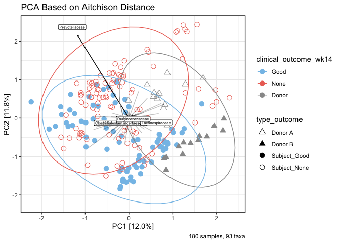

PCOA plot based on Aitchison distance
================
S. Pinto and D. Sajbenova
(March 2024)

## Load required packages

``` r
library( dplyr )
library( magrittr )
library( knitr )
library( tidyverse )
library( lattice )
library( latticeExtra)
library( gridExtra )
library( grid )
```

``` r
library( phyloseq )
library( microbiome )

library(phyloseq)
library(ggplot2)
#library(ggord)
library(compositions)
library(ape)

#install.packages(c("phyloseq", "microViz", "microbiome"))
library(phyloseq)
library(microViz)
library(microbiome)

# Define the colors for patients
library("viridis")
library(tibble)
```

## Load the data

Here we use the compositional count abundance dataset, because of the
requirements of the Dirichlet multinomial mixed model.

## Preprocessing of the data

``` r
# Aggregate to family level
physeq_mOTU = aggregate_taxa( physeq_mOTU, "family" )
physeq_mOTU
```

    ## phyloseq-class experiment-level object
    ## otu_table()   OTU Table:         [ 94 taxa and 207 samples ]
    ## sample_data() Sample Data:       [ 207 samples by 17 sample variables ]
    ## tax_table()   Taxonomy Table:    [ 94 taxa by 6 taxonomic ranks ]

``` r
# Store information in a dataframe
df = abundances( physeq_mOTU )
df.count = as.matrix( t( df ))
```

## PCA plot clusters of patients per donor

``` r
sample_data_df <- data.frame(sample_data(physeq_mOTU), stringsAsFactors = FALSE)
sample_data_df$clinical_outcome_wk14 <- as.character(sample_data_df$clinical_outcome_wk14)
# Replace NA values with "Donor" in the desired variable
sample_data_df$clinical_outcome_wk14 <- replace_na(sample_data_df$clinical_outcome_wk14, "Donor")
sample_data_df$Timepoint_Category <- factor(sample_data_df$timepoint.new, levels = c("Pre-FMT", "FMT", "Post-FMT", "Donor"))

sample_data_df$type = c( rep( "Subject", 180 ), rep( "Donor A", 13 ), rep( "Donor B", 14 ))
sample_data_df$type = as.factor( sample_data_df$type )

# Update the sample data in the phyloseq object
sample_data(physeq_mOTU) <- sample_data_df

pca.1.2 <- physeq_mOTU %>% 
  tax_transform("clr", rank = "unique") %>% 
  ord_calc(method = "PCA") %>%
  ord_plot(
    axes = c(1, 2),
    color = "clinical_outcome_wk14",
    #fill = "clinical_outcome_wk14",
    shape = "type",
    plot_taxa = c("Prevotellaceae","Ruminococcaceae", "Lachnospiraceae", "Clostridialesfam.incertaesedis"),
    size = 3
  ) +
  scale_color_manual(
    breaks = c("Good", "None", "Donor"),
    values = c("#85C1E9", "#EC7063", "#999999")
  ) +
    #scale_shape_manual(values=c(17, 15, 9, 19))+
  ggtitle("PCA Based on Aitchison Distance") +
  theme(text = element_text(size = 20),
    axis.text = element_text(size = 14)  # Set the size of the axis text
    ) +
  labs(caption = "180 samples, 93 taxa") +
  theme_bw() +
  ggplot2::stat_ellipse(
    ggplot2::aes( colour = clinical_outcome_wk14 )
  )


#pca.1.2 <- pca.1.2 + geom_path(aes(group = subject_id),
 #           arrow = arrow(length = unit(0.2, "inches")), color = "grey", size = 1) 

pca.1.2
```

<!-- -->

``` r
sample_data_df <- data.frame(sample_data(physeq_mOTU), stringsAsFactors = FALSE)
sample_data_df$clinical_outcome_wk14 <- as.character(sample_data_df$clinical_outcome_wk14)
# Replace NA values with "Donor" in the desired variable
sample_data_df$clinical_outcome_wk14 <- replace_na(sample_data_df$clinical_outcome_wk14, "Donor")
sample_data_df$Timepoint_Category <- factor(sample_data_df$timepoint.new, levels = c("Pre-FMT", "FMT", "Post-FMT", "Donor"))

sample_data_df$type = c( rep( "Subject", 180 ), rep( "Donor A", 13 ), rep( "Donor B", 14 ))
sample_data_df$type = as.factor( sample_data_df$type )

# Update the sample data in the phyloseq object
sample_data(physeq_mOTU) <- sample_data_df

pca.1.3 <- physeq_mOTU %>% 
  tax_transform("clr", rank = "unique") %>% 
  ord_calc(method = "PCA") %>%
  ord_plot(
    axes = c(1, 2),
    color = "clinical_outcome_wk14",
    #fill = "clinical_outcome_wk14",
    shape = "type",
    plot_taxa = c("Prevotellaceae"), # ,"Ruminococcaceae", "Lachnospiraceae", "Clostridialesfam.incertaesedis"
    size = 3
  ) +
  scale_color_manual(
    breaks = c("Good", "None", "Donor"),
    values = c("#85C1E9", "#EC7063", "#999999")
  ) +
    #scale_shape_manual(values=c(17, 15, 9, 19))+
  ggtitle("PCA Based on Aitchison Distance") +
  theme(text = element_text(size = 20),
    axis.text = element_text(size = 14)  # Set the size of the axis text
    ) +
  labs(caption = "180 samples, 93 taxa") +
  theme_bw() +
  ggplot2::stat_ellipse(
    ggplot2::aes( colour = clinical_outcome_wk14 )
  ) +
  facet_wrap(~treated_with_donor)  # Add facet for the "type" variable


#pca.1.3 <- pca.1.3 + geom_path(aes(group = subject_id),
 #           arrow = arrow(length = unit(0.2, "inches")), color = "grey", size = 1) 

pca.1.3
```

<!-- -->
