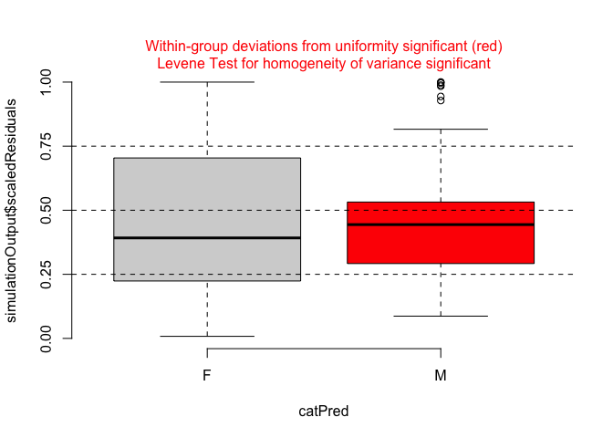
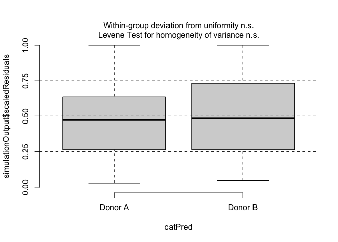
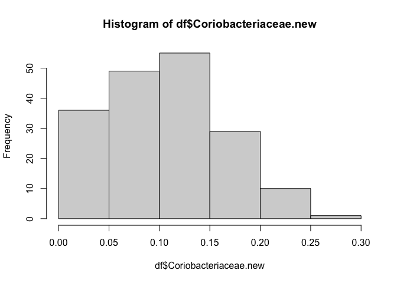
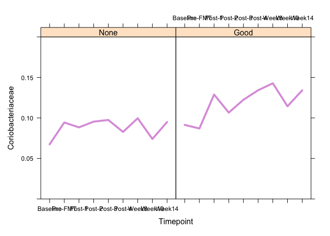
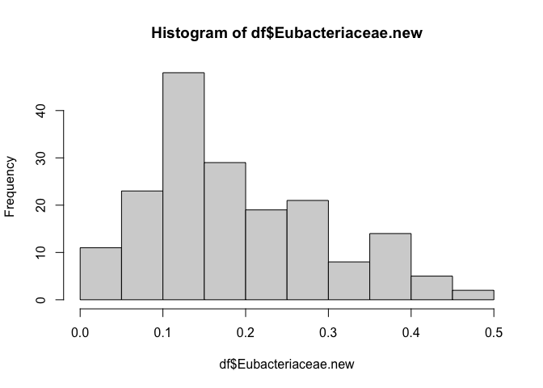
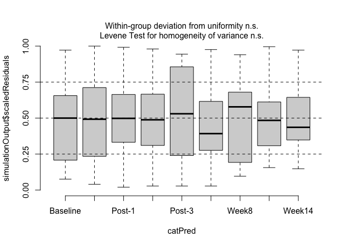
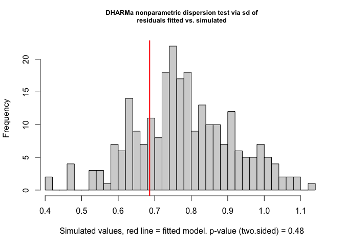
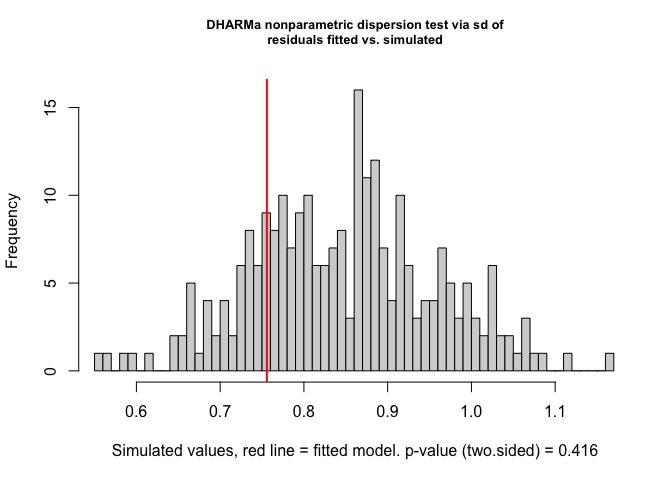

Top 10 families Mixed models
================
March 2024

## Load required packages

``` r
library( dplyr )
library( magrittr )
library( knitr )
library( tidyverse )
```

``` r
library( phyloseq )
library( microbiome )
library( microViz )
library( lattice )
library( latticeExtra )
library( nlme )
library( glmmTMB )
library( splines )
library( lme4 )
library( MuMIn ) 
library( aod )
library( DHARMa )
library( jtools )
library( dotwhisker )
```

``` r
library( broom )
library( broom.mixed )
library( dotwhisker )
library( tidyverse )
library( tibble )
```

## Load the data

Here we use the compositional count abundance dataset, else problems
with convergence occur.

## Preprocessing of the data

``` r
# Make compositional
physeq_mOTU = microbiome::transform(physeq_mOTU, "compositional")

# Aggregate to family level
physeq_mOTU = aggregate_taxa( physeq_mOTU, "family" )
physeq_mOTU
```

    ## phyloseq-class experiment-level object
    ## otu_table()   OTU Table:         [ 94 taxa and 207 samples ]
    ## sample_data() Sample Data:       [ 207 samples by 17 sample variables ]
    ## tax_table()   Taxonomy Table:    [ 94 taxa by 6 taxonomic ranks ]

``` r
# Remove donors from data
physeq_mOTU = subset_samples( physeq_mOTU, subject_id != "Donor A" )
physeq_mOTU = subset_samples( physeq_mOTU, subject_id != "Donor B" )

# make new class - Coriobacteriaceae
physeq_mOTU = merge_taxa2(physeq_mOTU, pattern = "_Coriobacteriaceae", name = "Coriobacteriaceae")
```

``` r
# Sample data
sample.data = as.data.frame(as.matrix(physeq_mOTU@sam_data))
sample.data$timepoint.new = as.factor(sample.data$timepoint.new)
sample.data$timepoint.new = factor(sample.data$timepoint.new, levels = c("Baseline", "Pre-FMT" , "Post-1", "Post-2", "Post-3", "Post-4", "Week8", "Week10", "Week14"))
sample.data$timepoint.new.num = as.numeric(sample.data$timepoint.new)
sample.data$clinical_outcome_wk14 = as.factor(sample.data$clinical_outcome_wk14)
sample.data$clinical_outcome_wk14 = factor(sample.data$clinical_outcome_wk14, levels = c("None", "Good"))
sample.data$sex = as.factor(sample.data$sex)
sample.data$age = as.numeric(sample.data$age)
sample.data$subject_id = as.factor(sample.data$subject_id)
sample.data$pretreatment = as.factor(sample.data$pretreatment)
sample.data$treated_with_donor = as.factor(sample.data$treated_with_donor)

# Abundance data
abund = as.data.frame(as.matrix(t(physeq_mOTU@otu_table)))

# Combine
df = data.frame(abund, sample.data)
```

# Bacteroidaceae

## Transform the data

``` r
hist( df$Bacteroidaceae )
```

<!-- -->

``` r
df$Bacteroidaceae.new = asin( sqrt( df$Bacteroidaceae ))
hist( df$Bacteroidaceae.new )
```

<!-- -->

``` r
sum( df$Bacteroidaceae.new == 0 ) / length( df$Bacteroidaceae.new ) # proportion of zeros
```

    ## [1] 0.02222222

``` r
# None responders
df.none = subset( df, clinical_outcome_wk14 == "None" ) # changed filter to subset

# Good responders
df.good = subset( df, clinical_outcome_wk14 == "Good" )
```

## Plot Bacteroidaceae

``` r
a = xyplot( Bacteroidaceae.new ~ timepoint.new | clinical_outcome_wk14, data = df.none, xlab = "Timepoint", ylab = "Relative abundance (transformed)", main="Bacteroidaceae", 
           panel = function( x, y ) {
             panel.average( x, y, horizontal = FALSE, col = "#EC7063", lwd = 4 )
           },
           key = list( space = "right", 
                      lines = list( col = c( "#EC7063", "#85C1E9" ), lty = c( 1, 1 ), lwd = 2 ),  # "#85C1E9"
                      text = list( c( "Non-Responders", "Responders" ))))

b = xyplot( Bacteroidaceae.new ~ timepoint.new | clinical_outcome_wk14, data = df.good, xlab = "Timepoint",
           panel = function( x, y ) {
             panel.average( x, y, horizontal = FALSE, col = "#85C1E9", lwd = 4, type = "l", lty = 1 )
           })

c = xyplot( Bacteroidaceae.new ~ timepoint.new | clinical_outcome_wk14, data = df.none, type = "p", col = "#EC7063" )

d = xyplot( Bacteroidaceae.new ~ timepoint.new | clinical_outcome_wk14, data = df.good, type = "p", col = "#85C1E9" )

Bacteroidaceae.plot = a + as.layer( b ) + as.layer( c ) + as.layer( d )
Bacteroidaceae.plot
```

<!-- -->

## Choose between the lmer and glmmTMB models Bacteroidaceae

We have used time as a numeric value and added a spline at knots = 7.

``` r
lme.int.Bacteroidaceae = lme4::lmer(Bacteroidaceae.new ~ sex + age + pretreatment + treated_with_donor + clinical_outcome_wk14 * ns(timepoint.new.num, knots = 7) + (1 | subject_id), data = df)

#lme.int.Bacteroidaceae = lme4::lmer(Bacteroidaceae.new ~ sex + age + pretreatment + treated_with_donor + clinical_outcome_wk14 * ns(timepoint.new.num, knots = 7) + (ns(timepoint.new.num, knots = 7) | subject_id), data = df)

glmm.int.Bacteroidaceae = glmmTMB(Bacteroidaceae.new ~ sex + age + pretreatment + treated_with_donor + clinical_outcome_wk14 * ns(timepoint.new.num, knots = 7) + (1 | subject_id), 
               family = gaussian, 
               data = df, 
               zi= ~ 1) 

#glmm.slope.Bacteroidaceae = glmmTMB(Bacteroidaceae.new ~ sex + age + pretreatment + treated_with_donor + clinical_outcome_wk14 * ns(timepoint.new.num, knots = 7) + (ns(timepoint.new.num, knots = 7) | subject_id), 
               #family = gaussian, 
               #data = df, 
               #zi= ~ 1) 

AICc(lme.int.Bacteroidaceae)
```

    ## [1] -274.0412

``` r
AICc(glmm.int.Bacteroidaceae) # lower
```

    ## [1] -328.5049

# Diagnostics Bacteroidaceae

``` r
lme.Bacteroidaceae.diag = DHARMa::simulateResiduals( lme.int.Bacteroidaceae )
plot( lme.Bacteroidaceae.diag )

plotResiduals( lme.Bacteroidaceae.diag, form = df$clinical_outcome_wk14 )
plotResiduals( lme.Bacteroidaceae.diag, form = df$timepoint.new )
plotResiduals( lme.Bacteroidaceae.diag, form = df$treated_with_donor )
plotResiduals( lme.Bacteroidaceae.diag, form = df$sex ) 
plotResiduals( lme.Bacteroidaceae.diag, form = df$age )
plotResiduals( lme.Bacteroidaceae.diag, form = df$pretreatment )

testZeroInflation( lme.Bacteroidaceae.diag )
testDispersion( lme.Bacteroidaceae.diag )

output1 = recalculateResiduals( lme.Bacteroidaceae.diag, group = df$timepoint.new )
testTemporalAutocorrelation( output1, time = unique( df$timepoint.new ))
```

LMM model was chosen due to slightly better diagnostics.

``` r
plot_summs( lme.int.Bacteroidaceae )
```

<!-- -->

``` r
wald.test( Sigma = vcov( lme.int.Bacteroidaceae ), b = fixef( lme.int.Bacteroidaceae ), Terms = 2 )$result # sex
```

    ## $chi2
    ##      chi2        df         P 
    ## 1.2508746 1.0000000 0.2633855

``` r
wald.test( Sigma = vcov( lme.int.Bacteroidaceae ), b = fixef( lme.int.Bacteroidaceae ), Terms = 3 )$result # age
```

    ## $chi2
    ##      chi2        df         P 
    ## 0.2390284 1.0000000 0.6249087

``` r
wald.test( Sigma = vcov( lme.int.Bacteroidaceae ), b = fixef( lme.int.Bacteroidaceae ), Terms = 4 )$result # pretreatment
```

    ## $chi2
    ##      chi2        df         P 
    ## 1.0103796 1.0000000 0.3148119

``` r
wald.test( Sigma = vcov( lme.int.Bacteroidaceae ), b = fixef( lme.int.Bacteroidaceae ), Terms = 5 )$result # donor
```

    ## $chi2
    ##       chi2         df          P 
    ## 0.08342805 1.00000000 0.77270448

``` r
wald.test( Sigma = vcov( lme.int.Bacteroidaceae ), b = fixef( lme.int.Bacteroidaceae ), Terms = c( 6, 9, 10 ))$result # clinical outcome wk14
```

    ## $chi2
    ##       chi2         df          P 
    ## 7.72418680 3.00000000 0.05206948

Satistical Tests: Use statistical tests such as the likelihood ratio
test or information criteria (e.g., AIC, BIC) to compare model fit. A
significant improvement in model fit when adding a variable may indicate
its importance as a confounder.

Magnitude of Change: Large changes in the magnitude of the coefficient
of the independent variable when adding a potential confounder may
indicate confounding. “Large” is subjective and can vary, but a common
rule of thumb is a change of around 10% or more. Pay attention to the
direction of the change. If the sign of the coefficient changes (e.g.,
from positive to negative or vice versa), it suggests a significant
impact.

Variance Inflation Factor (VIF): Assess collinearity using the VIF. A
VIF greater than 5 or 10 is often considered an indicator of potential
multicollinearity, which can affect the stability and reliability of
coefficient estimates. In addition to VIF, you can also check condition
indices. Values above 30 may suggest potential collinearity issues.

``` r
library(lmtest)
```

    ## Loading required package: zoo

    ## 
    ## Attaching package: 'zoo'

    ## The following objects are masked from 'package:base':
    ## 
    ##     as.Date, as.Date.numeric

``` r
full.model = lme4::lmer(Bacteroidaceae.new ~ sex + age + pretreatment + treated_with_donor + clinical_outcome_wk14 * ns(timepoint.new.num, knots = 7) + (1 | subject_id), data = df)
summary(full.model )
```

    ## Linear mixed model fit by REML ['lmerMod']
    ## Formula: Bacteroidaceae.new ~ sex + age + pretreatment + treated_with_donor +  
    ##     clinical_outcome_wk14 * ns(timepoint.new.num, knots = 7) +  
    ##     (1 | subject_id)
    ##    Data: df
    ## 
    ## REML criterion at convergence: -299.9
    ## 
    ## Scaled residuals: 
    ##     Min      1Q  Median      3Q     Max 
    ## -2.8076 -0.4916 -0.1037  0.4400  4.1270 
    ## 
    ## Random effects:
    ##  Groups     Name        Variance Std.Dev.
    ##  subject_id (Intercept) 0.005987 0.07737 
    ##  Residual               0.006560 0.08099 
    ## Number of obs: 180, groups:  subject_id, 24
    ## 
    ## Fixed effects:
    ##                                                               Estimate
    ## (Intercept)                                                  0.3181303
    ## sexM                                                         0.0418067
    ## age                                                         -0.0005585
    ## pretreatmentplacebo                                         -0.0368988
    ## treated_with_donorDonor B                                   -0.0114765
    ## clinical_outcome_wk14Good                                    0.0687935
    ## ns(timepoint.new.num, knots = 7)1                           -0.1770330
    ## ns(timepoint.new.num, knots = 7)2                            0.0115091
    ## clinical_outcome_wk14Good:ns(timepoint.new.num, knots = 7)1  0.0805297
    ## clinical_outcome_wk14Good:ns(timepoint.new.num, knots = 7)2  0.0451214
    ##                                                             Std. Error t value
    ## (Intercept)                                                  0.0605815   5.251
    ## sexM                                                         0.0373799   1.118
    ## age                                                          0.0011424  -0.489
    ## pretreatmentplacebo                                          0.0367088  -1.005
    ## treated_with_donorDonor B                                    0.0397333  -0.289
    ## clinical_outcome_wk14Good                                    0.0483895   1.422
    ## ns(timepoint.new.num, knots = 7)1                            0.0450420  -3.930
    ## ns(timepoint.new.num, knots = 7)2                            0.0344101   0.334
    ## clinical_outcome_wk14Good:ns(timepoint.new.num, knots = 7)1  0.0670620   1.201
    ## clinical_outcome_wk14Good:ns(timepoint.new.num, knots = 7)2  0.0461430   0.978
    ## 
    ## Correlation of Fixed Effects:
    ##                  (Intr) sexM   age    prtrtm tr__DB c__14G n(..,k=7)1
    ## sexM             -0.313                                              
    ## age              -0.767 -0.008                                       
    ## prtrtmntplc      -0.012  0.046 -0.339                                
    ## trtd_wth_DB      -0.170 -0.303  0.069  0.028                         
    ## clncl_t_14G      -0.197  0.321 -0.090  0.029 -0.434                  
    ## ns(..,k=7)1      -0.230 -0.009 -0.013  0.037 -0.039  0.317           
    ## ns(..,k=7)2       0.039  0.031 -0.015  0.046 -0.030 -0.035  0.019    
    ## c__14G:(..,k=7)1  0.154  0.006  0.009 -0.025  0.026 -0.499 -0.672    
    ## c__14G:(..,k=7)2 -0.029 -0.023  0.012 -0.034  0.022  0.050 -0.014    
    ##                  n(..,k=7)2 c__14G:(..,k=7)1
    ## sexM                                        
    ## age                                         
    ## prtrtmntplc                                 
    ## trtd_wth_DB                                 
    ## clncl_t_14G                                 
    ## ns(..,k=7)1                                 
    ## ns(..,k=7)2                                 
    ## c__14G:(..,k=7)1 -0.013                     
    ## c__14G:(..,k=7)2 -0.746     -0.028

``` r
AIC(full.model)
```

    ## [1] -275.9095

``` r
initial.model = lme4::lmer(Bacteroidaceae.new ~ clinical_outcome_wk14 * ns(timepoint.new.num, knots = 7) + (1 | subject_id), data = df)
summary(initial.model )
```

    ## Linear mixed model fit by REML ['lmerMod']
    ## Formula: Bacteroidaceae.new ~ clinical_outcome_wk14 * ns(timepoint.new.num,  
    ##     knots = 7) + (1 | subject_id)
    ##    Data: df
    ## 
    ## REML criterion at convergence: -322.8
    ## 
    ## Scaled residuals: 
    ##     Min      1Q  Median      3Q     Max 
    ## -2.7363 -0.5249 -0.1176  0.3959  4.1853 
    ## 
    ## Random effects:
    ##  Groups     Name        Variance Std.Dev.
    ##  subject_id (Intercept) 0.005608 0.07489 
    ##  Residual               0.006576 0.08109 
    ## Number of obs: 180, groups:  subject_id, 24
    ## 
    ## Fixed effects:
    ##                                                             Estimate Std. Error
    ## (Intercept)                                                  0.29767    0.02605
    ## clinical_outcome_wk14Good                                    0.05130    0.04163
    ## ns(timepoint.new.num, knots = 7)1                           -0.17427    0.04499
    ## ns(timepoint.new.num, knots = 7)2                            0.01199    0.03438
    ## clinical_outcome_wk14Good:ns(timepoint.new.num, knots = 7)1  0.07776    0.06707
    ## clinical_outcome_wk14Good:ns(timepoint.new.num, knots = 7)2  0.04464    0.04614
    ##                                                             t value
    ## (Intercept)                                                  11.427
    ## clinical_outcome_wk14Good                                     1.232
    ## ns(timepoint.new.num, knots = 7)1                            -3.873
    ## ns(timepoint.new.num, knots = 7)2                             0.349
    ## clinical_outcome_wk14Good:ns(timepoint.new.num, knots = 7)1   1.159
    ## clinical_outcome_wk14Good:ns(timepoint.new.num, knots = 7)2   0.967
    ## 
    ## Correlation of Fixed Effects:
    ##                  (Intr) c__14G n(..,k=7)1 n(..,k=7)2 c__14G:(..,k=7)1
    ## clncl_t_14G      -0.626                                              
    ## ns(..,k=7)1      -0.566  0.354                                       
    ## ns(..,k=7)2       0.101 -0.063  0.016                                
    ## c__14G:(..,k=7)1  0.380 -0.571 -0.671     -0.011                     
    ## c__14G:(..,k=7)2 -0.075  0.075 -0.012     -0.745     -0.030

``` r
AIC(initial.model)
```

    ## [1] -306.8067

``` r
sex.model = lme4::lmer(Bacteroidaceae.new ~ sex + clinical_outcome_wk14 * ns(timepoint.new.num, knots = 7) + (1 | subject_id), data = df)
summary(sex.model )
```

    ## Linear mixed model fit by REML ['lmerMod']
    ## Formula: 
    ## Bacteroidaceae.new ~ sex + clinical_outcome_wk14 * ns(timepoint.new.num,  
    ##     knots = 7) + (1 | subject_id)
    ##    Data: df
    ## 
    ## REML criterion at convergence: -319.4
    ## 
    ## Scaled residuals: 
    ##     Min      1Q  Median      3Q     Max 
    ## -2.7719 -0.4864 -0.0942  0.4084  4.1582 
    ## 
    ## Random effects:
    ##  Groups     Name        Variance Std.Dev.
    ##  subject_id (Intercept) 0.005535 0.07440 
    ##  Residual               0.006567 0.08104 
    ## Number of obs: 180, groups:  subject_id, 24
    ## 
    ## Fixed effects:
    ##                                                             Estimate Std. Error
    ## (Intercept)                                                  0.27260    0.03325
    ## sexM                                                         0.04147    0.03438
    ## clinical_outcome_wk14Good                                    0.06255    0.04250
    ## ns(timepoint.new.num, knots = 7)1                           -0.17560    0.04497
    ## ns(timepoint.new.num, knots = 7)2                            0.01288    0.03436
    ## clinical_outcome_wk14Good:ns(timepoint.new.num, knots = 7)1  0.07909    0.06703
    ## clinical_outcome_wk14Good:ns(timepoint.new.num, knots = 7)2  0.04375    0.04612
    ##                                                             t value
    ## (Intercept)                                                   8.198
    ## sexM                                                          1.206
    ## clinical_outcome_wk14Good                                     1.472
    ## ns(timepoint.new.num, knots = 7)1                            -3.905
    ## ns(timepoint.new.num, knots = 7)2                             0.375
    ## clinical_outcome_wk14Good:ns(timepoint.new.num, knots = 7)1   1.180
    ## clinical_outcome_wk14Good:ns(timepoint.new.num, knots = 7)2   0.949
    ## 
    ## Correlation of Fixed Effects:
    ##                  (Intr) sexM   c__14G n(..,k=7)1 n(..,k=7)2 c__14G:(..,k=7)1
    ## sexM             -0.625                                                     
    ## clncl_t_14G      -0.614  0.220                                              
    ## ns(..,k=7)1      -0.428 -0.025  0.341                                       
    ## ns(..,k=7)2       0.066  0.022 -0.057  0.016                                
    ## c__14G:(..,k=7)1  0.287  0.017 -0.555 -0.671     -0.011                     
    ## c__14G:(..,k=7)2 -0.049 -0.016  0.069 -0.012     -0.745     -0.030

``` r
AIC(initial.model) - AIC(sex.model)
```

    ## [1] -5.449429

``` r
lr_test.sex <- lrtest(initial.model, sex.model) # not significant
lr_test.sex
```

    ## Likelihood ratio test
    ## 
    ## Model 1: Bacteroidaceae.new ~ clinical_outcome_wk14 * ns(timepoint.new.num, 
    ##     knots = 7) + (1 | subject_id)
    ## Model 2: Bacteroidaceae.new ~ sex + clinical_outcome_wk14 * ns(timepoint.new.num, 
    ##     knots = 7) + (1 | subject_id)
    ##   #Df LogLik Df  Chisq Pr(>Chisq)  
    ## 1   8 161.40                       
    ## 2   9 159.68  1 3.4494    0.06327 .
    ## ---
    ## Signif. codes:  0 '***' 0.001 '**' 0.01 '*' 0.05 '.' 0.1 ' ' 1

``` r
# Extract coefficients
coef_initial <- coef(initial.model)
coef_full <- coef(sex.model)
coef_initial_sex <- coef_initial[["subject_id"]][["clinical_outcome_wk14Good"]][1]
coef_full_sex <- coef_full[["subject_id"]][["clinical_outcome_wk14Good"]][1]
coefficient_changes.sex  <- coef_full_sex - coef_initial_sex # 0.01124904
coefficient_change_percentage.sex = (coef_full_sex - coef_initial_sex) / coef_initial_sex * 100 # 22%
coefficient_change_percentage.sex
```

    ## [1] 21.92806

``` r
# Check collinearity
#vif_values.sex <- car::vif(sex.model)
#vif_values.sex

age.model = lme4::lmer(Bacteroidaceae.new ~  age + clinical_outcome_wk14 * ns(timepoint.new.num, knots = 7) + (1 | subject_id), data = df)
summary(age.model )
```

    ## Linear mixed model fit by REML ['lmerMod']
    ## Formula: 
    ## Bacteroidaceae.new ~ age + clinical_outcome_wk14 * ns(timepoint.new.num,  
    ##     knots = 7) + (1 | subject_id)
    ##    Data: df
    ## 
    ## REML criterion at convergence: -311.8
    ## 
    ## Scaled residuals: 
    ##     Min      1Q  Median      3Q     Max 
    ## -2.7542 -0.5037 -0.1129  0.4084  4.1703 
    ## 
    ## Random effects:
    ##  Groups     Name        Variance Std.Dev.
    ##  subject_id (Intercept) 0.005692 0.07544 
    ##  Residual               0.006571 0.08106 
    ## Number of obs: 180, groups:  subject_id, 24
    ## 
    ## Fixed effects:
    ##                                                               Estimate
    ## (Intercept)                                                  0.3410933
    ## age                                                         -0.0009648
    ## clinical_outcome_wk14Good                                    0.0537624
    ## ns(timepoint.new.num, knots = 7)1                           -0.1744481
    ## ns(timepoint.new.num, knots = 7)2                            0.0119428
    ## clinical_outcome_wk14Good:ns(timepoint.new.num, knots = 7)1  0.0779448
    ## clinical_outcome_wk14Good:ns(timepoint.new.num, knots = 7)2  0.0446877
    ##                                                             Std. Error t value
    ## (Intercept)                                                  0.0539108   6.327
    ## age                                                          0.0010473  -0.921
    ## clinical_outcome_wk14Good                                    0.0418878   1.283
    ## ns(timepoint.new.num, knots = 7)1                            0.0449789  -3.878
    ## ns(timepoint.new.num, knots = 7)2                            0.0343682   0.347
    ## clinical_outcome_wk14Good:ns(timepoint.new.num, knots = 7)1  0.0670510   1.162
    ## clinical_outcome_wk14Good:ns(timepoint.new.num, knots = 7)2  0.0461292   0.969
    ## 
    ## Correlation of Fixed Effects:
    ##                  (Intr) age    c__14G n(..,k=7)1 n(..,k=7)2 c__14G:(..,k=7)1
    ## age              -0.874                                                     
    ## clncl_t_14G      -0.247 -0.064                                              
    ## ns(..,k=7)1      -0.277  0.003  0.352                                       
    ## ns(..,k=7)2       0.047  0.002 -0.063  0.016                                
    ## c__14G:(..,k=7)1  0.186 -0.002 -0.567 -0.671     -0.011                     
    ## c__14G:(..,k=7)2 -0.035 -0.002  0.074 -0.012     -0.745     -0.030

``` r
AIC(initial.model) - AIC(age.model)
```

    ## [1] -13.0382

``` r
lr_test.age <- lrtest(initial.model, age.model)
lr_test.age
```

    ## Likelihood ratio test
    ## 
    ## Model 1: Bacteroidaceae.new ~ clinical_outcome_wk14 * ns(timepoint.new.num, 
    ##     knots = 7) + (1 | subject_id)
    ## Model 2: Bacteroidaceae.new ~ age + clinical_outcome_wk14 * ns(timepoint.new.num, 
    ##     knots = 7) + (1 | subject_id)
    ##   #Df LogLik Df  Chisq Pr(>Chisq)    
    ## 1   8 161.40                         
    ## 2   9 155.88  1 11.038  0.0008925 ***
    ## ---
    ## Signif. codes:  0 '***' 0.001 '**' 0.01 '*' 0.05 '.' 0.1 ' ' 1

``` r
# Extract coefficients
coef_initial <- coef(initial.model)
coef_full <- coef(age.model)
coef_initial_age <- coef_initial[["subject_id"]][["clinical_outcome_wk14Good"]][1]
coef_full_age <- coef_full[["subject_id"]][["clinical_outcome_wk14Good"]][1]
coefficient_changes.age  <- coef_full_age - coef_initial_age # 0.01124904
coefficient_change_percentage.age = (coef_full_age - coef_initial_age) / coef_initial_age * 100 
coefficient_change_percentage.age
```

    ## [1] 4.80057

``` r
# Check collinearity
#vif_values.age <- car::vif(age.model)
#vif_values.age

pretreatment.model = lme4::lmer(Bacteroidaceae.new ~ pretreatment + clinical_outcome_wk14 * ns(timepoint.new.num, knots = 7) + (1 | subject_id), data = df)
summary(pretreatment.model )
```

    ## Linear mixed model fit by REML ['lmerMod']
    ## Formula: 
    ## Bacteroidaceae.new ~ pretreatment + clinical_outcome_wk14 * ns(timepoint.new.num,  
    ##     knots = 7) + (1 | subject_id)
    ##    Data: df
    ## 
    ## REML criterion at convergence: -319.7
    ## 
    ## Scaled residuals: 
    ##     Min      1Q  Median      3Q     Max 
    ## -2.7822 -0.5012 -0.1093  0.4221  4.1457 
    ## 
    ## Random effects:
    ##  Groups     Name        Variance Std.Dev.
    ##  subject_id (Intercept) 0.005429 0.07368 
    ##  Residual               0.006566 0.08103 
    ## Number of obs: 180, groups:  subject_id, 24
    ## 
    ## Fixed effects:
    ##                                                              Estimate
    ## (Intercept)                                                  0.318064
    ## pretreatmentplacebo                                         -0.044749
    ## clinical_outcome_wk14Good                                    0.050798
    ## ns(timepoint.new.num, knots = 7)1                           -0.176584
    ## ns(timepoint.new.num, knots = 7)2                            0.009867
    ## clinical_outcome_wk14Good:ns(timepoint.new.num, knots = 7)1  0.080081
    ## clinical_outcome_wk14Good:ns(timepoint.new.num, knots = 7)2  0.046763
    ##                                                             Std. Error t value
    ## (Intercept)                                                   0.029866  10.650
    ## pretreatmentplacebo                                           0.033013  -1.355
    ## clinical_outcome_wk14Good                                     0.041236   1.232
    ## ns(timepoint.new.num, knots = 7)1                             0.044979  -3.926
    ## ns(timepoint.new.num, knots = 7)2                             0.034382   0.287
    ## clinical_outcome_wk14Good:ns(timepoint.new.num, knots = 7)1   0.067039   1.195
    ## clinical_outcome_wk14Good:ns(timepoint.new.num, knots = 7)2   0.046132   1.014
    ## 
    ## Correlation of Fixed Effects:
    ##                  (Intr) prtrtm c__14G n(..,k=7)1 n(..,k=7)2 c__14G:(..,k=7)1
    ## prtrtmntplc      -0.503                                                     
    ## clncl_t_14G      -0.545  0.009                                              
    ## ns(..,k=7)1      -0.513  0.039  0.358                                       
    ## ns(..,k=7)2       0.065  0.045 -0.063  0.018                                
    ## c__14G:(..,k=7)1  0.344 -0.026 -0.576 -0.671     -0.012                     
    ## c__14G:(..,k=7)2 -0.049 -0.034  0.075 -0.013     -0.745     -0.029

``` r
AIC(initial.model) - AIC(pretreatment.model)
```

    ## [1] -5.1549

``` r
lr_test.pretreatment <- lrtest(initial.model, pretreatment.model)
lr_test.pretreatment
```

    ## Likelihood ratio test
    ## 
    ## Model 1: Bacteroidaceae.new ~ clinical_outcome_wk14 * ns(timepoint.new.num, 
    ##     knots = 7) + (1 | subject_id)
    ## Model 2: Bacteroidaceae.new ~ pretreatment + clinical_outcome_wk14 * ns(timepoint.new.num, 
    ##     knots = 7) + (1 | subject_id)
    ##   #Df LogLik Df  Chisq Pr(>Chisq)  
    ## 1   8 161.40                       
    ## 2   9 159.83  1 3.1549     0.0757 .
    ## ---
    ## Signif. codes:  0 '***' 0.001 '**' 0.01 '*' 0.05 '.' 0.1 ' ' 1

``` r
# Extract coefficients
coef_initial <- coef(initial.model)
coef_full <- coef(pretreatment.model)
coef_initial_pretreatment <- coef_initial[["subject_id"]][["clinical_outcome_wk14Good"]][1]
coef_full_pretreatment <- coef_full[["subject_id"]][["clinical_outcome_wk14Good"]][1]
coefficient_changes.pretreatment  <- coef_full_pretreatment - coef_initial_pretreatment # 0.01124904
coefficient_change_percentpretreatment.pretreatment = (coef_full_pretreatment - coef_initial_pretreatment) / coef_initial_pretreatment * 100
coefficient_change_percentpretreatment.pretreatment
```

    ## [1] -0.978607

``` r
# Check collinearity
#vif_values.pretreatment <- car::vif(pretreatment.model)
#vif_values.pretreatment

donor.model = lme4::lmer(Bacteroidaceae.new ~ treated_with_donor + clinical_outcome_wk14 * ns(timepoint.new.num, knots = 7) + (1 | subject_id), data = df)
summary(donor.model )
```

    ## Linear mixed model fit by REML ['lmerMod']
    ## Formula: Bacteroidaceae.new ~ treated_with_donor + clinical_outcome_wk14 *  
    ##     ns(timepoint.new.num, knots = 7) + (1 | subject_id)
    ##    Data: df
    ## 
    ## REML criterion at convergence: -318.1
    ## 
    ## Scaled residuals: 
    ##     Min      1Q  Median      3Q     Max 
    ## -2.7287 -0.5253 -0.1142  0.4055  4.1952 
    ## 
    ## Random effects:
    ##  Groups     Name        Variance Std.Dev.
    ##  subject_id (Intercept) 0.005936 0.07704 
    ##  Residual               0.006573 0.08107 
    ## Number of obs: 180, groups:  subject_id, 24
    ## 
    ## Fixed effects:
    ##                                                              Estimate
    ## (Intercept)                                                  0.295390
    ## treated_with_donorDonor B                                    0.006773
    ## clinical_outcome_wk14Good                                    0.048316
    ## ns(timepoint.new.num, knots = 7)1                           -0.174775
    ## ns(timepoint.new.num, knots = 7)2                            0.011898
    ## clinical_outcome_wk14Good:ns(timepoint.new.num, knots = 7)1  0.078272
    ## clinical_outcome_wk14Good:ns(timepoint.new.num, knots = 7)2  0.044732
    ##                                                             Std. Error t value
    ## (Intercept)                                                   0.029248  10.100
    ## treated_with_donorDonor B                                     0.037538   0.180
    ## clinical_outcome_wk14Good                                     0.045514   1.062
    ## ns(timepoint.new.num, knots = 7)1                             0.045051  -3.880
    ## ns(timepoint.new.num, knots = 7)2                             0.034392   0.346
    ## clinical_outcome_wk14Good:ns(timepoint.new.num, knots = 7)1   0.067106   1.166
    ## clinical_outcome_wk14Good:ns(timepoint.new.num, knots = 7)2   0.046151   0.969
    ## 
    ## Correlation of Fixed Effects:
    ##                  (Intr) tr__DB c__14G n(..,k=7)1 n(..,k=7)2 c__14G:(..,k=7)1
    ## trtd_wth_DB      -0.426                                                     
    ## clncl_t_14G      -0.369 -0.368                                              
    ## ns(..,k=7)1      -0.484 -0.046  0.341                                       
    ## ns(..,k=7)2       0.100 -0.024 -0.049  0.018                                
    ## c__14G:(..,k=7)1  0.325  0.031 -0.533 -0.671     -0.012                     
    ## c__14G:(..,k=7)2 -0.075  0.018  0.062 -0.013     -0.745     -0.029

``` r
AIC(initial.model) - AIC(donor.model)
```

    ## [1] -6.718906

``` r
lr_test.treated_with_donor <- lrtest(initial.model, donor.model)
lr_test.treated_with_donor
```

    ## Likelihood ratio test
    ## 
    ## Model 1: Bacteroidaceae.new ~ clinical_outcome_wk14 * ns(timepoint.new.num, 
    ##     knots = 7) + (1 | subject_id)
    ## Model 2: Bacteroidaceae.new ~ treated_with_donor + clinical_outcome_wk14 * 
    ##     ns(timepoint.new.num, knots = 7) + (1 | subject_id)
    ##   #Df LogLik Df  Chisq Pr(>Chisq)  
    ## 1   8 161.40                       
    ## 2   9 159.04  1 4.7189    0.02983 *
    ## ---
    ## Signif. codes:  0 '***' 0.001 '**' 0.01 '*' 0.05 '.' 0.1 ' ' 1

``` r
# Extract coefficients
coef_initial <- coef(initial.model)
coef_full <- coef(donor.model)
coef_initial_donor <- coef_initial[["subject_id"]][["clinical_outcome_wk14Good"]][1]
coef_full_donor <- coef_full[["subject_id"]][["clinical_outcome_wk14Good"]][1]
coefficient_changes.donor  <- coef_full_donor - coef_initial_donor # 0.01124904
coefficient_change_percentdonor.donor = (coef_full_donor - coef_initial_donor) / coef_initial_donor * 100
coefficient_change_percentdonor.donor
```

    ## [1] -5.816504

``` r
# Check collinearity
#vif_values.treated_with_donor  <- car::vif(donor.model)
#vif_values.treated_with_donor
```

``` r
lme.int.Bacteroidaceae = lme4::lmer(Bacteroidaceae.new ~ sex + age + treated_with_donor + clinical_outcome_wk14 * ns(timepoint.new.num, knots = 7) + (1 | subject_id), data = df)
summary(lme.int.Bacteroidaceae )
```

    ## Linear mixed model fit by REML ['lmerMod']
    ## Formula: 
    ## Bacteroidaceae.new ~ sex + age + treated_with_donor + clinical_outcome_wk14 *  
    ##     ns(timepoint.new.num, knots = 7) + (1 | subject_id)
    ##    Data: df
    ## 
    ## REML criterion at convergence: -303.7
    ## 
    ## Scaled residuals: 
    ##     Min      1Q  Median      3Q     Max 
    ## -2.7849 -0.4938 -0.1047  0.4107  4.1468 
    ## 
    ## Random effects:
    ##  Groups     Name        Variance Std.Dev.
    ##  subject_id (Intercept) 0.005956 0.07718 
    ##  Residual               0.006563 0.08102 
    ## Number of obs: 180, groups:  subject_id, 24
    ## 
    ## Fixed effects:
    ##                                                               Estimate
    ## (Intercept)                                                  0.3173974
    ## sexM                                                         0.0435400
    ## age                                                         -0.0009475
    ## treated_with_donorDonor B                                   -0.0103622
    ## clinical_outcome_wk14Good                                    0.0701793
    ## ns(timepoint.new.num, knots = 7)1                           -0.1753508
    ## ns(timepoint.new.num, knots = 7)2                            0.0130927
    ## clinical_outcome_wk14Good:ns(timepoint.new.num, knots = 7)1  0.0788474
    ## clinical_outcome_wk14Good:ns(timepoint.new.num, knots = 7)2  0.0435378
    ##                                                             Std. Error t value
    ## (Intercept)                                                  0.0604548   5.250
    ## sexM                                                         0.0372600   1.169
    ## age                                                          0.0010724  -0.883
    ## treated_with_donorDonor B                                    0.0396315  -0.261
    ## clinical_outcome_wk14Good                                    0.0482947   1.453
    ## ns(timepoint.new.num, knots = 7)1                            0.0450227  -3.895
    ## ns(timepoint.new.num, knots = 7)2                            0.0343832   0.381
    ## clinical_outcome_wk14Good:ns(timepoint.new.num, knots = 7)1  0.0670600   1.176
    ## clinical_outcome_wk14Good:ns(timepoint.new.num, knots = 7)2  0.0461291   0.944
    ## 
    ## Correlation of Fixed Effects:
    ##                  (Intr) sexM   age    tr__DB c__14G n(..,k=7)1 n(..,k=7)2
    ## sexM             -0.313                                                  
    ## age              -0.820  0.008                                           
    ## trtd_wth_DB      -0.170 -0.305  0.083                                    
    ## clncl_t_14G      -0.197  0.320 -0.085 -0.435                             
    ## ns(..,k=7)1      -0.230 -0.011 -0.001 -0.040  0.317                      
    ## ns(..,k=7)2       0.039  0.030  0.000 -0.031 -0.037  0.017               
    ## c__14G:(..,k=7)1  0.154  0.008  0.000  0.027 -0.500 -0.671     -0.012    
    ## c__14G:(..,k=7)2 -0.029 -0.022  0.000  0.023  0.051 -0.013     -0.745    
    ##                  c__14G:(..,k=7)1
    ## sexM                             
    ## age                              
    ## trtd_wth_DB                      
    ## clncl_t_14G                      
    ## ns(..,k=7)1                      
    ## ns(..,k=7)2                      
    ## c__14G:(..,k=7)1                 
    ## c__14G:(..,k=7)2 -0.029

``` r
plot_summs( lme.int.Bacteroidaceae )
```

<!-- -->

``` r
wald.test( Sigma = vcov( lme.int.Bacteroidaceae ), b = fixef( lme.int.Bacteroidaceae ), Terms = 2 )$result # sex
```

    ## $chi2
    ##      chi2        df         P 
    ## 1.3654999 1.0000000 0.2425866

``` r
wald.test( Sigma = vcov( lme.int.Bacteroidaceae ), b = fixef( lme.int.Bacteroidaceae ), Terms = 3 )$result # age
```

    ## $chi2
    ##      chi2        df         P 
    ## 0.7805204 1.0000000 0.3769820

``` r
#wald.test( Sigma = vcov( lme.int.Bacteroidaceae ), b = fixef( lme.int.Bacteroidaceae ), Terms = 4 )$result # pretreatment
wald.test( Sigma = vcov( lme.int.Bacteroidaceae ), b = fixef( lme.int.Bacteroidaceae ), Terms = 4 )$result # donor
```

    ## $chi2
    ##       chi2         df          P 
    ## 0.06836323 1.00000000 0.79373499

``` r
wald.test( Sigma = vcov( lme.int.Bacteroidaceae ), b = fixef( lme.int.Bacteroidaceae ), Terms = c( 5, 8, 9 ))$result # clinical outcome wk14
```

    ## $chi2
    ##       chi2         df          P 
    ## 7.70978484 3.00000000 0.05240625

# Bacteroidalesfam.incertaesedis

``` r
sum(df$Bacteroidalesfam.incertaesedis == 0) / length(df$Bacteroidalesfam.incertaesedis)
```

    ## [1] 0.3277778

``` r
xyplot(Bacteroidalesfam.incertaesedis ~ timepoint.new | clinical_outcome_wk14, data = df, xlab = "Bacteroidalesfam.incertaesedis", ylab = "Bifidobacteriaceae", ylim = c(0, 0.05),
           panel = function(x, y) {
            panel.average(x, y, horizontal = FALSE, col = "plum", lwd = 4)
       })
```

<!-- -->

``` r
hist(df$Bacteroidalesfam.incertaesedis)
```

<!-- -->

``` r
df$Bacteroidalesfam.incertaesedis.new = asin(sqrt(df$Bacteroidalesfam.incertaesedis))
hist(df$Bacteroidalesfam.incertaesedis.new)
```

<!-- -->

``` r
xyplot(Bacteroidalesfam.incertaesedis.new ~ timepoint.new | clinical_outcome_wk14, data = df, xlab = "Bacteroidalesfam.incertaesedis", ylab = "Bifidobacteriaceae", ylim = c(0, 0.15),
           panel = function(x, y) {
            panel.average(x, y, horizontal = FALSE, col = "plum", lwd = 4)
       })
```

<!-- -->

``` r
lme.int.Bacteroidalesfam.incertaesedis = lmer(Bacteroidalesfam.incertaesedis.new ~ sex + age + pretreatment + treated_with_donor + clinical_outcome_wk14 * ns(timepoint.new.num, knots = 7) + (1 | subject_id), data = df)

#lme.slope.Bacteroidalesfam.incertaesedis = lmer(Bacteroidalesfam.incertaesedis.new ~ sex + age + pretreatment + treated_with_donor + clinical_outcome_wk14 * ns(timepoint.new.num, knots = 7) + (ns(timepoint.new.num, knots = 7) | subject_id), data = df)

glmm.int.Bacteroidalesfam.incertaesedis = glmmTMB(Bacteroidalesfam.incertaesedis.new ~ sex + age + pretreatment + treated_with_donor + clinical_outcome_wk14 * ns(timepoint.new.num, knots = 7) + (1 | subject_id), 
               family = gaussian, 
               data = df, 
               zi= ~ 1) # ~ clinical_outcome_wk14

#glmm.slope.Bacteroidalesfam.incertaesedis = glmmTMB(Bacteroidalesfam.incertaesedis.new ~ sex + age + pretreatment + treated_with_donor + clinical_outcome_wk14 * ns(timepoint.new.num, knots = 7) + (ns(timepoint.new.num, knots = 7) | subject_id), 
               #family = gaussian, 
               #data = df, 
               #zi= ~ clinical_outcome_wk14) 

AICc(lme.int.Bacteroidalesfam.incertaesedis)
```

    ## [1] -401.876

``` r
AICc(glmm.int.Bacteroidalesfam.incertaesedis) # lower
```

    ## [1] -473.2529

``` r
# diagnostics zigmm
glmm.Bacteroidalesfam.incertaesedis.diag = DHARMa::simulateResiduals(glmm.int.Bacteroidalesfam.incertaesedis)

plot(glmm.Bacteroidalesfam.incertaesedis.diag)
```

    ## qu = 0.75, log(sigma) = -1.144411 : outer Newton did not converge fully.

<!-- -->

``` r
plotResiduals(glmm.Bacteroidalesfam.incertaesedis.diag, form = df$clinical_outcome_wk14)
```

<!-- -->

``` r
plotResiduals(glmm.Bacteroidalesfam.incertaesedis.diag, form = df$timepoint.new)
```

<!-- -->

``` r
plotResiduals(glmm.Bacteroidalesfam.incertaesedis.diag, form = df$treated_with_donor)
```

<!-- -->

``` r
plotResiduals(glmm.Bacteroidalesfam.incertaesedis.diag, form = df$sex)
```

<!-- -->

``` r
plotResiduals(glmm.Bacteroidalesfam.incertaesedis.diag, form = df$age)
```

<!-- -->

``` r
plotResiduals(glmm.Bacteroidalesfam.incertaesedis.diag, form = df$pretreatment)
```

<!-- -->

``` r
testZeroInflation(glmm.Bacteroidalesfam.incertaesedis.diag)
```

<!-- -->

    ## 
    ##  DHARMa zero-inflation test via comparison to expected zeros with
    ##  simulation under H0 = fitted model
    ## 
    ## data:  simulationOutput
    ## ratioObsSim = 56.95, p-value < 2.2e-16
    ## alternative hypothesis: two.sided

``` r
testDispersion(glmm.Bacteroidalesfam.incertaesedis.diag)
```

<!-- -->

    ## 
    ##  DHARMa nonparametric dispersion test via sd of residuals fitted vs.
    ##  simulated
    ## 
    ## data:  simulationOutput
    ## dispersion = 0.99391, p-value = 0.944
    ## alternative hypothesis: two.sided

``` r
output1 = recalculateResiduals(glmm.Bacteroidalesfam.incertaesedis.diag, group=df$timepoint.new)
testTemporalAutocorrelation(output1, time = unique(df$timepoint.new))
```

<!-- -->

    ## 
    ##  Durbin-Watson test
    ## 
    ## data:  simulationOutput$scaledResiduals ~ 1
    ## DW = 2.0131, p-value = 0.9836
    ## alternative hypothesis: true autocorrelation is not 0

``` r
# diagnostics lme
lme.Bacteroidalesfam.incertaesedis.diag = DHARMa::simulateResiduals(lme.int.Bacteroidalesfam.incertaesedis)

plot(lme.Bacteroidalesfam.incertaesedis.diag)
```

<!-- -->

``` r
plotResiduals(lme.Bacteroidalesfam.incertaesedis.diag, form = df$clinical_outcome_wk14)
```

<!-- -->

``` r
plotResiduals(lme.Bacteroidalesfam.incertaesedis.diag, form = df$timepoint.new)
```

<!-- -->

``` r
plotResiduals(lme.Bacteroidalesfam.incertaesedis.diag, form = df$treated_with_donor)
```

<!-- -->

``` r
plotResiduals(lme.Bacteroidalesfam.incertaesedis.diag, form = df$sex)
```

<!-- -->

``` r
plotResiduals(lme.Bacteroidalesfam.incertaesedis.diag, form = df$age)
```

<!-- -->

``` r
plotResiduals(lme.Bacteroidalesfam.incertaesedis.diag, form = df$pretreatment)
```

<!-- -->

``` r
testZeroInflation(lme.Bacteroidalesfam.incertaesedis.diag)
```

<!-- -->

    ## 
    ##  DHARMa zero-inflation test via comparison to expected zeros with
    ##  simulation under H0 = fitted model
    ## 
    ## data:  simulationOutput
    ## ratioObsSim = Inf, p-value < 2.2e-16
    ## alternative hypothesis: two.sided

``` r
testDispersion(lme.Bacteroidalesfam.incertaesedis.diag)
```

<!-- -->

    ## 
    ##  DHARMa nonparametric dispersion test via sd of residuals fitted vs.
    ##  simulated
    ## 
    ## data:  simulationOutput
    ## dispersion = 0.81644, p-value = 0.424
    ## alternative hypothesis: two.sided

``` r
output1 = recalculateResiduals(lme.Bacteroidalesfam.incertaesedis.diag, group=df$timepoint.new)
testTemporalAutocorrelation(output1, time = unique(df$timepoint.new))
```

<!-- -->

    ## 
    ##  Durbin-Watson test
    ## 
    ## data:  simulationOutput$scaledResiduals ~ 1
    ## DW = 1.9281, p-value = 0.9101
    ## alternative hypothesis: true autocorrelation is not 0

``` r
wald.test(Sigma = vcov(glmm.int.Bacteroidalesfam.incertaesedis)[["cond"]], b = fixef(glmm.int.Bacteroidalesfam.incertaesedis)[["cond"]], Terms = 2)$result # sex
```

    ## $chi2
    ##      chi2        df         P 
    ## 1.5728856 1.0000000 0.2097884

``` r
wald.test(Sigma = vcov(glmm.int.Bacteroidalesfam.incertaesedis)[["cond"]], b = fixef(glmm.int.Bacteroidalesfam.incertaesedis)[["cond"]], Terms = 3)$result # age
```

    ## $chi2
    ##      chi2        df         P 
    ## 1.0225886 1.0000000 0.3119058

``` r
wald.test(Sigma = vcov(glmm.int.Bacteroidalesfam.incertaesedis)[["cond"]], b = fixef(glmm.int.Bacteroidalesfam.incertaesedis)[["cond"]], Terms = 4)$result # pretreatment
```

    ## $chi2
    ##      chi2        df         P 
    ## 2.0399588 1.0000000 0.1532138

``` r
wald.test(Sigma = vcov(glmm.int.Bacteroidalesfam.incertaesedis)[["cond"]], b = fixef(glmm.int.Bacteroidalesfam.incertaesedis)[["cond"]], Terms = 5)$result # donor
```

    ## $chi2
    ##       chi2         df          P 
    ## 0.00408668 1.00000000 0.94902824

``` r
wald.test(Sigma = vcov(glmm.int.Bacteroidalesfam.incertaesedis)[["cond"]], b = fixef(glmm.int.Bacteroidalesfam.incertaesedis)[["cond"]], Terms = c(6, 9, 10))$result
```

    ## $chi2
    ##      chi2        df         P 
    ## 1.8810975 3.0000000 0.5974482

``` r
library(lmtest)

full.model = glmmTMB(Bacteroidalesfam.incertaesedis.new ~ sex + age + pretreatment + treated_with_donor + clinical_outcome_wk14 * ns(timepoint.new.num, knots = 7) + (1 | subject_id), family = gaussian, data = df, zi= ~ 1)
summary(full.model )
```

    ##  Family: gaussian  ( identity )
    ## Formula:          
    ## Bacteroidalesfam.incertaesedis.new ~ sex + age + pretreatment +  
    ##     treated_with_donor + clinical_outcome_wk14 * ns(timepoint.new.num,  
    ##     knots = 7) + (1 | subject_id)
    ## Zero inflation:                                      ~1
    ## Data: df
    ## 
    ##      AIC      BIC   logLik deviance df.resid 
    ##   -475.4   -433.9    250.7   -501.4      167 
    ## 
    ## Random effects:
    ## 
    ## Conditional model:
    ##  Groups     Name        Variance Std.Dev.
    ##  subject_id (Intercept) 0.004311 0.06566 
    ##  Residual               0.002331 0.04828 
    ## Number of obs: 180, groups:  subject_id, 24
    ## 
    ## Dispersion estimate for gaussian family (sigma^2): 0.00233 
    ## 
    ## Conditional model:
    ##                                                               Estimate
    ## (Intercept)                                                  0.0077174
    ## sexM                                                        -0.0383430
    ## age                                                          0.0009463
    ## pretreatmentplacebo                                          0.0427539
    ## treated_with_donorDonor B                                    0.0020846
    ## clinical_outcome_wk14Good                                    0.0493262
    ## ns(timepoint.new.num, knots = 7)1                            0.0035495
    ## ns(timepoint.new.num, knots = 7)2                           -0.0212570
    ## clinical_outcome_wk14Good:ns(timepoint.new.num, knots = 7)1 -0.0326136
    ## clinical_outcome_wk14Good:ns(timepoint.new.num, knots = 7)2 -0.0027911
    ##                                                             Std. Error z value
    ## (Intercept)                                                  0.0490026   0.158
    ## sexM                                                         0.0305730  -1.254
    ## age                                                          0.0009358   1.011
    ## pretreatmentplacebo                                          0.0299340   1.428
    ## treated_with_donorDonor B                                    0.0326091   0.064
    ## clinical_outcome_wk14Good                                    0.0373063   1.322
    ## ns(timepoint.new.num, knots = 7)1                            0.0269825   0.132
    ## ns(timepoint.new.num, knots = 7)2                            0.0205680  -1.034
    ## clinical_outcome_wk14Good:ns(timepoint.new.num, knots = 7)1  0.0400860  -0.814
    ## clinical_outcome_wk14Good:ns(timepoint.new.num, knots = 7)2  0.0276234  -0.101
    ##                                                             Pr(>|z|)
    ## (Intercept)                                                    0.875
    ## sexM                                                           0.210
    ## age                                                            0.312
    ## pretreatmentplacebo                                            0.153
    ## treated_with_donorDonor B                                      0.949
    ## clinical_outcome_wk14Good                                      0.186
    ## ns(timepoint.new.num, knots = 7)1                              0.895
    ## ns(timepoint.new.num, knots = 7)2                              0.301
    ## clinical_outcome_wk14Good:ns(timepoint.new.num, knots = 7)1    0.416
    ## clinical_outcome_wk14Good:ns(timepoint.new.num, knots = 7)2    0.920
    ## 
    ## Zero-inflation model:
    ##             Estimate Std. Error z value Pr(>|z|)    
    ## (Intercept)   -5.134      1.003  -5.117  3.1e-07 ***
    ## ---
    ## Signif. codes:  0 '***' 0.001 '**' 0.01 '*' 0.05 '.' 0.1 ' ' 1

``` r
AIC(full.model)
```

    ## [1] -475.4457

``` r
initial.model = glmmTMB(Bacteroidalesfam.incertaesedis.new ~ clinical_outcome_wk14 * ns(timepoint.new.num, knots = 7) + (1 | subject_id), family = gaussian, data = df, zi= ~ 1)
summary(initial.model )
```

    ##  Family: gaussian  ( identity )
    ## Formula:          Bacteroidalesfam.incertaesedis.new ~ clinical_outcome_wk14 *  
    ##     ns(timepoint.new.num, knots = 7) + (1 | subject_id)
    ## Zero inflation:                                      ~1
    ## Data: df
    ## 
    ##      AIC      BIC   logLik deviance df.resid 
    ##   -477.6   -448.8    247.8   -495.6      171 
    ## 
    ## Random effects:
    ## 
    ## Conditional model:
    ##  Groups     Name        Variance Std.Dev.
    ##  subject_id (Intercept) 0.005635 0.07506 
    ##  Residual               0.002330 0.04827 
    ## Number of obs: 180, groups:  subject_id, 24
    ## 
    ## Dispersion estimate for gaussian family (sigma^2): 0.00233 
    ## 
    ## Conditional model:
    ##                                                              Estimate
    ## (Intercept)                                                  0.047640
    ## clinical_outcome_wk14Good                                    0.062240
    ## ns(timepoint.new.num, knots = 7)1                            0.001857
    ## ns(timepoint.new.num, knots = 7)2                           -0.021633
    ## clinical_outcome_wk14Good:ns(timepoint.new.num, knots = 7)1 -0.030941
    ## clinical_outcome_wk14Good:ns(timepoint.new.num, knots = 7)2 -0.002372
    ##                                                             Std. Error z value
    ## (Intercept)                                                   0.022003   2.165
    ## clinical_outcome_wk14Good                                     0.035543   1.751
    ## ns(timepoint.new.num, knots = 7)1                             0.026985   0.069
    ## ns(timepoint.new.num, knots = 7)2                             0.020559  -1.052
    ## clinical_outcome_wk14Good:ns(timepoint.new.num, knots = 7)1   0.040079  -0.772
    ## clinical_outcome_wk14Good:ns(timepoint.new.num, knots = 7)2   0.027613  -0.086
    ##                                                             Pr(>|z|)  
    ## (Intercept)                                                   0.0304 *
    ## clinical_outcome_wk14Good                                     0.0799 .
    ## ns(timepoint.new.num, knots = 7)1                             0.9451  
    ## ns(timepoint.new.num, knots = 7)2                             0.2927  
    ## clinical_outcome_wk14Good:ns(timepoint.new.num, knots = 7)1   0.4401  
    ## clinical_outcome_wk14Good:ns(timepoint.new.num, knots = 7)2   0.9315  
    ## ---
    ## Signif. codes:  0 '***' 0.001 '**' 0.01 '*' 0.05 '.' 0.1 ' ' 1
    ## 
    ## Zero-inflation model:
    ##             Estimate Std. Error z value Pr(>|z|)    
    ## (Intercept)   -5.133      1.003  -5.117  3.1e-07 ***
    ## ---
    ## Signif. codes:  0 '***' 0.001 '**' 0.01 '*' 0.05 '.' 0.1 ' ' 1

``` r
AIC(initial.model)
```

    ## [1] -477.5823

``` r
sex.model = glmmTMB(Bacteroidalesfam.incertaesedis.new ~ sex + clinical_outcome_wk14 * ns(timepoint.new.num, knots = 7) + (1 | subject_id), family = gaussian, data = df, zi= ~ 1)
summary(sex.model )
```

    ##  Family: gaussian  ( identity )
    ## Formula:          
    ## Bacteroidalesfam.incertaesedis.new ~ sex + clinical_outcome_wk14 *  
    ##     ns(timepoint.new.num, knots = 7) + (1 | subject_id)
    ## Zero inflation:                                      ~1
    ## Data: df
    ## 
    ##      AIC      BIC   logLik deviance df.resid 
    ##   -477.3   -445.4    248.7   -497.3      170 
    ## 
    ## Random effects:
    ## 
    ## Conditional model:
    ##  Groups     Name        Variance Std.Dev.
    ##  subject_id (Intercept) 0.005212 0.07220 
    ##  Residual               0.002330 0.04827 
    ## Number of obs: 180, groups:  subject_id, 24
    ## 
    ## Dispersion estimate for gaussian family (sigma^2): 0.00233 
    ## 
    ## Conditional model:
    ##                                                              Estimate
    ## (Intercept)                                                  0.073109
    ## sexM                                                        -0.042285
    ## clinical_outcome_wk14Good                                    0.050867
    ## ns(timepoint.new.num, knots = 7)1                            0.002468
    ## ns(timepoint.new.num, knots = 7)2                           -0.022062
    ## clinical_outcome_wk14Good:ns(timepoint.new.num, knots = 7)1 -0.031551
    ## clinical_outcome_wk14Good:ns(timepoint.new.num, knots = 7)2 -0.001943
    ##                                                             Std. Error z value
    ## (Intercept)                                                   0.028632   2.553
    ## sexM                                                          0.031659  -1.336
    ## clinical_outcome_wk14Good                                     0.035507   1.433
    ## ns(timepoint.new.num, knots = 7)1                             0.026981   0.092
    ## ns(timepoint.new.num, knots = 7)2                             0.020560  -1.073
    ## clinical_outcome_wk14Good:ns(timepoint.new.num, knots = 7)1   0.040079  -0.787
    ## clinical_outcome_wk14Good:ns(timepoint.new.num, knots = 7)2   0.027616  -0.070
    ##                                                             Pr(>|z|)  
    ## (Intercept)                                                   0.0107 *
    ## sexM                                                          0.1817  
    ## clinical_outcome_wk14Good                                     0.1520  
    ## ns(timepoint.new.num, knots = 7)1                             0.9271  
    ## ns(timepoint.new.num, knots = 7)2                             0.2833  
    ## clinical_outcome_wk14Good:ns(timepoint.new.num, knots = 7)1   0.4312  
    ## clinical_outcome_wk14Good:ns(timepoint.new.num, knots = 7)2   0.9439  
    ## ---
    ## Signif. codes:  0 '***' 0.001 '**' 0.01 '*' 0.05 '.' 0.1 ' ' 1
    ## 
    ## Zero-inflation model:
    ##             Estimate Std. Error z value Pr(>|z|)    
    ## (Intercept)   -5.133      1.003  -5.117  3.1e-07 ***
    ## ---
    ## Signif. codes:  0 '***' 0.001 '**' 0.01 '*' 0.05 '.' 0.1 ' ' 1

``` r
AIC(initial.model) - AIC(sex.model)
```

    ## [1] -0.2820615

``` r
lr_test.sex <- lrtest(initial.model, sex.model) # not significant
lr_test.sex
```

    ## Likelihood ratio test
    ## 
    ## Model 1: Bacteroidalesfam.incertaesedis.new ~ clinical_outcome_wk14 * 
    ##     ns(timepoint.new.num, knots = 7) + (1 | subject_id)
    ## Model 2: Bacteroidalesfam.incertaesedis.new ~ sex + clinical_outcome_wk14 * 
    ##     ns(timepoint.new.num, knots = 7) + (1 | subject_id)
    ##   #Df LogLik Df  Chisq Pr(>Chisq)
    ## 1   9 247.79                     
    ## 2  10 248.65  1 1.7179       0.19

``` r
# Extract coefficients
coef_initial <- coef(initial.model)
coef_full <- coef(sex.model)
coef_initial_sex <- coef_initial[["cond"]][["subject_id"]][["clinical_outcome_wk14Good"]][1]
coef_full_sex <- coef_full[["cond"]][["subject_id"]][["clinical_outcome_wk14Good"]][1]
coefficient_changes.sex  <- coef_full_sex - coef_initial_sex # 0.01124904
coefficient_change_percentage.sex = (coef_full_sex - coef_initial_sex) / coef_initial_sex * 100 # 22%
coefficient_change_percentage.sex
```

    ## [1] -18.27349

``` r
# Check collinearity
#vif_values.sex <- car::vif(sex.model)
#vif_values.sex

age.model = glmmTMB(Bacteroidalesfam.incertaesedis.new ~ age + clinical_outcome_wk14 * ns(timepoint.new.num, knots = 7) + (1 | subject_id), family = gaussian, data = df, zi= ~ 1)
summary(age.model )
```

    ##  Family: gaussian  ( identity )
    ## Formula:          
    ## Bacteroidalesfam.incertaesedis.new ~ age + clinical_outcome_wk14 *  
    ##     ns(timepoint.new.num, knots = 7) + (1 | subject_id)
    ## Zero inflation:                                      ~1
    ## Data: df
    ## 
    ##      AIC      BIC   logLik deviance df.resid 
    ##   -477.8   -445.8    248.9   -497.8      170 
    ## 
    ## Random effects:
    ## 
    ## Conditional model:
    ##  Groups     Name        Variance Std.Dev.
    ##  subject_id (Intercept) 0.005101 0.07142 
    ##  Residual               0.002330 0.04827 
    ## Number of obs: 180, groups:  subject_id, 24
    ## 
    ## Dispersion estimate for gaussian family (sigma^2): 0.00233 
    ## 
    ## Conditional model:
    ##                                                               Estimate
    ## (Intercept)                                                 -0.0171623
    ## age                                                          0.0014384
    ## clinical_outcome_wk14Good                                    0.0586445
    ## ns(timepoint.new.num, knots = 7)1                            0.0018855
    ## ns(timepoint.new.num, knots = 7)2                           -0.0216841
    ## clinical_outcome_wk14Good:ns(timepoint.new.num, knots = 7)1 -0.0309508
    ## clinical_outcome_wk14Good:ns(timepoint.new.num, knots = 7)2 -0.0023605
    ##                                                             Std. Error z value
    ## (Intercept)                                                  0.0477444  -0.360
    ## age                                                          0.0009499   1.514
    ## clinical_outcome_wk14Good                                    0.0342657   1.712
    ## ns(timepoint.new.num, knots = 7)1                            0.0269759   0.070
    ## ns(timepoint.new.num, knots = 7)2                            0.0205562  -1.055
    ## clinical_outcome_wk14Good:ns(timepoint.new.num, knots = 7)1  0.0400765  -0.772
    ## clinical_outcome_wk14Good:ns(timepoint.new.num, knots = 7)2  0.0276128  -0.086
    ##                                                             Pr(>|z|)  
    ## (Intercept)                                                    0.719  
    ## age                                                            0.130  
    ## clinical_outcome_wk14Good                                      0.087 .
    ## ns(timepoint.new.num, knots = 7)1                              0.944  
    ## ns(timepoint.new.num, knots = 7)2                              0.291  
    ## clinical_outcome_wk14Good:ns(timepoint.new.num, knots = 7)1    0.440  
    ## clinical_outcome_wk14Good:ns(timepoint.new.num, knots = 7)2    0.932  
    ## ---
    ## Signif. codes:  0 '***' 0.001 '**' 0.01 '*' 0.05 '.' 0.1 ' ' 1
    ## 
    ## Zero-inflation model:
    ##             Estimate Std. Error z value Pr(>|z|)    
    ## (Intercept)   -5.133      1.003  -5.117  3.1e-07 ***
    ## ---
    ## Signif. codes:  0 '***' 0.001 '**' 0.01 '*' 0.05 '.' 0.1 ' ' 1

``` r
AIC(initial.model) - AIC(age.model)
```

    ## [1] 0.1847113

``` r
lr_test.age <- lrtest(initial.model, age.model)
lr_test.age
```

    ## Likelihood ratio test
    ## 
    ## Model 1: Bacteroidalesfam.incertaesedis.new ~ clinical_outcome_wk14 * 
    ##     ns(timepoint.new.num, knots = 7) + (1 | subject_id)
    ## Model 2: Bacteroidalesfam.incertaesedis.new ~ age + clinical_outcome_wk14 * 
    ##     ns(timepoint.new.num, knots = 7) + (1 | subject_id)
    ##   #Df LogLik Df  Chisq Pr(>Chisq)
    ## 1   9 247.79                     
    ## 2  10 248.88  1 2.1847     0.1394

``` r
# Extract coefficients
coef_initial <- coef(initial.model)
coef_full <- coef(age.model)
coef_initial_age <- coef_initial[["cond"]][["subject_id"]][["clinical_outcome_wk14Good"]][1]
coef_full_age <- coef_full[["cond"]][["subject_id"]][["clinical_outcome_wk14Good"]][1]
coefficient_changes.age  <- coef_full_age - coef_initial_age # 0.01124904
coefficient_change_percentage.age = (coef_full_age - coef_initial_age) / coef_initial_age * 100 
coefficient_change_percentage.age
```

    ## [1] -5.777199

``` r
# Check collinearity
#vif_values.age <- car::vif(age.model)
#vif_values.age

pretreatment.model = glmmTMB(Bacteroidalesfam.incertaesedis.new ~ pretreatment + clinical_outcome_wk14 * ns(timepoint.new.num, knots = 7) + (1 | subject_id), family = gaussian, data = df, zi= ~ 1)
summary(pretreatment.model )
```

    ##  Family: gaussian  ( identity )
    ## Formula:          
    ## Bacteroidalesfam.incertaesedis.new ~ pretreatment + clinical_outcome_wk14 *  
    ##     ns(timepoint.new.num, knots = 7) + (1 | subject_id)
    ## Zero inflation:                                      ~1
    ## Data: df
    ## 
    ##      AIC      BIC   logLik deviance df.resid 
    ##   -478.9   -446.9    249.4   -498.9      170 
    ## 
    ## Random effects:
    ## 
    ## Conditional model:
    ##  Groups     Name        Variance Std.Dev.
    ##  subject_id (Intercept) 0.004878 0.06984 
    ##  Residual               0.002329 0.04826 
    ## Number of obs: 180, groups:  subject_id, 24
    ## 
    ## Dispersion estimate for gaussian family (sigma^2): 0.00233 
    ## 
    ## Conditional model:
    ##                                                              Estimate
    ## (Intercept)                                                  0.021929
    ## pretreatmentplacebo                                          0.055707
    ## clinical_outcome_wk14Good                                    0.063196
    ## ns(timepoint.new.num, knots = 7)1                            0.003158
    ## ns(timepoint.new.num, knots = 7)2                           -0.020577
    ## clinical_outcome_wk14Good:ns(timepoint.new.num, knots = 7)1 -0.032238
    ## clinical_outcome_wk14Good:ns(timepoint.new.num, knots = 7)2 -0.003441
    ##                                                             Std. Error z value
    ## (Intercept)                                                   0.024937   0.879
    ## pretreatmentplacebo                                           0.029741   1.873
    ## clinical_outcome_wk14Good                                     0.033599   1.881
    ## ns(timepoint.new.num, knots = 7)1                             0.026970   0.117
    ## ns(timepoint.new.num, knots = 7)2                             0.020555  -1.001
    ## clinical_outcome_wk14Good:ns(timepoint.new.num, knots = 7)1   0.040066  -0.805
    ## clinical_outcome_wk14Good:ns(timepoint.new.num, knots = 7)2   0.027608  -0.125
    ##                                                             Pr(>|z|)  
    ## (Intercept)                                                   0.3792  
    ## pretreatmentplacebo                                           0.0611 .
    ## clinical_outcome_wk14Good                                     0.0600 .
    ## ns(timepoint.new.num, knots = 7)1                             0.9068  
    ## ns(timepoint.new.num, knots = 7)2                             0.3168  
    ## clinical_outcome_wk14Good:ns(timepoint.new.num, knots = 7)1   0.4210  
    ## clinical_outcome_wk14Good:ns(timepoint.new.num, knots = 7)2   0.9008  
    ## ---
    ## Signif. codes:  0 '***' 0.001 '**' 0.01 '*' 0.05 '.' 0.1 ' ' 1
    ## 
    ## Zero-inflation model:
    ##             Estimate Std. Error z value Pr(>|z|)    
    ## (Intercept)   -5.133      1.003  -5.117  3.1e-07 ***
    ## ---
    ## Signif. codes:  0 '***' 0.001 '**' 0.01 '*' 0.05 '.' 0.1 ' ' 1

``` r
AIC(initial.model) - AIC(pretreatment.model)
```

    ## [1] 1.278111

``` r
lr_test.pretreatment <- lrtest(initial.model, pretreatment.model)
lr_test.pretreatment
```

    ## Likelihood ratio test
    ## 
    ## Model 1: Bacteroidalesfam.incertaesedis.new ~ clinical_outcome_wk14 * 
    ##     ns(timepoint.new.num, knots = 7) + (1 | subject_id)
    ## Model 2: Bacteroidalesfam.incertaesedis.new ~ pretreatment + clinical_outcome_wk14 * 
    ##     ns(timepoint.new.num, knots = 7) + (1 | subject_id)
    ##   #Df LogLik Df  Chisq Pr(>Chisq)  
    ## 1   9 247.79                       
    ## 2  10 249.43  1 3.2781    0.07021 .
    ## ---
    ## Signif. codes:  0 '***' 0.001 '**' 0.01 '*' 0.05 '.' 0.1 ' ' 1

``` r
# Extract coefficients
coef_initial <- coef(initial.model)
coef_full <- coef(pretreatment.model)
coef_initial_pretreatment <- coef_initial[["cond"]][["subject_id"]][["clinical_outcome_wk14Good"]][1]
coef_full_pretreatment <- coef_full[["cond"]][["subject_id"]][["clinical_outcome_wk14Good"]][1]
coefficient_changes.pretreatment  <- coef_full_pretreatment - coef_initial_pretreatment # 0.01124904
coefficient_change_percentpretreatment.pretreatment = (coef_full_pretreatment - coef_initial_pretreatment) / coef_initial_pretreatment * 100
coefficient_change_percentpretreatment.pretreatment
```

    ## [1] 1.534859

``` r
# Check collinearity
#vif_values.pretreatment <- car::vif(pretreatment.model)
#vif_values.pretreatment

donor.model = glmmTMB(Bacteroidalesfam.incertaesedis.new ~ treated_with_donor + clinical_outcome_wk14 * ns(timepoint.new.num, knots = 7) + (1 | subject_id), family = gaussian, data = df, zi= ~ 1)
summary(donor.model )
```

    ##  Family: gaussian  ( identity )
    ## Formula:          
    ## Bacteroidalesfam.incertaesedis.new ~ treated_with_donor + clinical_outcome_wk14 *  
    ##     ns(timepoint.new.num, knots = 7) + (1 | subject_id)
    ## Zero inflation:                                      ~1
    ## Data: df
    ## 
    ##      AIC      BIC   logLik deviance df.resid 
    ##   -475.8   -443.9    247.9   -495.8      170 
    ## 
    ## Random effects:
    ## 
    ## Conditional model:
    ##  Groups     Name        Variance Std.Dev.
    ##  subject_id (Intercept) 0.005577 0.07468 
    ##  Residual               0.002329 0.04826 
    ## Number of obs: 180, groups:  subject_id, 24
    ## 
    ## Dispersion estimate for gaussian family (sigma^2): 0.00233 
    ## 
    ## Conditional model:
    ##                                                              Estimate
    ## (Intercept)                                                  0.053473
    ## treated_with_donorDonor B                                   -0.017523
    ## clinical_outcome_wk14Good                                    0.070036
    ## ns(timepoint.new.num, knots = 7)1                            0.002276
    ## ns(timepoint.new.num, knots = 7)2                           -0.021478
    ## clinical_outcome_wk14Good:ns(timepoint.new.num, knots = 7)1 -0.031366
    ## clinical_outcome_wk14Good:ns(timepoint.new.num, knots = 7)2 -0.002515
    ##                                                             Std. Error z value
    ## (Intercept)                                                   0.024789   2.157
    ## treated_with_donorDonor B                                     0.034803  -0.503
    ## clinical_outcome_wk14Good                                     0.038634   1.813
    ## ns(timepoint.new.num, knots = 7)1                             0.026994   0.084
    ## ns(timepoint.new.num, knots = 7)2                             0.020559  -1.045
    ## clinical_outcome_wk14Good:ns(timepoint.new.num, knots = 7)1   0.040084  -0.782
    ## clinical_outcome_wk14Good:ns(timepoint.new.num, knots = 7)2   0.027612  -0.091
    ##                                                             Pr(>|z|)  
    ## (Intercept)                                                   0.0310 *
    ## treated_with_donorDonor B                                     0.6146  
    ## clinical_outcome_wk14Good                                     0.0699 .
    ## ns(timepoint.new.num, knots = 7)1                             0.9328  
    ## ns(timepoint.new.num, knots = 7)2                             0.2962  
    ## clinical_outcome_wk14Good:ns(timepoint.new.num, knots = 7)1   0.4339  
    ## clinical_outcome_wk14Good:ns(timepoint.new.num, knots = 7)2   0.9274  
    ## ---
    ## Signif. codes:  0 '***' 0.001 '**' 0.01 '*' 0.05 '.' 0.1 ' ' 1
    ## 
    ## Zero-inflation model:
    ##             Estimate Std. Error z value Pr(>|z|)    
    ## (Intercept)   -5.133      1.003  -5.117  3.1e-07 ***
    ## ---
    ## Signif. codes:  0 '***' 0.001 '**' 0.01 '*' 0.05 '.' 0.1 ' ' 1

``` r
AIC(initial.model) - AIC(donor.model)
```

    ## [1] -1.747639

``` r
lr_test.treated_with_donor <- lrtest(initial.model, donor.model)
lr_test.treated_with_donor
```

    ## Likelihood ratio test
    ## 
    ## Model 1: Bacteroidalesfam.incertaesedis.new ~ clinical_outcome_wk14 * 
    ##     ns(timepoint.new.num, knots = 7) + (1 | subject_id)
    ## Model 2: Bacteroidalesfam.incertaesedis.new ~ treated_with_donor + clinical_outcome_wk14 * 
    ##     ns(timepoint.new.num, knots = 7) + (1 | subject_id)
    ##   #Df LogLik Df  Chisq Pr(>Chisq)
    ## 1   9 247.79                     
    ## 2  10 247.92  1 0.2524     0.6154

``` r
# Extract coefficients
coef_initial <- coef(initial.model)
coef_full <- coef(donor.model)
coef_initial_donor <- coef_initial[["cond"]][["subject_id"]][["clinical_outcome_wk14Good"]][1]
coef_full_donor <- coef_full[["cond"]][["subject_id"]][["clinical_outcome_wk14Good"]][1]
coefficient_changes.donor  <- coef_full_donor - coef_initial_donor # 0.01124904
coefficient_change_percentdonor.donor = (coef_full_donor - coef_initial_donor) / coef_initial_donor * 100
coefficient_change_percentdonor.donor
```

    ## [1] 12.52439

``` r
# Check collinearity
#vif_values.treated_with_donor  <- car::vif(donor.model)
#vif_values.treated_with_donor
```

``` r
glmm.int.Bacteroidalesfam.incertaesedis = glmmTMB(Bacteroidalesfam.incertaesedis.new ~ sex + clinical_outcome_wk14 * ns(timepoint.new.num, knots = 7) + (1 | subject_id), family = gaussian, data = df, zi= ~ 1)
summary(glmm.int.Bacteroidalesfam.incertaesedis )
```

    ##  Family: gaussian  ( identity )
    ## Formula:          
    ## Bacteroidalesfam.incertaesedis.new ~ sex + clinical_outcome_wk14 *  
    ##     ns(timepoint.new.num, knots = 7) + (1 | subject_id)
    ## Zero inflation:                                      ~1
    ## Data: df
    ## 
    ##      AIC      BIC   logLik deviance df.resid 
    ##   -477.3   -445.4    248.7   -497.3      170 
    ## 
    ## Random effects:
    ## 
    ## Conditional model:
    ##  Groups     Name        Variance Std.Dev.
    ##  subject_id (Intercept) 0.005212 0.07220 
    ##  Residual               0.002330 0.04827 
    ## Number of obs: 180, groups:  subject_id, 24
    ## 
    ## Dispersion estimate for gaussian family (sigma^2): 0.00233 
    ## 
    ## Conditional model:
    ##                                                              Estimate
    ## (Intercept)                                                  0.073109
    ## sexM                                                        -0.042285
    ## clinical_outcome_wk14Good                                    0.050867
    ## ns(timepoint.new.num, knots = 7)1                            0.002468
    ## ns(timepoint.new.num, knots = 7)2                           -0.022062
    ## clinical_outcome_wk14Good:ns(timepoint.new.num, knots = 7)1 -0.031551
    ## clinical_outcome_wk14Good:ns(timepoint.new.num, knots = 7)2 -0.001943
    ##                                                             Std. Error z value
    ## (Intercept)                                                   0.028632   2.553
    ## sexM                                                          0.031659  -1.336
    ## clinical_outcome_wk14Good                                     0.035507   1.433
    ## ns(timepoint.new.num, knots = 7)1                             0.026981   0.092
    ## ns(timepoint.new.num, knots = 7)2                             0.020560  -1.073
    ## clinical_outcome_wk14Good:ns(timepoint.new.num, knots = 7)1   0.040079  -0.787
    ## clinical_outcome_wk14Good:ns(timepoint.new.num, knots = 7)2   0.027616  -0.070
    ##                                                             Pr(>|z|)  
    ## (Intercept)                                                   0.0107 *
    ## sexM                                                          0.1817  
    ## clinical_outcome_wk14Good                                     0.1520  
    ## ns(timepoint.new.num, knots = 7)1                             0.9271  
    ## ns(timepoint.new.num, knots = 7)2                             0.2833  
    ## clinical_outcome_wk14Good:ns(timepoint.new.num, knots = 7)1   0.4312  
    ## clinical_outcome_wk14Good:ns(timepoint.new.num, knots = 7)2   0.9439  
    ## ---
    ## Signif. codes:  0 '***' 0.001 '**' 0.01 '*' 0.05 '.' 0.1 ' ' 1
    ## 
    ## Zero-inflation model:
    ##             Estimate Std. Error z value Pr(>|z|)    
    ## (Intercept)   -5.133      1.003  -5.117  3.1e-07 ***
    ## ---
    ## Signif. codes:  0 '***' 0.001 '**' 0.01 '*' 0.05 '.' 0.1 ' ' 1

``` r
wald.test(Sigma = vcov(glmm.int.Bacteroidalesfam.incertaesedis)[["cond"]], b = fixef(glmm.int.Bacteroidalesfam.incertaesedis)[["cond"]], Terms = 2)$result # sex
```

    ## $chi2
    ##      chi2        df         P 
    ## 1.7839105 1.0000000 0.1816699

``` r
# wald.test(Sigma = vcov(glmm.int.Bacteroidalesfam.incertaesedis)[["cond"]], b = fixef(glmm.int.Bacteroidalesfam.incertaesedis)[["cond"]], Terms = 3)$result # age
# 
# wald.test(Sigma = vcov(glmm.int.Bacteroidalesfam.incertaesedis)[["cond"]], b = fixef(glmm.int.Bacteroidalesfam.incertaesedis)[["cond"]], Terms = 4)$result # pretreatment
# 
# wald.test(Sigma = vcov(glmm.int.Bacteroidalesfam.incertaesedis)[["cond"]], b = fixef(glmm.int.Bacteroidalesfam.incertaesedis)[["cond"]], Terms = 5)$result # donor

wald.test(Sigma = vcov(glmm.int.Bacteroidalesfam.incertaesedis)[["cond"]], b = fixef(glmm.int.Bacteroidalesfam.incertaesedis)[["cond"]], Terms = c(3, 6, 7))$result
```

    ## $chi2
    ##      chi2        df         P 
    ## 2.1313105 3.0000000 0.5456045

# Bifidobacteriaceae

``` r
sum(df$Bifidobacteriaceae == 0) / length(df$Bifidobacteriaceae)
```

    ## [1] 0.1833333

``` r
xyplot(Bifidobacteriaceae ~ timepoint.new | clinical_outcome_wk14, data = df, xlab = "Timepoint", ylab = "Bifidobacteriaceae", ylim = c(0, 0.03),
           panel = function(x, y) {
            panel.average(x, y, horizontal = FALSE, col = "plum", lwd = 4)
       })
```

<!-- -->

``` r
hist(df$Bifidobacteriaceae)
```

<!-- -->

``` r
df$Bifidobacteriaceae.new = asin(sqrt(df$Bifidobacteriaceae))
hist(df$Bifidobacteriaceae.new)
```

<!-- -->

``` r
xyplot(Bifidobacteriaceae.new ~ timepoint.new | clinical_outcome_wk14, data = df, xlab = "Timepoint", ylab = "Bifidobacteriaceae", ylim = c(0, 0.15),
           panel = function(x, y) {
            panel.average(x, y, horizontal = FALSE, col = "plum", lwd = 4)
       })
```

<!-- -->

``` r
lme.int.Bifidobacteriaceae = lmer(Bifidobacteriaceae.new ~ sex + age + pretreatment + treated_with_donor + clinical_outcome_wk14 * ns(timepoint.new.num, knots = 7) + (1 | subject_id), data = df)

#lme.slope.Bifidobacteriaceae = lmer(Bifidobacteriaceae.new ~ sex + age + pretreatment + treated_with_donor + clinical_outcome_wk14 * ns(timepoint.new.num, knots = 7) + (ns(timepoint.new.num, knots = 7) | subject_id), data = df)

glmm.int.Bifidobacteriaceae = glmmTMB(Bifidobacteriaceae.new ~ sex + age + pretreatment + treated_with_donor + clinical_outcome_wk14 * ns(timepoint.new.num, knots = 7) + (1 | subject_id), 
               family = gaussian, 
               data = df, 
               zi= ~ 1)

#glmm.slope.Bifidobacteriaceae = glmmTMB(Bifidobacteriaceae.new ~ sex + age + pretreatment + treated_with_donor + clinical_outcome_wk14 * ns(timepoint.new.num, knots = 7) + (ns(timepoint.new.num, knots = 7) | subject_id), 
               #family = gaussian, 
               #data = df, 
               #zi= ~ 1) 

AICc(lme.int.Bifidobacteriaceae)
```

    ## [1] -423.3096

``` r
AICc(glmm.int.Bifidobacteriaceae) # lower
```

    ## [1] -488.4

``` r
# diagnostics zigmm
glmm.Bifidobacteriaceae.diag = DHARMa::simulateResiduals(glmm.int.Bifidobacteriaceae)

plot(glmm.Bifidobacteriaceae.diag)
```

<!-- -->

``` r
plotResiduals(glmm.Bifidobacteriaceae.diag, form = df$clinical_outcome_wk14)
```

<!-- -->

``` r
plotResiduals(glmm.Bifidobacteriaceae.diag, form = df$timepoint.new)
```

<!-- -->

``` r
plotResiduals(glmm.Bifidobacteriaceae.diag, form = df$treated_with_donor)
```

<!-- -->

``` r
plotResiduals(glmm.Bifidobacteriaceae.diag, form = df$sex)
```

<!-- -->

``` r
plotResiduals(glmm.Bifidobacteriaceae.diag, form = df$age)
```

<!-- -->

``` r
plotResiduals(glmm.Bifidobacteriaceae.diag, form = df$pretreatment)
```

<!-- -->

``` r
testZeroInflation(glmm.Bifidobacteriaceae.diag)
```

<!-- -->

    ## 
    ##  DHARMa zero-inflation test via comparison to expected zeros with
    ##  simulation under H0 = fitted model
    ## 
    ## data:  simulationOutput
    ## ratioObsSim = Inf, p-value < 2.2e-16
    ## alternative hypothesis: two.sided

``` r
testDispersion(glmm.Bifidobacteriaceae.diag)
```

<!-- -->

    ## 
    ##  DHARMa nonparametric dispersion test via sd of residuals fitted vs.
    ##  simulated
    ## 
    ## data:  simulationOutput
    ## dispersion = 1.0273, p-value = 0.76
    ## alternative hypothesis: two.sided

``` r
output1 = recalculateResiduals(glmm.Bifidobacteriaceae.diag, group=df$timepoint.new)
testTemporalAutocorrelation(output1, time = unique(df$timepoint.new))
```

<!-- -->

    ## 
    ##  Durbin-Watson test
    ## 
    ## data:  simulationOutput$scaledResiduals ~ 1
    ## DW = 1.5908, p-value = 0.5153
    ## alternative hypothesis: true autocorrelation is not 0

``` r
# diagnostics lme
lme.Bifidobacteriaceae.diag = DHARMa::simulateResiduals(lme.int.Bifidobacteriaceae)

plot(lme.Bifidobacteriaceae.diag)
```

    ## Warning in newton(lsp = lsp, X = G$X, y = G$y, Eb = G$Eb, UrS = G$UrS, L =
    ## G$L, : Fitting terminated with step failure - check results carefully

<!-- -->

``` r
plotResiduals(lme.Bifidobacteriaceae.diag, form = df$clinical_outcome_wk14)
```

<!-- -->

``` r
plotResiduals(lme.Bifidobacteriaceae.diag, form = df$timepoint.new)
```

<!-- -->

``` r
plotResiduals(lme.Bifidobacteriaceae.diag, form = df$treated_with_donor)
```

<!-- -->

``` r
plotResiduals(lme.Bifidobacteriaceae.diag, form = df$sex)
```

<!-- -->

``` r
plotResiduals(lme.Bifidobacteriaceae.diag, form = df$age)
```

<!-- -->

``` r
plotResiduals(lme.Bifidobacteriaceae.diag, form = df$pretreatment)
```

<!-- -->

``` r
testZeroInflation(lme.Bifidobacteriaceae.diag)
```

<!-- -->

    ## 
    ##  DHARMa zero-inflation test via comparison to expected zeros with
    ##  simulation under H0 = fitted model
    ## 
    ## data:  simulationOutput
    ## ratioObsSim = Inf, p-value < 2.2e-16
    ## alternative hypothesis: two.sided

``` r
testDispersion(lme.Bifidobacteriaceae.diag)
```

<!-- -->

    ## 
    ##  DHARMa nonparametric dispersion test via sd of residuals fitted vs.
    ##  simulated
    ## 
    ## data:  simulationOutput
    ## dispersion = 0.90665, p-value = 0.576
    ## alternative hypothesis: two.sided

``` r
output1 = recalculateResiduals(lme.Bifidobacteriaceae.diag, group=df$timepoint.new)
testTemporalAutocorrelation(output1, time = unique(df$timepoint.new))
```

<!-- -->

    ## 
    ##  Durbin-Watson test
    ## 
    ## data:  simulationOutput$scaledResiduals ~ 1
    ## DW = 1.5675, p-value = 0.4912
    ## alternative hypothesis: true autocorrelation is not 0

``` r
wald.test(Sigma = vcov(glmm.int.Bifidobacteriaceae)[["cond"]], b = fixef(glmm.int.Bifidobacteriaceae)[["cond"]], Terms = 2)$result # sex
```

    ## $chi2
    ##      chi2        df         P 
    ## 1.6082058 1.0000000 0.2047442

``` r
wald.test(Sigma = vcov(glmm.int.Bifidobacteriaceae)[["cond"]], b = fixef(glmm.int.Bifidobacteriaceae)[["cond"]], Terms = 3)$result # age
```

    ## $chi2
    ##     chi2       df        P 
    ## 2.697083 1.000000 0.100532

``` r
wald.test(Sigma = vcov(glmm.int.Bifidobacteriaceae)[["cond"]], b = fixef(glmm.int.Bifidobacteriaceae)[["cond"]], Terms = 4)$result # pretreatment
```

    ## $chi2
    ##       chi2         df          P 
    ## 0.06257952 1.00000000 0.80246440

``` r
wald.test(Sigma = vcov(glmm.int.Bifidobacteriaceae)[["cond"]], b = fixef(glmm.int.Bifidobacteriaceae)[["cond"]], Terms = 5)$result # donor
```

    ## $chi2
    ##       chi2         df          P 
    ## 5.17560979 1.00000000 0.02290613

``` r
wald.test(Sigma = vcov(glmm.int.Bifidobacteriaceae)[["cond"]], b = fixef(glmm.int.Bifidobacteriaceae)[["cond"]], Terms = c(6, 9, 10))$result
```

    ## $chi2
    ##      chi2        df         P 
    ## 5.9368420 3.0000000 0.1147238

``` r
# test effect confounders

glmm.int.Bifidobacteriaceae = glmmTMB(Bifidobacteriaceae.new ~ sex + clinical_outcome_wk14 * ns(timepoint.new.num, knots = 7) + (1 | subject_id), 
               family = gaussian, 
               data = df, 
               zi= ~ 1)
wald.test(Sigma = vcov(glmm.int.Bifidobacteriaceae)[["cond"]], b = fixef(glmm.int.Bifidobacteriaceae)[["cond"]], Terms = c(3, 6, 7))$result
```

    ## $chi2
    ##      chi2        df         P 
    ## 2.4807459 3.0000000 0.4787808

``` r
library(lmtest)

full.model = glmmTMB(Bifidobacteriaceae.new ~ sex + age + pretreatment + treated_with_donor + clinical_outcome_wk14 * ns(timepoint.new.num, knots = 7) + (1 | subject_id), family = gaussian, data = df, zi= ~ 1)
summary(full.model )
```

    ##  Family: gaussian  ( identity )
    ## Formula:          
    ## Bifidobacteriaceae.new ~ sex + age + pretreatment + treated_with_donor +  
    ##     clinical_outcome_wk14 * ns(timepoint.new.num, knots = 7) +  
    ##     (1 | subject_id)
    ## Zero inflation:                          ~1
    ## Data: df
    ## 
    ##      AIC      BIC   logLik deviance df.resid 
    ##   -490.6   -449.1    258.3   -516.6      167 
    ## 
    ## Random effects:
    ## 
    ## Conditional model:
    ##  Groups     Name        Variance Std.Dev.
    ##  subject_id (Intercept) 0.001158 0.03403 
    ##  Residual               0.002758 0.05252 
    ## Number of obs: 180, groups:  subject_id, 24
    ## 
    ## Dispersion estimate for gaussian family (sigma^2): 0.00276 
    ## 
    ## Conditional model:
    ##                                                               Estimate
    ## (Intercept)                                                  0.0341977
    ## sexM                                                         0.0224555
    ## age                                                          0.0008879
    ## pretreatmentplacebo                                         -0.0043736
    ## treated_with_donorDonor B                                   -0.0426120
    ## clinical_outcome_wk14Good                                    0.0388257
    ## ns(timepoint.new.num, knots = 7)1                            0.0257898
    ## ns(timepoint.new.num, knots = 7)2                            0.0163746
    ## clinical_outcome_wk14Good:ns(timepoint.new.num, knots = 7)1  0.0083326
    ## clinical_outcome_wk14Good:ns(timepoint.new.num, knots = 7)2 -0.0320179
    ##                                                             Std. Error z value
    ## (Intercept)                                                  0.0293236   1.166
    ## sexM                                                         0.0177073   1.268
    ## age                                                          0.0005406   1.642
    ## pretreatmentplacebo                                          0.0174834  -0.250
    ## treated_with_donorDonor B                                    0.0187306  -2.275
    ## clinical_outcome_wk14Good                                    0.0252198   1.540
    ## ns(timepoint.new.num, knots = 7)1                            0.0290106   0.889
    ## ns(timepoint.new.num, knots = 7)2                            0.0222179   0.737
    ## clinical_outcome_wk14Good:ns(timepoint.new.num, knots = 7)1  0.0433550   0.192
    ## clinical_outcome_wk14Good:ns(timepoint.new.num, knots = 7)2  0.0298508  -1.073
    ##                                                             Pr(>|z|)  
    ## (Intercept)                                                   0.2435  
    ## sexM                                                          0.2047  
    ## age                                                           0.1005  
    ## pretreatmentplacebo                                           0.8025  
    ## treated_with_donorDonor B                                     0.0229 *
    ## clinical_outcome_wk14Good                                     0.1237  
    ## ns(timepoint.new.num, knots = 7)1                             0.3740  
    ## ns(timepoint.new.num, knots = 7)2                             0.4611  
    ## clinical_outcome_wk14Good:ns(timepoint.new.num, knots = 7)1   0.8476  
    ## clinical_outcome_wk14Good:ns(timepoint.new.num, knots = 7)2   0.2835  
    ## ---
    ## Signif. codes:  0 '***' 0.001 '**' 0.01 '*' 0.05 '.' 0.1 ' ' 1
    ## 
    ## Zero-inflation model:
    ##             Estimate Std. Error z value Pr(>|z|)
    ## (Intercept)   -22.49    5899.01  -0.004    0.997

``` r
AIC(full.model)
```

    ## [1] -490.5928

``` r
initial.model = glmmTMB(Bifidobacteriaceae.new ~  clinical_outcome_wk14 * ns(timepoint.new.num, knots = 7) + (1 | subject_id), family = gaussian, data = df, zi= ~ 1)
summary(initial.model )
```

    ##  Family: gaussian  ( identity )
    ## Formula:          
    ## Bifidobacteriaceae.new ~ clinical_outcome_wk14 * ns(timepoint.new.num,  
    ##     knots = 7) + (1 | subject_id)
    ## Zero inflation:                          ~1
    ## Data: df
    ## 
    ##      AIC      BIC   logLik deviance df.resid 
    ##   -491.0   -462.3    254.5   -509.0      171 
    ## 
    ## Random effects:
    ## 
    ## Conditional model:
    ##  Groups     Name        Variance Std.Dev.
    ##  subject_id (Intercept) 0.001719 0.04146 
    ##  Residual               0.002763 0.05256 
    ## Number of obs: 180, groups:  subject_id, 24
    ## 
    ## Dispersion estimate for gaussian family (sigma^2): 0.00276 
    ## 
    ## Conditional model:
    ##                                                             Estimate Std. Error
    ## (Intercept)                                                  0.07196    0.01557
    ## clinical_outcome_wk14Good                                    0.01568    0.02479
    ## ns(timepoint.new.num, knots = 7)1                            0.02314    0.02907
    ## ns(timepoint.new.num, knots = 7)2                            0.01445    0.02224
    ## clinical_outcome_wk14Good:ns(timepoint.new.num, knots = 7)1  0.01098    0.04342
    ## clinical_outcome_wk14Good:ns(timepoint.new.num, knots = 7)2 -0.03010    0.02988
    ##                                                             z value Pr(>|z|)
    ## (Intercept)                                                   4.622  3.8e-06
    ## clinical_outcome_wk14Good                                     0.633    0.527
    ## ns(timepoint.new.num, knots = 7)1                             0.796    0.426
    ## ns(timepoint.new.num, knots = 7)2                             0.650    0.516
    ## clinical_outcome_wk14Good:ns(timepoint.new.num, knots = 7)1   0.253    0.800
    ## clinical_outcome_wk14Good:ns(timepoint.new.num, knots = 7)2  -1.007    0.314
    ##                                                                
    ## (Intercept)                                                 ***
    ## clinical_outcome_wk14Good                                      
    ## ns(timepoint.new.num, knots = 7)1                              
    ## ns(timepoint.new.num, knots = 7)2                              
    ## clinical_outcome_wk14Good:ns(timepoint.new.num, knots = 7)1    
    ## clinical_outcome_wk14Good:ns(timepoint.new.num, knots = 7)2    
    ## ---
    ## Signif. codes:  0 '***' 0.001 '**' 0.01 '*' 0.05 '.' 0.1 ' ' 1
    ## 
    ## Zero-inflation model:
    ##             Estimate Std. Error z value Pr(>|z|)
    ## (Intercept)   -22.56    6093.41  -0.004    0.997

``` r
AIC(initial.model)
```

    ## [1] -490.9874

``` r
sex.model = glmmTMB(Bifidobacteriaceae.new ~ sex  + clinical_outcome_wk14 * ns(timepoint.new.num, knots = 7) + (1 | subject_id), family = gaussian, data = df, zi= ~ 1)
summary(sex.model )
```

    ##  Family: gaussian  ( identity )
    ## Formula:          
    ## Bifidobacteriaceae.new ~ sex + clinical_outcome_wk14 * ns(timepoint.new.num,  
    ##     knots = 7) + (1 | subject_id)
    ## Zero inflation:                          ~1
    ## Data: df
    ## 
    ##      AIC      BIC   logLik deviance df.resid 
    ##   -489.2   -457.3    254.6   -509.2      170 
    ## 
    ## Random effects:
    ## 
    ## Conditional model:
    ##  Groups     Name        Variance Std.Dev.
    ##  subject_id (Intercept) 0.001694 0.04116 
    ##  Residual               0.002764 0.05257 
    ## Number of obs: 180, groups:  subject_id, 24
    ## 
    ## Dispersion estimate for gaussian family (sigma^2): 0.00276 
    ## 
    ## Conditional model:
    ##                                                              Estimate
    ## (Intercept)                                                  0.066299
    ## sexM                                                         0.009338
    ## clinical_outcome_wk14Good                                    0.018234
    ## ns(timepoint.new.num, knots = 7)1                            0.022778
    ## ns(timepoint.new.num, knots = 7)2                            0.014706
    ## clinical_outcome_wk14Good:ns(timepoint.new.num, knots = 7)1  0.011344
    ## clinical_outcome_wk14Good:ns(timepoint.new.num, knots = 7)2 -0.030350
    ##                                                             Std. Error z value
    ## (Intercept)                                                   0.019525   3.396
    ## sexM                                                          0.019562   0.477
    ## clinical_outcome_wk14Good                                     0.025274   0.721
    ## ns(timepoint.new.num, knots = 7)1                             0.029085   0.783
    ## ns(timepoint.new.num, knots = 7)2                             0.022247   0.661
    ## clinical_outcome_wk14Good:ns(timepoint.new.num, knots = 7)1   0.043430   0.261
    ## clinical_outcome_wk14Good:ns(timepoint.new.num, knots = 7)2   0.029886  -1.016
    ##                                                             Pr(>|z|)    
    ## (Intercept)                                                 0.000685 ***
    ## sexM                                                        0.633096    
    ## clinical_outcome_wk14Good                                   0.470632    
    ## ns(timepoint.new.num, knots = 7)1                           0.433531    
    ## ns(timepoint.new.num, knots = 7)2                           0.508583    
    ## clinical_outcome_wk14Good:ns(timepoint.new.num, knots = 7)1 0.793932    
    ## clinical_outcome_wk14Good:ns(timepoint.new.num, knots = 7)2 0.309866    
    ## ---
    ## Signif. codes:  0 '***' 0.001 '**' 0.01 '*' 0.05 '.' 0.1 ' ' 1
    ## 
    ## Zero-inflation model:
    ##             Estimate Std. Error z value Pr(>|z|)
    ## (Intercept)   -22.26    5253.64  -0.004    0.997

``` r
AIC(initial.model) - AIC(sex.model)
```

    ## [1] -1.77378

``` r
lr_test.sex <- lrtest(initial.model, sex.model) # not significant
lr_test.sex
```

    ## Likelihood ratio test
    ## 
    ## Model 1: Bifidobacteriaceae.new ~ clinical_outcome_wk14 * ns(timepoint.new.num, 
    ##     knots = 7) + (1 | subject_id)
    ## Model 2: Bifidobacteriaceae.new ~ sex + clinical_outcome_wk14 * ns(timepoint.new.num, 
    ##     knots = 7) + (1 | subject_id)
    ##   #Df LogLik Df  Chisq Pr(>Chisq)
    ## 1   9 254.49                     
    ## 2  10 254.61  1 0.2262     0.6343

``` r
# Extract coefficients
coef_initial <- coef(initial.model)
coef_full <- coef(sex.model)
coef_initial_sex <- coef_initial[["cond"]][["subject_id"]][["clinical_outcome_wk14Good"]][1]
coef_full_sex <- coef_full[["cond"]][["subject_id"]][["clinical_outcome_wk14Good"]][1]
coefficient_changes.sex  <- coef_full_sex - coef_initial_sex # 0.01124904
coefficient_change_percentage.sex = (coef_full_sex - coef_initial_sex) / coef_initial_sex * 100 # 22%
coefficient_change_percentage.sex
```

    ## [1] 16.26094

``` r
# Check collinearity
##vif_values.sex <- car::vif(sex.model)
##vif_values.sex

age.model = glmmTMB(Bifidobacteriaceae.new ~ age + clinical_outcome_wk14 * ns(timepoint.new.num, knots = 7) + (1 | subject_id), family = gaussian, data = df, zi= ~ 1)
summary(age.model )
```

    ##  Family: gaussian  ( identity )
    ## Formula:          
    ## Bifidobacteriaceae.new ~ age + clinical_outcome_wk14 * ns(timepoint.new.num,  
    ##     knots = 7) + (1 | subject_id)
    ## Zero inflation:                          ~1
    ## Data: df
    ## 
    ##      AIC      BIC   logLik deviance df.resid 
    ##   -491.6   -459.6    255.8   -511.6      170 
    ## 
    ## Random effects:
    ## 
    ## Conditional model:
    ##  Groups     Name        Variance Std.Dev.
    ##  subject_id (Intercept) 0.001511 0.03887 
    ##  Residual               0.002761 0.05255 
    ## Number of obs: 180, groups:  subject_id, 24
    ## 
    ## Dispersion estimate for gaussian family (sigma^2): 0.00276 
    ## 
    ## Conditional model:
    ##                                                               Estimate
    ## (Intercept)                                                  0.0303522
    ## age                                                          0.0009234
    ## clinical_outcome_wk14Good                                    0.0133801
    ## ns(timepoint.new.num, knots = 7)1                            0.0232461
    ## ns(timepoint.new.num, knots = 7)2                            0.0144413
    ## clinical_outcome_wk14Good:ns(timepoint.new.num, knots = 7)1  0.0108763
    ## clinical_outcome_wk14Good:ns(timepoint.new.num, knots = 7)2 -0.0300845
    ##                                                             Std. Error z value
    ## (Intercept)                                                  0.0293962   1.032
    ## age                                                          0.0005605   1.648
    ## clinical_outcome_wk14Good                                    0.0240731   0.556
    ## ns(timepoint.new.num, knots = 7)1                            0.0290246   0.801
    ## ns(timepoint.new.num, knots = 7)2                            0.0222102   0.650
    ## clinical_outcome_wk14Good:ns(timepoint.new.num, knots = 7)1  0.0433761   0.251
    ## clinical_outcome_wk14Good:ns(timepoint.new.num, knots = 7)2  0.0298516  -1.008
    ##                                                             Pr(>|z|)  
    ## (Intercept)                                                   0.3018  
    ## age                                                           0.0994 .
    ## clinical_outcome_wk14Good                                     0.5783  
    ## ns(timepoint.new.num, knots = 7)1                             0.4232  
    ## ns(timepoint.new.num, knots = 7)2                             0.5156  
    ## clinical_outcome_wk14Good:ns(timepoint.new.num, knots = 7)1   0.8020  
    ## clinical_outcome_wk14Good:ns(timepoint.new.num, knots = 7)2   0.3135  
    ## ---
    ## Signif. codes:  0 '***' 0.001 '**' 0.01 '*' 0.05 '.' 0.1 ' ' 1
    ## 
    ## Zero-inflation model:
    ##             Estimate Std. Error z value Pr(>|z|)
    ## (Intercept)    -22.7     6556.5  -0.003    0.997

``` r
AIC(initial.model) - AIC(age.model)
```

    ## [1] 0.575347

``` r
lr_test.age <- lrtest(initial.model, age.model)
lr_test.age
```

    ## Likelihood ratio test
    ## 
    ## Model 1: Bifidobacteriaceae.new ~ clinical_outcome_wk14 * ns(timepoint.new.num, 
    ##     knots = 7) + (1 | subject_id)
    ## Model 2: Bifidobacteriaceae.new ~ age + clinical_outcome_wk14 * ns(timepoint.new.num, 
    ##     knots = 7) + (1 | subject_id)
    ##   #Df LogLik Df  Chisq Pr(>Chisq)
    ## 1   9 254.49                     
    ## 2  10 255.78  1 2.5753     0.1085

``` r
# Extract coefficients
coef_initial <- coef(initial.model)
coef_full <- coef(age.model)
coef_initial_age <- coef_initial[["cond"]][["subject_id"]][["clinical_outcome_wk14Good"]][1]
coef_full_age <- coef_full[["cond"]][["subject_id"]][["clinical_outcome_wk14Good"]][1]
coefficient_changes.age  <- coef_full_age - coef_initial_age # 0.01124904
coefficient_change_percentage.age = (coef_full_age - coef_initial_age) / coef_initial_age * 100 
coefficient_change_percentage.age
```

    ## [1] -14.68724

``` r
# Check collinearity
##vif_values.age <- car::vif(age.model)
##vif_values.age

pretreatment.model = glmmTMB(Bifidobacteriaceae.new ~ pretreatment + clinical_outcome_wk14 * ns(timepoint.new.num, knots = 7) + (1 | subject_id), family = gaussian, data = df, zi= ~ 1)
summary(pretreatment.model )
```

    ##  Family: gaussian  ( identity )
    ## Formula:          
    ## Bifidobacteriaceae.new ~ pretreatment + clinical_outcome_wk14 *  
    ##     ns(timepoint.new.num, knots = 7) + (1 | subject_id)
    ## Zero inflation:                          ~1
    ## Data: df
    ## 
    ##      AIC      BIC   logLik deviance df.resid 
    ##   -489.1   -457.2    254.6   -509.1      170 
    ## 
    ## Random effects:
    ## 
    ## Conditional model:
    ##  Groups     Name        Variance Std.Dev.
    ##  subject_id (Intercept) 0.001705 0.04130 
    ##  Residual               0.002763 0.05257 
    ## Number of obs: 180, groups:  subject_id, 24
    ## 
    ## Dispersion estimate for gaussian family (sigma^2): 0.00276 
    ## 
    ## Conditional model:
    ##                                                              Estimate
    ## (Intercept)                                                  0.068763
    ## pretreatmentplacebo                                          0.007061
    ## clinical_outcome_wk14Good                                    0.015745
    ## ns(timepoint.new.num, knots = 7)1                            0.023595
    ## ns(timepoint.new.num, knots = 7)2                            0.014863
    ## clinical_outcome_wk14Good:ns(timepoint.new.num, knots = 7)1  0.010527
    ## clinical_outcome_wk14Good:ns(timepoint.new.num, knots = 7)2 -0.030507
    ##                                                             Std. Error z value
    ## (Intercept)                                                   0.017758   3.872
    ## pretreatmentplacebo                                           0.018986   0.372
    ## clinical_outcome_wk14Good                                     0.024746   0.636
    ## ns(timepoint.new.num, knots = 7)1                             0.029098   0.811
    ## ns(timepoint.new.num, knots = 7)2                             0.022266   0.668
    ## clinical_outcome_wk14Good:ns(timepoint.new.num, knots = 7)1   0.043435   0.242
    ## clinical_outcome_wk14Good:ns(timepoint.new.num, knots = 7)2   0.029899  -1.020
    ##                                                             Pr(>|z|)    
    ## (Intercept)                                                 0.000108 ***
    ## pretreatmentplacebo                                         0.709951    
    ## clinical_outcome_wk14Good                                   0.524614    
    ## ns(timepoint.new.num, knots = 7)1                           0.417438    
    ## ns(timepoint.new.num, knots = 7)2                           0.504436    
    ## clinical_outcome_wk14Good:ns(timepoint.new.num, knots = 7)1 0.808493    
    ## clinical_outcome_wk14Good:ns(timepoint.new.num, knots = 7)2 0.307571    
    ## ---
    ## Signif. codes:  0 '***' 0.001 '**' 0.01 '*' 0.05 '.' 0.1 ' ' 1
    ## 
    ## Zero-inflation model:
    ##             Estimate Std. Error z value Pr(>|z|)
    ## (Intercept)   -22.44    5740.84  -0.004    0.997

``` r
AIC(initial.model) - AIC(pretreatment.model)
```

    ## [1] -1.862172

``` r
lr_test.pretreatment <- lrtest(initial.model, pretreatment.model)
lr_test.pretreatment
```

    ## Likelihood ratio test
    ## 
    ## Model 1: Bifidobacteriaceae.new ~ clinical_outcome_wk14 * ns(timepoint.new.num, 
    ##     knots = 7) + (1 | subject_id)
    ## Model 2: Bifidobacteriaceae.new ~ pretreatment + clinical_outcome_wk14 * 
    ##     ns(timepoint.new.num, knots = 7) + (1 | subject_id)
    ##   #Df LogLik Df  Chisq Pr(>Chisq)
    ## 1   9 254.49                     
    ## 2  10 254.56  1 0.1378     0.7104

``` r
# Extract coefficients
coef_initial <- coef(initial.model)
coef_full <- coef(pretreatment.model)
coef_initial_pretreatment <- coef_initial[["cond"]][["subject_id"]][["clinical_outcome_wk14Good"]][1]
coef_full_pretreatment <- coef_full[["cond"]][["subject_id"]][["clinical_outcome_wk14Good"]][1]
coefficient_changes.pretreatment  <- coef_full_pretreatment - coef_initial_pretreatment # 0.01124904
coefficient_change_percentpretreatment.pretreatment = (coef_full_pretreatment - coef_initial_pretreatment) / coef_initial_pretreatment * 100
coefficient_change_percentpretreatment.pretreatment
```

    ## [1] 0.3889323

``` r
# Check collinearity
##vif_values.pretreatment <- car::vif(pretreatment.model)
##vif_values.pretreatment

donor.model = glmmTMB(Bifidobacteriaceae.new ~ treated_with_donor + clinical_outcome_wk14 * ns(timepoint.new.num, knots = 7) + (1 | subject_id), family = gaussian, data = df, zi= ~ 1)
summary(donor.model )
```

    ##  Family: gaussian  ( identity )
    ## Formula:          
    ## Bifidobacteriaceae.new ~ treated_with_donor + clinical_outcome_wk14 *  
    ##     ns(timepoint.new.num, knots = 7) + (1 | subject_id)
    ## Zero inflation:                          ~1
    ## Data: df
    ## 
    ##      AIC      BIC   logLik deviance df.resid 
    ##   -492.5   -460.6    256.3   -512.5      170 
    ## 
    ## Random effects:
    ## 
    ## Conditional model:
    ##  Groups     Name        Variance Std.Dev.
    ##  subject_id (Intercept) 0.001444 0.03799 
    ##  Residual               0.002759 0.05253 
    ## Number of obs: 180, groups:  subject_id, 24
    ## 
    ## Dispersion estimate for gaussian family (sigma^2): 0.00276 
    ## 
    ## Conditional model:
    ##                                                              Estimate
    ## (Intercept)                                                  0.084353
    ## treated_with_donorDonor B                                   -0.037798
    ## clinical_outcome_wk14Good                                    0.032692
    ## ns(timepoint.new.num, knots = 7)1                            0.026174
    ## ns(timepoint.new.num, knots = 7)2                            0.015539
    ## clinical_outcome_wk14Good:ns(timepoint.new.num, knots = 7)1  0.007948
    ## clinical_outcome_wk14Good:ns(timepoint.new.num, knots = 7)2 -0.031183
    ##                                                             Std. Error z value
    ## (Intercept)                                                   0.016272   5.184
    ## treated_with_donorDonor B                                     0.019388  -1.950
    ## clinical_outcome_wk14Good                                     0.025308   1.292
    ## ns(timepoint.new.num, knots = 7)1                             0.029051   0.901
    ## ns(timepoint.new.num, knots = 7)2                             0.022201   0.700
    ## clinical_outcome_wk14Good:ns(timepoint.new.num, knots = 7)1   0.043386   0.183
    ## clinical_outcome_wk14Good:ns(timepoint.new.num, knots = 7)2   0.029840  -1.045
    ##                                                             Pr(>|z|)    
    ## (Intercept)                                                 2.17e-07 ***
    ## treated_with_donorDonor B                                     0.0512 .  
    ## clinical_outcome_wk14Good                                     0.1964    
    ## ns(timepoint.new.num, knots = 7)1                             0.3676    
    ## ns(timepoint.new.num, knots = 7)2                             0.4840    
    ## clinical_outcome_wk14Good:ns(timepoint.new.num, knots = 7)1   0.8546    
    ## clinical_outcome_wk14Good:ns(timepoint.new.num, knots = 7)2   0.2960    
    ## ---
    ## Signif. codes:  0 '***' 0.001 '**' 0.01 '*' 0.05 '.' 0.1 ' ' 1
    ## 
    ## Zero-inflation model:
    ##             Estimate Std. Error z value Pr(>|z|)
    ## (Intercept)   -22.42    5701.61  -0.004    0.997

``` r
AIC(initial.model) - AIC(donor.model)
```

    ## [1] 1.544232

``` r
lr_test.treated_with_donor <- lrtest(initial.model, donor.model)
lr_test.treated_with_donor
```

    ## Likelihood ratio test
    ## 
    ## Model 1: Bifidobacteriaceae.new ~ clinical_outcome_wk14 * ns(timepoint.new.num, 
    ##     knots = 7) + (1 | subject_id)
    ## Model 2: Bifidobacteriaceae.new ~ treated_with_donor + clinical_outcome_wk14 * 
    ##     ns(timepoint.new.num, knots = 7) + (1 | subject_id)
    ##   #Df LogLik Df  Chisq Pr(>Chisq)  
    ## 1   9 254.49                       
    ## 2  10 256.27  1 3.5442    0.05975 .
    ## ---
    ## Signif. codes:  0 '***' 0.001 '**' 0.01 '*' 0.05 '.' 0.1 ' ' 1

``` r
# Extract coefficients
coef_initial <- coef(initial.model)
coef_full <- coef(donor.model)
coef_initial_donor <- coef_initial[["cond"]][["subject_id"]][["clinical_outcome_wk14Good"]][1]
coef_full_donor <- coef_full[["cond"]][["subject_id"]][["clinical_outcome_wk14Good"]][1]
coefficient_changes.donor  <- coef_full_donor - coef_initial_donor # 0.01124904
coefficient_change_percentdonor.donor = (coef_full_donor - coef_initial_donor) / coef_initial_donor * 100
coefficient_change_percentdonor.donor
```

    ## [1] 108.4448

``` r
# Check collinearity
##vif_values.treated_with_donor  <- car::vif(donor.model)
##vif_values.treated_with_donor
```

``` r
glmm.int.Bifidobacteriaceae = glmmTMB(Bifidobacteriaceae.new ~ sex + treated_with_donor + clinical_outcome_wk14 * ns(timepoint.new.num, knots = 7) + (1 | subject_id), family = gaussian, data = df, zi= ~ 1)
summary(glmm.int.Bifidobacteriaceae )
```

    ##  Family: gaussian  ( identity )
    ## Formula:          
    ## Bifidobacteriaceae.new ~ sex + treated_with_donor + clinical_outcome_wk14 *  
    ##     ns(timepoint.new.num, knots = 7) + (1 | subject_id)
    ## Zero inflation:                          ~1
    ## Data: df
    ## 
    ##      AIC      BIC   logLik deviance df.resid 
    ##   -491.9   -456.8    257.0   -513.9      169 
    ## 
    ## Random effects:
    ## 
    ## Conditional model:
    ##  Groups     Name        Variance Std.Dev.
    ##  subject_id (Intercept) 0.001334 0.03653 
    ##  Residual               0.002760 0.05254 
    ## Number of obs: 180, groups:  subject_id, 24
    ## 
    ## Dispersion estimate for gaussian family (sigma^2): 0.00276 
    ## 
    ## Conditional model:
    ##                                                             Estimate Std. Error
    ## (Intercept)                                                  0.07303    0.01851
    ## sexM                                                         0.02247    0.01868
    ## treated_with_donorDonor B                                   -0.04493    0.01972
    ## clinical_outcome_wk14Good                                    0.04207    0.02602
    ## ns(timepoint.new.num, knots = 7)1                            0.02596    0.02903
    ## ns(timepoint.new.num, knots = 7)2                            0.01656    0.02221
    ## clinical_outcome_wk14Good:ns(timepoint.new.num, knots = 7)1  0.00816    0.04338
    ## clinical_outcome_wk14Good:ns(timepoint.new.num, knots = 7)2 -0.03220    0.02985
    ##                                                             z value Pr(>|z|)
    ## (Intercept)                                                   3.945 7.98e-05
    ## sexM                                                          1.203   0.2290
    ## treated_with_donorDonor B                                    -2.279   0.0227
    ## clinical_outcome_wk14Good                                     1.617   0.1059
    ## ns(timepoint.new.num, knots = 7)1                             0.894   0.3712
    ## ns(timepoint.new.num, knots = 7)2                             0.746   0.4559
    ## clinical_outcome_wk14Good:ns(timepoint.new.num, knots = 7)1   0.188   0.8508
    ## clinical_outcome_wk14Good:ns(timepoint.new.num, knots = 7)2  -1.079   0.2807
    ##                                                                
    ## (Intercept)                                                 ***
    ## sexM                                                           
    ## treated_with_donorDonor B                                   *  
    ## clinical_outcome_wk14Good                                      
    ## ns(timepoint.new.num, knots = 7)1                              
    ## ns(timepoint.new.num, knots = 7)2                              
    ## clinical_outcome_wk14Good:ns(timepoint.new.num, knots = 7)1    
    ## clinical_outcome_wk14Good:ns(timepoint.new.num, knots = 7)2    
    ## ---
    ## Signif. codes:  0 '***' 0.001 '**' 0.01 '*' 0.05 '.' 0.1 ' ' 1
    ## 
    ## Zero-inflation model:
    ##             Estimate Std. Error z value Pr(>|z|)
    ## (Intercept)   -22.42    5692.80  -0.004    0.997

``` r
wald.test(Sigma = vcov(glmm.int.Bifidobacteriaceae)[["cond"]], b = fixef(glmm.int.Bifidobacteriaceae)[["cond"]], Terms = 2)$result # sex
```

    ## $chi2
    ##      chi2        df         P 
    ## 1.4469297 1.0000000 0.2290212

``` r
#wald.test(Sigma = vcov(glmm.int.Bifidobacteriaceae)[["cond"]], b = fixef(glmm.int.Bifidobacteriaceae)[["cond"]], Terms = 3)$result # age

#wald.test(Sigma = vcov(glmm.int.Bifidobacteriaceae)[["cond"]], b = fixef(glmm.int.Bifidobacteriaceae)[["cond"]], Terms = 4)$result # pretreatment

wald.test(Sigma = vcov(glmm.int.Bifidobacteriaceae)[["cond"]], b = fixef(glmm.int.Bifidobacteriaceae)[["cond"]], Terms = 3)$result # donor
```

    ## $chi2
    ##       chi2         df          P 
    ## 5.19325937 1.00000000 0.02267465

``` r
wald.test(Sigma = vcov(glmm.int.Bifidobacteriaceae)[["cond"]], b = fixef(glmm.int.Bifidobacteriaceae)[["cond"]], Terms = c(4, 7, 8))$result
```

    ## $chi2
    ##      chi2        df         P 
    ## 6.1549807 3.0000000 0.1043088

# Clostridiaceae

## Transform the data

``` r
hist( df$Clostridiaceae )
```

<!-- -->

``` r
df$Clostridiaceae.new = asin( sqrt( df$Clostridiaceae ))
hist( df$Clostridiaceae.new )
```

<!-- -->

``` r
sum( df$Clostridiaceae.new == 0 ) / length( df$Clostridiaceae.new ) # proportion of zeros
```

    ## [1] 0.01666667

``` r
# None responders
df.none = subset( df, clinical_outcome_wk14 == "None" ) # changed filter to subset

# Good responders
df.good = subset( df, clinical_outcome_wk14 == "Good" )
```

## Plot Clostridiaceae

``` r
a = xyplot( Clostridiaceae.new ~ timepoint.new | clinical_outcome_wk14, data = df.none, xlab = "Timepoint", ylab = "Relative abundance (transformed)", main="Clostridiaceae", 
           panel = function( x, y ) {
             panel.average( x, y, horizontal = FALSE, col = "#EC7063", lwd = 4 )
           },
           key = list( space = "right", 
                      lines = list( col = c( "#EC7063", "#85C1E9" ), lty = c( 1, 1 ), lwd = 2 ), 
                      text = list( c( "Non-Responders", "Responders" ))))

b = xyplot( Clostridiaceae.new ~ timepoint.new | clinical_outcome_wk14, data = df.good, xlab = "Timepoint",
           panel = function( x, y ) {
             panel.average( x, y, horizontal = FALSE, col = "#85C1E9", lwd = 4, type = "l", lty = 1 )
           })

c = xyplot( Clostridiaceae.new ~ timepoint.new | clinical_outcome_wk14, data = df.none, type = "p", col = "#EC7063" )

d = xyplot( Clostridiaceae.new ~ timepoint.new | clinical_outcome_wk14, data = df.good, type = "p", col = "#85C1E9" )

Clostridiaceae.plot = a + as.layer( b ) + as.layer( c ) + as.layer( d )
Clostridiaceae.plot
```

<!-- -->

## Choose between the lmer and glmmTMB models Clostridiaceae

We have used time as a numeric value and added a spline at knots = 7.

``` r
lme.int.Clostridiaceae = lme( Clostridiaceae.new~ sex + age + pretreatment + treated_with_donor + clinical_outcome_wk14 * ns( timepoint.new.num, knots = 7 ), 
               data = df, 
               random = ~ 1 | subject_id )

# lme.slope.Clostridiaceae = lme( Clostridiaceae.new ~ sex + age + pretreatment + treated_with_donor + clinical_outcome_wk14 * ns( timepoint.new.num, knots = 7), 
              # data = df, 
              # random = ~ ns( timepoint.new.num, knots = 7 ) | subject_id )

glmm.int.Clostridiaceae = glmmTMB( Clostridiaceae.new ~ sex + age + pretreatment + treated_with_donor + clinical_outcome_wk14 + ns( timepoint.new.num, knots = 7 ) + clinical_outcome_wk14 * ns( timepoint.new.num, knots = 7 ) + ( 1 | subject_id ), 
               family = gaussian, 
               data = df, 
               zi= ~ 1 )

# glmm.slope.Clostridiaceae = glmmTMB( Clostridiaceae.new ~ sex + age + pretreatment + treated_with_donor + clinical_outcome_wk14 + ns( timepoint.new.num, knots = 7 ) + clinical_outcome_wk14 * ns( timepoint.new.num, knots = 7 ) + ( ns(timepoint.new.num, knots = 7 ) | subject_id ), 
               # family = gaussian, 
               # data = df, 
               # zi= ~ 1 )

AICc( lme.int.Clostridiaceae )
```

    ## [1] -373.0101

``` r
AICc( glmm.int.Clostridiaceae ) # lower
```

    ## [1] -431.8529

# Diagnostics Clostridiaceae

``` r
glmm.Clostridiaceae.diag = DHARMa::simulateResiduals( glmm.int.Clostridiaceae )
plot( glmm.Clostridiaceae.diag )

plotResiduals( glmm.Clostridiaceae.diag, form = df$clinical_outcome_wk14 )
plotResiduals( glmm.Clostridiaceae.diag, form = df$timepoint.new )
plotResiduals( glmm.Clostridiaceae.diag, form = df$treated_with_donor )
plotResiduals( glmm.Clostridiaceae.diag, form = df$sex ) 
plotResiduals( glmm.Clostridiaceae.diag, form = df$age )
plotResiduals( glmm.Clostridiaceae.diag, form = df$pretreatment )

testZeroInflation( glmm.Clostridiaceae.diag )
testDispersion( glmm.Clostridiaceae.diag )

output1 = recalculateResiduals( glmm.Clostridiaceae.diag, group = df$timepoint.new )
testTemporalAutocorrelation( output1, time = unique( df$timepoint.new ))
```

ZIGMM model had a lower AICc and similar diagnostics to the LMM.

``` r
conf.int = data.frame( confint( glmm.int.Clostridiaceae ))
colnames( conf.int )[ 1 ] = "conf.low"
colnames( conf.int )[ 2 ] = "conf.high"
conf.int = conf.int[ -c( 11:21 ), ]

clostridfam = broom.mixed::tidy( glmm.int.Clostridiaceae )[ , -c( 1 )]
clostridfam = clostridfam[ -c( 11:23 ), ]
clostridfam = clostridfam[ , -c( 1 )]
effect = "fixed"

clostridfam = data.frame( model = "Clostridiales incertaesedis", effect = effect, clostridfam, conf.low = conf.int$conf.low, conf.high = conf.int$conf.high )
clostridfam = clostridfam[ , -c( 8 )]
clostridfam = as_tibble( clostridfam )

dwplot( clostridfam ) + xlab( "Coefficient Estimate" ) + geom_vline( xintercept = 0, colour = "grey60", linetype = 2 ) + theme_bw() + theme( legend.title = element_blank())
```

<!-- -->

``` r
wald.test(Sigma = vcov(glmm.int.Clostridiaceae)[["cond"]], b = fixef(glmm.int.Clostridiaceae)[["cond"]], Terms = 2)$result # sex
```

    ## $chi2
    ##      chi2        df         P 
    ## 0.8705130 1.0000000 0.3508133

``` r
wald.test(Sigma = vcov(glmm.int.Clostridiaceae)[["cond"]], b = fixef(glmm.int.Clostridiaceae)[["cond"]], Terms = 3)$result # age
```

    ## $chi2
    ##      chi2        df         P 
    ## 0.2743368 1.0000000 0.6004373

``` r
wald.test(Sigma = vcov(glmm.int.Clostridiaceae)[["cond"]], b = fixef(glmm.int.Clostridiaceae)[["cond"]], Terms = 4)$result # pretreatment
```

    ## $chi2
    ##     chi2       df        P 
    ## 0.284788 1.000000 0.593580

``` r
wald.test(Sigma = vcov(glmm.int.Clostridiaceae)[["cond"]], b = fixef(glmm.int.Clostridiaceae)[["cond"]], Terms = 5)$result # donor
```

    ## $chi2
    ##      chi2        df         P 
    ## 0.1430782 1.0000000 0.7052398

``` r
wald.test(Sigma = vcov(glmm.int.Clostridiaceae)[["cond"]], b = fixef(glmm.int.Clostridiaceae)[["cond"]], Terms = c(6, 9, 10))$result
```

    ## $chi2
    ##      chi2        df         P 
    ## 2.5722695 3.0000000 0.4623718

``` r
library(lmtest)

full.model = glmmTMB( Clostridiaceae.new ~ sex + age + pretreatment + treated_with_donor + clinical_outcome_wk14 + ns( timepoint.new.num, knots = 7 ) + clinical_outcome_wk14 * ns( timepoint.new.num, knots = 7 ) + ( 1 | subject_id ), family = gaussian, data = df, zi= ~ 1 )
summary(full.model )
```

    ##  Family: gaussian  ( identity )
    ## Formula:          
    ## Clostridiaceae.new ~ sex + age + pretreatment + treated_with_donor +  
    ##     clinical_outcome_wk14 + ns(timepoint.new.num, knots = 7) +  
    ##     clinical_outcome_wk14 * ns(timepoint.new.num, knots = 7) +  
    ##     (1 | subject_id)
    ## Zero inflation:                      ~1
    ## Data: df
    ## 
    ##      AIC      BIC   logLik deviance df.resid 
    ##   -434.0   -392.5    230.0   -460.0      167 
    ## 
    ## Random effects:
    ## 
    ## Conditional model:
    ##  Groups     Name        Variance Std.Dev.
    ##  subject_id (Intercept) 0.003238 0.05691 
    ##  Residual               0.003466 0.05887 
    ## Number of obs: 180, groups:  subject_id, 24
    ## 
    ## Dispersion estimate for gaussian family (sigma^2): 0.00347 
    ## 
    ## Conditional model:
    ##                                                               Estimate
    ## (Intercept)                                                  0.2446143
    ## sexM                                                        -0.0256097
    ## age                                                         -0.0004394
    ## pretreatmentplacebo                                          0.0143831
    ## treated_with_donorDonor B                                    0.0110381
    ## clinical_outcome_wk14Good                                   -0.0214446
    ## ns(timepoint.new.num, knots = 7)1                           -0.0666847
    ## ns(timepoint.new.num, knots = 7)2                           -0.0127859
    ## clinical_outcome_wk14Good:ns(timepoint.new.num, knots = 7)1  0.0774956
    ## clinical_outcome_wk14Good:ns(timepoint.new.num, knots = 7)2  0.0008043
    ##                                                             Std. Error z value
    ## (Intercept)                                                  0.0444653   5.501
    ## sexM                                                         0.0274484  -0.933
    ## age                                                          0.0008389  -0.524
    ## pretreatmentplacebo                                          0.0269520   0.534
    ## treated_with_donorDonor B                                    0.0291815   0.378
    ## clinical_outcome_wk14Good                                    0.0354481  -0.605
    ## ns(timepoint.new.num, knots = 7)1                            0.0327780  -2.034
    ## ns(timepoint.new.num, knots = 7)2                            0.0250164  -0.511
    ## clinical_outcome_wk14Good:ns(timepoint.new.num, knots = 7)1  0.0487732   1.589
    ## clinical_outcome_wk14Good:ns(timepoint.new.num, knots = 7)2  0.0335446   0.024
    ##                                                             Pr(>|z|)    
    ## (Intercept)                                                 3.77e-08 ***
    ## sexM                                                          0.3508    
    ## age                                                           0.6004    
    ## pretreatmentplacebo                                           0.5936    
    ## treated_with_donorDonor B                                     0.7052    
    ## clinical_outcome_wk14Good                                     0.5452    
    ## ns(timepoint.new.num, knots = 7)1                             0.0419 *  
    ## ns(timepoint.new.num, knots = 7)2                             0.6093    
    ## clinical_outcome_wk14Good:ns(timepoint.new.num, knots = 7)1   0.1121    
    ## clinical_outcome_wk14Good:ns(timepoint.new.num, knots = 7)2   0.9809    
    ## ---
    ## Signif. codes:  0 '***' 0.001 '**' 0.01 '*' 0.05 '.' 0.1 ' ' 1
    ## 
    ## Zero-inflation model:
    ##             Estimate Std. Error z value Pr(>|z|)
    ## (Intercept)   -22.17    6142.52  -0.004    0.997

``` r
AIC(full.model)
```

    ## [1] -434.0457

``` r
initial.model = glmmTMB( Clostridiaceae.new ~  clinical_outcome_wk14 + ns( timepoint.new.num, knots = 7 ) + clinical_outcome_wk14 * ns( timepoint.new.num, knots = 7 ) + ( 1 | subject_id ), family = gaussian, data = df, zi= ~ 1 )
summary(initial.model )
```

    ##  Family: gaussian  ( identity )
    ## Formula:          
    ## Clostridiaceae.new ~ clinical_outcome_wk14 + ns(timepoint.new.num,  
    ##     knots = 7) + clinical_outcome_wk14 * ns(timepoint.new.num,  
    ##     knots = 7) + (1 | subject_id)
    ## Zero inflation:                      ~1
    ## Data: df
    ## 
    ##      AIC      BIC   logLik deviance df.resid 
    ##   -440.7   -412.0    229.4   -458.7      171 
    ## 
    ## Random effects:
    ## 
    ## Conditional model:
    ##  Groups     Name        Variance Std.Dev.
    ##  subject_id (Intercept) 0.003451 0.05875 
    ##  Residual               0.003466 0.05887 
    ## Number of obs: 180, groups:  subject_id, 24
    ## 
    ## Dispersion estimate for gaussian family (sigma^2): 0.00347 
    ## 
    ## Conditional model:
    ##                                                              Estimate
    ## (Intercept)                                                  0.219621
    ## clinical_outcome_wk14Good                                   -0.010906
    ## ns(timepoint.new.num, knots = 7)1                           -0.067731
    ## ns(timepoint.new.num, knots = 7)2                           -0.012624
    ## clinical_outcome_wk14Good:ns(timepoint.new.num, knots = 7)1  0.078542
    ## clinical_outcome_wk14Good:ns(timepoint.new.num, knots = 7)2  0.000642
    ##                                                             Std. Error z value
    ## (Intercept)                                                   0.019770  11.109
    ## clinical_outcome_wk14Good                                     0.031651  -0.345
    ## ns(timepoint.new.num, knots = 7)1                             0.032727  -2.070
    ## ns(timepoint.new.num, knots = 7)2                             0.024981  -0.505
    ## clinical_outcome_wk14Good:ns(timepoint.new.num, knots = 7)1   0.048738   1.612
    ## clinical_outcome_wk14Good:ns(timepoint.new.num, knots = 7)2   0.033518   0.019
    ##                                                             Pr(>|z|)    
    ## (Intercept)                                                   <2e-16 ***
    ## clinical_outcome_wk14Good                                     0.7304    
    ## ns(timepoint.new.num, knots = 7)1                             0.0385 *  
    ## ns(timepoint.new.num, knots = 7)2                             0.6133    
    ## clinical_outcome_wk14Good:ns(timepoint.new.num, knots = 7)1   0.1071    
    ## clinical_outcome_wk14Good:ns(timepoint.new.num, knots = 7)2   0.9847    
    ## ---
    ## Signif. codes:  0 '***' 0.001 '**' 0.01 '*' 0.05 '.' 0.1 ' ' 1
    ## 
    ## Zero-inflation model:
    ##             Estimate Std. Error z value Pr(>|z|)
    ## (Intercept)   -22.34    6677.50  -0.003    0.997

``` r
AIC(initial.model)
```

    ## [1] -440.7396

``` r
sex.model = glmmTMB( Clostridiaceae.new ~ sex + clinical_outcome_wk14 + ns( timepoint.new.num, knots = 7 ) + clinical_outcome_wk14 * ns( timepoint.new.num, knots = 7 ) + ( 1 | subject_id ), family = gaussian, data = df, zi= ~ 1 )
summary(sex.model )
```

    ##  Family: gaussian  ( identity )
    ## Formula:          
    ## Clostridiaceae.new ~ sex + clinical_outcome_wk14 + ns(timepoint.new.num,  
    ##     knots = 7) + clinical_outcome_wk14 * ns(timepoint.new.num,  
    ##     knots = 7) + (1 | subject_id)
    ## Zero inflation:                      ~1
    ## Data: df
    ## 
    ##      AIC      BIC   logLik deviance df.resid 
    ##   -439.5   -407.5    229.7   -459.5      170 
    ## 
    ## Random effects:
    ## 
    ## Conditional model:
    ##  Groups     Name        Variance Std.Dev.
    ##  subject_id (Intercept) 0.003321 0.05763 
    ##  Residual               0.003467 0.05888 
    ## Number of obs: 180, groups:  subject_id, 24
    ## 
    ## Dispersion estimate for gaussian family (sigma^2): 0.00347 
    ## 
    ## Conditional model:
    ##                                                              Estimate
    ## (Intercept)                                                  0.233415
    ## sexM                                                        -0.022864
    ## clinical_outcome_wk14Good                                   -0.017078
    ## ns(timepoint.new.num, knots = 7)1                           -0.066911
    ## ns(timepoint.new.num, knots = 7)2                           -0.013069
    ## clinical_outcome_wk14Good:ns(timepoint.new.num, knots = 7)1  0.077722
    ## clinical_outcome_wk14Good:ns(timepoint.new.num, knots = 7)2  0.001087
    ##                                                             Std. Error z value
    ## (Intercept)                                                   0.025226   9.253
    ## sexM                                                          0.026379  -0.867
    ## clinical_outcome_wk14Good                                     0.032091  -0.532
    ## ns(timepoint.new.num, knots = 7)1                             0.032740  -2.044
    ## ns(timepoint.new.num, knots = 7)2                             0.024986  -0.523
    ## clinical_outcome_wk14Good:ns(timepoint.new.num, knots = 7)1   0.048751   1.594
    ## clinical_outcome_wk14Good:ns(timepoint.new.num, knots = 7)2   0.033524   0.032
    ##                                                             Pr(>|z|)    
    ## (Intercept)                                                   <2e-16 ***
    ## sexM                                                           0.386    
    ## clinical_outcome_wk14Good                                      0.595    
    ## ns(timepoint.new.num, knots = 7)1                              0.041 *  
    ## ns(timepoint.new.num, knots = 7)2                              0.601    
    ## clinical_outcome_wk14Good:ns(timepoint.new.num, knots = 7)1    0.111    
    ## clinical_outcome_wk14Good:ns(timepoint.new.num, knots = 7)2    0.974    
    ## ---
    ## Signif. codes:  0 '***' 0.001 '**' 0.01 '*' 0.05 '.' 0.1 ' ' 1
    ## 
    ## Zero-inflation model:
    ##             Estimate Std. Error z value Pr(>|z|)
    ## (Intercept)   -22.38    6832.88  -0.003    0.997

``` r
AIC(initial.model) - AIC(sex.model)
```

    ## [1] -1.262076

``` r
lr_test.sex <- lrtest(initial.model, sex.model) # not significant
lr_test.sex
```

    ## Likelihood ratio test
    ## 
    ## Model 1: Clostridiaceae.new ~ clinical_outcome_wk14 + ns(timepoint.new.num, 
    ##     knots = 7) + clinical_outcome_wk14 * ns(timepoint.new.num, 
    ##     knots = 7) + (1 | subject_id)
    ## Model 2: Clostridiaceae.new ~ sex + clinical_outcome_wk14 + ns(timepoint.new.num, 
    ##     knots = 7) + clinical_outcome_wk14 * ns(timepoint.new.num, 
    ##     knots = 7) + (1 | subject_id)
    ##   #Df LogLik Df  Chisq Pr(>Chisq)
    ## 1   9 229.37                     
    ## 2  10 229.74  1 0.7379     0.3903

``` r
# Extract coefficients
coef_initial <- coef(initial.model)
coef_full <- coef(sex.model)
coef_initial_sex <- coef_initial[["cond"]][["subject_id"]][["clinical_outcome_wk14Good"]][1]
coef_full_sex <- coef_full[["cond"]][["subject_id"]][["clinical_outcome_wk14Good"]][1]
coefficient_changes.sex  <- coef_full_sex - coef_initial_sex # 0.01124904
coefficient_change_percentage.sex = (coef_full_sex - coef_initial_sex) / coef_initial_sex * 100 # 22%
coefficient_change_percentage.sex
```

    ## [1] 56.58943

``` r
# Check collinearity
##vif_values.sex <- car::vif(sex.model)
##vif_values.sex

age.model = glmmTMB( Clostridiaceae.new ~ age + clinical_outcome_wk14 + ns( timepoint.new.num, knots = 7 ) + clinical_outcome_wk14 * ns( timepoint.new.num, knots = 7 ) + ( 1 | subject_id ), family = gaussian, data = df, zi= ~ 1 )
summary(age.model )
```

    ##  Family: gaussian  ( identity )
    ## Formula:          
    ## Clostridiaceae.new ~ age + clinical_outcome_wk14 + ns(timepoint.new.num,  
    ##     knots = 7) + clinical_outcome_wk14 * ns(timepoint.new.num,  
    ##     knots = 7) + (1 | subject_id)
    ## Zero inflation:                      ~1
    ## Data: df
    ## 
    ##      AIC      BIC   logLik deviance df.resid 
    ##   -438.9   -406.9    229.4   -458.9      170 
    ## 
    ## Random effects:
    ## 
    ## Conditional model:
    ##  Groups     Name        Variance Std.Dev.
    ##  subject_id (Intercept) 0.003435 0.05861 
    ##  Residual               0.003465 0.05887 
    ## Number of obs: 180, groups:  subject_id, 24
    ## 
    ## Dispersion estimate for gaussian family (sigma^2): 0.00347 
    ## 
    ## Conditional model:
    ##                                                               Estimate
    ## (Intercept)                                                  0.2326041
    ## age                                                         -0.0002884
    ## clinical_outcome_wk14Good                                   -0.0101718
    ## ns(timepoint.new.num, knots = 7)1                           -0.0677584
    ## ns(timepoint.new.num, knots = 7)2                           -0.0126409
    ## clinical_outcome_wk14Good:ns(timepoint.new.num, knots = 7)1  0.0785694
    ## clinical_outcome_wk14Good:ns(timepoint.new.num, knots = 7)2  0.0006592
    ##                                                             Std. Error z value
    ## (Intercept)                                                  0.0413370   5.627
    ## age                                                          0.0008066  -0.358
    ## clinical_outcome_wk14Good                                    0.0316694  -0.321
    ## ns(timepoint.new.num, knots = 7)1                            0.0327233  -2.071
    ## ns(timepoint.new.num, knots = 7)2                            0.0249782  -0.506
    ## clinical_outcome_wk14Good:ns(timepoint.new.num, knots = 7)1  0.0487330   1.612
    ## clinical_outcome_wk14Good:ns(timepoint.new.num, knots = 7)2  0.0335142   0.020
    ##                                                             Pr(>|z|)    
    ## (Intercept)                                                 1.83e-08 ***
    ## age                                                           0.7206    
    ## clinical_outcome_wk14Good                                     0.7481    
    ## ns(timepoint.new.num, knots = 7)1                             0.0384 *  
    ## ns(timepoint.new.num, knots = 7)2                             0.6128    
    ## clinical_outcome_wk14Good:ns(timepoint.new.num, knots = 7)1   0.1069    
    ## clinical_outcome_wk14Good:ns(timepoint.new.num, knots = 7)2   0.9843    
    ## ---
    ## Signif. codes:  0 '***' 0.001 '**' 0.01 '*' 0.05 '.' 0.1 ' ' 1
    ## 
    ## Zero-inflation model:
    ##             Estimate Std. Error z value Pr(>|z|)
    ## (Intercept)   -22.42    6963.98  -0.003    0.997

``` r
AIC(initial.model) - AIC(age.model)
```

    ## [1] -1.872315

``` r
lr_test.age <- lrtest(initial.model, age.model)
lr_test.age
```

    ## Likelihood ratio test
    ## 
    ## Model 1: Clostridiaceae.new ~ clinical_outcome_wk14 + ns(timepoint.new.num, 
    ##     knots = 7) + clinical_outcome_wk14 * ns(timepoint.new.num, 
    ##     knots = 7) + (1 | subject_id)
    ## Model 2: Clostridiaceae.new ~ age + clinical_outcome_wk14 + ns(timepoint.new.num, 
    ##     knots = 7) + clinical_outcome_wk14 * ns(timepoint.new.num, 
    ##     knots = 7) + (1 | subject_id)
    ##   #Df LogLik Df  Chisq Pr(>Chisq)
    ## 1   9 229.37                     
    ## 2  10 229.43  1 0.1277     0.7208

``` r
# Extract coefficients
coef_initial <- coef(initial.model)
coef_full <- coef(age.model)
coef_initial_age <- coef_initial[["cond"]][["subject_id"]][["clinical_outcome_wk14Good"]][1]
coef_full_age <- coef_full[["cond"]][["subject_id"]][["clinical_outcome_wk14Good"]][1]
coefficient_changes.age  <- coef_full_age - coef_initial_age # 0.01124904
coefficient_change_percentage.age = (coef_full_age - coef_initial_age) / coef_initial_age * 100 
coefficient_change_percentage.age
```

    ## [1] -6.735983

``` r
# Check collinearity
##vif_values.age <- car::vif(age.model)
##vif_values.age

pretreatment.model = glmmTMB( Clostridiaceae.new ~ pretreatment + clinical_outcome_wk14 + ns( timepoint.new.num, knots = 7 ) + clinical_outcome_wk14 * ns( timepoint.new.num, knots = 7 ) + ( 1 | subject_id ), family = gaussian, data = df, zi= ~ 1 )
summary(pretreatment.model )
```

    ##  Family: gaussian  ( identity )
    ## Formula:          
    ## Clostridiaceae.new ~ pretreatment + clinical_outcome_wk14 + ns(timepoint.new.num,  
    ##     knots = 7) + clinical_outcome_wk14 * ns(timepoint.new.num,  
    ##     knots = 7) + (1 | subject_id)
    ## Zero inflation:                      ~1
    ## Data: df
    ## 
    ##      AIC      BIC   logLik deviance df.resid 
    ##   -438.9   -407.0    229.5   -458.9      170 
    ## 
    ## Random effects:
    ## 
    ## Conditional model:
    ##  Groups     Name        Variance Std.Dev.
    ##  subject_id (Intercept) 0.003423 0.05850 
    ##  Residual               0.003466 0.05887 
    ## Number of obs: 180, groups:  subject_id, 24
    ## 
    ## Dispersion estimate for gaussian family (sigma^2): 0.00347 
    ## 
    ## Conditional model:
    ##                                                               Estimate
    ## (Intercept)                                                  0.2148449
    ## pretreatmentplacebo                                          0.0104467
    ## clinical_outcome_wk14Good                                   -0.0107730
    ## ns(timepoint.new.num, knots = 7)1                           -0.0672096
    ## ns(timepoint.new.num, knots = 7)2                           -0.0122010
    ## clinical_outcome_wk14Good:ns(timepoint.new.num, knots = 7)1  0.0780205
    ## clinical_outcome_wk14Good:ns(timepoint.new.num, knots = 7)2  0.0002193
    ##                                                             Std. Error z value
    ## (Intercept)                                                  0.0229909   9.345
    ## pretreatmentplacebo                                          0.0258739   0.404
    ## clinical_outcome_wk14Good                                    0.0315723  -0.341
    ## ns(timepoint.new.num, knots = 7)1                            0.0327538  -2.052
    ## ns(timepoint.new.num, knots = 7)2                            0.0250027  -0.488
    ## clinical_outcome_wk14Good:ns(timepoint.new.num, knots = 7)1  0.0487567   1.600
    ## clinical_outcome_wk14Good:ns(timepoint.new.num, knots = 7)2  0.0335343   0.007
    ##                                                             Pr(>|z|)    
    ## (Intercept)                                                   <2e-16 ***
    ## pretreatmentplacebo                                           0.6864    
    ## clinical_outcome_wk14Good                                     0.7329    
    ## ns(timepoint.new.num, knots = 7)1                             0.0402 *  
    ## ns(timepoint.new.num, knots = 7)2                             0.6256    
    ## clinical_outcome_wk14Good:ns(timepoint.new.num, knots = 7)1   0.1096    
    ## clinical_outcome_wk14Good:ns(timepoint.new.num, knots = 7)2   0.9948    
    ## ---
    ## Signif. codes:  0 '***' 0.001 '**' 0.01 '*' 0.05 '.' 0.1 ' ' 1
    ## 
    ## Zero-inflation model:
    ##             Estimate Std. Error z value Pr(>|z|)
    ## (Intercept)   -22.12    5941.28  -0.004    0.997

``` r
AIC(initial.model) - AIC(pretreatment.model)
```

    ## [1] -1.837599

``` r
lr_test.pretreatment <- lrtest(initial.model, pretreatment.model)
lr_test.pretreatment
```

    ## Likelihood ratio test
    ## 
    ## Model 1: Clostridiaceae.new ~ clinical_outcome_wk14 + ns(timepoint.new.num, 
    ##     knots = 7) + clinical_outcome_wk14 * ns(timepoint.new.num, 
    ##     knots = 7) + (1 | subject_id)
    ## Model 2: Clostridiaceae.new ~ pretreatment + clinical_outcome_wk14 + ns(timepoint.new.num, 
    ##     knots = 7) + clinical_outcome_wk14 * ns(timepoint.new.num, 
    ##     knots = 7) + (1 | subject_id)
    ##   #Df LogLik Df  Chisq Pr(>Chisq)
    ## 1   9 229.37                     
    ## 2  10 229.45  1 0.1624      0.687

``` r
# Extract coefficients
coef_initial <- coef(initial.model)
coef_full <- coef(pretreatment.model)
coef_initial_pretreatment <- coef_initial[["cond"]][["subject_id"]][["clinical_outcome_wk14Good"]][1]
coef_full_pretreatment <- coef_full[["cond"]][["subject_id"]][["clinical_outcome_wk14Good"]][1]
coefficient_changes.pretreatment  <- coef_full_pretreatment - coef_initial_pretreatment # 0.01124904
coefficient_change_percentpretreatment.pretreatment = (coef_full_pretreatment - coef_initial_pretreatment) / coef_initial_pretreatment * 100
coefficient_change_percentpretreatment.pretreatment
```

    ## [1] -1.223642

``` r
# Check collinearity
#vif_values.pretreatment <- car::vif(pretreatment.model)
#vif_values.pretreatment

donor.model = glmmTMB( Clostridiaceae.new ~ treated_with_donor + clinical_outcome_wk14 + ns( timepoint.new.num, knots = 7 ) + clinical_outcome_wk14 * ns( timepoint.new.num, knots = 7 ) + ( 1 | subject_id ), family = gaussian, data = df, zi= ~ 1 )
summary(donor.model )
```

    ##  Family: gaussian  ( identity )
    ## Formula:          
    ## Clostridiaceae.new ~ treated_with_donor + clinical_outcome_wk14 +  
    ##     ns(timepoint.new.num, knots = 7) + clinical_outcome_wk14 *  
    ##     ns(timepoint.new.num, knots = 7) + (1 | subject_id)
    ## Zero inflation:                      ~1
    ## Data: df
    ## 
    ##      AIC      BIC   logLik deviance df.resid 
    ##   -438.8   -406.8    229.4   -458.8      170 
    ## 
    ## Random effects:
    ## 
    ## Conditional model:
    ##  Groups     Name        Variance Std.Dev.
    ##  subject_id (Intercept) 0.003451 0.05874 
    ##  Residual               0.003466 0.05887 
    ## Number of obs: 180, groups:  subject_id, 24
    ## 
    ## Dispersion estimate for gaussian family (sigma^2): 0.00347 
    ## 
    ## Conditional model:
    ##                                                               Estimate
    ## (Intercept)                                                  0.2186192
    ## treated_with_donorDonor B                                    0.0030190
    ## clinical_outcome_wk14Good                                   -0.0122524
    ## ns(timepoint.new.num, knots = 7)1                           -0.0678849
    ## ns(timepoint.new.num, knots = 7)2                           -0.0126842
    ## clinical_outcome_wk14Good:ns(timepoint.new.num, knots = 7)1  0.0786958
    ## clinical_outcome_wk14Good:ns(timepoint.new.num, knots = 7)2  0.0007025
    ##                                                             Std. Error z value
    ## (Intercept)                                                  0.0219066   9.980
    ## treated_with_donorDonor B                                    0.0284431   0.106
    ## clinical_outcome_wk14Good                                    0.0340960  -0.359
    ## ns(timepoint.new.num, knots = 7)1                            0.0327578  -2.072
    ## ns(timepoint.new.num, knots = 7)2                            0.0249869  -0.508
    ## clinical_outcome_wk14Good:ns(timepoint.new.num, knots = 7)1  0.0487579   1.614
    ## clinical_outcome_wk14Good:ns(timepoint.new.num, knots = 7)2  0.0335217   0.021
    ##                                                             Pr(>|z|)    
    ## (Intercept)                                                   <2e-16 ***
    ## treated_with_donorDonor B                                     0.9155    
    ## clinical_outcome_wk14Good                                     0.7193    
    ## ns(timepoint.new.num, knots = 7)1                             0.0382 *  
    ## ns(timepoint.new.num, knots = 7)2                             0.6117    
    ## clinical_outcome_wk14Good:ns(timepoint.new.num, knots = 7)1   0.1065    
    ## clinical_outcome_wk14Good:ns(timepoint.new.num, knots = 7)2   0.9833    
    ## ---
    ## Signif. codes:  0 '***' 0.001 '**' 0.01 '*' 0.05 '.' 0.1 ' ' 1
    ## 
    ## Zero-inflation model:
    ##             Estimate Std. Error z value Pr(>|z|)
    ## (Intercept)   -22.09    5904.83  -0.004    0.997

``` r
AIC(initial.model) - AIC(donor.model)
```

    ## [1] -1.988733

``` r
lr_test.treated_with_donor <- lrtest(initial.model, donor.model)
lr_test.treated_with_donor
```

    ## Likelihood ratio test
    ## 
    ## Model 1: Clostridiaceae.new ~ clinical_outcome_wk14 + ns(timepoint.new.num, 
    ##     knots = 7) + clinical_outcome_wk14 * ns(timepoint.new.num, 
    ##     knots = 7) + (1 | subject_id)
    ## Model 2: Clostridiaceae.new ~ treated_with_donor + clinical_outcome_wk14 + 
    ##     ns(timepoint.new.num, knots = 7) + clinical_outcome_wk14 * 
    ##     ns(timepoint.new.num, knots = 7) + (1 | subject_id)
    ##   #Df LogLik Df  Chisq Pr(>Chisq)
    ## 1   9 229.37                     
    ## 2  10 229.38  1 0.0113     0.9155

``` r
# Extract coefficients
coef_initial <- coef(initial.model)
coef_full <- coef(donor.model)
coef_initial_donor <- coef_initial[["cond"]][["subject_id"]][["clinical_outcome_wk14Good"]][1]
coef_full_donor <- coef_full[["cond"]][["subject_id"]][["clinical_outcome_wk14Good"]][1]
coefficient_changes.donor  <- coef_full_donor - coef_initial_donor # 0.01124904
coefficient_change_percentdonor.donor = (coef_full_donor - coef_initial_donor) / coef_initial_donor * 100
coefficient_change_percentdonor.donor
```

    ## [1] 12.34033

``` r
# Check collinearity
#vif_values.treated_with_donor  <- car::vif(donor.model)
#vif_values.treated_with_donor
```

``` r
glmm.int.Clostridiaceae = glmmTMB( Clostridiaceae.new ~ sex + age + clinical_outcome_wk14 + ns( timepoint.new.num, knots = 7 ) + clinical_outcome_wk14 * ns( timepoint.new.num, knots = 7 ) + ( 1 | subject_id ), family = gaussian, data = df, zi= ~ 1 )
summary(glmm.int.Clostridiaceae )
```

    ##  Family: gaussian  ( identity )
    ## Formula:          
    ## Clostridiaceae.new ~ sex + age + clinical_outcome_wk14 + ns(timepoint.new.num,  
    ##     knots = 7) + clinical_outcome_wk14 * ns(timepoint.new.num,  
    ##     knots = 7) + (1 | subject_id)
    ## Zero inflation:                      ~1
    ## Data: df
    ## 
    ##      AIC      BIC   logLik deviance df.resid 
    ##   -437.6   -402.5    229.8   -459.6      169 
    ## 
    ## Random effects:
    ## 
    ## Conditional model:
    ##  Groups     Name        Variance Std.Dev.
    ##  subject_id (Intercept) 0.003302 0.05747 
    ##  Residual               0.003466 0.05888 
    ## Number of obs: 180, groups:  subject_id, 24
    ## 
    ## Dispersion estimate for gaussian family (sigma^2): 0.00347 
    ## 
    ## Conditional model:
    ##                                                               Estimate
    ## (Intercept)                                                  0.2477002
    ## sexM                                                        -0.0232399
    ## age                                                         -0.0003124
    ## clinical_outcome_wk14Good                                   -0.0163842
    ## ns(timepoint.new.num, knots = 7)1                           -0.0669263
    ## ns(timepoint.new.num, knots = 7)2                           -0.0130981
    ## clinical_outcome_wk14Good:ns(timepoint.new.num, knots = 7)1  0.0777372
    ## clinical_outcome_wk14Good:ns(timepoint.new.num, knots = 7)2  0.0011164
    ##                                                             Std. Error z value
    ## (Intercept)                                                  0.0441689   5.608
    ## sexM                                                         0.0263323  -0.883
    ## age                                                          0.0007934  -0.394
    ## clinical_outcome_wk14Good                                    0.0320828  -0.511
    ## ns(timepoint.new.num, knots = 7)1                            0.0327341  -2.045
    ## ns(timepoint.new.num, knots = 7)2                            0.0249825  -0.524
    ## clinical_outcome_wk14Good:ns(timepoint.new.num, knots = 7)1  0.0487443   1.595
    ## clinical_outcome_wk14Good:ns(timepoint.new.num, knots = 7)2  0.0335198   0.033
    ##                                                             Pr(>|z|)    
    ## (Intercept)                                                 2.05e-08 ***
    ## sexM                                                          0.3775    
    ## age                                                           0.6938    
    ## clinical_outcome_wk14Good                                     0.6096    
    ## ns(timepoint.new.num, knots = 7)1                             0.0409 *  
    ## ns(timepoint.new.num, knots = 7)2                             0.6001    
    ## clinical_outcome_wk14Good:ns(timepoint.new.num, knots = 7)1   0.1108    
    ## clinical_outcome_wk14Good:ns(timepoint.new.num, knots = 7)2   0.9734    
    ## ---
    ## Signif. codes:  0 '***' 0.001 '**' 0.01 '*' 0.05 '.' 0.1 ' ' 1
    ## 
    ## Zero-inflation model:
    ##             Estimate Std. Error z value Pr(>|z|)
    ## (Intercept)   -22.14    6088.95  -0.004    0.997

``` r
wald.test(Sigma = vcov(glmm.int.Clostridiaceae)[["cond"]], b = fixef(glmm.int.Clostridiaceae)[["cond"]], Terms = 2)$result # sex
```

    ## $chi2
    ##      chi2        df         P 
    ## 0.7789184 1.0000000 0.3774721

``` r
wald.test(Sigma = vcov(glmm.int.Clostridiaceae)[["cond"]], b = fixef(glmm.int.Clostridiaceae)[["cond"]], Terms = 3)$result # age
```

    ## $chi2
    ##      chi2        df         P 
    ## 0.1549813 1.0000000 0.6938198

``` r
#wald.test(Sigma = vcov(glmm.int.Clostridiaceae)[["cond"]], b = fixef(glmm.int.Clostridiaceae)[["cond"]], Terms = 4)$result # pretreatment

#wald.test(Sigma = vcov(glmm.int.Clostridiaceae)[["cond"]], b = fixef(glmm.int.Clostridiaceae)[["cond"]], Terms = 5)$result # donor

wald.test(Sigma = vcov(glmm.int.Clostridiaceae)[["cond"]], b = fixef(glmm.int.Clostridiaceae)[["cond"]], Terms = c(4, 7, 8))$result
```

    ## $chi2
    ##      chi2        df         P 
    ## 2.7092503 3.0000000 0.4386576

# Clostridialesfam.incertaesedis

## Transform the data

``` r
hist( df$Clostridialesfam.incertaesedis )
```

<!-- -->

``` r
df$Clostridialesfam.incertaesedis.new = asin( sqrt( df$Clostridialesfam.incertaesedis ))
hist( df$Clostridialesfam.incertaesedis.new )
```

<!-- -->

``` r
sum( df$Clostridialesfam.incertaesedis.new == 0 ) / length( df$Clostridialesfam.incertaesedis.new ) # proportion of zeros
```

    ## [1] 0.01111111

``` r
# None responders
df.none = subset( df, clinical_outcome_wk14 == "None" ) # changed filter to subset

# Good responders
df.good = subset( df, clinical_outcome_wk14 == "Good" )
```

## Plot Clostridialesfam.incertaesedis

``` r
a = xyplot( Clostridialesfam.incertaesedis.new ~ timepoint.new | clinical_outcome_wk14, data = df.none, xlab = "Timepoint", ylab = "Relative abundance (transformed)", main="Clostridialesfam.incertaesedis", 
           panel = function( x, y ) {
             panel.average( x, y, horizontal = FALSE, col = "#EC7063", lwd = 4 )
           },
           key = list( space = "right", 
                      lines = list( col = c( "#EC7063", "#85C1E9" ), lty = c( 1, 1 ), lwd = 2 ), 
                      text = list( c( "Non-Responders", "Responders" ))))

b = xyplot( Clostridialesfam.incertaesedis.new ~ timepoint.new | clinical_outcome_wk14, data = df.good, xlab = "Timepoint",
           panel = function( x, y ) {
             panel.average( x, y, horizontal = FALSE, col = "#85C1E9", lwd = 4, type = "l", lty = 1 )
           })

c = xyplot( Clostridialesfam.incertaesedis.new ~ timepoint.new | clinical_outcome_wk14, data = df.none, type = "p", col = "#EC7063" )

d = xyplot( Clostridialesfam.incertaesedis.new ~ timepoint.new | clinical_outcome_wk14, data = df.good, type = "p", col = "#85C1E9" )

Clostridialesfam.incertaesedis.plot = a + as.layer( b ) + as.layer( c ) + as.layer( d )
Clostridialesfam.incertaesedis.plot
```

<!-- -->

## Choose between the lmer and glmmTMB models Clostridialesfam.incertaesedis

We have used time as a numeric value and added a spline at knots = 7.

``` r
lme.int.Clostridialesfam.incertaesedis = lme( Clostridialesfam.incertaesedis.new~ sex + age + pretreatment + treated_with_donor + clinical_outcome_wk14 * ns( timepoint.new.num, knots = 7 ), 
               data = df, 
               random = ~ 1 | subject_id )

# lme.slope.Clostridialesfam.incertaesedis = lme( Clostridialesfam.incertaesedis.new ~ sex + age + pretreatment + treated_with_donor + clinical_outcome_wk14 * ns( timepoint.new.num, knots = 7 ), 
#                data = df, 
#                random = ~ ns( timepoint.new.num, knots = 7 ) | subject_id )

# glmm.int.Clostridialesfam.incertaesedis = glmmTMB( Clostridialesfam.incertaesedis.new ~ sex + age + pretreatment + treated_with_donor + clinical_outcome_wk14 * ns( timepoint.new.num, knots = 7 ) + ( 1 | subject_id ), 
#                family = gaussian, 
#                data = df, 
#                zi = ~ clinical_outcome_wk14 + ns( timepoint.new.num, knots = 7 ) + ( 1 | subject_id ),
#                REML = TRUE )

glmm.slope.Clostridialesfam.incertaesedis = glmmTMB( Clostridialesfam.incertaesedis.new ~ sex + age + pretreatment + treated_with_donor + clinical_outcome_wk14 * ns( timepoint.new.num, knots = 7 ) + ( ns( timepoint.new.num, knots = 7 ) | subject_id ), 
               family = gaussian, 
               data = df, 
               zi = ~ clinical_outcome_wk14 + ns(timepoint.new.num, knots = 7 ) + ( 1 | subject_id ),
               REML = TRUE )

AICc( lme.int.Clostridialesfam.incertaesedis ) 
```

    ## [1] -276.8366

``` r
AICc( glmm.slope.Clostridialesfam.incertaesedis ) # lower
```

    ## [1] -274.9811

# Diagnostics Clostridialesfam.incertaesedis

``` r
glmm.Clostridialesfam.incertaesedis.diag = DHARMa::simulateResiduals( glmm.slope.Clostridialesfam.incertaesedis )
plot( glmm.Clostridialesfam.incertaesedis.diag )

plotResiduals( glmm.Clostridialesfam.incertaesedis.diag, form = df$clinical_outcome_wk14 )
plotResiduals( glmm.Clostridialesfam.incertaesedis.diag, form = df$timepoint.new )
plotResiduals( glmm.Clostridialesfam.incertaesedis.diag, form = df$treated_with_donor )
plotResiduals( glmm.Clostridialesfam.incertaesedis.diag, form = df$sex ) 
plotResiduals( glmm.Clostridialesfam.incertaesedis.diag, form = df$age )
plotResiduals( glmm.Clostridialesfam.incertaesedis.diag, form = df$pretreatment )

testZeroInflation( glmm.Clostridialesfam.incertaesedis.diag )
testDispersion( glmm.Clostridialesfam.incertaesedis.diag )

output1 = recalculateResiduals( glmm.Clostridialesfam.incertaesedis.diag, group = df$timepoint.new )
testTemporalAutocorrelation( output1, time = unique( df$timepoint.new ))
```

As the ZIGMM showed better diagnostics, it was selected as the better
model. AICc values were very similar between LMM and ZIGMM models.

``` r
conf.int = data.frame( confint( glmm.slope.Clostridialesfam.incertaesedis ))
colnames( conf.int )[ 1 ] = "conf.low"
colnames( conf.int )[ 2 ] = "conf.high"
conf.int = conf.int[ -c( 11:21 ), ]

clostridfam = broom.mixed::tidy( glmm.slope.Clostridialesfam.incertaesedis )[ , -c( 1 )]
clostridfam = clostridfam[ -c( 11:23 ), ]
clostridfam = clostridfam[ , -c( 1 )]
effect = "fixed"

clostridfam = data.frame( model = "Clostridiales incertaesedis", effect = effect, clostridfam, conf.low = conf.int$conf.low, conf.high = conf.int$conf.high )
clostridfam = clostridfam[ , -c( 8 )]
clostridfam = as_tibble( clostridfam )

dwplot( clostridfam ) + xlab( "Coefficient Estimate" ) + geom_vline( xintercept = 0, colour = "grey60", linetype = 2 ) + theme_bw() + theme( legend.title = element_blank())
```

<!-- -->

``` r
wald.test( Sigma = vcov( glmm.slope.Clostridialesfam.incertaesedis )[[ "cond" ]], b = fixef( glmm.slope.Clostridialesfam.incertaesedis )[[ "cond" ]], Terms = 2 )$result # sex
```

    ## $chi2
    ##      chi2        df         P 
    ## 1.6668434 1.0000000 0.1966819

``` r
wald.test( Sigma = vcov( glmm.slope.Clostridialesfam.incertaesedis )[[ "cond" ]], b = fixef( glmm.slope.Clostridialesfam.incertaesedis )[[ "cond" ]], Terms = 3 )$result # age
```

    ## $chi2
    ##      chi2        df         P 
    ## 1.1672326 1.0000000 0.2799706

``` r
wald.test( Sigma = vcov( glmm.slope.Clostridialesfam.incertaesedis )[[ "cond" ]], b = fixef( glmm.slope.Clostridialesfam.incertaesedis )[[ "cond" ]], Terms = 4 )$result # pretreatment
```

    ## $chi2
    ##       chi2         df          P 
    ## 0.05131206 1.00000000 0.82079572

``` r
wald.test( Sigma = vcov( glmm.slope.Clostridialesfam.incertaesedis )[[ "cond" ]], b = fixef( glmm.slope.Clostridialesfam.incertaesedis )[[ "cond" ]], Terms = 5 )$result # donor
```

    ## $chi2
    ##      chi2        df         P 
    ## 0.2329128 1.0000000 0.6293724

``` r
wald.test( Sigma = vcov( glmm.slope.Clostridialesfam.incertaesedis )[[ "cond" ]], b = fixef( glmm.slope.Clostridialesfam.incertaesedis )[[ "cond" ]], Terms = c( 6, 9, 10 ))$result
```

    ## $chi2
    ##      chi2        df         P 
    ## 0.5442520 3.0000000 0.9090673

``` r
library(lmtest)

full.model = glmmTMB( Clostridialesfam.incertaesedis.new ~ sex + age + pretreatment + treated_with_donor + clinical_outcome_wk14 * ns( timepoint.new.num, knots = 7 ) + ( ns( timepoint.new.num, knots = 7 ) | subject_id ), family = gaussian, data = df, zi = ~ clinical_outcome_wk14 + ns(timepoint.new.num, knots = 7 ) + ( 1 | subject_id ), REML = TRUE )
summary(full.model )
```

    ##  Family: gaussian  ( identity )
    ## Formula:          
    ## Clostridialesfam.incertaesedis.new ~ sex + age + pretreatment +  
    ##     treated_with_donor + clinical_outcome_wk14 * ns(timepoint.new.num,  
    ##     knots = 7) + (ns(timepoint.new.num, knots = 7) | subject_id)
    ## Zero inflation:                                      
    ## ~clinical_outcome_wk14 + ns(timepoint.new.num, knots = 7) + (1 |     subject_id)
    ## Data: df
    ## 
    ##      AIC      BIC   logLik deviance df.resid 
    ##   -281.4   -211.2    162.7   -325.4      168 
    ## 
    ## Random effects:
    ## 
    ## Conditional model:
    ##  Groups     Name                              Variance Std.Dev. Corr        
    ##  subject_id (Intercept)                       0.011387 0.10671              
    ##             ns(timepoint.new.num, knots = 7)1 0.007763 0.08811  -0.51       
    ##             ns(timepoint.new.num, knots = 7)2 0.009054 0.09515  -0.19 -0.07 
    ##  Residual                                     0.003839 0.06196              
    ## Number of obs: 180, groups:  subject_id, 24
    ## 
    ## Zero-inflation model:
    ##  Groups     Name        Variance Std.Dev.
    ##  subject_id (Intercept) 2.130398 1.45959 
    ##  Residual               0.003839 0.06196 
    ## Number of obs: 180, groups:  subject_id, 24
    ## 
    ## Dispersion estimate for gaussian family (sigma^2): 0.00384 
    ## 
    ## Conditional model:
    ##                                                              Estimate
    ## (Intercept)                                                  0.302408
    ## sexM                                                        -0.057283
    ## age                                                          0.001615
    ## pretreatmentplacebo                                         -0.010023
    ## treated_with_donorDonor B                                   -0.025263
    ## clinical_outcome_wk14Good                                    0.030464
    ## ns(timepoint.new.num, knots = 7)1                           -0.002223
    ## ns(timepoint.new.num, knots = 7)2                           -0.041143
    ## clinical_outcome_wk14Good:ns(timepoint.new.num, knots = 7)1 -0.033210
    ## clinical_outcome_wk14Good:ns(timepoint.new.num, knots = 7)2  0.022949
    ##                                                             Std. Error z value
    ## (Intercept)                                                   0.076779   3.939
    ## sexM                                                          0.044369  -1.291
    ## age                                                           0.001495   1.080
    ## pretreatmentplacebo                                           0.044249  -0.227
    ## treated_with_donorDonor B                                     0.052346  -0.483
    ## clinical_outcome_wk14Good                                     0.058091   0.524
    ## ns(timepoint.new.num, knots = 7)1                             0.042753  -0.052
    ## ns(timepoint.new.num, knots = 7)2                             0.041487  -0.992
    ## clinical_outcome_wk14Good:ns(timepoint.new.num, knots = 7)1   0.064329  -0.516
    ## clinical_outcome_wk14Good:ns(timepoint.new.num, knots = 7)2   0.057310   0.400
    ##                                                             Pr(>|z|)    
    ## (Intercept)                                                 8.19e-05 ***
    ## sexM                                                           0.197    
    ## age                                                            0.280    
    ## pretreatmentplacebo                                            0.821    
    ## treated_with_donorDonor B                                      0.629    
    ## clinical_outcome_wk14Good                                      0.600    
    ## ns(timepoint.new.num, knots = 7)1                              0.959    
    ## ns(timepoint.new.num, knots = 7)2                              0.321    
    ## clinical_outcome_wk14Good:ns(timepoint.new.num, knots = 7)1    0.606    
    ## clinical_outcome_wk14Good:ns(timepoint.new.num, knots = 7)2    0.689    
    ## ---
    ## Signif. codes:  0 '***' 0.001 '**' 0.01 '*' 0.05 '.' 0.1 ' ' 1
    ## 
    ## Zero-inflation model:
    ##                                   Estimate Std. Error z value Pr(>|z|)  
    ## (Intercept)                        -5.7735     2.7843  -2.074   0.0381 *
    ## clinical_outcome_wk14Good           0.1472     1.6554   0.089   0.9291  
    ## ns(timepoint.new.num, knots = 7)1   0.9471     4.2982   0.220   0.8256  
    ## ns(timepoint.new.num, knots = 7)2   0.8384     2.2495   0.373   0.7094  
    ## ---
    ## Signif. codes:  0 '***' 0.001 '**' 0.01 '*' 0.05 '.' 0.1 ' ' 1

``` r
AIC(full.model)
```

    ## [1] -281.427

``` r
initial.model = glmmTMB( Clostridialesfam.incertaesedis.new ~ clinical_outcome_wk14 * ns( timepoint.new.num, knots = 7 ) + ( ns( timepoint.new.num, knots = 7 ) | subject_id ), family = gaussian, data = df, zi = ~ clinical_outcome_wk14 + ns(timepoint.new.num, knots = 7 ) + ( 1 | subject_id ), REML = TRUE )
summary(initial.model )
```

    ##  Family: gaussian  ( identity )
    ## Formula:          Clostridialesfam.incertaesedis.new ~ clinical_outcome_wk14 *  
    ##     ns(timepoint.new.num, knots = 7) + (ns(timepoint.new.num,  
    ##     knots = 7) | subject_id)
    ## Zero inflation:                                      
    ## ~clinical_outcome_wk14 + ns(timepoint.new.num, knots = 7) + (1 |     subject_id)
    ## Data: df
    ## 
    ##      AIC      BIC   logLik deviance df.resid 
    ##   -310.5   -253.1    173.3   -346.5      168 
    ## 
    ## Random effects:
    ## 
    ## Conditional model:
    ##  Groups     Name                              Variance Std.Dev. Corr        
    ##  subject_id (Intercept)                       0.009608 0.09802              
    ##             ns(timepoint.new.num, knots = 7)1 0.007740 0.08798  -0.33       
    ##             ns(timepoint.new.num, knots = 7)2 0.010084 0.10042  -0.36 -0.09 
    ##  Residual                                     0.003843 0.06199              
    ## Number of obs: 180, groups:  subject_id, 24
    ## 
    ## Zero-inflation model:
    ##  Groups     Name        Variance Std.Dev.
    ##  subject_id (Intercept) 2.129458 1.45927 
    ##  Residual               0.003843 0.06199 
    ## Number of obs: 180, groups:  subject_id, 24
    ## 
    ## Dispersion estimate for gaussian family (sigma^2): 0.00384 
    ## 
    ## Conditional model:
    ##                                                              Estimate
    ## (Intercept)                                                  0.327363
    ## clinical_outcome_wk14Good                                    0.039104
    ## ns(timepoint.new.num, knots = 7)1                           -0.002567
    ## ns(timepoint.new.num, knots = 7)2                           -0.041624
    ## clinical_outcome_wk14Good:ns(timepoint.new.num, knots = 7)1 -0.032834
    ## clinical_outcome_wk14Good:ns(timepoint.new.num, knots = 7)2  0.023463
    ##                                                             Std. Error z value
    ## (Intercept)                                                   0.028756  11.384
    ## clinical_outcome_wk14Good                                     0.046355   0.844
    ## ns(timepoint.new.num, knots = 7)1                             0.042794  -0.060
    ## ns(timepoint.new.num, knots = 7)2                             0.041828  -0.995
    ## clinical_outcome_wk14Good:ns(timepoint.new.num, knots = 7)1   0.064345  -0.510
    ## clinical_outcome_wk14Good:ns(timepoint.new.num, knots = 7)2   0.058548   0.401
    ##                                                             Pr(>|z|)    
    ## (Intercept)                                                   <2e-16 ***
    ## clinical_outcome_wk14Good                                      0.399    
    ## ns(timepoint.new.num, knots = 7)1                              0.952    
    ## ns(timepoint.new.num, knots = 7)2                              0.320    
    ## clinical_outcome_wk14Good:ns(timepoint.new.num, knots = 7)1    0.610    
    ## clinical_outcome_wk14Good:ns(timepoint.new.num, knots = 7)2    0.689    
    ## ---
    ## Signif. codes:  0 '***' 0.001 '**' 0.01 '*' 0.05 '.' 0.1 ' ' 1
    ## 
    ## Zero-inflation model:
    ##                                   Estimate Std. Error z value Pr(>|z|)  
    ## (Intercept)                        -5.7732     2.7843  -2.074   0.0381 *
    ## clinical_outcome_wk14Good           0.1474     1.6554   0.089   0.9291  
    ## ns(timepoint.new.num, knots = 7)1   0.9469     4.2982   0.220   0.8256  
    ## ns(timepoint.new.num, knots = 7)2   0.8383     2.2496   0.373   0.7094  
    ## ---
    ## Signif. codes:  0 '***' 0.001 '**' 0.01 '*' 0.05 '.' 0.1 ' ' 1

``` r
AIC(initial.model)
```

    ## [1] -310.5333

``` r
sex.model = glmmTMB( Clostridialesfam.incertaesedis.new ~ sex + clinical_outcome_wk14 * ns( timepoint.new.num, knots = 7 ) + ( ns( timepoint.new.num, knots = 7 ) | subject_id ), family = gaussian, data = df, zi = ~ clinical_outcome_wk14 + ns(timepoint.new.num, knots = 7 ) + ( 1 | subject_id ), REML = TRUE )
summary(sex.model )
```

    ##  Family: gaussian  ( identity )
    ## Formula:          
    ## Clostridialesfam.incertaesedis.new ~ sex + clinical_outcome_wk14 *  
    ##     ns(timepoint.new.num, knots = 7) + (ns(timepoint.new.num,  
    ##     knots = 7) | subject_id)
    ## Zero inflation:                                      
    ## ~clinical_outcome_wk14 + ns(timepoint.new.num, knots = 7) + (1 |     subject_id)
    ## Data: df
    ## 
    ##      AIC      BIC   logLik deviance df.resid 
    ##   -306.2   -245.5    172.1   -344.2      168 
    ## 
    ## Random effects:
    ## 
    ## Conditional model:
    ##  Groups     Name                              Variance Std.Dev. Corr        
    ##  subject_id (Intercept)                       0.009675 0.09836              
    ##             ns(timepoint.new.num, knots = 7)1 0.007209 0.08491  -0.41       
    ##             ns(timepoint.new.num, knots = 7)2 0.009645 0.09821  -0.29 -0.14 
    ##  Residual                                     0.003852 0.06207              
    ## Number of obs: 180, groups:  subject_id, 24
    ## 
    ## Zero-inflation model:
    ##  Groups     Name        Variance Std.Dev.
    ##  subject_id (Intercept) 2.127074 1.45845 
    ##  Residual               0.003852 0.06207 
    ## Number of obs: 180, groups:  subject_id, 24
    ## 
    ## Dispersion estimate for gaussian family (sigma^2): 0.00385 
    ## 
    ## Conditional model:
    ##                                                              Estimate
    ## (Intercept)                                                  0.363807
    ## sexM                                                        -0.060819
    ## clinical_outcome_wk14Good                                    0.022944
    ## ns(timepoint.new.num, knots = 7)1                           -0.002528
    ## ns(timepoint.new.num, knots = 7)2                           -0.044052
    ## clinical_outcome_wk14Good:ns(timepoint.new.num, knots = 7)1 -0.032886
    ## clinical_outcome_wk14Good:ns(timepoint.new.num, knots = 7)2  0.025878
    ##                                                             Std. Error z value
    ## (Intercept)                                                   0.037581   9.681
    ## sexM                                                          0.040132  -1.515
    ## clinical_outcome_wk14Good                                     0.047714   0.481
    ## ns(timepoint.new.num, knots = 7)1                             0.042186  -0.060
    ## ns(timepoint.new.num, knots = 7)2                             0.041519  -1.061
    ## clinical_outcome_wk14Good:ns(timepoint.new.num, knots = 7)1   0.063511  -0.518
    ## clinical_outcome_wk14Good:ns(timepoint.new.num, knots = 7)2   0.057922   0.447
    ##                                                             Pr(>|z|)    
    ## (Intercept)                                                   <2e-16 ***
    ## sexM                                                           0.130    
    ## clinical_outcome_wk14Good                                      0.631    
    ## ns(timepoint.new.num, knots = 7)1                              0.952    
    ## ns(timepoint.new.num, knots = 7)2                              0.289    
    ## clinical_outcome_wk14Good:ns(timepoint.new.num, knots = 7)1    0.605    
    ## clinical_outcome_wk14Good:ns(timepoint.new.num, knots = 7)2    0.655    
    ## ---
    ## Signif. codes:  0 '***' 0.001 '**' 0.01 '*' 0.05 '.' 0.1 ' ' 1
    ## 
    ## Zero-inflation model:
    ##                                   Estimate Std. Error z value Pr(>|z|)  
    ## (Intercept)                        -5.7725     2.7846  -2.073   0.0382 *
    ## clinical_outcome_wk14Good           0.1476     1.6553   0.089   0.9289  
    ## ns(timepoint.new.num, knots = 7)1   0.9465     4.2984   0.220   0.8257  
    ## ns(timepoint.new.num, knots = 7)2   0.8380     2.2500   0.372   0.7096  
    ## ---
    ## Signif. codes:  0 '***' 0.001 '**' 0.01 '*' 0.05 '.' 0.1 ' ' 1

``` r
AIC(initial.model) - AIC(sex.model)
```

    ## [1] -4.353297

``` r
lr_test.sex <- lrtest(initial.model, sex.model) # not significant
lr_test.sex
```

    ## Likelihood ratio test
    ## 
    ## Model 1: Clostridialesfam.incertaesedis.new ~ clinical_outcome_wk14 * 
    ##     ns(timepoint.new.num, knots = 7) + (ns(timepoint.new.num, 
    ##     knots = 7) | subject_id)
    ## Model 2: Clostridialesfam.incertaesedis.new ~ sex + clinical_outcome_wk14 * 
    ##     ns(timepoint.new.num, knots = 7) + (ns(timepoint.new.num, 
    ##     knots = 7) | subject_id)
    ##   #Df LogLik Df  Chisq Pr(>Chisq)
    ## 1  18 173.27                     
    ## 2  19 172.09  1 2.3533      0.125

``` r
# Extract coefficients
coef_initial <- coef(initial.model)
coef_full <- coef(sex.model)
coef_initial_sex <- coef_initial[["cond"]][["subject_id"]][["clinical_outcome_wk14Good"]][1]
coef_full_sex <- coef_full[["cond"]][["subject_id"]][["clinical_outcome_wk14Good"]][1]
coefficient_changes.sex  <- coef_full_sex - coef_initial_sex # 0.01124904
coefficient_change_percentage.sex = (coef_full_sex - coef_initial_sex) / coef_initial_sex * 100 # 22%
coefficient_change_percentage.sex
```

    ## [1] -41.32651

``` r
# Check collinearity
#vif_values.sex <- car::vif(sex.model)
#vif_values.sex

age.model = glmmTMB( Clostridialesfam.incertaesedis.new ~ age + clinical_outcome_wk14 * ns( timepoint.new.num, knots = 7 ) + ( ns( timepoint.new.num, knots = 7 ) | subject_id ), family = gaussian, data = df, zi = ~ clinical_outcome_wk14 + ns(timepoint.new.num, knots = 7 ) + ( 1 | subject_id ), REML = TRUE )
summary(age.model )
```

    ##  Family: gaussian  ( identity )
    ## Formula:          
    ## Clostridialesfam.incertaesedis.new ~ age + clinical_outcome_wk14 *  
    ##     ns(timepoint.new.num, knots = 7) + (ns(timepoint.new.num,  
    ##     knots = 7) | subject_id)
    ## Zero inflation:                                      
    ## ~clinical_outcome_wk14 + ns(timepoint.new.num, knots = 7) + (1 |     subject_id)
    ## Data: df
    ## 
    ##      AIC      BIC   logLik deviance df.resid 
    ##   -298.2   -237.5    168.1   -336.2      168 
    ## 
    ## Random effects:
    ## 
    ## Conditional model:
    ##  Groups     Name                              Variance Std.Dev. Corr        
    ##  subject_id (Intercept)                       0.009860 0.09930              
    ##             ns(timepoint.new.num, knots = 7)1 0.008181 0.09045  -0.40       
    ##             ns(timepoint.new.num, knots = 7)2 0.009267 0.09626  -0.19 -0.03 
    ##  Residual                                     0.003836 0.06193              
    ## Number of obs: 180, groups:  subject_id, 24
    ## 
    ## Zero-inflation model:
    ##  Groups     Name        Variance Std.Dev.
    ##  subject_id (Intercept) 2.130944 1.45978 
    ##  Residual               0.003836 0.06193 
    ## Number of obs: 180, groups:  subject_id, 24
    ## 
    ## Dispersion estimate for gaussian family (sigma^2): 0.00384 
    ## 
    ## Conditional model:
    ##                                                              Estimate
    ## (Intercept)                                                  0.256230
    ## age                                                          0.001586
    ## clinical_outcome_wk14Good                                    0.034789
    ## ns(timepoint.new.num, knots = 7)1                           -0.003105
    ## ns(timepoint.new.num, knots = 7)2                           -0.038881
    ## clinical_outcome_wk14Good:ns(timepoint.new.num, knots = 7)1 -0.032285
    ## clinical_outcome_wk14Good:ns(timepoint.new.num, knots = 7)2  0.020730
    ##                                                             Std. Error z value
    ## (Intercept)                                                   0.069536   3.685
    ## age                                                           0.001409   1.126
    ## clinical_outcome_wk14Good                                     0.046990   0.740
    ## ns(timepoint.new.num, knots = 7)1                             0.043246  -0.072
    ## ns(timepoint.new.num, knots = 7)2                             0.041708  -0.932
    ## clinical_outcome_wk14Good:ns(timepoint.new.num, knots = 7)1   0.065005  -0.497
    ## clinical_outcome_wk14Good:ns(timepoint.new.num, knots = 7)2   0.057671   0.359
    ##                                                             Pr(>|z|)    
    ## (Intercept)                                                 0.000229 ***
    ## age                                                         0.260263    
    ## clinical_outcome_wk14Good                                   0.459085    
    ## ns(timepoint.new.num, knots = 7)1                           0.942754    
    ## ns(timepoint.new.num, knots = 7)2                           0.351225    
    ## clinical_outcome_wk14Good:ns(timepoint.new.num, knots = 7)1 0.619432    
    ## clinical_outcome_wk14Good:ns(timepoint.new.num, knots = 7)2 0.719262    
    ## ---
    ## Signif. codes:  0 '***' 0.001 '**' 0.01 '*' 0.05 '.' 0.1 ' ' 1
    ## 
    ## Zero-inflation model:
    ##                                   Estimate Std. Error z value Pr(>|z|)  
    ## (Intercept)                        -5.7737     2.7842  -2.074   0.0381 *
    ## clinical_outcome_wk14Good           0.1472     1.6554   0.089   0.9292  
    ## ns(timepoint.new.num, knots = 7)1   0.9472     4.2982   0.220   0.8256  
    ## ns(timepoint.new.num, knots = 7)2   0.8385     2.2494   0.373   0.7093  
    ## ---
    ## Signif. codes:  0 '***' 0.001 '**' 0.01 '*' 0.05 '.' 0.1 ' ' 1

``` r
AIC(initial.model) - AIC(age.model)
```

    ## [1] -12.33716

``` r
lr_test.age <- lrtest(initial.model, age.model)
lr_test.age
```

    ## Likelihood ratio test
    ## 
    ## Model 1: Clostridialesfam.incertaesedis.new ~ clinical_outcome_wk14 * 
    ##     ns(timepoint.new.num, knots = 7) + (ns(timepoint.new.num, 
    ##     knots = 7) | subject_id)
    ## Model 2: Clostridialesfam.incertaesedis.new ~ age + clinical_outcome_wk14 * 
    ##     ns(timepoint.new.num, knots = 7) + (ns(timepoint.new.num, 
    ##     knots = 7) | subject_id)
    ##   #Df LogLik Df  Chisq Pr(>Chisq)   
    ## 1  18 173.27                        
    ## 2  19 168.10  1 10.337   0.001304 **
    ## ---
    ## Signif. codes:  0 '***' 0.001 '**' 0.01 '*' 0.05 '.' 0.1 ' ' 1

``` r
# Extract coefficients
coef_initial <- coef(initial.model)
coef_full <- coef(age.model)
coef_initial_age <- coef_initial[["cond"]][["subject_id"]][["clinical_outcome_wk14Good"]][1]
coef_full_age <- coef_full[["cond"]][["subject_id"]][["clinical_outcome_wk14Good"]][1]
coefficient_changes.age  <- coef_full_age - coef_initial_age # 0.01124904
coefficient_change_percentage.age = (coef_full_age - coef_initial_age) / coef_initial_age * 100 
coefficient_change_percentage.age
```

    ## [1] -11.03411

``` r
# Check collinearity
#vif_values.age <- car::vif(age.model)
#vif_values.age

pretreatment.model = glmmTMB( Clostridialesfam.incertaesedis.new ~ pretreatment + clinical_outcome_wk14 * ns( timepoint.new.num, knots = 7 ) + ( ns( timepoint.new.num, knots = 7 ) | subject_id ), family = gaussian, data = df, zi = ~ clinical_outcome_wk14 + ns(timepoint.new.num, knots = 7 ) + ( 1 | subject_id ), REML = TRUE )
summary(pretreatment.model )
```

    ##  Family: gaussian  ( identity )
    ## Formula:          
    ## Clostridialesfam.incertaesedis.new ~ pretreatment + clinical_outcome_wk14 *  
    ##     ns(timepoint.new.num, knots = 7) + (ns(timepoint.new.num,  
    ##     knots = 7) | subject_id)
    ## Zero inflation:                                      
    ## ~clinical_outcome_wk14 + ns(timepoint.new.num, knots = 7) + (1 |     subject_id)
    ## Data: df
    ## 
    ##      AIC      BIC   logLik deviance df.resid 
    ##   -304.0   -243.3    171.0   -342.0      168 
    ## 
    ## Random effects:
    ## 
    ## Conditional model:
    ##  Groups     Name                              Variance Std.Dev. Corr        
    ##  subject_id (Intercept)                       0.009930 0.09965              
    ##             ns(timepoint.new.num, knots = 7)1 0.007802 0.08833  -0.32       
    ##             ns(timepoint.new.num, knots = 7)2 0.009924 0.09962  -0.34 -0.08 
    ##  Residual                                     0.003841 0.06198              
    ## Number of obs: 180, groups:  subject_id, 24
    ## 
    ## Zero-inflation model:
    ##  Groups     Name        Variance Std.Dev.
    ##  subject_id (Intercept) 2.129555 1.45930 
    ##  Residual               0.003841 0.06198 
    ## Number of obs: 180, groups:  subject_id, 24
    ## 
    ## Dispersion estimate for gaussian family (sigma^2): 0.00384 
    ## 
    ## Conditional model:
    ##                                                              Estimate
    ## (Intercept)                                                  0.321930
    ## pretreatmentplacebo                                          0.012092
    ## clinical_outcome_wk14Good                                    0.039160
    ## ns(timepoint.new.num, knots = 7)1                           -0.001729
    ## ns(timepoint.new.num, knots = 7)2                           -0.039798
    ## clinical_outcome_wk14Good:ns(timepoint.new.num, knots = 7)1 -0.033668
    ## clinical_outcome_wk14Good:ns(timepoint.new.num, knots = 7)2  0.021640
    ##                                                             Std. Error z value
    ## (Intercept)                                                   0.034627   9.297
    ## pretreatmentplacebo                                           0.041293   0.293
    ## clinical_outcome_wk14Good                                     0.046967   0.834
    ## ns(timepoint.new.num, knots = 7)1                             0.042927  -0.040
    ## ns(timepoint.new.num, knots = 7)2                             0.042167  -0.944
    ## clinical_outcome_wk14Good:ns(timepoint.new.num, knots = 7)1   0.064482  -0.522
    ## clinical_outcome_wk14Good:ns(timepoint.new.num, knots = 7)2   0.058635   0.369
    ##                                                             Pr(>|z|)    
    ## (Intercept)                                                   <2e-16 ***
    ## pretreatmentplacebo                                            0.770    
    ## clinical_outcome_wk14Good                                      0.404    
    ## ns(timepoint.new.num, knots = 7)1                              0.968    
    ## ns(timepoint.new.num, knots = 7)2                              0.345    
    ## clinical_outcome_wk14Good:ns(timepoint.new.num, knots = 7)1    0.602    
    ## clinical_outcome_wk14Good:ns(timepoint.new.num, knots = 7)2    0.712    
    ## ---
    ## Signif. codes:  0 '***' 0.001 '**' 0.01 '*' 0.05 '.' 0.1 ' ' 1
    ## 
    ## Zero-inflation model:
    ##                                   Estimate Std. Error z value Pr(>|z|)  
    ## (Intercept)                        -5.7733     2.7843  -2.074   0.0381 *
    ## clinical_outcome_wk14Good           0.1474     1.6554   0.089   0.9291  
    ## ns(timepoint.new.num, knots = 7)1   0.9470     4.2983   0.220   0.8256  
    ## ns(timepoint.new.num, knots = 7)2   0.8383     2.2496   0.373   0.7094  
    ## ---
    ## Signif. codes:  0 '***' 0.001 '**' 0.01 '*' 0.05 '.' 0.1 ' ' 1

``` r
AIC(initial.model) - AIC(pretreatment.model)
```

    ## [1] -6.547861

``` r
lr_test.pretreatment <- lrtest(initial.model, pretreatment.model)
lr_test.pretreatment
```

    ## Likelihood ratio test
    ## 
    ## Model 1: Clostridialesfam.incertaesedis.new ~ clinical_outcome_wk14 * 
    ##     ns(timepoint.new.num, knots = 7) + (ns(timepoint.new.num, 
    ##     knots = 7) | subject_id)
    ## Model 2: Clostridialesfam.incertaesedis.new ~ pretreatment + clinical_outcome_wk14 * 
    ##     ns(timepoint.new.num, knots = 7) + (ns(timepoint.new.num, 
    ##     knots = 7) | subject_id)
    ##   #Df LogLik Df  Chisq Pr(>Chisq)  
    ## 1  18 173.27                       
    ## 2  19 170.99  1 4.5479    0.03296 *
    ## ---
    ## Signif. codes:  0 '***' 0.001 '**' 0.01 '*' 0.05 '.' 0.1 ' ' 1

``` r
# Extract coefficients
coef_initial <- coef(initial.model)
coef_full <- coef(pretreatment.model)
coef_initial_pretreatment <- coef_initial[["cond"]][["subject_id"]][["clinical_outcome_wk14Good"]][1]
coef_full_pretreatment <- coef_full[["cond"]][["subject_id"]][["clinical_outcome_wk14Good"]][1]
coefficient_changes.pretreatment  <- coef_full_pretreatment - coef_initial_pretreatment # 0.01124904
coefficient_change_percentpretreatment.pretreatment = (coef_full_pretreatment - coef_initial_pretreatment) / coef_initial_pretreatment * 100
coefficient_change_percentpretreatment.pretreatment
```

    ## [1] 0.1440964

``` r
# Check collinearity
#vif_values.pretreatment <- car::vif(pretreatment.model)
#vif_values.pretreatment

donor.model = glmmTMB( Clostridialesfam.incertaesedis.new ~ treated_with_donor + clinical_outcome_wk14 * ns( timepoint.new.num, knots = 7 ) + ( ns( timepoint.new.num, knots = 7 ) | subject_id ), family = gaussian, data = df, zi = ~ clinical_outcome_wk14 + ns(timepoint.new.num, knots = 7 ) + ( 1 | subject_id ), REML = TRUE )
summary(donor.model )
```

    ##  Family: gaussian  ( identity )
    ## Formula:          
    ## Clostridialesfam.incertaesedis.new ~ treated_with_donor + clinical_outcome_wk14 *  
    ##     ns(timepoint.new.num, knots = 7) + (ns(timepoint.new.num,  
    ##     knots = 7) | subject_id)
    ## Zero inflation:                                      
    ## ~clinical_outcome_wk14 + ns(timepoint.new.num, knots = 7) + (1 |     subject_id)
    ## Data: df
    ## 
    ##      AIC      BIC   logLik deviance df.resid 
    ##   -305.4   -244.7    171.7   -343.4      168 
    ## 
    ## Random effects:
    ## 
    ## Conditional model:
    ##  Groups     Name                              Variance Std.Dev. Corr        
    ##  subject_id (Intercept)                       0.010925 0.10452              
    ##             ns(timepoint.new.num, knots = 7)1 0.007814 0.08840  -0.46       
    ##             ns(timepoint.new.num, knots = 7)2 0.009997 0.09998  -0.41 -0.08 
    ##  Residual                                     0.003833 0.06191              
    ## Number of obs: 180, groups:  subject_id, 24
    ## 
    ## Zero-inflation model:
    ##  Groups     Name        Variance Std.Dev.
    ##  subject_id (Intercept) 2.131153 1.45985 
    ##  Residual               0.003833 0.06191 
    ## Number of obs: 180, groups:  subject_id, 24
    ## 
    ## Dispersion estimate for gaussian family (sigma^2): 0.00383 
    ## 
    ## Conditional model:
    ##                                                              Estimate
    ## (Intercept)                                                  0.345157
    ## treated_with_donorDonor B                                   -0.053035
    ## clinical_outcome_wk14Good                                    0.062592
    ## ns(timepoint.new.num, knots = 7)1                           -0.000475
    ## ns(timepoint.new.num, knots = 7)2                           -0.038922
    ## clinical_outcome_wk14Good:ns(timepoint.new.num, knots = 7)1 -0.034966
    ## clinical_outcome_wk14Good:ns(timepoint.new.num, knots = 7)2  0.020720
    ##                                                             Std. Error z value
    ## (Intercept)                                                   0.033919  10.176
    ## treated_with_donorDonor B                                     0.045723  -1.160
    ## clinical_outcome_wk14Good                                     0.052834   1.185
    ## ns(timepoint.new.num, knots = 7)1                             0.042608  -0.011
    ## ns(timepoint.new.num, knots = 7)2                             0.041178  -0.945
    ## clinical_outcome_wk14Good:ns(timepoint.new.num, knots = 7)1   0.064261  -0.544
    ## clinical_outcome_wk14Good:ns(timepoint.new.num, knots = 7)2   0.057991   0.357
    ##                                                             Pr(>|z|)    
    ## (Intercept)                                                   <2e-16 ***
    ## treated_with_donorDonor B                                      0.246    
    ## clinical_outcome_wk14Good                                      0.236    
    ## ns(timepoint.new.num, knots = 7)1                              0.991    
    ## ns(timepoint.new.num, knots = 7)2                              0.345    
    ## clinical_outcome_wk14Good:ns(timepoint.new.num, knots = 7)1    0.586    
    ## clinical_outcome_wk14Good:ns(timepoint.new.num, knots = 7)2    0.721    
    ## ---
    ## Signif. codes:  0 '***' 0.001 '**' 0.01 '*' 0.05 '.' 0.1 ' ' 1
    ## 
    ## Zero-inflation model:
    ##                                   Estimate Std. Error z value Pr(>|z|)  
    ## (Intercept)                        -5.7737     2.7841  -2.074   0.0381 *
    ## clinical_outcome_wk14Good           0.1471     1.6554   0.089   0.9292  
    ## ns(timepoint.new.num, knots = 7)1   0.9472     4.2981   0.220   0.8256  
    ## ns(timepoint.new.num, knots = 7)2   0.8386     2.2494   0.373   0.7093  
    ## ---
    ## Signif. codes:  0 '***' 0.001 '**' 0.01 '*' 0.05 '.' 0.1 ' ' 1

``` r
AIC(initial.model) - AIC(donor.model)
```

    ## [1] -5.168466

``` r
lr_test.treated_with_donor <- lrtest(initial.model, donor.model)
lr_test.treated_with_donor
```

    ## Likelihood ratio test
    ## 
    ## Model 1: Clostridialesfam.incertaesedis.new ~ clinical_outcome_wk14 * 
    ##     ns(timepoint.new.num, knots = 7) + (ns(timepoint.new.num, 
    ##     knots = 7) | subject_id)
    ## Model 2: Clostridialesfam.incertaesedis.new ~ treated_with_donor + clinical_outcome_wk14 * 
    ##     ns(timepoint.new.num, knots = 7) + (ns(timepoint.new.num, 
    ##     knots = 7) | subject_id)
    ##   #Df LogLik Df  Chisq Pr(>Chisq)  
    ## 1  18 173.27                       
    ## 2  19 171.68  1 3.1685    0.07507 .
    ## ---
    ## Signif. codes:  0 '***' 0.001 '**' 0.01 '*' 0.05 '.' 0.1 ' ' 1

``` r
# Extract coefficients
coef_initial <- coef(initial.model)
coef_full <- coef(donor.model)
coef_initial_donor <- coef_initial[["cond"]][["subject_id"]][["clinical_outcome_wk14Good"]][1]
coef_full_donor <- coef_full[["cond"]][["subject_id"]][["clinical_outcome_wk14Good"]][1]
coefficient_changes.donor  <- coef_full_donor - coef_initial_donor # 0.01124904
coefficient_change_percentdonor.donor = (coef_full_donor - coef_initial_donor) / coef_initial_donor * 100
coefficient_change_percentdonor.donor
```

    ## [1] 60.06581

``` r
# Check collinearity
#vif_values.treated_with_donor  <- car::vif(donor.model)
#vif_values.treated_with_donor
```

``` r
glmm.slope.Clostridialesfam.incertaesedis = glmmTMB( Clostridialesfam.incertaesedis.new ~ sex + age + pretreatment + treated_with_donor + clinical_outcome_wk14 * ns( timepoint.new.num, knots = 7 ) + ( ns( timepoint.new.num, knots = 7 ) | subject_id ), family = gaussian, data = df, zi = ~ clinical_outcome_wk14 + ns(timepoint.new.num, knots = 7 ) + ( 1 | subject_id ), REML = TRUE )
summary(full.model )
```

    ##  Family: gaussian  ( identity )
    ## Formula:          
    ## Clostridialesfam.incertaesedis.new ~ sex + age + pretreatment +  
    ##     treated_with_donor + clinical_outcome_wk14 * ns(timepoint.new.num,  
    ##     knots = 7) + (ns(timepoint.new.num, knots = 7) | subject_id)
    ## Zero inflation:                                      
    ## ~clinical_outcome_wk14 + ns(timepoint.new.num, knots = 7) + (1 |     subject_id)
    ## Data: df
    ## 
    ##      AIC      BIC   logLik deviance df.resid 
    ##   -281.4   -211.2    162.7   -325.4      168 
    ## 
    ## Random effects:
    ## 
    ## Conditional model:
    ##  Groups     Name                              Variance Std.Dev. Corr        
    ##  subject_id (Intercept)                       0.011387 0.10671              
    ##             ns(timepoint.new.num, knots = 7)1 0.007763 0.08811  -0.51       
    ##             ns(timepoint.new.num, knots = 7)2 0.009054 0.09515  -0.19 -0.07 
    ##  Residual                                     0.003839 0.06196              
    ## Number of obs: 180, groups:  subject_id, 24
    ## 
    ## Zero-inflation model:
    ##  Groups     Name        Variance Std.Dev.
    ##  subject_id (Intercept) 2.130398 1.45959 
    ##  Residual               0.003839 0.06196 
    ## Number of obs: 180, groups:  subject_id, 24
    ## 
    ## Dispersion estimate for gaussian family (sigma^2): 0.00384 
    ## 
    ## Conditional model:
    ##                                                              Estimate
    ## (Intercept)                                                  0.302408
    ## sexM                                                        -0.057283
    ## age                                                          0.001615
    ## pretreatmentplacebo                                         -0.010023
    ## treated_with_donorDonor B                                   -0.025263
    ## clinical_outcome_wk14Good                                    0.030464
    ## ns(timepoint.new.num, knots = 7)1                           -0.002223
    ## ns(timepoint.new.num, knots = 7)2                           -0.041143
    ## clinical_outcome_wk14Good:ns(timepoint.new.num, knots = 7)1 -0.033210
    ## clinical_outcome_wk14Good:ns(timepoint.new.num, knots = 7)2  0.022949
    ##                                                             Std. Error z value
    ## (Intercept)                                                   0.076779   3.939
    ## sexM                                                          0.044369  -1.291
    ## age                                                           0.001495   1.080
    ## pretreatmentplacebo                                           0.044249  -0.227
    ## treated_with_donorDonor B                                     0.052346  -0.483
    ## clinical_outcome_wk14Good                                     0.058091   0.524
    ## ns(timepoint.new.num, knots = 7)1                             0.042753  -0.052
    ## ns(timepoint.new.num, knots = 7)2                             0.041487  -0.992
    ## clinical_outcome_wk14Good:ns(timepoint.new.num, knots = 7)1   0.064329  -0.516
    ## clinical_outcome_wk14Good:ns(timepoint.new.num, knots = 7)2   0.057310   0.400
    ##                                                             Pr(>|z|)    
    ## (Intercept)                                                 8.19e-05 ***
    ## sexM                                                           0.197    
    ## age                                                            0.280    
    ## pretreatmentplacebo                                            0.821    
    ## treated_with_donorDonor B                                      0.629    
    ## clinical_outcome_wk14Good                                      0.600    
    ## ns(timepoint.new.num, knots = 7)1                              0.959    
    ## ns(timepoint.new.num, knots = 7)2                              0.321    
    ## clinical_outcome_wk14Good:ns(timepoint.new.num, knots = 7)1    0.606    
    ## clinical_outcome_wk14Good:ns(timepoint.new.num, knots = 7)2    0.689    
    ## ---
    ## Signif. codes:  0 '***' 0.001 '**' 0.01 '*' 0.05 '.' 0.1 ' ' 1
    ## 
    ## Zero-inflation model:
    ##                                   Estimate Std. Error z value Pr(>|z|)  
    ## (Intercept)                        -5.7735     2.7843  -2.074   0.0381 *
    ## clinical_outcome_wk14Good           0.1472     1.6554   0.089   0.9291  
    ## ns(timepoint.new.num, knots = 7)1   0.9471     4.2982   0.220   0.8256  
    ## ns(timepoint.new.num, knots = 7)2   0.8384     2.2495   0.373   0.7094  
    ## ---
    ## Signif. codes:  0 '***' 0.001 '**' 0.01 '*' 0.05 '.' 0.1 ' ' 1

``` r
wald.test( Sigma = vcov( glmm.slope.Clostridialesfam.incertaesedis )[[ "cond" ]], b = fixef( glmm.slope.Clostridialesfam.incertaesedis )[[ "cond" ]], Terms = 2 )$result # sex
```

    ## $chi2
    ##      chi2        df         P 
    ## 1.6668434 1.0000000 0.1966819

``` r
wald.test( Sigma = vcov( glmm.slope.Clostridialesfam.incertaesedis )[[ "cond" ]], b = fixef( glmm.slope.Clostridialesfam.incertaesedis )[[ "cond" ]], Terms = 3 )$result # age
```

    ## $chi2
    ##      chi2        df         P 
    ## 1.1672326 1.0000000 0.2799706

``` r
wald.test( Sigma = vcov( glmm.slope.Clostridialesfam.incertaesedis )[[ "cond" ]], b = fixef( glmm.slope.Clostridialesfam.incertaesedis )[[ "cond" ]], Terms = 4 )$result # pretreatment
```

    ## $chi2
    ##       chi2         df          P 
    ## 0.05131206 1.00000000 0.82079572

``` r
wald.test( Sigma = vcov( glmm.slope.Clostridialesfam.incertaesedis )[[ "cond" ]], b = fixef( glmm.slope.Clostridialesfam.incertaesedis )[[ "cond" ]], Terms = 5 )$result # donor
```

    ## $chi2
    ##      chi2        df         P 
    ## 0.2329128 1.0000000 0.6293724

``` r
wald.test( Sigma = vcov( glmm.slope.Clostridialesfam.incertaesedis )[[ "cond" ]], b = fixef( glmm.slope.Clostridialesfam.incertaesedis )[[ "cond" ]], Terms = c( 6, 9, 10 ))$result
```

    ## $chi2
    ##      chi2        df         P 
    ## 0.5442520 3.0000000 0.9090673

# Coriobacteriaceae

``` r
sum(df$Coriobacteriaceae == 0) / length(df$Coriobacteriaceae) 
```

    ## [1] 0.1444444

``` r
xyplot(Coriobacteriaceae ~ timepoint.new | clinical_outcome_wk14, data = df, xlab = "Timepoint", ylab = "Coriobacteriaceae", ylim = c(0, 0.04),
           panel = function(x, y) {
            panel.average(x, y, horizontal = FALSE, col = "plum", lwd = 4)
       })
```

<!-- -->

``` r
hist(df$Coriobacteriaceae)
```

<!-- -->

``` r
df$Coriobacteriaceae.new = asin(sqrt(df$Coriobacteriaceae))
hist(df$Coriobacteriaceae.new)
```

<!-- -->

``` r
xyplot(Coriobacteriaceae.new ~ timepoint.new | clinical_outcome_wk14, data = df, xlab = "Timepoint", ylab = "Coriobacteriaceae", ylim = c(0, 0.2),
           panel = function(x, y) {
            panel.average(x, y, horizontal = FALSE, col = "plum", lwd = 4)
       })
```

<!-- -->

``` r
lme.int.Coriobacteriaceae = lmer(Coriobacteriaceae.new ~ sex + age + pretreatment + treated_with_donor + clinical_outcome_wk14 * ns(timepoint.new.num, knots = 7) + (1 | subject_id), data = df)

#lme.slope.Coriobacteriaceae = lmer(Coriobacteriaceae.new ~ sex + age + pretreatment + treated_with_donor + clinical_outcome_wk14 * ns(timepoint.new.num, knots = 7) + (ns(timepoint.new.num, knots = 7) | subject_id), data = df)

glmm.int.Coriobacteriaceae = glmmTMB(Coriobacteriaceae.new ~ sex + age + pretreatment + treated_with_donor + clinical_outcome_wk14 * ns(timepoint.new.num, knots = 7) + (1 | subject_id), 
               family = gaussian, 
               data = df, 
               zi= ~ 1)

#glmm.slope.Coriobacteriaceae = glmmTMB(Coriobacteriaceae.new ~ sex + age + pretreatment + treated_with_donor + clinical_outcome_wk14 * ns(timepoint.new.num, knots = 7) + (ns(timepoint.new.num, knots = 7) | subject_id), 
               #family = gaussian, 
               #data = df, 
               #zi= ~ 1) 

AICc(lme.int.Coriobacteriaceae)
```

    ## [1] -448.087

``` r
AICc(glmm.int.Coriobacteriaceae) # lower
```

    ## [1] -515.3126

``` r
# diagnostics zigmm
glmm.Coriobacteriaceae.diag = DHARMa::simulateResiduals(glmm.int.Coriobacteriaceae)

plot(glmm.Coriobacteriaceae.diag)
```

<!-- -->

``` r
plotResiduals(glmm.Coriobacteriaceae.diag, form = df$clinical_outcome_wk14)
```

<!-- -->

``` r
plotResiduals(glmm.Coriobacteriaceae.diag, form = df$timepoint.new)
```

<!-- -->

``` r
plotResiduals(glmm.Coriobacteriaceae.diag, form = df$treated_with_donor)
```

<!-- -->

``` r
plotResiduals(glmm.Coriobacteriaceae.diag, form = df$sex)
```

<!-- -->

``` r
plotResiduals(glmm.Coriobacteriaceae.diag, form = df$age)
```

<!-- -->

``` r
plotResiduals(glmm.Coriobacteriaceae.diag, form = df$pretreatment)
```

<!-- -->

``` r
testZeroInflation(glmm.Coriobacteriaceae.diag)
```

<!-- -->

    ## 
    ##  DHARMa zero-inflation test via comparison to expected zeros with
    ##  simulation under H0 = fitted model
    ## 
    ## data:  simulationOutput
    ## ratioObsSim = Inf, p-value < 2.2e-16
    ## alternative hypothesis: two.sided

``` r
testDispersion(glmm.Coriobacteriaceae.diag)
```

<!-- -->

    ## 
    ##  DHARMa nonparametric dispersion test via sd of residuals fitted vs.
    ##  simulated
    ## 
    ## data:  simulationOutput
    ## dispersion = 1.0031, p-value = 0.92
    ## alternative hypothesis: two.sided

``` r
output1 = recalculateResiduals(glmm.Coriobacteriaceae.diag, group=df$timepoint.new)
testTemporalAutocorrelation(output1, time = unique(df$timepoint.new))
```

<!-- -->

    ## 
    ##  Durbin-Watson test
    ## 
    ## data:  simulationOutput$scaledResiduals ~ 1
    ## DW = 2.7067, p-value = 0.2503
    ## alternative hypothesis: true autocorrelation is not 0

``` r
# diagnostics lme
lme.Coriobacteriaceae.diag = DHARMa::simulateResiduals(lme.int.Coriobacteriaceae)

plot(lme.Coriobacteriaceae.diag)
```

<!-- -->

``` r
plotResiduals(lme.Coriobacteriaceae.diag, form = df$clinical_outcome_wk14)
```

<!-- -->

``` r
plotResiduals(lme.Coriobacteriaceae.diag, form = df$timepoint.new)
```

<!-- -->

``` r
plotResiduals(lme.Coriobacteriaceae.diag, form = df$treated_with_donor)
```

<!-- -->

``` r
plotResiduals(lme.Coriobacteriaceae.diag, form = df$sex)
```

<!-- -->

``` r
plotResiduals(lme.Coriobacteriaceae.diag, form = df$age)
```

<!-- -->

``` r
plotResiduals(lme.Coriobacteriaceae.diag, form = df$pretreatment)
```

<!-- -->

``` r
testZeroInflation(lme.Coriobacteriaceae.diag)
```

<!-- -->

    ## 
    ##  DHARMa zero-inflation test via comparison to expected zeros with
    ##  simulation under H0 = fitted model
    ## 
    ## data:  simulationOutput
    ## ratioObsSim = Inf, p-value < 2.2e-16
    ## alternative hypothesis: two.sided

``` r
testDispersion(lme.Coriobacteriaceae.diag)
```

<!-- -->

    ## 
    ##  DHARMa nonparametric dispersion test via sd of residuals fitted vs.
    ##  simulated
    ## 
    ## data:  simulationOutput
    ## dispersion = 0.88804, p-value = 0.464
    ## alternative hypothesis: two.sided

``` r
output1 = recalculateResiduals(lme.Coriobacteriaceae.diag, group=df$timepoint.new)
testTemporalAutocorrelation(output1, time = unique(df$timepoint.new))
```

<!-- -->

    ## 
    ##  Durbin-Watson test
    ## 
    ## data:  simulationOutput$scaledResiduals ~ 1
    ## DW = 2.6932, p-value = 0.2602
    ## alternative hypothesis: true autocorrelation is not 0

``` r
wald.test(Sigma = vcov(glmm.int.Coriobacteriaceae)[["cond"]], b = fixef(glmm.int.Coriobacteriaceae)[["cond"]], Terms = 2)$result # sex
```

    ## $chi2
    ##      chi2        df         P 
    ## 0.2755894 1.0000000 0.5996068

``` r
wald.test(Sigma = vcov(glmm.int.Coriobacteriaceae)[["cond"]], b = fixef(glmm.int.Coriobacteriaceae)[["cond"]], Terms = 3)$result # age
```

    ## $chi2
    ##      chi2        df         P 
    ## 3.4463738 1.0000000 0.0633907

``` r
wald.test(Sigma = vcov(glmm.int.Coriobacteriaceae)[["cond"]], b = fixef(glmm.int.Coriobacteriaceae)[["cond"]], Terms = 4)$result # pretreatment
```

    ## $chi2
    ##      chi2        df         P 
    ## 0.4753432 1.0000000 0.4905392

``` r
wald.test(Sigma = vcov(glmm.int.Coriobacteriaceae)[["cond"]], b = fixef(glmm.int.Coriobacteriaceae)[["cond"]], Terms = 5)$result # donor
```

    ## $chi2
    ##       chi2         df          P 
    ## 0.06039145 1.00000000 0.80587831

``` r
wald.test(Sigma = vcov(glmm.int.Coriobacteriaceae)[["cond"]], b = fixef(glmm.int.Coriobacteriaceae)[["cond"]], Terms = c(6, 9, 10))$result
```

    ## $chi2
    ##      chi2        df         P 
    ## 5.2953155 3.0000000 0.1514067

``` r
library(lmtest)

full.model =  glmmTMB(Coriobacteriaceae.new ~ sex + age + pretreatment + treated_with_donor + clinical_outcome_wk14 * ns(timepoint.new.num, knots = 7) + (1 | subject_id), family = gaussian, data = df,  zi= ~ 1)
summary(full.model )
```

    ##  Family: gaussian  ( identity )
    ## Formula:          
    ## Coriobacteriaceae.new ~ sex + age + pretreatment + treated_with_donor +  
    ##     clinical_outcome_wk14 * ns(timepoint.new.num, knots = 7) +  
    ##     (1 | subject_id)
    ## Zero inflation:                         ~1
    ## Data: df
    ## 
    ##      AIC      BIC   logLik deviance df.resid 
    ##   -517.5   -476.0    271.8   -543.5      167 
    ## 
    ## Random effects:
    ## 
    ## Conditional model:
    ##  Groups     Name        Variance  Std.Dev.
    ##  subject_id (Intercept) 0.0008335 0.02887 
    ##  Residual               0.0024210 0.04920 
    ## Number of obs: 180, groups:  subject_id, 24
    ## 
    ## Dispersion estimate for gaussian family (sigma^2): 0.00242 
    ## 
    ## Conditional model:
    ##                                                               Estimate
    ## (Intercept)                                                  0.0296056
    ## sexM                                                         0.0081029
    ## age                                                          0.0008748
    ## pretreatmentplacebo                                          0.0105293
    ## treated_with_donorDonor B                                    0.0040061
    ## clinical_outcome_wk14Good                                    0.0067725
    ## ns(timepoint.new.num, knots = 7)1                            0.0196870
    ## ns(timepoint.new.num, knots = 7)2                           -0.0119957
    ## clinical_outcome_wk14Good:ns(timepoint.new.num, knots = 7)1  0.0590069
    ## clinical_outcome_wk14Good:ns(timepoint.new.num, knots = 7)2  0.0212309
    ##                                                             Std. Error z value
    ## (Intercept)                                                  0.0257373   1.150
    ## sexM                                                         0.0154351   0.525
    ## age                                                          0.0004713   1.856
    ## pretreatmentplacebo                                          0.0152720   0.690
    ## treated_with_donorDonor B                                    0.0163016   0.246
    ## clinical_outcome_wk14Good                                    0.0226077   0.300
    ## ns(timepoint.new.num, knots = 7)1                            0.0271401   0.725
    ## ns(timepoint.new.num, knots = 7)2                            0.0207991  -0.577
    ## clinical_outcome_wk14Good:ns(timepoint.new.num, knots = 7)1  0.0405913   1.454
    ## clinical_outcome_wk14Good:ns(timepoint.new.num, knots = 7)2  0.0279540   0.759
    ##                                                             Pr(>|z|)  
    ## (Intercept)                                                   0.2500  
    ## sexM                                                          0.5996  
    ## age                                                           0.0634 .
    ## pretreatmentplacebo                                           0.4905  
    ## treated_with_donorDonor B                                     0.8059  
    ## clinical_outcome_wk14Good                                     0.7645  
    ## ns(timepoint.new.num, knots = 7)1                             0.4682  
    ## ns(timepoint.new.num, knots = 7)2                             0.5641  
    ## clinical_outcome_wk14Good:ns(timepoint.new.num, knots = 7)1   0.1460  
    ## clinical_outcome_wk14Good:ns(timepoint.new.num, knots = 7)2   0.4476  
    ## ---
    ## Signif. codes:  0 '***' 0.001 '**' 0.01 '*' 0.05 '.' 0.1 ' ' 1
    ## 
    ## Zero-inflation model:
    ##             Estimate Std. Error z value Pr(>|z|)
    ## (Intercept)   -22.36    5552.48  -0.004    0.997

``` r
AIC(full.model)
```

    ## [1] -517.5054

``` r
initial.model = glmmTMB(Coriobacteriaceae.new ~  clinical_outcome_wk14 * ns(timepoint.new.num, knots = 7) + (1 | subject_id), family = gaussian, data = df,  zi= ~ 1)
summary(initial.model )
```

    ##  Family: gaussian  ( identity )
    ## Formula:          
    ## Coriobacteriaceae.new ~ clinical_outcome_wk14 * ns(timepoint.new.num,  
    ##     knots = 7) + (1 | subject_id)
    ## Zero inflation:                         ~1
    ## Data: df
    ## 
    ##      AIC      BIC   logLik deviance df.resid 
    ##   -520.3   -491.6    269.2   -538.3      171 
    ## 
    ## Random effects:
    ## 
    ## Conditional model:
    ##  Groups     Name        Variance Std.Dev.
    ##  subject_id (Intercept) 0.001126 0.03355 
    ##  Residual               0.002420 0.04919 
    ## Number of obs: 180, groups:  subject_id, 24
    ## 
    ## Dispersion estimate for gaussian family (sigma^2): 0.00242 
    ## 
    ## Conditional model:
    ##                                                              Estimate
    ## (Intercept)                                                  0.079940
    ## clinical_outcome_wk14Good                                    0.008538
    ## ns(timepoint.new.num, knots = 7)1                            0.018783
    ## ns(timepoint.new.num, knots = 7)2                           -0.013543
    ## clinical_outcome_wk14Good:ns(timepoint.new.num, knots = 7)1  0.059911
    ## clinical_outcome_wk14Good:ns(timepoint.new.num, knots = 7)2  0.022778
    ##                                                             Std. Error z value
    ## (Intercept)                                                   0.013665   5.850
    ## clinical_outcome_wk14Good                                     0.021693   0.394
    ## ns(timepoint.new.num, knots = 7)1                             0.027137   0.692
    ## ns(timepoint.new.num, knots = 7)2                             0.020765  -0.652
    ## clinical_outcome_wk14Good:ns(timepoint.new.num, knots = 7)1   0.040583   1.476
    ## clinical_outcome_wk14Good:ns(timepoint.new.num, knots = 7)2   0.027925   0.816
    ##                                                             Pr(>|z|)    
    ## (Intercept)                                                 4.92e-09 ***
    ## clinical_outcome_wk14Good                                      0.694    
    ## ns(timepoint.new.num, knots = 7)1                              0.489    
    ## ns(timepoint.new.num, knots = 7)2                              0.514    
    ## clinical_outcome_wk14Good:ns(timepoint.new.num, knots = 7)1    0.140    
    ## clinical_outcome_wk14Good:ns(timepoint.new.num, knots = 7)2    0.415    
    ## ---
    ## Signif. codes:  0 '***' 0.001 '**' 0.01 '*' 0.05 '.' 0.1 ' ' 1
    ## 
    ## Zero-inflation model:
    ##             Estimate Std. Error z value Pr(>|z|)
    ## (Intercept)   -22.37    5560.28  -0.004    0.997

``` r
AIC(initial.model)
```

    ## [1] -520.3307

``` r
sex.model = glmmTMB(Coriobacteriaceae.new ~ sex  + clinical_outcome_wk14 * ns(timepoint.new.num, knots = 7) + (1 | subject_id), family = gaussian, data = df,  zi= ~ 1)
summary(sex.model )
```

    ##  Family: gaussian  ( identity )
    ## Formula:          
    ## Coriobacteriaceae.new ~ sex + clinical_outcome_wk14 * ns(timepoint.new.num,  
    ##     knots = 7) + (1 | subject_id)
    ## Zero inflation:                         ~1
    ## Data: df
    ## 
    ##      AIC      BIC   logLik deviance df.resid 
    ##   -518.6   -486.7    269.3   -538.6      170 
    ## 
    ## Random effects:
    ## 
    ## Conditional model:
    ##  Groups     Name        Variance Std.Dev.
    ##  subject_id (Intercept) 0.001112 0.03335 
    ##  Residual               0.002419 0.04918 
    ## Number of obs: 180, groups:  subject_id, 24
    ## 
    ## Dispersion estimate for gaussian family (sigma^2): 0.00242 
    ## 
    ## Conditional model:
    ##                                                              Estimate
    ## (Intercept)                                                  0.074966
    ## sexM                                                         0.008201
    ## clinical_outcome_wk14Good                                    0.010779
    ## ns(timepoint.new.num, knots = 7)1                            0.018447
    ## ns(timepoint.new.num, knots = 7)2                           -0.013238
    ## clinical_outcome_wk14Good:ns(timepoint.new.num, knots = 7)1  0.060247
    ## clinical_outcome_wk14Good:ns(timepoint.new.num, knots = 7)2  0.022474
    ##                                                             Std. Error z value
    ## (Intercept)                                                   0.016856   4.447
    ## sexM                                                          0.016356   0.501
    ## clinical_outcome_wk14Good                                     0.022093   0.488
    ## ns(timepoint.new.num, knots = 7)1                             0.027139   0.680
    ## ns(timepoint.new.num, knots = 7)2                             0.020770  -0.637
    ## clinical_outcome_wk14Good:ns(timepoint.new.num, knots = 7)1   0.040582   1.485
    ## clinical_outcome_wk14Good:ns(timepoint.new.num, knots = 7)2   0.027928   0.805
    ##                                                             Pr(>|z|)    
    ## (Intercept)                                                 8.69e-06 ***
    ## sexM                                                           0.616    
    ## clinical_outcome_wk14Good                                      0.626    
    ## ns(timepoint.new.num, knots = 7)1                              0.497    
    ## ns(timepoint.new.num, knots = 7)2                              0.524    
    ## clinical_outcome_wk14Good:ns(timepoint.new.num, knots = 7)1    0.138    
    ## clinical_outcome_wk14Good:ns(timepoint.new.num, knots = 7)2    0.421    
    ## ---
    ## Signif. codes:  0 '***' 0.001 '**' 0.01 '*' 0.05 '.' 0.1 ' ' 1
    ## 
    ## Zero-inflation model:
    ##             Estimate Std. Error z value Pr(>|z|)
    ## (Intercept)   -22.39    5612.48  -0.004    0.997

``` r
AIC(initial.model) - AIC(sex.model)
```

    ## [1] -1.749533

``` r
lr_test.sex <- lrtest(initial.model, sex.model) # not significant
lr_test.sex
```

    ## Likelihood ratio test
    ## 
    ## Model 1: Coriobacteriaceae.new ~ clinical_outcome_wk14 * ns(timepoint.new.num, 
    ##     knots = 7) + (1 | subject_id)
    ## Model 2: Coriobacteriaceae.new ~ sex + clinical_outcome_wk14 * ns(timepoint.new.num, 
    ##     knots = 7) + (1 | subject_id)
    ##   #Df LogLik Df  Chisq Pr(>Chisq)
    ## 1   9 269.17                     
    ## 2  10 269.29  1 0.2505     0.6167

``` r
# Extract coefficients
coef_initial <- coef(initial.model)
coef_full <- coef(sex.model)
coef_initial_sex <- coef_initial[["cond"]][["subject_id"]][["clinical_outcome_wk14Good"]][1]
coef_full_sex <- coef_full[["cond"]][["subject_id"]][["clinical_outcome_wk14Good"]][1]
coefficient_changes.sex  <- coef_full_sex - coef_initial_sex # 0.01124904
coefficient_change_percentage.sex = (coef_full_sex - coef_initial_sex) / coef_initial_sex * 100 # 22%
coefficient_change_percentage.sex
```

    ## [1] 26.237

``` r
# Check collinearity
#vif_values.sex <- car::vif(sex.model)
#vif_values.sex

age.model = glmmTMB(Coriobacteriaceae.new ~ age + clinical_outcome_wk14 * ns(timepoint.new.num, knots = 7) + (1 | subject_id), family = gaussian, data = df,  zi= ~ 1)
summary(age.model )
```

    ##  Family: gaussian  ( identity )
    ## Formula:          
    ## Coriobacteriaceae.new ~ age + clinical_outcome_wk14 * ns(timepoint.new.num,  
    ##     knots = 7) + (1 | subject_id)
    ## Zero inflation:                         ~1
    ## Data: df
    ## 
    ##      AIC      BIC   logLik deviance df.resid 
    ##   -522.6   -490.7    271.3   -542.6      170 
    ## 
    ## Random effects:
    ## 
    ## Conditional model:
    ##  Groups     Name        Variance  Std.Dev.
    ##  subject_id (Intercept) 0.0008795 0.02966 
    ##  Residual               0.0024203 0.04920 
    ## Number of obs: 180, groups:  subject_id, 24
    ## 
    ## Dispersion estimate for gaussian family (sigma^2): 0.00242 
    ## 
    ## Conditional model:
    ##                                                               Estimate
    ## (Intercept)                                                  0.0360154
    ## age                                                          0.0009757
    ## clinical_outcome_wk14Good                                    0.0060650
    ## ns(timepoint.new.num, knots = 7)1                            0.0194667
    ## ns(timepoint.new.num, knots = 7)2                           -0.0131504
    ## clinical_outcome_wk14Good:ns(timepoint.new.num, knots = 7)1  0.0592267
    ## clinical_outcome_wk14Good:ns(timepoint.new.num, knots = 7)2  0.0223862
    ##                                                             Std. Error z value
    ## (Intercept)                                                  0.0240107   1.500
    ## age                                                          0.0004484   2.176
    ## clinical_outcome_wk14Good                                    0.0206903   0.293
    ## ns(timepoint.new.num, knots = 7)1                            0.0270699   0.719
    ## ns(timepoint.new.num, knots = 7)2                            0.0207236  -0.635
    ## clinical_outcome_wk14Good:ns(timepoint.new.num, knots = 7)1  0.0405413   1.461
    ## clinical_outcome_wk14Good:ns(timepoint.new.num, knots = 7)2  0.0278961   0.802
    ##                                                             Pr(>|z|)  
    ## (Intercept)                                                   0.1336  
    ## age                                                           0.0296 *
    ## clinical_outcome_wk14Good                                     0.7694  
    ## ns(timepoint.new.num, knots = 7)1                             0.4721  
    ## ns(timepoint.new.num, knots = 7)2                             0.5257  
    ## clinical_outcome_wk14Good:ns(timepoint.new.num, knots = 7)1   0.1440  
    ## clinical_outcome_wk14Good:ns(timepoint.new.num, knots = 7)2   0.4223  
    ## ---
    ## Signif. codes:  0 '***' 0.001 '**' 0.01 '*' 0.05 '.' 0.1 ' ' 1
    ## 
    ## Zero-inflation model:
    ##             Estimate Std. Error z value Pr(>|z|)
    ## (Intercept)   -22.49    5901.96  -0.004    0.997

``` r
AIC(initial.model) - AIC(age.model)
```

    ## [1] 2.308777

``` r
lr_test.age <- lrtest(initial.model, age.model)
lr_test.age
```

    ## Likelihood ratio test
    ## 
    ## Model 1: Coriobacteriaceae.new ~ clinical_outcome_wk14 * ns(timepoint.new.num, 
    ##     knots = 7) + (1 | subject_id)
    ## Model 2: Coriobacteriaceae.new ~ age + clinical_outcome_wk14 * ns(timepoint.new.num, 
    ##     knots = 7) + (1 | subject_id)
    ##   #Df LogLik Df  Chisq Pr(>Chisq)  
    ## 1   9 269.17                       
    ## 2  10 271.32  1 4.3088    0.03792 *
    ## ---
    ## Signif. codes:  0 '***' 0.001 '**' 0.01 '*' 0.05 '.' 0.1 ' ' 1

``` r
# Extract coefficients
coef_initial <- coef(initial.model)
coef_full <- coef(age.model)
coef_initial_age <- coef_initial[["cond"]][["subject_id"]][["clinical_outcome_wk14Good"]][1]
coef_full_age <- coef_full[["cond"]][["subject_id"]][["clinical_outcome_wk14Good"]][1]
coefficient_changes.age  <- coef_full_age - coef_initial_age # 0.01124904
coefficient_change_percentage.age = (coef_full_age - coef_initial_age) / coef_initial_age * 100 
coefficient_change_percentage.age
```

    ## [1] -28.96866

``` r
# Check collinearity
#vif_values.age <- car::vif(age.model)
#vif_values.age

pretreatment.model = glmmTMB(Coriobacteriaceae.new ~ pretreatment + clinical_outcome_wk14 * ns(timepoint.new.num, knots = 7) + (1 | subject_id), family = gaussian, data = df,  zi= ~ 1)
summary(pretreatment.model )
```

    ##  Family: gaussian  ( identity )
    ## Formula:          
    ## Coriobacteriaceae.new ~ pretreatment + clinical_outcome_wk14 *  
    ##     ns(timepoint.new.num, knots = 7) + (1 | subject_id)
    ## Zero inflation:                         ~1
    ## Data: df
    ## 
    ##      AIC      BIC   logLik deviance df.resid 
    ##   -519.9   -488.0    270.0   -539.9      170 
    ## 
    ## Random effects:
    ## 
    ## Conditional model:
    ##  Groups     Name        Variance Std.Dev.
    ##  subject_id (Intercept) 0.001011 0.03179 
    ##  Residual               0.002425 0.04924 
    ## Number of obs: 180, groups:  subject_id, 24
    ## 
    ## Dispersion estimate for gaussian family (sigma^2): 0.00242 
    ## 
    ## Conditional model:
    ##                                                              Estimate
    ## (Intercept)                                                  0.071112
    ## pretreatmentplacebo                                          0.019640
    ## clinical_outcome_wk14Good                                    0.008638
    ## ns(timepoint.new.num, knots = 7)1                            0.020594
    ## ns(timepoint.new.num, knots = 7)2                           -0.011917
    ## clinical_outcome_wk14Good:ns(timepoint.new.num, knots = 7)1  0.058100
    ## clinical_outcome_wk14Good:ns(timepoint.new.num, knots = 7)2  0.021152
    ##                                                             Std. Error z value
    ## (Intercept)                                                   0.015043   4.727
    ## pretreatmentplacebo                                           0.015299   1.284
    ## clinical_outcome_wk14Good                                     0.021230   0.407
    ## ns(timepoint.new.num, knots = 7)1                             0.027181   0.758
    ## ns(timepoint.new.num, knots = 7)2                             0.020816  -0.572
    ## clinical_outcome_wk14Good:ns(timepoint.new.num, knots = 7)1   0.040637   1.430
    ## clinical_outcome_wk14Good:ns(timepoint.new.num, knots = 7)2   0.027977   0.756
    ##                                                             Pr(>|z|)    
    ## (Intercept)                                                 2.28e-06 ***
    ## pretreatmentplacebo                                            0.199    
    ## clinical_outcome_wk14Good                                      0.684    
    ## ns(timepoint.new.num, knots = 7)1                              0.449    
    ## ns(timepoint.new.num, knots = 7)2                              0.567    
    ## clinical_outcome_wk14Good:ns(timepoint.new.num, knots = 7)1    0.153    
    ## clinical_outcome_wk14Good:ns(timepoint.new.num, knots = 7)2    0.450    
    ## ---
    ## Signif. codes:  0 '***' 0.001 '**' 0.01 '*' 0.05 '.' 0.1 ' ' 1
    ## 
    ## Zero-inflation model:
    ##             Estimate Std. Error z value Pr(>|z|)
    ## (Intercept)   -22.49    5907.45  -0.004    0.997

``` r
AIC(initial.model) - AIC(pretreatment.model)
```

    ## [1] -0.4286755

``` r
lr_test.pretreatment <- lrtest(initial.model, pretreatment.model)
lr_test.pretreatment
```

    ## Likelihood ratio test
    ## 
    ## Model 1: Coriobacteriaceae.new ~ clinical_outcome_wk14 * ns(timepoint.new.num, 
    ##     knots = 7) + (1 | subject_id)
    ## Model 2: Coriobacteriaceae.new ~ pretreatment + clinical_outcome_wk14 * 
    ##     ns(timepoint.new.num, knots = 7) + (1 | subject_id)
    ##   #Df LogLik Df  Chisq Pr(>Chisq)
    ## 1   9 269.17                     
    ## 2  10 269.95  1 1.5713       0.21

``` r
# Extract coefficients
coef_initial <- coef(initial.model)
coef_full <- coef(pretreatment.model)
coef_initial_pretreatment <- coef_initial[["cond"]][["subject_id"]][["clinical_outcome_wk14Good"]][1]
coef_full_pretreatment <- coef_full[["cond"]][["subject_id"]][["clinical_outcome_wk14Good"]][1]
coefficient_changes.pretreatment  <- coef_full_pretreatment - coef_initial_pretreatment # 0.01124904
coefficient_change_percentpretreatment.pretreatment = (coef_full_pretreatment - coef_initial_pretreatment) / coef_initial_pretreatment * 100
coefficient_change_percentpretreatment.pretreatment
```

    ## [1] 1.165765

``` r
# Check collinearity
#vif_values.pretreatment <- car::vif(pretreatment.model)
#vif_values.pretreatment

donor.model = glmmTMB(Coriobacteriaceae.new ~  treated_with_donor + clinical_outcome_wk14 * ns(timepoint.new.num, knots = 7) + (1 | subject_id), family = gaussian, data = df,  zi= ~ 1)
summary(donor.model )
```

    ##  Family: gaussian  ( identity )
    ## Formula:          
    ## Coriobacteriaceae.new ~ treated_with_donor + clinical_outcome_wk14 *  
    ##     ns(timepoint.new.num, knots = 7) + (1 | subject_id)
    ## Zero inflation:                         ~1
    ## Data: df
    ## 
    ##      AIC      BIC   logLik deviance df.resid 
    ##   -518.4   -486.4    269.2   -538.4      170 
    ## 
    ## Random effects:
    ## 
    ## Conditional model:
    ##  Groups     Name        Variance Std.Dev.
    ##  subject_id (Intercept) 0.001123 0.03351 
    ##  Residual               0.002420 0.04919 
    ## Number of obs: 180, groups:  subject_id, 24
    ## 
    ## Dispersion estimate for gaussian family (sigma^2): 0.00242 
    ## 
    ## Conditional model:
    ##                                                              Estimate
    ## (Intercept)                                                  0.078870
    ## treated_with_donorDonor B                                    0.003244
    ## clinical_outcome_wk14Good                                    0.007086
    ## ns(timepoint.new.num, knots = 7)1                            0.018504
    ## ns(timepoint.new.num, knots = 7)2                           -0.013658
    ## clinical_outcome_wk14Good:ns(timepoint.new.num, knots = 7)1  0.060190
    ## clinical_outcome_wk14Good:ns(timepoint.new.num, knots = 7)2  0.022893
    ##                                                             Std. Error z value
    ## (Intercept)                                                   0.014806   5.327
    ## treated_with_donorDonor B                                     0.017325   0.187
    ## clinical_outcome_wk14Good                                     0.023030   0.308
    ## ns(timepoint.new.num, knots = 7)1                             0.027177   0.681
    ## ns(timepoint.new.num, knots = 7)2                             0.020773  -0.657
    ## clinical_outcome_wk14Good:ns(timepoint.new.num, knots = 7)1   0.040610   1.482
    ## clinical_outcome_wk14Good:ns(timepoint.new.num, knots = 7)2   0.027932   0.820
    ##                                                             Pr(>|z|)    
    ## (Intercept)                                                    1e-07 ***
    ## treated_with_donorDonor B                                      0.851    
    ## clinical_outcome_wk14Good                                      0.758    
    ## ns(timepoint.new.num, knots = 7)1                              0.496    
    ## ns(timepoint.new.num, knots = 7)2                              0.511    
    ## clinical_outcome_wk14Good:ns(timepoint.new.num, knots = 7)1    0.138    
    ## clinical_outcome_wk14Good:ns(timepoint.new.num, knots = 7)2    0.412    
    ## ---
    ## Signif. codes:  0 '***' 0.001 '**' 0.01 '*' 0.05 '.' 0.1 ' ' 1
    ## 
    ## Zero-inflation model:
    ##             Estimate Std. Error z value Pr(>|z|)
    ## (Intercept)   -22.25    5251.18  -0.004    0.997

``` r
AIC(initial.model) - AIC(donor.model)
```

    ## [1] -1.964977

``` r
lr_test.treated_with_donor <- lrtest(initial.model, donor.model)
lr_test.treated_with_donor
```

    ## Likelihood ratio test
    ## 
    ## Model 1: Coriobacteriaceae.new ~ clinical_outcome_wk14 * ns(timepoint.new.num, 
    ##     knots = 7) + (1 | subject_id)
    ## Model 2: Coriobacteriaceae.new ~ treated_with_donor + clinical_outcome_wk14 * 
    ##     ns(timepoint.new.num, knots = 7) + (1 | subject_id)
    ##   #Df LogLik Df Chisq Pr(>Chisq)
    ## 1   9 269.17                    
    ## 2  10 269.18  1 0.035     0.8515

``` r
# Extract coefficients
coef_initial <- coef(initial.model)
coef_full <- coef(donor.model)
coef_initial_donor <- coef_initial[["cond"]][["subject_id"]][["clinical_outcome_wk14Good"]][1]
coef_full_donor <- coef_full[["cond"]][["subject_id"]][["clinical_outcome_wk14Good"]][1]
coefficient_changes.donor  <- coef_full_donor - coef_initial_donor # 0.01124904
coefficient_change_percentdonor.donor = (coef_full_donor - coef_initial_donor) / coef_initial_donor * 100
coefficient_change_percentdonor.donor
```

    ## [1] -17.01386

``` r
# Check collinearity
#vif_values.treated_with_donor  <- car::vif(donor.model)
#vif_values.treated_with_donor
```

``` r
glmm.int.Coriobacteriaceae =  glmmTMB(Coriobacteriaceae.new ~ sex + age + treated_with_donor + clinical_outcome_wk14 * ns(timepoint.new.num, knots = 7) + (1 | subject_id), family = gaussian, data = df,  zi= ~ 1)
summary(glmm.int.Coriobacteriaceae )
```

    ##  Family: gaussian  ( identity )
    ## Formula:          
    ## Coriobacteriaceae.new ~ sex + age + treated_with_donor + clinical_outcome_wk14 *  
    ##     ns(timepoint.new.num, knots = 7) + (1 | subject_id)
    ## Zero inflation:                         ~1
    ## Data: df
    ## 
    ##      AIC      BIC   logLik deviance df.resid 
    ##   -519.0   -480.7    271.5   -543.0      168 
    ## 
    ## Random effects:
    ## 
    ## Conditional model:
    ##  Groups     Name        Variance  Std.Dev.
    ##  subject_id (Intercept) 0.0008643 0.02940 
    ##  Residual               0.0024188 0.04918 
    ## Number of obs: 180, groups:  subject_id, 24
    ## 
    ## Dispersion estimate for gaussian family (sigma^2): 0.00242 
    ## 
    ## Conditional model:
    ##                                                               Estimate
    ## (Intercept)                                                  0.0294696
    ## sexM                                                         0.0078029
    ## age                                                          0.0009892
    ## treated_with_donorDonor B                                    0.0036464
    ## clinical_outcome_wk14Good                                    0.0065290
    ## ns(timepoint.new.num, knots = 7)1                            0.0187559
    ## ns(timepoint.new.num, knots = 7)2                           -0.0129480
    ## clinical_outcome_wk14Good:ns(timepoint.new.num, knots = 7)1  0.0599380
    ## clinical_outcome_wk14Good:ns(timepoint.new.num, knots = 7)2  0.0221832
    ##                                                             Std. Error z value
    ## (Intercept)                                                  0.0260313   1.132
    ## sexM                                                         0.0156252   0.499
    ## age                                                          0.0004469   2.213
    ## treated_with_donorDonor B                                    0.0165085   0.221
    ## clinical_outcome_wk14Good                                    0.0227735   0.287
    ## ns(timepoint.new.num, knots = 7)1                            0.0271010   0.692
    ## ns(timepoint.new.num, knots = 7)2                            0.0207451  -0.624
    ## clinical_outcome_wk14Good:ns(timepoint.new.num, knots = 7)1  0.0405551   1.478
    ## clinical_outcome_wk14Good:ns(timepoint.new.num, knots = 7)2  0.0279081   0.795
    ##                                                             Pr(>|z|)  
    ## (Intercept)                                                   0.2576  
    ## sexM                                                          0.6175  
    ## age                                                           0.0269 *
    ## treated_with_donorDonor B                                     0.8252  
    ## clinical_outcome_wk14Good                                     0.7743  
    ## ns(timepoint.new.num, knots = 7)1                             0.4889  
    ## ns(timepoint.new.num, knots = 7)2                             0.5325  
    ## clinical_outcome_wk14Good:ns(timepoint.new.num, knots = 7)1   0.1394  
    ## clinical_outcome_wk14Good:ns(timepoint.new.num, knots = 7)2   0.4267  
    ## ---
    ## Signif. codes:  0 '***' 0.001 '**' 0.01 '*' 0.05 '.' 0.1 ' ' 1
    ## 
    ## Zero-inflation model:
    ##             Estimate Std. Error z value Pr(>|z|)
    ## (Intercept)   -22.74    6686.36  -0.003    0.997

``` r
wald.test(Sigma = vcov(glmm.int.Coriobacteriaceae)[["cond"]], b = fixef(glmm.int.Coriobacteriaceae)[["cond"]], Terms = 2)$result # sex
```

    ## $chi2
    ##      chi2        df         P 
    ## 0.2493785 1.0000000 0.6175130

``` r
wald.test(Sigma = vcov(glmm.int.Coriobacteriaceae)[["cond"]], b = fixef(glmm.int.Coriobacteriaceae)[["cond"]], Terms = 3)$result # age
```

    ## $chi2
    ##       chi2         df          P 
    ## 4.89858258 1.00000000 0.02687875

``` r
#wald.test(Sigma = vcov(glmm.int.Coriobacteriaceae)[["cond"]], b = fixef(glmm.int.Coriobacteriaceae)[["cond"]], Terms = 4)$result # pretreatment

wald.test(Sigma = vcov(glmm.int.Coriobacteriaceae)[["cond"]], b = fixef(glmm.int.Coriobacteriaceae)[["cond"]], Terms = 4)$result # donor
```

    ## $chi2
    ##       chi2         df          P 
    ## 0.04878741 1.00000000 0.82518686

``` r
wald.test(Sigma = vcov(glmm.int.Coriobacteriaceae)[["cond"]], b = fixef(glmm.int.Coriobacteriaceae)[["cond"]], Terms = c(5, 8, 9))$result
```

    ## $chi2
    ##      chi2        df         P 
    ## 5.3776227 3.0000000 0.1461441

# Eubacteriaceae

``` r
sum(df$Eubacteriaceae == 0) / length(df$Eubacteriaceae)
```

    ## [1] 0.03333333

``` r
xyplot(Eubacteriaceae ~ timepoint.new | clinical_outcome_wk14, data = df, xlab = "Timepoint", ylab = "Eubacteriaceae",
           panel = function(x, y) {
            panel.average(x, y, horizontal = FALSE, col = "plum", lwd = 4)
       })
```

<!-- -->

``` r
hist(df$Eubacteriaceae)
```

<!-- -->

``` r
df$Eubacteriaceae.new = asin(sqrt(df$Eubacteriaceae))
hist(df$Eubacteriaceae.new)
```

<!-- -->

``` r
xyplot(Eubacteriaceae.new ~ timepoint.new | clinical_outcome_wk14, data = df, xlab = "Timepoint", ylab = "Eubacteriaceae",
           panel = function(x, y) {
            panel.average(x, y, horizontal = FALSE, col = "plum", lwd = 4)
       })
```

<!-- -->

``` r
library(nlme)

lme.int.Eubacteriaceae = lme(Eubacteriaceae.new ~ sex + age + pretreatment + treated_with_donor + clinical_outcome_wk14 * ns(timepoint.new.num, knots = 7), 
               data = df, 
               random = ~ 1 | subject_id)

lme.slope.Eubacteriaceae = lme(Eubacteriaceae.new ~ sex + age + pretreatment + treated_with_donor + clinical_outcome_wk14 * ns(timepoint.new.num, knots = 7), 
               data = df, 
               random = ~ ns(timepoint.new.num, knots = 7) | subject_id)

anova_results = anova(lme.int.Eubacteriaceae, lme.slope.Eubacteriaceae)
mixtureLRT = anova_results[["L.Ratio"]][2]
0.5 * pchisq(mixtureLRT, 1, lower.tail = FALSE) + 0.5 * pchisq(mixtureLRT, 2, lower.tail = FALSE) # use random-slopes
```

    ## [1] 0.00172291

``` r
glmm.int.Eubacteriaceae = glmmTMB(Eubacteriaceae.new ~ sex + age + pretreatment + treated_with_donor + clinical_outcome_wk14 * ns(timepoint.new.num, knots = 7) + (1 | subject_id), 
               family = gaussian, 
               data = df, 
               zi = ~ 1,
               REML = TRUE)

lme.slope.Eubacteriaceae = lmer(Eubacteriaceae.new ~ sex + age + pretreatment + treated_with_donor + clinical_outcome_wk14 * ns(timepoint.new.num, knots = 7) + (ns(timepoint.new.num, knots = 7) | subject_id), data = df)

#glmm.slope.Eubacteriaceae = glmmTMB(Eubacteriaceae.new ~ sex + age + pretreatment + treated_with_donor + clinical_outcome_wk14 * ns(timepoint.new.num, knots = 7) + (ns(timepoint.new.num, knots = 7) | subject_id), 
               #family = gaussian, 
               #data = df, 
               #zi = ~ 1,
               #REML = TRUE)

AICc(lme.slope.Eubacteriaceae) # lower
```

    ## [1] -298.627

``` r
AICc(glmm.int.Eubacteriaceae)
```

    ## [1] -296.4785

``` r
# diagnostics lme
lme.Eubacteriaceae.diag = DHARMa::simulateResiduals(lme.slope.Eubacteriaceae)

plot(lme.Eubacteriaceae.diag)
```

<!-- -->

``` r
plotResiduals(lme.Eubacteriaceae.diag, form = df$clinical_outcome_wk14)
```

<!-- -->

``` r
plotResiduals(lme.Eubacteriaceae.diag, form = df$timepoint.new)
```

<!-- -->

``` r
plotResiduals(lme.Eubacteriaceae.diag, form = df$treated_with_donor)
```

<!-- -->

``` r
plotResiduals(lme.Eubacteriaceae.diag, form = df$sex)
```

<!-- -->

``` r
plotResiduals(lme.Eubacteriaceae.diag, form = df$age)
```

    ## qu = 0.75, log(sigma) = -2.568769 : outer Newton did not converge fully.

<!-- -->

``` r
plotResiduals(lme.Eubacteriaceae.diag, form = df$pretreatment)
```

<!-- -->

``` r
testZeroInflation(lme.Eubacteriaceae.diag)
```

<!-- -->

    ## 
    ##  DHARMa zero-inflation test via comparison to expected zeros with
    ##  simulation under H0 = fitted model
    ## 
    ## data:  simulationOutput
    ## ratioObsSim = Inf, p-value < 2.2e-16
    ## alternative hypothesis: two.sided

``` r
testDispersion(lme.Eubacteriaceae.diag)
```

<!-- -->

    ## 
    ##  DHARMa nonparametric dispersion test via sd of residuals fitted vs.
    ##  simulated
    ## 
    ## data:  simulationOutput
    ## dispersion = 0.8617, p-value = 0.528
    ## alternative hypothesis: two.sided

``` r
output1 = recalculateResiduals(lme.Eubacteriaceae.diag, group=df$timepoint.new)
testTemporalAutocorrelation(output1, time = unique(df$timepoint.new))
```

<!-- -->

    ## 
    ##  Durbin-Watson test
    ## 
    ## data:  simulationOutput$scaledResiduals ~ 1
    ## DW = 2.0318, p-value = 0.9601
    ## alternative hypothesis: true autocorrelation is not 0

``` r
# diagnostics zigmm
glmm.Eubacteriaceae.diag = DHARMa::simulateResiduals(glmm.int.Eubacteriaceae)

plot(glmm.Eubacteriaceae.diag)
```

<!-- -->

``` r
plotResiduals(glmm.Eubacteriaceae.diag, form = df$clinical_outcome_wk14)
```

<!-- -->

``` r
plotResiduals(glmm.Eubacteriaceae.diag, form = df$timepoint.new)
```

<!-- -->

``` r
plotResiduals(glmm.Eubacteriaceae.diag, form = df$treated_with_donor)
```

<!-- -->

``` r
plotResiduals(glmm.Eubacteriaceae.diag, form = df$sex)
```

<!-- -->

``` r
plotResiduals(glmm.Eubacteriaceae.diag, form = df$age)
```

<!-- -->

``` r
plotResiduals(glmm.Eubacteriaceae.diag, form = df$pretreatment)
```

<!-- -->

``` r
testZeroInflation(glmm.Eubacteriaceae.diag)
```

<!-- -->

    ## 
    ##  DHARMa zero-inflation test via comparison to expected zeros with
    ##  simulation under H0 = fitted model
    ## 
    ## data:  simulationOutput
    ## ratioObsSim = Inf, p-value < 2.2e-16
    ## alternative hypothesis: two.sided

``` r
testDispersion(glmm.Eubacteriaceae.diag)
```

<!-- -->

    ## 
    ##  DHARMa nonparametric dispersion test via sd of residuals fitted vs.
    ##  simulated
    ## 
    ## data:  simulationOutput
    ## dispersion = 0.85777, p-value = 0.304
    ## alternative hypothesis: two.sided

``` r
output1 = recalculateResiduals(glmm.Eubacteriaceae.diag, group=df$timepoint.new)
testTemporalAutocorrelation(output1, time = unique(df$timepoint.new))
```

<!-- -->

    ## 
    ##  Durbin-Watson test
    ## 
    ## data:  simulationOutput$scaledResiduals ~ 1
    ## DW = 1.8573, p-value = 0.8225
    ## alternative hypothesis: true autocorrelation is not 0

``` r
wald.test(Sigma = vcov(lme.slope.Eubacteriaceae), b = fixef(lme.slope.Eubacteriaceae), Terms = 2)$result # sex
```

    ## $chi2
    ##      chi2        df         P 
    ## 0.4357754 1.0000000 0.5091686

``` r
wald.test(Sigma = vcov(lme.slope.Eubacteriaceae), b = fixef(lme.slope.Eubacteriaceae), Terms = 3)$result # age
```

    ## $chi2
    ##      chi2        df         P 
    ## 0.1476811 1.0000000 0.7007613

``` r
wald.test(Sigma = vcov(lme.slope.Eubacteriaceae), b = fixef(lme.slope.Eubacteriaceae), Terms = 4)$result # pretreatment
```

    ## $chi2
    ##      chi2        df         P 
    ## 0.4566400 1.0000000 0.4991985

``` r
wald.test(Sigma = vcov(lme.slope.Eubacteriaceae), b = fixef(lme.slope.Eubacteriaceae), Terms = 5)$result # donor
```

    ## $chi2
    ##      chi2        df         P 
    ## 0.9215501 1.0000000 0.3370683

``` r
wald.test(Sigma = vcov(lme.slope.Eubacteriaceae), b = fixef(lme.slope.Eubacteriaceae), Terms = c(6, 9, 10))$result
```

    ## $chi2
    ##     chi2       df        P 
    ## 1.593260 3.000000 0.660919

``` r
library(lmtest)

full.model = lmer(Eubacteriaceae.new ~ sex + age + pretreatment + treated_with_donor + clinical_outcome_wk14 * ns(timepoint.new.num, knots = 7) + (ns(timepoint.new.num, knots = 7) | subject_id), data = df)
summary(full.model )
```

    ## Linear mixed model fit by REML ['lmerMod']
    ## Formula: Eubacteriaceae.new ~ sex + age + pretreatment + treated_with_donor +  
    ##     clinical_outcome_wk14 * ns(timepoint.new.num, knots = 7) +  
    ##     (ns(timepoint.new.num, knots = 7) | subject_id)
    ##    Data: df
    ## 
    ## REML criterion at convergence: -336.4
    ## 
    ## Scaled residuals: 
    ##      Min       1Q   Median       3Q      Max 
    ## -2.90096 -0.42328 -0.03684  0.48307  2.50016 
    ## 
    ## Random effects:
    ##  Groups     Name                              Variance Std.Dev. Corr       
    ##  subject_id (Intercept)                       0.004859 0.06970             
    ##             ns(timepoint.new.num, knots = 7)1 0.012295 0.11088  -0.23      
    ##             ns(timepoint.new.num, knots = 7)2 0.010207 0.10103  -0.09 -0.39
    ##  Residual                                     0.004477 0.06691             
    ## Number of obs: 180, groups:  subject_id, 24
    ## 
    ## Fixed effects:
    ##                                                               Estimate
    ## (Intercept)                                                  0.0781122
    ## sexM                                                        -0.0221519
    ## age                                                          0.0003986
    ## pretreatmentplacebo                                          0.0225640
    ## treated_with_donorDonor B                                    0.0344046
    ## clinical_outcome_wk14Good                                    0.0429871
    ## ns(timepoint.new.num, knots = 7)1                            0.1470970
    ## ns(timepoint.new.num, knots = 7)2                           -0.0244894
    ## clinical_outcome_wk14Good:ns(timepoint.new.num, knots = 7)1 -0.0149859
    ## clinical_outcome_wk14Good:ns(timepoint.new.num, knots = 7)2  0.0362444
    ##                                                             Std. Error t value
    ## (Intercept)                                                  0.0540927   1.444
    ## sexM                                                         0.0335567  -0.660
    ## age                                                          0.0010372   0.384
    ## pretreatmentplacebo                                          0.0333910   0.676
    ## treated_with_donorDonor B                                    0.0358391   0.960
    ## clinical_outcome_wk14Good                                    0.0425402   1.011
    ## ns(timepoint.new.num, knots = 7)1                            0.0484852   3.034
    ## ns(timepoint.new.num, knots = 7)2                            0.0429715  -0.570
    ## clinical_outcome_wk14Good:ns(timepoint.new.num, knots = 7)1  0.0734972  -0.204
    ## clinical_outcome_wk14Good:ns(timepoint.new.num, knots = 7)2  0.0602144   0.602
    ## 
    ## Correlation of Fixed Effects:
    ##                  (Intr) sexM   age    prtrtm tr__DB c__14G n(..,k=7)1
    ## sexM             -0.303                                              
    ## age              -0.772 -0.018                                       
    ## prtrtmntplc       0.007  0.045 -0.355                                
    ## trtd_wth_DB      -0.164 -0.305  0.053  0.043                         
    ## clncl_t_14G      -0.191  0.328 -0.084  0.014 -0.443                  
    ## ns(..,k=7)1      -0.220  0.001 -0.001  0.023 -0.040  0.299           
    ## ns(..,k=7)2       0.015  0.043 -0.026  0.086 -0.057  0.006 -0.100    
    ## c__14G:(..,k=7)1  0.145 -0.001  0.001 -0.015  0.026 -0.462 -0.660    
    ## c__14G:(..,k=7)2 -0.011 -0.031  0.018 -0.062  0.041 -0.018  0.072    
    ##                  n(..,k=7)2 c__14G:(..,k=7)1
    ## sexM                                        
    ## age                                         
    ## prtrtmntplc                                 
    ## trtd_wth_DB                                 
    ## clncl_t_14G                                 
    ## ns(..,k=7)1                                 
    ## ns(..,k=7)2                                 
    ## c__14G:(..,k=7)1  0.066                     
    ## c__14G:(..,k=7)2 -0.714     -0.174

``` r
AIC(full.model)
```

    ## [1] -302.4048

``` r
initial.model = lmer(Eubacteriaceae.new ~ clinical_outcome_wk14 * ns(timepoint.new.num, knots = 7) + (ns(timepoint.new.num, knots = 7) | subject_id), data = df)
summary(initial.model )
```

    ## Linear mixed model fit by REML ['lmerMod']
    ## Formula: Eubacteriaceae.new ~ clinical_outcome_wk14 * ns(timepoint.new.num,  
    ##     knots = 7) + (ns(timepoint.new.num, knots = 7) | subject_id)
    ##    Data: df
    ## 
    ## REML criterion at convergence: -361.5
    ## 
    ## Scaled residuals: 
    ##      Min       1Q   Median       3Q      Max 
    ## -2.91455 -0.43752 -0.02551  0.50281  2.49737 
    ## 
    ## Random effects:
    ##  Groups     Name                              Variance Std.Dev. Corr       
    ##  subject_id (Intercept)                       0.004194 0.06476             
    ##             ns(timepoint.new.num, knots = 7)1 0.012088 0.10994  -0.20      
    ##             ns(timepoint.new.num, knots = 7)2 0.010478 0.10236  -0.08 -0.40
    ##  Residual                                     0.004467 0.06684             
    ## Number of obs: 180, groups:  subject_id, 24
    ## 
    ## Fixed effects:
    ##                                                             Estimate Std. Error
    ## (Intercept)                                                  0.10424    0.02223
    ## clinical_outcome_wk14Good                                    0.06522    0.03540
    ## ns(timepoint.new.num, knots = 7)1                            0.14779    0.04822
    ## ns(timepoint.new.num, knots = 7)2                           -0.02403    0.04296
    ## clinical_outcome_wk14Good:ns(timepoint.new.num, knots = 7)1 -0.01568    0.07314
    ## clinical_outcome_wk14Good:ns(timepoint.new.num, knots = 7)2  0.03578    0.06044
    ##                                                             t value
    ## (Intercept)                                                   4.690
    ## clinical_outcome_wk14Good                                     1.842
    ## ns(timepoint.new.num, knots = 7)1                             3.065
    ## ns(timepoint.new.num, knots = 7)2                            -0.559
    ## clinical_outcome_wk14Good:ns(timepoint.new.num, knots = 7)1  -0.214
    ## clinical_outcome_wk14Good:ns(timepoint.new.num, knots = 7)2   0.592
    ## 
    ## Correlation of Fixed Effects:
    ##                  (Intr) c__14G n(..,k=7)1 n(..,k=7)2 c__14G:(..,k=7)1
    ## clncl_t_14G      -0.628                                              
    ## ns(..,k=7)1      -0.522  0.328                                       
    ## ns(..,k=7)2       0.060 -0.037 -0.112                                
    ## c__14G:(..,k=7)1  0.344 -0.520 -0.659      0.074                     
    ## c__14G:(..,k=7)2 -0.042  0.017  0.080     -0.711     -0.185

``` r
AIC(initial.model)
```

    ## [1] -335.5156

``` r
sex.model = lmer(Eubacteriaceae.new ~ sex + clinical_outcome_wk14 * ns(timepoint.new.num, knots = 7) + (ns(timepoint.new.num, knots = 7) | subject_id), data = df)
summary(sex.model )
```

    ## Linear mixed model fit by REML ['lmerMod']
    ## Formula: 
    ## Eubacteriaceae.new ~ sex + clinical_outcome_wk14 * ns(timepoint.new.num,  
    ##     knots = 7) + (ns(timepoint.new.num, knots = 7) | subject_id)
    ##    Data: df
    ## 
    ## REML criterion at convergence: -356.6
    ## 
    ## Scaled residuals: 
    ##      Min       1Q   Median       3Q      Max 
    ## -2.92763 -0.42602 -0.01915  0.48330  2.48276 
    ## 
    ## Random effects:
    ##  Groups     Name                              Variance Std.Dev. Corr       
    ##  subject_id (Intercept)                       0.004372 0.06612             
    ##             ns(timepoint.new.num, knots = 7)1 0.012080 0.10991  -0.18      
    ##             ns(timepoint.new.num, knots = 7)2 0.010489 0.10242  -0.14 -0.41
    ##  Residual                                     0.004469 0.06685             
    ## Number of obs: 180, groups:  subject_id, 24
    ## 
    ## Fixed effects:
    ##                                                             Estimate Std. Error
    ## (Intercept)                                                  0.11411    0.02924
    ## sexM                                                        -0.01618    0.03095
    ## clinical_outcome_wk14Good                                    0.06074    0.03681
    ## ns(timepoint.new.num, knots = 7)1                            0.14786    0.04821
    ## ns(timepoint.new.num, knots = 7)2                           -0.02347    0.04278
    ## clinical_outcome_wk14Good:ns(timepoint.new.num, knots = 7)1 -0.01575    0.07313
    ## clinical_outcome_wk14Good:ns(timepoint.new.num, knots = 7)2  0.03523    0.06033
    ##                                                             t value
    ## (Intercept)                                                   3.903
    ## sexM                                                         -0.523
    ## clinical_outcome_wk14Good                                     1.650
    ## ns(timepoint.new.num, knots = 7)1                             3.067
    ## ns(timepoint.new.num, knots = 7)2                            -0.549
    ## clinical_outcome_wk14Good:ns(timepoint.new.num, knots = 7)1  -0.215
    ## clinical_outcome_wk14Good:ns(timepoint.new.num, knots = 7)2   0.584
    ## 
    ## Correlation of Fixed Effects:
    ##                  (Intr) sexM   c__14G n(..,k=7)1 n(..,k=7)2 c__14G:(..,k=7)1
    ## sexM             -0.639                                                     
    ## clncl_t_14G      -0.615  0.227                                              
    ## ns(..,k=7)1      -0.387 -0.011  0.310                                       
    ## ns(..,k=7)2       0.008  0.022 -0.013 -0.120                                
    ## c__14G:(..,k=7)1  0.255  0.007 -0.494 -0.659      0.079                     
    ## c__14G:(..,k=7)2 -0.006 -0.016 -0.021  0.085     -0.709     -0.191

``` r
AIC(initial.model) - AIC(sex.model)
```

    ## [1] -6.893902

``` r
lr_test.sex <- lrtest(initial.model, sex.model) # not significant
lr_test.sex
```

    ## Likelihood ratio test
    ## 
    ## Model 1: Eubacteriaceae.new ~ clinical_outcome_wk14 * ns(timepoint.new.num, 
    ##     knots = 7) + (ns(timepoint.new.num, knots = 7) | subject_id)
    ## Model 2: Eubacteriaceae.new ~ sex + clinical_outcome_wk14 * ns(timepoint.new.num, 
    ##     knots = 7) + (ns(timepoint.new.num, knots = 7) | subject_id)
    ##   #Df LogLik Df  Chisq Pr(>Chisq)  
    ## 1  13 180.76                       
    ## 2  14 178.31  1 4.8939    0.02695 *
    ## ---
    ## Signif. codes:  0 '***' 0.001 '**' 0.01 '*' 0.05 '.' 0.1 ' ' 1

``` r
# Extract coefficients
coef_initial <- coef(initial.model)
coef_full <- coef(sex.model)
coef_initial_sex <- coef_initial[["subject_id"]][["clinical_outcome_wk14Good"]][1]
coef_full_sex <- coef_full[["subject_id"]][["clinical_outcome_wk14Good"]][1]
coefficient_changes.sex  <- coef_full_sex - coef_initial_sex # 0.01124904
coefficient_change_percentage.sex = (coef_full_sex - coef_initial_sex) / coef_initial_sex * 100 # 22%
coefficient_change_percentage.sex
```

    ## [1] -6.865156

``` r
# Check collinearity
#vif_values.sex <- car::vif(sex.model)
#vif_values.sex

age.model = lmer(Eubacteriaceae.new ~ age + clinical_outcome_wk14 * ns(timepoint.new.num, knots = 7) + (ns(timepoint.new.num, knots = 7) | subject_id), data = df)
summary(age.model )
```

    ## Linear mixed model fit by REML ['lmerMod']
    ## Formula: 
    ## Eubacteriaceae.new ~ age + clinical_outcome_wk14 * ns(timepoint.new.num,  
    ##     knots = 7) + (ns(timepoint.new.num, knots = 7) | subject_id)
    ##    Data: df
    ## 
    ## REML criterion at convergence: -349.8
    ## 
    ## Scaled residuals: 
    ##      Min       1Q   Median       3Q      Max 
    ## -2.90374 -0.45394 -0.01691  0.49208  2.49552 
    ## 
    ## Random effects:
    ##  Groups     Name                              Variance Std.Dev. Corr       
    ##  subject_id (Intercept)                       0.004457 0.06676             
    ##             ns(timepoint.new.num, knots = 7)1 0.011939 0.10927  -0.22      
    ##             ns(timepoint.new.num, knots = 7)2 0.010783 0.10384  -0.09 -0.41
    ##  Residual                                     0.004466 0.06683             
    ## Number of obs: 180, groups:  subject_id, 24
    ## 
    ## Fixed effects:
    ##                                                               Estimate
    ## (Intercept)                                                  0.0767175
    ## age                                                          0.0006109
    ## clinical_outcome_wk14Good                                    0.0636904
    ## ns(timepoint.new.num, knots = 7)1                            0.1482221
    ## ns(timepoint.new.num, knots = 7)2                           -0.0232833
    ## clinical_outcome_wk14Good:ns(timepoint.new.num, knots = 7)1 -0.0161110
    ## clinical_outcome_wk14Good:ns(timepoint.new.num, knots = 7)2  0.0350382
    ##                                                             Std. Error t value
    ## (Intercept)                                                  0.0477919   1.605
    ## age                                                          0.0009336   0.654
    ## clinical_outcome_wk14Good                                    0.0361297   1.763
    ## ns(timepoint.new.num, knots = 7)1                            0.0480781   3.083
    ## ns(timepoint.new.num, knots = 7)2                            0.0431698  -0.539
    ## clinical_outcome_wk14Good:ns(timepoint.new.num, knots = 7)1  0.0729294  -0.221
    ## clinical_outcome_wk14Good:ns(timepoint.new.num, knots = 7)2  0.0608701   0.576
    ## 
    ## Correlation of Fixed Effects:
    ##                  (Intr) age    c__14G n(..,k=7)1 n(..,k=7)2 c__14G:(..,k=7)1
    ## age              -0.881                                                     
    ## clncl_t_14G      -0.240 -0.064                                              
    ## ns(..,k=7)1      -0.261  0.011  0.331                                       
    ## ns(..,k=7)2       0.014  0.010 -0.031 -0.117                                
    ## c__14G:(..,k=7)1  0.172 -0.007 -0.528 -0.659      0.077                     
    ## c__14G:(..,k=7)2 -0.010 -0.007  0.005  0.083     -0.709     -0.189

``` r
AIC(initial.model) - AIC(age.model)
```

    ## [1] -13.7162

``` r
lr_test.age <- lrtest(initial.model, age.model)
lr_test.age
```

    ## Likelihood ratio test
    ## 
    ## Model 1: Eubacteriaceae.new ~ clinical_outcome_wk14 * ns(timepoint.new.num, 
    ##     knots = 7) + (ns(timepoint.new.num, knots = 7) | subject_id)
    ## Model 2: Eubacteriaceae.new ~ age + clinical_outcome_wk14 * ns(timepoint.new.num, 
    ##     knots = 7) + (ns(timepoint.new.num, knots = 7) | subject_id)
    ##   #Df LogLik Df  Chisq Pr(>Chisq)    
    ## 1  13 180.76                         
    ## 2  14 174.90  1 11.716  0.0006196 ***
    ## ---
    ## Signif. codes:  0 '***' 0.001 '**' 0.01 '*' 0.05 '.' 0.1 ' ' 1

``` r
# Extract coefficients
coef_initial <- coef(initial.model)
coef_full <- coef(age.model)
coef_initial_age <- coef_initial[["subject_id"]][["clinical_outcome_wk14Good"]][1]
coef_full_age <- coef_full[["subject_id"]][["clinical_outcome_wk14Good"]][1]
coefficient_changes.age  <- coef_full_age - coef_initial_age # 0.01124904
coefficient_change_percentage.age = (coef_full_age - coef_initial_age) / coef_initial_age * 100 
coefficient_change_percentage.age
```

    ## [1] -2.338311

``` r
# Check collinearity
#vif_values.age <- car::vif(age.model)
#vif_values.age

pretreatment.model = lmer(Eubacteriaceae.new ~  pretreatment + clinical_outcome_wk14 * ns(timepoint.new.num, knots = 7) + (ns(timepoint.new.num, knots = 7) | subject_id), data = df)
summary(pretreatment.model )
```

    ## Linear mixed model fit by REML ['lmerMod']
    ## Formula: 
    ## Eubacteriaceae.new ~ pretreatment + clinical_outcome_wk14 * ns(timepoint.new.num,  
    ##     knots = 7) + (ns(timepoint.new.num, knots = 7) | subject_id)
    ##    Data: df
    ## 
    ## REML criterion at convergence: -357.1
    ## 
    ## Scaled residuals: 
    ##      Min       1Q   Median       3Q      Max 
    ## -2.93190 -0.43629 -0.01088  0.52304  2.51336 
    ## 
    ## Random effects:
    ##  Groups     Name                              Variance Std.Dev. Corr       
    ##  subject_id (Intercept)                       0.004355 0.06599             
    ##             ns(timepoint.new.num, knots = 7)1 0.012347 0.11112  -0.24      
    ##             ns(timepoint.new.num, knots = 7)2 0.010292 0.10145  -0.05 -0.38
    ##  Residual                                     0.004474 0.06689             
    ## Number of obs: 180, groups:  subject_id, 24
    ## 
    ## Fixed effects:
    ##                                                             Estimate Std. Error
    ## (Intercept)                                                  0.09237    0.02603
    ## pretreatmentplacebo                                          0.02669    0.02967
    ## clinical_outcome_wk14Good                                    0.06522    0.03582
    ## ns(timepoint.new.num, knots = 7)1                            0.14943    0.04845
    ## ns(timepoint.new.num, knots = 7)2                           -0.02121    0.04301
    ## clinical_outcome_wk14Good:ns(timepoint.new.num, knots = 7)1 -0.01732    0.07351
    ## clinical_outcome_wk14Good:ns(timepoint.new.num, knots = 7)2  0.03296    0.06032
    ##                                                             t value
    ## (Intercept)                                                   3.549
    ## pretreatmentplacebo                                           0.900
    ## clinical_outcome_wk14Good                                     1.821
    ## ns(timepoint.new.num, knots = 7)1                             3.084
    ## ns(timepoint.new.num, knots = 7)2                            -0.493
    ## clinical_outcome_wk14Good:ns(timepoint.new.num, knots = 7)1  -0.236
    ## clinical_outcome_wk14Good:ns(timepoint.new.num, knots = 7)2   0.546
    ## 
    ## Correlation of Fixed Effects:
    ##                  (Intr) prtrtm c__14G n(..,k=7)1 n(..,k=7)2 c__14G:(..,k=7)1
    ## prtrtmntplc      -0.504                                                     
    ## clncl_t_14G      -0.541 -0.002                                              
    ## ns(..,k=7)1      -0.480  0.028  0.339                                       
    ## ns(..,k=7)2       0.019  0.083 -0.044 -0.101                                
    ## c__14G:(..,k=7)1  0.316 -0.018 -0.539 -0.659      0.067                     
    ## c__14G:(..,k=7)2 -0.013 -0.059  0.030  0.072     -0.713     -0.174

``` r
AIC(initial.model) - AIC(pretreatment.model)
```

    ## [1] -6.412478

``` r
lr_test.pretreatment <- lrtest(initial.model, pretreatment.model)
lr_test.pretreatment
```

    ## Likelihood ratio test
    ## 
    ## Model 1: Eubacteriaceae.new ~ clinical_outcome_wk14 * ns(timepoint.new.num, 
    ##     knots = 7) + (ns(timepoint.new.num, knots = 7) | subject_id)
    ## Model 2: Eubacteriaceae.new ~ pretreatment + clinical_outcome_wk14 * ns(timepoint.new.num, 
    ##     knots = 7) + (ns(timepoint.new.num, knots = 7) | subject_id)
    ##   #Df LogLik Df  Chisq Pr(>Chisq)  
    ## 1  13 180.76                       
    ## 2  14 178.55  1 4.4125    0.03568 *
    ## ---
    ## Signif. codes:  0 '***' 0.001 '**' 0.01 '*' 0.05 '.' 0.1 ' ' 1

``` r
# Extract coefficients
coef_initial <- coef(initial.model)
coef_full <- coef(pretreatment.model)
coef_initial_pretreatment <- coef_initial[["subject_id"]][["clinical_outcome_wk14Good"]][1]
coef_full_pretreatment <- coef_full[["subject_id"]][["clinical_outcome_wk14Good"]][1]
coefficient_changes.pretreatment  <- coef_full_pretreatment - coef_initial_pretreatment # 0.01124904
coefficient_change_percentpretreatment.pretreatment = (coef_full_pretreatment - coef_initial_pretreatment) / coef_initial_pretreatment * 100
coefficient_change_percentpretreatment.pretreatment
```

    ## [1] 0.01356991

``` r
# Check collinearity
#vif_values.pretreatment <- car::vif(pretreatment.model)
#vif_values.pretreatment

donor.model = lmer(Eubacteriaceae.new ~ treated_with_donor + clinical_outcome_wk14 * ns(timepoint.new.num, knots = 7) + (ns(timepoint.new.num, knots = 7) | subject_id), data = df)
summary(donor.model )
```

    ## Linear mixed model fit by REML ['lmerMod']
    ## Formula: Eubacteriaceae.new ~ treated_with_donor + clinical_outcome_wk14 *  
    ##     ns(timepoint.new.num, knots = 7) + (ns(timepoint.new.num,  
    ##     knots = 7) | subject_id)
    ##    Data: df
    ## 
    ## REML criterion at convergence: -357.1
    ## 
    ## Scaled residuals: 
    ##      Min       1Q   Median       3Q      Max 
    ## -2.89067 -0.43803 -0.01892  0.52222  2.50623 
    ## 
    ## Random effects:
    ##  Groups     Name                              Variance Std.Dev. Corr       
    ##  subject_id (Intercept)                       0.004278 0.06541             
    ##             ns(timepoint.new.num, knots = 7)1 0.012179 0.11036  -0.19      
    ##             ns(timepoint.new.num, knots = 7)2 0.010252 0.10125  -0.03 -0.39
    ##  Residual                                     0.004469 0.06685             
    ## Number of obs: 180, groups:  subject_id, 24
    ## 
    ## Fixed effects:
    ##                                                             Estimate Std. Error
    ## (Intercept)                                                  0.09560    0.02488
    ## treated_with_donorDonor B                                    0.02562    0.03288
    ## clinical_outcome_wk14Good                                    0.05393    0.03851
    ## ns(timepoint.new.num, knots = 7)1                            0.14597    0.04838
    ## ns(timepoint.new.num, knots = 7)2                           -0.02699    0.04298
    ## clinical_outcome_wk14Good:ns(timepoint.new.num, knots = 7)1 -0.01386    0.07332
    ## clinical_outcome_wk14Good:ns(timepoint.new.num, knots = 7)2  0.03874    0.06025
    ##                                                             t value
    ## (Intercept)                                                   3.843
    ## treated_with_donorDonor B                                     0.779
    ## clinical_outcome_wk14Good                                     1.400
    ## ns(timepoint.new.num, knots = 7)1                             3.017
    ## ns(timepoint.new.num, knots = 7)2                            -0.628
    ## clinical_outcome_wk14Good:ns(timepoint.new.num, knots = 7)1  -0.189
    ## clinical_outcome_wk14Good:ns(timepoint.new.num, knots = 7)2   0.643
    ## 
    ## Correlation of Fixed Effects:
    ##                  (Intr) tr__DB c__14G n(..,k=7)1 n(..,k=7)2 c__14G:(..,k=7)1
    ## trtd_wth_DB      -0.439                                                     
    ## clncl_t_14G      -0.355 -0.381                                              
    ## ns(..,k=7)1      -0.445 -0.042  0.316                                       
    ## ns(..,k=7)2       0.094 -0.046 -0.030 -0.101                                
    ## c__14G:(..,k=7)1  0.294  0.028 -0.486 -0.660      0.067                     
    ## c__14G:(..,k=7)2 -0.067  0.033  0.028  0.072     -0.713     -0.176

``` r
AIC(initial.model) - AIC(donor.model)
```

    ## [1] -6.4252

``` r
lr_test.treated_with_donor <- lrtest(initial.model, donor.model)
lr_test.treated_with_donor
```

    ## Likelihood ratio test
    ## 
    ## Model 1: Eubacteriaceae.new ~ clinical_outcome_wk14 * ns(timepoint.new.num, 
    ##     knots = 7) + (ns(timepoint.new.num, knots = 7) | subject_id)
    ## Model 2: Eubacteriaceae.new ~ treated_with_donor + clinical_outcome_wk14 * 
    ##     ns(timepoint.new.num, knots = 7) + (ns(timepoint.new.num, 
    ##     knots = 7) | subject_id)
    ##   #Df LogLik Df  Chisq Pr(>Chisq)  
    ## 1  13 180.76                       
    ## 2  14 178.54  1 4.4252    0.03541 *
    ## ---
    ## Signif. codes:  0 '***' 0.001 '**' 0.01 '*' 0.05 '.' 0.1 ' ' 1

``` r
# Extract coefficients
coef_initial <- coef(initial.model)
coef_full <- coef(donor.model)
coef_initial_donor <- coef_initial[["subject_id"]][["clinical_outcome_wk14Good"]][1]
coef_full_donor <- coef_full[["subject_id"]][["clinical_outcome_wk14Good"]][1]
coefficient_changes.donor  <- coef_full_donor - coef_initial_donor # 0.01124904
coefficient_change_percentdonor.donor = (coef_full_donor - coef_initial_donor) / coef_initial_donor * 100
coefficient_change_percentdonor.donor
```

    ## [1] -17.30476

``` r
# Check collinearity
#vif_values.treated_with_donor  <- car::vif(donor.model)
#vif_values.treated_with_donor
```

# Firmicutesfam.incertaesedis

``` r
sum(df$Firmicutesfam.incertaesedis == 0) / length(df$Firmicutesfam.incertaesedis)
```

    ## [1] 0.1388889

``` r
xyplot(Firmicutesfam.incertaesedis ~ timepoint.new | clinical_outcome_wk14, data = df, xlab = "Timepoint", ylab = "Firmicutesfam.incertaesedis", ylim = c(0, 0.04),
           panel = function(x, y) {
            panel.average(x, y, horizontal = FALSE, col = "plum", lwd = 4)
       })
```

<!-- -->

``` r
hist(df$Firmicutesfam.incertaesedis)
```

<!-- -->

``` r
df$Firmicutesfam.incertaesedis.new = asin(sqrt(df$Firmicutesfam.incertaesedis))
hist(df$Firmicutesfam.incertaesedis.new)
```

<!-- -->

``` r
xyplot(Firmicutesfam.incertaesedis ~ timepoint.new | clinical_outcome_wk14, data = df, xlab = "Timepoint", ylab = "Firmicutesfam.incertaesedis", ylim = c(0, 0.04), 
           panel = function(x, y) {
            panel.average(x, y, horizontal = FALSE, col = "plum", lwd = 4)
       })
```

<!-- -->

``` r
lme.int.Firmicutesfam.incertaesedis = lmer(Firmicutesfam.incertaesedis.new ~ sex + age + pretreatment + treated_with_donor + clinical_outcome_wk14 * ns(timepoint.new.num, knots = 7) + (1 | subject_id), data = df)

#lme.slope.Firmicutesfam.incertaesedis = lmer(Firmicutesfam.incertaesedis.new ~ sex + age + pretreatment + treated_with_donor + clinical_outcome_wk14 * ns(timepoint.new.num, knots = 7) + (ns(timepoint.new.num, knots = 7) | subject_id), data = df)

glmm.int.Firmicutesfam.incertaesedis = glmmTMB(Firmicutesfam.incertaesedis.new ~ sex + age + pretreatment + treated_with_donor + clinical_outcome_wk14 * ns(timepoint.new.num, knots = 7) + (1 | subject_id), 
               family = gaussian, 
               data = df, 
               zi = ~ 1,
               REML = TRUE)

#glmm.slope.Firmicutesfam.incertaesedis = glmmTMB(Firmicutesfam.incertaesedis.new ~ sex + age + pretreatment + treated_with_donor + clinical_outcome_wk14 * ns(timepoint.new.num, knots = 7) + (ns(timepoint.new.num, knots = 7) | subject_id), 
               #family = gaussian, 
               #data = df, 
               #zi = ~ clinical_outcome_wk14 + ( 1 | subject_id),
               #REML = TRUE)

AICc(lme.int.Firmicutesfam.incertaesedis) # lower
```

    ## [1] -487.2808

``` r
AICc(glmm.int.Firmicutesfam.incertaesedis)
```

    ## [1] -484.9563

``` r
# diagnostics lme
lme.Firmicutesfam.incertaesedis.diag = DHARMa::simulateResiduals(lme.int.Firmicutesfam.incertaesedis)

plot(lme.Firmicutesfam.incertaesedis.diag)
```

<!-- -->

``` r
plotResiduals(lme.Firmicutesfam.incertaesedis.diag, form = df$clinical_outcome_wk14)
```

<!-- -->

``` r
plotResiduals(lme.Firmicutesfam.incertaesedis.diag, form = df$timepoint.new)
```

<!-- -->

``` r
plotResiduals(lme.Firmicutesfam.incertaesedis.diag, form = df$treated_with_donor)
```

<!-- -->

``` r
plotResiduals(lme.Firmicutesfam.incertaesedis.diag, form = df$sex)
```

<!-- -->

``` r
plotResiduals(lme.Firmicutesfam.incertaesedis.diag, form = df$age)
```

<!-- -->

``` r
plotResiduals(lme.Firmicutesfam.incertaesedis.diag, form = df$pretreatment)
```

<!-- -->

``` r
testZeroInflation(lme.Firmicutesfam.incertaesedis.diag)
```

<!-- -->

    ## 
    ##  DHARMa zero-inflation test via comparison to expected zeros with
    ##  simulation under H0 = fitted model
    ## 
    ## data:  simulationOutput
    ## ratioObsSim = Inf, p-value < 2.2e-16
    ## alternative hypothesis: two.sided

``` r
testDispersion(lme.Firmicutesfam.incertaesedis.diag)
```

<!-- -->

    ## 
    ##  DHARMa nonparametric dispersion test via sd of residuals fitted vs.
    ##  simulated
    ## 
    ## data:  simulationOutput
    ## dispersion = 0.88674, p-value = 0.576
    ## alternative hypothesis: two.sided

``` r
output1 = recalculateResiduals(lme.Firmicutesfam.incertaesedis.diag, group=df$timepoint.new)
testTemporalAutocorrelation(output1, time = unique(df$timepoint.new))
```

<!-- -->

    ## 
    ##  Durbin-Watson test
    ## 
    ## data:  simulationOutput$scaledResiduals ~ 1
    ## DW = 2.5984, p-value = 0.3353
    ## alternative hypothesis: true autocorrelation is not 0

``` r
# diagnostics zigmm
glmm.Firmicutesfam.incertaesedis.diag = DHARMa::simulateResiduals(glmm.int.Firmicutesfam.incertaesedis)

plot(glmm.Firmicutesfam.incertaesedis.diag)
```

<!-- -->

``` r
plotResiduals(glmm.Firmicutesfam.incertaesedis.diag, form = df$clinical_outcome_wk14)
```

<!-- -->

``` r
plotResiduals(glmm.Firmicutesfam.incertaesedis.diag, form = df$timepoint.new)
```

<!-- -->

``` r
plotResiduals(glmm.Firmicutesfam.incertaesedis.diag, form = df$treated_with_donor)
```

<!-- -->

``` r
plotResiduals(glmm.Firmicutesfam.incertaesedis.diag, form = df$sex)
```

<!-- -->

``` r
plotResiduals(glmm.Firmicutesfam.incertaesedis.diag, form = df$age)
```

    ## qu = 0.25, log(sigma) = -2.845019 : outer Newton did not converge fully.

    ## qu = 0.25, log(sigma) = -2.749399 : outer Newton did not converge fully.

<!-- -->

``` r
plotResiduals(glmm.Firmicutesfam.incertaesedis.diag, form = df$pretreatment)
```

<!-- -->

``` r
testZeroInflation(glmm.Firmicutesfam.incertaesedis.diag)
```

<!-- -->

    ## 
    ##  DHARMa zero-inflation test via comparison to expected zeros with
    ##  simulation under H0 = fitted model
    ## 
    ## data:  simulationOutput
    ## ratioObsSim = Inf, p-value < 2.2e-16
    ## alternative hypothesis: two.sided

``` r
testDispersion(glmm.Firmicutesfam.incertaesedis.diag)
```

<!-- -->

    ## 
    ##  DHARMa nonparametric dispersion test via sd of residuals fitted vs.
    ##  simulated
    ## 
    ## data:  simulationOutput
    ## dispersion = 0.87834, p-value = 0.48
    ## alternative hypothesis: two.sided

``` r
output1 = recalculateResiduals(glmm.Firmicutesfam.incertaesedis.diag, group=df$timepoint.new)
testTemporalAutocorrelation(output1, time = unique(df$timepoint.new))
```

<!-- -->

    ## 
    ##  Durbin-Watson test
    ## 
    ## data:  simulationOutput$scaledResiduals ~ 1
    ## DW = 2.7181, p-value = 0.2422
    ## alternative hypothesis: true autocorrelation is not 0

``` r
wald.test(Sigma = vcov(lme.int.Firmicutesfam.incertaesedis), b = fixef(lme.int.Firmicutesfam.incertaesedis), Terms = 2)$result # sex
```

    ## $chi2
    ##        chi2          df           P 
    ## 8.497460663 1.000000000 0.003556425

``` r
wald.test(Sigma = vcov(lme.int.Firmicutesfam.incertaesedis), b = fixef(lme.int.Firmicutesfam.incertaesedis), Terms = 3)$result # age
```

    ## $chi2
    ##       chi2         df          P 
    ## 0.09330211 1.00000000 0.76002044

``` r
wald.test(Sigma = vcov(lme.int.Firmicutesfam.incertaesedis), b = fixef(lme.int.Firmicutesfam.incertaesedis), Terms = 4)$result # pretreatment
```

    ## $chi2
    ##       chi2         df          P 
    ## 0.02402495 1.00000000 0.87682146

``` r
wald.test(Sigma = vcov(lme.int.Firmicutesfam.incertaesedis), b = fixef(lme.int.Firmicutesfam.incertaesedis), Terms = 5)$result # donor
```

    ## $chi2
    ##      chi2        df         P 
    ## 0.3843413 1.0000000 0.5352889

``` r
wald.test(Sigma = vcov(lme.int.Firmicutesfam.incertaesedis), b = fixef(lme.int.Firmicutesfam.incertaesedis), Terms = c(6, 9, 10))$result
```

    ## $chi2
    ##      chi2        df         P 
    ## 2.7735042 3.0000000 0.4278802

``` r
# test effect confounder
lme.int.Firmicutesfam.incertaesedis = lmer(Firmicutesfam.incertaesedis.new ~ age + pretreatment + treated_with_donor + clinical_outcome_wk14 * ns(timepoint.new.num, knots = 7) + (1 | subject_id), data = df)
wald.test(Sigma = vcov(lme.int.Firmicutesfam.incertaesedis), b = fixef(lme.int.Firmicutesfam.incertaesedis), Terms = c(5, 8, 9))$result
```

    ## $chi2
    ##      chi2        df         P 
    ## 0.5621294 3.0000000 0.9050445

``` r
library(lmtest)

full.model = lmer(Firmicutesfam.incertaesedis.new ~ sex + age + pretreatment + treated_with_donor + clinical_outcome_wk14 * ns(timepoint.new.num, knots = 7) + (1 | subject_id), data = df)
summary(full.model )
```

    ## Linear mixed model fit by REML ['lmerMod']
    ## Formula: Firmicutesfam.incertaesedis.new ~ sex + age + pretreatment +  
    ##     treated_with_donor + clinical_outcome_wk14 * ns(timepoint.new.num,  
    ##     knots = 7) + (1 | subject_id)
    ##    Data: df
    ## 
    ## REML criterion at convergence: -513.1
    ## 
    ## Scaled residuals: 
    ##     Min      1Q  Median      3Q     Max 
    ## -2.2969 -0.5466 -0.0415  0.4293  3.6530 
    ## 
    ## Random effects:
    ##  Groups     Name        Variance Std.Dev.
    ##  subject_id (Intercept) 0.002615 0.05113 
    ##  Residual               0.001791 0.04232 
    ## Number of obs: 180, groups:  subject_id, 24
    ## 
    ## Fixed effects:
    ##                                                               Estimate
    ## (Intercept)                                                  0.1356480
    ## sexM                                                        -0.0700828
    ## age                                                          0.0002247
    ## pretreatmentplacebo                                          0.0036521
    ## treated_with_donorDonor B                                    0.0158826
    ## clinical_outcome_wk14Good                                   -0.0376402
    ## ns(timepoint.new.num, knots = 7)1                           -0.0063653
    ## ns(timepoint.new.num, knots = 7)2                           -0.0254663
    ## clinical_outcome_wk14Good:ns(timepoint.new.num, knots = 7)1 -0.0082999
    ## clinical_outcome_wk14Good:ns(timepoint.new.num, knots = 7)2  0.0152930
    ##                                                             Std. Error t value
    ## (Intercept)                                                  0.0386513   3.510
    ## sexM                                                         0.0240418  -2.915
    ## age                                                          0.0007355   0.305
    ## pretreatmentplacebo                                          0.0235621   0.155
    ## treated_with_donorDonor B                                    0.0256191   0.620
    ## clinical_outcome_wk14Good                                    0.0298387  -1.261
    ## ns(timepoint.new.num, knots = 7)1                            0.0236130  -0.270
    ## ns(timepoint.new.num, knots = 7)2                            0.0180133  -1.414
    ## clinical_outcome_wk14Good:ns(timepoint.new.num, knots = 7)1  0.0350952  -0.236
    ## clinical_outcome_wk14Good:ns(timepoint.new.num, knots = 7)2  0.0241365   0.634
    ## 
    ## Correlation of Fixed Effects:
    ##                  (Intr) sexM   age    prtrtm tr__DB c__14G n(..,k=7)1
    ## sexM             -0.317                                              
    ## age              -0.776 -0.007                                       
    ## prtrtmntplc      -0.018  0.052 -0.335                                
    ## trtd_wth_DB      -0.174 -0.306  0.071  0.028                         
    ## clncl_t_14G      -0.178  0.336 -0.095  0.033 -0.453                  
    ## ns(..,k=7)1      -0.188 -0.009 -0.011  0.032 -0.032  0.268           
    ## ns(..,k=7)2       0.032  0.026 -0.013  0.038 -0.025 -0.030  0.021    
    ## c__14G:(..,k=7)1  0.126  0.006  0.007 -0.021  0.022 -0.423 -0.673    
    ## c__14G:(..,k=7)2 -0.024 -0.019  0.010 -0.028  0.018  0.042 -0.015    
    ##                  n(..,k=7)2 c__14G:(..,k=7)1
    ## sexM                                        
    ## age                                         
    ## prtrtmntplc                                 
    ## trtd_wth_DB                                 
    ## clncl_t_14G                                 
    ## ns(..,k=7)1                                 
    ## ns(..,k=7)2                                 
    ## c__14G:(..,k=7)1 -0.014                     
    ## c__14G:(..,k=7)2 -0.746     -0.027

``` r
AIC(full.model)
```

    ## [1] -489.1491

``` r
initial.model = lmer(Firmicutesfam.incertaesedis.new ~ clinical_outcome_wk14 * ns(timepoint.new.num, knots = 7) + (1 | subject_id), data = df)
summary(initial.model )
```

    ## Linear mixed model fit by REML ['lmerMod']
    ## Formula: 
    ## Firmicutesfam.incertaesedis.new ~ clinical_outcome_wk14 * ns(timepoint.new.num,  
    ##     knots = 7) + (1 | subject_id)
    ##    Data: df
    ## 
    ## REML criterion at convergence: -534.3
    ## 
    ## Scaled residuals: 
    ##     Min      1Q  Median      3Q     Max 
    ## -2.3502 -0.5431  0.0128  0.4170  3.5733 
    ## 
    ## Random effects:
    ##  Groups     Name        Variance Std.Dev.
    ##  subject_id (Intercept) 0.003233 0.05686 
    ##  Residual               0.001793 0.04235 
    ## Number of obs: 180, groups:  subject_id, 24
    ## 
    ## Fixed effects:
    ##                                                              Estimate
    ## (Intercept)                                                  0.110476
    ## clinical_outcome_wk14Good                                   -0.011169
    ## ns(timepoint.new.num, knots = 7)1                           -0.007430
    ## ns(timepoint.new.num, knots = 7)2                           -0.024732
    ## clinical_outcome_wk14Good:ns(timepoint.new.num, knots = 7)1 -0.007235
    ## clinical_outcome_wk14Good:ns(timepoint.new.num, knots = 7)2  0.014558
    ##                                                             Std. Error t value
    ## (Intercept)                                                   0.017290   6.390
    ## clinical_outcome_wk14Good                                     0.027855  -0.401
    ## ns(timepoint.new.num, knots = 7)1                             0.023627  -0.314
    ## ns(timepoint.new.num, knots = 7)2                             0.018017  -1.373
    ## clinical_outcome_wk14Good:ns(timepoint.new.num, knots = 7)1   0.035116  -0.206
    ## clinical_outcome_wk14Good:ns(timepoint.new.num, knots = 7)2   0.024145   0.603
    ## 
    ## Correlation of Fixed Effects:
    ##                  (Intr) c__14G n(..,k=7)1 n(..,k=7)2 c__14G:(..,k=7)1
    ## clncl_t_14G      -0.621                                              
    ## ns(..,k=7)1      -0.444  0.276                                       
    ## ns(..,k=7)2       0.080 -0.050  0.020                                
    ## c__14G:(..,k=7)1  0.299 -0.445 -0.673     -0.013                     
    ## c__14G:(..,k=7)2 -0.060  0.058 -0.015     -0.746     -0.028

``` r
AIC(initial.model)
```

    ## [1] -518.3094

``` r
sex.model = lmer(Firmicutesfam.incertaesedis.new ~ sex + clinical_outcome_wk14 * ns(timepoint.new.num, knots = 7) + (1 | subject_id), data = df)
summary(sex.model )
```

    ## Linear mixed model fit by REML ['lmerMod']
    ## Formula: Firmicutesfam.incertaesedis.new ~ sex + clinical_outcome_wk14 *  
    ##     ns(timepoint.new.num, knots = 7) + (1 | subject_id)
    ##    Data: df
    ## 
    ## REML criterion at convergence: -536.7
    ## 
    ## Scaled residuals: 
    ##     Min      1Q  Median      3Q     Max 
    ## -2.3042 -0.5495 -0.0329  0.4320  3.6781 
    ## 
    ## Random effects:
    ##  Groups     Name        Variance Std.Dev.
    ##  subject_id (Intercept) 0.00228  0.04775 
    ##  Residual               0.00179  0.04231 
    ## Number of obs: 180, groups:  subject_id, 24
    ## 
    ## Fixed effects:
    ##                                                              Estimate
    ## (Intercept)                                                  0.150255
    ## sexM                                                        -0.066001
    ## clinical_outcome_wk14Good                                   -0.028948
    ## ns(timepoint.new.num, knots = 7)1                           -0.005942
    ## ns(timepoint.new.num, knots = 7)2                           -0.025194
    ## clinical_outcome_wk14Good:ns(timepoint.new.num, knots = 7)1 -0.008724
    ## clinical_outcome_wk14Good:ns(timepoint.new.num, knots = 7)2  0.015021
    ##                                                             Std. Error t value
    ## (Intercept)                                                   0.020079   7.483
    ## sexM                                                          0.021469  -3.074
    ## clinical_outcome_wk14Good                                     0.025292  -1.145
    ## ns(timepoint.new.num, knots = 7)1                             0.023560  -0.252
    ## ns(timepoint.new.num, knots = 7)2                             0.017980  -1.401
    ## clinical_outcome_wk14Good:ns(timepoint.new.num, knots = 7)1   0.035055  -0.249
    ## clinical_outcome_wk14Good:ns(timepoint.new.num, knots = 7)2   0.024109   0.623
    ## 
    ## Correlation of Fixed Effects:
    ##                  (Intr) sexM   c__14G n(..,k=7)1 n(..,k=7)2 c__14G:(..,k=7)1
    ## sexM             -0.646                                                     
    ## clncl_t_14G      -0.611  0.230                                              
    ## ns(..,k=7)1      -0.368 -0.023  0.298                                       
    ## ns(..,k=7)2       0.057  0.018 -0.050  0.018                                
    ## c__14G:(..,k=7)1  0.247  0.015 -0.486 -0.672     -0.012                     
    ## c__14G:(..,k=7)2 -0.043 -0.013  0.061 -0.013     -0.746     -0.029

``` r
AIC(initial.model) - AIC(sex.model)
```

    ## [1] 0.3544944

``` r
lr_test.sex <- lrtest(initial.model, sex.model) # not significant
lr_test.sex
```

    ## Likelihood ratio test
    ## 
    ## Model 1: Firmicutesfam.incertaesedis.new ~ clinical_outcome_wk14 * ns(timepoint.new.num, 
    ##     knots = 7) + (1 | subject_id)
    ## Model 2: Firmicutesfam.incertaesedis.new ~ sex + clinical_outcome_wk14 * 
    ##     ns(timepoint.new.num, knots = 7) + (1 | subject_id)
    ##   #Df LogLik Df  Chisq Pr(>Chisq)
    ## 1   8 267.15                     
    ## 2   9 268.33  1 2.3545     0.1249

``` r
# Extract coefficients
coef_initial <- coef(initial.model)
coef_full <- coef(sex.model)
coef_initial_sex <- coef_initial[["subject_id"]][["clinical_outcome_wk14Good"]][1]
coef_full_sex <- coef_full[["subject_id"]][["clinical_outcome_wk14Good"]][1]
coefficient_changes.sex  <- coef_full_sex - coef_initial_sex # 0.01124904
coefficient_change_percentage.sex = (coef_full_sex - coef_initial_sex) / coef_initial_sex * 100
coefficient_change_percentage.sex
```

    ## [1] 159.1817

``` r
# Check collinearity
#vif_values.sex <- car::vif(sex.model)
#vif_values.sex

age.model = lmer(Firmicutesfam.incertaesedis.new ~ age + clinical_outcome_wk14 * ns(timepoint.new.num, knots = 7) + (1 | subject_id), data = df)
summary(age.model )
```

    ## Linear mixed model fit by REML ['lmerMod']
    ## Formula: Firmicutesfam.incertaesedis.new ~ age + clinical_outcome_wk14 *  
    ##     ns(timepoint.new.num, knots = 7) + (1 | subject_id)
    ##    Data: df
    ## 
    ## REML criterion at convergence: -522
    ## 
    ## Scaled residuals: 
    ##     Min      1Q  Median      3Q     Max 
    ## -2.3518 -0.5389  0.0042  0.4204  3.5697 
    ## 
    ## Random effects:
    ##  Groups     Name        Variance Std.Dev.
    ##  subject_id (Intercept) 0.003376 0.05810 
    ##  Residual               0.001793 0.04234 
    ## Number of obs: 180, groups:  subject_id, 24
    ## 
    ## Fixed effects:
    ##                                                               Estimate
    ## (Intercept)                                                  0.0964503
    ## age                                                          0.0003116
    ## clinical_outcome_wk14Good                                   -0.0119605
    ## ns(timepoint.new.num, knots = 7)1                           -0.0073741
    ## ns(timepoint.new.num, knots = 7)2                           -0.0247770
    ## clinical_outcome_wk14Good:ns(timepoint.new.num, knots = 7)1 -0.0072911
    ## clinical_outcome_wk14Good:ns(timepoint.new.num, knots = 7)2  0.0146037
    ##                                                             Std. Error t value
    ## (Intercept)                                                  0.0391251   2.465
    ## age                                                          0.0007762   0.401
    ## clinical_outcome_wk14Good                                    0.0283727  -0.422
    ## ns(timepoint.new.num, knots = 7)1                            0.0236324  -0.312
    ## ns(timepoint.new.num, knots = 7)2                            0.0180183  -1.375
    ## clinical_outcome_wk14Good:ns(timepoint.new.num, knots = 7)1  0.0351180  -0.208
    ## clinical_outcome_wk14Good:ns(timepoint.new.num, knots = 7)2  0.0241457   0.605
    ## 
    ## Correlation of Fixed Effects:
    ##                  (Intr) age    c__14G n(..,k=7)1 n(..,k=7)2 c__14G:(..,k=7)1
    ## age              -0.894                                                     
    ## clncl_t_14G      -0.216 -0.069                                              
    ## ns(..,k=7)1      -0.200  0.004  0.270                                       
    ## ns(..,k=7)2       0.034  0.001 -0.049  0.020                                
    ## c__14G:(..,k=7)1  0.134 -0.003 -0.437 -0.673     -0.013                     
    ## c__14G:(..,k=7)2 -0.026 -0.001  0.057 -0.015     -0.746     -0.028

``` r
AIC(initial.model) - AIC(age.model)
```

    ## [1] -14.34054

``` r
lr_test.age <- lrtest(initial.model, age.model)
lr_test.age
```

    ## Likelihood ratio test
    ## 
    ## Model 1: Firmicutesfam.incertaesedis.new ~ clinical_outcome_wk14 * ns(timepoint.new.num, 
    ##     knots = 7) + (1 | subject_id)
    ## Model 2: Firmicutesfam.incertaesedis.new ~ age + clinical_outcome_wk14 * 
    ##     ns(timepoint.new.num, knots = 7) + (1 | subject_id)
    ##   #Df LogLik Df Chisq Pr(>Chisq)    
    ## 1   8 267.15                        
    ## 2   9 260.98  1 12.34  0.0004432 ***
    ## ---
    ## Signif. codes:  0 '***' 0.001 '**' 0.01 '*' 0.05 '.' 0.1 ' ' 1

``` r
# Extract coefficients
coef_initial <- coef(initial.model)
coef_full <- coef(age.model)
coef_initial_age <- coef_initial[["subject_id"]][["clinical_outcome_wk14Good"]][1]
coef_full_age <- coef_full[["subject_id"]][["clinical_outcome_wk14Good"]][1]
coefficient_changes.age  <- coef_full_age - coef_initial_age # 0.01124904
coefficient_change_percentage.age = (coef_full_age - coef_initial_age) / coef_initial_age * 100 
coefficient_change_percentage.age
```

    ## [1] 7.086581

``` r
# Check collinearity
#vif_values.age <- car::vif(age.model)
#vif_values.age

pretreatment.model = lmer(Firmicutesfam.incertaesedis.new ~  pretreatment + clinical_outcome_wk14 * ns(timepoint.new.num, knots = 7) + (1 | subject_id), data = df)
summary(pretreatment.model )
```

    ## Linear mixed model fit by REML ['lmerMod']
    ## Formula: 
    ## Firmicutesfam.incertaesedis.new ~ pretreatment + clinical_outcome_wk14 *  
    ##     ns(timepoint.new.num, knots = 7) + (1 | subject_id)
    ##    Data: df
    ## 
    ## REML criterion at convergence: -528.9
    ## 
    ## Scaled residuals: 
    ##     Min      1Q  Median      3Q     Max 
    ## -2.3466 -0.5431  0.0079  0.4215  3.5641 
    ## 
    ## Random effects:
    ##  Groups     Name        Variance Std.Dev.
    ##  subject_id (Intercept) 0.003374 0.05809 
    ##  Residual               0.001793 0.04234 
    ## Number of obs: 180, groups:  subject_id, 24
    ## 
    ## Fixed effects:
    ##                                                              Estimate
    ## (Intercept)                                                  0.105752
    ## pretreatmentplacebo                                          0.010269
    ## clinical_outcome_wk14Good                                   -0.011009
    ## ns(timepoint.new.num, knots = 7)1                           -0.007112
    ## ns(timepoint.new.num, knots = 7)2                           -0.024546
    ## clinical_outcome_wk14Good:ns(timepoint.new.num, knots = 7)1 -0.007553
    ## clinical_outcome_wk14Good:ns(timepoint.new.num, knots = 7)2  0.014373
    ##                                                             Std. Error t value
    ## (Intercept)                                                   0.020958   5.046
    ## pretreatmentplacebo                                           0.024831   0.414
    ## clinical_outcome_wk14Good                                     0.028304  -0.389
    ## ns(timepoint.new.num, knots = 7)1                             0.023643  -0.301
    ## ns(timepoint.new.num, knots = 7)2                             0.018027  -1.362
    ## clinical_outcome_wk14Good:ns(timepoint.new.num, knots = 7)1   0.035125  -0.215
    ## clinical_outcome_wk14Good:ns(timepoint.new.num, knots = 7)2   0.024152   0.595
    ## 
    ## Correlation of Fixed Effects:
    ##                  (Intr) prtrtm c__14G n(..,k=7)1 n(..,k=7)2 c__14G:(..,k=7)1
    ## prtrtmntplc      -0.546                                                     
    ## clncl_t_14G      -0.528  0.014                                              
    ## ns(..,k=7)1      -0.383  0.030  0.271                                       
    ## ns(..,k=7)2       0.049  0.032 -0.048  0.021                                
    ## c__14G:(..,k=7)1  0.258 -0.021 -0.438 -0.673     -0.014                     
    ## c__14G:(..,k=7)2 -0.036 -0.024  0.057 -0.016     -0.746     -0.027

``` r
AIC(initial.model) - AIC(pretreatment.model)
```

    ## [1] -7.399422

``` r
lr_test.pretreatment <- lrtest(initial.model, pretreatment.model)
lr_test.pretreatment
```

    ## Likelihood ratio test
    ## 
    ## Model 1: Firmicutesfam.incertaesedis.new ~ clinical_outcome_wk14 * ns(timepoint.new.num, 
    ##     knots = 7) + (1 | subject_id)
    ## Model 2: Firmicutesfam.incertaesedis.new ~ pretreatment + clinical_outcome_wk14 * 
    ##     ns(timepoint.new.num, knots = 7) + (1 | subject_id)
    ##   #Df LogLik Df  Chisq Pr(>Chisq)  
    ## 1   8 267.15                       
    ## 2   9 264.45  1 5.3994    0.02014 *
    ## ---
    ## Signif. codes:  0 '***' 0.001 '**' 0.01 '*' 0.05 '.' 0.1 ' ' 1

``` r
# Extract coefficients
coef_initial <- coef(initial.model)
coef_full <- coef(pretreatment.model)
coef_initial_pretreatment <- coef_initial[["subject_id"]][["clinical_outcome_wk14Good"]][1]
coef_full_pretreatment <- coef_full[["subject_id"]][["clinical_outcome_wk14Good"]][1]
coefficient_changes.pretreatment  <- coef_full_pretreatment - coef_initial_pretreatment # 0.01124904
coefficient_change_percentpretreatment.pretreatment = (coef_full_pretreatment - coef_initial_pretreatment) / coef_initial_pretreatment * 100
coefficient_change_percentpretreatment.pretreatment
```

    ## [1] -1.428978

``` r
# Check collinearity
#vif_values.pretreatment <- car::vif(pretreatment.model)
#vif_values.pretreatment

donor.model = lmer(Firmicutesfam.incertaesedis.new ~ treated_with_donor + clinical_outcome_wk14 * ns(timepoint.new.num, knots = 7) + (1 | subject_id), data = df)
summary(donor.model )
```

    ## Linear mixed model fit by REML ['lmerMod']
    ## Formula: 
    ## Firmicutesfam.incertaesedis.new ~ treated_with_donor + clinical_outcome_wk14 *  
    ##     ns(timepoint.new.num, knots = 7) + (1 | subject_id)
    ##    Data: df
    ## 
    ## REML criterion at convergence: -529
    ## 
    ## Scaled residuals: 
    ##     Min      1Q  Median      3Q     Max 
    ## -2.3552 -0.5379  0.0159  0.4241  3.5738 
    ## 
    ## Random effects:
    ##  Groups     Name        Variance Std.Dev.
    ##  subject_id (Intercept) 0.003386 0.05819 
    ##  Residual               0.001793 0.04235 
    ## Number of obs: 180, groups:  subject_id, 24
    ## 
    ## Fixed effects:
    ##                                                              Estimate
    ## (Intercept)                                                  0.113295
    ## treated_with_donorDonor B                                   -0.008446
    ## clinical_outcome_wk14Good                                   -0.007419
    ## ns(timepoint.new.num, knots = 7)1                           -0.007153
    ## ns(timepoint.new.num, knots = 7)2                           -0.024691
    ## clinical_outcome_wk14Good:ns(timepoint.new.num, knots = 7)1 -0.007513
    ## clinical_outcome_wk14Good:ns(timepoint.new.num, knots = 7)2  0.014518
    ##                                                             Std. Error t value
    ## (Intercept)                                                   0.019793   5.724
    ## treated_with_donorDonor B                                     0.027324  -0.309
    ## clinical_outcome_wk14Good                                     0.030836  -0.241
    ## ns(timepoint.new.num, knots = 7)1                             0.023648  -0.302
    ## ns(timepoint.new.num, knots = 7)2                             0.018022  -1.370
    ## clinical_outcome_wk14Good:ns(timepoint.new.num, knots = 7)1   0.035129  -0.214
    ## clinical_outcome_wk14Good:ns(timepoint.new.num, knots = 7)2   0.024148   0.601
    ## 
    ## Correlation of Fixed Effects:
    ##                  (Intr) tr__DB c__14G n(..,k=7)1 n(..,k=7)2 c__14G:(..,k=7)1
    ## trtd_wth_DB      -0.459                                                     
    ## clncl_t_14G      -0.325 -0.394                                              
    ## ns(..,k=7)1      -0.371 -0.035  0.263                                       
    ## ns(..,k=7)2       0.078 -0.017 -0.038  0.021                                
    ## c__14G:(..,k=7)1  0.250  0.024 -0.411 -0.673     -0.014                     
    ## c__14G:(..,k=7)2 -0.058  0.013  0.048 -0.015     -0.746     -0.027

``` r
AIC(initial.model) - AIC(donor.model)
```

    ## [1] -7.286373

``` r
lr_test.treated_with_donor <- lrtest(initial.model, donor.model)
lr_test.treated_with_donor
```

    ## Likelihood ratio test
    ## 
    ## Model 1: Firmicutesfam.incertaesedis.new ~ clinical_outcome_wk14 * ns(timepoint.new.num, 
    ##     knots = 7) + (1 | subject_id)
    ## Model 2: Firmicutesfam.incertaesedis.new ~ treated_with_donor + clinical_outcome_wk14 * 
    ##     ns(timepoint.new.num, knots = 7) + (1 | subject_id)
    ##   #Df LogLik Df  Chisq Pr(>Chisq)  
    ## 1   8 267.15                       
    ## 2   9 264.51  1 5.2864    0.02149 *
    ## ---
    ## Signif. codes:  0 '***' 0.001 '**' 0.01 '*' 0.05 '.' 0.1 ' ' 1

``` r
# Extract coefficients
coef_initial <- coef(initial.model)
coef_full <- coef(donor.model)
coef_initial_donor <- coef_initial[["subject_id"]][["clinical_outcome_wk14Good"]][1]
coef_full_donor <- coef_full[["subject_id"]][["clinical_outcome_wk14Good"]][1]
coefficient_changes.donor  <- coef_full_donor - coef_initial_donor # 0.01124904
coefficient_change_percentdonor.donor = (coef_full_donor - coef_initial_donor) / coef_initial_donor * 100
coefficient_change_percentdonor.donor
```

    ## [1] -33.5774

``` r
# Check collinearity
#vif_values.treated_with_donor  <- car::vif(donor.model)
#vif_values.treated_with_donor
```

# Lachnospiraceae

## Transform the data

``` r
hist( df$Lachnospiraceae )
```

<!-- -->

``` r
df$Lachnospiraceae.new = asin( sqrt( df$Lachnospiraceae ))
hist( df$Lachnospiraceae.new )
```

<!-- -->

``` r
sum( df$Lachnospiraceae.new == 0 ) / length( df$Lachnospiraceae.new ) # proportion of zeros
```

    ## [1] 0.01111111

``` r
# None responders
df.none = subset( df, clinical_outcome_wk14 == "None" ) # changed filter to subset

# Good responders
df.good = subset( df, clinical_outcome_wk14 == "Good" )
```

## Plot Lachnospiraceae

``` r
a = xyplot( Lachnospiraceae.new ~ timepoint.new | clinical_outcome_wk14, data = df.none, xlab = "Timepoint", ylab = "Relative abundance (transformed)", main="Lachnospiraceae", 
           panel = function( x, y ) {
             panel.average( x, y, horizontal = FALSE, col = "#EC7063", lwd = 4 )
           },
           key = list( space = "right", 
                      lines = list( col = c( "#EC7063", "#85C1E9" ), lty = c( 1, 1 ), lwd = 2 ), 
                      text = list( c( "Non-Responders", "Responders" ))))

b = xyplot( Lachnospiraceae.new ~ timepoint.new | clinical_outcome_wk14, data = df.good, xlab = "Timepoint",
           panel = function( x, y ) {
             panel.average( x, y, horizontal = FALSE, col = "#85C1E9", lwd = 4, type = "l", lty = 1 )
           })

c = xyplot( Lachnospiraceae.new ~ timepoint.new | clinical_outcome_wk14, data = df.none, type = "p", col = "#EC7063" )

d = xyplot( Lachnospiraceae.new ~ timepoint.new | clinical_outcome_wk14, data = df.good, type = "p", col = "#85C1E9" )

Lachnospiraceae.plot = a + as.layer( b ) + as.layer( c ) + as.layer( d )
Lachnospiraceae.plot
```

<!-- -->

## Choose between the lmer and glmmTMB models Lachnospiraceae

We have used time as a numeric value and added a spline at knots = 7.

``` r
lme.int.Lachnospiraceae = lmer( Lachnospiraceae.new~ sex + age + pretreatment + treated_with_donor + clinical_outcome_wk14 * ns( timepoint.new.num, knots = 7 ) + ( 1 | subject_id ), data = df )

# lme.slope.Lachnospiraceaee = lmer( Lachnospiraceae.new ~ sex + age + pretreatment + treated_with_donor + clinical_outcome_wk14 * ns( timepoint.new.num, knots = 7 ) + ( ns( timepoint.new.num, knots = 7 ) | subject_id ),data = df )

glmm.int.Lachnospiraceae = glmmTMB( Lachnospiraceae.new ~ sex + age + pretreatment + treated_with_donor + clinical_outcome_wk14 * ns( timepoint.new.num, knots = 7 ) + ( 1 | subject_id ), 
               family = gaussian, 
               data = df, 
               zi = ~ 1,
               REML = TRUE )

# glmm.slope.Lachnospiraceae = glmmTMB( Lachnospiraceae.new ~ sex + age + pretreatment + treated_with_donor + clinical_outcome_wk14 * ns( timepoint.new.num, knots = 7 ) + ( ns( timepoint.new.num, knots = 7 ) | subject_id ), 
               #family = gaussian, 
               #data = df, 
               #zi = ~ 1,
               #REML = TRUE )

AICc( lme.int.Lachnospiraceae ) # lower
```

    ## [1] -248.4765

``` r
AICc( glmm.int.Lachnospiraceae )
```

    ## [1] -246.1519

# Diagnostics Lachnospiraceae

``` r
lme.Lachnospiraceae.diag = DHARMa::simulateResiduals( lme.int.Lachnospiraceae )
plot( lme.Lachnospiraceae.diag )

plotResiduals( lme.Lachnospiraceae.diag, form = df$clinical_outcome_wk14 )
plotResiduals( lme.Lachnospiraceae.diag, form = df$timepoint.new )
plotResiduals( lme.Lachnospiraceae.diag, form = df$treated_with_donor )
plotResiduals( lme.Lachnospiraceae.diag, form = df$sex ) 
plotResiduals( lme.Lachnospiraceae.diag, form = df$age )
plotResiduals( lme.Lachnospiraceae.diag, form = df$pretreatment )

testZeroInflation( lme.Lachnospiraceae.diag )
testDispersion( lme.Lachnospiraceae.diag )

output1 = recalculateResiduals( lme.Lachnospiraceae.diag, group = df$timepoint.new )
testTemporalAutocorrelation( output1, time = unique( df$timepoint.new ))
```

LMM was chosen due to its lower AICc value compared to ZIGMM as well as
its adequate diagnostics.

``` r
plot_summs( lme.int.Lachnospiraceae )
```

<!-- -->

``` r
wald.test( Sigma = vcov( lme.int.Lachnospiraceae ), b = fixef( lme.int.Lachnospiraceae ), Terms = 2 )$result # sex
```

    ## $chi2
    ##       chi2         df          P 
    ## 3.55444847 1.00000000 0.05938604

``` r
wald.test( Sigma = vcov( lme.int.Lachnospiraceae ), b = fixef( lme.int.Lachnospiraceae ), Terms = 3 )$result # age
```

    ## $chi2
    ##       chi2         df          P 
    ## 0.01468133 1.00000000 0.90355912

``` r
wald.test( Sigma = vcov( lme.int.Lachnospiraceae ), b = fixef( lme.int.Lachnospiraceae ), Terms = 4 )$result # pretreatment
```

    ## $chi2
    ##      chi2        df         P 
    ## 0.2188204 1.0000000 0.6399402

``` r
wald.test( Sigma = vcov( lme.int.Lachnospiraceae ), b = fixef( lme.int.Lachnospiraceae ), Terms = 5 )$result # donor
```

    ## $chi2
    ##     chi2       df        P 
    ## 0.115300 1.000000 0.734189

``` r
wald.test( Sigma = vcov( lme.int.Lachnospiraceae ), b = fixef( lme.int.Lachnospiraceae ), Terms = c( 6, 9, 10 ))$result # clinical outcome wk14
```

    ## $chi2
    ##        chi2          df           P 
    ## 10.66533649  3.00000000  0.01368026

``` r
library(lmtest)

full.model = lmer( Lachnospiraceae.new~ sex + age + pretreatment + treated_with_donor + clinical_outcome_wk14 * ns( timepoint.new.num, knots = 7 ) + ( 1 | subject_id ), data = df )
summary(full.model )
```

    ## Linear mixed model fit by REML ['lmerMod']
    ## Formula: Lachnospiraceae.new ~ sex + age + pretreatment + treated_with_donor +  
    ##     clinical_outcome_wk14 * ns(timepoint.new.num, knots = 7) +  
    ##     (1 | subject_id)
    ##    Data: df
    ## 
    ## REML criterion at convergence: -274.3
    ## 
    ## Scaled residuals: 
    ##     Min      1Q  Median      3Q     Max 
    ## -2.6348 -0.5529 -0.0344  0.4695  4.8166 
    ## 
    ## Random effects:
    ##  Groups     Name        Variance Std.Dev.
    ##  subject_id (Intercept) 0.008249 0.09082 
    ##  Residual               0.007495 0.08657 
    ## Number of obs: 180, groups:  subject_id, 24
    ## 
    ## Fixed effects:
    ##                                                               Estimate
    ## (Intercept)                                                  0.2935949
    ## sexM                                                         0.0817295
    ## age                                                         -0.0001606
    ## pretreatmentplacebo                                          0.0198963
    ## treated_with_donorDonor B                                   -0.0156632
    ## clinical_outcome_wk14Good                                    0.0469371
    ## ns(timepoint.new.num, knots = 7)1                           -0.1559997
    ## ns(timepoint.new.num, knots = 7)2                            0.0100512
    ## clinical_outcome_wk14Good:ns(timepoint.new.num, knots = 7)1  0.1711458
    ## clinical_outcome_wk14Good:ns(timepoint.new.num, knots = 7)2  0.0023376
    ##                                                             Std. Error t value
    ## (Intercept)                                                  0.0700053   4.194
    ## sexM                                                         0.0433504   1.885
    ## age                                                          0.0013253  -0.121
    ## pretreatmentplacebo                                          0.0425333   0.468
    ## treated_with_donorDonor B                                    0.0461280  -0.340
    ## clinical_outcome_wk14Good                                    0.0551028   0.852
    ## ns(timepoint.new.num, knots = 7)1                            0.0482119  -3.236
    ## ns(timepoint.new.num, knots = 7)2                            0.0368095   0.273
    ## clinical_outcome_wk14Good:ns(timepoint.new.num, knots = 7)1  0.0717273   2.386
    ## clinical_outcome_wk14Good:ns(timepoint.new.num, knots = 7)2  0.0493435   0.047
    ## 
    ## Correlation of Fixed Effects:
    ##                  (Intr) sexM   age    prtrtm tr__DB c__14G n(..,k=7)1
    ## sexM             -0.315                                              
    ## age              -0.771 -0.007                                       
    ## prtrtmntplc      -0.015  0.049 -0.337                                
    ## trtd_wth_DB      -0.172 -0.304  0.070  0.028                         
    ## clncl_t_14G      -0.189  0.328 -0.092  0.031 -0.442                  
    ## ns(..,k=7)1      -0.212 -0.009 -0.012  0.035 -0.036  0.298           
    ## ns(..,k=7)2       0.036  0.029 -0.014  0.043 -0.028 -0.033  0.020    
    ## c__14G:(..,k=7)1  0.143  0.006  0.008 -0.023  0.024 -0.469 -0.672    
    ## c__14G:(..,k=7)2 -0.027 -0.022  0.011 -0.032  0.021  0.047 -0.015    
    ##                  n(..,k=7)2 c__14G:(..,k=7)1
    ## sexM                                        
    ## age                                         
    ## prtrtmntplc                                 
    ## trtd_wth_DB                                 
    ## clncl_t_14G                                 
    ## ns(..,k=7)1                                 
    ## ns(..,k=7)2                                 
    ## c__14G:(..,k=7)1 -0.013                     
    ## c__14G:(..,k=7)2 -0.746     -0.028

``` r
AIC(full.model)
```

    ## [1] -250.3447

``` r
initial.model = lmer( Lachnospiraceae.new~  + clinical_outcome_wk14 * ns( timepoint.new.num, knots = 7 ) + ( 1 | subject_id ), data = df )
summary(initial.model )
```

    ## Linear mixed model fit by REML ['lmerMod']
    ## Formula: Lachnospiraceae.new ~ +clinical_outcome_wk14 * ns(timepoint.new.num,  
    ##     knots = 7) + (1 | subject_id)
    ##    Data: df
    ## 
    ## REML criterion at convergence: -295.5
    ## 
    ## Scaled residuals: 
    ##     Min      1Q  Median      3Q     Max 
    ## -2.5968 -0.5512 -0.0132  0.4457  4.8567 
    ## 
    ## Random effects:
    ##  Groups     Name        Variance Std.Dev.
    ##  subject_id (Intercept) 0.008027 0.08959 
    ##  Residual               0.007508 0.08665 
    ## Number of obs: 180, groups:  subject_id, 24
    ## 
    ## Fixed effects:
    ##                                                              Estimate
    ## (Intercept)                                                  0.339652
    ## clinical_outcome_wk14Good                                    0.017147
    ## ns(timepoint.new.num, knots = 7)1                           -0.155169
    ## ns(timepoint.new.num, knots = 7)2                            0.007540
    ## clinical_outcome_wk14Good:ns(timepoint.new.num, knots = 7)1  0.170315
    ## clinical_outcome_wk14Good:ns(timepoint.new.num, knots = 7)2  0.004849
    ##                                                             Std. Error t value
    ## (Intercept)                                                   0.029722  11.428
    ## clinical_outcome_wk14Good                                     0.047623   0.360
    ## ns(timepoint.new.num, knots = 7)1                             0.048166  -3.222
    ## ns(timepoint.new.num, knots = 7)2                             0.036780   0.205
    ## clinical_outcome_wk14Good:ns(timepoint.new.num, knots = 7)1   0.071730   2.374
    ## clinical_outcome_wk14Good:ns(timepoint.new.num, knots = 7)2   0.049340   0.098
    ## 
    ## Correlation of Fixed Effects:
    ##                  (Intr) c__14G n(..,k=7)1 n(..,k=7)2 c__14G:(..,k=7)1
    ## clncl_t_14G      -0.624                                              
    ## ns(..,k=7)1      -0.530  0.331                                       
    ## ns(..,k=7)2       0.095 -0.059  0.018                                
    ## c__14G:(..,k=7)1  0.356 -0.533 -0.671     -0.012                     
    ## c__14G:(..,k=7)2 -0.071  0.070 -0.013     -0.745     -0.029

``` r
AIC(initial.model)
```

    ## [1] -279.4785

``` r
sex.model = lmer( Lachnospiraceae.new~ sex + clinical_outcome_wk14 * ns( timepoint.new.num, knots = 7 ) + ( 1 | subject_id ), data = df )
summary(sex.model )
```

    ## Linear mixed model fit by REML ['lmerMod']
    ## Formula: 
    ## Lachnospiraceae.new ~ sex + clinical_outcome_wk14 * ns(timepoint.new.num,  
    ##     knots = 7) + (1 | subject_id)
    ##    Data: df
    ## 
    ## REML criterion at convergence: -294.5
    ## 
    ## Scaled residuals: 
    ##     Min      1Q  Median      3Q     Max 
    ## -2.6418 -0.5491 -0.0470  0.4561  4.8274 
    ## 
    ## Random effects:
    ##  Groups     Name        Variance Std.Dev.
    ##  subject_id (Intercept) 0.007102 0.08428 
    ##  Residual               0.007490 0.08654 
    ## Number of obs: 180, groups:  subject_id, 24
    ## 
    ## Fixed effects:
    ##                                                              Estimate
    ## (Intercept)                                                  0.294110
    ## sexM                                                         0.075425
    ## clinical_outcome_wk14Good                                    0.037547
    ## ns(timepoint.new.num, knots = 7)1                           -0.156851
    ## ns(timepoint.new.num, knots = 7)2                            0.008525
    ## clinical_outcome_wk14Good:ns(timepoint.new.num, knots = 7)1  0.171998
    ## clinical_outcome_wk14Good:ns(timepoint.new.num, knots = 7)2  0.003864
    ##                                                             Std. Error t value
    ## (Intercept)                                                   0.036949   7.960
    ## sexM                                                          0.038603   1.954
    ## clinical_outcome_wk14Good                                     0.047021   0.799
    ## ns(timepoint.new.num, knots = 7)1                             0.048075  -3.263
    ## ns(timepoint.new.num, knots = 7)2                             0.036721   0.232
    ## clinical_outcome_wk14Good:ns(timepoint.new.num, knots = 7)1   0.071623   2.401
    ## clinical_outcome_wk14Good:ns(timepoint.new.num, knots = 7)2   0.049271   0.078
    ## 
    ## Correlation of Fixed Effects:
    ##                  (Intr) sexM   c__14G n(..,k=7)1 n(..,k=7)2 c__14G:(..,k=7)1
    ## sexM             -0.632                                                     
    ## clncl_t_14G      -0.613  0.223                                              
    ## ns(..,k=7)1      -0.410 -0.025  0.329                                       
    ## ns(..,k=7)2       0.063  0.020 -0.055  0.016                                
    ## c__14G:(..,k=7)1  0.275  0.016 -0.536 -0.671     -0.011                     
    ## c__14G:(..,k=7)2 -0.047 -0.015  0.067 -0.012     -0.745     -0.030

``` r
AIC(initial.model) - AIC(sex.model)
```

    ## [1] -2.978354

``` r
lr_test.sex <- lrtest(initial.model, sex.model) # not significant
lr_test.sex
```

    ## Likelihood ratio test
    ## 
    ## Model 1: Lachnospiraceae.new ~ +clinical_outcome_wk14 * ns(timepoint.new.num, 
    ##     knots = 7) + (1 | subject_id)
    ## Model 2: Lachnospiraceae.new ~ sex + clinical_outcome_wk14 * ns(timepoint.new.num, 
    ##     knots = 7) + (1 | subject_id)
    ##   #Df LogLik Df  Chisq Pr(>Chisq)
    ## 1   8 147.74                     
    ## 2   9 147.25  1 0.9784     0.3226

``` r
# Extract coefficients
coef_initial <- coef(initial.model)
coef_full <- coef(sex.model)
coef_initial_sex <- coef_initial[["subject_id"]][["clinical_outcome_wk14Good"]][1]
coef_full_sex <- coef_full[["subject_id"]][["clinical_outcome_wk14Good"]][1]
coefficient_changes.sex  <- coef_full_sex - coef_initial_sex # 0.01124904
coefficient_change_percentage.sex = (coef_full_sex - coef_initial_sex) / coef_initial_sex * 100
coefficient_change_percentage.sex
```

    ## [1] 118.9681

``` r
# Check collinearity
#vif_values.sex <- car::vif(sex.model)
#vif_values.sex

age.model = lmer( Lachnospiraceae.new~ age + clinical_outcome_wk14 * ns( timepoint.new.num, knots = 7 ) + ( 1 | subject_id ), data = df )
summary(age.model )
```

    ## Linear mixed model fit by REML ['lmerMod']
    ## Formula: 
    ## Lachnospiraceae.new ~ age + clinical_outcome_wk14 * ns(timepoint.new.num,  
    ##     knots = 7) + (1 | subject_id)
    ##    Data: df
    ## 
    ## REML criterion at convergence: -283.9
    ## 
    ## Scaled residuals: 
    ##     Min      1Q  Median      3Q     Max 
    ## -2.5950 -0.5503 -0.0182  0.4493  4.8506 
    ## 
    ## Random effects:
    ##  Groups     Name        Variance Std.Dev.
    ##  subject_id (Intercept) 0.008488 0.09213 
    ##  Residual               0.007505 0.08663 
    ## Number of obs: 180, groups:  subject_id, 24
    ## 
    ## Fixed effects:
    ##                                                               Estimate
    ## (Intercept)                                                  3.397e-01
    ## age                                                         -2.066e-06
    ## clinical_outcome_wk14Good                                    1.718e-02
    ## ns(timepoint.new.num, knots = 7)1                           -1.555e-01
    ## ns(timepoint.new.num, knots = 7)2                            7.747e-03
    ## clinical_outcome_wk14Good:ns(timepoint.new.num, knots = 7)1  1.706e-01
    ## clinical_outcome_wk14Good:ns(timepoint.new.num, knots = 7)2  4.642e-03
    ##                                                             Std. Error t value
    ## (Intercept)                                                  6.422e-02   5.290
    ## age                                                          1.258e-03  -0.002
    ## clinical_outcome_wk14Good                                    4.858e-02   0.354
    ## ns(timepoint.new.num, knots = 7)1                            4.818e-02  -3.226
    ## ns(timepoint.new.num, knots = 7)2                            3.678e-02   0.211
    ## clinical_outcome_wk14Good:ns(timepoint.new.num, knots = 7)1  7.173e-02   2.378
    ## clinical_outcome_wk14Good:ns(timepoint.new.num, knots = 7)2  4.934e-02   0.094
    ## 
    ## Correlation of Fixed Effects:
    ##                  (Intr) age    c__14G n(..,k=7)1 n(..,k=7)2 c__14G:(..,k=7)1
    ## age              -0.882                                                     
    ## clncl_t_14G      -0.235 -0.066                                              
    ## ns(..,k=7)1      -0.248  0.004  0.324                                       
    ## ns(..,k=7)2       0.042  0.002 -0.058  0.018                                
    ## c__14G:(..,k=7)1  0.167 -0.002 -0.522 -0.672     -0.012                     
    ## c__14G:(..,k=7)2 -0.032 -0.001  0.068 -0.013     -0.746     -0.029

``` r
AIC(initial.model) - AIC(age.model)
```

    ## [1] -13.54298

``` r
lr_test.age <- lrtest(initial.model, age.model)
lr_test.age
```

    ## Likelihood ratio test
    ## 
    ## Model 1: Lachnospiraceae.new ~ +clinical_outcome_wk14 * ns(timepoint.new.num, 
    ##     knots = 7) + (1 | subject_id)
    ## Model 2: Lachnospiraceae.new ~ age + clinical_outcome_wk14 * ns(timepoint.new.num, 
    ##     knots = 7) + (1 | subject_id)
    ##   #Df LogLik Df  Chisq Pr(>Chisq)    
    ## 1   8 147.74                         
    ## 2   9 141.97  1 11.543  0.0006801 ***
    ## ---
    ## Signif. codes:  0 '***' 0.001 '**' 0.01 '*' 0.05 '.' 0.1 ' ' 1

``` r
# Extract coefficients
coef_initial <- coef(initial.model)
coef_full <- coef(age.model)
coef_initial_age <- coef_initial[["subject_id"]][["clinical_outcome_wk14Good"]][1]
coef_full_age <- coef_full[["subject_id"]][["clinical_outcome_wk14Good"]][1]
coefficient_changes.age  <- coef_full_age - coef_initial_age # 0.01124904
coefficient_change_percentage.age = (coef_full_age - coef_initial_age) / coef_initial_age * 100 
coefficient_change_percentage.age
```

    ## [1] 0.1749091

``` r
# Check collinearity
#vif_values.age <- car::vif(age.model)
#vif_values.age

pretreatment.model = lmer( Lachnospiraceae.new~ pretreatment + clinical_outcome_wk14 * ns( timepoint.new.num, knots = 7 ) + ( 1 | subject_id ), data = df )
summary(pretreatment.model )
```

    ## Linear mixed model fit by REML ['lmerMod']
    ## Formula: Lachnospiraceae.new ~ pretreatment + clinical_outcome_wk14 *  
    ##     ns(timepoint.new.num, knots = 7) + (1 | subject_id)
    ##    Data: df
    ## 
    ## REML criterion at convergence: -291
    ## 
    ## Scaled residuals: 
    ##     Min      1Q  Median      3Q     Max 
    ## -2.5909 -0.5477 -0.0106  0.4436  4.8594 
    ## 
    ## Random effects:
    ##  Groups     Name        Variance Std.Dev.
    ##  subject_id (Intercept) 0.008377 0.09153 
    ##  Residual               0.007511 0.08667 
    ## Number of obs: 180, groups:  subject_id, 24
    ## 
    ## Fixed effects:
    ##                                                              Estimate
    ## (Intercept)                                                  0.333400
    ## pretreatmentplacebo                                          0.013621
    ## clinical_outcome_wk14Good                                    0.017345
    ## ns(timepoint.new.num, knots = 7)1                           -0.154791
    ## ns(timepoint.new.num, knots = 7)2                            0.008196
    ## clinical_outcome_wk14Good:ns(timepoint.new.num, knots = 7)1  0.169937
    ## clinical_outcome_wk14Good:ns(timepoint.new.num, knots = 7)2  0.004193
    ##                                                             Std. Error t value
    ## (Intercept)                                                   0.035280   9.450
    ## pretreatmentplacebo                                           0.040160   0.339
    ## clinical_outcome_wk14Good                                     0.048280   0.359
    ## ns(timepoint.new.num, knots = 7)1                             0.048226  -3.210
    ## ns(timepoint.new.num, knots = 7)2                             0.036827   0.223
    ## clinical_outcome_wk14Good:ns(timepoint.new.num, knots = 7)1   0.071780   2.367
    ## clinical_outcome_wk14Good:ns(timepoint.new.num, knots = 7)2   0.049381   0.085
    ## 
    ## Correlation of Fixed Effects:
    ##                  (Intr) prtrtm c__14G n(..,k=7)1 n(..,k=7)2 c__14G:(..,k=7)1
    ## prtrtmntplc      -0.521                                                     
    ## clncl_t_14G      -0.538  0.011                                              
    ## ns(..,k=7)1      -0.465  0.036  0.326                                       
    ## ns(..,k=7)2       0.059  0.040 -0.058  0.019                                
    ## c__14G:(..,k=7)1  0.312 -0.024 -0.526 -0.672     -0.013                     
    ## c__14G:(..,k=7)2 -0.044 -0.030  0.068 -0.014     -0.746     -0.028

``` r
AIC(initial.model) - AIC(pretreatment.model)
```

    ## [1] -6.491621

``` r
lr_test.pretreatment <- lrtest(initial.model, pretreatment.model)
lr_test.pretreatment
```

    ## Likelihood ratio test
    ## 
    ## Model 1: Lachnospiraceae.new ~ +clinical_outcome_wk14 * ns(timepoint.new.num, 
    ##     knots = 7) + (1 | subject_id)
    ## Model 2: Lachnospiraceae.new ~ pretreatment + clinical_outcome_wk14 * 
    ##     ns(timepoint.new.num, knots = 7) + (1 | subject_id)
    ##   #Df LogLik Df  Chisq Pr(>Chisq)  
    ## 1   8 147.74                       
    ## 2   9 145.49  1 4.4916    0.03406 *
    ## ---
    ## Signif. codes:  0 '***' 0.001 '**' 0.01 '*' 0.05 '.' 0.1 ' ' 1

``` r
# Extract coefficients
coef_initial <- coef(initial.model)
coef_full <- coef(pretreatment.model)
coef_initial_pretreatment <- coef_initial[["subject_id"]][["clinical_outcome_wk14Good"]][1]
coef_full_pretreatment <- coef_full[["subject_id"]][["clinical_outcome_wk14Good"]][1]
coefficient_changes.pretreatment  <- coef_full_pretreatment - coef_initial_pretreatment # 0.01124904
coefficient_change_percentpretreatment.pretreatment = (coef_full_pretreatment - coef_initial_pretreatment) / coef_initial_pretreatment * 100
coefficient_change_percentpretreatment.pretreatment
```

    ## [1] 1.1514

``` r
# Check collinearity
#vif_values.pretreatment <- car::vif(pretreatment.model)
#vif_values.pretreatment

donor.model = lmer( Lachnospiraceae.new~ treated_with_donor + clinical_outcome_wk14 * ns( timepoint.new.num, knots = 7 ) + ( 1 | subject_id ), data = df )
summary(donor.model )
```

    ## Linear mixed model fit by REML ['lmerMod']
    ## Formula: Lachnospiraceae.new ~ treated_with_donor + clinical_outcome_wk14 *  
    ##     ns(timepoint.new.num, knots = 7) + (1 | subject_id)
    ##    Data: df
    ## 
    ## REML criterion at convergence: -291.1
    ## 
    ## Scaled residuals: 
    ##     Min      1Q  Median      3Q     Max 
    ## -2.5904 -0.5556 -0.0205  0.4470  4.8536 
    ## 
    ## Random effects:
    ##  Groups     Name        Variance Std.Dev.
    ##  subject_id (Intercept) 0.008483 0.09210 
    ##  Residual               0.007503 0.08662 
    ## Number of obs: 180, groups:  subject_id, 24
    ## 
    ## Fixed effects:
    ##                                                              Estimate
    ## (Intercept)                                                  0.336277
    ## treated_with_donorDonor B                                    0.010084
    ## clinical_outcome_wk14Good                                    0.012678
    ## ns(timepoint.new.num, knots = 7)1                           -0.155918
    ## ns(timepoint.new.num, knots = 7)2                            0.007564
    ## clinical_outcome_wk14Good:ns(timepoint.new.num, knots = 7)1  0.171064
    ## clinical_outcome_wk14Good:ns(timepoint.new.num, knots = 7)2  0.004824
    ##                                                             Std. Error t value
    ## (Intercept)                                                   0.033613  10.004
    ## treated_with_donorDonor B                                     0.044261   0.228
    ## clinical_outcome_wk14Good                                     0.052323   0.242
    ## ns(timepoint.new.num, knots = 7)1                             0.048216  -3.234
    ## ns(timepoint.new.num, knots = 7)2                             0.036788   0.206
    ## clinical_outcome_wk14Good:ns(timepoint.new.num, knots = 7)1   0.071753   2.384
    ## clinical_outcome_wk14Good:ns(timepoint.new.num, knots = 7)2   0.049340   0.098
    ## 
    ## Correlation of Fixed Effects:
    ##                  (Intr) tr__DB c__14G n(..,k=7)1 n(..,k=7)2 c__14G:(..,k=7)1
    ## trtd_wth_DB      -0.437                                                     
    ## clncl_t_14G      -0.355 -0.377                                              
    ## ns(..,k=7)1      -0.449 -0.042  0.317                                       
    ## ns(..,k=7)2       0.093 -0.022 -0.046  0.019                                
    ## c__14G:(..,k=7)1  0.302  0.029 -0.496 -0.672     -0.013                     
    ## c__14G:(..,k=7)2 -0.070  0.016  0.057 -0.014     -0.746     -0.028

``` r
AIC(initial.model) - AIC(donor.model)
```

    ## [1] -6.370014

``` r
lr_test.treated_with_donor <- lrtest(initial.model, donor.model)
lr_test.treated_with_donor
```

    ## Likelihood ratio test
    ## 
    ## Model 1: Lachnospiraceae.new ~ +clinical_outcome_wk14 * ns(timepoint.new.num, 
    ##     knots = 7) + (1 | subject_id)
    ## Model 2: Lachnospiraceae.new ~ treated_with_donor + clinical_outcome_wk14 * 
    ##     ns(timepoint.new.num, knots = 7) + (1 | subject_id)
    ##   #Df LogLik Df Chisq Pr(>Chisq)  
    ## 1   8 147.74                      
    ## 2   9 145.55  1  4.37    0.03658 *
    ## ---
    ## Signif. codes:  0 '***' 0.001 '**' 0.01 '*' 0.05 '.' 0.1 ' ' 1

``` r
# Extract coefficients
coef_initial <- coef(initial.model)
coef_full <- coef(donor.model)
coef_initial_donor <- coef_initial[["subject_id"]][["clinical_outcome_wk14Good"]][1]
coef_full_donor <- coef_full[["subject_id"]][["clinical_outcome_wk14Good"]][1]
coefficient_changes.donor  <- coef_full_donor - coef_initial_donor # 0.01124904
coefficient_change_percentdonor.donor = (coef_full_donor - coef_initial_donor) / coef_initial_donor * 100
coefficient_change_percentdonor.donor
```

    ## [1] -26.06361

``` r
# Check collinearity
#vif_values.treated_with_donor  <- car::vif(donor.model)
#vif_values.treated_with_donor
```

# Oscillospiraceae

## Transform the data

``` r
hist( df$Oscillospiraceae )
```

<!-- -->

``` r
df$Oscillospiraceae.new = asin( sqrt( df$Oscillospiraceae ))
hist( df$Oscillospiraceae.new )
```

<!-- -->

``` r
sum( df$Oscillospiraceae.new == 0 ) / length( df$Oscillospiraceae.new ) # proportion of zeros
```

    ## [1] 0.1

``` r
# None responders
df.none = subset( df, clinical_outcome_wk14 == "None" ) # changed filter to subset

# Good responders
df.good = subset( df, clinical_outcome_wk14 == "Good" )
```

## Plot Oscillospiraceae

``` r
a = xyplot( Oscillospiraceae.new ~ timepoint.new | clinical_outcome_wk14, data = df.none, xlab = "Timepoint", ylab = "Relative abundance (transformed)", main="Oscillospiraceae", 
           panel = function( x, y ) {
             panel.average( x, y, horizontal = FALSE, col = "#EC7063", lwd = 4 )
           },
           key = list( space = "right", 
                      lines = list( col = c( "#EC7063", "#85C1E9" ), lty = c( 1, 1 ), lwd = 2 ), 
                      text = list( c( "Non-Responders", "Responders" ))))

b = xyplot( Oscillospiraceae.new ~ timepoint.new | clinical_outcome_wk14, data = df.good, xlab = "Timepoint",
           panel = function( x, y ) {
             panel.average( x, y, horizontal = FALSE, col = "#85C1E9", lwd = 4, type = "l", lty = 1 )
           })

c = xyplot( Oscillospiraceae.new ~ timepoint.new | clinical_outcome_wk14, data = df.none, type = "p", col = "#EC7063" )

d = xyplot( Oscillospiraceae.new ~ timepoint.new | clinical_outcome_wk14, data = df.good, type = "p", col = "#85C1E9" )

Oscillospiraceae.plot = a + as.layer( b ) + as.layer( c ) + as.layer( d )
Oscillospiraceae.plot
```

<!-- -->

## Choose between the lmer and glmmTMB models Oscillospiraceae

We have used time as a numeric value and added a spline at knots = 7.

``` r
lme.int.Oscillospiraceae = lme( Oscillospiraceae.new ~ sex + age + pretreatment + treated_with_donor + clinical_outcome_wk14 * ns( timepoint.new.num, knots = 7), 
               data = df, 
               random = ~ 1 | subject_id )

# lme.slope.Oscillospiraceae = lme( Oscillospiraceae.new ~ sex + age + pretreatment + treated_with_donor + clinical_outcome_wk14 * ns( timepoint.new.num, knots = 7), 
               #data = df, 
               #random = ~ ns( timepoint.new.num, knots = 7 ) | subject_id )

glmm.int.Oscillospiraceae = glmmTMB( Oscillospiraceae.new ~ sex + age + pretreatment + treated_with_donor + clinical_outcome_wk14 + ns( timepoint.new.num, knots = 7 ) + clinical_outcome_wk14 * ns( timepoint.new.num, knots = 7 ) + ( 1 | subject_id ), 
               family = gaussian, 
               data = df, 
               zi= ~ 1 )

#glmm.slope.Oscillospiraceae. = glmmTMB( Oscillospiraceae.new ~ sex + age + pretreatment + treated_with_donor + clinical_outcome_wk14 + ns( timepoint.new.num, knots = 7 ) + clinical_outcome_wk14 * ns( timepoint.new.num, knots = 7 ) + ( ns( timepoint.new.num, knots = 7 ) | subject_id ), 
               #family = gaussian, 
               #data = df, 
               #zi= ~ 1 )

AICc( lme.int.Oscillospiraceae )
```

    ## [1] -399.2128

``` r
AICc( glmm.int.Oscillospiraceae ) # lower
```

    ## [1] -459.8495

# Diagnostics Oscillospiraceae

``` r
lmer.int.Oscillospiraceae = lmer(Oscillospiraceae.new ~ sex + age + pretreatment + treated_with_donor + clinical_outcome_wk14 * ns(timepoint.new.num, knots = 7) + (1 | subject_id), data = df)

lme.Oscillospiraceae.diag = DHARMa::simulateResiduals( lmer.int.Oscillospiraceae )
plot( lme.Oscillospiraceae.diag )

plotResiduals( lme.Oscillospiraceae.diag, form = df$clinical_outcome_wk14 )
plotResiduals( lme.Oscillospiraceae.diag, form = df$timepoint.new )
plotResiduals( lme.Oscillospiraceae.diag, form = df$treated_with_donor )
plotResiduals( lme.Oscillospiraceae.diag, form = df$sex ) 
plotResiduals( lme.Oscillospiraceae.diag, form = df$age )
plotResiduals( lme.Oscillospiraceae.diag, form = df$pretreatment )

testZeroInflation( lme.Oscillospiraceae.diag )
testDispersion( lme.Oscillospiraceae.diag )

output1 = recalculateResiduals( lme.Oscillospiraceae.diag, group = df$timepoint.new )
testTemporalAutocorrelation( output1, time = unique( df$timepoint.new ))
```

LMM was chosen due to better diagnostics than ZIGMM despite ZIGMM having
a lower AICc value.

``` r
plot_summs( lme.int.Oscillospiraceae )
```

<!-- -->

``` r
wald.test( Sigma = vcov( lme.int.Oscillospiraceae ), b = fixef( lme.int.Oscillospiraceae ), Terms = 2 )$result # sex
```

    ## $chi2
    ##     chi2       df        P 
    ## 0.549351 1.000000 0.458583

``` r
wald.test( Sigma = vcov( lme.int.Oscillospiraceae ), b = fixef( lme.int.Oscillospiraceae ), Terms = 3 )$result # age
```

    ## $chi2
    ##      chi2        df         P 
    ## 2.2284132 1.0000000 0.1354929

``` r
wald.test( Sigma = vcov( lme.int.Oscillospiraceae ), b = fixef( lme.int.Oscillospiraceae ), Terms = 4 )$result # pretreatment
```

    ## $chi2
    ##      chi2        df         P 
    ## 0.3570830 1.0000000 0.5501307

``` r
wald.test( Sigma = vcov( lme.int.Oscillospiraceae ), b = fixef( lme.int.Oscillospiraceae ), Terms = 5 )$result # donor
```

    ## $chi2
    ##      chi2        df         P 
    ## 1.4209052 1.0000000 0.2332545

``` r
wald.test( Sigma = vcov( lme.int.Oscillospiraceae ), b = fixef( lme.int.Oscillospiraceae ), Terms = c( 6, 9, 10 ))$result # clinical outcome wk14
```

    ## $chi2
    ##       chi2         df          P 
    ## 9.89128300 3.00000000 0.01951324

``` r
library(lmtest)

full.model = lme( Oscillospiraceae.new ~ sex + age + pretreatment + treated_with_donor + clinical_outcome_wk14 * ns( timepoint.new.num, knots = 7), data = df, random = ~ 1 | subject_id )
summary(full.model )
```

    ## Linear mixed-effects model fit by REML
    ##   Data: df 
    ##        AIC       BIC   logLik
    ##   -401.081 -363.4515 212.5405
    ## 
    ## Random effects:
    ##  Formula: ~1 | subject_id
    ##         (Intercept)   Residual
    ## StdDev:  0.06743754 0.05473393
    ## 
    ## Fixed effects:  Oscillospiraceae.new ~ sex + age + pretreatment + treated_with_donor +      clinical_outcome_wk14 * ns(timepoint.new.num, knots = 7) 
    ##                                                                   Value
    ## (Intercept)                                                  0.10224216
    ## sexM                                                        -0.02345892
    ## age                                                          0.00144549
    ## pretreatmentplacebo                                         -0.01853344
    ## treated_with_donorDonor B                                    0.04021079
    ## clinical_outcome_wk14Good                                   -0.01996626
    ## ns(timepoint.new.num, knots = 7)1                           -0.07627693
    ## ns(timepoint.new.num, knots = 7)2                           -0.09075143
    ## clinical_outcome_wk14Good:ns(timepoint.new.num, knots = 7)1  0.11566544
    ## clinical_outcome_wk14Good:ns(timepoint.new.num, knots = 7)2  0.05274334
    ##                                                              Std.Error  DF
    ## (Intercept)                                                 0.05085635 152
    ## sexM                                                        0.03165068  18
    ## age                                                         0.00096832  18
    ## pretreatmentplacebo                                         0.03101498  18
    ## treated_with_donorDonor B                                   0.03373339  18
    ## clinical_outcome_wk14Good                                   0.03916511  18
    ## ns(timepoint.new.num, knots = 7)1                           0.03054417 152
    ## ns(timepoint.new.num, knots = 7)2                           0.02329824 152
    ## clinical_outcome_wk14Good:ns(timepoint.new.num, knots = 7)1 0.04539104 152
    ## clinical_outcome_wk14Good:ns(timepoint.new.num, knots = 7)2 0.03121625 152
    ##                                                               t-value p-value
    ## (Intercept)                                                  2.010411  0.0462
    ## sexM                                                        -0.741182  0.4681
    ## age                                                          1.492787  0.1528
    ## pretreatmentplacebo                                         -0.597564  0.5576
    ## treated_with_donorDonor B                                    1.192017  0.2487
    ## clinical_outcome_wk14Good                                   -0.509797  0.6164
    ## ns(timepoint.new.num, knots = 7)1                           -2.497266  0.0136
    ## ns(timepoint.new.num, knots = 7)2                           -3.895205  0.0001
    ## clinical_outcome_wk14Good:ns(timepoint.new.num, knots = 7)1  2.548200  0.0118
    ## clinical_outcome_wk14Good:ns(timepoint.new.num, knots = 7)2  1.689612  0.0932
    ##  Correlation: 
    ##                                                             (Intr) sexM  
    ## sexM                                                        -0.317       
    ## age                                                         -0.777 -0.006
    ## pretreatmentplacebo                                         -0.019  0.053
    ## treated_with_donorDonor B                                   -0.174 -0.306
    ## clinical_outcome_wk14Good                                   -0.176  0.337
    ## ns(timepoint.new.num, knots = 7)1                           -0.184 -0.009
    ## ns(timepoint.new.num, knots = 7)2                            0.031  0.025
    ## clinical_outcome_wk14Good:ns(timepoint.new.num, knots = 7)1  0.124  0.006
    ## clinical_outcome_wk14Good:ns(timepoint.new.num, knots = 7)2 -0.023 -0.019
    ##                                                             age    prtrtm
    ## sexM                                                                     
    ## age                                                                      
    ## pretreatmentplacebo                                         -0.335       
    ## treated_with_donorDonor B                                    0.071  0.028
    ## clinical_outcome_wk14Good                                   -0.095  0.034
    ## ns(timepoint.new.num, knots = 7)1                           -0.010  0.031
    ## ns(timepoint.new.num, knots = 7)2                           -0.013  0.037
    ## clinical_outcome_wk14Good:ns(timepoint.new.num, knots = 7)1  0.007 -0.021
    ## clinical_outcome_wk14Good:ns(timepoint.new.num, knots = 7)2  0.009 -0.028
    ##                                                             tr__DB c__14G
    ## sexM                                                                     
    ## age                                                                      
    ## pretreatmentplacebo                                                      
    ## treated_with_donorDonor B                                                
    ## clinical_outcome_wk14Good                                   -0.454       
    ## ns(timepoint.new.num, knots = 7)1                           -0.032  0.264
    ## ns(timepoint.new.num, knots = 7)2                           -0.024 -0.029
    ## clinical_outcome_wk14Good:ns(timepoint.new.num, knots = 7)1  0.021 -0.417
    ## clinical_outcome_wk14Good:ns(timepoint.new.num, knots = 7)2  0.018  0.042
    ##                                                             n(..,k=7)1
    ## sexM                                                                  
    ## age                                                                   
    ## pretreatmentplacebo                                                   
    ## treated_with_donorDonor B                                             
    ## clinical_outcome_wk14Good                                             
    ## ns(timepoint.new.num, knots = 7)1                                     
    ## ns(timepoint.new.num, knots = 7)2                            0.021    
    ## clinical_outcome_wk14Good:ns(timepoint.new.num, knots = 7)1 -0.673    
    ## clinical_outcome_wk14Good:ns(timepoint.new.num, knots = 7)2 -0.016    
    ##                                                             n(..,k=7)2
    ## sexM                                                                  
    ## age                                                                   
    ## pretreatmentplacebo                                                   
    ## treated_with_donorDonor B                                             
    ## clinical_outcome_wk14Good                                             
    ## ns(timepoint.new.num, knots = 7)1                                     
    ## ns(timepoint.new.num, knots = 7)2                                     
    ## clinical_outcome_wk14Good:ns(timepoint.new.num, knots = 7)1 -0.014    
    ## clinical_outcome_wk14Good:ns(timepoint.new.num, knots = 7)2 -0.746    
    ##                                                             c__14G:(..,k=7)1
    ## sexM                                                                        
    ## age                                                                         
    ## pretreatmentplacebo                                                         
    ## treated_with_donorDonor B                                                   
    ## clinical_outcome_wk14Good                                                   
    ## ns(timepoint.new.num, knots = 7)1                                           
    ## ns(timepoint.new.num, knots = 7)2                                           
    ## clinical_outcome_wk14Good:ns(timepoint.new.num, knots = 7)1                 
    ## clinical_outcome_wk14Good:ns(timepoint.new.num, knots = 7)2 -0.027          
    ## 
    ## Standardized Within-Group Residuals:
    ##         Min          Q1         Med          Q3         Max 
    ## -3.60449992 -0.45345926 -0.04736866  0.53474176  3.23701721 
    ## 
    ## Number of Observations: 180
    ## Number of Groups: 24

``` r
AIC(full.model)
```

    ## [1] -401.081

``` r
initial.model = lme( Oscillospiraceae.new ~ clinical_outcome_wk14 * ns( timepoint.new.num, knots = 7), data = df, random = ~ 1 | subject_id )
summary(initial.model )
```

    ## Linear mixed-effects model fit by REML
    ##   Data: df 
    ##         AIC      BIC   logLik
    ##   -432.8704 -407.598 224.4352
    ## 
    ## Random effects:
    ##  Formula: ~1 | subject_id
    ##         (Intercept)   Residual
    ## StdDev:  0.06664144 0.05474707
    ## 
    ## Fixed effects:  Oscillospiraceae.new ~ clinical_outcome_wk14 * ns(timepoint.new.num,      knots = 7) 
    ##                                                                   Value
    ## (Intercept)                                                  0.15803913
    ## clinical_outcome_wk14Good                                    0.00819620
    ## ns(timepoint.new.num, knots = 7)1                           -0.07479183
    ## ns(timepoint.new.num, knots = 7)2                           -0.08932759
    ## clinical_outcome_wk14Good:ns(timepoint.new.num, knots = 7)1  0.11418034
    ## clinical_outcome_wk14Good:ns(timepoint.new.num, knots = 7)2  0.05131950
    ##                                                              Std.Error  DF
    ## (Intercept)                                                 0.02086418 152
    ## clinical_outcome_wk14Good                                   0.03354779  22
    ## ns(timepoint.new.num, knots = 7)1                           0.03050768 152
    ## ns(timepoint.new.num, knots = 7)2                           0.02327471 152
    ## clinical_outcome_wk14Good:ns(timepoint.new.num, knots = 7)1 0.04537246 152
    ## clinical_outcome_wk14Good:ns(timepoint.new.num, knots = 7)2 0.03120201 152
    ##                                                               t-value p-value
    ## (Intercept)                                                  7.574661  0.0000
    ## clinical_outcome_wk14Good                                    0.244314  0.8093
    ## ns(timepoint.new.num, knots = 7)1                           -2.451574  0.0154
    ## ns(timepoint.new.num, knots = 7)2                           -3.837967  0.0002
    ## clinical_outcome_wk14Good:ns(timepoint.new.num, knots = 7)1  2.516512  0.0129
    ## clinical_outcome_wk14Good:ns(timepoint.new.num, knots = 7)2  1.644750  0.1021
    ##  Correlation: 
    ##                                                             (Intr) c__14G
    ## clinical_outcome_wk14Good                                   -0.622       
    ## ns(timepoint.new.num, knots = 7)1                           -0.476  0.296
    ## ns(timepoint.new.num, knots = 7)2                            0.086 -0.053
    ## clinical_outcome_wk14Good:ns(timepoint.new.num, knots = 7)1  0.320 -0.478
    ## clinical_outcome_wk14Good:ns(timepoint.new.num, knots = 7)2 -0.064  0.063
    ##                                                             n(..,k=7)1
    ## clinical_outcome_wk14Good                                             
    ## ns(timepoint.new.num, knots = 7)1                                     
    ## ns(timepoint.new.num, knots = 7)2                            0.019    
    ## clinical_outcome_wk14Good:ns(timepoint.new.num, knots = 7)1 -0.672    
    ## clinical_outcome_wk14Good:ns(timepoint.new.num, knots = 7)2 -0.014    
    ##                                                             n(..,k=7)2
    ## clinical_outcome_wk14Good                                             
    ## ns(timepoint.new.num, knots = 7)1                                     
    ## ns(timepoint.new.num, knots = 7)2                                     
    ## clinical_outcome_wk14Good:ns(timepoint.new.num, knots = 7)1 -0.013    
    ## clinical_outcome_wk14Good:ns(timepoint.new.num, knots = 7)2 -0.746    
    ##                                                             c__14G:(..,k=7)1
    ## clinical_outcome_wk14Good                                                   
    ## ns(timepoint.new.num, knots = 7)1                                           
    ## ns(timepoint.new.num, knots = 7)2                                           
    ## clinical_outcome_wk14Good:ns(timepoint.new.num, knots = 7)1                 
    ## clinical_outcome_wk14Good:ns(timepoint.new.num, knots = 7)2 -0.028          
    ## 
    ## Standardized Within-Group Residuals:
    ##         Min          Q1         Med          Q3         Max 
    ## -3.54581977 -0.48431691 -0.06680306  0.56395986  3.23587996 
    ## 
    ## Number of Observations: 180
    ## Number of Groups: 24

``` r
AIC(initial.model)
```

    ## [1] -432.8704

``` r
sex.model = lme( Oscillospiraceae.new ~ sex + clinical_outcome_wk14 * ns( timepoint.new.num, knots = 7), data = df, random = ~ 1 | subject_id )
summary(sex.model )
```

    ## Linear mixed-effects model fit by REML
    ##   Data: df 
    ##         AIC       BIC   logLik
    ##   -425.8617 -397.4821 221.9309
    ## 
    ## Random effects:
    ##  Formula: ~1 | subject_id
    ##         (Intercept)   Residual
    ## StdDev:  0.06805951 0.05474965
    ## 
    ## Fixed effects:  Oscillospiraceae.new ~ sex + clinical_outcome_wk14 * ns(timepoint.new.num,      knots = 7) 
    ##                                                                   Value
    ## (Intercept)                                                  0.16542159
    ## sexM                                                        -0.01223250
    ## clinical_outcome_wk14Good                                    0.00489124
    ## ns(timepoint.new.num, knots = 7)1                           -0.07467842
    ## ns(timepoint.new.num, knots = 7)2                           -0.08964141
    ## clinical_outcome_wk14Good:ns(timepoint.new.num, knots = 7)1  0.11406693
    ## clinical_outcome_wk14Good:ns(timepoint.new.num, knots = 7)2  0.05163332
    ##                                                              Std.Error  DF
    ## (Intercept)                                                 0.02796667 152
    ## sexM                                                        0.03029587  21
    ## clinical_outcome_wk14Good                                   0.03501933  21
    ## ns(timepoint.new.num, knots = 7)1                           0.03052502 152
    ## ns(timepoint.new.num, knots = 7)2                           0.02328277 152
    ## clinical_outcome_wk14Good:ns(timepoint.new.num, knots = 7)1 0.04538529 152
    ## clinical_outcome_wk14Good:ns(timepoint.new.num, knots = 7)2 0.03120867 152
    ##                                                               t-value p-value
    ## (Intercept)                                                  5.914954  0.0000
    ## sexM                                                        -0.403768  0.6905
    ## clinical_outcome_wk14Good                                    0.139673  0.8902
    ## ns(timepoint.new.num, knots = 7)1                           -2.446466  0.0156
    ## ns(timepoint.new.num, knots = 7)2                           -3.850118  0.0002
    ## clinical_outcome_wk14Good:ns(timepoint.new.num, knots = 7)1  2.513302  0.0130
    ## clinical_outcome_wk14Good:ns(timepoint.new.num, knots = 7)2  1.654454  0.1001
    ##  Correlation: 
    ##                                                             (Intr) sexM  
    ## sexM                                                        -0.654       
    ## clinical_outcome_wk14Good                                   -0.610  0.234
    ## ns(timepoint.new.num, knots = 7)1                           -0.341 -0.022
    ## ns(timepoint.new.num, knots = 7)2                            0.053  0.016
    ## clinical_outcome_wk14Good:ns(timepoint.new.num, knots = 7)1  0.229  0.015
    ## clinical_outcome_wk14Good:ns(timepoint.new.num, knots = 7)2 -0.040 -0.012
    ##                                                             c__14G n(..,k=7)1
    ## sexM                                                                         
    ## clinical_outcome_wk14Good                                                    
    ## ns(timepoint.new.num, knots = 7)1                            0.278           
    ## ns(timepoint.new.num, knots = 7)2                           -0.047  0.019    
    ## clinical_outcome_wk14Good:ns(timepoint.new.num, knots = 7)1 -0.454 -0.673    
    ## clinical_outcome_wk14Good:ns(timepoint.new.num, knots = 7)2  0.057 -0.014    
    ##                                                             n(..,k=7)2
    ## sexM                                                                  
    ## clinical_outcome_wk14Good                                             
    ## ns(timepoint.new.num, knots = 7)1                                     
    ## ns(timepoint.new.num, knots = 7)2                                     
    ## clinical_outcome_wk14Good:ns(timepoint.new.num, knots = 7)1 -0.013    
    ## clinical_outcome_wk14Good:ns(timepoint.new.num, knots = 7)2 -0.746    
    ##                                                             c__14G:(..,k=7)1
    ## sexM                                                                        
    ## clinical_outcome_wk14Good                                                   
    ## ns(timepoint.new.num, knots = 7)1                                           
    ## ns(timepoint.new.num, knots = 7)2                                           
    ## clinical_outcome_wk14Good:ns(timepoint.new.num, knots = 7)1                 
    ## clinical_outcome_wk14Good:ns(timepoint.new.num, knots = 7)2 -0.028          
    ## 
    ## Standardized Within-Group Residuals:
    ##         Min          Q1         Med          Q3         Max 
    ## -3.55800142 -0.47543308 -0.07159162  0.55218988  3.22359521 
    ## 
    ## Number of Observations: 180
    ## Number of Groups: 24

``` r
AIC(initial.model) - AIC(sex.model)
```

    ## [1] -7.008688

``` r
lr_test.sex <- lrtest(initial.model, sex.model) # not significant
lr_test.sex
```

    ## Likelihood ratio test
    ## 
    ## Model 1: Oscillospiraceae.new ~ clinical_outcome_wk14 * ns(timepoint.new.num, 
    ##     knots = 7)
    ## Model 2: Oscillospiraceae.new ~ sex + clinical_outcome_wk14 * ns(timepoint.new.num, 
    ##     knots = 7)
    ##   #Df LogLik Df  Chisq Pr(>Chisq)  
    ## 1   8 224.44                       
    ## 2   9 221.93  1 5.0087    0.02522 *
    ## ---
    ## Signif. codes:  0 '***' 0.001 '**' 0.01 '*' 0.05 '.' 0.1 ' ' 1

``` r
# Extract coefficients
coef_initial <- coef(initial.model)
coef_full <- coef(sex.model)
coef_initial_sex <- coef_initial[["clinical_outcome_wk14Good"]][1]
coef_full_sex <- coef_full[["clinical_outcome_wk14Good"]][1]
coefficient_changes.sex  <- coef_full_sex - coef_initial_sex # 0.01124904
coefficient_change_percentage.sex = (coef_full_sex - coef_initial_sex) / coef_initial_sex * 100
coefficient_change_percentage.sex
```

    ## [1] -40.32304

``` r
# Check collinearity
#vif_values.sex <- car::vif(sex.model)
#vif_values.sex

age.model = lme( Oscillospiraceae.new ~ age + clinical_outcome_wk14 * ns( timepoint.new.num, knots = 7), data = df, random = ~ 1 | subject_id )
summary(age.model )
```

    ## Linear mixed-effects model fit by REML
    ##   Data: df 
    ##         AIC       BIC   logLik
    ##   -420.3855 -392.0059 219.1927
    ## 
    ## Random effects:
    ##  Formula: ~1 | subject_id
    ##         (Intercept)   Residual
    ## StdDev:  0.06551367 0.05473629
    ## 
    ## Fixed effects:  Oscillospiraceae.new ~ age + clinical_outcome_wk14 * ns(timepoint.new.num,      knots = 7) 
    ##                                                                   Value
    ## (Intercept)                                                  0.10535710
    ## age                                                          0.00116978
    ## clinical_outcome_wk14Good                                    0.00524854
    ## ns(timepoint.new.num, knots = 7)1                           -0.07451026
    ## ns(timepoint.new.num, knots = 7)2                           -0.08915060
    ## clinical_outcome_wk14Good:ns(timepoint.new.num, knots = 7)1  0.11389877
    ## clinical_outcome_wk14Good:ns(timepoint.new.num, knots = 7)2  0.05114251
    ##                                                              Std.Error  DF
    ## (Intercept)                                                 0.04485743 152
    ## age                                                         0.00088458  21
    ## clinical_outcome_wk14Good                                   0.03322322  21
    ## ns(timepoint.new.num, knots = 7)1                           0.03049483 152
    ## ns(timepoint.new.num, knots = 7)2                           0.02326689 152
    ## clinical_outcome_wk14Good:ns(timepoint.new.num, knots = 7)1 0.04535893 152
    ## clinical_outcome_wk14Good:ns(timepoint.new.num, knots = 7)2 0.03119345 152
    ##                                                               t-value p-value
    ## (Intercept)                                                  2.348710  0.0201
    ## age                                                          1.322424  0.2002
    ## clinical_outcome_wk14Good                                    0.157978  0.8760
    ## ns(timepoint.new.num, knots = 7)1                           -2.443373  0.0157
    ## ns(timepoint.new.num, knots = 7)2                           -3.831652  0.0002
    ## clinical_outcome_wk14Good:ns(timepoint.new.num, knots = 7)1  2.511055  0.0131
    ## clinical_outcome_wk14Good:ns(timepoint.new.num, knots = 7)2  1.639527  0.1032
    ##  Correlation: 
    ##                                                             (Intr) age   
    ## age                                                         -0.888       
    ## clinical_outcome_wk14Good                                   -0.226 -0.067
    ## ns(timepoint.new.num, knots = 7)1                           -0.225  0.004
    ## ns(timepoint.new.num, knots = 7)2                            0.039  0.001
    ## clinical_outcome_wk14Good:ns(timepoint.new.num, knots = 7)1  0.151 -0.003
    ## clinical_outcome_wk14Good:ns(timepoint.new.num, knots = 7)2 -0.029 -0.001
    ##                                                             c__14G n(..,k=7)1
    ## age                                                                          
    ## clinical_outcome_wk14Good                                                    
    ## ns(timepoint.new.num, knots = 7)1                            0.299           
    ## ns(timepoint.new.num, knots = 7)2                           -0.054  0.019    
    ## clinical_outcome_wk14Good:ns(timepoint.new.num, knots = 7)1 -0.482 -0.672    
    ## clinical_outcome_wk14Good:ns(timepoint.new.num, knots = 7)2  0.063 -0.014    
    ##                                                             n(..,k=7)2
    ## age                                                                   
    ## clinical_outcome_wk14Good                                             
    ## ns(timepoint.new.num, knots = 7)1                                     
    ## ns(timepoint.new.num, knots = 7)2                                     
    ## clinical_outcome_wk14Good:ns(timepoint.new.num, knots = 7)1 -0.013    
    ## clinical_outcome_wk14Good:ns(timepoint.new.num, knots = 7)2 -0.746    
    ##                                                             c__14G:(..,k=7)1
    ## age                                                                         
    ## clinical_outcome_wk14Good                                                   
    ## ns(timepoint.new.num, knots = 7)1                                           
    ## ns(timepoint.new.num, knots = 7)2                                           
    ## clinical_outcome_wk14Good:ns(timepoint.new.num, knots = 7)1                 
    ## clinical_outcome_wk14Good:ns(timepoint.new.num, knots = 7)2 -0.028          
    ## 
    ## Standardized Within-Group Residuals:
    ##        Min         Q1        Med         Q3        Max 
    ## -3.5994610 -0.4766459 -0.0700349  0.5314136  3.2615410 
    ## 
    ## Number of Observations: 180
    ## Number of Groups: 24

``` r
AIC(initial.model) - AIC(age.model)
```

    ## [1] -12.48491

``` r
lr_test.age <- lrtest(initial.model, age.model)
lr_test.age
```

    ## Likelihood ratio test
    ## 
    ## Model 1: Oscillospiraceae.new ~ clinical_outcome_wk14 * ns(timepoint.new.num, 
    ##     knots = 7)
    ## Model 2: Oscillospiraceae.new ~ age + clinical_outcome_wk14 * ns(timepoint.new.num, 
    ##     knots = 7)
    ##   #Df LogLik Df  Chisq Pr(>Chisq)   
    ## 1   8 224.44                        
    ## 2   9 219.19  1 10.485   0.001204 **
    ## ---
    ## Signif. codes:  0 '***' 0.001 '**' 0.01 '*' 0.05 '.' 0.1 ' ' 1

``` r
# Extract coefficients
coef_initial <- coef(initial.model)
coef_full <- coef(age.model)
coef_initial_age <- coef_initial[["clinical_outcome_wk14Good"]][1]
coef_full_age <- coef_full[["clinical_outcome_wk14Good"]][1]
coefficient_changes.age  <- coef_full_age - coef_initial_age # 0.01124904
coefficient_change_percentage.age = (coef_full_age - coef_initial_age) / coef_initial_age * 100 
coefficient_change_percentage.age
```

    ## [1] -35.96376

``` r
# Check collinearity
#vif_values.age <- car::vif(age.model)
#vif_values.age

pretreatment.model = lme( Oscillospiraceae.new ~ pretreatment + clinical_outcome_wk14 * ns( timepoint.new.num, knots = 7), data = df, random = ~ 1 | subject_id )
summary(pretreatment.model )
```

    ## Linear mixed-effects model fit by REML
    ##   Data: df 
    ##         AIC       BIC   logLik
    ##   -425.6525 -397.2729 221.8262
    ## 
    ## Random effects:
    ##  Formula: ~1 | subject_id
    ##         (Intercept)  Residual
    ## StdDev:  0.06831279 0.0547503
    ## 
    ## Fixed effects:  Oscillospiraceae.new ~ pretreatment + clinical_outcome_wk14 *      ns(timepoint.new.num, knots = 7) 
    ##                                                                   Value
    ## (Intercept)                                                  0.15981951
    ## pretreatmentplacebo                                         -0.00386544
    ## clinical_outcome_wk14Good                                    0.00813379
    ## ns(timepoint.new.num, knots = 7)1                           -0.07510567
    ## ns(timepoint.new.num, knots = 7)2                           -0.08962499
    ## clinical_outcome_wk14Good:ns(timepoint.new.num, knots = 7)1  0.11449418
    ## clinical_outcome_wk14Good:ns(timepoint.new.num, knots = 7)2  0.05161690
    ##                                                              Std.Error  DF
    ## (Intercept)                                                 0.02517134 152
    ## pretreatmentplacebo                                         0.02944062  21
    ## clinical_outcome_wk14Good                                   0.03414415  21
    ## ns(timepoint.new.num, knots = 7)1                           0.03053574 152
    ## ns(timepoint.new.num, knots = 7)2                           0.02329480 152
    ## clinical_outcome_wk14Good:ns(timepoint.new.num, knots = 7)1 0.04539279 152
    ## clinical_outcome_wk14Good:ns(timepoint.new.num, knots = 7)2 0.03121782 152
    ##                                                               t-value p-value
    ## (Intercept)                                                  6.349264  0.0000
    ## pretreatmentplacebo                                         -0.131296  0.8968
    ## clinical_outcome_wk14Good                                    0.238219  0.8140
    ## ns(timepoint.new.num, knots = 7)1                           -2.459599  0.0150
    ## ns(timepoint.new.num, knots = 7)2                           -3.847425  0.0002
    ## clinical_outcome_wk14Good:ns(timepoint.new.num, knots = 7)1  2.522299  0.0127
    ## clinical_outcome_wk14Good:ns(timepoint.new.num, knots = 7)2  1.653444  0.1003
    ##  Correlation: 
    ##                                                             (Intr) prtrtm
    ## pretreatmentplacebo                                         -0.538       
    ## clinical_outcome_wk14Good                                   -0.531  0.013
    ## ns(timepoint.new.num, knots = 7)1                           -0.412  0.033
    ## ns(timepoint.new.num, knots = 7)2                            0.052  0.035
    ## clinical_outcome_wk14Good:ns(timepoint.new.num, knots = 7)1  0.277 -0.022
    ## clinical_outcome_wk14Good:ns(timepoint.new.num, knots = 7)2 -0.039 -0.026
    ##                                                             c__14G n(..,k=7)1
    ## pretreatmentplacebo                                                          
    ## clinical_outcome_wk14Good                                                    
    ## ns(timepoint.new.num, knots = 7)1                            0.291           
    ## ns(timepoint.new.num, knots = 7)2                           -0.052  0.020    
    ## clinical_outcome_wk14Good:ns(timepoint.new.num, knots = 7)1 -0.470 -0.673    
    ## clinical_outcome_wk14Good:ns(timepoint.new.num, knots = 7)2  0.061 -0.015    
    ##                                                             n(..,k=7)2
    ## pretreatmentplacebo                                                   
    ## clinical_outcome_wk14Good                                             
    ## ns(timepoint.new.num, knots = 7)1                                     
    ## ns(timepoint.new.num, knots = 7)2                                     
    ## clinical_outcome_wk14Good:ns(timepoint.new.num, knots = 7)1 -0.014    
    ## clinical_outcome_wk14Good:ns(timepoint.new.num, knots = 7)2 -0.746    
    ##                                                             c__14G:(..,k=7)1
    ## pretreatmentplacebo                                                         
    ## clinical_outcome_wk14Good                                                   
    ## ns(timepoint.new.num, knots = 7)1                                           
    ## ns(timepoint.new.num, knots = 7)2                                           
    ## clinical_outcome_wk14Good:ns(timepoint.new.num, knots = 7)1                 
    ## clinical_outcome_wk14Good:ns(timepoint.new.num, knots = 7)2 -0.028          
    ## 
    ## Standardized Within-Group Residuals:
    ##         Min          Q1         Med          Q3         Max 
    ## -3.54631580 -0.48082958 -0.06552783  0.56476568  3.22702993 
    ## 
    ## Number of Observations: 180
    ## Number of Groups: 24

``` r
AIC(initial.model) - AIC(pretreatment.model)
```

    ## [1] -7.217898

``` r
lr_test.pretreatment <- lrtest(initial.model, pretreatment.model)
lr_test.pretreatment
```

    ## Likelihood ratio test
    ## 
    ## Model 1: Oscillospiraceae.new ~ clinical_outcome_wk14 * ns(timepoint.new.num, 
    ##     knots = 7)
    ## Model 2: Oscillospiraceae.new ~ pretreatment + clinical_outcome_wk14 * 
    ##     ns(timepoint.new.num, knots = 7)
    ##   #Df LogLik Df  Chisq Pr(>Chisq)  
    ## 1   8 224.44                       
    ## 2   9 221.83  1 5.2179    0.02236 *
    ## ---
    ## Signif. codes:  0 '***' 0.001 '**' 0.01 '*' 0.05 '.' 0.1 ' ' 1

``` r
# Extract coefficients
coef_initial <- coef(initial.model)
coef_full <- coef(pretreatment.model)
coef_initial_pretreatment <- coef_initial[["clinical_outcome_wk14Good"]][1]
coef_full_pretreatment <- coef_full[["clinical_outcome_wk14Good"]][1]
coefficient_changes.pretreatment  <- coef_full_pretreatment - coef_initial_pretreatment # 0.01124904
coefficient_change_percentpretreatment.pretreatment = (coef_full_pretreatment - coef_initial_pretreatment) / coef_initial_pretreatment * 100
coefficient_change_percentpretreatment.pretreatment
```

    ## [1] -0.7613806

``` r
# Check collinearity
#vif_values.pretreatment <- car::vif(pretreatment.model)
#vif_values.pretreatment

donor.model = lme( Oscillospiraceae.new ~ treated_with_donor + clinical_outcome_wk14 * ns( timepoint.new.num, knots = 7), data = df, random = ~ 1 | subject_id )
summary(donor.model )
```

    ## Linear mixed-effects model fit by REML
    ##   Data: df 
    ##         AIC       BIC   logLik
    ##   -426.6564 -398.2768 222.3282
    ## 
    ## Random effects:
    ##  Formula: ~1 | subject_id
    ##         (Intercept)   Residual
    ## StdDev:  0.06689321 0.05474695
    ## 
    ## Fixed effects:  Oscillospiraceae.new ~ treated_with_donor + clinical_outcome_wk14 *      ns(timepoint.new.num, knots = 7) 
    ##                                                                   Value
    ## (Intercept)                                                  0.14831298
    ## treated_with_donorDonor B                                    0.02925175
    ## clinical_outcome_wk14Good                                   -0.00482902
    ## ns(timepoint.new.num, knots = 7)1                           -0.07590014
    ## ns(timepoint.new.num, knots = 7)2                           -0.08977240
    ## clinical_outcome_wk14Good:ns(timepoint.new.num, knots = 7)1  0.11528865
    ## clinical_outcome_wk14Good:ns(timepoint.new.num, knots = 7)2  0.05176431
    ##                                                              Std.Error  DF
    ## (Intercept)                                                 0.02342440 152
    ## treated_with_donorDonor B                                   0.03170517  21
    ## clinical_outcome_wk14Good                                   0.03647913  21
    ## ns(timepoint.new.num, knots = 7)1                           0.03053162 152
    ## ns(timepoint.new.num, knots = 7)2                           0.02327974 152
    ## clinical_outcome_wk14Good:ns(timepoint.new.num, knots = 7)1 0.04538851 152
    ## clinical_outcome_wk14Good:ns(timepoint.new.num, knots = 7)2 0.03120573 152
    ##                                                               t-value p-value
    ## (Intercept)                                                  6.331559  0.0000
    ## treated_with_donorDonor B                                    0.922617  0.3667
    ## clinical_outcome_wk14Good                                   -0.132377  0.8959
    ## ns(timepoint.new.num, knots = 7)1                           -2.485952  0.0140
    ## ns(timepoint.new.num, knots = 7)2                           -3.856247  0.0002
    ## clinical_outcome_wk14Good:ns(timepoint.new.num, knots = 7)1  2.540041  0.0121
    ## clinical_outcome_wk14Good:ns(timepoint.new.num, knots = 7)2  1.658808  0.0992
    ##  Correlation: 
    ##                                                             (Intr) tr__DB
    ## treated_with_donorDonor B                                   -0.450       
    ## clinical_outcome_wk14Good                                   -0.338 -0.387
    ## ns(timepoint.new.num, knots = 7)1                           -0.406 -0.038
    ## ns(timepoint.new.num, knots = 7)2                            0.085 -0.019
    ## clinical_outcome_wk14Good:ns(timepoint.new.num, knots = 7)1  0.273  0.026
    ## clinical_outcome_wk14Good:ns(timepoint.new.num, knots = 7)2 -0.063  0.014
    ##                                                             c__14G n(..,k=7)1
    ## treated_with_donorDonor B                                                    
    ## clinical_outcome_wk14Good                                                    
    ## ns(timepoint.new.num, knots = 7)1                            0.287           
    ## ns(timepoint.new.num, knots = 7)2                           -0.041  0.020    
    ## clinical_outcome_wk14Good:ns(timepoint.new.num, knots = 7)1 -0.449 -0.673    
    ## clinical_outcome_wk14Good:ns(timepoint.new.num, knots = 7)2  0.052 -0.015    
    ##                                                             n(..,k=7)2
    ## treated_with_donorDonor B                                             
    ## clinical_outcome_wk14Good                                             
    ## ns(timepoint.new.num, knots = 7)1                                     
    ## ns(timepoint.new.num, knots = 7)2                                     
    ## clinical_outcome_wk14Good:ns(timepoint.new.num, knots = 7)1 -0.013    
    ## clinical_outcome_wk14Good:ns(timepoint.new.num, knots = 7)2 -0.746    
    ##                                                             c__14G:(..,k=7)1
    ## treated_with_donorDonor B                                                   
    ## clinical_outcome_wk14Good                                                   
    ## ns(timepoint.new.num, knots = 7)1                                           
    ## ns(timepoint.new.num, knots = 7)2                                           
    ## clinical_outcome_wk14Good:ns(timepoint.new.num, knots = 7)1                 
    ## clinical_outcome_wk14Good:ns(timepoint.new.num, knots = 7)2 -0.028          
    ## 
    ## Standardized Within-Group Residuals:
    ##         Min          Q1         Med          Q3         Max 
    ## -3.53613421 -0.46788269 -0.06047819  0.56271619  3.24047602 
    ## 
    ## Number of Observations: 180
    ## Number of Groups: 24

``` r
AIC(initial.model) - AIC(donor.model)
```

    ## [1] -6.213971

``` r
lr_test.treated_with_donor <- lrtest(initial.model, donor.model)
lr_test.treated_with_donor
```

    ## Likelihood ratio test
    ## 
    ## Model 1: Oscillospiraceae.new ~ clinical_outcome_wk14 * ns(timepoint.new.num, 
    ##     knots = 7)
    ## Model 2: Oscillospiraceae.new ~ treated_with_donor + clinical_outcome_wk14 * 
    ##     ns(timepoint.new.num, knots = 7)
    ##   #Df LogLik Df Chisq Pr(>Chisq)  
    ## 1   8 224.44                      
    ## 2   9 222.33  1 4.214    0.04009 *
    ## ---
    ## Signif. codes:  0 '***' 0.001 '**' 0.01 '*' 0.05 '.' 0.1 ' ' 1

``` r
# Extract coefficients
coef_initial <- coef(initial.model)
coef_full <- coef(donor.model)
coef_initial_donor <- coef_initial[["clinical_outcome_wk14Good"]][1]
coef_full_donor <- coef_full[["clinical_outcome_wk14Good"]][1]
coefficient_changes.donor  <- coef_full_donor - coef_initial_donor # 0.01124904
coefficient_change_percentdonor.donor = (coef_full_donor - coef_initial_donor) / coef_initial_donor * 100
coefficient_change_percentdonor.donor
```

    ## [1] -158.9178

``` r
# Check collinearity
#vif_values.treated_with_donor  <- car::vif(donor.model)
#vif_values.treated_with_donor
```

# Prevotellaceae

## Transform the data

``` r
hist( df$Prevotellaceae )
```

<!-- -->

``` r
df$Prevotellaceae.new = asin( sqrt( df$Prevotellaceae ))
hist( df$Prevotellaceae.new )
```

<!-- -->

``` r
sum( df$Prevotellaceae.new == 0 ) / length( df$Prevotellaceae.new ) # proportion of zeros
```

    ## [1] 0.3611111

``` r
# None responders
df.none = subset( df, clinical_outcome_wk14 == "None" ) # changed filter to subset

# Good responders
df.good = subset( df, clinical_outcome_wk14 == "Good" )
```

## Plot Prevotellaceae

``` r
a = xyplot( Prevotellaceae.new ~ timepoint.new | clinical_outcome_wk14, data = df.none, xlab = "Timepoint", ylab = "Relative abundance (transformed)", main="Prevotellaceae", 
           panel = function( x, y ) {
             panel.average( x, y, horizontal = FALSE, col = "#EC7063", lwd = 4 )
           },
           key = list( space = "right", 
                      lines = list( col = c( "#EC7063", "#85C1E9" ), lty = c( 1, 1 ), lwd = 2 ), 
                      text = list( c( "Non-Responders", "Responders" ))))

b = xyplot( Prevotellaceae.new ~ timepoint.new | clinical_outcome_wk14, data = df.good, xlab = "Timepoint",
           panel = function( x, y ) {
             panel.average( x, y, horizontal = FALSE, col = "#85C1E9", lwd = 4, type = "l", lty = 1 )
           })

c = xyplot( Prevotellaceae.new ~ timepoint.new | clinical_outcome_wk14, data = df.none, type = "p", col = "#EC7063" )

d = xyplot( Prevotellaceae.new ~ timepoint.new | clinical_outcome_wk14, data = df.good, type = "p", col = "#85C1E9" )

Prevotellaceae.plot = a + as.layer( b ) + as.layer( c ) + as.layer( d )
Prevotellaceae.plot
```

<!-- -->

## Choose between the lmer and glmmTMB models Prevotellaceae

We have used time as a numeric value and added a spline at knots = 7.

``` r
lme.int.Prevotellaceae = lmer( Prevotellaceae.new ~ sex + age + pretreatment + treated_with_donor + clinical_outcome_wk14 * ns( timepoint.new.num, knots = 7 ) + ( 1 | subject_id ), data = df )

# lme.slope.Prevotellaceae = lmer( Prevotellaceae.new ~ sex + age + pretreatment + treated_with_donor + clinical_outcome_wk14 * ns(timepoint.new.num, knots = 7) + ( ns( timepoint.new.num, knots = 7 ) | subject_id ), data = df )

glmm.int.Prevotellaceae = glmmTMB( Prevotellaceae.new ~ sex + age + pretreatment + treated_with_donor + clinical_outcome_wk14 * ns( timepoint.new.num, knots = 7 ) + ( 1 | subject_id ), 
               family = gaussian, 
               data = df, 
               zi = ~ 1,
               REML = TRUE )

# glmm.slope.Prevotellaceae = glmmTMB( Prevotellaceae.new ~ sex + age + pretreatment + treated_with_donor + clinical_outcome_wk14 * ns( timepoint.new.num, knots = 7 ) + ( ns( timepoint.new.num, knots = 7 ) | subject_id ), 
               #family = gaussian, 
               #data = df, 
               #zi = ~ 1,
               #REML = TRUE )

AICc( lme.int.Prevotellaceae ) # lower
```

    ## [1] 20.47816

``` r
AICc( glmm.int.Prevotellaceae )
```

    ## [1] 22.80267

# Diagnostics Prevotellaceae

``` r
lme.Prevotellaceae.diag = DHARMa::simulateResiduals( lme.int.Prevotellaceae )
plot( lme.Prevotellaceae.diag )

plotResiduals( lme.Prevotellaceae.diag, form = df$clinical_outcome_wk14 )
plotResiduals( lme.Prevotellaceae.diag, form = df$timepoint.new )
plotResiduals( lme.Prevotellaceae.diag, form = df$treated_with_donor )
plotResiduals( lme.Prevotellaceae.diag, form = df$sex ) 
plotResiduals( lme.Prevotellaceae.diag, form = df$age )
plotResiduals( lme.Prevotellaceae.diag, form = df$pretreatment )

testZeroInflation( lme.Prevotellaceae.diag )
testDispersion( lme.Prevotellaceae.diag )

output1 = recalculateResiduals( lme.Prevotellaceae.diag, group = df$timepoint.new )
testTemporalAutocorrelation( output1, time = unique( df$timepoint.new ))
```

As there were no major differences in diagnostics between LMM and ZIGMM,
the LMM model was chosen due to its lower AICc value.

``` r
plot_summs( lme.int.Prevotellaceae )
```

<!-- -->

``` r
wald.test( Sigma = vcov( lme.int.Prevotellaceae ), b = fixef( lme.int.Prevotellaceae ), Terms = 2 )$result # sex
```

    ## $chi2
    ##      chi2        df         P 
    ## 1.5899848 1.0000000 0.2073283

``` r
wald.test( Sigma = vcov( lme.int.Prevotellaceae ), b = fixef( lme.int.Prevotellaceae ), Terms = 3 )$result # age
```

    ## $chi2
    ##     chi2       df        P 
    ## 1.089428 1.000000 0.296598

``` r
wald.test( Sigma = vcov( lme.int.Prevotellaceae ), b = fixef( lme.int.Prevotellaceae ), Terms = 4 )$result # pretreatment
```

    ## $chi2
    ##        chi2          df           P 
    ## 0.008037087 1.000000000 0.928565509

``` r
wald.test( Sigma = vcov( lme.int.Prevotellaceae ), b = fixef( lme.int.Prevotellaceae ), Terms = 5 )$result # donor
```

    ## $chi2
    ##     chi2       df        P 
    ## 0.305256 1.000000 0.580606

``` r
wald.test( Sigma = vcov( lme.int.Prevotellaceae ), b = fixef( lme.int.Prevotellaceae ), Terms = c( 6, 9, 10 ))$result # clinical outcome wk14
```

    ## $chi2
    ##        chi2          df           P 
    ## 13.39249451  3.00000000  0.00386031

``` r
library(lmtest)

full.model = lmer( Prevotellaceae.new ~ sex + age + pretreatment + treated_with_donor + clinical_outcome_wk14 * ns( timepoint.new.num, knots = 7 ) + ( 1 | subject_id ), data = df )
summary(full.model )
```

    ## Linear mixed model fit by REML ['lmerMod']
    ## Formula: Prevotellaceae.new ~ sex + age + pretreatment + treated_with_donor +  
    ##     clinical_outcome_wk14 * ns(timepoint.new.num, knots = 7) +  
    ##     (1 | subject_id)
    ##    Data: df
    ## 
    ## REML criterion at convergence: -5.4
    ## 
    ## Scaled residuals: 
    ##      Min       1Q   Median       3Q      Max 
    ## -2.53250 -0.48338 -0.00284  0.45347  2.47723 
    ## 
    ## Random effects:
    ##  Groups     Name        Variance Std.Dev.
    ##  subject_id (Intercept) 0.04608  0.2147  
    ##  Residual               0.03595  0.1896  
    ## Number of obs: 180, groups:  subject_id, 24
    ## 
    ## Fixed effects:
    ##                                                              Estimate
    ## (Intercept)                                                  0.285406
    ## sexM                                                         0.128095
    ## age                                                         -0.003243
    ## pretreatmentplacebo                                         -0.008930
    ## treated_with_donorDonor B                                   -0.059770
    ## clinical_outcome_wk14Good                                   -0.033826
    ## ns(timepoint.new.num, knots = 7)1                            0.563471
    ## ns(timepoint.new.num, knots = 7)2                            0.087913
    ## clinical_outcome_wk14Good:ns(timepoint.new.num, knots = 7)1 -0.494707
    ## clinical_outcome_wk14Good:ns(timepoint.new.num, knots = 7)2  0.024846
    ##                                                             Std. Error t value
    ## (Intercept)                                                   0.163632   1.744
    ## sexM                                                          0.101586   1.261
    ## age                                                           0.003107  -1.044
    ## pretreatmentplacebo                                           0.099607  -0.090
    ## treated_with_donorDonor B                                     0.108182  -0.552
    ## clinical_outcome_wk14Good                                     0.127404  -0.265
    ## ns(timepoint.new.num, knots = 7)1                             0.105695   5.331
    ## ns(timepoint.new.num, knots = 7)2                             0.080660   1.090
    ## clinical_outcome_wk14Good:ns(timepoint.new.num, knots = 7)1   0.157160  -3.148
    ## clinical_outcome_wk14Good:ns(timepoint.new.num, knots = 7)2   0.108099   0.230
    ## 
    ## Correlation of Fixed Effects:
    ##                  (Intr) sexM   age    prtrtm tr__DB c__14G n(..,k=7)1
    ## sexM             -0.316                                              
    ## age              -0.774 -0.007                                       
    ## prtrtmntplc      -0.017  0.051 -0.336                                
    ## trtd_wth_DB      -0.173 -0.305  0.070  0.028                         
    ## clncl_t_14G      -0.183  0.332 -0.093  0.032 -0.448                  
    ## ns(..,k=7)1      -0.199 -0.009 -0.011  0.033 -0.034  0.282           
    ## ns(..,k=7)2       0.034  0.027 -0.014  0.040 -0.026 -0.031  0.020    
    ## c__14G:(..,k=7)1  0.134  0.006  0.008 -0.022  0.023 -0.444 -0.673    
    ## c__14G:(..,k=7)2 -0.025 -0.020  0.010 -0.030  0.020  0.044 -0.015    
    ##                  n(..,k=7)2 c__14G:(..,k=7)1
    ## sexM                                        
    ## age                                         
    ## prtrtmntplc                                 
    ## trtd_wth_DB                                 
    ## clncl_t_14G                                 
    ## ns(..,k=7)1                                 
    ## ns(..,k=7)2                                 
    ## c__14G:(..,k=7)1 -0.014                     
    ## c__14G:(..,k=7)2 -0.746     -0.028

``` r
AIC(full.model)
```

    ## [1] 18.60989

``` r
initial.model = lmer( Prevotellaceae.new ~  clinical_outcome_wk14 * ns( timepoint.new.num, knots = 7 ) + ( 1 | subject_id ), data = df )
summary(initial.model )
```

    ## Linear mixed model fit by REML ['lmerMod']
    ## Formula: Prevotellaceae.new ~ clinical_outcome_wk14 * ns(timepoint.new.num,  
    ##     knots = 7) + (1 | subject_id)
    ##    Data: df
    ## 
    ## REML criterion at convergence: -20.5
    ## 
    ## Scaled residuals: 
    ##      Min       1Q   Median       3Q      Max 
    ## -2.50088 -0.50259  0.00743  0.45597  2.46474 
    ## 
    ## Random effects:
    ##  Groups     Name        Variance Std.Dev.
    ##  subject_id (Intercept) 0.04299  0.2073  
    ##  Residual               0.03601  0.1898  
    ## Number of obs: 180, groups:  subject_id, 24
    ## 
    ## Fixed effects:
    ##                                                             Estimate Std. Error
    ## (Intercept)                                                  0.19284    0.06736
    ## clinical_outcome_wk14Good                                   -0.10323    0.10806
    ## ns(timepoint.new.num, knots = 7)1                            0.56604    0.10558
    ## ns(timepoint.new.num, knots = 7)2                            0.08593    0.08059
    ## clinical_outcome_wk14Good:ns(timepoint.new.num, knots = 7)1 -0.49728    0.15715
    ## clinical_outcome_wk14Good:ns(timepoint.new.num, knots = 7)2  0.02683    0.10809
    ##                                                             t value
    ## (Intercept)                                                   2.863
    ## clinical_outcome_wk14Good                                    -0.955
    ## ns(timepoint.new.num, knots = 7)1                             5.361
    ## ns(timepoint.new.num, knots = 7)2                             1.066
    ## clinical_outcome_wk14Good:ns(timepoint.new.num, knots = 7)1  -3.164
    ## clinical_outcome_wk14Good:ns(timepoint.new.num, knots = 7)2   0.248
    ## 
    ## Correlation of Fixed Effects:
    ##                  (Intr) c__14G n(..,k=7)1 n(..,k=7)2 c__14G:(..,k=7)1
    ## clncl_t_14G      -0.623                                              
    ## ns(..,k=7)1      -0.512  0.319                                       
    ## ns(..,k=7)2       0.092 -0.057  0.018                                
    ## c__14G:(..,k=7)1  0.344 -0.514 -0.672     -0.012                     
    ## c__14G:(..,k=7)2 -0.068  0.067 -0.014     -0.746     -0.029

``` r
AIC(initial.model)
```

    ## [1] -4.543009

``` r
sex.model = lmer( Prevotellaceae.new ~ sex  + clinical_outcome_wk14 * ns( timepoint.new.num, knots = 7 ) + ( 1 | subject_id ), data = df )
summary(sex.model )
```

    ## Linear mixed model fit by REML ['lmerMod']
    ## Formula: 
    ## Prevotellaceae.new ~ sex + clinical_outcome_wk14 * ns(timepoint.new.num,  
    ##     knots = 7) + (1 | subject_id)
    ##    Data: df
    ## 
    ## REML criterion at convergence: -19.2
    ## 
    ## Scaled residuals: 
    ##      Min       1Q   Median       3Q      Max 
    ## -2.52438 -0.49645  0.00222  0.45425  2.50291 
    ## 
    ## Random effects:
    ##  Groups     Name        Variance Std.Dev.
    ##  subject_id (Intercept) 0.04231  0.2057  
    ##  Residual               0.03596  0.1896  
    ## Number of obs: 180, groups:  subject_id, 24
    ## 
    ## Fixed effects:
    ##                                                             Estimate Std. Error
    ## (Intercept)                                                  0.12345    0.08739
    ## sexM                                                         0.11491    0.09290
    ## clinical_outcome_wk14Good                                   -0.07214    0.11037
    ## ns(timepoint.new.num, knots = 7)1                            0.56321    0.10552
    ## ns(timepoint.new.num, knots = 7)2                            0.08785    0.08055
    ## clinical_outcome_wk14Good:ns(timepoint.new.num, knots = 7)1 -0.49444    0.15705
    ## clinical_outcome_wk14Good:ns(timepoint.new.num, knots = 7)2  0.02491    0.10802
    ##                                                             t value
    ## (Intercept)                                                   1.413
    ## sexM                                                          1.237
    ## clinical_outcome_wk14Good                                    -0.654
    ## ns(timepoint.new.num, knots = 7)1                             5.337
    ## ns(timepoint.new.num, knots = 7)2                             1.091
    ## clinical_outcome_wk14Good:ns(timepoint.new.num, knots = 7)1  -3.148
    ## clinical_outcome_wk14Good:ns(timepoint.new.num, knots = 7)2   0.231
    ## 
    ## Correlation of Fixed Effects:
    ##                  (Intr) sexM   c__14G n(..,k=7)1 n(..,k=7)2 c__14G:(..,k=7)1
    ## sexM             -0.642                                                     
    ## clncl_t_14G      -0.612  0.228                                              
    ## ns(..,k=7)1      -0.379 -0.023  0.307                                       
    ## ns(..,k=7)2       0.059  0.018 -0.052  0.018                                
    ## c__14G:(..,k=7)1  0.255  0.016 -0.500 -0.672     -0.012                     
    ## c__14G:(..,k=7)2 -0.044 -0.014  0.063 -0.013     -0.746     -0.029

``` r
AIC(initial.model) - AIC(sex.model)
```

    ## [1] -3.386957

``` r
lr_test.sex <- lrtest(initial.model, sex.model) # not significant
lr_test.sex
```

    ## Likelihood ratio test
    ## 
    ## Model 1: Prevotellaceae.new ~ clinical_outcome_wk14 * ns(timepoint.new.num, 
    ##     knots = 7) + (1 | subject_id)
    ## Model 2: Prevotellaceae.new ~ sex + clinical_outcome_wk14 * ns(timepoint.new.num, 
    ##     knots = 7) + (1 | subject_id)
    ##   #Df LogLik Df Chisq Pr(>Chisq)
    ## 1   8 10.271                    
    ## 2   9  9.578  1 1.387     0.2389

``` r
# Extract coefficients
coef_initial <- coef(initial.model)
coef_full <- coef(sex.model)
coef_initial_sex <- coef_initial[["subject_id"]][["clinical_outcome_wk14Good"]][1]
coef_full_sex <- coef_full[["subject_id"]][["clinical_outcome_wk14Good"]][1]
coefficient_changes.sex  <- coef_full_sex - coef_initial_sex # 0.01124904
coefficient_change_percentage.sex = (coef_full_sex - coef_initial_sex) / coef_initial_sex * 100
coefficient_change_percentage.sex
```

    ## [1] -30.10996

``` r
# Check collinearity
#vif_values.sex <- car::vif(sex.model)
#vif_values.sex

age.model = lmer( Prevotellaceae.new ~ age + clinical_outcome_wk14 * ns( timepoint.new.num, knots = 7 ) + ( 1 | subject_id ), data = df )
summary(age.model )
```

    ## Linear mixed model fit by REML ['lmerMod']
    ## Formula: 
    ## Prevotellaceae.new ~ age + clinical_outcome_wk14 * ns(timepoint.new.num,  
    ##     knots = 7) + (1 | subject_id)
    ##    Data: df
    ## 
    ## REML criterion at convergence: -12
    ## 
    ## Scaled residuals: 
    ##      Min       1Q   Median       3Q      Max 
    ## -2.49524 -0.49068 -0.00486  0.44543  2.44519 
    ## 
    ## Random effects:
    ##  Groups     Name        Variance Std.Dev.
    ##  subject_id (Intercept) 0.04219  0.2054  
    ##  Residual               0.03600  0.1897  
    ## Number of obs: 180, groups:  subject_id, 24
    ## 
    ## Fixed effects:
    ##                                                              Estimate
    ## (Intercept)                                                  0.342598
    ## age                                                         -0.003326
    ## clinical_outcome_wk14Good                                   -0.094835
    ## ns(timepoint.new.num, knots = 7)1                            0.565860
    ## ns(timepoint.new.num, knots = 7)2                            0.085890
    ## clinical_outcome_wk14Good:ns(timepoint.new.num, knots = 7)1 -0.497096
    ## clinical_outcome_wk14Good:ns(timepoint.new.num, knots = 7)2  0.026869
    ##                                                             Std. Error t value
    ## (Intercept)                                                   0.142759   2.400
    ## age                                                           0.002800  -1.188
    ## clinical_outcome_wk14Good                                     0.107626  -0.881
    ## ns(timepoint.new.num, knots = 7)1                             0.105548   5.361
    ## ns(timepoint.new.num, knots = 7)2                             0.080576   1.066
    ## clinical_outcome_wk14Good:ns(timepoint.new.num, knots = 7)1   0.157123  -3.164
    ## clinical_outcome_wk14Good:ns(timepoint.new.num, knots = 7)2   0.108071   0.249
    ## 
    ## Correlation of Fixed Effects:
    ##                  (Intr) age    c__14G n(..,k=7)1 n(..,k=7)2 c__14G:(..,k=7)1
    ## age              -0.883                                                     
    ## clncl_t_14G      -0.234 -0.066                                              
    ## ns(..,k=7)1      -0.245  0.004  0.320                                       
    ## ns(..,k=7)2       0.042  0.002 -0.058  0.018                                
    ## c__14G:(..,k=7)1  0.164 -0.003 -0.516 -0.672     -0.012                     
    ## c__14G:(..,k=7)2 -0.031 -0.001  0.068 -0.013     -0.746     -0.029

``` r
AIC(initial.model) - AIC(age.model)
```

    ## [1] -10.51077

``` r
lr_test.age <- lrtest(initial.model, age.model)
lr_test.age
```

    ## Likelihood ratio test
    ## 
    ## Model 1: Prevotellaceae.new ~ clinical_outcome_wk14 * ns(timepoint.new.num, 
    ##     knots = 7) + (1 | subject_id)
    ## Model 2: Prevotellaceae.new ~ age + clinical_outcome_wk14 * ns(timepoint.new.num, 
    ##     knots = 7) + (1 | subject_id)
    ##   #Df  LogLik Df  Chisq Pr(>Chisq)   
    ## 1   8 10.2715                        
    ## 2   9  6.0161  1 8.5108   0.003531 **
    ## ---
    ## Signif. codes:  0 '***' 0.001 '**' 0.01 '*' 0.05 '.' 0.1 ' ' 1

``` r
# Extract coefficients
coef_initial <- coef(initial.model)
coef_full <- coef(age.model)
coef_initial_age <- coef_initial[["subject_id"]][["clinical_outcome_wk14Good"]][1]
coef_full_age <- coef_full[["subject_id"]][["clinical_outcome_wk14Good"]][1]
coefficient_changes.age  <- coef_full_age - coef_initial_age # 0.01124904
coefficient_change_percentage.age = (coef_full_age - coef_initial_age) / coef_initial_age * 100 
coefficient_change_percentage.age
```

    ## [1] -8.128281

``` r
# Check collinearity
#vif_values.age <- car::vif(age.model)
#vif_values.age

pretreatment.model = lmer( Prevotellaceae.new ~ pretreatment + clinical_outcome_wk14 * ns( timepoint.new.num, knots = 7 ) + ( 1 | subject_id ), data = df )
summary(pretreatment.model )
```

    ## Linear mixed model fit by REML ['lmerMod']
    ## Formula: 
    ## Prevotellaceae.new ~ pretreatment + clinical_outcome_wk14 * ns(timepoint.new.num,  
    ##     knots = 7) + (1 | subject_id)
    ##    Data: df
    ## 
    ## REML criterion at convergence: -17.9
    ## 
    ## Scaled residuals: 
    ##      Min       1Q   Median       3Q      Max 
    ## -2.50558 -0.49798  0.00211  0.44580  2.45599 
    ## 
    ## Random effects:
    ##  Groups     Name        Variance Std.Dev.
    ##  subject_id (Intercept) 0.04488  0.2119  
    ##  Residual               0.03598  0.1897  
    ## Number of obs: 180, groups:  subject_id, 24
    ## 
    ## Fixed effects:
    ##                                                             Estimate Std. Error
    ## (Intercept)                                                  0.21527    0.08034
    ## pretreatmentplacebo                                         -0.04905    0.09235
    ## clinical_outcome_wk14Good                                   -0.10386    0.10960
    ## ns(timepoint.new.num, knots = 7)1                            0.56342    0.10564
    ## ns(timepoint.new.num, knots = 7)2                            0.08402    0.08064
    ## clinical_outcome_wk14Good:ns(timepoint.new.num, knots = 7)1 -0.49466    0.15717
    ## clinical_outcome_wk14Good:ns(timepoint.new.num, knots = 7)2  0.02874    0.10811
    ##                                                             t value
    ## (Intercept)                                                   2.680
    ## pretreatmentplacebo                                          -0.531
    ## clinical_outcome_wk14Good                                    -0.948
    ## ns(timepoint.new.num, knots = 7)1                             5.333
    ## ns(timepoint.new.num, knots = 7)2                             1.042
    ## clinical_outcome_wk14Good:ns(timepoint.new.num, knots = 7)1  -3.147
    ## clinical_outcome_wk14Good:ns(timepoint.new.num, knots = 7)2   0.266
    ## 
    ## Correlation of Fixed Effects:
    ##                  (Intr) prtrtm c__14G n(..,k=7)1 n(..,k=7)2 c__14G:(..,k=7)1
    ## prtrtmntplc      -0.527                                                     
    ## clncl_t_14G      -0.536  0.012                                              
    ## ns(..,k=7)1      -0.447  0.035  0.315                                       
    ## ns(..,k=7)2       0.057  0.038 -0.056  0.020                                
    ## c__14G:(..,k=7)1  0.300 -0.023 -0.507 -0.672     -0.013                     
    ## c__14G:(..,k=7)2 -0.042 -0.028  0.066 -0.015     -0.746     -0.028

``` r
AIC(initial.model) - AIC(pretreatment.model)
```

    ## [1] -4.659914

``` r
lr_test.pretreatment <- lrtest(initial.model, pretreatment.model)
lr_test.pretreatment
```

    ## Likelihood ratio test
    ## 
    ## Model 1: Prevotellaceae.new ~ clinical_outcome_wk14 * ns(timepoint.new.num, 
    ##     knots = 7) + (1 | subject_id)
    ## Model 2: Prevotellaceae.new ~ pretreatment + clinical_outcome_wk14 * ns(timepoint.new.num, 
    ##     knots = 7) + (1 | subject_id)
    ##   #Df  LogLik Df  Chisq Pr(>Chisq)
    ## 1   8 10.2715                     
    ## 2   9  8.9415  1 2.6599     0.1029

``` r
# Extract coefficients
coef_initial <- coef(initial.model)
coef_full <- coef(pretreatment.model)
coef_initial_pretreatment <- coef_initial[["subject_id"]][["clinical_outcome_wk14Good"]][1]
coef_full_pretreatment <- coef_full[["subject_id"]][["clinical_outcome_wk14Good"]][1]
coefficient_changes.pretreatment  <- coef_full_pretreatment - coef_initial_pretreatment # 0.01124904
coefficient_change_percentpretreatment.pretreatment = (coef_full_pretreatment - coef_initial_pretreatment) / coef_initial_pretreatment * 100
coefficient_change_percentpretreatment.pretreatment
```

    ## [1] 0.6161424

``` r
# Check collinearity
#vif_values.pretreatment <- car::vif(pretreatment.model)
#vif_values.pretreatment

donor.model = lmer( Prevotellaceae.new ~ treated_with_donor + clinical_outcome_wk14 * ns( timepoint.new.num, knots = 7 ) + ( 1 | subject_id ), data = df )
summary(donor.model )
```

    ## Linear mixed model fit by REML ['lmerMod']
    ## Formula: Prevotellaceae.new ~ treated_with_donor + clinical_outcome_wk14 *  
    ##     ns(timepoint.new.num, knots = 7) + (1 | subject_id)
    ##    Data: df
    ## 
    ## REML criterion at convergence: -17.8
    ## 
    ## Scaled residuals: 
    ##      Min       1Q   Median       3Q      Max 
    ## -2.50054 -0.49361  0.00542  0.45360  2.46482 
    ## 
    ## Random effects:
    ##  Groups     Name        Variance Std.Dev.
    ##  subject_id (Intercept) 0.04536  0.2130  
    ##  Residual               0.03600  0.1897  
    ## Number of obs: 180, groups:  subject_id, 24
    ## 
    ## Fixed effects:
    ##                                                              Estimate
    ## (Intercept)                                                  0.194947
    ## treated_with_donorDonor B                                   -0.006518
    ## clinical_outcome_wk14Good                                   -0.100265
    ## ns(timepoint.new.num, knots = 7)1                            0.565511
    ## ns(timepoint.new.num, knots = 7)2                            0.085698
    ## clinical_outcome_wk14Good:ns(timepoint.new.num, knots = 7)1 -0.496747
    ## clinical_outcome_wk14Good:ns(timepoint.new.num, knots = 7)2  0.027061
    ##                                                             Std. Error t value
    ## (Intercept)                                                   0.076415   2.551
    ## treated_with_donorDonor B                                     0.101763  -0.064
    ## clinical_outcome_wk14Good                                     0.118969  -0.843
    ## ns(timepoint.new.num, knots = 7)1                             0.105699   5.350
    ## ns(timepoint.new.num, knots = 7)2                             0.080625   1.063
    ## clinical_outcome_wk14Good:ns(timepoint.new.num, knots = 7)1   0.157228  -3.159
    ## clinical_outcome_wk14Good:ns(timepoint.new.num, knots = 7)2   0.108110   0.250
    ## 
    ## Correlation of Fixed Effects:
    ##                  (Intr) tr__DB c__14G n(..,k=7)1 n(..,k=7)2 c__14G:(..,k=7)1
    ## trtd_wth_DB      -0.443                                                     
    ## clncl_t_14G      -0.348 -0.381                                              
    ## ns(..,k=7)1      -0.432 -0.041  0.305                                       
    ## ns(..,k=7)2       0.090 -0.021 -0.044  0.019                                
    ## c__14G:(..,k=7)1  0.291  0.027 -0.477 -0.672     -0.013                     
    ## c__14G:(..,k=7)2 -0.067  0.015  0.055 -0.014     -0.746     -0.028

``` r
AIC(initial.model) - AIC(donor.model)
```

    ## [1] -4.752295

``` r
lr_test.treated_with_donor <- lrtest(initial.model, donor.model)
lr_test.treated_with_donor
```

    ## Likelihood ratio test
    ## 
    ## Model 1: Prevotellaceae.new ~ clinical_outcome_wk14 * ns(timepoint.new.num, 
    ##     knots = 7) + (1 | subject_id)
    ## Model 2: Prevotellaceae.new ~ treated_with_donor + clinical_outcome_wk14 * 
    ##     ns(timepoint.new.num, knots = 7) + (1 | subject_id)
    ##   #Df  LogLik Df  Chisq Pr(>Chisq)  
    ## 1   8 10.2715                       
    ## 2   9  8.8954  1 2.7523    0.09711 .
    ## ---
    ## Signif. codes:  0 '***' 0.001 '**' 0.01 '*' 0.05 '.' 0.1 ' ' 1

``` r
# Extract coefficients
coef_initial <- coef(initial.model)
coef_full <- coef(donor.model)
coef_initial_donor <- coef_initial[["subject_id"]][["clinical_outcome_wk14Good"]][1]
coef_full_donor <- coef_full[["subject_id"]][["clinical_outcome_wk14Good"]][1]
coefficient_changes.donor  <- coef_full_donor - coef_initial_donor # 0.01124904
coefficient_change_percentdonor.donor = (coef_full_donor - coef_initial_donor) / coef_initial_donor * 100
coefficient_change_percentdonor.donor
```

    ## [1] -2.867746

``` r
# Check collinearity
#vif_values.treated_with_donor  <- car::vif(donor.model)
#vif_values.treated_with_donor
```

``` r
lme.int.Prevotellaceae = lmer( Prevotellaceae.new ~ sex + age + clinical_outcome_wk14 * ns( timepoint.new.num, knots = 7 ) + ( 1 | subject_id ), data = df )
summary(lme.int.Prevotellaceae )
```

    ## Linear mixed model fit by REML ['lmerMod']
    ## Formula: 
    ## Prevotellaceae.new ~ sex + age + clinical_outcome_wk14 * ns(timepoint.new.num,  
    ##     knots = 7) + (1 | subject_id)
    ##    Data: df
    ## 
    ## REML criterion at convergence: -10.5
    ## 
    ## Scaled residuals: 
    ##      Min       1Q   Median       3Q      Max 
    ## -2.51812 -0.49412 -0.00705  0.46858  2.48286 
    ## 
    ## Random effects:
    ##  Groups     Name        Variance Std.Dev.
    ##  subject_id (Intercept) 0.04162  0.2040  
    ##  Residual               0.03596  0.1896  
    ## Number of obs: 180, groups:  subject_id, 24
    ## 
    ## Fixed effects:
    ##                                                              Estimate
    ## (Intercept)                                                  0.269972
    ## sexM                                                         0.110779
    ## age                                                         -0.003198
    ## clinical_outcome_wk14Good                                   -0.065186
    ## ns(timepoint.new.num, knots = 7)1                            0.563087
    ## ns(timepoint.new.num, knots = 7)2                            0.087766
    ## clinical_outcome_wk14Good:ns(timepoint.new.num, knots = 7)1 -0.494323
    ## clinical_outcome_wk14Good:ns(timepoint.new.num, knots = 7)2  0.024993
    ##                                                             Std. Error t value
    ## (Intercept)                                                   0.154283   1.750
    ## sexM                                                          0.092296   1.200
    ## age                                                           0.002785  -1.148
    ## clinical_outcome_wk14Good                                     0.109939  -0.593
    ## ns(timepoint.new.num, knots = 7)1                             0.105503   5.337
    ## ns(timepoint.new.num, knots = 7)2                             0.080537   1.090
    ## clinical_outcome_wk14Good:ns(timepoint.new.num, knots = 7)1   0.157041  -3.148
    ## clinical_outcome_wk14Good:ns(timepoint.new.num, knots = 7)2   0.108013   0.231
    ## 
    ## Correlation of Fixed Effects:
    ##                  (Intr) sexM   age    c__14G n(..,k=7)1 n(..,k=7)2
    ## sexM             -0.392                                           
    ## age              -0.826  0.038                                    
    ## clncl_t_14G      -0.298  0.225 -0.055                             
    ## ns(..,k=7)1      -0.217 -0.023  0.003  0.308                      
    ## ns(..,k=7)2       0.031  0.019  0.002 -0.052  0.018               
    ## c__14G:(..,k=7)1  0.146  0.016 -0.002 -0.502 -0.672     -0.012    
    ## c__14G:(..,k=7)2 -0.023 -0.014 -0.002  0.063 -0.013     -0.746    
    ##                  c__14G:(..,k=7)1
    ## sexM                             
    ## age                              
    ## clncl_t_14G                      
    ## ns(..,k=7)1                      
    ## ns(..,k=7)2                      
    ## c__14G:(..,k=7)1                 
    ## c__14G:(..,k=7)2 -0.029

``` r
plot_summs( lme.int.Prevotellaceae )
```

<!-- -->

``` r
wald.test( Sigma = vcov( lme.int.Prevotellaceae ), b = fixef( lme.int.Prevotellaceae ), Terms = 2 )$result # sex
```

    ## $chi2
    ##      chi2        df         P 
    ## 1.4406282 1.0000000 0.2300377

``` r
wald.test( Sigma = vcov( lme.int.Prevotellaceae ), b = fixef( lme.int.Prevotellaceae ), Terms = 3 )$result # age
```

    ## $chi2
    ##      chi2        df         P 
    ## 1.3189483 1.0000000 0.2507809

``` r
#wald.test( Sigma = vcov( lme.int.Prevotellaceae ), b = fixef( lme.int.Prevotellaceae ), Terms = 4 )$result # pretreatment
#wald.test( Sigma = vcov( lme.int.Prevotellaceae ), b = fixef( lme.int.Prevotellaceae ), Terms = 5 )$result # donor
wald.test( Sigma = vcov( lme.int.Prevotellaceae ), b = fixef( lme.int.Prevotellaceae ), Terms = c( 4, 7, 8 ))$result # clinical outcome wk14
```

    ## $chi2
    ##         chi2           df            P 
    ## 1.628968e+01 3.000000e+00 9.889831e-04

# Rikenellaceae

## Transform the data

``` r
hist( df$Rikenellaceae )
```

<!-- -->

``` r
df$Rikenellaceae.new = asin( sqrt( df$Rikenellaceae ))
hist( df$Rikenellaceae.new )
```

<!-- -->

``` r
sum( df$Rikenellaceae.new == 0 ) / length( df$Rikenellaceae.new ) # proportion of zeros
```

    ## [1] 0.1166667

``` r
# None responders
df.none = subset( df, clinical_outcome_wk14 == "None" ) # changed filter to subset

# Good responders
df.good = subset( df, clinical_outcome_wk14 == "Good" )
```

## Plot Rikenellaceae

``` r
a = xyplot( Rikenellaceae.new ~ timepoint.new | clinical_outcome_wk14, data = df.none, xlab = "Timepoint", ylab = "Relative abundance (transformed)", main="Rikenellaceae", 
           panel = function( x, y ) {
             panel.average( x, y, horizontal = FALSE, col = "#EC7063", lwd = 4 )
           },
           key = list( space = "right", 
                      lines = list( col = c( "#EC7063", "#85C1E9" ), lty = c( 1, 1 ), lwd = 2 ), 
                      text = list( c( "Non-Responders", "Responders" ))))

b = xyplot( Rikenellaceae.new ~ timepoint.new | clinical_outcome_wk14, data = df.good, xlab = "Timepoint",
           panel = function( x, y ) {
             panel.average( x, y, horizontal = FALSE, col = "#85C1E9", lwd = 4, type = "l", lty = 1 )
           })

c = xyplot( Rikenellaceae.new ~ timepoint.new | clinical_outcome_wk14, data = df.none, type = "p", col = "#EC7063" )

d = xyplot( Rikenellaceae.new ~ timepoint.new | clinical_outcome_wk14, data = df.good, type = "p", col = "#85C1E9" )

Rikenellaceae.plot = a + as.layer( b ) + as.layer( c ) + as.layer( d )
Rikenellaceae.plot
```

<!-- -->

## Choose between the lmer and glmmTMB models Rikenellaceae

We have used time as a numeric value and added a spline at knots = 7.

``` r
lme.int.Rikenellaceae = lme( Rikenellaceae.new ~ sex + age + pretreatment + treated_with_donor + clinical_outcome_wk14 * ns( timepoint.new.num, knots = 7 ), 
               data = df, 
               random = ~ 1 | subject_id )

# lme.slope.Rikenellaceae = lme( Rikenellaceae.new ~ sex + age + pretreatment + treated_with_donor + clinical_outcome_wk14 * ns( timepoint.new.num, knots = 7 ), 
               #data = df, 
               #random = ~ ns( timepoint.new.num, knots = 7 ) | subject_id )

glmm.int.Rikenellaceae = glmmTMB( Rikenellaceae.new ~ sex + age + pretreatment + treated_with_donor + clinical_outcome_wk14 + ns( timepoint.new.num, knots = 7 ) + clinical_outcome_wk14 * ns( timepoint.new.num, knots = 7 ) + ( 1 | subject_id ), 
               family = gaussian, 
               data = df, 
               zi= ~ 1) #clinical_outcome_wk14 + ns( timepoint.new.num, knots = 7 ) + ( 1 | subject_id ))

#glmm.slope.Rikenellaceae = glmmTMB(Rikenellaceae.new ~ sex + age + pretreatment + treated_with_donor + clinical_outcome_wk14 + ns(timepoint.new.num, knots = 7) + clinical_outcome_wk14 * ns(timepoint.new.num, knots = 7) + (ns(timepoint.new.num, knots = 7) | subject_id), 
               #family = gaussian, 
               #data = df, 
               #zi= ~ clinical_outcome_wk14 + ns(timepoint.new.num, knots = 7) + ( 1 | subject_id))

AICc( lme.int.Rikenellaceae ) 
```

    ## [1] -335.9933

``` r
AICc( glmm.int.Rikenellaceae ) # lower
```

    ## [1] -389.9101

# Diagnostics Rikenellaceae

``` r
glmm.Rikenellaceae.diag = DHARMa::simulateResiduals( glmm.int.Rikenellaceae )
plot( glmm.Rikenellaceae.diag )

plotResiduals( glmm.Rikenellaceae.diag, form = df$clinical_outcome_wk14 )
plotResiduals( glmm.Rikenellaceae.diag, form = df$timepoint.new )
plotResiduals( glmm.Rikenellaceae.diag, form = df$treated_with_donor )
plotResiduals( glmm.Rikenellaceae.diag, form = df$sex ) 
plotResiduals( glmm.Rikenellaceae.diag, form = df$age )
plotResiduals( glmm.Rikenellaceae.diag, form = df$pretreatment )

testZeroInflation( glmm.Rikenellaceae.diag )
testDispersion( glmm.Rikenellaceae.diag )

output1 = recalculateResiduals( glmm.Rikenellaceae.diag, group = df$timepoint.new )
testTemporalAutocorrelation( output1, time = unique( df$timepoint.new ))
```

ZIGMM was chosen due to a lower AICc value comapred to LMM. However,
there are problems with diagnostics with both models.

``` r
conf.int = data.frame( confint( glmm.int.Rikenellaceae ))
colnames( conf.int )[ 1 ] = "conf.low"
colnames( conf.int )[ 2 ] = "conf.high"
conf.int = conf.int[ -c( 11:21 ), ]

clostridfam = broom.mixed::tidy( glmm.int.Rikenellaceae )[ , -c( 1 )]
clostridfam = clostridfam[ -c( 11:23 ), ]
clostridfam = clostridfam[ , -c( 1 )]
effect = "fixed"

clostridfam = data.frame( model = "Clostridiales incertaesedis", effect = effect, clostridfam, conf.low = conf.int$conf.low, conf.high = conf.int$conf.high )
clostridfam = clostridfam[ , -c( 8 )]
clostridfam = as_tibble( clostridfam )

dwplot( clostridfam ) + xlab( "Coefficient Estimate" ) + geom_vline( xintercept = 0, colour = "grey60", linetype = 2 ) + theme_bw() + theme( legend.title = element_blank())
```

<!-- -->

``` r
wald.test( Sigma = vcov( glmm.int.Rikenellaceae )[[ "cond" ]], b = fixef( glmm.int.Rikenellaceae )[[ "cond" ]], Terms = 2 )$result # sex
```

    ## $chi2
    ##         chi2           df            P 
    ## 1.314518e+01 1.000000e+00 2.882599e-04

``` r
wald.test( Sigma = vcov( glmm.int.Rikenellaceae )[[ "cond" ]], b = fixef( glmm.int.Rikenellaceae )[[ "cond" ]], Terms = 3 )$result # age
```

    ## $chi2
    ##       chi2         df          P 
    ## 3.48842402 1.00000000 0.06179939

``` r
wald.test( Sigma = vcov( glmm.int.Rikenellaceae )[[ "cond" ]], b = fixef( glmm.int.Rikenellaceae )[[ "cond" ]], Terms = 4 )$result # pretreatment
```

    ## $chi2
    ##      chi2        df         P 
    ## 0.0805649 1.0000000 0.7765333

``` r
wald.test( Sigma = vcov( glmm.int.Rikenellaceae )[[ "cond" ]], b = fixef( glmm.int.Rikenellaceae )[[ "cond" ]], Terms = 5 )$result # donor
```

    ## $chi2
    ##       chi2         df          P 
    ## 4.31018374 1.00000000 0.03788487

``` r
wald.test( Sigma = vcov( glmm.int.Rikenellaceae )[[ "cond" ]], b = fixef( glmm.int.Rikenellaceae )[[ "cond" ]], Terms = c( 6, 9, 10 ))$result
```

    ## $chi2
    ##      chi2        df         P 
    ## 4.9317147 3.0000000 0.1768662

``` r
# test effect confounders
glmm.int.Rikenellaceae = glmmTMB( Rikenellaceae.new ~ sex + age + clinical_outcome_wk14 + ns( timepoint.new.num, knots = 7 ) + clinical_outcome_wk14 * ns( timepoint.new.num, knots = 7 ) + ( 1 | subject_id ), 
               family = gaussian, 
               data = df, 
               zi= ~ 1)
wald.test( Sigma = vcov( glmm.int.Rikenellaceae )[[ "cond" ]], b = fixef( glmm.int.Rikenellaceae )[[ "cond" ]], Terms = c( 4, 7, 8 ))$result
```

    ## $chi2
    ##      chi2        df         P 
    ## 3.3351070 3.0000000 0.3427862

``` r
glmm.int.Rikenellaceae = glmmTMB( Rikenellaceae.new ~ age  + treated_with_donor + clinical_outcome_wk14 + ns( timepoint.new.num, knots = 7 ) + clinical_outcome_wk14 * ns( timepoint.new.num, knots = 7 ) + ( 1 | subject_id ), 
               family = gaussian, 
               data = df, 
               zi= ~ 1)
wald.test( Sigma = vcov( glmm.int.Rikenellaceae )[[ "cond" ]], b = fixef( glmm.int.Rikenellaceae )[[ "cond" ]], Terms = c( 4, 7, 8 ))$result
```

    ## $chi2
    ##      chi2        df         P 
    ## 3.2811103 3.0000000 0.3502804

``` r
library(lmtest)

full.model = glmmTMB( Rikenellaceae.new ~ sex + age + pretreatment + treated_with_donor + clinical_outcome_wk14 + ns( timepoint.new.num, knots = 7 ) + clinical_outcome_wk14 * ns( timepoint.new.num, knots = 7 ) + ( 1 | subject_id ), family = gaussian, data = df, zi= ~ 1)
summary(full.model )
```

    ##  Family: gaussian  ( identity )
    ## Formula:          
    ## Rikenellaceae.new ~ sex + age + pretreatment + treated_with_donor +  
    ##     clinical_outcome_wk14 + ns(timepoint.new.num, knots = 7) +  
    ##     clinical_outcome_wk14 * ns(timepoint.new.num, knots = 7) +  
    ##     (1 | subject_id)
    ## Zero inflation:                     ~1
    ## Data: df
    ## 
    ##      AIC      BIC   logLik deviance df.resid 
    ##   -392.1   -350.6    209.1   -418.1      167 
    ## 
    ## Random effects:
    ## 
    ## Conditional model:
    ##  Groups     Name        Variance Std.Dev.
    ##  subject_id (Intercept) 0.006969 0.08348 
    ##  Residual               0.004073 0.06382 
    ## Number of obs: 180, groups:  subject_id, 24
    ## 
    ## Dispersion estimate for gaussian family (sigma^2): 0.00407 
    ## 
    ## Conditional model:
    ##                                                              Estimate
    ## (Intercept)                                                  0.143919
    ## sexM                                                        -0.141475
    ## age                                                          0.002228
    ## pretreatmentplacebo                                         -0.010847
    ## treated_with_donorDonor B                                    0.086300
    ## clinical_outcome_wk14Good                                   -0.065113
    ## ns(timepoint.new.num, knots = 7)1                           -0.047725
    ## ns(timepoint.new.num, knots = 7)2                           -0.039837
    ## clinical_outcome_wk14Good:ns(timepoint.new.num, knots = 7)1  0.045235
    ## clinical_outcome_wk14Good:ns(timepoint.new.num, knots = 7)2  0.060488
    ##                                                             Std. Error z value
    ## (Intercept)                                                   0.062533   2.301
    ## sexM                                                          0.039021  -3.626
    ## age                                                           0.001193   1.868
    ## pretreatmentplacebo                                           0.038215  -0.284
    ## treated_with_donorDonor B                                     0.041568   2.076
    ## clinical_outcome_wk14Good                                     0.047818  -1.362
    ## ns(timepoint.new.num, knots = 7)1                             0.035802  -1.333
    ## ns(timepoint.new.num, knots = 7)2                             0.027181  -1.466
    ## clinical_outcome_wk14Good:ns(timepoint.new.num, knots = 7)1   0.053051   0.853
    ## clinical_outcome_wk14Good:ns(timepoint.new.num, knots = 7)2   0.036409   1.661
    ##                                                             Pr(>|z|)    
    ## (Intercept)                                                 0.021364 *  
    ## sexM                                                        0.000288 ***
    ## age                                                         0.061799 .  
    ## pretreatmentplacebo                                         0.776533    
    ## treated_with_donorDonor B                                   0.037885 *  
    ## clinical_outcome_wk14Good                                   0.173299    
    ## ns(timepoint.new.num, knots = 7)1                           0.182521    
    ## ns(timepoint.new.num, knots = 7)2                           0.142743    
    ## clinical_outcome_wk14Good:ns(timepoint.new.num, knots = 7)1 0.393845    
    ## clinical_outcome_wk14Good:ns(timepoint.new.num, knots = 7)2 0.096641 .  
    ## ---
    ## Signif. codes:  0 '***' 0.001 '**' 0.01 '*' 0.05 '.' 0.1 ' ' 1
    ## 
    ## Zero-inflation model:
    ##             Estimate Std. Error z value Pr(>|z|)
    ## (Intercept)   -22.97    7466.64  -0.003    0.998

``` r
AIC(full.model)
```

    ## [1] -392.1028

``` r
initial.model = glmmTMB( Rikenellaceae.new ~  clinical_outcome_wk14 + ns( timepoint.new.num, knots = 7 ) + clinical_outcome_wk14 * ns( timepoint.new.num, knots = 7 ) + ( 1 | subject_id ), family = gaussian, data = df, zi= ~ 1)
summary(initial.model )
```

    ##  Family: gaussian  ( identity )
    ## Formula:          
    ## Rikenellaceae.new ~ clinical_outcome_wk14 + ns(timepoint.new.num,  
    ##     knots = 7) + clinical_outcome_wk14 * ns(timepoint.new.num,  
    ##     knots = 7) + (1 | subject_id)
    ## Zero inflation:                     ~1
    ## Data: df
    ## 
    ##      AIC      BIC   logLik deviance df.resid 
    ##   -386.8   -358.1    202.4   -404.8      171 
    ## 
    ## Random effects:
    ## 
    ## Conditional model:
    ##  Groups     Name        Variance Std.Dev.
    ##  subject_id (Intercept) 0.012772 0.11301 
    ##  Residual               0.004065 0.06375 
    ## Number of obs: 180, groups:  subject_id, 24
    ## 
    ## Dispersion estimate for gaussian family (sigma^2): 0.00406 
    ## 
    ## Conditional model:
    ##                                                             Estimate Std. Error
    ## (Intercept)                                                  0.18302    0.03226
    ## clinical_outcome_wk14Good                                    0.01687    0.05222
    ## ns(timepoint.new.num, knots = 7)1                           -0.04311    0.03573
    ## ns(timepoint.new.num, knots = 7)2                           -0.03742    0.02717
    ## clinical_outcome_wk14Good:ns(timepoint.new.num, knots = 7)1  0.04062    0.05297
    ## clinical_outcome_wk14Good:ns(timepoint.new.num, knots = 7)2  0.05807    0.03638
    ##                                                             z value Pr(>|z|)
    ## (Intercept)                                                   5.673  1.4e-08
    ## clinical_outcome_wk14Good                                     0.323    0.747
    ## ns(timepoint.new.num, knots = 7)1                            -1.206    0.228
    ## ns(timepoint.new.num, knots = 7)2                            -1.377    0.168
    ## clinical_outcome_wk14Good:ns(timepoint.new.num, knots = 7)1   0.767    0.443
    ## clinical_outcome_wk14Good:ns(timepoint.new.num, knots = 7)2   1.596    0.110
    ##                                                                
    ## (Intercept)                                                 ***
    ## clinical_outcome_wk14Good                                      
    ## ns(timepoint.new.num, knots = 7)1                              
    ## ns(timepoint.new.num, knots = 7)2                              
    ## clinical_outcome_wk14Good:ns(timepoint.new.num, knots = 7)1    
    ## clinical_outcome_wk14Good:ns(timepoint.new.num, knots = 7)2    
    ## ---
    ## Signif. codes:  0 '***' 0.001 '**' 0.01 '*' 0.05 '.' 0.1 ' ' 1
    ## 
    ## Zero-inflation model:
    ##             Estimate Std. Error z value Pr(>|z|)
    ## (Intercept)   -22.76    6738.89  -0.003    0.997

``` r
AIC(initial.model)
```

    ## [1] -386.8048

``` r
sex.model =glmmTMB( Rikenellaceae.new ~ sex  + clinical_outcome_wk14 + ns( timepoint.new.num, knots = 7 ) + clinical_outcome_wk14 * ns( timepoint.new.num, knots = 7 ) + ( 1 | subject_id ), family = gaussian, data = df, zi= ~ 1)
summary(sex.model )
```

    ##  Family: gaussian  ( identity )
    ## Formula:          
    ## Rikenellaceae.new ~ sex + clinical_outcome_wk14 + ns(timepoint.new.num,  
    ##     knots = 7) + clinical_outcome_wk14 * ns(timepoint.new.num,  
    ##     knots = 7) + (1 | subject_id)
    ## Zero inflation:                     ~1
    ## Data: df
    ## 
    ##      AIC      BIC   logLik deviance df.resid 
    ##   -391.8   -359.8    205.9   -411.8      170 
    ## 
    ## Random effects:
    ## 
    ## Conditional model:
    ##  Groups     Name        Variance Std.Dev.
    ##  subject_id (Intercept) 0.009480 0.09737 
    ##  Residual               0.004059 0.06371 
    ## Number of obs: 180, groups:  subject_id, 24
    ## 
    ## Dispersion estimate for gaussian family (sigma^2): 0.00406 
    ## 
    ## Conditional model:
    ##                                                             Estimate Std. Error
    ## (Intercept)                                                  0.25525    0.03849
    ## sexM                                                        -0.12016    0.04266
    ## clinical_outcome_wk14Good                                   -0.01530    0.04767
    ## ns(timepoint.new.num, knots = 7)1                           -0.04320    0.03566
    ## ns(timepoint.new.num, knots = 7)2                           -0.03823    0.02713
    ## clinical_outcome_wk14Good:ns(timepoint.new.num, knots = 7)1  0.04071    0.05291
    ## clinical_outcome_wk14Good:ns(timepoint.new.num, knots = 7)2  0.05888    0.03634
    ##                                                             z value Pr(>|z|)
    ## (Intercept)                                                   6.631 3.34e-11
    ## sexM                                                         -2.816  0.00486
    ## clinical_outcome_wk14Good                                    -0.321  0.74825
    ## ns(timepoint.new.num, knots = 7)1                            -1.211  0.22573
    ## ns(timepoint.new.num, knots = 7)2                            -1.409  0.15883
    ## clinical_outcome_wk14Good:ns(timepoint.new.num, knots = 7)1   0.769  0.44160
    ## clinical_outcome_wk14Good:ns(timepoint.new.num, knots = 7)2   1.620  0.10523
    ##                                                                
    ## (Intercept)                                                 ***
    ## sexM                                                        ** 
    ## clinical_outcome_wk14Good                                      
    ## ns(timepoint.new.num, knots = 7)1                              
    ## ns(timepoint.new.num, knots = 7)2                              
    ## clinical_outcome_wk14Good:ns(timepoint.new.num, knots = 7)1    
    ## clinical_outcome_wk14Good:ns(timepoint.new.num, knots = 7)2    
    ## ---
    ## Signif. codes:  0 '***' 0.001 '**' 0.01 '*' 0.05 '.' 0.1 ' ' 1
    ## 
    ## Zero-inflation model:
    ##             Estimate Std. Error z value Pr(>|z|)
    ## (Intercept)   -22.49    5865.25  -0.004    0.997

``` r
AIC(initial.model) - AIC(sex.model)
```

    ## [1] 4.970264

``` r
lr_test.sex <- lrtest(initial.model, sex.model) # not significant
lr_test.sex
```

    ## Likelihood ratio test
    ## 
    ## Model 1: Rikenellaceae.new ~ clinical_outcome_wk14 + ns(timepoint.new.num, 
    ##     knots = 7) + clinical_outcome_wk14 * ns(timepoint.new.num, 
    ##     knots = 7) + (1 | subject_id)
    ## Model 2: Rikenellaceae.new ~ sex + clinical_outcome_wk14 + ns(timepoint.new.num, 
    ##     knots = 7) + clinical_outcome_wk14 * ns(timepoint.new.num, 
    ##     knots = 7) + (1 | subject_id)
    ##   #Df LogLik Df  Chisq Pr(>Chisq)   
    ## 1   9 202.40                        
    ## 2  10 205.89  1 6.9703   0.008288 **
    ## ---
    ## Signif. codes:  0 '***' 0.001 '**' 0.01 '*' 0.05 '.' 0.1 ' ' 1

``` r
# Extract coefficients
coef_initial <- coef(initial.model)
coef_full <- coef(sex.model)
coef_initial_sex <- coef_initial[["cond"]][["subject_id"]][["clinical_outcome_wk14Good"]][1]
coef_full_sex <- coef_full[["cond"]][["subject_id"]][["clinical_outcome_wk14Good"]][1]
coefficient_changes.sex  <- coef_full_sex - coef_initial_sex # 0.01124904
coefficient_change_percentage.sex = (coef_full_sex - coef_initial_sex) / coef_initial_sex * 100 # 22%
coefficient_change_percentage.sex
```

    ## [1] -190.6786

``` r
# Check collinearity
#vif_values.sex <- car::vif(sex.model)
#vif_values.sex

age.model = glmmTMB( Rikenellaceae.new ~ age + clinical_outcome_wk14 + ns( timepoint.new.num, knots = 7 ) + clinical_outcome_wk14 * ns( timepoint.new.num, knots = 7 ) + ( 1 | subject_id ), family = gaussian, data = df, zi= ~ 1)
summary(age.model )
```

    ##  Family: gaussian  ( identity )
    ## Formula:          
    ## Rikenellaceae.new ~ age + clinical_outcome_wk14 + ns(timepoint.new.num,  
    ##     knots = 7) + clinical_outcome_wk14 * ns(timepoint.new.num,  
    ##     knots = 7) + (1 | subject_id)
    ## Zero inflation:                     ~1
    ## Data: df
    ## 
    ##      AIC      BIC   logLik deviance df.resid 
    ##   -386.9   -355.0    203.4   -406.9      170 
    ## 
    ## Random effects:
    ## 
    ## Conditional model:
    ##  Groups     Name        Variance Std.Dev.
    ##  subject_id (Intercept) 0.011656 0.10796 
    ##  Residual               0.004065 0.06375 
    ## Number of obs: 180, groups:  subject_id, 24
    ## 
    ## Dispersion estimate for gaussian family (sigma^2): 0.00406 
    ## 
    ## Conditional model:
    ##                                                              Estimate
    ## (Intercept)                                                  0.088266
    ## age                                                          0.002102
    ## clinical_outcome_wk14Good                                    0.011651
    ## ns(timepoint.new.num, knots = 7)1                           -0.043507
    ## ns(timepoint.new.num, knots = 7)2                           -0.037337
    ## clinical_outcome_wk14Good:ns(timepoint.new.num, knots = 7)1  0.041017
    ## clinical_outcome_wk14Good:ns(timepoint.new.num, knots = 7)2  0.057988
    ##                                                             Std. Error z value
    ## (Intercept)                                                   0.071340   1.237
    ## age                                                           0.001425   1.475
    ## clinical_outcome_wk14Good                                     0.050407   0.231
    ## ns(timepoint.new.num, knots = 7)1                             0.035723  -1.218
    ## ns(timepoint.new.num, knots = 7)2                             0.027162  -1.375
    ## clinical_outcome_wk14Good:ns(timepoint.new.num, knots = 7)1   0.052969   0.774
    ## clinical_outcome_wk14Good:ns(timepoint.new.num, knots = 7)2   0.036379   1.594
    ##                                                             Pr(>|z|)
    ## (Intercept)                                                    0.216
    ## age                                                            0.140
    ## clinical_outcome_wk14Good                                      0.817
    ## ns(timepoint.new.num, knots = 7)1                              0.223
    ## ns(timepoint.new.num, knots = 7)2                              0.169
    ## clinical_outcome_wk14Good:ns(timepoint.new.num, knots = 7)1    0.439
    ## clinical_outcome_wk14Good:ns(timepoint.new.num, knots = 7)2    0.111
    ## 
    ## Zero-inflation model:
    ##             Estimate Std. Error z value Pr(>|z|)
    ## (Intercept)    -22.8     6868.4  -0.003    0.997

``` r
AIC(initial.model) - AIC(age.model)
```

    ## [1] 0.08857952

``` r
lr_test.age <- lrtest(initial.model, age.model)
lr_test.age
```

    ## Likelihood ratio test
    ## 
    ## Model 1: Rikenellaceae.new ~ clinical_outcome_wk14 + ns(timepoint.new.num, 
    ##     knots = 7) + clinical_outcome_wk14 * ns(timepoint.new.num, 
    ##     knots = 7) + (1 | subject_id)
    ## Model 2: Rikenellaceae.new ~ age + clinical_outcome_wk14 + ns(timepoint.new.num, 
    ##     knots = 7) + clinical_outcome_wk14 * ns(timepoint.new.num, 
    ##     knots = 7) + (1 | subject_id)
    ##   #Df LogLik Df  Chisq Pr(>Chisq)
    ## 1   9 202.40                     
    ## 2  10 203.45  1 2.0886     0.1484

``` r
# Extract coefficients
coef_initial <- coef(initial.model)
coef_full <- coef(age.model)
coef_initial_age <- coef_initial[["cond"]][["subject_id"]][["clinical_outcome_wk14Good"]][1]
coef_full_age <- coef_full[["cond"]][["subject_id"]][["clinical_outcome_wk14Good"]][1]
coefficient_changes.age  <- coef_full_age - coef_initial_age # 0.01124904
coefficient_change_percentage.age = (coef_full_age - coef_initial_age) / coef_initial_age * 100 
coefficient_change_percentage.age
```

    ## [1] -30.94843

``` r
# Check collinearity
#vif_values.age <- car::vif(age.model)
#vif_values.age

pretreatment.model = glmmTMB( Rikenellaceae.new ~ pretreatment  + clinical_outcome_wk14 + ns( timepoint.new.num, knots = 7 ) + clinical_outcome_wk14 * ns( timepoint.new.num, knots = 7 ) + ( 1 | subject_id ), family = gaussian, data = df, zi= ~ 1)
summary(pretreatment.model )
```

    ##  Family: gaussian  ( identity )
    ## Formula:          
    ## Rikenellaceae.new ~ pretreatment + clinical_outcome_wk14 + ns(timepoint.new.num,  
    ##     knots = 7) + clinical_outcome_wk14 * ns(timepoint.new.num,  
    ##     knots = 7) + (1 | subject_id)
    ## Zero inflation:                     ~1
    ## Data: df
    ## 
    ##      AIC      BIC   logLik deviance df.resid 
    ##   -385.0   -353.1    202.5   -405.0      170 
    ## 
    ## Random effects:
    ## 
    ## Conditional model:
    ##  Groups     Name        Variance Std.Dev.
    ##  subject_id (Intercept) 0.012705 0.11272 
    ##  Residual               0.004063 0.06374 
    ## Number of obs: 180, groups:  subject_id, 24
    ## 
    ## Dispersion estimate for gaussian family (sigma^2): 0.00406 
    ## 
    ## Conditional model:
    ##                                                             Estimate Std. Error
    ## (Intercept)                                                  0.17333    0.03896
    ## pretreatmentplacebo                                          0.02093    0.04743
    ## clinical_outcome_wk14Good                                    0.01726    0.05211
    ## ns(timepoint.new.num, knots = 7)1                           -0.04274    0.03573
    ## ns(timepoint.new.num, knots = 7)2                           -0.03711    0.02717
    ## clinical_outcome_wk14Good:ns(timepoint.new.num, knots = 7)1  0.04025    0.05297
    ## clinical_outcome_wk14Good:ns(timepoint.new.num, knots = 7)2  0.05777    0.03638
    ##                                                             z value Pr(>|z|)
    ## (Intercept)                                                   4.448 8.65e-06
    ## pretreatmentplacebo                                           0.441    0.659
    ## clinical_outcome_wk14Good                                     0.331    0.740
    ## ns(timepoint.new.num, knots = 7)1                            -1.196    0.232
    ## ns(timepoint.new.num, knots = 7)2                            -1.366    0.172
    ## clinical_outcome_wk14Good:ns(timepoint.new.num, knots = 7)1   0.760    0.447
    ## clinical_outcome_wk14Good:ns(timepoint.new.num, knots = 7)2   1.588    0.112
    ##                                                                
    ## (Intercept)                                                 ***
    ## pretreatmentplacebo                                            
    ## clinical_outcome_wk14Good                                      
    ## ns(timepoint.new.num, knots = 7)1                              
    ## ns(timepoint.new.num, knots = 7)2                              
    ## clinical_outcome_wk14Good:ns(timepoint.new.num, knots = 7)1    
    ## clinical_outcome_wk14Good:ns(timepoint.new.num, knots = 7)2    
    ## ---
    ## Signif. codes:  0 '***' 0.001 '**' 0.01 '*' 0.05 '.' 0.1 ' ' 1
    ## 
    ## Zero-inflation model:
    ##             Estimate Std. Error z value Pr(>|z|)
    ## (Intercept)   -22.98    7502.21  -0.003    0.998

``` r
AIC(initial.model) - AIC(pretreatment.model)
```

    ## [1] -1.805489

``` r
lr_test.pretreatment <- lrtest(initial.model, pretreatment.model)
lr_test.pretreatment
```

    ## Likelihood ratio test
    ## 
    ## Model 1: Rikenellaceae.new ~ clinical_outcome_wk14 + ns(timepoint.new.num, 
    ##     knots = 7) + clinical_outcome_wk14 * ns(timepoint.new.num, 
    ##     knots = 7) + (1 | subject_id)
    ## Model 2: Rikenellaceae.new ~ pretreatment + clinical_outcome_wk14 + ns(timepoint.new.num, 
    ##     knots = 7) + clinical_outcome_wk14 * ns(timepoint.new.num, 
    ##     knots = 7) + (1 | subject_id)
    ##   #Df LogLik Df  Chisq Pr(>Chisq)
    ## 1   9  202.4                     
    ## 2  10  202.5  1 0.1945     0.6592

``` r
# Extract coefficients
coef_initial <- coef(initial.model)
coef_full <- coef(pretreatment.model)
coef_initial_pretreatment <- coef_initial[["cond"]][["subject_id"]][["clinical_outcome_wk14Good"]][1]
coef_full_pretreatment <- coef_full[["cond"]][["subject_id"]][["clinical_outcome_wk14Good"]][1]
coefficient_changes.pretreatment  <- coef_full_pretreatment - coef_initial_pretreatment # 0.01124904
coefficient_change_percentpretreatment.pretreatment = (coef_full_pretreatment - coef_initial_pretreatment) / coef_initial_pretreatment * 100
coefficient_change_percentpretreatment.pretreatment
```

    ## [1] 2.304247

``` r
# Check collinearity
#vif_values.pretreatment <- car::vif(pretreatment.model)
#vif_values.pretreatment

donor.model = glmmTMB( Rikenellaceae.new ~ treated_with_donor + clinical_outcome_wk14 + ns( timepoint.new.num, knots = 7 ) + clinical_outcome_wk14 * ns( timepoint.new.num, knots = 7 ) + ( 1 | subject_id ), family = gaussian, data = df, zi= ~ 1)
summary(donor.model )
```

    ##  Family: gaussian  ( identity )
    ## Formula:          
    ## Rikenellaceae.new ~ treated_with_donor + clinical_outcome_wk14 +  
    ##     ns(timepoint.new.num, knots = 7) + clinical_outcome_wk14 *  
    ##     ns(timepoint.new.num, knots = 7) + (1 | subject_id)
    ## Zero inflation:                     ~1
    ## Data: df
    ## 
    ##      AIC      BIC   logLik deviance df.resid 
    ##   -385.1   -353.2    202.6   -405.1      170 
    ## 
    ## Random effects:
    ## 
    ## Conditional model:
    ##  Groups     Name        Variance Std.Dev.
    ##  subject_id (Intercept) 0.012518 0.11189 
    ##  Residual               0.004068 0.06378 
    ## Number of obs: 180, groups:  subject_id, 24
    ## 
    ## Dispersion estimate for gaussian family (sigma^2): 0.00407 
    ## 
    ## Conditional model:
    ##                                                              Estimate
    ## (Intercept)                                                  0.172868
    ## treated_with_donorDonor B                                    0.030453
    ## clinical_outcome_wk14Good                                    0.003338
    ## ns(timepoint.new.num, knots = 7)1                           -0.043835
    ## ns(timepoint.new.num, knots = 7)2                           -0.037635
    ## clinical_outcome_wk14Good:ns(timepoint.new.num, knots = 7)1  0.041344
    ## clinical_outcome_wk14Good:ns(timepoint.new.num, knots = 7)2  0.058286
    ##                                                             Std. Error z value
    ## (Intercept)                                                   0.036359   4.754
    ## treated_with_donorDonor B                                     0.051822   0.588
    ## clinical_outcome_wk14Good                                     0.056683   0.059
    ## ns(timepoint.new.num, knots = 7)1                             0.035771  -1.225
    ## ns(timepoint.new.num, knots = 7)2                             0.027179  -1.385
    ## clinical_outcome_wk14Good:ns(timepoint.new.num, knots = 7)1   0.053013   0.780
    ## clinical_outcome_wk14Good:ns(timepoint.new.num, knots = 7)2   0.036397   1.601
    ##                                                             Pr(>|z|)    
    ## (Intercept)                                                 1.99e-06 ***
    ## treated_with_donorDonor B                                      0.557    
    ## clinical_outcome_wk14Good                                      0.953    
    ## ns(timepoint.new.num, knots = 7)1                              0.220    
    ## ns(timepoint.new.num, knots = 7)2                              0.166    
    ## clinical_outcome_wk14Good:ns(timepoint.new.num, knots = 7)1    0.435    
    ## clinical_outcome_wk14Good:ns(timepoint.new.num, knots = 7)2    0.109    
    ## ---
    ## Signif. codes:  0 '***' 0.001 '**' 0.01 '*' 0.05 '.' 0.1 ' ' 1
    ## 
    ## Zero-inflation model:
    ##             Estimate Std. Error z value Pr(>|z|)
    ## (Intercept)   -22.96    7442.48  -0.003    0.998

``` r
AIC(initial.model) - AIC(donor.model)
```

    ## [1] -1.658593

``` r
lr_test.treated_with_donor <- lrtest(initial.model, donor.model)
lr_test.treated_with_donor
```

    ## Likelihood ratio test
    ## 
    ## Model 1: Rikenellaceae.new ~ clinical_outcome_wk14 + ns(timepoint.new.num, 
    ##     knots = 7) + clinical_outcome_wk14 * ns(timepoint.new.num, 
    ##     knots = 7) + (1 | subject_id)
    ## Model 2: Rikenellaceae.new ~ treated_with_donor + clinical_outcome_wk14 + 
    ##     ns(timepoint.new.num, knots = 7) + clinical_outcome_wk14 * 
    ##     ns(timepoint.new.num, knots = 7) + (1 | subject_id)
    ##   #Df LogLik Df  Chisq Pr(>Chisq)
    ## 1   9 202.40                     
    ## 2  10 202.57  1 0.3414      0.559

``` r
# Extract coefficients
coef_initial <- coef(initial.model)
coef_full <- coef(donor.model)
coef_initial_donor <- coef_initial[["cond"]][["subject_id"]][["clinical_outcome_wk14Good"]][1]
coef_full_donor <- coef_full[["cond"]][["subject_id"]][["clinical_outcome_wk14Good"]][1]
coefficient_changes.donor  <- coef_full_donor - coef_initial_donor # 0.01124904
coefficient_change_percentdonor.donor = (coef_full_donor - coef_initial_donor) / coef_initial_donor * 100
coefficient_change_percentdonor.donor
```

    ## [1] -80.21449

``` r
# Check collinearity
#vif_values.treated_with_donor  <- car::vif(donor.model)
#vif_values.treated_with_donor
```

``` r
glmm.int.Rikenellaceae = glmmTMB( Rikenellaceae.new ~ sex + age + treated_with_donor + clinical_outcome_wk14 + ns( timepoint.new.num, knots = 7 ) + clinical_outcome_wk14 * ns( timepoint.new.num, knots = 7 ) + ( 1 | subject_id ), family = gaussian, data = df, zi= ~ 1)
summary(glmm.int.Rikenellaceae )
```

    ##  Family: gaussian  ( identity )
    ## Formula:          
    ## Rikenellaceae.new ~ sex + age + treated_with_donor + clinical_outcome_wk14 +  
    ##     ns(timepoint.new.num, knots = 7) + clinical_outcome_wk14 *  
    ##     ns(timepoint.new.num, knots = 7) + (1 | subject_id)
    ## Zero inflation:                     ~1
    ## Data: df
    ## 
    ##      AIC      BIC   logLik deviance df.resid 
    ##   -394.0   -355.7    209.0   -418.0      168 
    ## 
    ## Random effects:
    ## 
    ## Conditional model:
    ##  Groups     Name        Variance Std.Dev.
    ##  subject_id (Intercept) 0.007022 0.0838  
    ##  Residual               0.004070 0.0638  
    ## Number of obs: 180, groups:  subject_id, 24
    ## 
    ## Dispersion estimate for gaussian family (sigma^2): 0.00407 
    ## 
    ## Conditional model:
    ##                                                              Estimate
    ## (Intercept)                                                  0.143567
    ## sexM                                                        -0.140920
    ## age                                                          0.002115
    ## treated_with_donorDonor B                                    0.086613
    ## clinical_outcome_wk14Good                                   -0.064650
    ## ns(timepoint.new.num, knots = 7)1                           -0.047345
    ## ns(timepoint.new.num, knots = 7)2                           -0.039553
    ## clinical_outcome_wk14Good:ns(timepoint.new.num, knots = 7)1  0.044855
    ## clinical_outcome_wk14Good:ns(timepoint.new.num, knots = 7)2  0.060203
    ##                                                             Std. Error z value
    ## (Intercept)                                                   0.062734   2.289
    ## sexM                                                          0.039102  -3.604
    ## age                                                           0.001128   1.874
    ## treated_with_donorDonor B                                     0.041701   2.077
    ## clinical_outcome_wk14Good                                     0.047931  -1.349
    ## ns(timepoint.new.num, knots = 7)1                             0.035762  -1.324
    ## ns(timepoint.new.num, knots = 7)2                             0.027154  -1.457
    ## clinical_outcome_wk14Good:ns(timepoint.new.num, knots = 7)1   0.053016   0.846
    ## clinical_outcome_wk14Good:ns(timepoint.new.num, knots = 7)2   0.036384   1.655
    ##                                                             Pr(>|z|)    
    ## (Intercept)                                                 0.022108 *  
    ## sexM                                                        0.000313 ***
    ## age                                                         0.060870 .  
    ## treated_with_donorDonor B                                   0.037801 *  
    ## clinical_outcome_wk14Good                                   0.177396    
    ## ns(timepoint.new.num, knots = 7)1                           0.185533    
    ## ns(timepoint.new.num, knots = 7)2                           0.145226    
    ## clinical_outcome_wk14Good:ns(timepoint.new.num, knots = 7)1 0.397515    
    ## clinical_outcome_wk14Good:ns(timepoint.new.num, knots = 7)2 0.097995 .  
    ## ---
    ## Signif. codes:  0 '***' 0.001 '**' 0.01 '*' 0.05 '.' 0.1 ' ' 1
    ## 
    ## Zero-inflation model:
    ##             Estimate Std. Error z value Pr(>|z|)
    ## (Intercept)   -22.54    6021.19  -0.004    0.997

``` r
wald.test( Sigma = vcov( glmm.int.Rikenellaceae )[[ "cond" ]], b = fixef( glmm.int.Rikenellaceae )[[ "cond" ]], Terms = 2 )$result # sex
```

    ## $chi2
    ##         chi2           df            P 
    ## 1.298826e+01 1.000000e+00 3.134504e-04

``` r
wald.test( Sigma = vcov( glmm.int.Rikenellaceae )[[ "cond" ]], b = fixef( glmm.int.Rikenellaceae )[[ "cond" ]], Terms = 3 )$result # age
```

    ## $chi2
    ##       chi2         df          P 
    ## 3.51351788 1.00000000 0.06087008

``` r
#wald.test( Sigma = vcov( glmm.int.Rikenellaceae )[[ "cond" ]], b = fixef( glmm.int.Rikenellaceae )[[ "cond" ]], Terms = 4 )$result # pretreatment

wald.test( Sigma = vcov( glmm.int.Rikenellaceae )[[ "cond" ]], b = fixef( glmm.int.Rikenellaceae )[[ "cond" ]], Terms = 4 )$result # donor
```

    ## $chi2
    ##      chi2        df         P 
    ## 4.3139452 1.0000000 0.0378012

``` r
wald.test( Sigma = vcov( glmm.int.Rikenellaceae )[[ "cond" ]], b = fixef( glmm.int.Rikenellaceae )[[ "cond" ]], Terms = c( 5, 8, 9 ))$result
```

    ## $chi2
    ##      chi2        df         P 
    ## 4.8770780 3.0000000 0.1810226

# Ruminococcaceae

## Transform the data

``` r
hist( df$Ruminococcaceae )
```

<!-- -->

``` r
# No transformation needed
```

``` r
sum( df$Ruminococcaceae == 0 ) / length( df$Ruminococcaceae ) # proportion of zeros
```

    ## [1] 0

``` r
# None responders
df.none = subset( df, clinical_outcome_wk14 == "None" ) # changed filter to subset

# Good responders
df.good = subset( df, clinical_outcome_wk14 == "Good" )
```

## Plot Ruminococcaceae

``` r
a = xyplot( Ruminococcaceae ~ timepoint.new | clinical_outcome_wk14, data = df.none, xlab = "Timepoint", ylab = "Relative abundance (transformed)", main="Ruminococcaceae", 
           panel = function( x, y ) {
             panel.average( x, y, horizontal = FALSE, col = "#EC7063", lwd = 4 )
           },
           key = list( space = "right", 
                      lines = list( col = c( "#EC7063", "#85C1E9" ), lty = c( 1, 1 ), lwd = 2 ), 
                      text = list( c( "Non-Responders", "Responders" ))))

b = xyplot( Ruminococcaceae ~ timepoint.new | clinical_outcome_wk14, data = df.good, xlab = "Timepoint",
           panel = function( x, y ) {
             panel.average( x, y, horizontal = FALSE, col = "#85C1E9", lwd = 4, type = "l", lty = 1 )
           })

c = xyplot( Ruminococcaceae ~ timepoint.new | clinical_outcome_wk14, data = df.none, type = "p", col = "#EC7063" )

d = xyplot( Ruminococcaceae ~ timepoint.new | clinical_outcome_wk14, data = df.good, type = "p", col = "#85C1E9" )

Ruminococcaceae.plot = a + as.layer( b ) + as.layer( c ) + as.layer( d )
Ruminococcaceae.plot
```

<!-- -->

## Choose between the lmer and glmmTMB models Ruminococcaceae

We have used time as a numeric value and added a spline at knots = 7.

``` r
lme.int.Ruminococcaceae = lme( Ruminococcaceae ~ sex + age + pretreatment + treated_with_donor + clinical_outcome_wk14 * ns( timepoint.new.num, knots = 7 ), 
               data = df, 
               random = ~ 1 | subject_id )

# lme.slope.Ruminococcaceae = lme( Ruminococcaceae ~ sex + age + pretreatment + treated_with_donor + clinical_outcome_wk14 * ns( timepoint.new.num, knots = 7 ), 
               #data = df, 
               #random = ~ ns( timepoint.new.num, knots = 7 ) | subject_id )

summary( lme.int.Ruminococcaceae )
```

    ## Linear mixed-effects model fit by REML
    ##   Data: df 
    ##         AIC       BIC   logLik
    ##   -344.7528 -307.1232 184.3764
    ## 
    ## Random effects:
    ##  Formula: ~1 | subject_id
    ##         (Intercept)  Residual
    ## StdDev:  0.05669035 0.0668476
    ## 
    ## Fixed effects:  Ruminococcaceae ~ sex + age + pretreatment + treated_with_donor +      clinical_outcome_wk14 * ns(timepoint.new.num, knots = 7) 
    ##                                                                   Value
    ## (Intercept)                                                  0.23843953
    ## sexM                                                        -0.00129266
    ## age                                                         -0.00031894
    ## pretreatmentplacebo                                         -0.00374556
    ## treated_with_donorDonor B                                    0.02594808
    ## clinical_outcome_wk14Good                                   -0.05993587
    ## ns(timepoint.new.num, knots = 7)1                           -0.10750425
    ## ns(timepoint.new.num, knots = 7)2                           -0.02545539
    ## clinical_outcome_wk14Good:ns(timepoint.new.num, knots = 7)1  0.18376382
    ## clinical_outcome_wk14Good:ns(timepoint.new.num, knots = 7)2 -0.01081229
    ##                                                              Std.Error  DF
    ## (Intercept)                                                 0.04545174 152
    ## sexM                                                        0.02789324  18
    ## age                                                         0.00085208  18
    ## pretreatmentplacebo                                         0.02743016  18
    ## treated_with_donorDonor B                                   0.02960734  18
    ## clinical_outcome_wk14Good                                   0.03706142  18
    ## ns(timepoint.new.num, knots = 7)1                           0.03710392 152
    ## ns(timepoint.new.num, knots = 7)2                           0.02836876 152
    ## clinical_outcome_wk14Good:ns(timepoint.new.num, knots = 7)1 0.05530239 152
    ## clinical_outcome_wk14Good:ns(timepoint.new.num, knots = 7)2 0.03806099 152
    ##                                                               t-value p-value
    ## (Intercept)                                                  5.245994  0.0000
    ## sexM                                                        -0.046343  0.9635
    ## age                                                         -0.374307  0.7125
    ## pretreatmentplacebo                                         -0.136549  0.8929
    ## treated_with_donorDonor B                                    0.876407  0.3924
    ## clinical_outcome_wk14Good                                   -1.617204  0.1232
    ## ns(timepoint.new.num, knots = 7)1                           -2.897383  0.0043
    ## ns(timepoint.new.num, knots = 7)2                           -0.897303  0.3710
    ## clinical_outcome_wk14Good:ns(timepoint.new.num, knots = 7)1  3.322891  0.0011
    ## clinical_outcome_wk14Good:ns(timepoint.new.num, knots = 7)2 -0.284078  0.7767
    ##  Correlation: 
    ##                                                             (Intr) sexM  
    ## sexM                                                        -0.310       
    ## age                                                         -0.761 -0.009
    ## pretreatmentplacebo                                         -0.008  0.043
    ## treated_with_donorDonor B                                   -0.168 -0.302
    ## clinical_outcome_wk14Good                                   -0.209  0.313
    ## ns(timepoint.new.num, knots = 7)1                           -0.253 -0.009
    ## ns(timepoint.new.num, knots = 7)2                            0.042  0.035
    ## clinical_outcome_wk14Good:ns(timepoint.new.num, knots = 7)1  0.170  0.006
    ## clinical_outcome_wk14Good:ns(timepoint.new.num, knots = 7)2 -0.031 -0.026
    ##                                                             age    prtrtm
    ## sexM                                                                     
    ## age                                                                      
    ## pretreatmentplacebo                                         -0.341       
    ## treated_with_donorDonor B                                    0.067  0.028
    ## clinical_outcome_wk14Good                                   -0.087  0.026
    ## ns(timepoint.new.num, knots = 7)1                           -0.015  0.039
    ## ns(timepoint.new.num, knots = 7)2                           -0.017  0.050
    ## clinical_outcome_wk14Good:ns(timepoint.new.num, knots = 7)1  0.010 -0.026
    ## clinical_outcome_wk14Good:ns(timepoint.new.num, knots = 7)2  0.012 -0.037
    ##                                                             tr__DB c__14G
    ## sexM                                                                     
    ## age                                                                      
    ## pretreatmentplacebo                                                      
    ## treated_with_donorDonor B                                                
    ## clinical_outcome_wk14Good                                   -0.422       
    ## ns(timepoint.new.num, knots = 7)1                           -0.042  0.342
    ## ns(timepoint.new.num, knots = 7)2                           -0.033 -0.038
    ## clinical_outcome_wk14Good:ns(timepoint.new.num, knots = 7)1  0.028 -0.538
    ## clinical_outcome_wk14Good:ns(timepoint.new.num, knots = 7)2  0.025  0.054
    ##                                                             n(..,k=7)1
    ## sexM                                                                  
    ## age                                                                   
    ## pretreatmentplacebo                                                   
    ## treated_with_donorDonor B                                             
    ## clinical_outcome_wk14Good                                             
    ## ns(timepoint.new.num, knots = 7)1                                     
    ## ns(timepoint.new.num, knots = 7)2                            0.018    
    ## clinical_outcome_wk14Good:ns(timepoint.new.num, knots = 7)1 -0.671    
    ## clinical_outcome_wk14Good:ns(timepoint.new.num, knots = 7)2 -0.014    
    ##                                                             n(..,k=7)2
    ## sexM                                                                  
    ## age                                                                   
    ## pretreatmentplacebo                                                   
    ## treated_with_donorDonor B                                             
    ## clinical_outcome_wk14Good                                             
    ## ns(timepoint.new.num, knots = 7)1                                     
    ## ns(timepoint.new.num, knots = 7)2                                     
    ## clinical_outcome_wk14Good:ns(timepoint.new.num, knots = 7)1 -0.012    
    ## clinical_outcome_wk14Good:ns(timepoint.new.num, knots = 7)2 -0.745    
    ##                                                             c__14G:(..,k=7)1
    ## sexM                                                                        
    ## age                                                                         
    ## pretreatmentplacebo                                                         
    ## treated_with_donorDonor B                                                   
    ## clinical_outcome_wk14Good                                                   
    ## ns(timepoint.new.num, knots = 7)1                                           
    ## ns(timepoint.new.num, knots = 7)2                                           
    ## clinical_outcome_wk14Good:ns(timepoint.new.num, knots = 7)1                 
    ## clinical_outcome_wk14Good:ns(timepoint.new.num, knots = 7)2 -0.029          
    ## 
    ## Standardized Within-Group Residuals:
    ##        Min         Q1        Med         Q3        Max 
    ## -2.3145998 -0.5266265 -0.0244018  0.4820287  4.2885897 
    ## 
    ## Number of Observations: 180
    ## Number of Groups: 24

# Diagnostics Ruminococcaceae

``` r
lmer.int.Ruminococcaceae = lmer( Ruminococcaceae ~ sex + age + pretreatment + treated_with_donor + clinical_outcome_wk14 * ns( timepoint.new.num, knots = 7 ) + ( 1 | subject_id ),
               data = df )

lmer.Ruminococcaceae.diag = DHARMa::simulateResiduals( lmer.int.Ruminococcaceae )
plot( lmer.Ruminococcaceae.diag )

plotResiduals( lmer.Ruminococcaceae.diag, form = df$clinical_outcome_wk14 )
plotResiduals( lmer.Ruminococcaceae.diag, form = df$timepoint.new )
plotResiduals( lmer.Ruminococcaceae.diag, form = df$treated_with_donor )
plotResiduals( lmer.Ruminococcaceae.diag, form = df$sex ) 
plotResiduals( lmer.Ruminococcaceae.diag, form = df$age )
plotResiduals( lmer.Ruminococcaceae.diag, form = df$pretreatment )

testZeroInflation( lmer.Ruminococcaceae.diag )
testDispersion( lmer.Ruminococcaceae.diag )

output1 = recalculateResiduals( lmer.Ruminococcaceae.diag, group = df$timepoint.new )
testTemporalAutocorrelation( output1, time = unique( df$timepoint.new ))
```

LMM was chosen due to its lower AICc value and adequate diagnostics.

``` r
plot_summs( lme.int.Ruminococcaceae )
```

<!-- -->

``` r
wald.test( Sigma = vcov( lme.int.Ruminococcaceae ), b = fixef( lme.int.Ruminococcaceae ), Terms = 2 )$result # sex
```

    ## $chi2
    ##        chi2          df           P 
    ## 0.002147698 1.000000000 0.963036659

``` r
wald.test( Sigma = vcov( lme.int.Ruminococcaceae ), b = fixef( lme.int.Ruminococcaceae ), Terms = 3 )$result # age
```

    ## $chi2
    ##      chi2        df         P 
    ## 0.1401060 1.0000000 0.7081757

``` r
wald.test( Sigma = vcov( lme.int.Ruminococcaceae ), b = fixef( lme.int.Ruminococcaceae ), Terms = 4 )$result # pretreatment
```

    ## $chi2
    ##       chi2         df          P 
    ## 0.01864563 1.00000000 0.89138730

``` r
wald.test( Sigma = vcov( lme.int.Ruminococcaceae ), b = fixef( lme.int.Ruminococcaceae ), Terms = 5 )$result # donor
```

    ## $chi2
    ##      chi2        df         P 
    ## 0.7680893 1.0000000 0.3808088

``` r
wald.test( Sigma = vcov( lme.int.Ruminococcaceae ), b = fixef( lme.int.Ruminococcaceae ), Terms = c( 6, 9, 10 ))$result # clinical outcome wk14
```

    ## $chi2
    ##        chi2          df           P 
    ## 11.12211779  3.00000000  0.01108354

``` r
library(lmtest)

full.model = lme( Ruminococcaceae ~ sex + age + pretreatment + treated_with_donor + clinical_outcome_wk14 * ns( timepoint.new.num, knots = 7 ), data = df, random = ~ 1 | subject_id )
summary(full.model )
```

    ## Linear mixed-effects model fit by REML
    ##   Data: df 
    ##         AIC       BIC   logLik
    ##   -344.7528 -307.1232 184.3764
    ## 
    ## Random effects:
    ##  Formula: ~1 | subject_id
    ##         (Intercept)  Residual
    ## StdDev:  0.05669035 0.0668476
    ## 
    ## Fixed effects:  Ruminococcaceae ~ sex + age + pretreatment + treated_with_donor +      clinical_outcome_wk14 * ns(timepoint.new.num, knots = 7) 
    ##                                                                   Value
    ## (Intercept)                                                  0.23843953
    ## sexM                                                        -0.00129266
    ## age                                                         -0.00031894
    ## pretreatmentplacebo                                         -0.00374556
    ## treated_with_donorDonor B                                    0.02594808
    ## clinical_outcome_wk14Good                                   -0.05993587
    ## ns(timepoint.new.num, knots = 7)1                           -0.10750425
    ## ns(timepoint.new.num, knots = 7)2                           -0.02545539
    ## clinical_outcome_wk14Good:ns(timepoint.new.num, knots = 7)1  0.18376382
    ## clinical_outcome_wk14Good:ns(timepoint.new.num, knots = 7)2 -0.01081229
    ##                                                              Std.Error  DF
    ## (Intercept)                                                 0.04545174 152
    ## sexM                                                        0.02789324  18
    ## age                                                         0.00085208  18
    ## pretreatmentplacebo                                         0.02743016  18
    ## treated_with_donorDonor B                                   0.02960734  18
    ## clinical_outcome_wk14Good                                   0.03706142  18
    ## ns(timepoint.new.num, knots = 7)1                           0.03710392 152
    ## ns(timepoint.new.num, knots = 7)2                           0.02836876 152
    ## clinical_outcome_wk14Good:ns(timepoint.new.num, knots = 7)1 0.05530239 152
    ## clinical_outcome_wk14Good:ns(timepoint.new.num, knots = 7)2 0.03806099 152
    ##                                                               t-value p-value
    ## (Intercept)                                                  5.245994  0.0000
    ## sexM                                                        -0.046343  0.9635
    ## age                                                         -0.374307  0.7125
    ## pretreatmentplacebo                                         -0.136549  0.8929
    ## treated_with_donorDonor B                                    0.876407  0.3924
    ## clinical_outcome_wk14Good                                   -1.617204  0.1232
    ## ns(timepoint.new.num, knots = 7)1                           -2.897383  0.0043
    ## ns(timepoint.new.num, knots = 7)2                           -0.897303  0.3710
    ## clinical_outcome_wk14Good:ns(timepoint.new.num, knots = 7)1  3.322891  0.0011
    ## clinical_outcome_wk14Good:ns(timepoint.new.num, knots = 7)2 -0.284078  0.7767
    ##  Correlation: 
    ##                                                             (Intr) sexM  
    ## sexM                                                        -0.310       
    ## age                                                         -0.761 -0.009
    ## pretreatmentplacebo                                         -0.008  0.043
    ## treated_with_donorDonor B                                   -0.168 -0.302
    ## clinical_outcome_wk14Good                                   -0.209  0.313
    ## ns(timepoint.new.num, knots = 7)1                           -0.253 -0.009
    ## ns(timepoint.new.num, knots = 7)2                            0.042  0.035
    ## clinical_outcome_wk14Good:ns(timepoint.new.num, knots = 7)1  0.170  0.006
    ## clinical_outcome_wk14Good:ns(timepoint.new.num, knots = 7)2 -0.031 -0.026
    ##                                                             age    prtrtm
    ## sexM                                                                     
    ## age                                                                      
    ## pretreatmentplacebo                                         -0.341       
    ## treated_with_donorDonor B                                    0.067  0.028
    ## clinical_outcome_wk14Good                                   -0.087  0.026
    ## ns(timepoint.new.num, knots = 7)1                           -0.015  0.039
    ## ns(timepoint.new.num, knots = 7)2                           -0.017  0.050
    ## clinical_outcome_wk14Good:ns(timepoint.new.num, knots = 7)1  0.010 -0.026
    ## clinical_outcome_wk14Good:ns(timepoint.new.num, knots = 7)2  0.012 -0.037
    ##                                                             tr__DB c__14G
    ## sexM                                                                     
    ## age                                                                      
    ## pretreatmentplacebo                                                      
    ## treated_with_donorDonor B                                                
    ## clinical_outcome_wk14Good                                   -0.422       
    ## ns(timepoint.new.num, knots = 7)1                           -0.042  0.342
    ## ns(timepoint.new.num, knots = 7)2                           -0.033 -0.038
    ## clinical_outcome_wk14Good:ns(timepoint.new.num, knots = 7)1  0.028 -0.538
    ## clinical_outcome_wk14Good:ns(timepoint.new.num, knots = 7)2  0.025  0.054
    ##                                                             n(..,k=7)1
    ## sexM                                                                  
    ## age                                                                   
    ## pretreatmentplacebo                                                   
    ## treated_with_donorDonor B                                             
    ## clinical_outcome_wk14Good                                             
    ## ns(timepoint.new.num, knots = 7)1                                     
    ## ns(timepoint.new.num, knots = 7)2                            0.018    
    ## clinical_outcome_wk14Good:ns(timepoint.new.num, knots = 7)1 -0.671    
    ## clinical_outcome_wk14Good:ns(timepoint.new.num, knots = 7)2 -0.014    
    ##                                                             n(..,k=7)2
    ## sexM                                                                  
    ## age                                                                   
    ## pretreatmentplacebo                                                   
    ## treated_with_donorDonor B                                             
    ## clinical_outcome_wk14Good                                             
    ## ns(timepoint.new.num, knots = 7)1                                     
    ## ns(timepoint.new.num, knots = 7)2                                     
    ## clinical_outcome_wk14Good:ns(timepoint.new.num, knots = 7)1 -0.012    
    ## clinical_outcome_wk14Good:ns(timepoint.new.num, knots = 7)2 -0.745    
    ##                                                             c__14G:(..,k=7)1
    ## sexM                                                                        
    ## age                                                                         
    ## pretreatmentplacebo                                                         
    ## treated_with_donorDonor B                                                   
    ## clinical_outcome_wk14Good                                                   
    ## ns(timepoint.new.num, knots = 7)1                                           
    ## ns(timepoint.new.num, knots = 7)2                                           
    ## clinical_outcome_wk14Good:ns(timepoint.new.num, knots = 7)1                 
    ## clinical_outcome_wk14Good:ns(timepoint.new.num, knots = 7)2 -0.029          
    ## 
    ## Standardized Within-Group Residuals:
    ##        Min         Q1        Med         Q3        Max 
    ## -2.3145998 -0.5266265 -0.0244018  0.4820287  4.2885897 
    ## 
    ## Number of Observations: 180
    ## Number of Groups: 24

``` r
AIC(full.model)
```

    ## [1] -344.7528

``` r
initial.model =  lme( Ruminococcaceae ~ clinical_outcome_wk14 * ns( timepoint.new.num, knots = 7 ), data = df, random = ~ 1 | subject_id )
summary(initial.model )
```

    ## Linear mixed-effects model fit by REML
    ##   Data: df 
    ##         AIC       BIC   logLik
    ##   -380.2748 -355.0023 198.1374
    ## 
    ## Random effects:
    ##  Formula: ~1 | subject_id
    ##         (Intercept)   Residual
    ## StdDev:   0.0514445 0.06692027
    ## 
    ## Fixed effects:  Ruminococcaceae ~ clinical_outcome_wk14 * ns(timepoint.new.num,      knots = 7) 
    ##                                                                   Value
    ## (Intercept)                                                  0.23025172
    ## clinical_outcome_wk14Good                                   -0.04882916
    ## ns(timepoint.new.num, knots = 7)1                           -0.10576121
    ## ns(timepoint.new.num, knots = 7)2                           -0.02515990
    ## clinical_outcome_wk14Good:ns(timepoint.new.num, knots = 7)1  0.18202078
    ## clinical_outcome_wk14Good:ns(timepoint.new.num, knots = 7)2 -0.01110778
    ##                                                              Std.Error  DF
    ## (Intercept)                                                 0.01958282 152
    ## clinical_outcome_wk14Good                                   0.03116769  22
    ## ns(timepoint.new.num, knots = 7)1                           0.03699429 152
    ## ns(timepoint.new.num, knots = 7)2                           0.02829961 152
    ## clinical_outcome_wk14Good:ns(timepoint.new.num, knots = 7)1 0.05526200 152
    ## clinical_outcome_wk14Good:ns(timepoint.new.num, knots = 7)2 0.03802790 152
    ##                                                               t-value p-value
    ## (Intercept)                                                 11.757844  0.0000
    ## clinical_outcome_wk14Good                                   -1.566660  0.1315
    ## ns(timepoint.new.num, knots = 7)1                           -2.858853  0.0048
    ## ns(timepoint.new.num, knots = 7)2                           -0.889054  0.3754
    ## clinical_outcome_wk14Good:ns(timepoint.new.num, knots = 7)1  3.293778  0.0012
    ## clinical_outcome_wk14Good:ns(timepoint.new.num, knots = 7)2 -0.292096  0.7706
    ##  Correlation: 
    ##                                                             (Intr) c__14G
    ## clinical_outcome_wk14Good                                   -0.628       
    ## ns(timepoint.new.num, knots = 7)1                           -0.623  0.392
    ## ns(timepoint.new.num, knots = 7)2                            0.111 -0.070
    ## clinical_outcome_wk14Good:ns(timepoint.new.num, knots = 7)1  0.417 -0.630
    ## clinical_outcome_wk14Good:ns(timepoint.new.num, knots = 7)2 -0.082  0.082
    ##                                                             n(..,k=7)1
    ## clinical_outcome_wk14Good                                             
    ## ns(timepoint.new.num, knots = 7)1                                     
    ## ns(timepoint.new.num, knots = 7)2                            0.014    
    ## clinical_outcome_wk14Good:ns(timepoint.new.num, knots = 7)1 -0.669    
    ## clinical_outcome_wk14Good:ns(timepoint.new.num, knots = 7)2 -0.010    
    ##                                                             n(..,k=7)2
    ## clinical_outcome_wk14Good                                             
    ## ns(timepoint.new.num, knots = 7)1                                     
    ## ns(timepoint.new.num, knots = 7)2                                     
    ## clinical_outcome_wk14Good:ns(timepoint.new.num, knots = 7)1 -0.009    
    ## clinical_outcome_wk14Good:ns(timepoint.new.num, knots = 7)2 -0.744    
    ##                                                             c__14G:(..,k=7)1
    ## clinical_outcome_wk14Good                                                   
    ## ns(timepoint.new.num, knots = 7)1                                           
    ## ns(timepoint.new.num, knots = 7)2                                           
    ## clinical_outcome_wk14Good:ns(timepoint.new.num, knots = 7)1                 
    ## clinical_outcome_wk14Good:ns(timepoint.new.num, knots = 7)2 -0.031          
    ## 
    ## Standardized Within-Group Residuals:
    ##         Min          Q1         Med          Q3         Max 
    ## -2.25229359 -0.53041988 -0.04252632  0.47817409  4.27693828 
    ## 
    ## Number of Observations: 180
    ## Number of Groups: 24

``` r
AIC(initial.model)
```

    ## [1] -380.2748

``` r
sex.model =  lme( Ruminococcaceae ~ sex  + clinical_outcome_wk14 * ns( timepoint.new.num, knots = 7 ), data = df, random = ~ 1 | subject_id )
summary(sex.model )
```

    ## Linear mixed-effects model fit by REML
    ##   Data: df 
    ##         AIC       BIC   logLik
    ##   -372.7873 -344.4077 195.3936
    ## 
    ## Random effects:
    ##  Formula: ~1 | subject_id
    ##         (Intercept)   Residual
    ## StdDev:  0.05302451 0.06689784
    ## 
    ## Fixed effects:  Ruminococcaceae ~ sex + clinical_outcome_wk14 * ns(timepoint.new.num,      knots = 7) 
    ##                                                                   Value
    ## (Intercept)                                                  0.22632754
    ## sexM                                                         0.00645087
    ## clinical_outcome_wk14Good                                   -0.04705527
    ## ns(timepoint.new.num, knots = 7)1                           -0.10594766
    ## ns(timepoint.new.num, knots = 7)2                           -0.02477546
    ## clinical_outcome_wk14Good:ns(timepoint.new.num, knots = 7)1  0.18220723
    ## clinical_outcome_wk14Good:ns(timepoint.new.num, knots = 7)2 -0.01149222
    ##                                                              Std.Error  DF
    ## (Intercept)                                                 0.02502178 152
    ## sexM                                                        0.02513534  21
    ## clinical_outcome_wk14Good                                   0.03236237  21
    ## ns(timepoint.new.num, knots = 7)1                           0.03701783 152
    ## ns(timepoint.new.num, knots = 7)2                           0.02831166 152
    ## clinical_outcome_wk14Good:ns(timepoint.new.num, knots = 7)1 0.05526755 152
    ## clinical_outcome_wk14Good:ns(timepoint.new.num, knots = 7)2 0.03803117 152
    ##                                                               t-value p-value
    ## (Intercept)                                                  9.045222  0.0000
    ## sexM                                                         0.256645  0.8000
    ## clinical_outcome_wk14Good                                   -1.454012  0.1607
    ## ns(timepoint.new.num, knots = 7)1                           -2.862071  0.0048
    ## ns(timepoint.new.num, knots = 7)2                           -0.875098  0.3829
    ## clinical_outcome_wk14Good:ns(timepoint.new.num, knots = 7)1  3.296821  0.0012
    ## clinical_outcome_wk14Good:ns(timepoint.new.num, knots = 7)2 -0.302179  0.7629
    ##  Correlation: 
    ##                                                             (Intr) sexM  
    ## sexM                                                        -0.608       
    ## clinical_outcome_wk14Good                                   -0.616  0.211
    ## ns(timepoint.new.num, knots = 7)1                           -0.471 -0.026
    ## ns(timepoint.new.num, knots = 7)2                            0.072  0.025
    ## clinical_outcome_wk14Good:ns(timepoint.new.num, knots = 7)1  0.316  0.017
    ## clinical_outcome_wk14Good:ns(timepoint.new.num, knots = 7)2 -0.053 -0.018
    ##                                                             c__14G n(..,k=7)1
    ## sexM                                                                         
    ## clinical_outcome_wk14Good                                                    
    ## ns(timepoint.new.num, knots = 7)1                            0.371           
    ## ns(timepoint.new.num, knots = 7)2                           -0.062  0.014    
    ## clinical_outcome_wk14Good:ns(timepoint.new.num, knots = 7)1 -0.603 -0.670    
    ## clinical_outcome_wk14Good:ns(timepoint.new.num, knots = 7)2  0.075 -0.010    
    ##                                                             n(..,k=7)2
    ## sexM                                                                  
    ## clinical_outcome_wk14Good                                             
    ## ns(timepoint.new.num, knots = 7)1                                     
    ## ns(timepoint.new.num, knots = 7)2                                     
    ## clinical_outcome_wk14Good:ns(timepoint.new.num, knots = 7)1 -0.009    
    ## clinical_outcome_wk14Good:ns(timepoint.new.num, knots = 7)2 -0.744    
    ##                                                             c__14G:(..,k=7)1
    ## sexM                                                                        
    ## clinical_outcome_wk14Good                                                   
    ## ns(timepoint.new.num, knots = 7)1                                           
    ## ns(timepoint.new.num, knots = 7)2                                           
    ## clinical_outcome_wk14Good:ns(timepoint.new.num, knots = 7)1                 
    ## clinical_outcome_wk14Good:ns(timepoint.new.num, knots = 7)2 -0.031          
    ## 
    ## Standardized Within-Group Residuals:
    ##         Min          Q1         Med          Q3         Max 
    ## -2.25728889 -0.52690663 -0.04392729  0.46780527  4.26795428 
    ## 
    ## Number of Observations: 180
    ## Number of Groups: 24

``` r
AIC(initial.model) - AIC(sex.model)
```

    ## [1] -7.487472

``` r
lr_test.sex <- lrtest(initial.model, sex.model) # not significant
lr_test.sex
```

    ## Likelihood ratio test
    ## 
    ## Model 1: Ruminococcaceae ~ clinical_outcome_wk14 * ns(timepoint.new.num, 
    ##     knots = 7)
    ## Model 2: Ruminococcaceae ~ sex + clinical_outcome_wk14 * ns(timepoint.new.num, 
    ##     knots = 7)
    ##   #Df LogLik Df  Chisq Pr(>Chisq)  
    ## 1   8 198.14                       
    ## 2   9 195.39  1 5.4875    0.01915 *
    ## ---
    ## Signif. codes:  0 '***' 0.001 '**' 0.01 '*' 0.05 '.' 0.1 ' ' 1

``` r
# Extract coefficients
coef_initial <- coef(initial.model)
coef_full <- coef(sex.model)
coef_initial_sex <- coef_initial[["clinical_outcome_wk14Good"]][1]
coef_full_sex <- coef_full[["clinical_outcome_wk14Good"]][1]
coefficient_changes.sex  <- coef_full_sex - coef_initial_sex # 0.01124904
coefficient_change_percentage.sex = (coef_full_sex - coef_initial_sex) / coef_initial_sex * 100
coefficient_change_percentage.sex
```

    ## [1] -3.632854

``` r
# Check collinearity
#vif_values.sex <- car::vif(sex.model)
#vif_values.sex

age.model =  lme( Ruminococcaceae ~ age + clinical_outcome_wk14 * ns( timepoint.new.num, knots = 7 ), data = df, random = ~ 1 | subject_id )
summary(age.model )
```

    ## Linear mixed-effects model fit by REML
    ##   Data: df 
    ##         AIC       BIC   logLik
    ##   -366.0173 -337.6377 192.0086
    ## 
    ## Random effects:
    ##  Formula: ~1 | subject_id
    ##         (Intercept)   Residual
    ## StdDev:  0.05266939 0.06689461
    ## 
    ## Fixed effects:  Ruminococcaceae ~ age + clinical_outcome_wk14 * ns(timepoint.new.num,      knots = 7) 
    ##                                                                   Value
    ## (Intercept)                                                  0.24900016
    ## age                                                         -0.00041699
    ## clinical_outcome_wk14Good                                   -0.04774743
    ## ns(timepoint.new.num, knots = 7)1                           -0.10577430
    ## ns(timepoint.new.num, knots = 7)2                           -0.02504192
    ## clinical_outcome_wk14Good:ns(timepoint.new.num, knots = 7)1  0.18203387
    ## clinical_outcome_wk14Good:ns(timepoint.new.num, knots = 7)2 -0.01122576
    ##                                                              Std.Error  DF
    ## (Intercept)                                                 0.03914663 152
    ## age                                                         0.00075057  21
    ## clinical_outcome_wk14Good                                   0.03158269  21
    ## ns(timepoint.new.num, knots = 7)1                           0.03699862 152
    ## ns(timepoint.new.num, knots = 7)2                           0.02829896 152
    ## clinical_outcome_wk14Good:ns(timepoint.new.num, knots = 7)1 0.05525321 152
    ## clinical_outcome_wk14Good:ns(timepoint.new.num, knots = 7)2 0.03802090 152
    ##                                                               t-value p-value
    ## (Intercept)                                                  6.360705  0.0000
    ## age                                                         -0.555561  0.5844
    ## clinical_outcome_wk14Good                                   -1.511823  0.1455
    ## ns(timepoint.new.num, knots = 7)1                           -2.858871  0.0048
    ## ns(timepoint.new.num, knots = 7)2                           -0.884906  0.3776
    ## clinical_outcome_wk14Good:ns(timepoint.new.num, knots = 7)1  3.294539  0.0012
    ## clinical_outcome_wk14Good:ns(timepoint.new.num, knots = 7)2 -0.295252  0.7682
    ##  Correlation: 
    ##                                                             (Intr) age   
    ## age                                                         -0.863       
    ## clinical_outcome_wk14Good                                   -0.264 -0.061
    ## ns(timepoint.new.num, knots = 7)1                           -0.314  0.003
    ## ns(timepoint.new.num, knots = 7)2                            0.053  0.003
    ## clinical_outcome_wk14Good:ns(timepoint.new.num, knots = 7)1  0.210 -0.002
    ## clinical_outcome_wk14Good:ns(timepoint.new.num, knots = 7)2 -0.039 -0.002
    ##                                                             c__14G n(..,k=7)1
    ## age                                                                          
    ## clinical_outcome_wk14Good                                                    
    ## ns(timepoint.new.num, knots = 7)1                            0.386           
    ## ns(timepoint.new.num, knots = 7)2                           -0.069  0.014    
    ## clinical_outcome_wk14Good:ns(timepoint.new.num, knots = 7)1 -0.622 -0.670    
    ## clinical_outcome_wk14Good:ns(timepoint.new.num, knots = 7)2  0.081 -0.011    
    ##                                                             n(..,k=7)2
    ## age                                                                   
    ## clinical_outcome_wk14Good                                             
    ## ns(timepoint.new.num, knots = 7)1                                     
    ## ns(timepoint.new.num, knots = 7)2                                     
    ## clinical_outcome_wk14Good:ns(timepoint.new.num, knots = 7)1 -0.010    
    ## clinical_outcome_wk14Good:ns(timepoint.new.num, knots = 7)2 -0.744    
    ##                                                             c__14G:(..,k=7)1
    ## age                                                                         
    ## clinical_outcome_wk14Good                                                   
    ## ns(timepoint.new.num, knots = 7)1                                           
    ## ns(timepoint.new.num, knots = 7)2                                           
    ## clinical_outcome_wk14Good:ns(timepoint.new.num, knots = 7)1                 
    ## clinical_outcome_wk14Good:ns(timepoint.new.num, knots = 7)2 -0.031          
    ## 
    ## Standardized Within-Group Residuals:
    ##         Min          Q1         Med          Q3         Max 
    ## -2.28449527 -0.53749948 -0.02481524  0.48353562  4.25952374 
    ## 
    ## Number of Observations: 180
    ## Number of Groups: 24

``` r
AIC(initial.model) - AIC(age.model)
```

    ## [1] -14.25749

``` r
lr_test.age <- lrtest(initial.model, age.model)
lr_test.age
```

    ## Likelihood ratio test
    ## 
    ## Model 1: Ruminococcaceae ~ clinical_outcome_wk14 * ns(timepoint.new.num, 
    ##     knots = 7)
    ## Model 2: Ruminococcaceae ~ age + clinical_outcome_wk14 * ns(timepoint.new.num, 
    ##     knots = 7)
    ##   #Df LogLik Df  Chisq Pr(>Chisq)    
    ## 1   8 198.14                         
    ## 2   9 192.01  1 12.258  0.0004634 ***
    ## ---
    ## Signif. codes:  0 '***' 0.001 '**' 0.01 '*' 0.05 '.' 0.1 ' ' 1

``` r
# Extract coefficients
coef_initial <- coef(initial.model)
coef_full <- coef(age.model)
coef_initial_age <- coef_initial[["clinical_outcome_wk14Good"]][1]
coef_full_age <- coef_full[["clinical_outcome_wk14Good"]][1]
coefficient_changes.age  <- coef_full_age - coef_initial_age # 0.01124904
coefficient_change_percentage.age = (coef_full_age - coef_initial_age) / coef_initial_age * 100 
coefficient_change_percentage.age
```

    ## [1] -2.215338

``` r
# Check collinearity
#vif_values.age <- car::vif(age.model)
#vif_values.age

pretreatment.model =  lme( Ruminococcaceae ~ pretreatment + clinical_outcome_wk14 * ns( timepoint.new.num, knots = 7 ), data = df, random = ~ 1 | subject_id )
summary(pretreatment.model )
```

    ## Linear mixed-effects model fit by REML
    ##   Data: df 
    ##       AIC       BIC  logLik
    ##   -372.79 -344.4104 195.395
    ## 
    ## Random effects:
    ##  Formula: ~1 | subject_id
    ##         (Intercept)   Residual
    ## StdDev:  0.05282226 0.06691099
    ## 
    ## Fixed effects:  Ruminococcaceae ~ pretreatment + clinical_outcome_wk14 * ns(timepoint.new.num,      knots = 7) 
    ##                                                                   Value
    ## (Intercept)                                                  0.23425163
    ## pretreatmentplacebo                                         -0.00887233
    ## clinical_outcome_wk14Good                                   -0.04888581
    ## ns(timepoint.new.num, knots = 7)1                           -0.10627402
    ## ns(timepoint.new.num, knots = 7)2                           -0.02550036
    ## clinical_outcome_wk14Good:ns(timepoint.new.num, knots = 7)1  0.18253359
    ## clinical_outcome_wk14Good:ns(timepoint.new.num, knots = 7)2 -0.01076732
    ##                                                              Std.Error  DF
    ## (Intercept)                                                 0.02266368 152
    ## pretreatmentplacebo                                         0.02426098  21
    ## clinical_outcome_wk14Good                                   0.03157422  21
    ## ns(timepoint.new.num, knots = 7)1                           0.03704187 152
    ## ns(timepoint.new.num, knots = 7)2                           0.02834239 152
    ## clinical_outcome_wk14Good:ns(timepoint.new.num, knots = 7)1 0.05528964 152
    ## clinical_outcome_wk14Good:ns(timepoint.new.num, knots = 7)2 0.03805739 152
    ##                                                               t-value p-value
    ## (Intercept)                                                 10.335990  0.0000
    ## pretreatmentplacebo                                         -0.365704  0.7182
    ## clinical_outcome_wk14Good                                   -1.548283  0.1365
    ## ns(timepoint.new.num, knots = 7)1                           -2.869024  0.0047
    ## ns(timepoint.new.num, knots = 7)2                           -0.899725  0.3697
    ## clinical_outcome_wk14Good:ns(timepoint.new.num, knots = 7)1  3.301407  0.0012
    ## clinical_outcome_wk14Good:ns(timepoint.new.num, knots = 7)2 -0.282923  0.7776
    ##  Correlation: 
    ##                                                             (Intr) prtrtm
    ## pretreatmentplacebo                                         -0.484       
    ## clinical_outcome_wk14Good                                   -0.552  0.006
    ## ns(timepoint.new.num, knots = 7)1                           -0.558  0.042
    ## ns(timepoint.new.num, knots = 7)2                            0.071  0.050
    ## clinical_outcome_wk14Good:ns(timepoint.new.num, knots = 7)1  0.374 -0.028
    ## clinical_outcome_wk14Good:ns(timepoint.new.num, knots = 7)2 -0.053 -0.037
    ##                                                             c__14G n(..,k=7)1
    ## pretreatmentplacebo                                                          
    ## clinical_outcome_wk14Good                                                    
    ## ns(timepoint.new.num, knots = 7)1                            0.386           
    ## ns(timepoint.new.num, knots = 7)2                           -0.068  0.016    
    ## clinical_outcome_wk14Good:ns(timepoint.new.num, knots = 7)1 -0.622 -0.670    
    ## clinical_outcome_wk14Good:ns(timepoint.new.num, knots = 7)2  0.081 -0.012    
    ##                                                             n(..,k=7)2
    ## pretreatmentplacebo                                                   
    ## clinical_outcome_wk14Good                                             
    ## ns(timepoint.new.num, knots = 7)1                                     
    ## ns(timepoint.new.num, knots = 7)2                                     
    ## clinical_outcome_wk14Good:ns(timepoint.new.num, knots = 7)1 -0.011    
    ## clinical_outcome_wk14Good:ns(timepoint.new.num, knots = 7)2 -0.745    
    ##                                                             c__14G:(..,k=7)1
    ## pretreatmentplacebo                                                         
    ## clinical_outcome_wk14Good                                                   
    ## ns(timepoint.new.num, knots = 7)1                                           
    ## ns(timepoint.new.num, knots = 7)2                                           
    ## clinical_outcome_wk14Good:ns(timepoint.new.num, knots = 7)1                 
    ## clinical_outcome_wk14Good:ns(timepoint.new.num, knots = 7)2 -0.030          
    ## 
    ## Standardized Within-Group Residuals:
    ##         Min          Q1         Med          Q3         Max 
    ## -2.26942245 -0.52128174 -0.03677471  0.46346873  4.26173896 
    ## 
    ## Number of Observations: 180
    ## Number of Groups: 24

``` r
AIC(initial.model) - AIC(pretreatment.model)
```

    ## [1] -7.48472

``` r
lr_test.pretreatment <- lrtest(initial.model, pretreatment.model)
lr_test.pretreatment
```

    ## Likelihood ratio test
    ## 
    ## Model 1: Ruminococcaceae ~ clinical_outcome_wk14 * ns(timepoint.new.num, 
    ##     knots = 7)
    ## Model 2: Ruminococcaceae ~ pretreatment + clinical_outcome_wk14 * ns(timepoint.new.num, 
    ##     knots = 7)
    ##   #Df LogLik Df  Chisq Pr(>Chisq)  
    ## 1   8 198.14                       
    ## 2   9 195.40  1 5.4847    0.01918 *
    ## ---
    ## Signif. codes:  0 '***' 0.001 '**' 0.01 '*' 0.05 '.' 0.1 ' ' 1

``` r
# Extract coefficients
coef_initial <- coef(initial.model)
coef_full <- coef(pretreatment.model)
coef_initial_pretreatment <- coef_initial[["clinical_outcome_wk14Good"]][1]
coef_full_pretreatment <- coef_full[["clinical_outcome_wk14Good"]][1]
coefficient_changes.pretreatment  <- coef_full_pretreatment - coef_initial_pretreatment # 0.01124904
coefficient_change_percentpretreatment.pretreatment = (coef_full_pretreatment - coef_initial_pretreatment) / coef_initial_pretreatment * 100
coefficient_change_percentpretreatment.pretreatment
```

    ## [1] 0.1160157

``` r
# Check collinearity
#vif_values.pretreatment <- car::vif(pretreatment.model)
#vif_values.pretreatment

donor.model =  lme( Ruminococcaceae ~ treated_with_donor + clinical_outcome_wk14 * ns( timepoint.new.num, knots = 7 ), data = df, random = ~ 1 | subject_id )
summary(donor.model )
```

    ## Linear mixed-effects model fit by REML
    ##   Data: df 
    ##         AIC       BIC   logLik
    ##   -373.8452 -345.4656 195.9226
    ## 
    ## Random effects:
    ##  Formula: ~1 | subject_id
    ##         (Intercept)   Residual
    ## StdDev:  0.05173513 0.06687218
    ## 
    ## Fixed effects:  Ruminococcaceae ~ treated_with_donor + clinical_outcome_wk14 *      ns(timepoint.new.num, knots = 7) 
    ##                                                                   Value
    ## (Intercept)                                                  0.22150906
    ## treated_with_donorDonor B                                    0.02642500
    ## clinical_outcome_wk14Good                                   -0.06063928
    ## ns(timepoint.new.num, knots = 7)1                           -0.10770665
    ## ns(timepoint.new.num, knots = 7)2                           -0.02590950
    ## clinical_outcome_wk14Good:ns(timepoint.new.num, knots = 7)1  0.18396622
    ## clinical_outcome_wk14Good:ns(timepoint.new.num, knots = 7)2 -0.01035818
    ##                                                              Std.Error  DF
    ## (Intercept)                                                 0.02143424 152
    ## treated_with_donorDonor B                                   0.02605119  21
    ## clinical_outcome_wk14Good                                   0.03334218  21
    ## ns(timepoint.new.num, knots = 7)1                           0.03702299 152
    ## ns(timepoint.new.num, knots = 7)2                           0.02829277 152
    ## clinical_outcome_wk14Good:ns(timepoint.new.num, knots = 7)1 0.05525931 152
    ## clinical_outcome_wk14Good:ns(timepoint.new.num, knots = 7)2 0.03801061 152
    ##                                                               t-value p-value
    ## (Intercept)                                                 10.334356  0.0000
    ## treated_with_donorDonor B                                    1.014349  0.3220
    ## clinical_outcome_wk14Good                                   -1.818696  0.0832
    ## ns(timepoint.new.num, knots = 7)1                           -2.909183  0.0042
    ## ns(timepoint.new.num, knots = 7)2                           -0.915764  0.3612
    ## clinical_outcome_wk14Good:ns(timepoint.new.num, knots = 7)1  3.329144  0.0011
    ## clinical_outcome_wk14Good:ns(timepoint.new.num, knots = 7)2 -0.272508  0.7856
    ##  Correlation: 
    ##                                                             (Intr) tr__DB
    ## treated_with_donorDonor B                                   -0.402       
    ## clinical_outcome_wk14Good                                   -0.399 -0.349
    ## ns(timepoint.new.num, knots = 7)1                           -0.547 -0.052
    ## ns(timepoint.new.num, knots = 7)2                            0.112 -0.028
    ## clinical_outcome_wk14Good:ns(timepoint.new.num, knots = 7)1  0.367  0.035
    ## clinical_outcome_wk14Good:ns(timepoint.new.num, knots = 7)2 -0.083  0.021
    ##                                                             c__14G n(..,k=7)1
    ## treated_with_donorDonor B                                                    
    ## clinical_outcome_wk14Good                                                    
    ## ns(timepoint.new.num, knots = 7)1                            0.384           
    ## ns(timepoint.new.num, knots = 7)2                           -0.055  0.015    
    ## clinical_outcome_wk14Good:ns(timepoint.new.num, knots = 7)1 -0.601 -0.670    
    ## clinical_outcome_wk14Good:ns(timepoint.new.num, knots = 7)2  0.069 -0.011    
    ##                                                             n(..,k=7)2
    ## treated_with_donorDonor B                                             
    ## clinical_outcome_wk14Good                                             
    ## ns(timepoint.new.num, knots = 7)1                                     
    ## ns(timepoint.new.num, knots = 7)2                                     
    ## clinical_outcome_wk14Good:ns(timepoint.new.num, knots = 7)1 -0.010    
    ## clinical_outcome_wk14Good:ns(timepoint.new.num, knots = 7)2 -0.744    
    ##                                                             c__14G:(..,k=7)1
    ## treated_with_donorDonor B                                                   
    ## clinical_outcome_wk14Good                                                   
    ## ns(timepoint.new.num, knots = 7)1                                           
    ## ns(timepoint.new.num, knots = 7)2                                           
    ## clinical_outcome_wk14Good:ns(timepoint.new.num, knots = 7)1                 
    ## clinical_outcome_wk14Good:ns(timepoint.new.num, knots = 7)2 -0.030          
    ## 
    ## Standardized Within-Group Residuals:
    ##         Min          Q1         Med          Q3         Max 
    ## -2.26957905 -0.53909868 -0.03307618  0.48976929  4.31114923 
    ## 
    ## Number of Observations: 180
    ## Number of Groups: 24

``` r
AIC(initial.model) - AIC(donor.model)
```

    ## [1] -6.429542

``` r
lr_test.treated_with_donor <- lrtest(initial.model, donor.model)
lr_test.treated_with_donor
```

    ## Likelihood ratio test
    ## 
    ## Model 1: Ruminococcaceae ~ clinical_outcome_wk14 * ns(timepoint.new.num, 
    ##     knots = 7)
    ## Model 2: Ruminococcaceae ~ treated_with_donor + clinical_outcome_wk14 * 
    ##     ns(timepoint.new.num, knots = 7)
    ##   #Df LogLik Df  Chisq Pr(>Chisq)  
    ## 1   8 198.14                       
    ## 2   9 195.92  1 4.4295    0.03532 *
    ## ---
    ## Signif. codes:  0 '***' 0.001 '**' 0.01 '*' 0.05 '.' 0.1 ' ' 1

``` r
# Extract coefficients
coef_initial <- coef(initial.model)
coef_full <- coef(donor.model)
coef_initial_donor <- coef_initial[["clinical_outcome_wk14Good"]][1]
coef_full_donor <- coef_full[["clinical_outcome_wk14Good"]][1]
coefficient_changes.donor  <- coef_full_donor - coef_initial_donor # 0.01124904
coefficient_change_percentdonor.donor = (coef_full_donor - coef_initial_donor) / coef_initial_donor * 100
coefficient_change_percentdonor.donor
```

    ## [1] 24.1866

``` r
# Check collinearity
#vif_values.treated_with_donor  <- car::vif(donor.model)
#vif_values.treated_with_donor
```

# Sutterellaceae

``` r
sum(df$Sutterellaceae == 0) / length(df$Sutterellaceae) 
```

    ## [1] 0.07222222

``` r
xyplot(Sutterellaceae ~ timepoint.new | clinical_outcome_wk14, data = df, xlab = "Timepoint", ylab = "Sutterellaceae", ylim = c(0, 0.05),
           panel = function(x, y) {
            panel.average(x, y, horizontal = FALSE, col = "plum", lwd = 4)
       })
```

<!-- -->

``` r
hist(df$Sutterellaceae)
```

<!-- -->

``` r
df$Sutterellaceae.new = asin(sqrt(df$Sutterellaceae))
hist(df$Sutterellaceae.new)
```

<!-- -->

``` r
xyplot(Sutterellaceae.new ~ timepoint.new | clinical_outcome_wk14, data = df, xlab = "Timepoint", ylab = "Sutterellaceae", ylim = c(0, 0.2),
           panel = function(x, y) {
            panel.average(x, y, horizontal = FALSE, col = "plum", lwd = 4)
       })
```

<!-- -->

``` r
lme.int.Sutterellaceae = lmer(Sutterellaceae.new ~ sex + age + pretreatment + treated_with_donor + clinical_outcome_wk14 * ns(timepoint.new.num, knots = 7) + (1 | subject_id), data = df)

#lme.slope.Sutterellaceae = lmer(Sutterellaceae.new ~ sex + age + pretreatment + treated_with_donor + clinical_outcome_wk14 * ns(timepoint.new.num, knots = 7) + (ns(timepoint.new.num, knots = 7) | subject_id), data = df)

glmm.int.Sutterellaceae = glmmTMB(Sutterellaceae.new ~ sex + age + pretreatment + treated_with_donor + clinical_outcome_wk14 * ns(timepoint.new.num, knots = 7) + (1 | subject_id), 
               family = gaussian, 
               data = df, 
               zi= ~ 1)

#glmm.slope.Sutterellaceae = glmmTMB(Sutterellaceae.new ~ sex + age + pretreatment + treated_with_donor + clinical_outcome_wk14 * ns(timepoint.new.num, knots = 7) + (ns(timepoint.new.num, knots = 7) | subject_id), 
               #family = gaussian, 
               #data = df, 
               #zi= ~ 1)

AICc(lme.int.Sutterellaceae)
```

    ## [1] -448.1483

``` r
AICc(glmm.int.Sutterellaceae) # lower
```

    ## [1] -516.8995

``` r
glmm.Sutterellaceae.diag = DHARMa::simulateResiduals(glmm.int.Sutterellaceae)
plot(glmm.Sutterellaceae.diag)
```

<!-- -->

``` r
plotResiduals(glmm.Sutterellaceae.diag, form = df$clinical_outcome_wk14)
```

<!-- -->

``` r
plotResiduals(glmm.Sutterellaceae.diag, form = df$timepoint.new)
```

<!-- -->

``` r
plotResiduals(glmm.Sutterellaceae.diag, form = df$treated_with_donor)
```

<!-- -->

``` r
plotResiduals(glmm.Sutterellaceae.diag, form = df$sex)
```

<!-- -->

``` r
plotResiduals(glmm.Sutterellaceae.diag, form = df$age)
```

<!-- -->

``` r
plotResiduals(glmm.Sutterellaceae.diag, form = df$pretreatment)
```

<!-- -->

``` r
testZeroInflation(glmm.Sutterellaceae.diag)
```

<!-- -->

    ## 
    ##  DHARMa zero-inflation test via comparison to expected zeros with
    ##  simulation under H0 = fitted model
    ## 
    ## data:  simulationOutput
    ## ratioObsSim = Inf, p-value < 2.2e-16
    ## alternative hypothesis: two.sided

``` r
testDispersion(glmm.Sutterellaceae.diag)
```

<!-- -->

    ## 
    ##  DHARMa nonparametric dispersion test via sd of residuals fitted vs.
    ##  simulated
    ## 
    ## data:  simulationOutput
    ## dispersion = 0.99248, p-value = 0.992
    ## alternative hypothesis: two.sided

``` r
output1 = recalculateResiduals(glmm.Sutterellaceae.diag, group=df$timepoint.new)
testTemporalAutocorrelation(output1, time = unique(df$timepoint.new))
```

<!-- -->

    ## 
    ##  Durbin-Watson test
    ## 
    ## data:  simulationOutput$scaledResiduals ~ 1
    ## DW = 1.4524, p-value = 0.3798
    ## alternative hypothesis: true autocorrelation is not 0

``` r
lme.Sutterellaceae.diag = DHARMa::simulateResiduals(lme.int.Sutterellaceae)
plot(lme.Sutterellaceae.diag)
```

<!-- -->

``` r
plotResiduals(lme.Sutterellaceae.diag, form = df$clinical_outcome_wk14)
```

<!-- -->

``` r
plotResiduals(lme.Sutterellaceae.diag, form = df$timepoint.new)
```

<!-- -->

``` r
plotResiduals(lme.Sutterellaceae.diag, form = df$treated_with_donor)
```

<!-- -->

``` r
plotResiduals(lme.Sutterellaceae.diag, form = df$sex)
```

<!-- -->

``` r
plotResiduals(lme.Sutterellaceae.diag, form = df$age)
```

<!-- -->

``` r
plotResiduals(lme.Sutterellaceae.diag, form = df$pretreatment)
```

<!-- -->

``` r
testZeroInflation(lme.Sutterellaceae.diag)
```

<!-- -->

    ## 
    ##  DHARMa zero-inflation test via comparison to expected zeros with
    ##  simulation under H0 = fitted model
    ## 
    ## data:  simulationOutput
    ## ratioObsSim = Inf, p-value < 2.2e-16
    ## alternative hypothesis: two.sided

``` r
testDispersion(lme.Sutterellaceae.diag)
```

<!-- -->

    ## 
    ##  DHARMa nonparametric dispersion test via sd of residuals fitted vs.
    ##  simulated
    ## 
    ## data:  simulationOutput
    ## dispersion = 0.89253, p-value = 0.416
    ## alternative hypothesis: two.sided

``` r
output1 = recalculateResiduals(lme.Sutterellaceae.diag, group=df$timepoint.new)
testTemporalAutocorrelation(output1, time = unique(df$timepoint.new))
```

<!-- -->

    ## 
    ##  Durbin-Watson test
    ## 
    ## data:  simulationOutput$scaledResiduals ~ 1
    ## DW = 1.4656, p-value = 0.3918
    ## alternative hypothesis: true autocorrelation is not 0

``` r
wald.test(Sigma = vcov(glmm.int.Sutterellaceae)[["cond"]], b = fixef(glmm.int.Sutterellaceae)[["cond"]], Terms = 2)$result # sex
```

    ## $chi2
    ##      chi2        df         P 
    ## 0.4550012 1.0000000 0.4999695

``` r
wald.test(Sigma = vcov(glmm.int.Sutterellaceae)[["cond"]], b = fixef(glmm.int.Sutterellaceae)[["cond"]], Terms = 3)$result # age
```

    ## $chi2
    ##      chi2        df         P 
    ## 0.7871155 1.0000000 0.3749738

``` r
wald.test(Sigma = vcov(glmm.int.Sutterellaceae)[["cond"]], b = fixef(glmm.int.Sutterellaceae)[["cond"]], Terms = 4)$result # pretreatment
```

    ## $chi2
    ##      chi2        df         P 
    ## 0.6540078 1.0000000 0.4186834

``` r
wald.test(Sigma = vcov(glmm.int.Sutterellaceae)[["cond"]], b = fixef(glmm.int.Sutterellaceae)[["cond"]], Terms = 5)$result # donor
```

    ## $chi2
    ##        chi2          df           P 
    ## 6.906473387 1.000000000 0.008588422

``` r
wald.test(Sigma = vcov(glmm.int.Sutterellaceae)[["cond"]], b = fixef(glmm.int.Sutterellaceae)[["cond"]], Terms = c(6, 9, 10))$result
```

    ## $chi2
    ##       chi2         df          P 
    ## 8.79389216 3.00000000 0.03216051

``` r
# test confounder

glmm.int.Sutterellaceae = glmmTMB(Sutterellaceae.new ~ clinical_outcome_wk14 * ns(timepoint.new.num, knots = 7) + (1 | subject_id), 
               family = gaussian, 
               data = df, 
               zi= ~ 1)
wald.test(Sigma = vcov(glmm.int.Sutterellaceae)[["cond"]], b = fixef(glmm.int.Sutterellaceae)[["cond"]], Terms = c(2, 5, 6))$result
```

    ## $chi2
    ##       chi2         df          P 
    ## 6.97602497 3.00000000 0.07266588

``` r
library(lmtest)

full.model = glmmTMB(Sutterellaceae.new ~ sex + age + pretreatment + treated_with_donor + clinical_outcome_wk14 * ns(timepoint.new.num, knots = 7) + (1 | subject_id), family = gaussian, data = df, zi= ~ 1)
summary(full.model )
```

    ##  Family: gaussian  ( identity )
    ## Formula:          
    ## Sutterellaceae.new ~ sex + age + pretreatment + treated_with_donor +  
    ##     clinical_outcome_wk14 * ns(timepoint.new.num, knots = 7) +  
    ##     (1 | subject_id)
    ## Zero inflation:                      ~1
    ## Data: df
    ## 
    ##      AIC      BIC   logLik deviance df.resid 
    ##   -519.1   -477.6    272.5   -545.1      167 
    ## 
    ## Random effects:
    ## 
    ## Conditional model:
    ##  Groups     Name        Variance  Std.Dev.
    ##  subject_id (Intercept) 0.0005378 0.02319 
    ##  Residual               0.0024997 0.05000 
    ## Number of obs: 180, groups:  subject_id, 24
    ## 
    ## Dispersion estimate for gaussian family (sigma^2): 0.0025 
    ## 
    ## Conditional model:
    ##                                                               Estimate
    ## (Intercept)                                                  0.0840628
    ## sexM                                                        -0.0090437
    ## age                                                          0.0003637
    ## pretreatmentplacebo                                         -0.0108055
    ## treated_with_donorDonor B                                   -0.0371361
    ## clinical_outcome_wk14Good                                    0.0560110
    ## ns(timepoint.new.num, knots = 7)1                            0.0829055
    ## ns(timepoint.new.num, knots = 7)2                            0.0333033
    ## clinical_outcome_wk14Good:ns(timepoint.new.num, knots = 7)1 -0.0934065
    ## clinical_outcome_wk14Good:ns(timepoint.new.num, knots = 7)2 -0.0290906
    ##                                                             Std. Error z value
    ## (Intercept)                                                  0.0228220   3.683
    ## sexM                                                         0.0134072  -0.675
    ## age                                                          0.0004099   0.887
    ## pretreatmentplacebo                                          0.0133614  -0.809
    ## treated_with_donorDonor B                                    0.0141308  -2.628
    ## clinical_outcome_wk14Good                                    0.0210838   2.657
    ## ns(timepoint.new.num, knots = 7)1                            0.0275655   3.008
    ## ns(timepoint.new.num, knots = 7)2                            0.0211408   1.575
    ## clinical_outcome_wk14Good:ns(timepoint.new.num, knots = 7)1  0.0412380  -2.265
    ## clinical_outcome_wk14Good:ns(timepoint.new.num, knots = 7)2  0.0284096  -1.024
    ##                                                             Pr(>|z|)    
    ## (Intercept)                                                  0.00023 ***
    ## sexM                                                         0.49997    
    ## age                                                          0.37497    
    ## pretreatmentplacebo                                          0.41868    
    ## treated_with_donorDonor B                                    0.00859 ** 
    ## clinical_outcome_wk14Good                                    0.00789 ** 
    ## ns(timepoint.new.num, knots = 7)1                            0.00263 ** 
    ## ns(timepoint.new.num, knots = 7)2                            0.11519    
    ## clinical_outcome_wk14Good:ns(timepoint.new.num, knots = 7)1  0.02351 *  
    ## clinical_outcome_wk14Good:ns(timepoint.new.num, knots = 7)2  0.30585    
    ## ---
    ## Signif. codes:  0 '***' 0.001 '**' 0.01 '*' 0.05 '.' 0.1 ' ' 1
    ## 
    ## Zero-inflation model:
    ##             Estimate Std. Error z value Pr(>|z|)
    ## (Intercept)   -22.75    6622.04  -0.003    0.997

``` r
AIC(full.model)
```

    ## [1] -519.0923

``` r
initial.model = glmmTMB(Sutterellaceae.new ~  clinical_outcome_wk14 * ns(timepoint.new.num, knots = 7) + (1 | subject_id), family = gaussian, data = df, zi= ~ 1)
summary(initial.model )
```

    ##  Family: gaussian  ( identity )
    ## Formula:          
    ## Sutterellaceae.new ~ clinical_outcome_wk14 * ns(timepoint.new.num,  
    ##     knots = 7) + (1 | subject_id)
    ## Zero inflation:                      ~1
    ## Data: df
    ## 
    ##      AIC      BIC   logLik deviance df.resid 
    ##   -518.5   -489.8    268.3   -536.5      171 
    ## 
    ## Random effects:
    ## 
    ## Conditional model:
    ##  Groups     Name        Variance  Std.Dev.
    ##  subject_id (Intercept) 0.0009411 0.03068 
    ##  Residual               0.0024947 0.04995 
    ## Number of obs: 180, groups:  subject_id, 24
    ## 
    ## Dispersion estimate for gaussian family (sigma^2): 0.00249 
    ## 
    ## Conditional model:
    ##                                                             Estimate Std. Error
    ## (Intercept)                                                  0.07787    0.01333
    ## clinical_outcome_wk14Good                                    0.04280    0.02112
    ## ns(timepoint.new.num, knots = 7)1                            0.08252    0.02763
    ## ns(timepoint.new.num, knots = 7)2                            0.03494    0.02110
    ## clinical_outcome_wk14Good:ns(timepoint.new.num, knots = 7)1 -0.09302    0.04126
    ## clinical_outcome_wk14Good:ns(timepoint.new.num, knots = 7)2 -0.03073    0.02836
    ##                                                             z value Pr(>|z|)
    ## (Intercept)                                                   5.841  5.2e-09
    ## clinical_outcome_wk14Good                                     2.026  0.04272
    ## ns(timepoint.new.num, knots = 7)1                             2.986  0.00282
    ## ns(timepoint.new.num, knots = 7)2                             1.656  0.09769
    ## clinical_outcome_wk14Good:ns(timepoint.new.num, knots = 7)1  -2.254  0.02417
    ## clinical_outcome_wk14Good:ns(timepoint.new.num, knots = 7)2  -1.083  0.27868
    ##                                                                
    ## (Intercept)                                                 ***
    ## clinical_outcome_wk14Good                                   *  
    ## ns(timepoint.new.num, knots = 7)1                           ** 
    ## ns(timepoint.new.num, knots = 7)2                           .  
    ## clinical_outcome_wk14Good:ns(timepoint.new.num, knots = 7)1 *  
    ## clinical_outcome_wk14Good:ns(timepoint.new.num, knots = 7)2    
    ## ---
    ## Signif. codes:  0 '***' 0.001 '**' 0.01 '*' 0.05 '.' 0.1 ' ' 1
    ## 
    ## Zero-inflation model:
    ##             Estimate Std. Error z value Pr(>|z|)
    ## (Intercept)   -22.26    5192.78  -0.004    0.997

``` r
AIC(initial.model)
```

    ## [1] -518.5456

``` r
sex.model =glmmTMB(Sutterellaceae.new ~ sex + clinical_outcome_wk14 * ns(timepoint.new.num, knots = 7) + (1 | subject_id), family = gaussian, data = df, zi= ~ 1)
summary(sex.model )
```

    ##  Family: gaussian  ( identity )
    ## Formula:          
    ## Sutterellaceae.new ~ sex + clinical_outcome_wk14 * ns(timepoint.new.num,  
    ##     knots = 7) + (1 | subject_id)
    ## Zero inflation:                      ~1
    ## Data: df
    ## 
    ##      AIC      BIC   logLik deviance df.resid 
    ##   -518.2   -486.3    269.1   -538.2      170 
    ## 
    ## Random effects:
    ## 
    ## Conditional model:
    ##  Groups     Name        Variance  Std.Dev.
    ##  subject_id (Intercept) 0.0008597 0.02932 
    ##  Residual               0.0024932 0.04993 
    ## Number of obs: 180, groups:  subject_id, 24
    ## 
    ## Dispersion estimate for gaussian family (sigma^2): 0.00249 
    ## 
    ## Conditional model:
    ##                                                             Estimate Std. Error
    ## (Intercept)                                                  0.08968    0.01595
    ## sexM                                                        -0.01943    0.01494
    ## clinical_outcome_wk14Good                                    0.03746    0.02117
    ## ns(timepoint.new.num, knots = 7)1                            0.08285    0.02761
    ## ns(timepoint.new.num, knots = 7)2                            0.03375    0.02111
    ## clinical_outcome_wk14Good:ns(timepoint.new.num, knots = 7)1 -0.09335    0.04124
    ## clinical_outcome_wk14Good:ns(timepoint.new.num, knots = 7)2 -0.02954    0.02837
    ##                                                             z value Pr(>|z|)
    ## (Intercept)                                                   5.623 1.87e-08
    ## sexM                                                         -1.300  0.19358
    ## clinical_outcome_wk14Good                                     1.770  0.07673
    ## ns(timepoint.new.num, knots = 7)1                             3.001  0.00269
    ## ns(timepoint.new.num, knots = 7)2                             1.599  0.10989
    ## clinical_outcome_wk14Good:ns(timepoint.new.num, knots = 7)1  -2.264  0.02358
    ## clinical_outcome_wk14Good:ns(timepoint.new.num, knots = 7)2  -1.041  0.29781
    ##                                                                
    ## (Intercept)                                                 ***
    ## sexM                                                           
    ## clinical_outcome_wk14Good                                   .  
    ## ns(timepoint.new.num, knots = 7)1                           ** 
    ## ns(timepoint.new.num, knots = 7)2                              
    ## clinical_outcome_wk14Good:ns(timepoint.new.num, knots = 7)1 *  
    ## clinical_outcome_wk14Good:ns(timepoint.new.num, knots = 7)2    
    ## ---
    ## Signif. codes:  0 '***' 0.001 '**' 0.01 '*' 0.05 '.' 0.1 ' ' 1
    ## 
    ## Zero-inflation model:
    ##             Estimate Std. Error z value Pr(>|z|)
    ## (Intercept)   -22.52    5898.43  -0.004    0.997

``` r
AIC(initial.model) - AIC(sex.model)
```

    ## [1] -0.3596638

``` r
lr_test.sex <- lrtest(initial.model, sex.model) # not significant
lr_test.sex
```

    ## Likelihood ratio test
    ## 
    ## Model 1: Sutterellaceae.new ~ clinical_outcome_wk14 * ns(timepoint.new.num, 
    ##     knots = 7) + (1 | subject_id)
    ## Model 2: Sutterellaceae.new ~ sex + clinical_outcome_wk14 * ns(timepoint.new.num, 
    ##     knots = 7) + (1 | subject_id)
    ##   #Df LogLik Df  Chisq Pr(>Chisq)
    ## 1   9 268.27                     
    ## 2  10 269.09  1 1.6403     0.2003

``` r
# Extract coefficients
coef_initial <- coef(initial.model)
coef_full <- coef(sex.model)
coef_initial_sex <- coef_initial[["cond"]][["subject_id"]][["clinical_outcome_wk14Good"]][1]
coef_full_sex <- coef_full[["cond"]][["subject_id"]][["clinical_outcome_wk14Good"]][1]
coefficient_changes.sex  <- coef_full_sex - coef_initial_sex # 0.01124904
coefficient_change_percentage.sex = (coef_full_sex - coef_initial_sex) / coef_initial_sex * 100 # 22%
coefficient_change_percentage.sex
```

    ## [1] -12.464

``` r
# Check collinearity
#vif_values.sex <- car::vif(sex.model)
#vif_values.sex

age.model = glmmTMB(Sutterellaceae.new ~ age + clinical_outcome_wk14 * ns(timepoint.new.num, knots = 7) + (1 | subject_id), family = gaussian, data = df, zi= ~ 1)
summary(age.model )
```

    ##  Family: gaussian  ( identity )
    ## Formula:          
    ## Sutterellaceae.new ~ age + clinical_outcome_wk14 * ns(timepoint.new.num,  
    ##     knots = 7) + (1 | subject_id)
    ## Zero inflation:                      ~1
    ## Data: df
    ## 
    ##      AIC      BIC   logLik deviance df.resid 
    ##   -517.1   -485.2    268.6   -537.1      170 
    ## 
    ## Random effects:
    ## 
    ## Conditional model:
    ##  Groups     Name        Variance  Std.Dev.
    ##  subject_id (Intercept) 0.0009196 0.03033 
    ##  Residual               0.0024919 0.04992 
    ## Number of obs: 180, groups:  subject_id, 24
    ## 
    ## Dispersion estimate for gaussian family (sigma^2): 0.00249 
    ## 
    ## Conditional model:
    ##                                                               Estimate
    ## (Intercept)                                                  0.0621817
    ## age                                                          0.0003491
    ## clinical_outcome_wk14Good                                    0.0418842
    ## ns(timepoint.new.num, knots = 7)1                            0.0824036
    ## ns(timepoint.new.num, knots = 7)2                            0.0349270
    ## clinical_outcome_wk14Good:ns(timepoint.new.num, knots = 7)1 -0.0929046
    ## clinical_outcome_wk14Good:ns(timepoint.new.num, knots = 7)2 -0.0307142
    ##                                                             Std. Error z value
    ## (Intercept)                                                  0.0244990   2.538
    ## age                                                          0.0004579   0.762
    ## clinical_outcome_wk14Good                                    0.0210544   1.989
    ## ns(timepoint.new.num, knots = 7)1                            0.0276147   2.984
    ## ns(timepoint.new.num, knots = 7)2                            0.0210799   1.657
    ## clinical_outcome_wk14Good:ns(timepoint.new.num, knots = 7)1  0.0412353  -2.253
    ## clinical_outcome_wk14Good:ns(timepoint.new.num, knots = 7)2  0.0283445  -1.084
    ##                                                             Pr(>|z|)   
    ## (Intercept)                                                  0.01114 * 
    ## age                                                          0.44580   
    ## clinical_outcome_wk14Good                                    0.04667 * 
    ## ns(timepoint.new.num, knots = 7)1                            0.00284 **
    ## ns(timepoint.new.num, knots = 7)2                            0.09754 . 
    ## clinical_outcome_wk14Good:ns(timepoint.new.num, knots = 7)1  0.02426 * 
    ## clinical_outcome_wk14Good:ns(timepoint.new.num, knots = 7)2  0.27854   
    ## ---
    ## Signif. codes:  0 '***' 0.001 '**' 0.01 '*' 0.05 '.' 0.1 ' ' 1
    ## 
    ## Zero-inflation model:
    ##             Estimate Std. Error z value Pr(>|z|)
    ## (Intercept)   -22.74    6597.29  -0.003    0.997

``` r
AIC(initial.model) - AIC(age.model)
```

    ## [1] -1.421274

``` r
lr_test.age <- lrtest(initial.model, age.model)
lr_test.age
```

    ## Likelihood ratio test
    ## 
    ## Model 1: Sutterellaceae.new ~ clinical_outcome_wk14 * ns(timepoint.new.num, 
    ##     knots = 7) + (1 | subject_id)
    ## Model 2: Sutterellaceae.new ~ age + clinical_outcome_wk14 * ns(timepoint.new.num, 
    ##     knots = 7) + (1 | subject_id)
    ##   #Df LogLik Df  Chisq Pr(>Chisq)
    ## 1   9 268.27                     
    ## 2  10 268.56  1 0.5787     0.4468

``` r
# Extract coefficients
coef_initial <- coef(initial.model)
coef_full <- coef(age.model)
coef_initial_age <- coef_initial[["cond"]][["subject_id"]][["clinical_outcome_wk14Good"]][1]
coef_full_age <- coef_full[["cond"]][["subject_id"]][["clinical_outcome_wk14Good"]][1]
coefficient_changes.age  <- coef_full_age - coef_initial_age # 0.01124904
coefficient_change_percentage.age = (coef_full_age - coef_initial_age) / coef_initial_age * 100 
coefficient_change_percentage.age
```

    ## [1] -2.131727

``` r
# Check collinearity
#vif_values.age <- car::vif(age.model)
#vif_values.age

pretreatment.model = glmmTMB(Sutterellaceae.new ~ pretreatment + clinical_outcome_wk14 * ns(timepoint.new.num, knots = 7) + (1 | subject_id), family = gaussian, data = df, zi= ~ 1)
summary(pretreatment.model )
```

    ##  Family: gaussian  ( identity )
    ## Formula:          
    ## Sutterellaceae.new ~ pretreatment + clinical_outcome_wk14 * ns(timepoint.new.num,  
    ##     knots = 7) + (1 | subject_id)
    ## Zero inflation:                      ~1
    ## Data: df
    ## 
    ##      AIC      BIC   logLik deviance df.resid 
    ##   -516.6   -484.7    268.3   -536.6      170 
    ## 
    ## Random effects:
    ## 
    ## Conditional model:
    ##  Groups     Name        Variance  Std.Dev.
    ##  subject_id (Intercept) 0.0009354 0.03058 
    ##  Residual               0.0024957 0.04996 
    ## Number of obs: 180, groups:  subject_id, 24
    ## 
    ## Dispersion estimate for gaussian family (sigma^2): 0.0025 
    ## 
    ## Conditional model:
    ##                                                              Estimate
    ## (Intercept)                                                  0.079187
    ## pretreatmentplacebo                                         -0.002938
    ## clinical_outcome_wk14Good                                    0.042787
    ## ns(timepoint.new.num, knots = 7)1                            0.082227
    ## ns(timepoint.new.num, knots = 7)2                            0.034670
    ## clinical_outcome_wk14Good:ns(timepoint.new.num, knots = 7)1 -0.092728
    ## clinical_outcome_wk14Good:ns(timepoint.new.num, knots = 7)2 -0.030457
    ##                                                             Std. Error z value
    ## (Intercept)                                                   0.014901   5.314
    ## pretreatmentplacebo                                           0.014933  -0.197
    ## clinical_outcome_wk14Good                                     0.021098   2.028
    ## ns(timepoint.new.num, knots = 7)1                             0.027679   2.971
    ## ns(timepoint.new.num, knots = 7)2                             0.021148   1.639
    ## clinical_outcome_wk14Good:ns(timepoint.new.num, knots = 7)1   0.041296  -2.245
    ## clinical_outcome_wk14Good:ns(timepoint.new.num, knots = 7)2   0.028405  -1.072
    ##                                                             Pr(>|z|)    
    ## (Intercept)                                                 1.07e-07 ***
    ## pretreatmentplacebo                                          0.84404    
    ## clinical_outcome_wk14Good                                    0.04256 *  
    ## ns(timepoint.new.num, knots = 7)1                            0.00297 ** 
    ## ns(timepoint.new.num, knots = 7)2                            0.10113    
    ## clinical_outcome_wk14Good:ns(timepoint.new.num, knots = 7)1  0.02474 *  
    ## clinical_outcome_wk14Good:ns(timepoint.new.num, knots = 7)2  0.28360    
    ## ---
    ## Signif. codes:  0 '***' 0.001 '**' 0.01 '*' 0.05 '.' 0.1 ' ' 1
    ## 
    ## Zero-inflation model:
    ##             Estimate Std. Error z value Pr(>|z|)
    ## (Intercept)   -22.48    5797.50  -0.004    0.997

``` r
AIC(initial.model) - AIC(pretreatment.model)
```

    ## [1] -1.961432

``` r
lr_test.pretreatment <- lrtest(initial.model, pretreatment.model)
lr_test.pretreatment
```

    ## Likelihood ratio test
    ## 
    ## Model 1: Sutterellaceae.new ~ clinical_outcome_wk14 * ns(timepoint.new.num, 
    ##     knots = 7) + (1 | subject_id)
    ## Model 2: Sutterellaceae.new ~ pretreatment + clinical_outcome_wk14 * ns(timepoint.new.num, 
    ##     knots = 7) + (1 | subject_id)
    ##   #Df LogLik Df  Chisq Pr(>Chisq)
    ## 1   9 268.27                     
    ## 2  10 268.29  1 0.0386     0.8443

``` r
# Extract coefficients
coef_initial <- coef(initial.model)
coef_full <- coef(pretreatment.model)
coef_initial_pretreatment <- coef_initial[["cond"]][["subject_id"]][["clinical_outcome_wk14Good"]][1]
coef_full_pretreatment <- coef_full[["cond"]][["subject_id"]][["clinical_outcome_wk14Good"]][1]
coefficient_changes.pretreatment  <- coef_full_pretreatment - coef_initial_pretreatment # 0.01124904
coefficient_change_percentpretreatment.pretreatment = (coef_full_pretreatment - coef_initial_pretreatment) / coef_initial_pretreatment * 100
coefficient_change_percentpretreatment.pretreatment
```

    ## [1] -0.02184046

``` r
# Check collinearity
#vif_values.pretreatment <- car::vif(pretreatment.model)
#vif_values.pretreatment

donor.model =glmmTMB(Sutterellaceae.new ~ treated_with_donor + clinical_outcome_wk14 * ns(timepoint.new.num, knots = 7) + (1 | subject_id), family = gaussian, data = df, zi= ~ 1)
summary(donor.model )
```

    ##  Family: gaussian  ( identity )
    ## Formula:          
    ## Sutterellaceae.new ~ treated_with_donor + clinical_outcome_wk14 *  
    ##     ns(timepoint.new.num, knots = 7) + (1 | subject_id)
    ## Zero inflation:                      ~1
    ## Data: df
    ## 
    ##      AIC      BIC   logLik deviance df.resid 
    ##   -523.7   -491.7    271.8   -543.7      170 
    ## 
    ## Random effects:
    ## 
    ## Conditional model:
    ##  Groups     Name        Variance  Std.Dev.
    ##  subject_id (Intercept) 0.0006033 0.02456 
    ##  Residual               0.0024958 0.04996 
    ## Number of obs: 180, groups:  subject_id, 24
    ## 
    ## Dispersion estimate for gaussian family (sigma^2): 0.0025 
    ## 
    ## Conditional model:
    ##                                                             Estimate Std. Error
    ## (Intercept)                                                  0.09112    0.01325
    ## treated_with_donorDonor B                                   -0.04016    0.01395
    ## clinical_outcome_wk14Good                                    0.06078    0.02062
    ## ns(timepoint.new.num, knots = 7)1                            0.08448    0.02750
    ## ns(timepoint.new.num, knots = 7)2                            0.03549    0.02101
    ## clinical_outcome_wk14Good:ns(timepoint.new.num, knots = 7)1 -0.09498    0.04118
    ## clinical_outcome_wk14Good:ns(timepoint.new.num, knots = 7)2 -0.03128    0.02830
    ##                                                             z value Pr(>|z|)
    ## (Intercept)                                                   6.875 6.19e-12
    ## treated_with_donorDonor B                                    -2.879  0.00399
    ## clinical_outcome_wk14Good                                     2.947  0.00321
    ## ns(timepoint.new.num, knots = 7)1                             3.072  0.00212
    ## ns(timepoint.new.num, knots = 7)2                             1.689  0.09119
    ## clinical_outcome_wk14Good:ns(timepoint.new.num, knots = 7)1  -2.307  0.02107
    ## clinical_outcome_wk14Good:ns(timepoint.new.num, knots = 7)2  -1.105  0.26912
    ##                                                                
    ## (Intercept)                                                 ***
    ## treated_with_donorDonor B                                   ** 
    ## clinical_outcome_wk14Good                                   ** 
    ## ns(timepoint.new.num, knots = 7)1                           ** 
    ## ns(timepoint.new.num, knots = 7)2                           .  
    ## clinical_outcome_wk14Good:ns(timepoint.new.num, knots = 7)1 *  
    ## clinical_outcome_wk14Good:ns(timepoint.new.num, knots = 7)2    
    ## ---
    ## Signif. codes:  0 '***' 0.001 '**' 0.01 '*' 0.05 '.' 0.1 ' ' 1
    ## 
    ## Zero-inflation model:
    ##             Estimate Std. Error z value Pr(>|z|)
    ## (Intercept)   -22.27    5215.48  -0.004    0.997

``` r
AIC(initial.model) - AIC(donor.model)
```

    ## [1] 5.11825

``` r
lr_test.treated_with_donor <- lrtest(initial.model, donor.model)
lr_test.treated_with_donor
```

    ## Likelihood ratio test
    ## 
    ## Model 1: Sutterellaceae.new ~ clinical_outcome_wk14 * ns(timepoint.new.num, 
    ##     knots = 7) + (1 | subject_id)
    ## Model 2: Sutterellaceae.new ~ treated_with_donor + clinical_outcome_wk14 * 
    ##     ns(timepoint.new.num, knots = 7) + (1 | subject_id)
    ##   #Df LogLik Df  Chisq Pr(>Chisq)   
    ## 1   9 268.27                        
    ## 2  10 271.83  1 7.1182    0.00763 **
    ## ---
    ## Signif. codes:  0 '***' 0.001 '**' 0.01 '*' 0.05 '.' 0.1 ' ' 1

``` r
# Extract coefficients
coef_initial <- coef(initial.model)
coef_full <- coef(donor.model)
coef_initial_donor <- coef_initial[["cond"]][["subject_id"]][["clinical_outcome_wk14Good"]][1]
coef_full_donor <- coef_full[["cond"]][["subject_id"]][["clinical_outcome_wk14Good"]][1]
coefficient_changes.donor  <- coef_full_donor - coef_initial_donor # 0.01124904
coefficient_change_percentdonor.donor = (coef_full_donor - coef_initial_donor) / coef_initial_donor * 100
coefficient_change_percentdonor.donor
```

    ## [1] 42.022

``` r
# Check collinearity
#vif_values.treated_with_donor  <- car::vif(donor.model)
#vif_values.treated_with_donor
```

``` r
glmm.int.Sutterellaceae =glmmTMB(Sutterellaceae.new ~ treated_with_donor + clinical_outcome_wk14 * ns(timepoint.new.num, knots = 7) + (1 | subject_id), family = gaussian, data = df, zi= ~ 1)
summary(glmm.int.Sutterellaceae )
```

    ##  Family: gaussian  ( identity )
    ## Formula:          
    ## Sutterellaceae.new ~ treated_with_donor + clinical_outcome_wk14 *  
    ##     ns(timepoint.new.num, knots = 7) + (1 | subject_id)
    ## Zero inflation:                      ~1
    ## Data: df
    ## 
    ##      AIC      BIC   logLik deviance df.resid 
    ##   -523.7   -491.7    271.8   -543.7      170 
    ## 
    ## Random effects:
    ## 
    ## Conditional model:
    ##  Groups     Name        Variance  Std.Dev.
    ##  subject_id (Intercept) 0.0006033 0.02456 
    ##  Residual               0.0024958 0.04996 
    ## Number of obs: 180, groups:  subject_id, 24
    ## 
    ## Dispersion estimate for gaussian family (sigma^2): 0.0025 
    ## 
    ## Conditional model:
    ##                                                             Estimate Std. Error
    ## (Intercept)                                                  0.09112    0.01325
    ## treated_with_donorDonor B                                   -0.04016    0.01395
    ## clinical_outcome_wk14Good                                    0.06078    0.02062
    ## ns(timepoint.new.num, knots = 7)1                            0.08448    0.02750
    ## ns(timepoint.new.num, knots = 7)2                            0.03549    0.02101
    ## clinical_outcome_wk14Good:ns(timepoint.new.num, knots = 7)1 -0.09498    0.04118
    ## clinical_outcome_wk14Good:ns(timepoint.new.num, knots = 7)2 -0.03128    0.02830
    ##                                                             z value Pr(>|z|)
    ## (Intercept)                                                   6.875 6.19e-12
    ## treated_with_donorDonor B                                    -2.879  0.00399
    ## clinical_outcome_wk14Good                                     2.947  0.00321
    ## ns(timepoint.new.num, knots = 7)1                             3.072  0.00212
    ## ns(timepoint.new.num, knots = 7)2                             1.689  0.09119
    ## clinical_outcome_wk14Good:ns(timepoint.new.num, knots = 7)1  -2.307  0.02107
    ## clinical_outcome_wk14Good:ns(timepoint.new.num, knots = 7)2  -1.105  0.26912
    ##                                                                
    ## (Intercept)                                                 ***
    ## treated_with_donorDonor B                                   ** 
    ## clinical_outcome_wk14Good                                   ** 
    ## ns(timepoint.new.num, knots = 7)1                           ** 
    ## ns(timepoint.new.num, knots = 7)2                           .  
    ## clinical_outcome_wk14Good:ns(timepoint.new.num, knots = 7)1 *  
    ## clinical_outcome_wk14Good:ns(timepoint.new.num, knots = 7)2    
    ## ---
    ## Signif. codes:  0 '***' 0.001 '**' 0.01 '*' 0.05 '.' 0.1 ' ' 1
    ## 
    ## Zero-inflation model:
    ##             Estimate Std. Error z value Pr(>|z|)
    ## (Intercept)   -22.27    5215.48  -0.004    0.997

``` r
#wald.test(Sigma = vcov(glmm.int.Sutterellaceae)[["cond"]], b = fixef(glmm.int.Sutterellaceae)[["cond"]], Terms = 2)$result # sex

#wald.test(Sigma = vcov(glmm.int.Sutterellaceae)[["cond"]], b = fixef(glmm.int.Sutterellaceae)[["cond"]], Terms = 3)$result # age

#wald.test(Sigma = vcov(glmm.int.Sutterellaceae)[["cond"]], b = fixef(glmm.int.Sutterellaceae)[["cond"]], Terms = 4)$result # pretreatment

wald.test(Sigma = vcov(glmm.int.Sutterellaceae)[["cond"]], b = fixef(glmm.int.Sutterellaceae)[["cond"]], Terms = 2)$result # donor
```

    ## $chi2
    ##        chi2          df           P 
    ## 8.287119070 1.000000000 0.003992728

``` r
wald.test(Sigma = vcov(glmm.int.Sutterellaceae)[["cond"]], b = fixef(glmm.int.Sutterellaceae)[["cond"]], Terms = c(3, 6, 7))$result
```

    ## $chi2
    ##        chi2          df           P 
    ## 10.55769949  3.00000000  0.01437455

# Veillonellaceae

## Transform the data

``` r
hist( df$Veillonellaceae )
```

<!-- -->

``` r
df$Veillonellaceae.new = asin( sqrt( df$Veillonellaceae ))
hist( df$Veillonellaceae.new )
```

<!-- -->

``` r
sum( df$Veillonellaceae.new == 0 ) / length( df$Veillonellaceae.new ) # proportion of zeros
```

    ## [1] 0.3333333

``` r
# None responders
df.none = subset( df, clinical_outcome_wk14 == "None" ) # changed filter to subset

# Good responders
df.good = subset( df, clinical_outcome_wk14 == "Good" )
```

## Plot Veillonellaceae

``` r
a = xyplot( Veillonellaceae.new ~ timepoint.new | clinical_outcome_wk14, data = df.none, xlab = "Timepoint", ylab = "Relative abundance (transformed)", main="Veillonellaceae", 
           panel = function( x, y ) {
             panel.average( x, y, horizontal = FALSE, col = "#EC7063", lwd = 4 )
           },
           key = list( space = "right", 
                      lines = list( col = c( "#EC7063", "#85C1E9" ), lty = c( 1, 1 ), lwd = 2 ), 
                      text = list( c( "Non-Responders", "Responders" ))))

b = xyplot( Veillonellaceae.new ~ timepoint.new | clinical_outcome_wk14, data = df.good, xlab = "Timepoint",
           panel = function( x, y ) {
             panel.average( x, y, horizontal = FALSE, col = "#85C1E9", lwd = 4, type = "l", lty = 1 )
           })

c = xyplot( Veillonellaceae.new ~ timepoint.new | clinical_outcome_wk14, data = df.none, type = "p", col = "#EC7063" )

d = xyplot( Veillonellaceae.new ~ timepoint.new | clinical_outcome_wk14, data = df.good, type = "p", col = "#85C1E9" )

Veillonellaceae.plot = a + as.layer( b ) + as.layer( c ) + as.layer( d )
Veillonellaceae.plot
```

<!-- -->

## Choose between the lmer and glmmTMB models Veillonellaceae

We have used time as a numeric value and added a spline at knots = 7.

``` r
lme.int.Veillonellaceae = lmer( Veillonellaceae.new ~ sex + age + pretreatment + treated_with_donor + clinical_outcome_wk14 * ns( timepoint.new.num, knots = 7 ) + ( 1 | subject_id ), 
               data = df )

lme.slope.Veillonellaceae = lmer( Veillonellaceae.new ~ sex + age + pretreatment + treated_with_donor + clinical_outcome_wk14 * ns( timepoint.new.num, knots = 7 ) + ( ns( timepoint.new.num, knots = 7 ) | subject_id ), 
               data = df )

# test random slopes vs random intercepts
anova_results = anova( lme.int.Veillonellaceae, lme.slope.Veillonellaceae )
```

    ## refitting model(s) with ML (instead of REML)

``` r
mixtureLRT = anova_results[[ "Chisq" ]][ 2 ]
0.5 * pchisq( mixtureLRT, 1, lower.tail = FALSE ) + 0.5 * pchisq( mixtureLRT, 2, lower.tail = FALSE )
```

    ## [1] 0.09061474

``` r
# use random intercepts

glmm.int.Veillonellaceae = glmmTMB( Veillonellaceae.new ~ sex + age + pretreatment + treated_with_donor + clinical_outcome_wk14 * ns(timepoint.new.num, knots = 7 ) + ( 1 | subject_id ), 
               family = gaussian, 
               data = df, 
               zi= ~ 1 ) # can't make this more complicated

glmm.slope.Veillonellaceae = glmmTMB( Veillonellaceae.new ~ sex + age + pretreatment + treated_with_donor + clinical_outcome_wk14 * ns( timepoint.new.num, knots = 7 ) + ( ns( timepoint.new.num, knots = 7 ) | subject_id ), 
               family = gaussian, 
               data = df, 
               zi= ~ 1 ) 

# test random slopes vs random intercepts
anova_results = anova( glmm.int.Veillonellaceae, glmm.slope.Veillonellaceae )
mixtureLRT = anova_results[[ "Chisq" ]][ 2 ]
0.5 * pchisq( mixtureLRT, 1, lower.tail = FALSE ) + 0.5 * pchisq( mixtureLRT, 2, lower.tail = FALSE )
```

    ## [1] 7.668496e-05

``` r
# use random slopes model

AICc( lme.int.Veillonellaceae )
```

    ## [1] -535.7482

``` r
AIC( lme.slope.Veillonellaceae )
```

    ## [1] -532.4421

``` r
AICc( glmm.int.Veillonellaceae )
```

    ## [1] -604.6374

``` r
AICc( glmm.slope.Veillonellaceae ) # lower
```

    ## [1] -610.4771

# Diagnostics Veillonellaceae

``` r
glmm.Veillonellaceae.diag = DHARMa::simulateResiduals( glmm.slope.Veillonellaceae )
plot( glmm.Veillonellaceae.diag )

plotResiduals( glmm.Veillonellaceae.diag, form = df$clinical_outcome_wk14 )
plotResiduals( glmm.Veillonellaceae.diag, form = df$timepoint.new )
plotResiduals( glmm.Veillonellaceae.diag, form = df$treated_with_donor )
plotResiduals( glmm.Veillonellaceae.diag, form = df$sex ) 
plotResiduals( glmm.Veillonellaceae.diag, form = df$age )
plotResiduals( glmm.Veillonellaceae.diag, form = df$pretreatment )

testZeroInflation( glmm.Veillonellaceae.diag )
testDispersion( glmm.Veillonellaceae.diag )

output1 = recalculateResiduals( glmm.Veillonellaceae.diag, group = df$timepoint.new )
testTemporalAutocorrelation( output1, time = unique( df$timepoint.new ))
```

ZIGMM was chosen due to a lower AICc value. Diagnostics between LMM and
ZIGMM were similar.

``` r
conf.int = data.frame( confint( glmm.slope.Veillonellaceae ))
colnames( conf.int )[ 1 ] = "conf.low"
colnames( conf.int )[ 2 ] = "conf.high"
conf.int = conf.int[ -c( 11:21 ), ]

clostridfam = broom.mixed::tidy( glmm.slope.Veillonellaceae )[ , -c( 1 )]
clostridfam = clostridfam[ -c( 11:23 ), ]
clostridfam = clostridfam[ , -c( 1 )]
effect = "fixed"

clostridfam = data.frame( model = "Clostridiales incertaesedis", effect = effect, clostridfam, conf.low = conf.int$conf.low, conf.high = conf.int$conf.high )
clostridfam = clostridfam[ , -c( 8 )]
clostridfam = as_tibble( clostridfam )

dwplot( clostridfam ) + xlab( "Coefficient Estimate" ) + geom_vline( xintercept = 0, colour = "grey60", linetype = 2 ) + theme_bw() + theme( legend.title = element_blank())
```

<!-- -->

``` r
wald.test( Sigma = vcov( glmm.slope.Veillonellaceae )[[ "cond" ]], b = fixef( glmm.slope.Veillonellaceae )[[ "cond" ]], Terms = 2 )$result # sex
```

    ## $chi2
    ##      chi2        df         P 
    ## 0.2923917 1.0000000 0.5886919

``` r
wald.test( Sigma = vcov( glmm.slope.Veillonellaceae )[[ "cond" ]], b = fixef( glmm.slope.Veillonellaceae )[[ "cond" ]], Terms = 3 )$result # age
```

    ## $chi2
    ##      chi2        df         P 
    ## 0.4490931 1.0000000 0.5027659

``` r
wald.test( Sigma = vcov( glmm.slope.Veillonellaceae )[[ "cond" ]], b = fixef( glmm.slope.Veillonellaceae )[[ "cond" ]], Terms = 4 )$result # pretreatment
```

    ## $chi2
    ##         chi2           df            P 
    ## 1.165112e+01 1.000000e+00 6.416398e-04

``` r
wald.test( Sigma = vcov( glmm.slope.Veillonellaceae )[[ "cond" ]], b = fixef( glmm.slope.Veillonellaceae )[[ "cond" ]], Terms = 5 )$result # donor
```

    ## $chi2
    ##       chi2         df          P 
    ## 3.99233513 1.00000000 0.04570768

``` r
wald.test( Sigma = vcov( glmm.slope.Veillonellaceae )[[ "cond" ]], b = fixef( glmm.slope.Veillonellaceae )[[ "cond" ]], Terms = c( 6, 9, 10 ))$result
```

    ## $chi2
    ##      chi2        df         P 
    ## 2.7286593 3.0000000 0.4353789

``` r
# test effect confounders
glmm.slope.Veillonellaceae = glmmTMB( Veillonellaceae.new ~ sex + age + pretreatment + clinical_outcome_wk14 * ns( timepoint.new.num, knots = 7 ) + ( ns( timepoint.new.num, knots = 7 ) | subject_id ), 
               family = gaussian, 
               data = df, 
               zi= ~ 1 ) 
wald.test( Sigma = vcov( glmm.slope.Veillonellaceae )[[ "cond" ]], b = fixef( glmm.slope.Veillonellaceae )[[ "cond" ]], Terms = c( 5, 8, 9 ))$result
```

    ## $chi2
    ##      chi2        df         P 
    ## 3.2790066 3.0000000 0.3505752

``` r
glmm.slope.Veillonellaceae = glmmTMB( Veillonellaceae.new ~ sex + age + treated_with_donor + clinical_outcome_wk14 * ns( timepoint.new.num, knots = 7 ) + ( ns( timepoint.new.num, knots = 7 ) | subject_id ), 
               family = gaussian, 
               data = df, 
               zi= ~ 1 ) 
wald.test( Sigma = vcov( glmm.slope.Veillonellaceae )[[ "cond" ]], b = fixef( glmm.slope.Veillonellaceae )[[ "cond" ]], Terms = c( 5, 8, 9 ))$result
```

    ## $chi2
    ##      chi2        df         P 
    ## 3.4946309 3.0000000 0.3214591

``` r
library(lmtest)

full.model = glmmTMB( Veillonellaceae.new ~ sex + age + pretreatment + treated_with_donor + clinical_outcome_wk14 * ns( timepoint.new.num, knots = 7 ) + ( ns( timepoint.new.num, knots = 7 ) | subject_id ), family = gaussian, data = df, zi= ~ 1 ) 
summary(full.model )
```

    ##  Family: gaussian  ( identity )
    ## Formula:          
    ## Veillonellaceae.new ~ sex + age + pretreatment + treated_with_donor +  
    ##     clinical_outcome_wk14 * ns(timepoint.new.num, knots = 7) +  
    ##     (ns(timepoint.new.num, knots = 7) | subject_id)
    ## Zero inflation:                       ~1
    ## Data: df
    ## 
    ##      AIC      BIC   logLik deviance df.resid 
    ##   -614.7   -557.3    325.4   -650.7      162 
    ## 
    ## Random effects:
    ## 
    ## Conditional model:
    ##  Groups     Name                              Variance  Std.Dev. Corr        
    ##  subject_id (Intercept)                       0.0043578 0.06601              
    ##             ns(timepoint.new.num, knots = 7)1 0.0054383 0.07374  -0.85       
    ##             ns(timepoint.new.num, knots = 7)2 0.0021570 0.04644   0.57 -0.91 
    ##  Residual                                     0.0005651 0.02377              
    ## Number of obs: 180, groups:  subject_id, 24
    ## 
    ## Dispersion estimate for gaussian family (sigma^2): 0.000565 
    ## 
    ## Conditional model:
    ##                                                               Estimate
    ## (Intercept)                                                  0.0848520
    ## sexM                                                        -0.0124087
    ## age                                                         -0.0003981
    ## pretreatmentplacebo                                          0.0685839
    ## treated_with_donorDonor B                                   -0.0405300
    ## clinical_outcome_wk14Good                                   -0.0104407
    ## ns(timepoint.new.num, knots = 7)1                            0.0091302
    ## ns(timepoint.new.num, knots = 7)2                           -0.0378804
    ## clinical_outcome_wk14Good:ns(timepoint.new.num, knots = 7)1  0.0035389
    ## clinical_outcome_wk14Good:ns(timepoint.new.num, knots = 7)2  0.0334002
    ##                                                             Std. Error z value
    ## (Intercept)                                                  0.0373390   2.272
    ## sexM                                                         0.0229479  -0.541
    ## age                                                          0.0005941  -0.670
    ## pretreatmentplacebo                                          0.0200927   3.413
    ## treated_with_donorDonor B                                    0.0202845  -1.998
    ## clinical_outcome_wk14Good                                    0.0313104  -0.333
    ## ns(timepoint.new.num, knots = 7)1                            0.0241932   0.377
    ## ns(timepoint.new.num, knots = 7)2                            0.0189192  -2.002
    ## clinical_outcome_wk14Good:ns(timepoint.new.num, knots = 7)1  0.0374463   0.095
    ## clinical_outcome_wk14Good:ns(timepoint.new.num, knots = 7)2  0.0262233   1.274
    ##                                                             Pr(>|z|)    
    ## (Intercept)                                                 0.023058 *  
    ## sexM                                                        0.588692    
    ## age                                                         0.502766    
    ## pretreatmentplacebo                                         0.000642 ***
    ## treated_with_donorDonor B                                   0.045708 *  
    ## clinical_outcome_wk14Good                                   0.738789    
    ## ns(timepoint.new.num, knots = 7)1                           0.705885    
    ## ns(timepoint.new.num, knots = 7)2                           0.045262 *  
    ## clinical_outcome_wk14Good:ns(timepoint.new.num, knots = 7)1 0.924707    
    ## clinical_outcome_wk14Good:ns(timepoint.new.num, knots = 7)2 0.202775    
    ## ---
    ## Signif. codes:  0 '***' 0.001 '**' 0.01 '*' 0.05 '.' 0.1 ' ' 1
    ## 
    ## Zero-inflation model:
    ##             Estimate Std. Error z value Pr(>|z|)    
    ## (Intercept)  -3.4226     0.4315  -7.933 2.15e-15 ***
    ## ---
    ## Signif. codes:  0 '***' 0.001 '**' 0.01 '*' 0.05 '.' 0.1 ' ' 1

``` r
AIC(full.model)
```

    ## [1] -614.7256

``` r
# note that pretreatment is in this model!!!
initial.model = glmmTMB( Veillonellaceae.new ~ pretreatment + clinical_outcome_wk14 * ns( timepoint.new.num, knots = 7 ) + ( ns( timepoint.new.num, knots = 7 ) | subject_id ), family = gaussian, data = df, zi= ~ 1 ) 
summary(initial.model )
```

    ##  Family: gaussian  ( identity )
    ## Formula:          Veillonellaceae.new ~ pretreatment + clinical_outcome_wk14 *  
    ##     ns(timepoint.new.num, knots = 7) + (ns(timepoint.new.num,  
    ##     knots = 7) | subject_id)
    ## Zero inflation:                       ~1
    ## Data: df
    ## 
    ##      AIC      BIC   logLik deviance df.resid 
    ##   -616.3   -568.4    323.1   -646.3      165 
    ## 
    ## Random effects:
    ## 
    ## Conditional model:
    ##  Groups     Name                              Variance  Std.Dev. Corr        
    ##  subject_id (Intercept)                       0.0035244 0.05937              
    ##             ns(timepoint.new.num, knots = 7)1 0.0050701 0.07120  -0.70       
    ##             ns(timepoint.new.num, knots = 7)2 0.0023054 0.04802   0.56 -0.90 
    ##  Residual                                     0.0005545 0.02355              
    ## Number of obs: 180, groups:  subject_id, 24
    ## 
    ## Dispersion estimate for gaussian family (sigma^2): 0.000555 
    ## 
    ## Conditional model:
    ##                                                              Estimate
    ## (Intercept)                                                  0.049714
    ## pretreatmentplacebo                                          0.058945
    ## clinical_outcome_wk14Good                                   -0.025617
    ## ns(timepoint.new.num, knots = 7)1                            0.007104
    ## ns(timepoint.new.num, knots = 7)2                           -0.039238
    ## clinical_outcome_wk14Good:ns(timepoint.new.num, knots = 7)1  0.005665
    ## clinical_outcome_wk14Good:ns(timepoint.new.num, knots = 7)2  0.034862
    ##                                                             Std. Error z value
    ## (Intercept)                                                   0.018861   2.636
    ## pretreatmentplacebo                                           0.020225   2.914
    ## clinical_outcome_wk14Good                                     0.026409  -0.970
    ## ns(timepoint.new.num, knots = 7)1                             0.023753   0.299
    ## ns(timepoint.new.num, knots = 7)2                             0.018464  -2.125
    ## clinical_outcome_wk14Good:ns(timepoint.new.num, knots = 7)1   0.036554   0.155
    ## clinical_outcome_wk14Good:ns(timepoint.new.num, knots = 7)2   0.026038   1.339
    ##                                                             Pr(>|z|)   
    ## (Intercept)                                                  0.00839 **
    ## pretreatmentplacebo                                          0.00356 **
    ## clinical_outcome_wk14Good                                    0.33204   
    ## ns(timepoint.new.num, knots = 7)1                            0.76489   
    ## ns(timepoint.new.num, knots = 7)2                            0.03358 * 
    ## clinical_outcome_wk14Good:ns(timepoint.new.num, knots = 7)1  0.87684   
    ## clinical_outcome_wk14Good:ns(timepoint.new.num, knots = 7)2  0.18061   
    ## ---
    ## Signif. codes:  0 '***' 0.001 '**' 0.01 '*' 0.05 '.' 0.1 ' ' 1
    ## 
    ## Zero-inflation model:
    ##             Estimate Std. Error z value Pr(>|z|)    
    ## (Intercept)  -3.4018     0.4154  -8.189 2.63e-16 ***
    ## ---
    ## Signif. codes:  0 '***' 0.001 '**' 0.01 '*' 0.05 '.' 0.1 ' ' 1

``` r
AIC(initial.model)
```

    ## [1] -616.2543

``` r
sex.model =glmmTMB( Veillonellaceae.new ~ sex + clinical_outcome_wk14 * ns( timepoint.new.num, knots = 7 ) + ( ns( timepoint.new.num, knots = 7 ) | subject_id ), family = gaussian, data = df, zi= ~ 1 ) 
summary(sex.model )
```

    ##  Family: gaussian  ( identity )
    ## Formula:          
    ## Veillonellaceae.new ~ sex + clinical_outcome_wk14 * ns(timepoint.new.num,  
    ##     knots = 7) + (ns(timepoint.new.num, knots = 7) | subject_id)
    ## Zero inflation:                       ~1
    ## Data: df
    ## 
    ##      AIC      BIC   logLik deviance df.resid 
    ##   -609.2   -561.3    319.6   -639.2      165 
    ## 
    ## Random effects:
    ## 
    ## Conditional model:
    ##  Groups     Name                              Variance  Std.Dev. Corr        
    ##  subject_id (Intercept)                       0.0033368 0.05777              
    ##             ns(timepoint.new.num, knots = 7)1 0.0049385 0.07027  -0.49       
    ##             ns(timepoint.new.num, knots = 7)2 0.0023848 0.04883   0.38 -0.90 
    ##  Residual                                     0.0005604 0.02367              
    ## Number of obs: 180, groups:  subject_id, 24
    ## 
    ## Dispersion estimate for gaussian family (sigma^2): 0.00056 
    ## 
    ## Conditional model:
    ##                                                              Estimate
    ## (Intercept)                                                  0.085060
    ## sexM                                                        -0.013663
    ## clinical_outcome_wk14Good                                   -0.030210
    ## ns(timepoint.new.num, knots = 7)1                            0.005216
    ## ns(timepoint.new.num, knots = 7)2                           -0.039934
    ## clinical_outcome_wk14Good:ns(timepoint.new.num, knots = 7)1  0.007575
    ## clinical_outcome_wk14Good:ns(timepoint.new.num, knots = 7)2  0.035589
    ##                                                             Std. Error z value
    ## (Intercept)                                                   0.021655   3.928
    ## sexM                                                          0.023683  -0.577
    ## clinical_outcome_wk14Good                                     0.026631  -1.134
    ## ns(timepoint.new.num, knots = 7)1                             0.023763   0.219
    ## ns(timepoint.new.num, knots = 7)2                             0.018541  -2.154
    ## clinical_outcome_wk14Good:ns(timepoint.new.num, knots = 7)1   0.036385   0.208
    ## clinical_outcome_wk14Good:ns(timepoint.new.num, knots = 7)2   0.026272   1.355
    ##                                                             Pr(>|z|)    
    ## (Intercept)                                                 8.57e-05 ***
    ## sexM                                                          0.5640    
    ## clinical_outcome_wk14Good                                     0.2566    
    ## ns(timepoint.new.num, knots = 7)1                             0.8263    
    ## ns(timepoint.new.num, knots = 7)2                             0.0313 *  
    ## clinical_outcome_wk14Good:ns(timepoint.new.num, knots = 7)1   0.8351    
    ## clinical_outcome_wk14Good:ns(timepoint.new.num, knots = 7)2   0.1755    
    ## ---
    ## Signif. codes:  0 '***' 0.001 '**' 0.01 '*' 0.05 '.' 0.1 ' ' 1
    ## 
    ## Zero-inflation model:
    ##             Estimate Std. Error z value Pr(>|z|)    
    ## (Intercept)  -3.4221     0.4171  -8.205 2.31e-16 ***
    ## ---
    ## Signif. codes:  0 '***' 0.001 '**' 0.01 '*' 0.05 '.' 0.1 ' ' 1

``` r
AIC(initial.model) - AIC(sex.model)
```

    ## [1] -7.056428

``` r
lr_test.sex <- lrtest(initial.model, sex.model) # not significant
lr_test.sex
```

    ## Likelihood ratio test
    ## 
    ## Model 1: Veillonellaceae.new ~ pretreatment + clinical_outcome_wk14 * 
    ##     ns(timepoint.new.num, knots = 7) + (ns(timepoint.new.num, 
    ##     knots = 7) | subject_id)
    ## Model 2: Veillonellaceae.new ~ sex + clinical_outcome_wk14 * ns(timepoint.new.num, 
    ##     knots = 7) + (ns(timepoint.new.num, knots = 7) | subject_id)
    ##   #Df LogLik Df  Chisq Pr(>Chisq)    
    ## 1  15 323.13                         
    ## 2  15 319.60  0 7.0564  < 2.2e-16 ***
    ## ---
    ## Signif. codes:  0 '***' 0.001 '**' 0.01 '*' 0.05 '.' 0.1 ' ' 1

``` r
# Extract coefficients
coef_initial <- coef(initial.model)
coef_full <- coef(sex.model)
coef_initial_sex <- coef_initial[["cond"]][["subject_id"]][["clinical_outcome_wk14Good"]][1]
coef_full_sex <- coef_full[["cond"]][["subject_id"]][["clinical_outcome_wk14Good"]][1]
coefficient_changes.sex  <- coef_full_sex - coef_initial_sex # 0.01124904
coefficient_change_percentage.sex = (coef_full_sex - coef_initial_sex) / coef_initial_sex * 100 # 22%
coefficient_change_percentage.sex
```

    ## [1] 17.93191

``` r
# Check collinearity
#vif_values.sex <- car::vif(sex.model)
#vif_values.sex

age.model = glmmTMB( Veillonellaceae.new ~ age  + clinical_outcome_wk14 * ns( timepoint.new.num, knots = 7 ) + ( ns( timepoint.new.num, knots = 7 ) | subject_id ), family = gaussian, data = df, zi= ~ 1 ) 
summary(age.model )
```

    ##  Family: gaussian  ( identity )
    ## Formula:          
    ## Veillonellaceae.new ~ age + clinical_outcome_wk14 * ns(timepoint.new.num,  
    ##     knots = 7) + (ns(timepoint.new.num, knots = 7) | subject_id)
    ## Zero inflation:                       ~1
    ## Data: df
    ## 
    ##      AIC      BIC   logLik deviance df.resid 
    ##   -609.3   -561.4    319.6   -639.3      165 
    ## 
    ## Random effects:
    ## 
    ## Conditional model:
    ##  Groups     Name                              Variance  Std.Dev. Corr        
    ##  subject_id (Intercept)                       0.0032405 0.05693              
    ##             ns(timepoint.new.num, knots = 7)1 0.0049381 0.07027  -0.47       
    ##             ns(timepoint.new.num, knots = 7)2 0.0023745 0.04873   0.42 -0.89 
    ##  Residual                                     0.0005577 0.02361              
    ## Number of obs: 180, groups:  subject_id, 24
    ## 
    ## Dispersion estimate for gaussian family (sigma^2): 0.000558 
    ## 
    ## Conditional model:
    ##                                                               Estimate
    ## (Intercept)                                                  0.0575009
    ## age                                                          0.0004241
    ## clinical_outcome_wk14Good                                   -0.0273768
    ## ns(timepoint.new.num, knots = 7)1                            0.0057939
    ## ns(timepoint.new.num, knots = 7)2                           -0.0396571
    ## clinical_outcome_wk14Good:ns(timepoint.new.num, knots = 7)1  0.0070602
    ## clinical_outcome_wk14Good:ns(timepoint.new.num, knots = 7)2  0.0353755
    ##                                                             Std. Error z value
    ## (Intercept)                                                  0.0342852   1.677
    ## age                                                          0.0006720   0.631
    ## clinical_outcome_wk14Good                                    0.0254941  -1.074
    ## ns(timepoint.new.num, knots = 7)1                            0.0237527   0.244
    ## ns(timepoint.new.num, knots = 7)2                            0.0185338  -2.140
    ## clinical_outcome_wk14Good:ns(timepoint.new.num, knots = 7)1  0.0363655   0.194
    ## clinical_outcome_wk14Good:ns(timepoint.new.num, knots = 7)2  0.0262368   1.348
    ##                                                             Pr(>|z|)  
    ## (Intercept)                                                   0.0935 .
    ## age                                                           0.5280  
    ## clinical_outcome_wk14Good                                     0.2829  
    ## ns(timepoint.new.num, knots = 7)1                             0.8073  
    ## ns(timepoint.new.num, knots = 7)2                             0.0324 *
    ## clinical_outcome_wk14Good:ns(timepoint.new.num, knots = 7)1   0.8461  
    ## clinical_outcome_wk14Good:ns(timepoint.new.num, knots = 7)2   0.1776  
    ## ---
    ## Signif. codes:  0 '***' 0.001 '**' 0.01 '*' 0.05 '.' 0.1 ' ' 1
    ## 
    ## Zero-inflation model:
    ##             Estimate Std. Error z value Pr(>|z|)    
    ## (Intercept)   -3.414      0.414  -8.246   <2e-16 ***
    ## ---
    ## Signif. codes:  0 '***' 0.001 '**' 0.01 '*' 0.05 '.' 0.1 ' ' 1

``` r
AIC(initial.model) - AIC(age.model)
```

    ## [1] -6.994162

``` r
lr_test.age <- lrtest(initial.model, age.model)
lr_test.age
```

    ## Likelihood ratio test
    ## 
    ## Model 1: Veillonellaceae.new ~ pretreatment + clinical_outcome_wk14 * 
    ##     ns(timepoint.new.num, knots = 7) + (ns(timepoint.new.num, 
    ##     knots = 7) | subject_id)
    ## Model 2: Veillonellaceae.new ~ age + clinical_outcome_wk14 * ns(timepoint.new.num, 
    ##     knots = 7) + (ns(timepoint.new.num, knots = 7) | subject_id)
    ##   #Df LogLik Df  Chisq Pr(>Chisq)    
    ## 1  15 323.13                         
    ## 2  15 319.63  0 6.9942  < 2.2e-16 ***
    ## ---
    ## Signif. codes:  0 '***' 0.001 '**' 0.01 '*' 0.05 '.' 0.1 ' ' 1

``` r
# Extract coefficients
coef_initial <- coef(initial.model)
coef_full <- coef(age.model)
coef_initial_age <- coef_initial[["cond"]][["subject_id"]][["clinical_outcome_wk14Good"]][1]
coef_full_age <- coef_full[["cond"]][["subject_id"]][["clinical_outcome_wk14Good"]][1]
coefficient_changes.age  <- coef_full_age - coef_initial_age # 0.01124904
coefficient_change_percentage.age = (coef_full_age - coef_initial_age) / coef_initial_age * 100 
coefficient_change_percentage.age
```

    ## [1] 6.870263

``` r
# Check collinearity
#vif_values.age <- car::vif(age.model)
#vif_values.age

pretreatment.model = glmmTMB( Veillonellaceae.new ~  pretreatment + clinical_outcome_wk14 * ns( timepoint.new.num, knots = 7 ) + ( ns( timepoint.new.num, knots = 7 ) | subject_id ), family = gaussian, data = df, zi= ~ 1 ) 
summary(pretreatment.model )
```

    ##  Family: gaussian  ( identity )
    ## Formula:          Veillonellaceae.new ~ pretreatment + clinical_outcome_wk14 *  
    ##     ns(timepoint.new.num, knots = 7) + (ns(timepoint.new.num,  
    ##     knots = 7) | subject_id)
    ## Zero inflation:                       ~1
    ## Data: df
    ## 
    ##      AIC      BIC   logLik deviance df.resid 
    ##   -616.3   -568.4    323.1   -646.3      165 
    ## 
    ## Random effects:
    ## 
    ## Conditional model:
    ##  Groups     Name                              Variance  Std.Dev. Corr        
    ##  subject_id (Intercept)                       0.0035244 0.05937              
    ##             ns(timepoint.new.num, knots = 7)1 0.0050701 0.07120  -0.70       
    ##             ns(timepoint.new.num, knots = 7)2 0.0023054 0.04802   0.56 -0.90 
    ##  Residual                                     0.0005545 0.02355              
    ## Number of obs: 180, groups:  subject_id, 24
    ## 
    ## Dispersion estimate for gaussian family (sigma^2): 0.000555 
    ## 
    ## Conditional model:
    ##                                                              Estimate
    ## (Intercept)                                                  0.049714
    ## pretreatmentplacebo                                          0.058945
    ## clinical_outcome_wk14Good                                   -0.025617
    ## ns(timepoint.new.num, knots = 7)1                            0.007104
    ## ns(timepoint.new.num, knots = 7)2                           -0.039238
    ## clinical_outcome_wk14Good:ns(timepoint.new.num, knots = 7)1  0.005665
    ## clinical_outcome_wk14Good:ns(timepoint.new.num, knots = 7)2  0.034862
    ##                                                             Std. Error z value
    ## (Intercept)                                                   0.018861   2.636
    ## pretreatmentplacebo                                           0.020225   2.914
    ## clinical_outcome_wk14Good                                     0.026409  -0.970
    ## ns(timepoint.new.num, knots = 7)1                             0.023753   0.299
    ## ns(timepoint.new.num, knots = 7)2                             0.018464  -2.125
    ## clinical_outcome_wk14Good:ns(timepoint.new.num, knots = 7)1   0.036554   0.155
    ## clinical_outcome_wk14Good:ns(timepoint.new.num, knots = 7)2   0.026038   1.339
    ##                                                             Pr(>|z|)   
    ## (Intercept)                                                  0.00839 **
    ## pretreatmentplacebo                                          0.00356 **
    ## clinical_outcome_wk14Good                                    0.33204   
    ## ns(timepoint.new.num, knots = 7)1                            0.76489   
    ## ns(timepoint.new.num, knots = 7)2                            0.03358 * 
    ## clinical_outcome_wk14Good:ns(timepoint.new.num, knots = 7)1  0.87684   
    ## clinical_outcome_wk14Good:ns(timepoint.new.num, knots = 7)2  0.18061   
    ## ---
    ## Signif. codes:  0 '***' 0.001 '**' 0.01 '*' 0.05 '.' 0.1 ' ' 1
    ## 
    ## Zero-inflation model:
    ##             Estimate Std. Error z value Pr(>|z|)    
    ## (Intercept)  -3.4018     0.4154  -8.189 2.63e-16 ***
    ## ---
    ## Signif. codes:  0 '***' 0.001 '**' 0.01 '*' 0.05 '.' 0.1 ' ' 1

``` r
AIC(initial.model) - AIC(pretreatment.model)
```

    ## [1] 0

``` r
lr_test.pretreatment <- lrtest(initial.model, pretreatment.model)
lr_test.pretreatment
```

    ## Likelihood ratio test
    ## 
    ## Model 1: Veillonellaceae.new ~ pretreatment + clinical_outcome_wk14 * 
    ##     ns(timepoint.new.num, knots = 7) + (ns(timepoint.new.num, 
    ##     knots = 7) | subject_id)
    ## Model 2: Veillonellaceae.new ~ pretreatment + clinical_outcome_wk14 * 
    ##     ns(timepoint.new.num, knots = 7) + (ns(timepoint.new.num, 
    ##     knots = 7) | subject_id)
    ##   #Df LogLik Df Chisq Pr(>Chisq)
    ## 1  15 323.13                    
    ## 2  15 323.13  0     0          1

``` r
# Extract coefficients
coef_initial <- coef(initial.model)
coef_full <- coef(pretreatment.model)
coef_initial_pretreatment <- coef_initial[["cond"]][["subject_id"]][["clinical_outcome_wk14Good"]][1]
coef_full_pretreatment <- coef_full[["cond"]][["subject_id"]][["clinical_outcome_wk14Good"]][1]
coefficient_changes.pretreatment  <- coef_full_pretreatment - coef_initial_pretreatment # 0.01124904
coefficient_change_percentpretreatment.pretreatment = (coef_full_pretreatment - coef_initial_pretreatment) / coef_initial_pretreatment * 100
coefficient_change_percentpretreatment.pretreatment
```

    ## [1] 0

``` r
# Check collinearity
#vif_values.pretreatment <- car::vif(pretreatment.model)
#vif_values.pretreatment

donor.model =glmmTMB( Veillonellaceae.new ~ treated_with_donor + clinical_outcome_wk14 * ns( timepoint.new.num, knots = 7 ) + ( ns( timepoint.new.num, knots = 7 ) | subject_id ), family = gaussian, data = df, zi= ~ 1 ) 
summary(donor.model )
```

    ##  Family: gaussian  ( identity )
    ## Formula:          
    ## Veillonellaceae.new ~ treated_with_donor + clinical_outcome_wk14 *  
    ##     ns(timepoint.new.num, knots = 7) + (ns(timepoint.new.num,  
    ##     knots = 7) | subject_id)
    ## Zero inflation:                       ~1
    ## Data: df
    ## 
    ##      AIC      BIC   logLik deviance df.resid 
    ##   -610.7   -562.8    320.4   -640.7      165 
    ## 
    ## Random effects:
    ## 
    ## Conditional model:
    ##  Groups     Name                              Variance  Std.Dev. Corr        
    ##  subject_id (Intercept)                       0.0034327 0.05859              
    ##             ns(timepoint.new.num, knots = 7)1 0.0049216 0.07015  -0.57       
    ##             ns(timepoint.new.num, knots = 7)2 0.0023773 0.04876   0.42 -0.89 
    ##  Residual                                     0.0005654 0.02378              
    ## Number of obs: 180, groups:  subject_id, 24
    ## 
    ## Dispersion estimate for gaussian family (sigma^2): 0.000565 
    ## 
    ## Conditional model:
    ##                                                              Estimate
    ## (Intercept)                                                  0.088223
    ## treated_with_donorDonor B                                   -0.033644
    ## clinical_outcome_wk14Good                                   -0.011762
    ## ns(timepoint.new.num, knots = 7)1                            0.005177
    ## ns(timepoint.new.num, knots = 7)2                           -0.039658
    ## clinical_outcome_wk14Good:ns(timepoint.new.num, knots = 7)1  0.007616
    ## clinical_outcome_wk14Good:ns(timepoint.new.num, knots = 7)2  0.035313
    ##                                                             Std. Error z value
    ## (Intercept)                                                   0.018253   4.833
    ## treated_with_donorDonor B                                     0.024202  -1.390
    ## clinical_outcome_wk14Good                                     0.028170  -0.418
    ## ns(timepoint.new.num, knots = 7)1                             0.023672   0.219
    ## ns(timepoint.new.num, knots = 7)2                             0.018568  -2.136
    ## clinical_outcome_wk14Good:ns(timepoint.new.num, knots = 7)1   0.036332   0.210
    ## clinical_outcome_wk14Good:ns(timepoint.new.num, knots = 7)2   0.026299   1.343
    ##                                                             Pr(>|z|)    
    ## (Intercept)                                                 1.34e-06 ***
    ## treated_with_donorDonor B                                     0.1645    
    ## clinical_outcome_wk14Good                                     0.6763    
    ## ns(timepoint.new.num, knots = 7)1                             0.8269    
    ## ns(timepoint.new.num, knots = 7)2                             0.0327 *  
    ## clinical_outcome_wk14Good:ns(timepoint.new.num, knots = 7)1   0.8340    
    ## clinical_outcome_wk14Good:ns(timepoint.new.num, knots = 7)2   0.1794    
    ## ---
    ## Signif. codes:  0 '***' 0.001 '**' 0.01 '*' 0.05 '.' 0.1 ' ' 1
    ## 
    ## Zero-inflation model:
    ##             Estimate Std. Error z value Pr(>|z|)    
    ## (Intercept)  -3.4359     0.4228  -8.126 4.45e-16 ***
    ## ---
    ## Signif. codes:  0 '***' 0.001 '**' 0.01 '*' 0.05 '.' 0.1 ' ' 1

``` r
AIC(initial.model) - AIC(donor.model)
```

    ## [1] -5.533746

``` r
lr_test.treated_with_donor <- lrtest(initial.model, donor.model)
lr_test.treated_with_donor
```

    ## Likelihood ratio test
    ## 
    ## Model 1: Veillonellaceae.new ~ pretreatment + clinical_outcome_wk14 * 
    ##     ns(timepoint.new.num, knots = 7) + (ns(timepoint.new.num, 
    ##     knots = 7) | subject_id)
    ## Model 2: Veillonellaceae.new ~ treated_with_donor + clinical_outcome_wk14 * 
    ##     ns(timepoint.new.num, knots = 7) + (ns(timepoint.new.num, 
    ##     knots = 7) | subject_id)
    ##   #Df LogLik Df  Chisq Pr(>Chisq)    
    ## 1  15 323.13                         
    ## 2  15 320.36  0 5.5337  < 2.2e-16 ***
    ## ---
    ## Signif. codes:  0 '***' 0.001 '**' 0.01 '*' 0.05 '.' 0.1 ' ' 1

``` r
# Extract coefficients
coef_initial <- coef(initial.model)
coef_full <- coef(donor.model)
coef_initial_donor <- coef_initial[["cond"]][["subject_id"]][["clinical_outcome_wk14Good"]][1]
coef_full_donor <- coef_full[["cond"]][["subject_id"]][["clinical_outcome_wk14Good"]][1]
coefficient_changes.donor  <- coef_full_donor - coef_initial_donor # 0.01124904
coefficient_change_percentdonor.donor = (coef_full_donor - coef_initial_donor) / coef_initial_donor * 100
coefficient_change_percentdonor.donor
```

    ## [1] -54.08548

``` r
# Check collinearity
#vif_values.treated_with_donor  <- car::vif(donor.model)
#vif_values.treated_with_donor
```

# Coefficients Plot - Comparison

``` r
# Bacteroidaceae
bacteroid = broom.mixed::tidy( lme.int.Bacteroidaceae, conf.int = TRUE )
bacteroid = bacteroid[ -c( 10:11 ), ]
model = "Bacteroidaceae"
bacteroid = data.frame( model = model, bacteroid )
bacteroid = as_tibble( bacteroid )

# Bacteroidalesfam.incertaesedis
conf.int = data.frame( confint( glmm.int.Bacteroidalesfam.incertaesedis ))
colnames( conf.int )[ 1 ] = "conf.low"
colnames( conf.int )[ 2 ] = "conf.high"
conf.int = conf.int[ -c( 8:9 ), ]

bactfam = broom.mixed::tidy( glmm.int.Bacteroidalesfam.incertaesedis )[ , -c( 1 )]
bactfam = bactfam[ -c( 8:10 ), ]
bactfam = bactfam[ , -c( 1 )]
effect = "fixed"

bactfam = data.frame( model = "Bacteroidalesfam.incertaesedis", effect = effect, bactfam, conf.low = conf.int$conf.low, conf.high = conf.int$conf.high )
bactfam = bactfam[ , -c( 8 )]
bactfam = as_tibble( bactfam )

# Bifidobacteriaceae
conf.int = data.frame( confint( glmm.int.Bifidobacteriaceae ))
colnames( conf.int )[ 1 ] = "conf.low"
colnames( conf.int )[ 2 ] = "conf.high"
conf.int = conf.int[ -c( 9:10 ), ]

bifidobac = broom.mixed::tidy( glmm.int.Bifidobacteriaceae )[ , -c( 1 )]
bifidobac = bifidobac[ -c( 9:11 ), ]
bifidobac = bifidobac[ , -c( 1 )]
effect = "fixed"

bifidobac = data.frame( model = "bifidobac", effect = effect, bifidobac, conf.low = conf.int$conf.low, conf.high = conf.int$conf.high )
bifidobac = bifidobac[ , -c( 8 )]
bifidobac = as_tibble( bifidobac )

# Clostridiaceae
conf.int = data.frame( confint( glmm.int.Clostridiaceae ))
colnames( conf.int )[ 1 ] = "conf.low"
colnames( conf.int )[ 2 ] = "conf.high"
conf.int = conf.int[ -c( 9:10 ), ]

clostrid = broom.mixed::tidy( glmm.int.Clostridiaceae )[ , -c( 1 )]
clostrid = clostrid[ -c( 9:11 ), ]
clostrid = clostrid[ , -c( 1 )]
effect = "fixed"

clostrid = data.frame( model = "Clostridiaceae", effect = effect, clostrid, conf.low = conf.int$conf.low, conf.high = conf.int$conf.high )
clostrid = clostrid[ , -c( 8 )]
clostrid = as_tibble( clostrid )

# Clostridiales incertaesedis
conf.int = data.frame( confint( glmm.slope.Clostridialesfam.incertaesedis ))
colnames( conf.int )[ 1 ] = "conf.low"
colnames( conf.int )[ 2 ] = "conf.high"
conf.int = conf.int[ -c( 11:21 ), ]

clostridfam = broom.mixed::tidy( glmm.slope.Clostridialesfam.incertaesedis )[ , -c( 1 )]
clostridfam = clostridfam[ -c( 11:23 ), ]
clostridfam = clostridfam[ , -c( 1 )]
effect = "fixed"

clostridfam = data.frame( model = "Clostridiales incertaesedis", effect = effect, clostridfam, conf.low = conf.int$conf.low, conf.high = conf.int$conf.high )
clostridfam = clostridfam[ , -c( 8 )]
clostridfam = as_tibble( clostridfam )

# Coriobacteriaceae
conf.int = data.frame( confint( glmm.int.Coriobacteriaceae ))
colnames( conf.int )[ 1 ] = "conf.low"
colnames( conf.int )[ 2 ] = "conf.high"
conf.int = conf.int[ -c( 10:11 ), ]

coriobac = broom.mixed::tidy( glmm.int.Coriobacteriaceae )[ , -c( 1 )]
coriobac = coriobac[ -c( 10:12 ), ]
coriobac = coriobac[ , -c( 1 )]
effect = "fixed"

coriobac = data.frame( model = "Coriobacteriaceae", effect = effect, coriobac, conf.low = conf.int$conf.low, conf.high = conf.int$conf.high )
coriobac = coriobac[ , -c( 8 )]
coriobac = as_tibble( coriobac )

# Eubacteriaceae 
eubact = broom.mixed::tidy( lme.slope.Eubacteriaceae, conf.int = TRUE )
eubact = eubact[ -c( 11:17 ), -c( 7:8 )]
model = "Eubacteriaceae"
eubact = data.frame( model = model, eubact )
eubact = as_tibble( eubact )

# Firmicutesfam.incertaesedis
firmifam = broom.mixed::tidy( lme.int.Firmicutesfam.incertaesedis, conf.int = TRUE )
firmifam = firmifam[ -c( 11:12 ), -c( 7:8 )]
model = "Firmicutesfam.incertaesedis"
firmifam = data.frame( model = model, firmifam )
firmifam = as_tibble( firmifam )

# Lachnospiraceae
lachno = broom.mixed::tidy( lme.int.Lachnospiraceae, conf.int = TRUE )
lachno = lachno[ -c( 11:12 ), -c( 7:8 )]
model = "Lachnospiraceae"
lachno = data.frame( model = model, lachno )
lachno = as_tibble( lachno )

# Oscillospiraceae
oscillo = broom.mixed::tidy( lme.int.Oscillospiraceae, conf.int = TRUE )
oscillo = oscillo[ -c( 11:12 ), -c( 6,8 )]
model = "Oscillospiraceae"
oscillo = data.frame( model = model, oscillo )
oscillo = as_tibble( oscillo )

# Prevotellaceae
prevo = broom.mixed::tidy( lme.int.Prevotellaceae, conf.int = TRUE )
prevo = prevo[ -c( 9:10 ), -c( 7:8 )]
model = "Prevotellaceae"
prevo = data.frame( model = model, prevo )
prevo = as_tibble( prevo )

# Rikenellaceae
conf.int = data.frame( confint( glmm.int.Rikenellaceae ))
colnames( conf.int )[ 1 ] = "conf.low"
colnames( conf.int )[ 2 ] = "conf.high"
conf.int = conf.int[ -c( 10:11 ), ]

rikenell = broom.mixed::tidy( glmm.int.Rikenellaceae )[ , -c( 1 )]
rikenell = rikenell[ -c( 10:12 ), ]
rikenell = rikenell[ , -c( 1 )]
effect = "fixed"

rikenell = data.frame( model = "Rikenellaceae", effect = effect, rikenell, conf.low = conf.int$conf.low, conf.high = conf.int$conf.high )
rikenell = rikenell[ , -c( 8 )]
rikenell = as_tibble( rikenell )

# Ruminococcaceae
rumino = broom.mixed::tidy( lme.int.Ruminococcaceae, conf.int = TRUE )
rumino = rumino[ -c( 11:12 ), -c( 6,8 )]
model = "Ruminococcaceae"
rumino = data.frame( model = model, rumino )
rumino = as_tibble( rumino )

# Sutterellaceae
conf.int = data.frame( confint( glmm.int.Sutterellaceae ))
colnames( conf.int )[ 1 ] = "conf.low"
colnames( conf.int )[ 2 ] = "conf.high"
conf.int = conf.int[ -c( 8:9 ), ]

sutterell = broom.mixed::tidy( glmm.int.Sutterellaceae )[ , -c( 1 )]
sutterell = sutterell[ -c( 8:10 ), ]
sutterell = sutterell[ , -c( 1 )]
effect = "fixed"

sutterell = data.frame( model = "Sutterellaceae", effect = effect, sutterell, conf.low = conf.int$conf.low, conf.high = conf.int$conf.high )
sutterell = sutterell[ , -c( 8 )]
sutterell = as_tibble( sutterell )

# Veillonellaceae
conf.int = data.frame( confint( glmm.slope.Veillonellaceae ))
colnames( conf.int )[ 1 ] = "conf.low"
colnames( conf.int )[ 2 ] = "conf.high"
conf.int = conf.int[ -c( 11:17 ), ]

veillon = broom.mixed::tidy( glmm.slope.Veillonellaceae )[ , -c( 1 )]
veillon = veillon[ -c( 11:18 ), ]
veillon = veillon[ , -c( 1 )]
effect = "fixed"

veillon = data.frame( model = "Veillonellaceae", effect = effect, veillon, conf.low = conf.int$conf.low, conf.high = conf.int$conf.high )
veillon = veillon[ , -c( 8 )]
veillon = as_tibble( veillon )
```

``` r
# combine
common <- intersect( colnames( prevo ), colnames( rumino ))
all_bacteria = rbind( bacteroid[ common ], bactfam[ common ], bifidobac[ common ], clostrid[ common ], clostridfam[ common ], coriobac[ common ], eubact[ common ], firmifam[ common ], lachno[ common ], oscillo[ common ], prevo[ common ], rikenell[ common ], rumino[ common ], sutterell[ common ], veillon[ common ] )

all_bacteria <- all_bacteria %>%
  filter(effect=='fixed' )

# pdf( "coefficientsplot.pdf", width = 15, height = 11 )
# dwplot( all_bacteria, dodge_size = 0.8, dot_args = list( size = 3 ),
#   whisker_args = list( size = 2 )) + xlab( "Coefficient Estimate" ) + geom_vline( xintercept = 0, colour = "grey60", linetype = 2 ) + theme_bw( base_size = 4 ) + theme( legend.title = element_blank(), text = element_text( size = 20 ))

dwplot( all_bacteria ) + xlab( "Coefficient Estimate" ) + geom_vline( xintercept = 0, colour = "grey60", linetype = 2 ) + theme_bw() + theme( legend.title = element_blank())
```

<!-- -->

``` r
# dev.off()
```

``` r
# combine
common <- intersect( colnames( prevo ), colnames( rumino ))
all_bacteria = rbind( prevo[ common ], lachno[ common ], rumino[ common ], oscillo[ common ],sutterell[ common ])

# pdf( "coefficientsplot.pdf", width = 15, height = 11 )
# dwplot( all_bacteria, dodge_size = 0.8, dot_args = list( size = 3 ),
#   whisker_args = list( size = 2 )) + xlab( "Coefficient Estimate" ) + geom_vline( xintercept = 0, colour = "grey60", linetype = 2 ) + theme_bw( base_size = 4 ) + theme( legend.title = element_blank(), text = element_text( size = 20 ))

library(RColorBrewer)
mycolors <- colorRampPalette( brewer.pal( 8, "Set1" ))( 16 )
mycolors <- brewer.pal(n = 4, name = "Set1")

# Your specified order
desired_order <- c(
  "(Intercept)", "sexM", "age", "pretreatmentplacebo", "treated_with_donorDonor B",
  "clinical_outcome_wk14Good", "ns(timepoint.new.num, knots = 7)1", 
  "ns(timepoint.new.num, knots = 7)2", 
  "clinical_outcome_wk14Good:ns(timepoint.new.num, knots = 7)1", 
  "clinical_outcome_wk14Good:ns(timepoint.new.num, knots = 7)2"
)

# Create a custom factor with the desired order
all_bacteria$term <- factor(all_bacteria$term, levels = desired_order)

# Plot the ordered data
# dwplot(all_bacteria, dodge_size = 0.6, dot_args = list(size = 4) ) + xlab( "Coefficient Estimate" ) + geom_vline( xintercept = 0, colour = "grey60", linetype = 2 ) + theme_bw() + theme( text = element_text( size = 20 ), legend.title = element_blank()) + scale_color_manual(values=c("#E41A1C", "#377EB8", "#4DAF4A", "#984EA3", "#E7861B"))
# # dev.off()

# Plot the ordered data
dwplot(all_bacteria, dodge_size = 0.6, dot_args = list(size = 4)) +
  xlab("Coefficient Estimate") +
  geom_vline(xintercept = 0, colour = "grey60", linetype = 2) +
  theme_bw() +
  theme(text = element_text(size = 14), legend.title = element_blank()) +
  scale_color_manual(values = c("#E41A1C", "#377EB8", "#4DAF4A", "#984EA3", "#E7861B"))
```

<!-- -->
