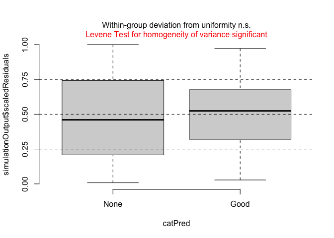
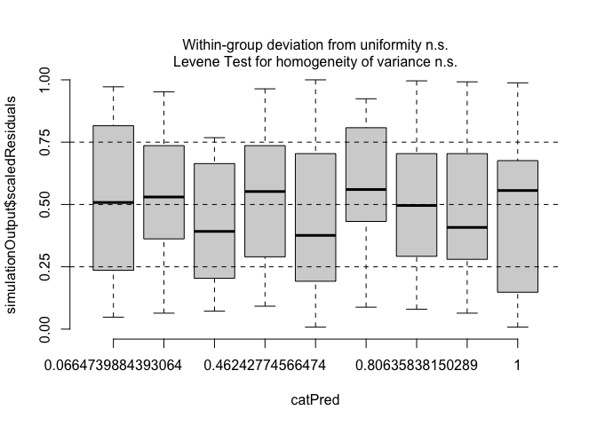
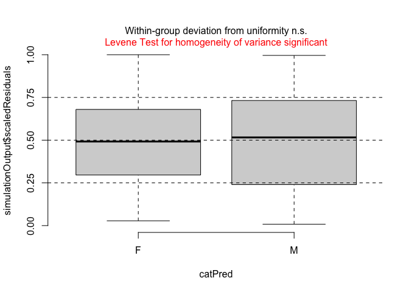
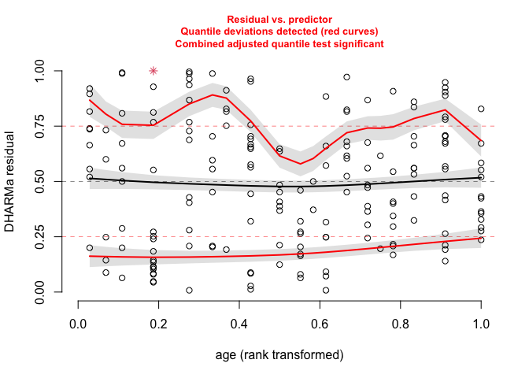
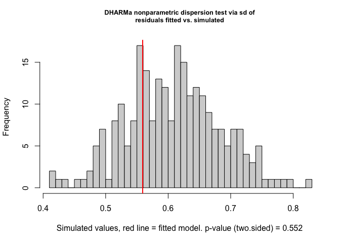

Simpson dominance
================
March 2024

``` r
library(microbiome)
```

    ## Loading required package: phyloseq

    ## Loading required package: ggplot2

    ## 
    ## microbiome R package (microbiome.github.com)
    ##     
    ## 
    ## 
    ##  Copyright (C) 2011-2022 Leo Lahti, 
    ##     Sudarshan Shetty et al. <microbiome.github.io>

    ## 
    ## Attaching package: 'microbiome'

    ## The following object is masked from 'package:ggplot2':
    ## 
    ##     alpha

    ## The following object is masked from 'package:base':
    ## 
    ##     transform

``` r
library(tidyverse)
```

    ## ── Attaching packages
    ## ───────────────────────────────────────
    ## tidyverse 1.3.2 ──

    ## ✔ tibble  3.2.1     ✔ dplyr   1.1.3
    ## ✔ tidyr   1.3.0     ✔ stringr 1.5.0
    ## ✔ readr   2.1.3     ✔ forcats 0.5.2
    ## ✔ purrr   1.0.1     
    ## ── Conflicts ────────────────────────────────────────── tidyverse_conflicts() ──
    ## ✖ microbiome::alpha() masks ggplot2::alpha()
    ## ✖ dplyr::filter()     masks stats::filter()
    ## ✖ dplyr::lag()        masks stats::lag()

``` r
library(DiversitySeq)
```

    ## Loading required package: vegan
    ## Loading required package: permute
    ## Loading required package: lattice
    ## This is vegan 2.6-4
    ## 
    ## Attaching package: 'vegan'
    ## 
    ## The following object is masked from 'package:microbiome':
    ## 
    ##     diversity

``` r
library(ggpubr)
library(nlme)
```

    ## 
    ## Attaching package: 'nlme'
    ## 
    ## The following object is masked from 'package:dplyr':
    ## 
    ##     collapse

``` r
library(lattice)
library(latticeExtra)
```

    ## 
    ## Attaching package: 'latticeExtra'
    ## 
    ## The following object is masked from 'package:ggplot2':
    ## 
    ##     layer

``` r
library(lme4)
```

    ## Loading required package: Matrix
    ## 
    ## Attaching package: 'Matrix'
    ## 
    ## The following objects are masked from 'package:tidyr':
    ## 
    ##     expand, pack, unpack
    ## 
    ## 
    ## Attaching package: 'lme4'
    ## 
    ## The following object is masked from 'package:nlme':
    ## 
    ##     lmList

``` r
library(DHARMa)
```

    ## This is DHARMa 0.4.6. For overview type '?DHARMa'. For recent changes, type news(package = 'DHARMa')

``` r
library(splines)
library(aod)
```

``` r
physeq_mOTU <- readRDS( "/Volumes/My Passport for Mac/FECBUD studie/FECBUD GitHub/Data/FECBUD_physeq_filt_relativeabundances.rds" ) 
physeq.rel <- physeq_mOTU

physeq.rel.fam = aggregate_taxa(physeq.rel, "family")
physeq.rel.fam
```

    ## phyloseq-class experiment-level object
    ## otu_table()   OTU Table:         [ 95 taxa and 207 samples ]
    ## sample_data() Sample Data:       [ 207 samples by 17 sample variables ]
    ## tax_table()   Taxonomy Table:    [ 95 taxa by 6 taxonomic ranks ]

``` r
physeq.rel.fam = subset_samples(physeq.rel.fam, subject_id != "Donor A" )
physeq.rel.fam = subset_samples(physeq.rel.fam, subject_id != "Donor B" )
```

``` r
# tail index - considers less abundant species more than shannon
physeq.rel.fam@sam_data$tail = aindex(physeq.rel.fam@otu_table, index = "Tail")$group1
```

``` r
rich.df = richness(physeq.rel.fam)$chao1
eveness.df = evenness(physeq.rel.fam)$pielou
dominance.df = dominance(physeq.rel.fam)$simpson
shannon.df = alpha(physeq.rel.fam, index = "shannon") # shannon diversity
```

    ## Observed richness

    ## Other forms of richness

    ## Diversity

    ## Evenness

    ## Dominance

    ## Rarity

``` r
physeq.rel.fam@sam_data$chao1 = rich.df
physeq.rel.fam@sam_data$pielou = eveness.df
physeq.rel.fam@sam_data$simpson = dominance.df
physeq.rel.fam@sam_data$shannon = shannon.df

df.div = as.data.frame(as.matrix(physeq.rel.fam@sam_data))

df.div$timepoint.new = as.factor(df.div$timepoint.new)
df.div$timepoint.new = factor(df.div[["timepoint.new"]],
levels = c("Baseline", "Pre-FMT" , "Post-1", "Post-2", "Post-3", "Post-4", "Week8", "Week10", "Week14"))
df.div$clinical_outcome_wk14 = as.factor(df.div$clinical_outcome_wk14)
df.div$clinical_outcome_wk14 = factor(df.div$clinical_outcome_wk14, levels = c("None", "Good"))
df.div$age = as.numeric(df.div$age)
df.div$treated_with_donor = as.factor(df.div$treated_with_donor)
df.div$pretreatment = as.factor(df.div$pretreatment)
df.div$pretreatment = factor(df.div$pretreatment, level = c("placebo", "budesonide"))
df.div$sex = as.factor(df.div$sex)
df.div$subject_id = factor(df.div$subject_id)
str(df.div)
```

    ## 'data.frame':    180 obs. of  22 variables:
    ##  $ subject_id           : Factor w/ 24 levels "101","102","103",..: 1 1 1 1 1 1 1 1 1 2 ...
    ##  $ filename             : chr  "CY11446.fastq.gz" "CY11449.fastq.gz" "CY11452.fastq.gz" "CY11455.fastq.gz" ...
    ##  $ file_id              : chr  "CY11446" "CY11449" "CY11452" "CY11455" ...
    ##  $ timepoint            : chr  "Baseline" "FMT1" "FMT2" "FMT3" ...
    ##  $ timepoint.new        : Factor w/ 9 levels "Baseline","Pre-FMT",..: 1 2 3 4 5 8 9 6 7 1 ...
    ##  $ sample_id.new        : chr  "101-Baseline" "101-Pre-FMT" "101-Post-1" "101-Post-2" ...
    ##  $ days_offset          : chr  " 62" " 82" "  0" " 96" ...
    ##  $ treated_with_donor   : Factor w/ 2 levels "Donor A","Donor B": 1 1 1 1 1 1 1 1 1 2 ...
    ##  $ age                  : num  58 58 58 58 58 58 58 58 58 44 ...
    ##  $ sex                  : Factor w/ 2 levels "F","M": 1 1 1 1 1 1 1 1 1 1 ...
    ##  $ pretreatment         : Factor w/ 2 levels "placebo","budesonide": 1 1 1 1 1 1 1 1 1 2 ...
    ##  $ clinical_outcome_wk10: chr  "Good" "Good" "Good" "Good" ...
    ##  $ clinical_outcome_wk14: Factor w/ 2 levels "None","Good": 2 2 2 2 2 2 2 2 2 1 ...
    ##  $ raw_reads            : chr  " 3255433" " 3668939" " 4049160" " 3725242" ...
    ##  $ human_reads          : chr  " 305675" "   4828" "   4261" "   5322" ...
    ##  $ human_percentage     : chr  " 9.38968795" " 0.13159118" " 0.10523170" " 0.14286320" ...
    ##  $ high_quality_reads   : chr  " 2763190" " 3461216" " 3803090" " 3519302" ...
    ##  $ tail                 : chr  "6.458873" "6.581339" "6.532971" "7.317179" ...
    ##  $ chao1                : chr  "33" "36" "37" "40" ...
    ##  $ pielou               : chr  "0.7351758" "0.7242159" "0.7028640" "0.7249149" ...
    ##  $ simpson              : chr  "0.10160385" "0.09761145" "0.11087095" "0.09187584" ...
    ##  $ shannon              : chr  "2.570548" "2.595241" "2.537984" "2.674124" ...

``` r
df.div$chao1 = as.numeric(df.div$chao1)
df.div$pielou = as.numeric(df.div$pielou)
df.div$simpson = as.numeric(df.div$simpson)
df.div$tail = as.numeric(df.div$tail)
df.div$shannon = as.numeric(df.div$shannon)

df.div$timepoint.new = as.numeric(df.div$timepoint.new)
```

# Mixed Models - Simpson Dominance

``` r
hist(df.div$simpson)
```

<!-- -->

``` r
df.div$simpson.new = log(df.div$simpson) # transformation to get closer to a normal distribution

hist(df.div$simpson.new)
```

<!-- -->

``` r
library(nlme)

# with transformation and spline

# random intercepts model
lme.int.simpson = lme(simpson.new ~ sex + age + pretreatment + treated_with_donor + clinical_outcome_wk14 * ns(timepoint.new, knots = 7), 
               data = df.div, 
               random = ~ 1 | subject_id)
summary(lme.int.simpson)
```

    ## Linear mixed-effects model fit by REML
    ##   Data: df.div 
    ##        AIC      BIC    logLik
    ##   135.8427 173.4722 -55.92133
    ## 
    ## Random effects:
    ##  Formula: ~1 | subject_id
    ##         (Intercept)  Residual
    ## StdDev:   0.1455153 0.2858961
    ## 
    ## Fixed effects:  simpson.new ~ sex + age + pretreatment + treated_with_donor +      clinical_outcome_wk14 * ns(timepoint.new, knots = 7) 
    ##                                                              Value  Std.Error
    ## (Intercept)                                             -1.4427641 0.16010889
    ## sexM                                                     0.2720588 0.08132559
    ## age                                                     -0.0088508 0.00248502
    ## pretreatmentbudesonide                                  -0.0576796 0.08070135
    ## treated_with_donorDonor B                               -0.0428923 0.08579465
    ## clinical_outcome_wk14Good                               -0.0908857 0.12434409
    ## ns(timepoint.new, knots = 7)1                            0.3055717 0.15707444
    ## ns(timepoint.new, knots = 7)2                            0.2271121 0.12049815
    ## clinical_outcome_wk14Good:ns(timepoint.new, knots = 7)1 -0.4328718 0.23544005
    ## clinical_outcome_wk14Good:ns(timepoint.new, knots = 7)2 -0.2242952 0.16216257
    ##                                                          DF   t-value p-value
    ## (Intercept)                                             152 -9.011143  0.0000
    ## sexM                                                     18  3.345304  0.0036
    ## age                                                      18 -3.561661  0.0022
    ## pretreatmentbudesonide                                   18 -0.714729  0.4839
    ## treated_with_donorDonor B                                18 -0.499942  0.6232
    ## clinical_outcome_wk14Good                                18 -0.730921  0.4742
    ## ns(timepoint.new, knots = 7)1                           152  1.945394  0.0536
    ## ns(timepoint.new, knots = 7)2                           152  1.884777  0.0614
    ## clinical_outcome_wk14Good:ns(timepoint.new, knots = 7)1 152 -1.838565  0.0679
    ## clinical_outcome_wk14Good:ns(timepoint.new, knots = 7)2 152 -1.383150  0.1686
    ##  Correlation: 
    ##                                                         (Intr) sexM   age   
    ## sexM                                                    -0.238              
    ## age                                                     -0.803 -0.015       
    ## pretreatmentbudesonide                                  -0.515 -0.028  0.356
    ## treated_with_donorDonor B                               -0.115 -0.295  0.058
    ## clinical_outcome_wk14Good                               -0.225  0.272 -0.073
    ## ns(timepoint.new, knots = 7)1                           -0.287 -0.006 -0.021
    ## ns(timepoint.new, knots = 7)2                            0.085  0.050 -0.022
    ## clinical_outcome_wk14Good:ns(timepoint.new, knots = 7)1  0.191  0.004  0.014
    ## clinical_outcome_wk14Good:ns(timepoint.new, knots = 7)2 -0.063 -0.037  0.017
    ##                                                         prtrtm tr__DB c__14G
    ## sexM                                                                        
    ## age                                                                         
    ## pretreatmentbudesonide                                                      
    ## treated_with_donorDonor B                               -0.033              
    ## clinical_outcome_wk14Good                               -0.012 -0.367       
    ## ns(timepoint.new, knots = 7)1                           -0.047 -0.057  0.438
    ## ns(timepoint.new, knots = 7)2                           -0.068 -0.046 -0.049
    ## clinical_outcome_wk14Good:ns(timepoint.new, knots = 7)1  0.031  0.038 -0.688
    ## clinical_outcome_wk14Good:ns(timepoint.new, knots = 7)2  0.051  0.034  0.069
    ##                                                         n(.,k=7)1 n(.,k=7)2
    ## sexM                                                                       
    ## age                                                                        
    ## pretreatmentbudesonide                                                     
    ## treated_with_donorDonor B                                                  
    ## clinical_outcome_wk14Good                                                  
    ## ns(timepoint.new, knots = 7)1                                              
    ## ns(timepoint.new, knots = 7)2                            0.012             
    ## clinical_outcome_wk14Good:ns(timepoint.new, knots = 7)1 -0.667    -0.008   
    ## clinical_outcome_wk14Good:ns(timepoint.new, knots = 7)2 -0.009    -0.743   
    ##                                                         c__14G:(.,k=7)1
    ## sexM                                                                   
    ## age                                                                    
    ## pretreatmentbudesonide                                                 
    ## treated_with_donorDonor B                                              
    ## clinical_outcome_wk14Good                                              
    ## ns(timepoint.new, knots = 7)1                                          
    ## ns(timepoint.new, knots = 7)2                                          
    ## clinical_outcome_wk14Good:ns(timepoint.new, knots = 7)1                
    ## clinical_outcome_wk14Good:ns(timepoint.new, knots = 7)2 -0.033         
    ## 
    ## Standardized Within-Group Residuals:
    ##         Min          Q1         Med          Q3         Max 
    ## -2.51253318 -0.52823309 -0.07302988  0.54789905  2.83372719 
    ## 
    ## Number of Observations: 180
    ## Number of Groups: 24

``` r
AIC(lme.int.simpson)
```

    ## [1] 135.8427

``` r
# random slopes
# lme.slope.simpson = lme(simpson.new ~ sex + age + pretreatment + treated_with_donor + clinical_outcome_wk14 * ns(timepoint.new, knots = 7), 
#                data = df.div, 
#                random = ~ ns(timepoint.new, knots = 7) | subject_id)
# 
# summary(lme.slope.simpson)
# AIC(lme.slope.simpson)
```

``` r
library(lmtest)
```

    ## Loading required package: zoo

    ## 
    ## Attaching package: 'zoo'

    ## The following objects are masked from 'package:base':
    ## 
    ##     as.Date, as.Date.numeric

``` r
full.model = lme(simpson.new ~ sex + age + pretreatment + treated_with_donor + clinical_outcome_wk14 * ns(timepoint.new, knots = 7), 
               data = df.div, random = ~ 1 | subject_id)
summary(full.model )
```

    ## Linear mixed-effects model fit by REML
    ##   Data: df.div 
    ##        AIC      BIC    logLik
    ##   135.8427 173.4722 -55.92133
    ## 
    ## Random effects:
    ##  Formula: ~1 | subject_id
    ##         (Intercept)  Residual
    ## StdDev:   0.1455153 0.2858961
    ## 
    ## Fixed effects:  simpson.new ~ sex + age + pretreatment + treated_with_donor +      clinical_outcome_wk14 * ns(timepoint.new, knots = 7) 
    ##                                                              Value  Std.Error
    ## (Intercept)                                             -1.4427641 0.16010889
    ## sexM                                                     0.2720588 0.08132559
    ## age                                                     -0.0088508 0.00248502
    ## pretreatmentbudesonide                                  -0.0576796 0.08070135
    ## treated_with_donorDonor B                               -0.0428923 0.08579465
    ## clinical_outcome_wk14Good                               -0.0908857 0.12434409
    ## ns(timepoint.new, knots = 7)1                            0.3055717 0.15707444
    ## ns(timepoint.new, knots = 7)2                            0.2271121 0.12049815
    ## clinical_outcome_wk14Good:ns(timepoint.new, knots = 7)1 -0.4328718 0.23544005
    ## clinical_outcome_wk14Good:ns(timepoint.new, knots = 7)2 -0.2242952 0.16216257
    ##                                                          DF   t-value p-value
    ## (Intercept)                                             152 -9.011143  0.0000
    ## sexM                                                     18  3.345304  0.0036
    ## age                                                      18 -3.561661  0.0022
    ## pretreatmentbudesonide                                   18 -0.714729  0.4839
    ## treated_with_donorDonor B                                18 -0.499942  0.6232
    ## clinical_outcome_wk14Good                                18 -0.730921  0.4742
    ## ns(timepoint.new, knots = 7)1                           152  1.945394  0.0536
    ## ns(timepoint.new, knots = 7)2                           152  1.884777  0.0614
    ## clinical_outcome_wk14Good:ns(timepoint.new, knots = 7)1 152 -1.838565  0.0679
    ## clinical_outcome_wk14Good:ns(timepoint.new, knots = 7)2 152 -1.383150  0.1686
    ##  Correlation: 
    ##                                                         (Intr) sexM   age   
    ## sexM                                                    -0.238              
    ## age                                                     -0.803 -0.015       
    ## pretreatmentbudesonide                                  -0.515 -0.028  0.356
    ## treated_with_donorDonor B                               -0.115 -0.295  0.058
    ## clinical_outcome_wk14Good                               -0.225  0.272 -0.073
    ## ns(timepoint.new, knots = 7)1                           -0.287 -0.006 -0.021
    ## ns(timepoint.new, knots = 7)2                            0.085  0.050 -0.022
    ## clinical_outcome_wk14Good:ns(timepoint.new, knots = 7)1  0.191  0.004  0.014
    ## clinical_outcome_wk14Good:ns(timepoint.new, knots = 7)2 -0.063 -0.037  0.017
    ##                                                         prtrtm tr__DB c__14G
    ## sexM                                                                        
    ## age                                                                         
    ## pretreatmentbudesonide                                                      
    ## treated_with_donorDonor B                               -0.033              
    ## clinical_outcome_wk14Good                               -0.012 -0.367       
    ## ns(timepoint.new, knots = 7)1                           -0.047 -0.057  0.438
    ## ns(timepoint.new, knots = 7)2                           -0.068 -0.046 -0.049
    ## clinical_outcome_wk14Good:ns(timepoint.new, knots = 7)1  0.031  0.038 -0.688
    ## clinical_outcome_wk14Good:ns(timepoint.new, knots = 7)2  0.051  0.034  0.069
    ##                                                         n(.,k=7)1 n(.,k=7)2
    ## sexM                                                                       
    ## age                                                                        
    ## pretreatmentbudesonide                                                     
    ## treated_with_donorDonor B                                                  
    ## clinical_outcome_wk14Good                                                  
    ## ns(timepoint.new, knots = 7)1                                              
    ## ns(timepoint.new, knots = 7)2                            0.012             
    ## clinical_outcome_wk14Good:ns(timepoint.new, knots = 7)1 -0.667    -0.008   
    ## clinical_outcome_wk14Good:ns(timepoint.new, knots = 7)2 -0.009    -0.743   
    ##                                                         c__14G:(.,k=7)1
    ## sexM                                                                   
    ## age                                                                    
    ## pretreatmentbudesonide                                                 
    ## treated_with_donorDonor B                                              
    ## clinical_outcome_wk14Good                                              
    ## ns(timepoint.new, knots = 7)1                                          
    ## ns(timepoint.new, knots = 7)2                                          
    ## clinical_outcome_wk14Good:ns(timepoint.new, knots = 7)1                
    ## clinical_outcome_wk14Good:ns(timepoint.new, knots = 7)2 -0.033         
    ## 
    ## Standardized Within-Group Residuals:
    ##         Min          Q1         Med          Q3         Max 
    ## -2.51253318 -0.52823309 -0.07302988  0.54789905  2.83372719 
    ## 
    ## Number of Observations: 180
    ## Number of Groups: 24

``` r
AIC(full.model)
```

    ## [1] 135.8427

``` r
initial.model = lme(simpson.new ~ clinical_outcome_wk14 * ns(timepoint.new, knots = 7), 
               data = df.div, random = ~ 1 | subject_id)
summary(initial.model )
```

    ## Linear mixed-effects model fit by REML
    ##   Data: df.div 
    ##        AIC     BIC    logLik
    ##   127.0165 152.289 -55.50825
    ## 
    ## Random effects:
    ##  Formula: ~1 | subject_id
    ##         (Intercept)  Residual
    ## StdDev:   0.2247682 0.2869618
    ## 
    ## Fixed effects:  simpson.new ~ clinical_outcome_wk14 * ns(timepoint.new, knots = 7) 
    ##                                                              Value  Std.Error
    ## (Intercept)                                             -1.7213695 0.08471228
    ## clinical_outcome_wk14Good                               -0.2079029 0.13488292
    ## ns(timepoint.new, knots = 7)1                            0.3050175 0.15869748
    ## ns(timepoint.new, knots = 7)2                            0.2199544 0.12138598
    ## clinical_outcome_wk14Good:ns(timepoint.new, knots = 7)1 -0.4323176 0.23701114
    ## clinical_outcome_wk14Good:ns(timepoint.new, knots = 7)2 -0.2171375 0.16309327
    ##                                                          DF    t-value p-value
    ## (Intercept)                                             152 -20.320189  0.0000
    ## clinical_outcome_wk14Good                                22  -1.541358  0.1375
    ## ns(timepoint.new, knots = 7)1                           152   1.922006  0.0565
    ## ns(timepoint.new, knots = 7)2                           152   1.812025  0.0720
    ## clinical_outcome_wk14Good:ns(timepoint.new, knots = 7)1 152  -1.824039  0.0701
    ## clinical_outcome_wk14Good:ns(timepoint.new, knots = 7)2 152  -1.331370  0.1851
    ##  Correlation: 
    ##                                                         (Intr) c__14G n(.,k=7)1
    ## clinical_outcome_wk14Good                               -0.628                 
    ## ns(timepoint.new, knots = 7)1                           -0.618  0.388          
    ## ns(timepoint.new, knots = 7)2                            0.110 -0.069  0.014   
    ## clinical_outcome_wk14Good:ns(timepoint.new, knots = 7)1  0.414 -0.624 -0.670   
    ## clinical_outcome_wk14Good:ns(timepoint.new, knots = 7)2 -0.082  0.081 -0.011   
    ##                                                         n(.,k=7)2
    ## clinical_outcome_wk14Good                                        
    ## ns(timepoint.new, knots = 7)1                                    
    ## ns(timepoint.new, knots = 7)2                                    
    ## clinical_outcome_wk14Good:ns(timepoint.new, knots = 7)1 -0.009   
    ## clinical_outcome_wk14Good:ns(timepoint.new, knots = 7)2 -0.744   
    ##                                                         c__14G:(.,k=7)1
    ## clinical_outcome_wk14Good                                              
    ## ns(timepoint.new, knots = 7)1                                          
    ## ns(timepoint.new, knots = 7)2                                          
    ## clinical_outcome_wk14Good:ns(timepoint.new, knots = 7)1                
    ## clinical_outcome_wk14Good:ns(timepoint.new, knots = 7)2 -0.031         
    ## 
    ## Standardized Within-Group Residuals:
    ##        Min         Q1        Med         Q3        Max 
    ## -2.3921323 -0.6044878 -0.0391330  0.5518714  2.7819383 
    ## 
    ## Number of Observations: 180
    ## Number of Groups: 24

``` r
AIC(initial.model)
```

    ## [1] 127.0165

``` r
sex.model = lme(simpson.new ~ sex  + clinical_outcome_wk14 * ns(timepoint.new, knots = 7), 
               data = df.div, random = ~ 1 | subject_id)
summary(sex.model )
```

    ## Linear mixed-effects model fit by REML
    ##   Data: df.div 
    ##        AIC      BIC   logLik
    ##   124.6116 152.9912 -53.3058
    ## 
    ## Random effects:
    ##  Formula: ~1 | subject_id
    ##         (Intercept)  Residual
    ## StdDev:   0.1903551 0.2863716
    ## 
    ## Fixed effects:  simpson.new ~ sex + clinical_outcome_wk14 * ns(timepoint.new,      knots = 7) 
    ##                                                              Value  Std.Error
    ## (Intercept)                                             -1.8832286 0.09713092
    ## sexM                                                     0.2670356 0.09379998
    ## clinical_outcome_wk14Good                               -0.1350557 0.12752824
    ## ns(timepoint.new, knots = 7)1                            0.2951669 0.15786565
    ## ns(timepoint.new, knots = 7)2                            0.2252987 0.12086642
    ## clinical_outcome_wk14Good:ns(timepoint.new, knots = 7)1 -0.4224670 0.23618556
    ## clinical_outcome_wk14Good:ns(timepoint.new, knots = 7)2 -0.2224818 0.16255706
    ##                                                          DF    t-value p-value
    ## (Intercept)                                             152 -19.388559  0.0000
    ## sexM                                                     21   2.846862  0.0097
    ## clinical_outcome_wk14Good                                21  -1.059026  0.3016
    ## ns(timepoint.new, knots = 7)1                           152   1.869735  0.0634
    ## ns(timepoint.new, knots = 7)2                           152   1.864031  0.0642
    ## clinical_outcome_wk14Good:ns(timepoint.new, knots = 7)1 152  -1.788708  0.0757
    ## clinical_outcome_wk14Good:ns(timepoint.new, knots = 7)2 152  -1.368638  0.1731
    ##  Correlation: 
    ##                                                         (Intr) sexM   c__14G
    ## sexM                                                    -0.586              
    ## clinical_outcome_wk14Good                               -0.618  0.201       
    ## ns(timepoint.new, knots = 7)1                           -0.523 -0.027  0.405
    ## ns(timepoint.new, knots = 7)2                            0.078  0.029 -0.067
    ## clinical_outcome_wk14Good:ns(timepoint.new, knots = 7)1  0.350  0.018 -0.656
    ## clinical_outcome_wk14Good:ns(timepoint.new, knots = 7)2 -0.058 -0.021  0.081
    ##                                                         n(.,k=7)1 n(.,k=7)2
    ## sexM                                                                       
    ## clinical_outcome_wk14Good                                                  
    ## ns(timepoint.new, knots = 7)1                                              
    ## ns(timepoint.new, knots = 7)2                            0.011             
    ## clinical_outcome_wk14Good:ns(timepoint.new, knots = 7)1 -0.668    -0.007   
    ## clinical_outcome_wk14Good:ns(timepoint.new, knots = 7)2 -0.008    -0.744   
    ##                                                         c__14G:(.,k=7)1
    ## sexM                                                                   
    ## clinical_outcome_wk14Good                                              
    ## ns(timepoint.new, knots = 7)1                                          
    ## ns(timepoint.new, knots = 7)2                                          
    ## clinical_outcome_wk14Good:ns(timepoint.new, knots = 7)1                
    ## clinical_outcome_wk14Good:ns(timepoint.new, knots = 7)2 -0.033         
    ## 
    ## Standardized Within-Group Residuals:
    ##         Min          Q1         Med          Q3         Max 
    ## -2.42426020 -0.57546492 -0.03957023  0.57573989  2.90333384 
    ## 
    ## Number of Observations: 180
    ## Number of Groups: 24

``` r
AIC(initial.model) - AIC(sex.model)
```

    ## [1] 2.404902

``` r
lr_test.sex <- lrtest(initial.model, sex.model) # not significant
lr_test.sex
```

    ## Likelihood ratio test
    ## 
    ## Model 1: simpson.new ~ clinical_outcome_wk14 * ns(timepoint.new, knots = 7)
    ## Model 2: simpson.new ~ sex + clinical_outcome_wk14 * ns(timepoint.new, 
    ##     knots = 7)
    ##   #Df  LogLik Df  Chisq Pr(>Chisq)  
    ## 1   8 -55.508                       
    ## 2   9 -53.306  1 4.4049    0.03584 *
    ## ---
    ## Signif. codes:  0 '***' 0.001 '**' 0.01 '*' 0.05 '.' 0.1 ' ' 1

``` r
# Extract coefficients
coef_initial <- coef(initial.model)
coef_full <- coef(sex.model)
coef_initial_sex <- coef_initial[["clinical_outcome_wk14Good"]][1]
coef_full_sex <- coef_full[["clinical_outcome_wk14Good"]][1]
coefficient_changes.sex  <- coef_full_sex - coef_initial_sex # 0.01124904
coefficient_change_percentage.sex = (coef_full_sex - coef_initial_sex) / coef_initial_sex * 100
coefficient_change_percentage.sex
```

    ## [1] -35.03906

``` r
# Check collinearity
vif_values.sex <- car::vif(sex.model)
vif_values.sex
```

    ##                                                        GVIF Df GVIF^(1/(2*Df))
    ## sex                                                1.090155  1        1.044105
    ## clinical_outcome_wk14                              1.935528  1        1.391233
    ## ns(timepoint.new, knots = 7)                       4.093286  2        1.422388
    ## clinical_outcome_wk14:ns(timepoint.new, knots = 7) 6.173783  2        1.576296

``` r
age.model = lme(simpson.new ~ age + clinical_outcome_wk14 * ns(timepoint.new, knots = 7), 
               data = df.div, random = ~ 1 | subject_id)
summary(age.model )
```

    ## Linear mixed-effects model fit by REML
    ##   Data: df.div 
    ##        AIC      BIC    logLik
    ##   130.8202 159.1999 -56.41012
    ## 
    ## Random effects:
    ##  Formula: ~1 | subject_id
    ##         (Intercept)  Residual
    ## StdDev:   0.1840371 0.2865874
    ## 
    ## Fixed effects:  simpson.new ~ age + clinical_outcome_wk14 * ns(timepoint.new,      knots = 7) 
    ##                                                              Value  Std.Error
    ## (Intercept)                                             -1.3454682 0.14560799
    ## age                                                     -0.0083585 0.00273769
    ## clinical_outcome_wk14Good                               -0.1863102 0.12348951
    ## ns(timepoint.new, knots = 7)1                            0.3065457 0.15780565
    ## ns(timepoint.new, knots = 7)2                            0.2129539 0.12083455
    ## clinical_outcome_wk14Good:ns(timepoint.new, knots = 7)1 -0.4338458 0.23624395
    ## clinical_outcome_wk14Good:ns(timepoint.new, knots = 7)2 -0.2101370 0.16258815
    ##                                                          DF   t-value p-value
    ## (Intercept)                                             152 -9.240346  0.0000
    ## age                                                      21 -3.053132  0.0060
    ## clinical_outcome_wk14Good                                21 -1.508713  0.1463
    ## ns(timepoint.new, knots = 7)1                           152  1.942552  0.0539
    ## ns(timepoint.new, knots = 7)2                           152  1.762360  0.0800
    ## clinical_outcome_wk14Good:ns(timepoint.new, knots = 7)1 152 -1.836432  0.0682
    ## clinical_outcome_wk14Good:ns(timepoint.new, knots = 7)2 152 -1.292450  0.1982
    ##  Correlation: 
    ##                                                         (Intr) age    c__14G
    ## age                                                     -0.845              
    ## clinical_outcome_wk14Good                               -0.288 -0.057       
    ## ns(timepoint.new, knots = 7)1                           -0.362  0.002  0.424
    ## ns(timepoint.new, knots = 7)2                            0.060  0.004 -0.075
    ## clinical_outcome_wk14Good:ns(timepoint.new, knots = 7)1  0.242 -0.001 -0.682
    ## clinical_outcome_wk14Good:ns(timepoint.new, knots = 7)2 -0.045 -0.003  0.089
    ##                                                         n(.,k=7)1 n(.,k=7)2
    ## age                                                                        
    ## clinical_outcome_wk14Good                                                  
    ## ns(timepoint.new, knots = 7)1                                              
    ## ns(timepoint.new, knots = 7)2                            0.011             
    ## clinical_outcome_wk14Good:ns(timepoint.new, knots = 7)1 -0.668    -0.007   
    ## clinical_outcome_wk14Good:ns(timepoint.new, knots = 7)2 -0.008    -0.743   
    ##                                                         c__14G:(.,k=7)1
    ## age                                                                    
    ## clinical_outcome_wk14Good                                              
    ## ns(timepoint.new, knots = 7)1                                          
    ## ns(timepoint.new, knots = 7)2                                          
    ## clinical_outcome_wk14Good:ns(timepoint.new, knots = 7)1                
    ## clinical_outcome_wk14Good:ns(timepoint.new, knots = 7)2 -0.033         
    ## 
    ## Standardized Within-Group Residuals:
    ##         Min          Q1         Med          Q3         Max 
    ## -2.40515833 -0.49627365 -0.06318782  0.54575281  2.68573582 
    ## 
    ## Number of Observations: 180
    ## Number of Groups: 24

``` r
AIC(initial.model) - AIC(age.model)
```

    ## [1] -3.803722

``` r
lr_test.age <- lrtest(initial.model, age.model)
lr_test.age
```

    ## Likelihood ratio test
    ## 
    ## Model 1: simpson.new ~ clinical_outcome_wk14 * ns(timepoint.new, knots = 7)
    ## Model 2: simpson.new ~ age + clinical_outcome_wk14 * ns(timepoint.new, 
    ##     knots = 7)
    ##   #Df  LogLik Df  Chisq Pr(>Chisq)
    ## 1   8 -55.508                     
    ## 2   9 -56.410  1 1.8037     0.1793

``` r
# Extract coefficients
coef_initial <- coef(initial.model)
coef_full <- coef(age.model)
coef_initial_age <- coef_initial[["clinical_outcome_wk14Good"]][1]
coef_full_age <- coef_full[["clinical_outcome_wk14Good"]][1]
coefficient_changes.age  <- coef_full_age - coef_initial_age # 0.01124904
coefficient_change_percentage.age = (coef_full_age - coef_initial_age) / coef_initial_age * 100 
coefficient_change_percentage.age
```

    ## [1] -10.38598

``` r
# Check collinearity
vif_values.age <- car::vif(age.model)
vif_values.age
```

    ##                                                        GVIF Df GVIF^(1/(2*Df))
    ## age                                                1.006433  1        1.003211
    ## clinical_outcome_wk14                              1.910648  1        1.382262
    ## ns(timepoint.new, knots = 7)                       4.082478  2        1.421448
    ## clinical_outcome_wk14:ns(timepoint.new, knots = 7) 6.275188  2        1.582729

``` r
pretreatment.model = lme(simpson.new ~ pretreatment + clinical_outcome_wk14 * ns(timepoint.new, knots = 7),  data = df.div, random = ~ 1 | subject_id)
summary(pretreatment.model )
```

    ## Linear mixed-effects model fit by REML
    ##   Data: df.div 
    ##        AIC      BIC    logLik
    ##   131.3971 159.7767 -56.69854
    ## 
    ## Random effects:
    ##  Formula: ~1 | subject_id
    ##         (Intercept)  Residual
    ## StdDev:   0.2297498 0.2869072
    ## 
    ## Fixed effects:  simpson.new ~ pretreatment + clinical_outcome_wk14 * ns(timepoint.new,      knots = 7) 
    ##                                                              Value Std.Error
    ## (Intercept)                                             -1.7528210 0.1031584
    ## pretreatmentbudesonide                                   0.0574634 0.1052329
    ## clinical_outcome_wk14Good                               -0.2083756 0.1363607
    ## ns(timepoint.new, knots = 7)1                            0.3011055 0.1588764
    ## ns(timepoint.new, knots = 7)2                            0.2172187 0.1215513
    ## clinical_outcome_wk14Good:ns(timepoint.new, knots = 7)1 -0.4284056 0.2371061
    ## clinical_outcome_wk14Good:ns(timepoint.new, knots = 7)2 -0.2144018 0.1632025
    ##                                                          DF    t-value p-value
    ## (Intercept)                                             152 -16.991544  0.0000
    ## pretreatmentbudesonide                                   21   0.546059  0.5908
    ## clinical_outcome_wk14Good                                21  -1.528120  0.1414
    ## ns(timepoint.new, knots = 7)1                           152   1.895219  0.0600
    ## ns(timepoint.new, knots = 7)2                           152   1.787054  0.0759
    ## clinical_outcome_wk14Good:ns(timepoint.new, knots = 7)1 152  -1.806810  0.0728
    ## clinical_outcome_wk14Good:ns(timepoint.new, knots = 7)2 152  -1.313716  0.1909
    ##  Correlation: 
    ##                                                         (Intr) prtrtm c__14G
    ## pretreatmentbudesonide                                  -0.558              
    ## clinical_outcome_wk14Good                               -0.517 -0.007       
    ## ns(timepoint.new, knots = 7)1                           -0.483 -0.042  0.383
    ## ns(timepoint.new, knots = 7)2                            0.118 -0.050 -0.068
    ## clinical_outcome_wk14Good:ns(timepoint.new, knots = 7)1  0.324  0.028 -0.617
    ## clinical_outcome_wk14Good:ns(timepoint.new, knots = 7)2 -0.088  0.037  0.080
    ##                                                         n(.,k=7)1 n(.,k=7)2
    ## pretreatmentbudesonide                                                     
    ## clinical_outcome_wk14Good                                                  
    ## ns(timepoint.new, knots = 7)1                                              
    ## ns(timepoint.new, knots = 7)2                            0.017             
    ## clinical_outcome_wk14Good:ns(timepoint.new, knots = 7)1 -0.670    -0.011   
    ## clinical_outcome_wk14Good:ns(timepoint.new, knots = 7)2 -0.012    -0.745   
    ##                                                         c__14G:(.,k=7)1
    ## pretreatmentbudesonide                                                 
    ## clinical_outcome_wk14Good                                              
    ## ns(timepoint.new, knots = 7)1                                          
    ## ns(timepoint.new, knots = 7)2                                          
    ## clinical_outcome_wk14Good:ns(timepoint.new, knots = 7)1                
    ## clinical_outcome_wk14Good:ns(timepoint.new, knots = 7)2 -0.030         
    ## 
    ## Standardized Within-Group Residuals:
    ##         Min          Q1         Med          Q3         Max 
    ## -2.37856084 -0.58625995 -0.04874796  0.54268480  2.77022765 
    ## 
    ## Number of Observations: 180
    ## Number of Groups: 24

``` r
AIC(initial.model) - AIC(pretreatment.model)
```

    ## [1] -4.380577

``` r
lr_test.pretreatment <- lrtest(initial.model, pretreatment.model)
lr_test.pretreatment
```

    ## Likelihood ratio test
    ## 
    ## Model 1: simpson.new ~ clinical_outcome_wk14 * ns(timepoint.new, knots = 7)
    ## Model 2: simpson.new ~ pretreatment + clinical_outcome_wk14 * ns(timepoint.new, 
    ##     knots = 7)
    ##   #Df  LogLik Df  Chisq Pr(>Chisq)
    ## 1   8 -55.508                     
    ## 2   9 -56.699  1 2.3806     0.1229

``` r
# Extract coefficients
coef_initial <- coef(initial.model)
coef_full <- coef(pretreatment.model)
coef_initial_pretreatment <- coef_initial[["clinical_outcome_wk14Good"]][1]
coef_full_pretreatment <- coef_full[["clinical_outcome_wk14Good"]][1]
coefficient_changes.pretreatment  <- coef_full_pretreatment - coef_initial_pretreatment # 0.01124904
coefficient_change_percentpretreatment.pretreatment = (coef_full_pretreatment - coef_initial_pretreatment) / coef_initial_pretreatment * 100
coefficient_change_percentpretreatment.pretreatment
```

    ## [1] 0.2273352

``` r
# Check collinearity
vif_values.pretreatment <- car::vif(pretreatment.model)
vif_values.pretreatment
```

    ##                                                        GVIF Df GVIF^(1/(2*Df))
    ## pretreatment                                       1.004183  1        1.002089
    ## clinical_outcome_wk14                              1.635199  1        1.278749
    ## ns(timepoint.new, knots = 7)                       4.126498  2        1.425264
    ## clinical_outcome_wk14:ns(timepoint.new, knots = 7) 5.675853  2        1.543504

``` r
donor.model = lme(simpson.new ~ treated_with_donor + clinical_outcome_wk14 * ns(timepoint.new, knots = 7), 
               data = df.div, random = ~ 1 | subject_id)
summary(donor.model )
```

    ## Linear mixed-effects model fit by REML
    ##   Data: df.div 
    ##        AIC      BIC    logLik
    ##   131.1817 159.5613 -56.59086
    ## 
    ## Random effects:
    ##  Formula: ~1 | subject_id
    ##         (Intercept)  Residual
    ## StdDev:   0.2296511 0.2868852
    ## 
    ## Fixed effects:  simpson.new ~ treated_with_donor + clinical_outcome_wk14 * ns(timepoint.new,      knots = 7) 
    ##                                                              Value  Std.Error
    ## (Intercept)                                             -1.7434530 0.09364434
    ## treated_with_donorDonor B                                0.0667008 0.11492177
    ## clinical_outcome_wk14Good                               -0.2376978 0.14567526
    ## ns(timepoint.new, knots = 7)1                            0.2999973 0.15893382
    ## ns(timepoint.new, knots = 7)2                            0.2185972 0.12143635
    ## clinical_outcome_wk14Good:ns(timepoint.new, knots = 7)1 -0.4272974 0.23713457
    ## clinical_outcome_wk14Good:ns(timepoint.new, knots = 7)2 -0.2157803 0.16311135
    ##                                                          DF    t-value p-value
    ## (Intercept)                                             152 -18.617815  0.0000
    ## treated_with_donorDonor B                                21   0.580402  0.5678
    ## clinical_outcome_wk14Good                                21  -1.631697  0.1177
    ## ns(timepoint.new, knots = 7)1                           152   1.887561  0.0610
    ## ns(timepoint.new, knots = 7)2                           152   1.800097  0.0738
    ## clinical_outcome_wk14Good:ns(timepoint.new, knots = 7)1 152  -1.801920  0.0735
    ## clinical_outcome_wk14Good:ns(timepoint.new, knots = 7)2 152  -1.322902  0.1879
    ##  Correlation: 
    ##                                                         (Intr) tr__DB c__14G
    ## treated_with_donorDonor B                               -0.406              
    ## clinical_outcome_wk14Good                               -0.394 -0.353       
    ## ns(timepoint.new, knots = 7)1                           -0.537 -0.051  0.377
    ## ns(timepoint.new, knots = 7)2                            0.110 -0.027 -0.054
    ## clinical_outcome_wk14Good:ns(timepoint.new, knots = 7)1  0.360  0.034 -0.590
    ## clinical_outcome_wk14Good:ns(timepoint.new, knots = 7)2 -0.082  0.020  0.068
    ##                                                         n(.,k=7)1 n(.,k=7)2
    ## treated_with_donorDonor B                                                  
    ## clinical_outcome_wk14Good                                                  
    ## ns(timepoint.new, knots = 7)1                                              
    ## ns(timepoint.new, knots = 7)2                            0.016             
    ## clinical_outcome_wk14Good:ns(timepoint.new, knots = 7)1 -0.670    -0.011   
    ## clinical_outcome_wk14Good:ns(timepoint.new, knots = 7)2 -0.012    -0.744   
    ##                                                         c__14G:(.,k=7)1
    ## treated_with_donorDonor B                                              
    ## clinical_outcome_wk14Good                                              
    ## ns(timepoint.new, knots = 7)1                                          
    ## ns(timepoint.new, knots = 7)2                                          
    ## clinical_outcome_wk14Good:ns(timepoint.new, knots = 7)1                
    ## clinical_outcome_wk14Good:ns(timepoint.new, knots = 7)2 -0.030         
    ## 
    ## Standardized Within-Group Residuals:
    ##        Min         Q1        Med         Q3        Max 
    ## -2.4254929 -0.5824671 -0.0319597  0.5459852  2.7971451 
    ## 
    ## Number of Observations: 180
    ## Number of Groups: 24

``` r
AIC(initial.model) - AIC(donor.model)
```

    ## [1] -4.165206

``` r
lr_test.treated_with_donor <- lrtest(initial.model, donor.model)
lr_test.treated_with_donor
```

    ## Likelihood ratio test
    ## 
    ## Model 1: simpson.new ~ clinical_outcome_wk14 * ns(timepoint.new, knots = 7)
    ## Model 2: simpson.new ~ treated_with_donor + clinical_outcome_wk14 * ns(timepoint.new, 
    ##     knots = 7)
    ##   #Df  LogLik Df  Chisq Pr(>Chisq)
    ## 1   8 -55.508                     
    ## 2   9 -56.591  1 2.1652     0.1412

``` r
# Extract coefficients
coef_initial <- coef(initial.model)
coef_full <- coef(donor.model)
coef_initial_donor <- coef_initial[["clinical_outcome_wk14Good"]][1]
coef_full_donor <- coef_full[["clinical_outcome_wk14Good"]][1]
coefficient_changes.donor  <- coef_full_donor - coef_initial_donor # 0.01124904
coefficient_change_percentdonor.donor = (coef_full_donor - coef_initial_donor) / coef_initial_donor * 100
coefficient_change_percentdonor.donor
```

    ## [1] 14.33116

``` r
# Check collinearity
vif_values.treated_with_donor  <- car::vif(donor.model)
vif_values.treated_with_donor
```

    ##                                                        GVIF Df GVIF^(1/(2*Df))
    ## treated_with_donor                                 1.214105  1        1.101865
    ## clinical_outcome_wk14                              1.867604  1        1.366603
    ## ns(timepoint.new, knots = 7)                       4.123093  2        1.424970
    ## clinical_outcome_wk14:ns(timepoint.new, knots = 7) 5.673421  2        1.543339

``` r
## Selected model
final.model = lme(simpson.new ~ sex  + clinical_outcome_wk14 * ns(timepoint.new, knots = 7), 
               data = df.div, random = ~ 1 | subject_id)
summary(final.model )
```

    ## Linear mixed-effects model fit by REML
    ##   Data: df.div 
    ##        AIC      BIC   logLik
    ##   124.6116 152.9912 -53.3058
    ## 
    ## Random effects:
    ##  Formula: ~1 | subject_id
    ##         (Intercept)  Residual
    ## StdDev:   0.1903551 0.2863716
    ## 
    ## Fixed effects:  simpson.new ~ sex + clinical_outcome_wk14 * ns(timepoint.new,      knots = 7) 
    ##                                                              Value  Std.Error
    ## (Intercept)                                             -1.8832286 0.09713092
    ## sexM                                                     0.2670356 0.09379998
    ## clinical_outcome_wk14Good                               -0.1350557 0.12752824
    ## ns(timepoint.new, knots = 7)1                            0.2951669 0.15786565
    ## ns(timepoint.new, knots = 7)2                            0.2252987 0.12086642
    ## clinical_outcome_wk14Good:ns(timepoint.new, knots = 7)1 -0.4224670 0.23618556
    ## clinical_outcome_wk14Good:ns(timepoint.new, knots = 7)2 -0.2224818 0.16255706
    ##                                                          DF    t-value p-value
    ## (Intercept)                                             152 -19.388559  0.0000
    ## sexM                                                     21   2.846862  0.0097
    ## clinical_outcome_wk14Good                                21  -1.059026  0.3016
    ## ns(timepoint.new, knots = 7)1                           152   1.869735  0.0634
    ## ns(timepoint.new, knots = 7)2                           152   1.864031  0.0642
    ## clinical_outcome_wk14Good:ns(timepoint.new, knots = 7)1 152  -1.788708  0.0757
    ## clinical_outcome_wk14Good:ns(timepoint.new, knots = 7)2 152  -1.368638  0.1731
    ##  Correlation: 
    ##                                                         (Intr) sexM   c__14G
    ## sexM                                                    -0.586              
    ## clinical_outcome_wk14Good                               -0.618  0.201       
    ## ns(timepoint.new, knots = 7)1                           -0.523 -0.027  0.405
    ## ns(timepoint.new, knots = 7)2                            0.078  0.029 -0.067
    ## clinical_outcome_wk14Good:ns(timepoint.new, knots = 7)1  0.350  0.018 -0.656
    ## clinical_outcome_wk14Good:ns(timepoint.new, knots = 7)2 -0.058 -0.021  0.081
    ##                                                         n(.,k=7)1 n(.,k=7)2
    ## sexM                                                                       
    ## clinical_outcome_wk14Good                                                  
    ## ns(timepoint.new, knots = 7)1                                              
    ## ns(timepoint.new, knots = 7)2                            0.011             
    ## clinical_outcome_wk14Good:ns(timepoint.new, knots = 7)1 -0.668    -0.007   
    ## clinical_outcome_wk14Good:ns(timepoint.new, knots = 7)2 -0.008    -0.744   
    ##                                                         c__14G:(.,k=7)1
    ## sexM                                                                   
    ## clinical_outcome_wk14Good                                              
    ## ns(timepoint.new, knots = 7)1                                          
    ## ns(timepoint.new, knots = 7)2                                          
    ## clinical_outcome_wk14Good:ns(timepoint.new, knots = 7)1                
    ## clinical_outcome_wk14Good:ns(timepoint.new, knots = 7)2 -0.033         
    ## 
    ## Standardized Within-Group Residuals:
    ##         Min          Q1         Med          Q3         Max 
    ## -2.42426020 -0.57546492 -0.03957023  0.57573989  2.90333384 
    ## 
    ## Number of Observations: 180
    ## Number of Groups: 24

``` r
# wald test for interaction
wald.test(Sigma = vcov(final.model), b = fixef(final.model), Terms = c(3, 6, 7))
```

    ## Wald test:
    ## ----------
    ## 
    ## Chi-squared test:
    ## X2 = 13.4, df = 3, P(> X2) = 0.0039

``` r
# test which model is better
#anova_results = anova(lme.int.simpson, lme.slope.simpson)
#mixtureLRT = anova_results[["L.Ratio"]][2]
#0.5 * pchisq(mixtureLRT, 1, lower.tail = FALSE) + 0.5 * pchisq(mixtureLRT, 2, lower.tail = FALSE)
# use random slopes
```

``` r
# re-fit with lmer
lme.slope.simpson = lmer(simpson.new ~ sex + age + pretreatment + treated_with_donor + clinical_outcome_wk14 * ns(timepoint.new, knots = 7) + (ns(timepoint.new, knots = 7) | subject_id), 
               data = df.div)

# diagnostics
lme.simpson.diag = DHARMa::simulateResiduals(lme.slope.simpson)
plot(lme.simpson.diag)
```

<!-- -->

``` r
plotResiduals(lme.simpson.diag, form = df.div$clinical_outcome_wk14)
```

<!-- -->

``` r
plotResiduals(lme.simpson.diag, form = df.div$timepoint.new)
```

<!-- -->

``` r
plotResiduals(lme.simpson.diag, form = df.div$treated_with_donor)
```

<!-- -->

``` r
plotResiduals(lme.simpson.diag, form = df.div$sex)
```

<!-- -->

``` r
plotResiduals(lme.simpson.diag, form = df.div$age)
```

<!-- -->

``` r
plotResiduals(lme.simpson.diag, form = df.div$pretreatment)
```

<!-- -->

``` r
testDispersion(lme.simpson.diag)
```

<!-- -->

    ## 
    ##  DHARMa nonparametric dispersion test via sd of residuals fitted vs.
    ##  simulated
    ## 
    ## data:  simulationOutput
    ## dispersion = 0.91786, p-value = 0.488
    ## alternative hypothesis: two.sided

``` r
# re-fit random intercepts model
lme.int.simpson = lmer(simpson.new ~ sex + age + pretreatment + treated_with_donor + clinical_outcome_wk14 * ns(timepoint.new, knots = 7) + (1 | subject_id),
               data = df.div)

lme.int.simpson.diag = DHARMa::simulateResiduals(lme.int.simpson)
plot(lme.int.simpson.diag)
```

<!-- -->

``` r
plotResiduals(lme.int.simpson.diag, form = df.div$clinical_outcome_wk14)
```

<!-- -->

``` r
plotResiduals(lme.int.simpson.diag, form = df.div$timepoint.new)
```

<!-- -->

``` r
plotResiduals(lme.int.simpson.diag, form = df.div$treated_with_donor)
```

<!-- -->

``` r
plotResiduals(lme.int.simpson.diag, form = df.div$sex)
```

<!-- -->

``` r
plotResiduals(lme.int.simpson.diag, form = df.div$age)
```

<!-- -->

``` r
plotResiduals(lme.int.simpson.diag, form = df.div$pretreatment)
```

<!-- -->

``` r
testDispersion(lme.int.simpson.diag)
```

<!-- -->

    ## 
    ##  DHARMa nonparametric dispersion test via sd of residuals fitted vs.
    ##  simulated
    ## 
    ## data:  simulationOutput
    ## dispersion = 0.9187, p-value = 0.552
    ## alternative hypothesis: two.sided

``` r
# wald test for interaction
wald.test(Sigma = vcov(lme.slope.simpson), b = fixef(lme.slope.simpson), Terms = c(6, 9, 10))
```

    ## Wald test:
    ## ----------
    ## 
    ## Chi-squared test:
    ## X2 = 10.1, df = 3, P(> X2) = 0.018

``` r
wald.test(Sigma = vcov(lme.slope.simpson), b = fixef(lme.slope.simpson), Terms = 2) # sex
```

    ## Wald test:
    ## ----------
    ## 
    ## Chi-squared test:
    ## X2 = 10.8, df = 1, P(> X2) = 0.00099

``` r
wald.test(Sigma = vcov(lme.slope.simpson), b = fixef(lme.slope.simpson), Terms = 3) # age
```

    ## Wald test:
    ## ----------
    ## 
    ## Chi-squared test:
    ## X2 = 13.9, df = 1, P(> X2) = 0.00019

``` r
wald.test(Sigma = vcov(lme.slope.simpson), b = fixef(lme.slope.simpson), Terms = 4) # pretreatment
```

    ## Wald test:
    ## ----------
    ## 
    ## Chi-squared test:
    ## X2 = 0.49, df = 1, P(> X2) = 0.49

``` r
wald.test(Sigma = vcov(lme.slope.simpson), b = fixef(lme.slope.simpson), Terms = 5) # donor
```

    ## Wald test:
    ## ----------
    ## 
    ## Chi-squared test:
    ## X2 = 0.25, df = 1, P(> X2) = 0.62

``` r
# no splines and no transformation

# random intercepts model
lme.int.simpson = lme(simpson ~ sex + age + pretreatment + treated_with_donor + clinical_outcome_wk14 * timepoint.new, 
               data = df.div, 
               random = ~ 1 | subject_id)

# random slopes
lme.slope.simpson = lme(simpson ~ sex + age + pretreatment + treated_with_donor + clinical_outcome_wk14 * timepoint.new, 
               data = df.div, 
               random = ~ timepoint.new | subject_id)

# test which model is better
anova_results = anova(lme.int.simpson, lme.slope.simpson)
mixtureLRT = anova_results[["L.Ratio"]][2]
0.5 * pchisq(mixtureLRT, 1, lower.tail = FALSE) + 0.5 * pchisq(mixtureLRT, 2, lower.tail = FALSE)
```

    ## [1] 0.115161

``` r
# use random intercepts

# re-fit with lmer
lme.int.simpson = lmer(simpson ~ sex + age + pretreatment + treated_with_donor + clinical_outcome_wk14 * timepoint.new + (timepoint.new | subject_id), 
               data = df.div)

summary(lme.int.simpson)
```

    ## Linear mixed model fit by REML ['lmerMod']
    ## Formula: 
    ## simpson ~ sex + age + pretreatment + treated_with_donor + clinical_outcome_wk14 *  
    ##     timepoint.new + (timepoint.new | subject_id)
    ##    Data: df.div
    ## 
    ## REML criterion at convergence: -384.1
    ## 
    ## Scaled residuals: 
    ##     Min      1Q  Median      3Q     Max 
    ## -2.2811 -0.4219 -0.1009  0.3045  3.6818 
    ## 
    ## Random effects:
    ##  Groups     Name          Variance  Std.Dev. Corr 
    ##  subject_id (Intercept)   0.0009527 0.030865      
    ##             timepoint.new 0.0000486 0.006971 -0.46
    ##  Residual                 0.0042105 0.064888      
    ## Number of obs: 180, groups:  subject_id, 24
    ## 
    ## Fixed effects:
    ##                                           Estimate Std. Error t value
    ## (Intercept)                              0.2450706  0.0347596   7.050
    ## sexM                                     0.0524812  0.0176636   2.971
    ## age                                     -0.0019528  0.0005356  -3.646
    ## pretreatmentbudesonide                  -0.0107511  0.0174228  -0.617
    ## treated_with_donorDonor B               -0.0147669  0.0186619  -0.791
    ## clinical_outcome_wk14Good               -0.0024498  0.0271582  -0.090
    ## timepoint.new                            0.0084031  0.0035236   2.385
    ## clinical_outcome_wk14Good:timepoint.new -0.0099136  0.0050609  -1.959
    ## 
    ## Correlation of Fixed Effects:
    ##             (Intr) sexM   age    prtrtm tr__DB cl__14G tmpnt.
    ## sexM        -0.254                                           
    ## age         -0.796 -0.007                                    
    ## prtrtmntbds -0.498 -0.029  0.344                             
    ## trtd_wth_DB -0.116 -0.289  0.064 -0.030                      
    ## clncl_t_14G -0.239  0.280 -0.075 -0.019 -0.373               
    ## timepont.nw -0.317  0.002 -0.018 -0.044 -0.049  0.464        
    ## clnc__14G:.  0.221 -0.002  0.012  0.031  0.034 -0.687  -0.696

``` r
lme.int.simpson.diag = DHARMa::simulateResiduals(lme.int.simpson)
plot(lme.int.simpson.diag)
```

<!-- -->

``` r
plotResiduals(lme.int.simpson.diag, form = df.div$clinical_outcome_wk14)
```

<!-- -->

``` r
plotResiduals(lme.int.simpson.diag, form = df.div$timepoint.new)
```

<!-- -->

``` r
plotResiduals(lme.int.simpson.diag, form = df.div$treated_with_donor)
```

<!-- -->

``` r
plotResiduals(lme.int.simpson.diag, form = df.div$sex)
```

<!-- -->

``` r
plotResiduals(lme.int.simpson.diag, form = df.div$age)
```

<!-- -->

``` r
plotResiduals(lme.int.simpson.diag, form = df.div$pretreatment)
```

<!-- -->

``` r
testDispersion(lme.int.simpson.diag)
```

<!-- -->

    ## 
    ##  DHARMa nonparametric dispersion test via sd of residuals fitted vs.
    ##  simulated
    ## 
    ## data:  simulationOutput
    ## dispersion = 0.92336, p-value = 0.56
    ## alternative hypothesis: two.sided

``` r
wald.test(Sigma = vcov(lme.int.simpson), b = fixef(lme.int.simpson), Terms = 2) # sex
```

    ## Wald test:
    ## ----------
    ## 
    ## Chi-squared test:
    ## X2 = 8.8, df = 1, P(> X2) = 0.003

``` r
wald.test(Sigma = vcov(lme.int.simpson), b = fixef(lme.int.simpson), Terms = 3) # age
```

    ## Wald test:
    ## ----------
    ## 
    ## Chi-squared test:
    ## X2 = 13.3, df = 1, P(> X2) = 0.00027

``` r
wald.test(Sigma = vcov(lme.int.simpson), b = fixef(lme.int.simpson), Terms = 4) # pretreatment
```

    ## Wald test:
    ## ----------
    ## 
    ## Chi-squared test:
    ## X2 = 0.38, df = 1, P(> X2) = 0.54

``` r
wald.test(Sigma = vcov(lme.int.simpson), b = fixef(lme.int.simpson), Terms = 5) # donor
```

    ## Wald test:
    ## ----------
    ## 
    ## Chi-squared test:
    ## X2 = 0.63, df = 1, P(> X2) = 0.43

``` r
wald.test(Sigma = vcov(lme.int.simpson), b = fixef(lme.int.simpson), Terms = c(6, 8)) # interaction
```

    ## Wald test:
    ## ----------
    ## 
    ## Chi-squared test:
    ## X2 = 7.7, df = 2, P(> X2) = 0.021

``` r
# no splines and transformation

# random intercepts model
lme.int.simpson = lme(simpson.new ~ sex + age + pretreatment + treated_with_donor + clinical_outcome_wk14 * timepoint.new, 
               data = df.div, 
               random = ~ 1 | subject_id)

# random slopes
lme.slope.simpson = lme(simpson.new ~ sex + age + pretreatment + treated_with_donor + clinical_outcome_wk14 * timepoint.new, 
               data = df.div, 
               random = ~ timepoint.new | subject_id)

# test which model is better
anova_results = anova(lme.int.simpson, lme.slope.simpson)
mixtureLRT = anova_results[["L.Ratio"]][2]
0.5 * pchisq(mixtureLRT, 1, lower.tail = FALSE) + 0.5 * pchisq(mixtureLRT, 2, lower.tail = FALSE)
```

    ## [1] 0.09146448

``` r
# use random intercepts

# re-fit with lmer
lme.int.simpson = lmer(simpson.new ~ sex + age + pretreatment + treated_with_donor + clinical_outcome_wk14 * timepoint.new + (timepoint.new | subject_id), 
               data = df.div)

summary(lme.int.simpson)
```

    ## Linear mixed model fit by REML ['lmerMod']
    ## Formula: simpson.new ~ sex + age + pretreatment + treated_with_donor +  
    ##     clinical_outcome_wk14 * timepoint.new + (timepoint.new |      subject_id)
    ##    Data: df.div
    ## 
    ## REML criterion at convergence: 113.8
    ## 
    ## Scaled residuals: 
    ##      Min       1Q   Median       3Q      Max 
    ## -2.61863 -0.48302 -0.06917  0.52730  2.95025 
    ## 
    ## Random effects:
    ##  Groups     Name          Variance Std.Dev. Corr 
    ##  subject_id (Intercept)   0.038132 0.19528       
    ##             timepoint.new 0.001226 0.03501  -0.68
    ##  Residual                 0.073591 0.27128       
    ## Number of obs: 180, groups:  subject_id, 24
    ## 
    ## Fixed effects:
    ##                                          Estimate Std. Error t value
    ## (Intercept)                             -1.473010   0.159459  -9.238
    ## sexM                                     0.257632   0.080076   3.217
    ## age                                     -0.009018   0.002441  -3.694
    ## pretreatmentbudesonide                  -0.042287   0.079372  -0.533
    ## treated_with_donorDonor B               -0.042713   0.084567  -0.505
    ## clinical_outcome_wk14Good               -0.069510   0.131166  -0.530
    ## timepoint.new                            0.027709   0.015670   1.768
    ## clinical_outcome_wk14Good:timepoint.new -0.034696   0.022760  -1.524
    ## 
    ## Correlation of Fixed Effects:
    ##             (Intr) sexM   age    prtrtm tr__DB cl__14G tmpnt.
    ## sexM        -0.246                                           
    ## age         -0.787 -0.014                                    
    ## prtrtmntbds -0.491 -0.027  0.352                             
    ## trtd_wth_DB -0.108 -0.293  0.061 -0.031                      
    ## clncl_t_14G -0.250  0.265 -0.075 -0.029 -0.353               
    ## timepont.nw -0.336  0.010 -0.029 -0.068 -0.059  0.484        
    ## clnc__14G:.  0.231 -0.007  0.020  0.047  0.041 -0.735  -0.688

``` r
lme.int.simpson.diag = DHARMa::simulateResiduals(lme.int.simpson)
plot(lme.int.simpson.diag)
```

<!-- -->

``` r
plotResiduals(lme.int.simpson.diag, form = df.div$clinical_outcome_wk14)
```

<!-- -->

``` r
plotResiduals(lme.int.simpson.diag, form = df.div$timepoint.new)
```

<!-- -->

``` r
plotResiduals(lme.int.simpson.diag, form = df.div$treated_with_donor)
```

<!-- -->

``` r
plotResiduals(lme.int.simpson.diag, form = df.div$sex)
```

<!-- -->

``` r
plotResiduals(lme.int.simpson.diag, form = df.div$age)
```

<!-- -->

``` r
plotResiduals(lme.int.simpson.diag, form = df.div$pretreatment)
```

<!-- -->

``` r
testDispersion(lme.int.simpson.diag)
```

<!-- -->

    ## 
    ##  DHARMa nonparametric dispersion test via sd of residuals fitted vs.
    ##  simulated
    ## 
    ## data:  simulationOutput
    ## dispersion = 0.91996, p-value = 0.584
    ## alternative hypothesis: two.sided

``` r
output1 = recalculateResiduals(lme.int.simpson.diag, group=df.div$timepoint.new)
testTemporalAutocorrelation(output1, time = unique(df.div$timepoint.new))
```

<!-- -->

    ## 
    ##  Durbin-Watson test
    ## 
    ## data:  simulationOutput$scaledResiduals ~ 1
    ## DW = 2.6644, p-value = 0.2819
    ## alternative hypothesis: true autocorrelation is not 0

``` r
wald.test(Sigma = vcov(lme.int.simpson), b = fixef(lme.int.simpson), Terms = 2)$result # sex
```

    ## $chi2
    ##         chi2           df            P 
    ## 10.351232680  1.000000000  0.001293883

``` r
wald.test(Sigma = vcov(lme.int.simpson), b = fixef(lme.int.simpson), Terms = 3)$result # age
```

    ## $chi2
    ##         chi2           df            P 
    ## 1.364445e+01 1.000000e+00 2.208935e-04

``` r
wald.test(Sigma = vcov(lme.int.simpson), b = fixef(lme.int.simpson), Terms = 4)$result 
```

    ## $chi2
    ##      chi2        df         P 
    ## 0.2838458 1.0000000 0.5941916

``` r
# pretreatment

wald.test(Sigma = vcov(lme.int.simpson), b = fixef(lme.int.simpson), Terms = 5)$result # donor
```

    ## $chi2
    ##      chi2        df         P 
    ## 0.2551087 1.0000000 0.6135007

``` r
wald.test(Sigma = vcov(lme.int.simpson), b = fixef(lme.int.simpson), Terms = c(6, 8))$result # interaction
```

    ## $chi2
    ##      chi2        df         P 
    ## 8.2347148 2.0000000 0.0162875
