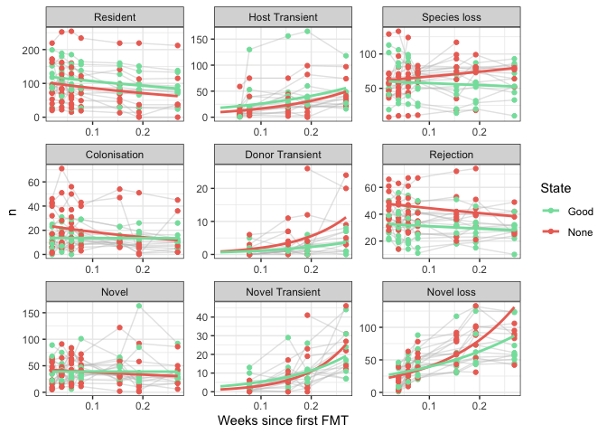
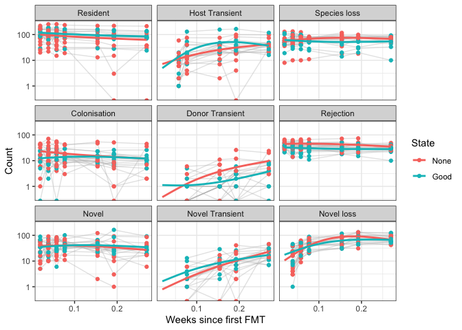

Script plots base case
================
S. Pinto
December 2022

## Load required packages

``` r
library( gamlss )
library( tidyverse )
library( ggplot2 )
library( aod )
library( nlme )
library( lme4 )
library( splines )
library( jtools )
library( dplyr )
library( reshape2 )
```

## Load the data

Here we use the relative abundance dataset.

# Model the data

``` r
Scenario2.model <- Scenario2
# Remove category 'Absent', because always 9
Scenario2.model <- Scenario2.model  %>% filter( category != "Absent" )
# make time categorical (translate to weeks)
Scenario2.model$time <- 0
Scenario2.model$time[ Scenario2.model$timepoint == "Post_1" ] <- 1
Scenario2.model$time[ Scenario2.model$timepoint == "Post_2" ] <- 2
Scenario2.model$time[ Scenario2.model$timepoint == "Post_3" ] <- 3
Scenario2.model$time[ Scenario2.model$timepoint == "Post_4" ] <- 4
Scenario2.model$time[ Scenario2.model$timepoint == "Week8" ] <- 8
Scenario2.model$time[ Scenario2.model$timepoint == "Week10" ] <- 10
Scenario2.model$time[ Scenario2.model$timepoint == "Week14" ] <- 14
# Rescale time, because of the warning (Model is nearly unidentifiable: very large eigenvalue)
Scenario2.model$time2 <- Scenario2.model$time / 52
Scenario2.model$Scenario2[Scenario2.model$category == "Host Transient" & (Scenario2.model$time2 ==1/52 | Scenario2.model$time2 ==2/52)] <- NA
Scenario2.model$Scenario2[Scenario2.model$category == "Donor Transient" & (Scenario2.model$time2 ==1/52 | Scenario2.model$time2 ==2/52 | Scenario2.model$time2 ==3/52)] <- NA
Scenario2.model$Scenario2[Scenario2.model$category == "Novel Transient" & (Scenario2.model$time2 ==1/52 | Scenario2.model$time2 ==2/52 | Scenario2.model$time2 ==3/52)] <- NA
Scenario2.model$Scenario2[Scenario2.model$category == "Novel loss" & (Scenario2.model$time2 ==1/52 )] <- NA
# Rescale age
Scenario2.model$Age <- Scenario2.model$Age %>% as.numeric()
Scenario2.model$Age2 <- Scenario2.model$Age / 10
# reorder state
Scenario2.model$State <- Scenario2.model$State %>% factor(levels = c("None", "Good"))
```

Models below take some time to run!

    ## start par. =  1 fn =  16260.77 
    ## At return
    ## eval:  19 fn:      16213.967 par: 0.212477
    ## (NM) 20: f = 16214 at  0.212477  -2.73572   3.35143 0.0301976   2.47941   3.90246   3.32131  0.322109   3.93617   4.79447   4.26035 -0.571924 -0.110383 -0.259133    11.879   8.37114   1.70052   8.05195   13.9015   1.80011  0.665688   3.34285   2.54952  0.199009   1.18832   0.51403  0.726031   1.38342  0.250163  0.731783   0.55944  -5.04679  -4.47207  -1.42581  -3.75281  -6.37053  -2.19267  -1.89738  -3.61698
    ## (NM) 40: f = 16214 at  0.212477  -2.73572   3.35143 0.0301976   2.47941   3.90246   3.32131  0.322109   3.93617   4.79447   4.26035 -0.571924 -0.110383 -0.259133    11.879   8.37114   1.70052   8.05195   13.9015   1.80011  0.665688   3.34285   2.54952  0.199009   1.18832   0.51403  0.726031   1.38342  0.250163  0.731783   0.55944  -5.04679  -4.47207  -1.42581  -3.75281  -6.37053  -2.19267  -1.89738  -3.61698
    ## (NM) 60: f = 16214 at  0.212477  -2.73572   3.35143 0.0301976   2.47941   3.90246   3.32131  0.322109   3.93617   4.79447   4.26035 -0.571924 -0.110383 -0.259133    11.879   8.37114   1.70052   8.05195   13.9015   1.80011  0.665688   3.34285   2.54952  0.199009   1.18832   0.51403  0.726031   1.38342  0.250163  0.731783   0.55944  -5.04679  -4.47207  -1.42581  -3.75281  -6.37053  -2.19267  -1.89738  -3.61698
    ## (NM) 80: f = 16214 at  0.212477  -2.73572   3.35143 0.0301976   2.47941   3.90246   3.32131  0.322109   3.93617   4.79447   4.26035 -0.571924 -0.110383 -0.259133    11.879   8.37114   1.70052   8.05195   13.9015   1.80011  0.665688   3.34285   2.54952  0.199009   1.18832   0.51403  0.726031   1.38342  0.250163  0.731783   0.55944  -5.04679  -4.47207  -1.42581  -3.75281  -6.37053  -2.19267  -1.89738  -3.61698
    ## (NM) 100: f = 16214 at  0.212477  -2.73572   3.35143 0.0301976   2.47941   3.90246   3.32131  0.322109   3.93617   4.79447   4.26035 -0.571924 -0.110383 -0.259133    11.879   8.37114   1.70052   8.05195   13.9015   1.80011  0.665688   3.34285   2.54952  0.199009   1.18832   0.51403  0.726031   1.38342  0.250163  0.731783   0.55944  -5.04679  -4.47207  -1.42581  -3.75281  -6.37053  -2.19267  -1.89738  -3.61698
    ## (NM) 120: f = 16214 at  0.212477  -2.73572   3.35143 0.0301976   2.47941   3.90246   3.32131  0.322109   3.93617   4.79447   4.26035 -0.571924 -0.110383 -0.259133    11.879   8.37114   1.70052   8.05195   13.9015   1.80011  0.665688   3.34285   2.54952  0.199009   1.18832   0.51403  0.726031   1.38342  0.250163  0.731783   0.55944  -5.04679  -4.47207  -1.42581  -3.75281  -6.37053  -2.19267  -1.89738  -3.61698
    ## (NM) 140: f = 16214 at  0.212477  -2.73572   3.35143 0.0301976   2.47941   3.90246   3.32131  0.322109   3.93617   4.79447   4.26035 -0.571924 -0.110383 -0.259133    11.879   8.37114   1.70052   8.05195   13.9015   1.80011  0.665688   3.34285   2.54952  0.199009   1.18832   0.51403  0.726031   1.38342  0.250163  0.731783   0.55944  -5.04679  -4.47207  -1.42581  -3.75281  -6.37053  -2.19267  -1.89738  -3.61698
    ## (NM) 160: f = 16214 at  0.212477  -2.73572   3.35143 0.0301976   2.47941   3.90246   3.32131  0.322109   3.93617   4.79447   4.26035 -0.571924 -0.110383 -0.259133    11.879   8.37114   1.70052   8.05195   13.9015   1.80011  0.665688   3.34285   2.54952  0.199009   1.18832   0.51403  0.726031   1.38342  0.250163  0.731783   0.55944  -5.04679  -4.47207  -1.42581  -3.75281  -6.37053  -2.19267  -1.89738  -3.61698
    ## (NM) 180: f = 16214 at  0.212477  -2.73572   3.35143 0.0301976   2.47941   3.90246   3.32131  0.322109   3.93617   4.79447   4.26035 -0.571924 -0.110383 -0.259133    11.879   8.37114   1.70052   8.05195   13.9015   1.80011  0.665688   3.34285   2.54952  0.199009   1.18832   0.51403  0.726031   1.38342  0.250163  0.731783   0.55944  -5.04679  -4.47207  -1.42581  -3.75281  -6.37053  -2.19267  -1.89738  -3.61698
    ## (NM) 200: f = 16214 at  0.212477  -2.73572   3.35143 0.0301976   2.47941   3.90246   3.32131  0.322109   3.93617   4.79447   4.26035 -0.571924 -0.110383 -0.259133    11.879   8.37114   1.70052   8.05195   13.9015   1.80011  0.665688   3.34285   2.54952  0.199009   1.18832   0.51403  0.726031   1.38342  0.250163  0.731783   0.55944  -5.04679  -4.47207  -1.42581  -3.75281  -6.37053  -2.19267  -1.89738  -3.61698
    ## (NM) 220: f = 16214 at  0.212477  -2.73572   3.35143 0.0301976   2.47941   3.90246   3.32131  0.322109   3.93617   4.79447   4.26035 -0.571924 -0.110383 -0.259133    11.879   8.37114   1.70052   8.05195   13.9015   1.80011  0.665688   3.34285   2.54952  0.199009   1.18832   0.51403  0.726031   1.38342  0.250163  0.731783   0.55944  -5.04679  -4.47207  -1.42581  -3.75281  -6.37053  -2.19267  -1.89738  -3.61698
    ## (NM) 240: f = 16214 at  0.212477  -2.73572   3.35143 0.0301976   2.47941   3.90246   3.32131  0.322109   3.93617   4.79447   4.26035 -0.571924 -0.110383 -0.259133    11.879   8.37114   1.70052   8.05195   13.9015   1.80011  0.665688   3.34285   2.54952  0.199009   1.18832   0.51403  0.726031   1.38342  0.250163  0.731783   0.55944  -5.04679  -4.47207  -1.42581  -3.75281  -6.37053  -2.19267  -1.89738  -3.61698
    ## (NM) 260: f = 16214 at  0.212477  -2.73572   3.35143 0.0301976   2.47941   3.90246   3.32131  0.322109   3.93617   4.79447   4.26035 -0.571924 -0.110383 -0.259133    11.879   8.37114   1.70052   8.05195   13.9015   1.80011  0.665688   3.34285   2.54952  0.199009   1.18832   0.51403  0.726031   1.38342  0.250163  0.731783   0.55944  -5.04679  -4.47207  -1.42581  -3.75281  -6.37053  -2.19267  -1.89738  -3.61698
    ## (NM) 280: f = 16214 at  0.212477  -2.73572   3.35143 0.0301976   2.47941   3.90246   3.32131  0.322109   3.93617   4.79447   4.26035 -0.571924 -0.110383 -0.259133    11.879   8.37114   1.70052   8.05195   13.9015   1.80011  0.665688   3.34285   2.54952  0.199009   1.18832   0.51403  0.726031   1.38342  0.250163  0.731783   0.55944  -5.04679  -4.47207  -1.42581  -3.75281  -6.37053  -2.19267  -1.89738  -3.61698
    ## (NM) 300: f = 16214 at  0.212477  -2.73572   3.35143 0.0301976   2.47941   3.90246   3.32131  0.322109   3.93617   4.79447   4.26035 -0.571924 -0.110383 -0.259133    11.879   8.37114   1.70052   8.05195   13.9015   1.80011  0.665688   3.34285   2.54952  0.199009   1.18832   0.51403  0.726031   1.38342  0.250163  0.731783   0.55944  -5.04679  -4.47207  -1.42581  -3.75281  -6.37053  -2.19267  -1.89738  -3.61698
    ## (NM) 320: f = 16214 at  0.212477  -2.73572   3.35143 0.0301976   2.47941   3.90246   3.32131  0.322109   3.93617   4.79447   4.26035 -0.571924 -0.110383 -0.259133    11.879   8.37114   1.70052   8.05195   13.9015   1.80011  0.665688   3.34285   2.54952  0.199009   1.18832   0.51403  0.726031   1.38342  0.250163  0.731783   0.55944  -5.04679  -4.47207  -1.42581  -3.75281  -6.37053  -2.19267  -1.89738  -3.61698
    ## (NM) 340: f = 16214 at  0.212477  -2.73572   3.35143 0.0301976   2.47941   3.90246   3.32131  0.322109   3.93617   4.79447   4.26035 -0.571924 -0.110383 -0.259133    11.879   8.37114   1.70052   8.05195   13.9015   1.80011  0.665688   3.34285   2.54952  0.199009   1.18832   0.51403  0.726031   1.38342  0.250163  0.731783   0.55944  -5.04679  -4.47207  -1.42581  -3.75281  -6.37053  -2.19267  -1.89738  -3.61698
    ## (NM) 360: f = 16214 at  0.212477  -2.73572   3.35143 0.0301976   2.47941   3.90246   3.32131  0.322109   3.93617   4.79447   4.26035 -0.571924 -0.110383 -0.259133    11.879   8.37114   1.70052   8.05195   13.9015   1.80011  0.665688   3.34285   2.54952  0.199009   1.18832   0.51403  0.726031   1.38342  0.250163  0.731783   0.55944  -5.04679  -4.47207  -1.42581  -3.75281  -6.37053  -2.19267  -1.89738  -3.61698
    ## (NM) 380: f = 16214 at  0.212477  -2.73572   3.35143 0.0301976   2.47941   3.90246   3.32131  0.322109   3.93617   4.79447   4.26035 -0.571924 -0.110383 -0.259133    11.879   8.37114   1.70052   8.05195   13.9015   1.80011  0.665688   3.34285   2.54952  0.199009   1.18832   0.51403  0.726031   1.38342  0.250163  0.731783   0.55944  -5.04679  -4.47207  -1.42581  -3.75281  -6.37053  -2.19267  -1.89738  -3.61698
    ## (NM) 400: f = 16214 at  0.212477  -2.73572   3.35143 0.0301976   2.47941   3.90246   3.32131  0.322109   3.93617   4.79447   4.26035 -0.571924 -0.110383 -0.259133    11.879   8.37114   1.70052   8.05195   13.9015   1.80011  0.665688   3.34285   2.54952  0.199009   1.18832   0.51403  0.726031   1.38342  0.250163  0.731783   0.55944  -5.04679  -4.47207  -1.42581  -3.75281  -6.37053  -2.19267  -1.89738  -3.61698
    ## (NM) 420: f = 16214 at  0.212477  -2.73572   3.35143 0.0301976   2.47941   3.90246   3.32131  0.322109   3.93617   4.79447   4.26035 -0.571924 -0.110383 -0.259133    11.879   8.37114   1.70052   8.05195   13.9015   1.80011  0.665688   3.34285   2.54952  0.199009   1.18832   0.51403  0.726031   1.38342  0.250163  0.731783   0.55944  -5.04679  -4.47207  -1.42581  -3.75281  -6.37053  -2.19267  -1.89738  -3.61698
    ## (NM) 440: f = 16214 at  0.212477  -2.73572   3.35143 0.0301976   2.47941   3.90246   3.32131  0.322109   3.93617   4.79447   4.26035 -0.571924 -0.110383 -0.259133    11.879   8.37114   1.70052   8.05195   13.9015   1.80011  0.665688   3.34285   2.54952  0.199009   1.18832   0.51403  0.726031   1.38342  0.250163  0.731783   0.55944  -5.04679  -4.47207  -1.42581  -3.75281  -6.37053  -2.19267  -1.89738  -3.61698
    ## (NM) 460: f = 16214 at  0.212477  -2.73572   3.35143 0.0301976   2.47941   3.90246   3.32131  0.322109   3.93617   4.79447   4.26035 -0.571924 -0.110383 -0.259133    11.879   8.37114   1.70052   8.05195   13.9015   1.80011  0.665688   3.34285   2.54952  0.199009   1.18832   0.51403  0.726031   1.38342  0.250163  0.731783   0.55944  -5.04679  -4.47207  -1.42581  -3.75281  -6.37053  -2.19267  -1.89738  -3.61698
    ## (NM) 480: f = 16214 at  0.212477  -2.73572   3.35143 0.0301976   2.47941   3.90246   3.32131  0.322109   3.93617   4.79447   4.26035 -0.571924 -0.110383 -0.259133    11.879   8.37114   1.70052   8.05195   13.9015   1.80011  0.665688   3.34285   2.54952  0.199009   1.18832   0.51403  0.726031   1.38342  0.250163  0.731783   0.55944  -5.04679  -4.47207  -1.42581  -3.75281  -6.37053  -2.19267  -1.89738  -3.61698
    ## (NM) 500: f = 16214 at  0.212477  -2.73572   3.35143 0.0301976   2.47941   3.90246   3.32131  0.322109   3.93617   4.79447   4.26035 -0.571924 -0.110383 -0.259133    11.879   8.37114   1.70052   8.05195   13.9015   1.80011  0.665688   3.34285   2.54952  0.199009   1.18832   0.51403  0.726031   1.38342  0.250163  0.731783   0.55944  -5.04679  -4.47207  -1.42581  -3.75281  -6.37053  -2.19267  -1.89738  -3.61698
    ## (NM) 520: f = 16214 at  0.212477  -2.73572   3.35143 0.0301976   2.47941   3.90246   3.32131  0.322109   3.93617   4.79447   4.26035 -0.571924 -0.110383 -0.259133    11.879   8.37114   1.70052   8.05195   13.9015   1.80011  0.665688   3.34285   2.54952  0.199009   1.18832   0.51403  0.726031   1.38342  0.250163  0.731783   0.55944  -5.04679  -4.47207  -1.42581  -3.75281  -6.37053  -2.19267  -1.89738  -3.61698
    ## (NM) 540: f = 16214 at  0.212477  -2.73572   3.35143 0.0301976   2.47941   3.90246   3.32131  0.322109   3.93617   4.79447   4.26035 -0.571924 -0.110383 -0.259133    11.879   8.37114   1.70052   8.05195   13.9015   1.80011  0.665688   3.34285   2.54952  0.199009   1.18832   0.51403  0.726031   1.38342  0.250163  0.731783   0.55944  -5.04679  -4.47207  -1.42581  -3.75281  -6.37053  -2.19267  -1.89738  -3.61698
    ## (NM) 560: f = 16214 at  0.212477  -2.73572   3.35143 0.0301976   2.47941   3.90246   3.32131  0.322109   3.93617   4.79447   4.26035 -0.571924 -0.110383 -0.259133    11.879   8.37114   1.70052   8.05195   13.9015   1.80011  0.665688   3.34285   2.54952  0.199009   1.18832   0.51403  0.726031   1.38342  0.250163  0.731783   0.55944  -5.04679  -4.47207  -1.42581  -3.75281  -6.37053  -2.19267  -1.89738  -3.61698
    ## (NM) 580: f = 16214 at  0.212477  -2.73572   3.35143 0.0301976   2.47941   3.90246   3.32131  0.322109   3.93617   4.79447   4.26035 -0.571924 -0.110383 -0.259133    11.879   8.37114   1.70052   8.05195   13.9015   1.80011  0.665688   3.34285   2.54952  0.199009   1.18832   0.51403  0.726031   1.38342  0.250163  0.731783   0.55944  -5.04679  -4.47207  -1.42581  -3.75281  -6.37053  -2.19267  -1.89738  -3.61698
    ## (NM) 600: f = 16214 at  0.212477  -2.73572   3.35143 0.0301976   2.47941   3.90246   3.32131  0.322109   3.93617   4.79447   4.26035 -0.571924 -0.110383 -0.259133    11.879   8.37114   1.70052   8.05195   13.9015   1.80011  0.665688   3.34285   2.54952  0.199009   1.18832   0.51403  0.726031   1.38342  0.250163  0.731783   0.55944  -5.04679  -4.47207  -1.42581  -3.75281  -6.37053  -2.19267  -1.89738  -3.61698
    ## (NM) 620: f = 16214 at  0.212477  -2.73572   3.35143 0.0301976   2.47941   3.90246   3.32131  0.322109   3.93617   4.79447   4.26035 -0.571924 -0.110383 -0.259133    11.879   8.37114   1.70052   8.05195   13.9015   1.80011  0.665688   3.34285   2.54952  0.199009   1.18832   0.51403  0.726031   1.38342  0.250163  0.731783   0.55944  -5.04679  -4.47207  -1.42581  -3.75281  -6.37053  -2.19267  -1.89738  -3.61698
    ## (NM) 640: f = 16214 at  0.212477  -2.73572   3.35143 0.0301976   2.47941   3.90246   3.32131  0.322109   3.93617   4.79447   4.26035 -0.571924 -0.110383 -0.259133    11.879   8.37114   1.70052   8.05195   13.9015   1.80011  0.665688   3.34285   2.54952  0.199009   1.18832   0.51403  0.726031   1.38342  0.250163  0.731783   0.55944  -5.04679  -4.47207  -1.42581  -3.75281  -6.37053  -2.19267  -1.89738  -3.61698
    ## (NM) 660: f = 16214 at  0.212477  -2.73572   3.35143 0.0301976   2.47941   3.90246   3.32131  0.322109   3.93617   4.79447   4.26035 -0.571924 -0.110383 -0.259133    11.879   8.37114   1.70052   8.05195   13.9015   1.80011  0.665688   3.34285   2.54952  0.199009   1.18832   0.51403  0.726031   1.38342  0.250163  0.731783   0.55944  -5.04679  -4.47207  -1.42581  -3.75281  -6.37053  -2.19267  -1.89738  -3.61698
    ## (NM) 680: f = 16214 at  0.212477  -2.73572   3.35143 0.0301976   2.47941   3.90246   3.32131  0.322109   3.93617   4.79447   4.26035 -0.571924 -0.110383 -0.259133    11.879   8.37114   1.70052   8.05195   13.9015   1.80011  0.665688   3.34285   2.54952  0.199009   1.18832   0.51403  0.726031   1.38342  0.250163  0.731783   0.55944  -5.04679  -4.47207  -1.42581  -3.75281  -6.37053  -2.19267  -1.89738  -3.61698
    ## (NM) 700: f = 16214 at  0.212477  -2.73572   3.35143 0.0301976   2.47941   3.90246   3.32131  0.322109   3.93617   4.79447   4.26035 -0.571924 -0.110383 -0.259133    11.879   8.37114   1.70052   8.05195   13.9015   1.80011  0.665688   3.34285   2.54952  0.199009   1.18832   0.51403  0.726031   1.38342  0.250163  0.731783   0.55944  -5.04679  -4.47207  -1.42581  -3.75281  -6.37053  -2.19267  -1.89738  -3.61698
    ## (NM) 720: f = 16214 at  0.212477  -2.73572   3.35143 0.0301976   2.47941   3.90246   3.32131  0.322109   3.93617   4.79447   4.26035 -0.571924 -0.110383 -0.259133    11.879   8.37114   1.70052   8.05195   13.9015   1.80011  0.665688   3.34285   2.54952  0.199009   1.18832   0.51403  0.726031   1.38342  0.250163  0.731783   0.55944  -5.04679  -4.47207  -1.42581  -3.75281  -6.37053  -2.19267  -1.89738  -3.61698
    ## (NM) 740: f = 16214 at  0.212477  -2.73572   3.35143 0.0301976   2.47941   3.90246   3.32131  0.322109   3.93617   4.79447   4.26035 -0.571924 -0.110383 -0.259133    11.879   8.37114   1.70052   8.05195   13.9015   1.80011  0.665688   3.34285   2.54952  0.199009   1.18832   0.51403  0.726031   1.38342  0.250163  0.731783   0.55944  -5.04679  -4.47207  -1.42581  -3.75281  -6.37053  -2.19267  -1.89738  -3.61698
    ## (NM) 760: f = 16214 at  0.212477  -2.73572   3.35143 0.0301976   2.47941   3.90246   3.32131  0.322109   3.93617   4.79447   4.26035 -0.571924 -0.110383 -0.259133    11.879   8.37114   1.70052   8.05195   13.9015   1.80011  0.665688   3.34285   2.54952  0.199009   1.18832   0.51403  0.726031   1.38342  0.250163  0.731783   0.55944  -5.04679  -4.47207  -1.42581  -3.75281  -6.37053  -2.19267  -1.89738  -3.61698
    ## (NM) 780: f = 16214 at  0.212477  -2.73572   3.35143 0.0301976   2.47941   3.90246   3.32131  0.322109   3.93617   4.79447   4.26035 -0.571924 -0.110383 -0.259133    11.879   8.37114   1.70052   8.05195   13.9015   1.80011  0.665688   3.34285   2.54952  0.199009   1.18832   0.51403  0.726031   1.38342  0.250163  0.731783   0.55944  -5.04679  -4.47207  -1.42581  -3.75281  -6.37053  -2.19267  -1.89738  -3.61698
    ## (NM) 800: f = 16214 at  0.212477  -2.73572   3.35143 0.0301976   2.47941   3.90246   3.32131  0.322109   3.93617   4.79447   4.26035 -0.571924 -0.110383 -0.259133    11.879   8.37114   1.70052   8.05195   13.9015   1.80011  0.665688   3.34285   2.54952  0.199009   1.18832   0.51403  0.726031   1.38342  0.250163  0.731783   0.55944  -5.04679  -4.47207  -1.42581  -3.75281  -6.37053  -2.19267  -1.89738  -3.61698
    ## (NM) 820: f = 16214 at  0.212477  -2.73572   3.35143 0.0301976   2.47941   3.90246   3.32131  0.322109   3.93617   4.79447   4.26035 -0.571924 -0.110383 -0.259133    11.879   8.37114   1.70052   8.05195   13.9015   1.80011  0.665688   3.34285   2.54952  0.199009   1.18832   0.51403  0.726031   1.38342  0.250163  0.731783   0.55944  -5.04679  -4.47207  -1.42581  -3.75281  -6.37053  -2.19267  -1.89738  -3.61698
    ## (NM) 840: f = 16214 at  0.212477  -2.73572   3.35143 0.0301976   2.47941   3.90246   3.32131  0.322109   3.93617   4.79447   4.26035 -0.571924 -0.110383 -0.259133    11.879   8.37114   1.70052   8.05195   13.9015   1.80011  0.665688   3.34285   2.54952  0.199009   1.18832   0.51403  0.726031   1.38342  0.250163  0.731783   0.55944  -5.04679  -4.47207  -1.42581  -3.75281  -6.37053  -2.19267  -1.89738  -3.61698
    ## (NM) 860: f = 16214 at  0.212477  -2.73572   3.35143 0.0301976   2.47941   3.90246   3.32131  0.322109   3.93617   4.79447   4.26035 -0.571924 -0.110383 -0.259133    11.879   8.37114   1.70052   8.05195   13.9015   1.80011  0.665688   3.34285   2.54952  0.199009   1.18832   0.51403  0.726031   1.38342  0.250163  0.731783   0.55944  -5.04679  -4.47207  -1.42581  -3.75281  -6.37053  -2.19267  -1.89738  -3.61698
    ## (NM) 880: f = 16214 at  0.212477  -2.73572   3.35143 0.0301976   2.47941   3.90246   3.32131  0.322109   3.93617   4.79447   4.26035 -0.571924 -0.110383 -0.259133    11.879   8.37114   1.70052   8.05195   13.9015   1.80011  0.665688   3.34285   2.54952  0.199009   1.18832   0.51403  0.726031   1.38342  0.250163  0.731783   0.55944  -5.04679  -4.47207  -1.42581  -3.75281  -6.37053  -2.19267  -1.89738  -3.61698
    ## (NM) 900: f = 16214 at  0.212477  -2.73572   3.35143 0.0301976   2.47941   3.90246   3.32131  0.322109   3.93617   4.79447   4.26035 -0.571924 -0.110383 -0.259133    11.879   8.37114   1.70052   8.05195   13.9015   1.80011  0.665688   3.34285   2.54952  0.199009   1.18832   0.51403  0.726031   1.38342  0.250163  0.731783   0.55944  -5.04679  -4.47207  -1.42581  -3.75281  -6.37053  -2.19267  -1.89738  -3.61698
    ## (NM) 920: f = 16214 at  0.212497  -2.73577   3.35132 0.0302911   2.47945   3.90239   3.32126  0.322151   3.93615   4.79447   4.26028 -0.571934 -0.110321 -0.259569   11.8783   8.37079   1.70095   8.05189   13.9015   1.79992  0.665316   3.34297   2.54985  0.198462   1.18837  0.513987  0.726062   1.38324  0.250089  0.731711  0.559414   -5.0449  -4.47288   -1.4264  -3.75324   -6.3709  -2.19244  -1.89724  -3.61709
    ## (NM) 940: f = 16214 at  0.212509  -2.73601   3.35147 0.0302765    2.4794   3.90248   3.32129  0.322084   3.93614   4.79452   4.26033 -0.572077 -0.110396  -0.25954    11.879   8.37152   1.70113   8.05233   13.9023   1.80042  0.665748   3.34335   2.54941  0.199082   1.18849  0.514071  0.726135   1.38353  0.250209  0.731804  0.559501  -5.04622  -4.47234  -1.42582  -3.75274  -6.37094  -2.19226  -1.89677  -3.61687
    ## (NM) 960: f = 16214 at  0.212546  -2.73582    3.3514 0.0302134   2.47941   3.90243   3.32128  0.322128   3.93619   4.79449    4.2603 -0.571997 -0.110421 -0.259486   11.8787    8.3711    1.7008   8.05214   13.9018   1.80021  0.665602   3.34318   2.54953  0.198971    1.1884  0.514042  0.726071   1.38339  0.250157  0.731762  0.559451  -5.04558  -4.47247  -1.42606  -3.75299  -6.37066  -2.19246  -1.89697  -3.61696
    ## (NM) 980: f = 16214 at  0.212481  -2.73586   3.35142 0.0303706    2.4794   3.90243   3.32129  0.322124   3.93617   4.79449   4.26031  -0.57194 -0.110422 -0.259424   11.8787   8.37113   1.70079   8.05214   13.9017   1.80004  0.665625   3.34311   2.54949  0.198831   1.18844  0.514034  0.726072   1.38341  0.250141  0.731747   0.55944  -5.04577   -4.4726  -1.42609  -3.75305  -6.37066  -2.19249  -1.89719  -3.61694
    ## (NM) 1000: f = 16214 at  0.212481  -2.73586   3.35142 0.0303706    2.4794   3.90243   3.32129  0.322124   3.93617   4.79449   4.26031  -0.57194 -0.110422 -0.259424   11.8787   8.37113   1.70079   8.05214   13.9017   1.80004  0.665625   3.34311   2.54949  0.198831   1.18844  0.514034  0.726072   1.38341  0.250141  0.731747   0.55944  -5.04577   -4.4726  -1.42609  -3.75305  -6.37066  -2.19249  -1.89719  -3.61694
    ## (NM) 1020: f = 16214 at  0.212533  -2.73581   3.35143  0.030284    2.4794   3.90243   3.32128  0.322137   3.93618   4.79448   4.26032 -0.571914 -0.110389  -0.25961   11.8785   8.37118   1.70081   8.05209   13.9016   1.80016  0.665724    3.3432   2.54943  0.198825    1.1884   0.51405  0.726069   1.38342  0.250154  0.731761  0.559454   -5.0463  -4.47228  -1.42584    -3.753  -6.37064  -2.19243  -1.89719  -3.61709
    ## (NM) 1040: f = 16214 at  0.212472  -2.73578   3.35138 0.0303185    2.4794   3.90242   3.32128  0.322134   3.93615   4.79447    4.2603 -0.571963 -0.110359 -0.259467   11.8786   8.37097   1.70075   8.05199   13.9015   1.80002  0.665569   3.34297   2.54963  0.198718   1.18834     0.514  0.726039   1.38339  0.250117  0.731733  0.559416  -5.04552  -4.47223  -1.42634  -3.75318  -6.37068  -2.19248  -1.89729  -3.61701
    ## (NM) 1060: f = 16214 at  0.212488  -2.73576   3.35141 0.0302639    2.4794   3.90243   3.32128  0.322127   3.93615   4.79447   4.26031 -0.571972 -0.110399  -0.25944   11.8785   8.37113   1.70083   8.05204   13.9016   1.80008  0.665618   3.34308   2.54957   0.19873   1.18838  0.514029  0.726059   1.38342  0.250124  0.731737  0.559429  -5.04585  -4.47248  -1.42605  -3.75311  -6.37078  -2.19247  -1.89737  -3.61696
    ## (NM) 1080: f = 16214 at  0.212512   -2.7357   3.35139 0.0303156   2.47939   3.90241   3.32128  0.322118   3.93616   4.79446    4.2603 -0.572079 -0.110405 -0.259391   11.8784   8.37104   1.70064     8.052   13.9014   1.80003  0.665658    3.3431   2.54953  0.198778   1.18836  0.514031  0.726044   1.38339  0.250114  0.731738  0.559422  -5.04557  -4.47234  -1.42603  -3.75309  -6.37066  -2.19257  -1.89733  -3.61714
    ## (NM) 1100: f = 16214 at  0.212491  -2.73588   3.35146  0.030318    2.4794   3.90246    3.3213  0.322088   3.93617   4.79449   4.26032  -0.57202 -0.110447  -0.25948   11.8783   8.37139   1.70078   8.05223   13.9018   1.80024  0.665755   3.34321   2.54936   0.19896   1.18841  0.514059  0.726084   1.38349  0.250174  0.731785  0.559465  -5.04597  -4.47229  -1.42583  -3.75292  -6.37091   -2.1924  -1.89711  -3.61698
    ## (NM) 1120: f = 16214 at  0.212518  -2.73579   3.35143 0.0302823    2.4794   3.90243   3.32128  0.322124   3.93617   4.79448   4.26031 -0.571942 -0.110406 -0.259521   11.8786   8.37117   1.70077   8.05209   13.9016   1.80014  0.665701   3.34315   2.54946   0.19883   1.18839  0.514045  0.726062   1.38342  0.250148  0.731756  0.559447  -5.04608  -4.47233  -1.42591  -3.75302  -6.37067  -2.19248  -1.89721  -3.61707
    ## (NM) 1140: f = 16214 at  0.212494  -2.73584   3.35144 0.0303188   2.47939   3.90243   3.32128  0.322094   3.93616   4.79447   4.26032 -0.571955 -0.110469 -0.259428   11.8787   8.37124   1.70066   8.05211   13.9016   1.80015  0.665756   3.34317    2.5495  0.198821   1.18837  0.514048  0.726049   1.38345  0.250146  0.731747  0.559444   -5.0457  -4.47222  -1.42593  -3.75299   -6.3707  -2.19259  -1.89726  -3.61713
    ## (NM) 1160: f = 16214 at  0.212463  -2.73581   3.35142 0.0303342    2.4794   3.90244   3.32129  0.322108   3.93615   4.79447   4.26031 -0.571952 -0.110421 -0.259453   11.8784   8.37114   1.70073   8.05206   13.9013   1.80008  0.665688   3.34304   2.54954    0.1988   1.18836  0.514031  0.726055   1.38345  0.250137  0.731742   0.55944  -5.04597  -4.47237  -1.42599  -3.75304  -6.37067  -2.19256  -1.89723  -3.61713
    ## (NM) 1180: f = 16214 at  0.212499  -2.73571   3.35139 0.0303198   2.47939   3.90242   3.32128  0.322117   3.93615   4.79446    4.2603 -0.571971 -0.110431 -0.259444   11.8784   8.37103   1.70066   8.05196   13.9015   1.80001  0.665634   3.34301   2.54956  0.198765   1.18834  0.514031  0.726031   1.38339  0.250121  0.731732  0.559422  -5.04577  -4.47239  -1.42608  -3.75309  -6.37065  -2.19258  -1.89731  -3.61714
    ## (NM) 1200: f = 16214 at  0.212469  -2.73579   3.35143 0.0303366   2.47939   3.90244   3.32129    0.3221   3.93615   4.79446   4.26032 -0.571935 -0.110458 -0.259421   11.8785   8.37118   1.70069   8.05208   13.9015   1.80015  0.665728   3.34307   2.54946  0.198788   1.18835  0.514032   0.72605   1.38344  0.250135  0.731766  0.559445  -5.04597  -4.47232  -1.42592  -3.75304  -6.37067  -2.19247  -1.89725  -3.61715
    ## (NM) 1220: f = 16214 at  0.212489  -2.73576   3.35143 0.0303095   2.47939   3.90243   3.32128  0.322095   3.93616   4.79447   4.26031 -0.571969  -0.11046 -0.259468   11.8785    8.3712   1.70073    8.0521   13.9016   1.80013   0.66569   3.34307   2.54949  0.198752   1.18836  0.514042  0.726047    1.3835   0.25014  0.731757  0.559445  -5.04591  -4.47224  -1.42597  -3.75298  -6.37067  -2.19257  -1.89722  -3.61707
    ## (NM) 1240: f = 16214 at  0.212482  -2.73574   3.35141 0.0303108   2.47939   3.90243   3.32128  0.322113   3.93616   4.79446   4.26031 -0.571955 -0.110462 -0.259462   11.8784   8.37112   1.70063   8.05203   13.9015   1.80011   0.66567     3.343   2.54959  0.198728   1.18835  0.514033  0.726036   1.38341  0.250125  0.731742  0.559432   -5.0458  -4.47231  -1.42601  -3.75305  -6.37068  -2.19258   -1.8973  -3.61716
    ## (NM) 1260: f = 16214 at  0.212482  -2.73574   3.35141 0.0303108   2.47939   3.90243   3.32128  0.322113   3.93616   4.79446   4.26031 -0.571955 -0.110462 -0.259462   11.8784   8.37112   1.70063   8.05203   13.9015   1.80011   0.66567     3.343   2.54959  0.198728   1.18835  0.514033  0.726036   1.38341  0.250125  0.731742  0.559432   -5.0458  -4.47231  -1.42601  -3.75305  -6.37068  -2.19258   -1.8973  -3.61716
    ## (NM) 1280: f = 16214 at  0.212482  -2.73574   3.35141 0.0303108   2.47939   3.90243   3.32128  0.322113   3.93616   4.79446   4.26031 -0.571955 -0.110462 -0.259462   11.8784   8.37112   1.70063   8.05203   13.9015   1.80011   0.66567     3.343   2.54959  0.198728   1.18835  0.514033  0.726036   1.38341  0.250125  0.731742  0.559432   -5.0458  -4.47231  -1.42601  -3.75305  -6.37068  -2.19258   -1.8973  -3.61716
    ## (NM) 1300: f = 16214 at  0.212484  -2.73577   3.35142 0.0302916   2.47939   3.90243   3.32129  0.322102   3.93616   4.79446   4.26032 -0.571967 -0.110468 -0.259466   11.8783   8.37117   1.70065   8.05207   13.9015   1.80014  0.665695   3.34303   2.54953  0.198795   1.18835  0.514033  0.726041   1.38344  0.250137  0.731751  0.559441  -5.04587  -4.47222  -1.42595  -3.75297  -6.37056  -2.19256  -1.89726  -3.61709
    ## (NM) 1320: f = 16214 at  0.212484  -2.73577   3.35142 0.0302916   2.47939   3.90243   3.32129  0.322102   3.93616   4.79446   4.26032 -0.571967 -0.110468 -0.259466   11.8783   8.37117   1.70065   8.05207   13.9015   1.80014  0.665695   3.34303   2.54953  0.198795   1.18835  0.514033  0.726041   1.38344  0.250137  0.731751  0.559441  -5.04587  -4.47222  -1.42595  -3.75297  -6.37056  -2.19256  -1.89726  -3.61709
    ## (NM) 1340: f = 16214 at  0.212483  -2.73577   3.35142 0.0302917   2.47939   3.90243   3.32129  0.322101   3.93616   4.79446   4.26032 -0.571965 -0.110471 -0.259466   11.8783   8.37117   1.70064   8.05207   13.9015   1.80014  0.665699   3.34302   2.54953  0.198793   1.18835  0.514034   0.72604   1.38344  0.250137  0.731752  0.559441  -5.04586  -4.47221  -1.42594  -3.75297  -6.37055  -2.19256  -1.89726  -3.61709
    ## (NM) 1360: f = 16214 at  0.212477  -2.73579   3.35141  0.030307   2.47939   3.90243   3.32128  0.322098   3.93615   4.79446   4.26032 -0.571946 -0.110453 -0.259477   11.8784   8.37115   1.70064   8.05205   13.9015   1.80011  0.665688   3.34301   2.54956  0.198725   1.18834  0.514033   0.72604   1.38344  0.250137  0.731753  0.559441  -5.04574  -4.47222  -1.42594    -3.753  -6.37062  -2.19259  -1.89727   -3.6171
    ## (NM) 1380: f = 16214 at  0.212477  -2.73579   3.35141  0.030307   2.47939   3.90243   3.32128  0.322098   3.93615   4.79446   4.26032 -0.571946 -0.110453 -0.259477   11.8784   8.37115   1.70064   8.05205   13.9015   1.80011  0.665688   3.34301   2.54956  0.198725   1.18834  0.514033   0.72604   1.38344  0.250137  0.731753  0.559441  -5.04574  -4.47222  -1.42594    -3.753  -6.37062  -2.19259  -1.89727   -3.6171
    ## (NM) 1400: f = 16214 at  0.212477  -2.73579   3.35141  0.030307   2.47939   3.90243   3.32128  0.322098   3.93615   4.79446   4.26032 -0.571946 -0.110453 -0.259477   11.8784   8.37115   1.70064   8.05205   13.9015   1.80011  0.665688   3.34301   2.54956  0.198725   1.18834  0.514033   0.72604   1.38344  0.250137  0.731753  0.559441  -5.04574  -4.47222  -1.42594    -3.753  -6.37062  -2.19259  -1.89727   -3.6171
    ## (NM) 1420: f = 16214 at  0.212475  -2.73579   3.35141 0.0303078   2.47939   3.90243   3.32128  0.322098   3.93615   4.79446   4.26032 -0.571946 -0.110455 -0.259481   11.8784   8.37115   1.70063   8.05205   13.9014   1.80012  0.665688   3.34299   2.54957   0.19872   1.18834  0.514032  0.726038   1.38344  0.250136  0.731754  0.559441  -5.04572   -4.4722  -1.42593  -3.75299  -6.37061  -2.19259  -1.89727   -3.6171
    ## (NM) 1440: f = 16214 at  0.212476  -2.73574   3.35141 0.0303068   2.47938   3.90243   3.32128  0.322102   3.93615   4.79445   4.26032 -0.571944 -0.110464 -0.259464   11.8784   8.37111   1.70054   8.05201   13.9014   1.80009  0.665678   3.34294   2.54961  0.198721   1.18832  0.514024  0.726026   1.38343   0.25013  0.731752   0.55943   -5.0457  -4.47215  -1.42594  -3.75297  -6.37057  -2.19263  -1.89733  -3.61713
    ## (NM) 1460: f = 16214 at  0.212472  -2.73576   3.35141 0.0303047   2.47938   3.90243   3.32128    0.3221   3.93615   4.79445   4.26032 -0.571952 -0.110462 -0.259474   11.8784   8.37113   1.70057   8.05202   13.9014   1.80007  0.665678   3.34295   2.54962   0.19871   1.18832  0.514025  0.726027   1.38343  0.250133  0.731754   0.55944  -5.04569  -4.47215  -1.42594  -3.75295  -6.37057  -2.19263  -1.89731  -3.61715
    ## (NM) 1480: f = 16214 at  0.212466  -2.73578   3.35142 0.0303168   2.47938   3.90243   3.32128  0.322095   3.93615   4.79446   4.26032 -0.571943 -0.110458 -0.259465   11.8785   8.37118   1.70061   8.05203   13.9014   1.80012  0.665705   3.34295   2.54956  0.198734   1.18833  0.514028  0.726034   1.38345  0.250147  0.731757   0.55944   -5.0458  -4.47215  -1.42591  -3.75293   -6.3706  -2.19261   -1.8973  -3.61711
    ## (NM) 1500: f = 16214 at  0.212476  -2.73577   3.35141 0.0303077   2.47938   3.90243   3.32128  0.322105   3.93615   4.79446   4.26032  -0.57194 -0.110456  -0.25945   11.8784   8.37115   1.70057   8.05202   13.9014   1.80012  0.665708   3.34293   2.54957  0.198749   1.18832  0.514029  0.726031   1.38344   0.25014   0.73176  0.559439  -5.04587  -4.47209  -1.42588  -3.75293  -6.37059  -2.19266   -1.8973   -3.6171
    ## (NM) 1520: f = 16214 at  0.212474  -2.73577   3.35141 0.0302961   2.47939   3.90243   3.32128    0.3221   3.93615   4.79446   4.26032 -0.571948 -0.110456 -0.259463   11.8785   8.37115    1.7006   8.05202   13.9014   1.80013  0.665677   3.34296   2.54958  0.198752   1.18833  0.514024  0.726033   1.38343  0.250139   0.73176  0.559441  -5.04572  -4.47213  -1.42591  -3.75292  -6.37057   -2.1926  -1.89729  -3.61709
    ## (NM) 1540: f = 16214 at  0.212481  -2.73575   3.35139 0.0302921   2.47938   3.90242   3.32128  0.322103   3.93615   4.79445   4.26032 -0.571945 -0.110442 -0.259464   11.8784   8.37109   1.70057   8.05198   13.9014   1.80008  0.665648    3.3429   2.54963  0.198731   1.18831   0.51402  0.726022   1.38341  0.250131  0.731755  0.559431  -5.04562  -4.47213  -1.42594  -3.75294  -6.37057  -2.19264  -1.89734  -3.61711
    ## (NM) 1560: f = 16214 at  0.212481  -2.73575   3.35139 0.0302921   2.47938   3.90242   3.32128  0.322103   3.93615   4.79445   4.26032 -0.571945 -0.110442 -0.259464   11.8784   8.37109   1.70057   8.05198   13.9014   1.80008  0.665648    3.3429   2.54963  0.198731   1.18831   0.51402  0.726022   1.38341  0.250131  0.731755  0.559431  -5.04562  -4.47213  -1.42594  -3.75294  -6.37057  -2.19264  -1.89734  -3.61711
    ## (NM) 1580: f = 16214 at  0.212481  -2.73575   3.35139 0.0302921   2.47938   3.90242   3.32128  0.322103   3.93615   4.79445   4.26032 -0.571945 -0.110442 -0.259464   11.8784   8.37109   1.70057   8.05198   13.9014   1.80008  0.665648    3.3429   2.54963  0.198731   1.18831   0.51402  0.726022   1.38341  0.250131  0.731755  0.559431  -5.04562  -4.47213  -1.42594  -3.75294  -6.37057  -2.19264  -1.89734  -3.61711
    ## (NM) 1600: f = 16214 at   0.21248  -2.73574   3.35139 0.0302976   2.47938   3.90243   3.32127  0.322102   3.93615   4.79445   4.26032 -0.571944 -0.110444 -0.259456   11.8784    8.3711   1.70055   8.05197   13.9014   1.80009  0.665659   3.34288   2.54961  0.198731   1.18831  0.514019  0.726022   1.38342  0.250137  0.731758  0.559431  -5.04566   -4.4721  -1.42592  -3.75291  -6.37056  -2.19266  -1.89734  -3.61712
    ## (NM) 1620: f = 16214 at   0.21248  -2.73574   3.35139 0.0302976   2.47938   3.90243   3.32127  0.322102   3.93615   4.79445   4.26032 -0.571944 -0.110444 -0.259456   11.8784    8.3711   1.70055   8.05197   13.9014   1.80009  0.665659   3.34288   2.54961  0.198731   1.18831  0.514019  0.726022   1.38342  0.250137  0.731758  0.559431  -5.04566   -4.4721  -1.42592  -3.75291  -6.37056  -2.19266  -1.89734  -3.61712
    ## (NM) 1640: f = 16214 at  0.212474  -2.73576   3.35139 0.0303029   2.47938   3.90243   3.32127  0.322104   3.93614   4.79445   4.26032 -0.571924 -0.110443 -0.259458   11.8784   8.37109   1.70055   8.05196   13.9013   1.80008  0.665654   3.34286   2.54962  0.198719    1.1883  0.514016  0.726018   1.38341  0.250137  0.731761  0.559433  -5.04573  -4.47208  -1.42589  -3.75288  -6.37054  -2.19266  -1.89736   -3.6171
    ## (NM) 1660: f = 16214 at  0.212482  -2.73574   3.35139 0.0303021   2.47938   3.90242   3.32127  0.322102   3.93614   4.79445   4.26032 -0.571942 -0.110436 -0.259444   11.8784   8.37108   1.70054   8.05196   13.9013   1.80008  0.665649   3.34287    2.5496  0.198725    1.1883  0.514018  0.726017   1.38341  0.250135  0.731759   0.55943  -5.04561  -4.47207   -1.4259  -3.75288  -6.37055  -2.19267  -1.89737   -3.6171
    ## (NM) 1680: f = 16214 at   0.21248  -2.73576   3.35139 0.0302878   2.47938   3.90243   3.32127  0.322102   3.93614   4.79445   4.26032  -0.57194 -0.110442 -0.259461   11.8784   8.37113   1.70058   8.05199   13.9014   1.80013  0.665665   3.34289   2.54959  0.198748    1.1883   0.51402  0.726023   1.38342  0.250142  0.731764  0.559437  -5.04565  -4.47206  -1.42587  -3.75286  -6.37058  -2.19265  -1.89733  -3.61711
    ## (NM) 1700: f = 16214 at  0.212483  -2.73575   3.35139 0.0302893   2.47938   3.90243   3.32127  0.322104   3.93614   4.79445   4.26031 -0.571944 -0.110438 -0.259467   11.8783    8.3711   1.70054   8.05196   13.9014   1.80009  0.665635   3.34287   2.54962  0.198722    1.1883  0.514016  0.726019   1.38341  0.250136  0.731759  0.559433  -5.04552  -4.47209  -1.42591  -3.75288  -6.37055  -2.19266  -1.89734   -3.6171
    ## (NM) 1720: f = 16214 at  0.212474  -2.73574   3.35139 0.0303073   2.47938   3.90243   3.32127  0.322102   3.93614   4.79445   4.26032 -0.571938 -0.110455 -0.259456   11.8783   8.37109   1.70053   8.05196   13.9013   1.80008  0.665652   3.34288   2.54961  0.198716    1.1883  0.514017  0.726016   1.38341  0.250135  0.731757  0.559428  -5.04562  -4.47208  -1.42591  -3.75289  -6.37057  -2.19265  -1.89737  -3.61713
    ## (NM) 1740: f = 16214 at  0.212474  -2.73574   3.35139 0.0303074   2.47938   3.90243   3.32127  0.322102   3.93614   4.79444   4.26032 -0.571937 -0.110454 -0.259457   11.8783   8.37109   1.70053   8.05196   13.9013   1.80008  0.665649   3.34288   2.54961  0.198714    1.1883  0.514017  0.726016   1.38341  0.250134  0.731757  0.559428  -5.04561  -4.47208  -1.42591  -3.75289  -6.37057  -2.19266  -1.89737  -3.61713
    ## (NM) 1760: f = 16214 at  0.212481  -2.73575   3.35139 0.0302955   2.47938   3.90243   3.32127  0.322104   3.93615   4.79445   4.26032 -0.571943 -0.110445 -0.259461   11.8784   8.37113   1.70056   8.05198   13.9014    1.8001  0.665657   3.34288   2.54958  0.198744    1.1883  0.514021  0.726023   1.38341  0.250146  0.731765  0.559437  -5.04564  -4.47207  -1.42587  -3.75286  -6.37055  -2.19264  -1.89734  -3.61709
    ## (NM) 1780: f = 16214 at  0.212481  -2.73575   3.35139 0.0302955   2.47938   3.90243   3.32127  0.322104   3.93615   4.79445   4.26032 -0.571943 -0.110445 -0.259461   11.8784   8.37113   1.70056   8.05198   13.9014    1.8001  0.665657   3.34288   2.54958  0.198744    1.1883  0.514021  0.726023   1.38341  0.250146  0.731765  0.559437  -5.04564  -4.47207  -1.42587  -3.75286  -6.37055  -2.19264  -1.89734  -3.61709
    ## (NM) 1800: f = 16214 at  0.212481  -2.73574   3.35139 0.0303013   2.47938   3.90243   3.32127  0.322101   3.93614   4.79445   4.26032 -0.571941 -0.110443 -0.259471   11.8783   8.37111   1.70056   8.05196   13.9014    1.8001  0.665648   3.34287    2.5496  0.198719    1.1883  0.514018  0.726019    1.3834   0.25014  0.731762  0.559435  -5.04559  -4.47206  -1.42588  -3.75286  -6.37056  -2.19266  -1.89736  -3.61711
    ## (NM) 1820: f = 16214 at  0.212477  -2.73575   3.35139 0.0303038   2.47938   3.90243   3.32127  0.322097   3.93614   4.79445   4.26032 -0.571939 -0.110447 -0.259468   11.8783   8.37113   1.70055   8.05197   13.9014    1.8001  0.665659   3.34288   2.54958  0.198725    1.1883  0.514018  0.726021   1.38342  0.250145  0.731765  0.559435  -5.04562  -4.47203  -1.42586  -3.75285  -6.37055  -2.19266  -1.89735  -3.61711
    ## (NM) 1840: f = 16214 at  0.212477  -2.73575   3.35139 0.0303038   2.47938   3.90243   3.32127  0.322097   3.93614   4.79445   4.26032 -0.571939 -0.110447 -0.259468   11.8783   8.37113   1.70055   8.05197   13.9014    1.8001  0.665659   3.34288   2.54958  0.198725    1.1883  0.514018  0.726021   1.38342  0.250145  0.731765  0.559435  -5.04562  -4.47203  -1.42586  -3.75285  -6.37055  -2.19266  -1.89735  -3.61711
    ## (NM) 1860: f = 16214 at  0.212481  -2.73574   3.35139 0.0303039   2.47938   3.90243   3.32127  0.322101   3.93614   4.79444   4.26032 -0.571944 -0.110444 -0.259463   11.8783   8.37111   1.70053   8.05196   13.9014    1.8001   0.66565   3.34287   2.54958  0.198729    1.1883  0.514018  0.726017   1.38341  0.250144  0.731764  0.559432  -5.04558  -4.47203  -1.42587  -3.75285  -6.37057  -2.19267  -1.89737  -3.61709
    ## (NM) 1880: f = 16214 at  0.212481  -2.73574   3.35139 0.0303039   2.47938   3.90243   3.32127  0.322101   3.93614   4.79444   4.26032 -0.571944 -0.110444 -0.259463   11.8783   8.37111   1.70053   8.05196   13.9014    1.8001   0.66565   3.34287   2.54958  0.198729    1.1883  0.514018  0.726017   1.38341  0.250144  0.731764  0.559432  -5.04558  -4.47203  -1.42587  -3.75285  -6.37057  -2.19267  -1.89737  -3.61709
    ## (NM) 1900: f = 16214 at  0.212481  -2.73574   3.35139 0.0303039   2.47938   3.90243   3.32127  0.322101   3.93614   4.79444   4.26032 -0.571944 -0.110444 -0.259463   11.8783   8.37111   1.70053   8.05196   13.9014    1.8001   0.66565   3.34287   2.54958  0.198729    1.1883  0.514018  0.726017   1.38341  0.250144  0.731764  0.559432  -5.04558  -4.47203  -1.42587  -3.75285  -6.37057  -2.19267  -1.89737  -3.61709
    ## (NM) 1920: f = 16214 at  0.212476  -2.73574   3.35139 0.0303077   2.47938   3.90243   3.32127  0.322098   3.93614   4.79445   4.26032 -0.571945 -0.110451  -0.25947   11.8783   8.37113   1.70054   8.05198   13.9014   1.80011  0.665654   3.34288   2.54957  0.198733    1.1883  0.514019  0.726021   1.38341  0.250147  0.731767  0.559435  -5.04561  -4.47204  -1.42586  -3.75284  -6.37057  -2.19265  -1.89735  -3.61707
    ## (NM) 1940: f = 16214 at  0.212477  -2.73574   3.35139 0.0303039   2.47938   3.90243   3.32127  0.322099   3.93614   4.79445   4.26032 -0.571944 -0.110453 -0.259462   11.8784   8.37114   1.70052   8.05197   13.9014   1.80011  0.665658   3.34288   2.54955  0.198739    1.1883   0.51402   0.72602   1.38341  0.250151  0.731769  0.559434  -5.04558  -4.47201  -1.42585  -3.75283  -6.37057  -2.19266  -1.89736  -3.61707
    ## (NM) 1960: f = 16214 at  0.212477  -2.73573   3.35139 0.0303105   2.47938   3.90243   3.32127  0.322097   3.93614   4.79444   4.26031 -0.571948 -0.110451 -0.259465   11.8783   8.37112   1.70051   8.05196   13.9014   1.80009  0.665654   3.34288   2.54956  0.198715   1.18829  0.514018  0.726016   1.38341  0.250146  0.731764  0.559432  -5.04555  -4.47202  -1.42587  -3.75284  -6.37056  -2.19268  -1.89737  -3.61709
    ## (NM) 1980: f = 16214 at  0.212478  -2.73573   3.35139 0.0303114   2.47938   3.90243   3.32127  0.322096   3.93614   4.79444   4.26032 -0.571947 -0.110449  -0.25946   11.8783   8.37114   1.70053   8.05197   13.9015   1.80013  0.665658   3.34288   2.54953   0.19874    1.1883  0.514019   0.72602   1.38341  0.250151  0.731769  0.559432  -5.04562  -4.47201  -1.42584  -3.75281  -6.37058  -2.19267  -1.89736  -3.61705
    ## (NM) 2000: f = 16214 at  0.212474  -2.73573   3.35139 0.0303085   2.47938   3.90243   3.32127  0.322095   3.93614   4.79444   4.26031 -0.571948  -0.11045 -0.259466   11.8783   8.37112   1.70051   8.05196   13.9014   1.80011  0.665651   3.34286   2.54957  0.198718   1.18829  0.514017  0.726016   1.38341  0.250149  0.731767  0.559432  -5.04559    -4.472  -1.42586  -3.75283  -6.37056  -2.19268  -1.89737  -3.61707
    ## (NM) 2020: f = 16214 at  0.212474  -2.73573   3.35139 0.0303085   2.47938   3.90243   3.32127  0.322095   3.93614   4.79444   4.26031 -0.571948  -0.11045 -0.259466   11.8783   8.37112   1.70051   8.05196   13.9014   1.80011  0.665651   3.34286   2.54957  0.198718   1.18829  0.514017  0.726016   1.38341  0.250149  0.731767  0.559432  -5.04559    -4.472  -1.42586  -3.75283  -6.37056  -2.19268  -1.89737  -3.61707
    ## (NM) 2040: f = 16214 at  0.212475  -2.73573   3.35138 0.0303066   2.47938   3.90242   3.32127  0.322098   3.93613   4.79444   4.26031 -0.571944 -0.110445 -0.259464   11.8783   8.37111   1.70051   8.05194   13.9014    1.8001  0.665639   3.34285   2.54957  0.198725   1.18829  0.514014  0.726015    1.3834  0.250148  0.731767   0.55943  -5.04554  -4.47201  -1.42586  -3.75282  -6.37057  -2.19268  -1.89737  -3.61704
    ## (NM) 2060: f = 16214 at  0.212475  -2.73573   3.35138 0.0303066   2.47938   3.90242   3.32127  0.322098   3.93613   4.79444   4.26031 -0.571944 -0.110445 -0.259464   11.8783   8.37111   1.70051   8.05194   13.9014    1.8001  0.665639   3.34285   2.54957  0.198725   1.18829  0.514014  0.726015    1.3834  0.250148  0.731767   0.55943  -5.04554  -4.47201  -1.42586  -3.75282  -6.37057  -2.19268  -1.89737  -3.61704
    ## (NM) 2080: f = 16214 at  0.212474  -2.73572   3.35138 0.0303075   2.47938   3.90242   3.32127  0.322096   3.93613   4.79444   4.26031 -0.571941 -0.110444 -0.259459   11.8783   8.37111   1.70049   8.05194   13.9014   1.80009  0.665643   3.34284   2.54956  0.198722   1.18828  0.514014  0.726012    1.3834  0.250149  0.731769  0.559428  -5.04562  -4.47199  -1.42585  -3.75281  -6.37056  -2.19269  -1.89739  -3.61705
    ## (NM) 2100: f = 16214 at  0.212475  -2.73571   3.35138 0.0303094   2.47938   3.90242   3.32127  0.322094   3.93613   4.79444   4.26031 -0.571948 -0.110442 -0.259462   11.8783    8.3711    1.7005   8.05194   13.9014   1.80009  0.665639   3.34285   2.54956  0.198717   1.18829  0.514014  0.726013    1.3834  0.250146  0.731767  0.559428  -5.04558  -4.47201  -1.42587  -3.75282  -6.37057  -2.19268  -1.89738  -3.61705
    ## (NM) 2120: f = 16214 at  0.212476  -2.73571   3.35138  0.030304   2.47938   3.90242   3.32127  0.322094   3.93613   4.79444   4.26031 -0.571948  -0.11044 -0.259459   11.8783   8.37111   1.70049   8.05194   13.9014    1.8001  0.665639   3.34285   2.54956  0.198726   1.18828  0.514016  0.726012    1.3834  0.250151  0.731768  0.559427  -5.04558  -4.47198  -1.42585  -3.75281  -6.37057  -2.19269  -1.89738  -3.61704
    ## (NM) 2140: f = 16214 at  0.212474  -2.73572   3.35138 0.0303035   2.47938   3.90242   3.32127  0.322094   3.93613   4.79444   4.26031 -0.571943 -0.110443 -0.259458   11.8783   8.37111   1.70051   8.05195   13.9014    1.8001  0.665645   3.34285   2.54956   0.19873   1.18829  0.514017  0.726016    1.3834  0.250148  0.731767  0.559428  -5.04562  -4.47202  -1.42586  -3.75283  -6.37057  -2.19267  -1.89737  -3.61704
    ## (NM) 2160: f = 16214 at  0.212474  -2.73572   3.35138 0.0303035   2.47938   3.90242   3.32127  0.322094   3.93613   4.79444   4.26031 -0.571943 -0.110443 -0.259458   11.8783   8.37111   1.70051   8.05195   13.9014    1.8001  0.665645   3.34285   2.54956   0.19873   1.18829  0.514017  0.726016    1.3834  0.250148  0.731767  0.559428  -5.04562  -4.47202  -1.42586  -3.75283  -6.37057  -2.19267  -1.89737  -3.61704

    ## theta.ml: iter 0 'theta = 2.289230'

    ## theta.ml: iter1 theta =2.78843

    ## theta.ml: iter2 theta =2.96665

    ## theta.ml: iter3 theta =2.98276

    ## theta.ml: iter4 theta =2.98288

    ## theta.ml: iter5 theta =2.98288

    ## th := est_theta(glmer(..)) = 2.982878start par. =  1 fn =  8508.095 
    ## At return
    ## eval:  27 fn:      8452.2664 par: 0.138602
    ## (NM) 20: f = 8452.27 at   0.138602    -2.6935     3.4238 -0.0895187    2.39052    3.98854    3.20583   0.187768     4.1056    4.87115    4.33374   -0.57715  -0.150532  -0.349722    12.8607    9.11941    1.41559    9.73581    14.8458    1.84085   0.787591    3.68859    2.59404   0.378647    1.21968   0.478503   0.806889    1.52934    0.19404   0.733111   0.573374   -6.05459   -4.48901   -1.32802   -4.96911   -7.17462   -2.35145   -2.02989   -4.10529
    ## (NM) 40: f = 8452.27 at   0.138602    -2.6935     3.4238 -0.0895187    2.39052    3.98854    3.20583   0.187768     4.1056    4.87115    4.33374   -0.57715  -0.150532  -0.349722    12.8607    9.11941    1.41559    9.73581    14.8458    1.84085   0.787591    3.68859    2.59404   0.378647    1.21968   0.478503   0.806889    1.52934    0.19404   0.733111   0.573374   -6.05459   -4.48901   -1.32802   -4.96911   -7.17462   -2.35145   -2.02989   -4.10529
    ## (NM) 60: f = 8452.27 at   0.138602    -2.6935     3.4238 -0.0895187    2.39052    3.98854    3.20583   0.187768     4.1056    4.87115    4.33374   -0.57715  -0.150532  -0.349722    12.8607    9.11941    1.41559    9.73581    14.8458    1.84085   0.787591    3.68859    2.59404   0.378647    1.21968   0.478503   0.806889    1.52934    0.19404   0.733111   0.573374   -6.05459   -4.48901   -1.32802   -4.96911   -7.17462   -2.35145   -2.02989   -4.10529
    ## (NM) 80: f = 8452.27 at   0.138602    -2.6935     3.4238 -0.0895187    2.39052    3.98854    3.20583   0.187768     4.1056    4.87115    4.33374   -0.57715  -0.150532  -0.349722    12.8607    9.11941    1.41559    9.73581    14.8458    1.84085   0.787591    3.68859    2.59404   0.378647    1.21968   0.478503   0.806889    1.52934    0.19404   0.733111   0.573374   -6.05459   -4.48901   -1.32802   -4.96911   -7.17462   -2.35145   -2.02989   -4.10529
    ## (NM) 100: f = 8452.27 at   0.138602    -2.6935     3.4238 -0.0895187    2.39052    3.98854    3.20583   0.187768     4.1056    4.87115    4.33374   -0.57715  -0.150532  -0.349722    12.8607    9.11941    1.41559    9.73581    14.8458    1.84085   0.787591    3.68859    2.59404   0.378647    1.21968   0.478503   0.806889    1.52934    0.19404   0.733111   0.573374   -6.05459   -4.48901   -1.32802   -4.96911   -7.17462   -2.35145   -2.02989   -4.10529
    ## (NM) 120: f = 8452.27 at   0.138602    -2.6935     3.4238 -0.0895187    2.39052    3.98854    3.20583   0.187768     4.1056    4.87115    4.33374   -0.57715  -0.150532  -0.349722    12.8607    9.11941    1.41559    9.73581    14.8458    1.84085   0.787591    3.68859    2.59404   0.378647    1.21968   0.478503   0.806889    1.52934    0.19404   0.733111   0.573374   -6.05459   -4.48901   -1.32802   -4.96911   -7.17462   -2.35145   -2.02989   -4.10529
    ## (NM) 140: f = 8452.27 at   0.138602    -2.6935     3.4238 -0.0895187    2.39052    3.98854    3.20583   0.187768     4.1056    4.87115    4.33374   -0.57715  -0.150532  -0.349722    12.8607    9.11941    1.41559    9.73581    14.8458    1.84085   0.787591    3.68859    2.59404   0.378647    1.21968   0.478503   0.806889    1.52934    0.19404   0.733111   0.573374   -6.05459   -4.48901   -1.32802   -4.96911   -7.17462   -2.35145   -2.02989   -4.10529
    ## (NM) 160: f = 8452.27 at   0.138602    -2.6935     3.4238 -0.0895187    2.39052    3.98854    3.20583   0.187768     4.1056    4.87115    4.33374   -0.57715  -0.150532  -0.349722    12.8607    9.11941    1.41559    9.73581    14.8458    1.84085   0.787591    3.68859    2.59404   0.378647    1.21968   0.478503   0.806889    1.52934    0.19404   0.733111   0.573374   -6.05459   -4.48901   -1.32802   -4.96911   -7.17462   -2.35145   -2.02989   -4.10529
    ## (NM) 180: f = 8452.27 at   0.138602    -2.6935     3.4238 -0.0895187    2.39052    3.98854    3.20583   0.187768     4.1056    4.87115    4.33374   -0.57715  -0.150532  -0.349722    12.8607    9.11941    1.41559    9.73581    14.8458    1.84085   0.787591    3.68859    2.59404   0.378647    1.21968   0.478503   0.806889    1.52934    0.19404   0.733111   0.573374   -6.05459   -4.48901   -1.32802   -4.96911   -7.17462   -2.35145   -2.02989   -4.10529
    ## (NM) 200: f = 8452.27 at   0.138602    -2.6935     3.4238 -0.0895187    2.39052    3.98854    3.20583   0.187768     4.1056    4.87115    4.33374   -0.57715  -0.150532  -0.349722    12.8607    9.11941    1.41559    9.73581    14.8458    1.84085   0.787591    3.68859    2.59404   0.378647    1.21968   0.478503   0.806889    1.52934    0.19404   0.733111   0.573374   -6.05459   -4.48901   -1.32802   -4.96911   -7.17462   -2.35145   -2.02989   -4.10529
    ## (NM) 220: f = 8452.27 at   0.138602    -2.6935     3.4238 -0.0895187    2.39052    3.98854    3.20583   0.187768     4.1056    4.87115    4.33374   -0.57715  -0.150532  -0.349722    12.8607    9.11941    1.41559    9.73581    14.8458    1.84085   0.787591    3.68859    2.59404   0.378647    1.21968   0.478503   0.806889    1.52934    0.19404   0.733111   0.573374   -6.05459   -4.48901   -1.32802   -4.96911   -7.17462   -2.35145   -2.02989   -4.10529
    ## (NM) 240: f = 8452.27 at   0.138602    -2.6935     3.4238 -0.0895187    2.39052    3.98854    3.20583   0.187768     4.1056    4.87115    4.33374   -0.57715  -0.150532  -0.349722    12.8607    9.11941    1.41559    9.73581    14.8458    1.84085   0.787591    3.68859    2.59404   0.378647    1.21968   0.478503   0.806889    1.52934    0.19404   0.733111   0.573374   -6.05459   -4.48901   -1.32802   -4.96911   -7.17462   -2.35145   -2.02989   -4.10529
    ## (NM) 260: f = 8452.27 at   0.138602    -2.6935     3.4238 -0.0895187    2.39052    3.98854    3.20583   0.187768     4.1056    4.87115    4.33374   -0.57715  -0.150532  -0.349722    12.8607    9.11941    1.41559    9.73581    14.8458    1.84085   0.787591    3.68859    2.59404   0.378647    1.21968   0.478503   0.806889    1.52934    0.19404   0.733111   0.573374   -6.05459   -4.48901   -1.32802   -4.96911   -7.17462   -2.35145   -2.02989   -4.10529
    ## (NM) 280: f = 8452.27 at   0.138602    -2.6935     3.4238 -0.0895187    2.39052    3.98854    3.20583   0.187768     4.1056    4.87115    4.33374   -0.57715  -0.150532  -0.349722    12.8607    9.11941    1.41559    9.73581    14.8458    1.84085   0.787591    3.68859    2.59404   0.378647    1.21968   0.478503   0.806889    1.52934    0.19404   0.733111   0.573374   -6.05459   -4.48901   -1.32802   -4.96911   -7.17462   -2.35145   -2.02989   -4.10529
    ## (NM) 300: f = 8452.27 at   0.138602    -2.6935     3.4238 -0.0895187    2.39052    3.98854    3.20583   0.187768     4.1056    4.87115    4.33374   -0.57715  -0.150532  -0.349722    12.8607    9.11941    1.41559    9.73581    14.8458    1.84085   0.787591    3.68859    2.59404   0.378647    1.21968   0.478503   0.806889    1.52934    0.19404   0.733111   0.573374   -6.05459   -4.48901   -1.32802   -4.96911   -7.17462   -2.35145   -2.02989   -4.10529
    ## (NM) 320: f = 8452.27 at   0.138602    -2.6935     3.4238 -0.0895187    2.39052    3.98854    3.20583   0.187768     4.1056    4.87115    4.33374   -0.57715  -0.150532  -0.349722    12.8607    9.11941    1.41559    9.73581    14.8458    1.84085   0.787591    3.68859    2.59404   0.378647    1.21968   0.478503   0.806889    1.52934    0.19404   0.733111   0.573374   -6.05459   -4.48901   -1.32802   -4.96911   -7.17462   -2.35145   -2.02989   -4.10529
    ## (NM) 340: f = 8452.27 at   0.138602    -2.6935     3.4238 -0.0895187    2.39052    3.98854    3.20583   0.187768     4.1056    4.87115    4.33374   -0.57715  -0.150532  -0.349722    12.8607    9.11941    1.41559    9.73581    14.8458    1.84085   0.787591    3.68859    2.59404   0.378647    1.21968   0.478503   0.806889    1.52934    0.19404   0.733111   0.573374   -6.05459   -4.48901   -1.32802   -4.96911   -7.17462   -2.35145   -2.02989   -4.10529
    ## (NM) 360: f = 8452.27 at   0.138602    -2.6935     3.4238 -0.0895187    2.39052    3.98854    3.20583   0.187768     4.1056    4.87115    4.33374   -0.57715  -0.150532  -0.349722    12.8607    9.11941    1.41559    9.73581    14.8458    1.84085   0.787591    3.68859    2.59404   0.378647    1.21968   0.478503   0.806889    1.52934    0.19404   0.733111   0.573374   -6.05459   -4.48901   -1.32802   -4.96911   -7.17462   -2.35145   -2.02989   -4.10529
    ## (NM) 380: f = 8452.27 at   0.138602    -2.6935     3.4238 -0.0895187    2.39052    3.98854    3.20583   0.187768     4.1056    4.87115    4.33374   -0.57715  -0.150532  -0.349722    12.8607    9.11941    1.41559    9.73581    14.8458    1.84085   0.787591    3.68859    2.59404   0.378647    1.21968   0.478503   0.806889    1.52934    0.19404   0.733111   0.573374   -6.05459   -4.48901   -1.32802   -4.96911   -7.17462   -2.35145   -2.02989   -4.10529
    ## (NM) 400: f = 8452.27 at   0.138602    -2.6935     3.4238 -0.0895187    2.39052    3.98854    3.20583   0.187768     4.1056    4.87115    4.33374   -0.57715  -0.150532  -0.349722    12.8607    9.11941    1.41559    9.73581    14.8458    1.84085   0.787591    3.68859    2.59404   0.378647    1.21968   0.478503   0.806889    1.52934    0.19404   0.733111   0.573374   -6.05459   -4.48901   -1.32802   -4.96911   -7.17462   -2.35145   -2.02989   -4.10529
    ## (NM) 420: f = 8452.27 at   0.138602    -2.6935     3.4238 -0.0895187    2.39052    3.98854    3.20583   0.187768     4.1056    4.87115    4.33374   -0.57715  -0.150532  -0.349722    12.8607    9.11941    1.41559    9.73581    14.8458    1.84085   0.787591    3.68859    2.59404   0.378647    1.21968   0.478503   0.806889    1.52934    0.19404   0.733111   0.573374   -6.05459   -4.48901   -1.32802   -4.96911   -7.17462   -2.35145   -2.02989   -4.10529
    ## (NM) 440: f = 8452.27 at   0.138602    -2.6935     3.4238 -0.0895187    2.39052    3.98854    3.20583   0.187768     4.1056    4.87115    4.33374   -0.57715  -0.150532  -0.349722    12.8607    9.11941    1.41559    9.73581    14.8458    1.84085   0.787591    3.68859    2.59404   0.378647    1.21968   0.478503   0.806889    1.52934    0.19404   0.733111   0.573374   -6.05459   -4.48901   -1.32802   -4.96911   -7.17462   -2.35145   -2.02989   -4.10529
    ## (NM) 460: f = 8452.27 at   0.138602    -2.6935     3.4238 -0.0895187    2.39052    3.98854    3.20583   0.187768     4.1056    4.87115    4.33374   -0.57715  -0.150532  -0.349722    12.8607    9.11941    1.41559    9.73581    14.8458    1.84085   0.787591    3.68859    2.59404   0.378647    1.21968   0.478503   0.806889    1.52934    0.19404   0.733111   0.573374   -6.05459   -4.48901   -1.32802   -4.96911   -7.17462   -2.35145   -2.02989   -4.10529
    ## (NM) 480: f = 8452.27 at   0.138602    -2.6935     3.4238 -0.0895187    2.39052    3.98854    3.20583   0.187768     4.1056    4.87115    4.33374   -0.57715  -0.150532  -0.349722    12.8607    9.11941    1.41559    9.73581    14.8458    1.84085   0.787591    3.68859    2.59404   0.378647    1.21968   0.478503   0.806889    1.52934    0.19404   0.733111   0.573374   -6.05459   -4.48901   -1.32802   -4.96911   -7.17462   -2.35145   -2.02989   -4.10529
    ## (NM) 500: f = 8452.27 at   0.138602    -2.6935     3.4238 -0.0895187    2.39052    3.98854    3.20583   0.187768     4.1056    4.87115    4.33374   -0.57715  -0.150532  -0.349722    12.8607    9.11941    1.41559    9.73581    14.8458    1.84085   0.787591    3.68859    2.59404   0.378647    1.21968   0.478503   0.806889    1.52934    0.19404   0.733111   0.573374   -6.05459   -4.48901   -1.32802   -4.96911   -7.17462   -2.35145   -2.02989   -4.10529
    ## (NM) 520: f = 8452.27 at   0.138602    -2.6935     3.4238 -0.0895187    2.39052    3.98854    3.20583   0.187768     4.1056    4.87115    4.33374   -0.57715  -0.150532  -0.349722    12.8607    9.11941    1.41559    9.73581    14.8458    1.84085   0.787591    3.68859    2.59404   0.378647    1.21968   0.478503   0.806889    1.52934    0.19404   0.733111   0.573374   -6.05459   -4.48901   -1.32802   -4.96911   -7.17462   -2.35145   -2.02989   -4.10529
    ## (NM) 540: f = 8452.27 at   0.138602    -2.6935     3.4238 -0.0895187    2.39052    3.98854    3.20583   0.187768     4.1056    4.87115    4.33374   -0.57715  -0.150532  -0.349722    12.8607    9.11941    1.41559    9.73581    14.8458    1.84085   0.787591    3.68859    2.59404   0.378647    1.21968   0.478503   0.806889    1.52934    0.19404   0.733111   0.573374   -6.05459   -4.48901   -1.32802   -4.96911   -7.17462   -2.35145   -2.02989   -4.10529
    ## (NM) 560: f = 8452.27 at   0.138602    -2.6935     3.4238 -0.0895187    2.39052    3.98854    3.20583   0.187768     4.1056    4.87115    4.33374   -0.57715  -0.150532  -0.349722    12.8607    9.11941    1.41559    9.73581    14.8458    1.84085   0.787591    3.68859    2.59404   0.378647    1.21968   0.478503   0.806889    1.52934    0.19404   0.733111   0.573374   -6.05459   -4.48901   -1.32802   -4.96911   -7.17462   -2.35145   -2.02989   -4.10529
    ## (NM) 580: f = 8452.27 at   0.138602    -2.6935     3.4238 -0.0895187    2.39052    3.98854    3.20583   0.187768     4.1056    4.87115    4.33374   -0.57715  -0.150532  -0.349722    12.8607    9.11941    1.41559    9.73581    14.8458    1.84085   0.787591    3.68859    2.59404   0.378647    1.21968   0.478503   0.806889    1.52934    0.19404   0.733111   0.573374   -6.05459   -4.48901   -1.32802   -4.96911   -7.17462   -2.35145   -2.02989   -4.10529
    ## (NM) 600: f = 8452.27 at   0.138602    -2.6935     3.4238 -0.0895187    2.39052    3.98854    3.20583   0.187768     4.1056    4.87115    4.33374   -0.57715  -0.150532  -0.349722    12.8607    9.11941    1.41559    9.73581    14.8458    1.84085   0.787591    3.68859    2.59404   0.378647    1.21968   0.478503   0.806889    1.52934    0.19404   0.733111   0.573374   -6.05459   -4.48901   -1.32802   -4.96911   -7.17462   -2.35145   -2.02989   -4.10529
    ## (NM) 620: f = 8452.27 at   0.138602    -2.6935     3.4238 -0.0895187    2.39052    3.98854    3.20583   0.187768     4.1056    4.87115    4.33374   -0.57715  -0.150532  -0.349722    12.8607    9.11941    1.41559    9.73581    14.8458    1.84085   0.787591    3.68859    2.59404   0.378647    1.21968   0.478503   0.806889    1.52934    0.19404   0.733111   0.573374   -6.05459   -4.48901   -1.32802   -4.96911   -7.17462   -2.35145   -2.02989   -4.10529
    ## (NM) 640: f = 8452.27 at   0.138602    -2.6935     3.4238 -0.0895187    2.39052    3.98854    3.20583   0.187768     4.1056    4.87115    4.33374   -0.57715  -0.150532  -0.349722    12.8607    9.11941    1.41559    9.73581    14.8458    1.84085   0.787591    3.68859    2.59404   0.378647    1.21968   0.478503   0.806889    1.52934    0.19404   0.733111   0.573374   -6.05459   -4.48901   -1.32802   -4.96911   -7.17462   -2.35145   -2.02989   -4.10529
    ## (NM) 660: f = 8452.27 at   0.138602    -2.6935     3.4238 -0.0895187    2.39052    3.98854    3.20583   0.187768     4.1056    4.87115    4.33374   -0.57715  -0.150532  -0.349722    12.8607    9.11941    1.41559    9.73581    14.8458    1.84085   0.787591    3.68859    2.59404   0.378647    1.21968   0.478503   0.806889    1.52934    0.19404   0.733111   0.573374   -6.05459   -4.48901   -1.32802   -4.96911   -7.17462   -2.35145   -2.02989   -4.10529
    ## (NM) 680: f = 8452.27 at   0.138602    -2.6935     3.4238 -0.0895187    2.39052    3.98854    3.20583   0.187768     4.1056    4.87115    4.33374   -0.57715  -0.150532  -0.349722    12.8607    9.11941    1.41559    9.73581    14.8458    1.84085   0.787591    3.68859    2.59404   0.378647    1.21968   0.478503   0.806889    1.52934    0.19404   0.733111   0.573374   -6.05459   -4.48901   -1.32802   -4.96911   -7.17462   -2.35145   -2.02989   -4.10529
    ## (NM) 700: f = 8452.27 at   0.138602    -2.6935     3.4238 -0.0895187    2.39052    3.98854    3.20583   0.187768     4.1056    4.87115    4.33374   -0.57715  -0.150532  -0.349722    12.8607    9.11941    1.41559    9.73581    14.8458    1.84085   0.787591    3.68859    2.59404   0.378647    1.21968   0.478503   0.806889    1.52934    0.19404   0.733111   0.573374   -6.05459   -4.48901   -1.32802   -4.96911   -7.17462   -2.35145   -2.02989   -4.10529
    ## (NM) 720: f = 8452.27 at   0.138602    -2.6935     3.4238 -0.0895187    2.39052    3.98854    3.20583   0.187768     4.1056    4.87115    4.33374   -0.57715  -0.150532  -0.349722    12.8607    9.11941    1.41559    9.73581    14.8458    1.84085   0.787591    3.68859    2.59404   0.378647    1.21968   0.478503   0.806889    1.52934    0.19404   0.733111   0.573374   -6.05459   -4.48901   -1.32802   -4.96911   -7.17462   -2.35145   -2.02989   -4.10529
    ## (NM) 740: f = 8452.27 at  0.138538  -2.69434   3.42374 -0.090681   2.39107   3.98875   3.20582  0.187465   4.10585   4.87144   4.33385 -0.578082 -0.150209 -0.350328   12.8636   9.11805    1.4152   9.73456   14.8452   1.83997  0.788299   3.69002   2.59706  0.378622   1.21997  0.478259  0.807538   1.52859  0.194039  0.733256  0.573219    -6.056  -4.49423  -1.33019  -4.97031  -7.17098  -2.35143  -2.03183  -4.10548
    ## (NM) 760: f = 8452.27 at   0.138594   -2.69386    3.42396 -0.0906155    2.39117    3.98878    3.20589   0.187534    4.10583    4.87147    4.33382  -0.578221  -0.150147  -0.350346    12.8636    9.11888    1.41545    9.73401    14.8459    1.83901    0.78764    3.68925    2.59717   0.378191    1.21996   0.478782   0.807484    1.52859   0.194157   0.733224   0.573244   -6.05587   -4.49193   -1.32961   -4.96918   -7.17194   -2.35096   -2.03117   -4.10418
    ## (NM) 780: f = 8452.27 at   0.138564   -2.69492    3.42413 -0.0904151    2.39082    3.98889    3.20616   0.188186    4.10597    4.87159    4.33409  -0.578156  -0.150313  -0.350187     12.862    9.11992    1.41593     9.7359    14.8455    1.84081   0.788447    3.68941    2.59471   0.378197    1.22051   0.479128   0.807536    1.52884   0.194527   0.733546   0.573592   -6.05288   -4.49152   -1.32876   -4.96948   -7.16957      -2.35   -2.03067   -4.10476
    ## (NM) 800: f = 8452.27 at   0.138545   -2.69388    3.42387 -0.0906258    2.39104    3.98872    3.20595   0.187361    4.10582    4.87141    4.33382  -0.577878  -0.150258  -0.350168    12.8626    9.11885    1.41559    9.73815    14.8462    1.83951   0.788037    3.68935    2.59613   0.377926    1.21992   0.478711   0.807322    1.52873   0.194022   0.733199   0.573241   -6.05499   -4.49271    -1.3292   -4.97096    -7.1715   -2.34989   -2.03101   -4.10486
    ## (NM) 820: f = 8452.27 at    0.13854   -2.69465    3.42401 -0.0902032    2.39077    3.98878    3.20604   0.187776     4.1059    4.87157    4.33428  -0.577856  -0.150389  -0.350212    12.8626    9.11953    1.41579    9.73635    14.8462    1.84061   0.788782    3.68945    2.59505   0.378179    1.22017    0.47895   0.807582    1.52924   0.194261   0.733368   0.573412   -6.05127   -4.48976   -1.32833   -4.96964    -7.1704   -2.35084   -2.03022   -4.10538
    ## (NM) 840: f = 8452.27 at    0.13851   -2.69465    3.42388 -0.0903692    2.39078     3.9887    3.20604   0.187702    4.10581    4.87149    4.33393  -0.577696  -0.150431   -0.35015     12.863    9.11948    1.41569    9.73606    14.8434    1.84042   0.788758      3.689    2.59468   0.377969    1.22013   0.478912   0.807539    1.52912   0.194245   0.733352   0.573339   -6.05249   -4.49014   -1.32827    -4.9699    -7.1703   -2.35119   -2.03028   -4.10555
    ## (NM) 860: f = 8452.27 at    0.13852   -2.69469    3.42376 -0.0903779    2.39071    3.98878    3.20603   0.187604     4.1059    4.87159    4.33402  -0.577927  -0.150343   -0.35018    12.8623    9.11954    1.41614    9.73604    14.8457    1.84036   0.787841    3.68939    2.59539   0.378087    1.22024   0.478926   0.807549    1.52905   0.194321   0.733399   0.573612   -6.05237   -4.49102   -1.32874   -4.97039   -7.17114   -2.35172    -2.0302    -4.1049
    ## (NM) 880: f = 8452.27 at    0.13852   -2.69469    3.42376 -0.0903779    2.39071    3.98878    3.20603   0.187604     4.1059    4.87159    4.33402  -0.577927  -0.150343   -0.35018    12.8623    9.11954    1.41614    9.73604    14.8457    1.84036   0.787841    3.68939    2.59539   0.378087    1.22024   0.478926   0.807549    1.52905   0.194321   0.733399   0.573612   -6.05237   -4.49102   -1.32874   -4.97039   -7.17114   -2.35172    -2.0302    -4.1049
    ## (NM) 900: f = 8452.27 at   0.138509   -2.69474    3.42373 -0.0903716    2.39069    3.98877    3.20602   0.187604     4.1059    4.87159    4.33402  -0.577877   -0.15036  -0.350168    12.8622     9.1195    1.41613    9.73623    14.8456    1.84058   0.787887    3.68945     2.5953   0.378092    1.22022   0.478906   0.807524    1.52906   0.194302   0.733379   0.573611   -6.05238    -4.4908   -1.32868   -4.97061   -7.17143    -2.3517   -2.03011   -4.10491
    ## (NM) 920: f = 8452.27 at   0.138525   -2.69416    3.42359 -0.0905239    2.39082    3.98859    3.20599   0.187534    4.10576    4.87142    4.33388  -0.577393  -0.150426  -0.350061    12.8622    9.11847    1.41599     9.7361    14.8453    1.84036   0.787765    3.68958    2.59532   0.378296    1.21982   0.478538   0.807239    1.52903   0.194005   0.733097   0.573323   -6.05452   -4.49095   -1.32859   -4.97078   -7.17309   -2.35117   -2.03251   -4.10619
    ## (NM) 940: f = 8452.27 at   0.138533   -2.69409    3.42366 -0.0905318    2.39087    3.98862    3.20595   0.187458    4.10575    4.87144    4.33391  -0.577504  -0.150431   -0.35008    12.8624     9.1184    1.41579    9.73615    14.8452    1.84045   0.787502    3.68936    2.59518   0.378233    1.21987   0.478647     0.8072     1.5289   0.194051   0.733177   0.573407   -6.05584   -4.49087   -1.32906   -4.97117   -7.16954   -2.35209   -2.03007    -4.1051
    ## (NM) 960: f = 8452.27 at   0.138551   -2.69422    3.42363 -0.0904991    2.39079     3.9886    3.20594   0.187479    4.10571    4.87157    4.33389  -0.577459  -0.150406  -0.350095    12.8624     9.1186    1.41547    9.73617    14.8455    1.84039   0.788335     3.6898    2.59538   0.378116    1.21982   0.478659   0.807188    1.52892   0.194024   0.733126   0.573225   -6.05491   -4.49105   -1.32909   -4.97121   -7.17252   -2.35137    -2.0304    -4.1062
    ## (NM) 980: f = 8452.27 at   0.138528   -2.69374    3.42341 -0.0906808     2.3908    3.98858    3.20593   0.187466    4.10567    4.87139    4.33375  -0.577293   -0.15042  -0.350101    12.8628    9.11805    1.41507    9.73594    14.8457     1.8405   0.788161    3.68973    2.59545    0.37805    1.21963   0.478567   0.807146    1.52886   0.193818   0.732947    0.57336   -6.05446   -4.49084   -1.32944   -4.97167   -7.17225   -2.35166   -2.03074   -4.10635
    ## (NM) 1000: f = 8452.27 at   0.138541   -2.69394    3.42342 -0.0906206    2.39077    3.98858    3.20592   0.187383    4.10569    4.87139    4.33374  -0.577292  -0.150469  -0.350037    12.8619    9.11832    1.41574     9.7365     14.845    1.84103   0.787647    3.68992    2.59518    0.37807     1.2197   0.478558   0.807085    1.52893   0.193916   0.733038   0.573311   -6.05549   -4.49059   -1.32922   -4.97236   -7.17307   -2.35231   -2.03062   -4.10602
    ## (NM) 1020: f = 8452.27 at   0.138541   -2.69394    3.42342 -0.0906206    2.39077    3.98858    3.20592   0.187383    4.10569    4.87139    4.33374  -0.577292  -0.150469  -0.350037    12.8619    9.11832    1.41574     9.7365     14.845    1.84103   0.787647    3.68992    2.59518    0.37807     1.2197   0.478558   0.807085    1.52893   0.193916   0.733038   0.573311   -6.05549   -4.49059   -1.32922   -4.97236   -7.17307   -2.35231   -2.03062   -4.10602
    ## (NM) 1040: f = 8452.27 at   0.138544   -2.69416    3.42358 -0.0904168    2.39069     3.9886    3.20594   0.187499    4.10569    4.87143     4.3339  -0.577315  -0.150542  -0.350035    12.8621    9.11897     1.4158    9.73672    14.8445      1.841   0.788311    3.68949    2.59457   0.377956    1.21986   0.478651   0.807222    1.52903   0.193968   0.733133   0.573327    -6.0533    -4.4891   -1.32855   -4.97144   -7.17164   -2.35184   -2.03024   -4.10631
    ## (NM) 1060: f = 8452.27 at   0.138581   -2.69385    3.42348 -0.0906224    2.39077    3.98857    3.20589   0.187381     4.1058    4.87137    4.33383  -0.577265  -0.150507  -0.350065    12.8623    9.11845    1.41554    9.73615    14.8456     1.8403   0.787829    3.68992    2.59506   0.378047    1.21966   0.478557   0.807114    1.52889   0.193876   0.733028   0.573271   -6.05513   -4.49042    -1.3292   -4.97212    -7.1724   -2.35169   -2.03077   -4.10632
    ## (NM) 1080: f = 8452.27 at   0.138569    -2.6941    3.42356 -0.0904912    2.39076    3.98863     3.2059   0.187478    4.10571    4.87145    4.33387  -0.577399  -0.150499  -0.350071    12.8622     9.1188    1.41588    9.73662    14.8453    1.84095   0.787967    3.68963    2.59514   0.378151    1.21978   0.478599   0.807036    1.52895   0.193928   0.733063   0.573334   -6.05399   -4.49006   -1.32875   -4.97192   -7.17206   -2.35197   -2.03036   -4.10614
    ## (NM) 1100: f = 8452.27 at   0.138546   -2.69395    3.42352 -0.0905325    2.39075    3.98861    3.20587   0.187377    4.10569    4.87143    4.33384  -0.577286   -0.15045  -0.350002    12.8619    9.11869    1.41584     9.7367    14.8454    1.84104   0.787895    3.68983    2.59507   0.377958    1.21964   0.478544   0.807103    1.52887   0.193882   0.733051   0.573315   -6.05479   -4.48964   -1.32922   -4.97196    -7.1722   -2.35197   -2.03064   -4.10641
    ## (NM) 1120: f = 8452.27 at   0.138568   -2.69429    3.42369 -0.0903458    2.39069    3.98865    3.20593   0.187514    4.10573    4.87148    4.33393  -0.577469   -0.15052  -0.350064    12.8617    9.11885    1.41589    9.73722    14.8454    1.84115   0.788229    3.68982    2.59478    0.37816    1.21985   0.478683     0.8072    1.52899   0.194071   0.733165   0.573438   -6.05424   -4.48947   -1.32851   -4.97172   -7.17199   -2.35137   -2.03048   -4.10604
    ## (NM) 1140: f = 8452.27 at   0.138578   -2.69393    3.42355 -0.0906047    2.39077    3.98858    3.20587   0.187389    4.10569    4.87141    4.33386  -0.577354  -0.150471  -0.350043    12.8622    9.11856    1.41561    9.73661    14.8454    1.84129   0.788072    3.68966     2.5952     0.3781    1.21967   0.478558   0.807097    1.52883   0.193942   0.733068   0.573273   -6.05464   -4.49043   -1.32915   -4.97163   -7.17242   -2.35194   -2.03077   -4.10632
    ## (NM) 1160: f = 8452.27 at   0.138563   -2.69396    3.42351 -0.0905234    2.39073    3.98857    3.20586   0.187302    4.10569    4.87141    4.33382   -0.57728  -0.150517  -0.350038    12.8623    9.11866    1.41558    9.73688    14.8453    1.84091   0.788046    3.68965    2.59518   0.378129    1.21961   0.478488   0.807095    1.52891   0.193876   0.733014   0.573312   -6.05472   -4.48997   -1.32891   -4.97199   -7.17266     -2.352   -2.03062   -4.10615
    ## (NM) 1180: f = 8452.27 at   0.138572   -2.69386    3.42349 -0.0905975    2.39071    3.98862    3.20586   0.187356    4.10567    4.87139    4.33381  -0.577198  -0.150542  -0.350003    12.8621    9.11859     1.4155     9.7367    14.8452    1.84076    0.78794    3.68966    2.59504   0.378006    1.21963   0.478479   0.806999    1.52886   0.193869   0.733001   0.573306   -6.05481   -4.48996   -1.32904   -4.97214   -7.17268   -2.35198   -2.03089   -4.10625
    ## (NM) 1200: f = 8452.27 at   0.138578   -2.69396     3.4236 -0.0904929    2.39067    3.98859    3.20586   0.187402     4.1057    4.87144    4.33391  -0.577315  -0.150561  -0.350009    12.8619    9.11896    1.41578    9.73719    14.8454    1.84097   0.788244    3.68959    2.59494    0.37806    1.21972   0.478528   0.807062    1.52892   0.193925   0.733054   0.573373   -6.05394   -4.48922   -1.32863   -4.97168   -7.17208    -2.3517   -2.03074   -4.10607
    ## (NM) 1220: f = 8452.27 at   0.138578   -2.69396     3.4236 -0.0904929    2.39067    3.98859    3.20586   0.187402     4.1057    4.87144    4.33391  -0.577315  -0.150561  -0.350009    12.8619    9.11896    1.41578    9.73719    14.8454    1.84097   0.788244    3.68959    2.59494    0.37806    1.21972   0.478528   0.807062    1.52892   0.193925   0.733054   0.573373   -6.05394   -4.48922   -1.32863   -4.97168   -7.17208    -2.3517   -2.03074   -4.10607
    ## (NM) 1240: f = 8452.27 at   0.138578   -2.69396     3.4236 -0.0904929    2.39067    3.98859    3.20586   0.187402     4.1057    4.87144    4.33391  -0.577315  -0.150561  -0.350009    12.8619    9.11896    1.41578    9.73719    14.8454    1.84097   0.788244    3.68959    2.59494    0.37806    1.21972   0.478528   0.807062    1.52892   0.193925   0.733054   0.573373   -6.05394   -4.48922   -1.32863   -4.97168   -7.17208    -2.3517   -2.03074   -4.10607
    ## (NM) 1260: f = 8452.27 at  0.138585  -2.69395   3.42355  -0.09057   2.39062   3.98859   3.20585   0.18734   4.10569    4.8714   4.33383 -0.577218 -0.150601 -0.349977   12.8617   9.11877   1.41598   9.73742   14.8452   1.84119  0.788149   3.68959   2.59476  0.378077   1.21965  0.478514  0.807008   1.52895  0.193931  0.733034  0.573391  -6.05413  -4.48933  -1.32874  -4.97183   -7.1719  -2.35207  -2.03097  -4.10615
    ## (NM) 1280: f = 8452.27 at   0.138595   -2.69386    3.42352 -0.0906015    2.39066    3.98857    3.20582   0.187359    4.10567     4.8714     4.3338  -0.577212  -0.150609  -0.350006    12.8618    9.11877    1.41569    9.73719    14.8452    1.84088   0.788123    3.68936    2.59504   0.378181    1.21958   0.478448   0.806913    1.52885   0.193867   0.732975   0.573341   -6.05449   -4.48924   -1.32853   -4.97179   -7.17223   -2.35204   -2.03094   -4.10619
    ## (NM) 1300: f = 8452.27 at   0.138595   -2.69388    3.42353 -0.0905779     2.3906    3.98851    3.20581   0.187335    4.10569    4.87141    4.33383  -0.577199  -0.150645  -0.349984    12.8615    9.11889    1.41588    9.73766    14.8454    1.84114   0.788256    3.68937    2.59484   0.378171    1.21957   0.478441   0.806951    1.52886   0.193882   0.732987   0.573384   -6.05411   -4.48848   -1.32841   -4.97157   -7.17212   -2.35196   -2.03092   -4.10603
    ## (NM) 1320: f = 8452.27 at   0.138595   -2.69388    3.42353 -0.0905779     2.3906    3.98851    3.20581   0.187335    4.10569    4.87141    4.33383  -0.577199  -0.150645  -0.349984    12.8615    9.11889    1.41588    9.73766    14.8454    1.84114   0.788256    3.68937    2.59484   0.378171    1.21957   0.478441   0.806951    1.52886   0.193882   0.732987   0.573384   -6.05411   -4.48848   -1.32841   -4.97157   -7.17212   -2.35196   -2.03092   -4.10603
    ## (NM) 1340: f = 8452.27 at   0.138595   -2.69397    3.42361 -0.0905157    2.39063    3.98861    3.20582   0.187356     4.1057    4.87143    4.33383  -0.577282  -0.150646  -0.350004    12.8616    9.11907    1.41583    9.73748    14.8454    1.84088   0.788383     3.6894    2.59507    0.37813    1.21966     0.4785   0.807002    1.52883   0.193953   0.733019   0.573384   -6.05427   -4.48901   -1.32855   -4.97124   -7.17175   -2.35174   -2.03108   -4.10596
    ## (NM) 1360: f = 8452.27 at   0.138593   -2.69375    3.42353 -0.0905656    2.39063    3.98857    3.20578     0.1873    4.10566    4.87139    4.33381  -0.577205  -0.150639  -0.349991    12.8616    9.11884    1.41579     9.7373    14.8454    1.84067   0.788153    3.68925      2.595   0.378041     1.2195    0.47844   0.806923    1.52882   0.193875    0.73299    0.57337   -6.05431    -4.4889   -1.32864   -4.97141   -7.17196   -2.35213   -2.03115   -4.10605
    ## (NM) 1380: f = 8452.27 at   0.138598   -2.69395    3.42352 -0.0905309    2.39061    3.98857    3.20577   0.187318    4.10565     4.8714    4.33382  -0.577155  -0.150645  -0.349966    12.8617    9.11883    1.41591    9.73767    14.8455    1.84088   0.788352    3.68897    2.59489   0.378098    1.21956   0.478446   0.806951    1.52881   0.193889   0.732963   0.573355   -6.05395   -4.48859   -1.32863   -4.97145   -7.17178   -2.35192   -2.03106   -4.10606
    ## (NM) 1400: f = 8452.27 at   0.138598   -2.69395    3.42352 -0.0905309    2.39061    3.98857    3.20577   0.187318    4.10565     4.8714    4.33382  -0.577155  -0.150645  -0.349966    12.8617    9.11883    1.41591    9.73767    14.8455    1.84088   0.788352    3.68897    2.59489   0.378098    1.21956   0.478446   0.806951    1.52881   0.193889   0.732963   0.573355   -6.05395   -4.48859   -1.32863   -4.97145   -7.17178   -2.35192   -2.03106   -4.10606
    ## (NM) 1420: f = 8452.27 at    0.13859   -2.69388    3.42348 -0.0905585    2.39051    3.98856    3.20575   0.187263    4.10562     4.8714    4.33383  -0.577099  -0.150659  -0.349972    12.8618    9.11907    1.41582    9.73755    14.8456    1.84109    0.78843    3.68902     2.5948   0.378002    1.21945   0.478388   0.806871    1.52871   0.193863   0.732879   0.573323   -6.05422   -4.48829    -1.3283   -4.97125   -7.17137   -2.35162   -2.03109   -4.10643
    ## (NM) 1440: f = 8452.27 at    0.13859   -2.69388    3.42348 -0.0905585    2.39051    3.98856    3.20575   0.187263    4.10562     4.8714    4.33383  -0.577099  -0.150659  -0.349972    12.8618    9.11907    1.41582    9.73755    14.8456    1.84109    0.78843    3.68902     2.5948   0.378002    1.21945   0.478388   0.806871    1.52871   0.193863   0.732879   0.573323   -6.05422   -4.48829    -1.3283   -4.97125   -7.17137   -2.35162   -2.03109   -4.10643
    ## (NM) 1460: f = 8452.27 at   0.138598   -2.69393    3.42345 -0.0905882    2.39058    3.98853    3.20573   0.187254    4.10564    4.87139    4.33382  -0.577092  -0.150636  -0.349956    12.8618    9.11892    1.41588    9.73757    14.8456    1.84088   0.788297    3.68895    2.59495   0.377994    1.21945   0.478388   0.806902    1.52873   0.193871   0.732934   0.573348   -6.05398   -4.48833   -1.32866   -4.97121    -7.1716   -2.35216   -2.03131   -4.10662
    ## (NM) 1480: f = 8452.27 at   0.138598   -2.69393    3.42345 -0.0905882    2.39058    3.98853    3.20573   0.187254    4.10564    4.87139    4.33382  -0.577092  -0.150636  -0.349956    12.8618    9.11892    1.41588    9.73757    14.8456    1.84088   0.788297    3.68895    2.59495   0.377994    1.21945   0.478388   0.806902    1.52873   0.193871   0.732934   0.573348   -6.05398   -4.48833   -1.32866   -4.97121    -7.1716   -2.35216   -2.03131   -4.10662
    ## (NM) 1500: f = 8452.27 at   0.138601     -2.694    3.42354 -0.0905489    2.39056    3.98858    3.20573   0.187296    4.10568    4.87142    4.33384  -0.577178  -0.150662  -0.349975    12.8618    9.11918     1.4158    9.73756    14.8457    1.84092   0.788532    3.68892    2.59512   0.377989    1.21951   0.478474   0.806942    1.52871   0.193939   0.732966   0.573362   -6.05376   -4.48831   -1.32876   -4.97094   -7.17117   -2.35208   -2.03106   -4.10629
    ## (NM) 1520: f = 8452.27 at   0.138595   -2.69393    3.42353 -0.0905845    2.39057    3.98857    3.20573   0.187268    4.10568    4.87141    4.33384  -0.577195  -0.150653  -0.349986    12.8619    9.11923    1.41588    9.73741    14.8459     1.8408   0.788428    3.68913    2.59511   0.377986    1.21949   0.478422    0.80694    1.52869   0.193944   0.732962   0.573373   -6.05399   -4.48851   -1.32857   -4.97073   -7.17118   -2.35188   -2.03147   -4.10656
    ## (NM) 1540: f = 8452.27 at   0.138595   -2.69393    3.42353 -0.0905845    2.39057    3.98857    3.20573   0.187268    4.10568    4.87141    4.33384  -0.577195  -0.150653  -0.349986    12.8619    9.11923    1.41588    9.73741    14.8459     1.8408   0.788428    3.68913    2.59511   0.377986    1.21949   0.478422    0.80694    1.52869   0.193944   0.732962   0.573373   -6.05399   -4.48851   -1.32857   -4.97073   -7.17118   -2.35188   -2.03147   -4.10656
    ## (NM) 1560: f = 8452.27 at   0.138595   -2.69393    3.42353 -0.0905845    2.39057    3.98857    3.20573   0.187268    4.10568    4.87141    4.33384  -0.577195  -0.150653  -0.349986    12.8619    9.11923    1.41588    9.73741    14.8459     1.8408   0.788428    3.68913    2.59511   0.377986    1.21949   0.478422    0.80694    1.52869   0.193944   0.732962   0.573373   -6.05399   -4.48851   -1.32857   -4.97073   -7.17118   -2.35188   -2.03147   -4.10656
    ## (NM) 1580: f = 8452.27 at   0.138586   -2.69405     3.4235 -0.0905639    2.39057    3.98857    3.20571   0.187278    4.10567    4.87141    4.33386   -0.57719  -0.150625  -0.349974     12.862    9.11922    1.41597    9.73748    14.8461     1.8409   0.788467    3.68885      2.595   0.377967    1.21948    0.47845   0.806957    1.52865   0.193937   0.732959   0.573356   -6.05366   -4.48846   -1.32875   -4.97052   -7.17096   -2.35179   -2.03117   -4.10634
    ## (NM) 1600: f = 8452.27 at   0.138598   -2.69387    3.42343 -0.0906651    2.39053    3.98854    3.20566   0.187178    4.10565     4.8714    4.33383  -0.577086  -0.150658  -0.349953    12.8621    9.11913    1.41589    9.73753    14.8462    1.84083   0.788463    3.68867    2.59504   0.377867    1.21934   0.478354   0.806878    1.52858   0.193885   0.732886   0.573344   -6.05383   -4.48817    -1.3288   -4.97085   -7.17091     -2.352   -2.03141   -4.10645
    ## (NM) 1620: f = 8452.27 at   0.138586   -2.69395    3.42348 -0.0906206    2.39057    3.98859    3.20568   0.187222    4.10565     4.8714    4.33385  -0.577174    -0.1506  -0.349975    12.8623    9.11921    1.41589     9.7372    14.8463    1.84079   0.788445    3.68882    2.59513   0.377836    1.21941   0.478427    0.80694     1.5286   0.193934   0.732945   0.573353   -6.05382   -4.48866   -1.32897   -4.97063   -7.17088   -2.35199   -2.03128   -4.10643
    ## (NM) 1640: f = 8452.27 at   0.138585   -2.69388    3.42345 -0.0906498    2.39054    3.98857    3.20569   0.187233    4.10565     4.8714    4.33385  -0.577149  -0.150613  -0.349963    12.8624    9.11916    1.41587     9.7374    14.8461     1.8411     0.7883    3.68888    2.59492   0.377929    1.21939    0.47843   0.806923    1.52863   0.193917   0.732946   0.573368   -6.05396   -4.48831   -1.32887    -4.9709   -7.17114   -2.35205   -2.03116   -4.10635
    ## (NM) 1660: f = 8452.27 at   0.138585   -2.69388    3.42345 -0.0906498    2.39054    3.98857    3.20569   0.187233    4.10565     4.8714    4.33385  -0.577149  -0.150613  -0.349963    12.8624    9.11916    1.41587     9.7374    14.8461     1.8411     0.7883    3.68888    2.59492   0.377929    1.21939    0.47843   0.806923    1.52863   0.193917   0.732946   0.573368   -6.05396   -4.48831   -1.32887    -4.9709   -7.17114   -2.35205   -2.03116   -4.10635
    ## (NM) 1680: f = 8452.27 at   0.138586   -2.69402    3.42354 -0.0906068    2.39055    3.98859     3.2057   0.187273    4.10567    4.87143    4.33387  -0.577233  -0.150612  -0.349985    12.8621     9.1194    1.41604    9.73745    14.8463    1.84102   0.788453    3.68888    2.59492   0.377895    1.21949   0.478469   0.806983    1.52865    0.19397   0.732986   0.573413   -6.05342   -4.48833   -1.32868   -4.97055   -7.17087   -2.35203   -2.03108   -4.10623
    ## (NM) 1700: f = 8452.27 at   0.138586    -2.6939    3.42345 -0.0906163    2.39055    3.98856    3.20567   0.187226    4.10564     4.8714    4.33385  -0.577154  -0.150617  -0.349975    12.8622    9.11922    1.41582    9.73736    14.8463    1.84085   0.788376    3.68875    2.59507   0.377897    1.21939   0.478399   0.806923    1.52858   0.193913   0.732919   0.573349   -6.05382   -4.48821    -1.3287   -4.97061   -7.17109   -2.35199   -2.03121   -4.10646
    ## (NM) 1720: f = 8452.27 at   0.138586    -2.6939    3.42345 -0.0906163    2.39055    3.98856    3.20567   0.187226    4.10564     4.8714    4.33385  -0.577154  -0.150617  -0.349975    12.8622    9.11922    1.41582    9.73736    14.8463    1.84085   0.788376    3.68875    2.59507   0.377897    1.21939   0.478399   0.806923    1.52858   0.193913   0.732919   0.573349   -6.05382   -4.48821    -1.3287   -4.97061   -7.17109   -2.35199   -2.03121   -4.10646
    ## (NM) 1740: f = 8452.27 at   0.138585   -2.69385    3.42342 -0.0906531    2.39054    3.98854    3.20567   0.187191    4.10564     4.8714    4.33384  -0.577115  -0.150615  -0.349954    12.8623    9.11918    1.41585    9.73735    14.8462    1.84093   0.788226    3.68879    2.59499   0.377838    1.21937   0.478392     0.8069    1.52859   0.193915   0.732905   0.573343   -6.05362   -4.48828    -1.3288   -4.97073   -7.17115   -2.35214   -2.03121   -4.10644
    ## (NM) 1760: f = 8452.27 at   0.138579   -2.69391    3.42344 -0.0906502    2.39049    3.98855    3.20567   0.187202    4.10562     4.8714    4.33386  -0.577139  -0.150609  -0.349963    12.8623    9.11937    1.41588    9.73746    14.8463    1.84108   0.788327    3.68875    2.59495    0.37782    1.21937   0.478403   0.806901    1.52858   0.193908   0.732904   0.573361   -6.05352   -4.48803    -1.3286    -4.9706   -7.17089   -2.35204   -2.03105   -4.10641
    ## (NM) 1780: f = 8452.27 at    0.13858   -2.69396    3.42345 -0.0906573    2.39053    3.98856    3.20565    0.18721    4.10564     4.8714    4.33386  -0.577171  -0.150597   -0.34996    12.8624     9.1194    1.41593    9.73748    14.8464    1.84106   0.788248    3.68871      2.595   0.377777    1.21937   0.478413   0.806937    1.52856   0.193936   0.732934   0.573375   -6.05342   -4.48817   -1.32882   -4.97042   -7.17094   -2.35213   -2.03115    -4.1064
    ## (NM) 1800: f = 8452.27 at   0.138583   -2.69395    3.42347 -0.0906694    2.39053    3.98856    3.20565   0.187202    4.10565     4.8714    4.33387  -0.577213  -0.150573  -0.349975    12.8625     9.1195    1.41593    9.73733    14.8465    1.84091   0.788265    3.68874    2.59508   0.377756    1.21939   0.478436   0.806961    1.52856   0.193951    0.73294   0.573372   -6.05311   -4.48813    -1.3288   -4.97038   -7.17109   -2.35215   -2.03112   -4.10629
    ## (NM) 1820: f = 8452.27 at   0.138582   -2.69381    3.42339 -0.0907466    2.39053    3.98853    3.20564   0.187152    4.10562    4.87138    4.33383  -0.577115  -0.150591   -0.34995    12.8625    9.11933    1.41581     9.7374    14.8465    1.84085    0.78821    3.68876    2.59503    0.37775    1.21933    0.47836    0.80687    1.52856   0.193896   0.732894   0.573348    -6.0533   -4.48804   -1.32882   -4.97055   -7.17126   -2.35229   -2.03106    -4.1064
    ## (NM) 1840: f = 8452.27 at   0.138582   -2.69381    3.42339 -0.0907466    2.39053    3.98853    3.20564   0.187152    4.10562    4.87138    4.33383  -0.577115  -0.150591   -0.34995    12.8625    9.11933    1.41581     9.7374    14.8465    1.84085    0.78821    3.68876    2.59503    0.37775    1.21933    0.47836    0.80687    1.52856   0.193896   0.732894   0.573348    -6.0533   -4.48804   -1.32882   -4.97055   -7.17126   -2.35229   -2.03106    -4.1064
    ## (NM) 1860: f = 8452.27 at   0.138578   -2.69385    3.42342 -0.0907276     2.3905    3.98855    3.20562   0.187148    4.10561    4.87138    4.33385  -0.577154  -0.150569  -0.349952    12.8626    9.11953    1.41575    9.73745    14.8465    1.84091   0.788124    3.68867    2.59499   0.377709    1.21931   0.478365    0.80688    1.52849    0.19391   0.732886   0.573363   -6.05308   -4.48787   -1.32873   -4.97035   -7.17112   -2.35227   -2.03102   -4.10627
    ## (NM) 1880: f = 8452.27 at   0.138582    -2.6939    3.42342 -0.0907393    2.39052    3.98855    3.20563   0.187166    4.10562    4.87139    4.33385  -0.577176  -0.150573  -0.349967    12.8626    9.11951    1.41583     9.7374    14.8465    1.84087   0.788089    3.68871    2.59502   0.377717    1.21934   0.478388    0.80692    1.52853   0.193919   0.732919   0.573351   -6.05305     -4.488   -1.32866   -4.97035   -7.17122   -2.35223   -2.03113   -4.10616
    ## (NM) 1900: f = 8452.27 at   0.138584   -2.69394    3.42345 -0.0906931    2.39051    3.98856    3.20565   0.187196    4.10563    4.87139    4.33386  -0.577164  -0.150603  -0.349957    12.8624    9.11952     1.4158    9.73756    14.8463    1.84094   0.788256    3.68867      2.595   0.377771    1.21938    0.47841   0.806908    1.52856   0.193926   0.732929   0.573375   -6.05297   -4.48781    -1.3286    -4.9704   -7.17116   -2.35225   -2.03096   -4.10628
    ## (NM) 1920: f = 8452.27 at   0.138584   -2.69393    3.42346 -0.0906871    2.39052    3.98855    3.20565   0.187189    4.10563    4.87139    4.33385  -0.577169  -0.150596  -0.349957    12.8624    9.11945    1.41591    9.73753    14.8464    1.84088   0.788259    3.68868    2.59498   0.377785    1.21938   0.478402   0.806911    1.52856   0.193925   0.732924   0.573373   -6.05311     -4.488    -1.3286   -4.97039   -7.17104   -2.35209    -2.0311   -4.10634
    ## (NM) 1940: f = 8452.27 at   0.138577    -2.6939    3.42342 -0.0907392    2.39049    3.98854    3.20562    0.18716    4.10561    4.87139    4.33386  -0.577161  -0.150574  -0.349952    12.8626    9.11958     1.4158    9.73748    14.8466    1.84096    0.78817     3.6886    2.59497   0.377683    1.21932    0.47839   0.806897    1.52851   0.193924   0.732908   0.573377   -6.05278   -4.48782   -1.32863   -4.97019   -7.17109   -2.35222   -2.03103    -4.1063
    ## (NM) 1960: f = 8452.27 at    0.13858   -2.69387    3.42343 -0.0907539    2.39049    3.98855    3.20563   0.187162    4.10561    4.87139    4.33385  -0.577156  -0.150581  -0.349952    12.8626    9.11954    1.41581     9.7375    14.8465    1.84101   0.788141    3.68865    2.59486    0.37773    1.21933   0.478389   0.806892    1.52854   0.193927   0.732918   0.573377   -6.05286    -4.4878   -1.32863   -4.97039   -7.17127   -2.35221   -2.03098   -4.10622
    ## (NM) 1980: f = 8452.27 at   0.138583   -2.69389    3.42342 -0.0907361    2.39048    3.98854    3.20562   0.187154     4.1056    4.87139    4.33385  -0.577152  -0.150586  -0.349943    12.8626    9.11963    1.41583    9.73758    14.8465    1.84096   0.788092    3.68855    2.59484   0.377687    1.21933   0.478384   0.806889    1.52854   0.193917     0.7329   0.573381    -6.0527   -4.48762   -1.32854   -4.97019   -7.17119   -2.35223   -2.03095   -4.10619
    ## (NM) 2000: f = 8452.27 at    0.13858   -2.69392    3.42343 -0.0907412    2.39049    3.98854    3.20565   0.187168    4.10561    4.87139    4.33384  -0.577136  -0.150591  -0.349939    12.8624    9.11949    1.41578    9.73766    14.8463    1.84098    0.78812    3.68865    2.59478   0.377723    1.21936   0.478386    0.80688    1.52861   0.193919   0.732908   0.573365   -6.05264   -4.48774   -1.32846   -4.97041   -7.17138   -2.35213   -2.03094   -4.10611
    ## (NM) 2020: f = 8452.27 at   0.138582    -2.6939    3.42343 -0.0907706    2.39046    3.98854    3.20562   0.187145     4.1056    4.87139    4.33385  -0.577154  -0.150575  -0.349944    12.8626    9.11967    1.41579    9.73758    14.8466    1.84096   0.788128    3.68852    2.59476   0.377664    1.21931   0.478391   0.806894    1.52856   0.193933   0.732893   0.573359   -6.05223   -4.48749   -1.32844   -4.97017   -7.17151   -2.35213   -2.03088   -4.10614
    ## (NM) 2040: f = 8452.27 at   0.138585   -2.69392    3.42342 -0.0908031    2.39043    3.98853    3.20561   0.187136    4.10558    4.87138    4.33384  -0.577126  -0.150598  -0.349929    12.8626     9.1197    1.41579    9.73782    14.8466    1.84103   0.788167    3.68846    2.59464   0.377665     1.2193   0.478365   0.806855    1.52858   0.193912   0.732887   0.573379   -6.05211   -4.48729   -1.32828   -4.97012   -7.17137   -2.35212   -2.03084    -4.1061
    ## (NM) 2060: f = 8452.27 at   0.138581   -2.69389    3.42341 -0.0908218    2.39043    3.98853     3.2056   0.187111    4.10557    4.87138    4.33384  -0.577105  -0.150586  -0.349925    12.8627     9.1197    1.41572    9.73771    14.8466      1.841   0.788117    3.68844    2.59457    0.37761    1.21928   0.478361   0.806842    1.52856   0.193923   0.732872   0.573355   -6.05199   -4.48736    -1.3283   -4.97006   -7.17144    -2.3521   -2.03078   -4.10611
    ## (NM) 2080: f = 8452.27 at   0.138585    -2.6939    3.42343 -0.0908721    2.39043    3.98852    3.20561     0.1871    4.10557    4.87139    4.33382  -0.577142  -0.150574  -0.349926    12.8628    9.11976     1.4156    9.73774    14.8467      1.841   0.787952    3.68841    2.59448   0.377583    1.21928   0.478365   0.806849     1.5286   0.193932   0.732874   0.573355    -6.0517   -4.48732   -1.32814   -4.97003   -7.17149   -2.35201   -2.03061   -4.10584
    ## (NM) 2100: f = 8452.27 at   0.138585    -2.6939    3.42343 -0.0908721    2.39043    3.98852    3.20561     0.1871    4.10557    4.87139    4.33382  -0.577142  -0.150574  -0.349926    12.8628    9.11976     1.4156    9.73774    14.8467      1.841   0.787952    3.68841    2.59448   0.377583    1.21928   0.478365   0.806849     1.5286   0.193932   0.732874   0.573355    -6.0517   -4.48732   -1.32814   -4.97003   -7.17149   -2.35201   -2.03061   -4.10584
    ## (NM) 2120: f = 8452.27 at   0.138578   -2.69386    3.42341 -0.0908858    2.39042    3.98852    3.20562     0.1871    4.10557    4.87138    4.33383  -0.577142  -0.150564  -0.349933    12.8628    9.11978    1.41565    9.73767    14.8467    1.84093   0.787987    3.68849     2.5945   0.377586     1.2193   0.478384   0.806855    1.52861    0.19393   0.732883   0.573354   -6.05161   -4.48731   -1.32819    -4.9701   -7.17163   -2.35216   -2.03055   -4.10577
    ## (NM) 2140: f = 8452.27 at   0.138581   -2.69389    3.42343 -0.0908322    2.39044    3.98853    3.20563   0.187125    4.10559    4.87138    4.33382  -0.577133  -0.150584   -0.34993    12.8627    9.11962    1.41574    9.73769    14.8466    1.84102   0.788034    3.68855    2.59456    0.37763    1.21932   0.478388   0.806867    1.52864   0.193932   0.732893   0.573358   -6.05208   -4.48756   -1.32829   -4.97027   -7.17151   -2.35212   -2.03076   -4.10589
    ## (NM) 2160: f = 8452.27 at   0.138574   -2.69388    3.42342 -0.0908892    2.39043    3.98852    3.20563   0.187105    4.10558    4.87138    4.33382  -0.577143  -0.150557   -0.34993    12.8629    9.11971    1.41563    9.73764    14.8467    1.84104   0.787923    3.68851    2.59442   0.377559     1.2193   0.478406   0.806868    1.52864    0.19395   0.732889   0.573332   -6.05166   -4.48755   -1.32828   -4.97009   -7.17165   -2.35206    -2.0305   -4.10571
    ## (NM) 2180: f = 8452.27 at   0.138574   -2.69388    3.42342 -0.0908892    2.39043    3.98852    3.20563   0.187105    4.10558    4.87138    4.33382  -0.577143  -0.150557   -0.34993    12.8629    9.11971    1.41563    9.73764    14.8467    1.84104   0.787923    3.68851    2.59442   0.377559     1.2193   0.478406   0.806868    1.52864    0.19395   0.732889   0.573332   -6.05166   -4.48755   -1.32828   -4.97009   -7.17165   -2.35206    -2.0305   -4.10571
    ## (NM) 2200: f = 8452.27 at   0.138579   -2.69393    3.42346 -0.0908665    2.39042    3.98854    3.20564   0.187136    4.10558    4.87139    4.33383  -0.577175  -0.150568   -0.34994    12.8628    9.11975    1.41561    9.73765    14.8467    1.84104   0.788023    3.68853    2.59447   0.377607    1.21935   0.478431   0.806883    1.52869   0.193947   0.732898   0.573344   -6.05179   -4.48764   -1.32824   -4.97005   -7.17144   -2.35195   -2.03047   -4.10562
    ## (NM) 2220: f = 8452.27 at   0.138574   -2.69391    3.42345 -0.0909129    2.39041    3.98854    3.20563   0.187124    4.10558    4.87138    4.33382  -0.577175  -0.150556  -0.349941     12.863    9.11979    1.41564    9.73766    14.8468      1.841    0.78799    3.68853    2.59444   0.377563    1.21935   0.478454   0.806889    1.52871   0.193958   0.732909   0.573335    -6.0515   -4.48765    -1.3283   -4.96994   -7.17166   -2.35205   -2.03041   -4.10548
    ## (NM) 2240: f = 8452.27 at   0.138574   -2.69391    3.42345 -0.0909129    2.39041    3.98854    3.20563   0.187124    4.10558    4.87138    4.33382  -0.577175  -0.150556  -0.349941     12.863    9.11979    1.41564    9.73766    14.8468      1.841    0.78799    3.68853    2.59444   0.377563    1.21935   0.478454   0.806889    1.52871   0.193958   0.732909   0.573335    -6.0515   -4.48765    -1.3283   -4.96994   -7.17166   -2.35205   -2.03041   -4.10548
    ## (NM) 2260: f = 8452.27 at   0.138574   -2.69391    3.42345 -0.0909129    2.39041    3.98854    3.20563   0.187124    4.10558    4.87138    4.33382  -0.577175  -0.150556  -0.349941     12.863    9.11979    1.41564    9.73766    14.8468      1.841    0.78799    3.68853    2.59444   0.377563    1.21935   0.478454   0.806889    1.52871   0.193958   0.732909   0.573335    -6.0515   -4.48765    -1.3283   -4.96994   -7.17166   -2.35205   -2.03041   -4.10548
    ## (NM) 2280: f = 8452.27 at   0.13858  -2.69387   3.42346  -0.09094    2.3904   3.98853   3.20562  0.187091   4.10558   4.87138   4.33381 -0.577155 -0.150563 -0.349938   12.8629   9.11978   1.41554   9.73764   14.8468    1.8409  0.787931   3.68846   2.59438  0.377565   1.21933  0.478424  0.806862   1.52872  0.193951  0.732885  0.573307   -6.0514  -4.48755  -1.32813  -4.96994  -7.17166   -2.3519  -2.03037  -4.10545
    ## (NM) 2300: f = 8452.27 at   0.13858  -2.69387   3.42346  -0.09094    2.3904   3.98853   3.20562  0.187091   4.10558   4.87138   4.33381 -0.577155 -0.150563 -0.349938   12.8629   9.11978   1.41554   9.73764   14.8468    1.8409  0.787931   3.68846   2.59438  0.377565   1.21933  0.478424  0.806862   1.52872  0.193951  0.732885  0.573307   -6.0514  -4.48755  -1.32813  -4.96994  -7.17166   -2.3519  -2.03037  -4.10545
    ## (NM) 2320: f = 8452.27 at   0.13858  -2.69387   3.42346  -0.09094    2.3904   3.98853   3.20562  0.187091   4.10558   4.87138   4.33381 -0.577155 -0.150563 -0.349938   12.8629   9.11978   1.41554   9.73764   14.8468    1.8409  0.787931   3.68846   2.59438  0.377565   1.21933  0.478424  0.806862   1.52872  0.193951  0.732885  0.573307   -6.0514  -4.48755  -1.32813  -4.96994  -7.17166   -2.3519  -2.03037  -4.10545
    ## (NM) 2340: f = 8452.27 at   0.138572   -2.69381    3.42343 -0.0909785    2.39039    3.98851    3.20561   0.187062    4.10555    4.87137     4.3338  -0.577132  -0.150545   -0.34993    12.8631     9.1198    1.41546    9.73757    14.8469    1.84088   0.787883    3.68842    2.59441   0.377496     1.2193   0.478414   0.806843    1.52871   0.193926   0.732861   0.573277   -6.05123   -4.48758   -1.32818   -4.96985   -7.17172   -2.35196   -2.03029   -4.10544
    ## (NM) 2360: f = 8452.27 at   0.138565   -2.69368    3.42339 -0.0909834    2.39038     3.9885    3.20559   0.187038    4.10555    4.87135     4.3338  -0.577081  -0.150551  -0.349927    12.8632    9.11972    1.41549    9.73754    14.8469    1.84094   0.787838    3.68839    2.59443   0.377531    1.21928   0.478388   0.806814    1.52865   0.193903    0.73284   0.573273    -6.0516   -4.48747   -1.32823   -4.96999   -7.17177   -2.35208   -2.03034    -4.1056
    ## (NM) 2380: f = 8452.27 at   0.138572   -2.69369     3.4234 -0.0910359    2.39036    3.98849    3.20558   0.187011    4.10553    4.87136    4.33379  -0.577091  -0.150542  -0.349918    12.8633    9.11984    1.41534    9.73754    14.8471    1.84089   0.787792    3.68829    2.59427   0.377457    1.21925   0.478381   0.806792    1.52868   0.193912   0.732825   0.573257   -6.05109   -4.48731   -1.32807   -4.96983   -7.17175    -2.3519   -2.03018   -4.10541
    ## (NM) 2400: f = 8452.27 at    0.13857   -2.69364     3.4234 -0.0909838    2.39037     3.9885     3.2056   0.187037    4.10555    4.87135     4.3338  -0.577085  -0.150557  -0.349926    12.8632    9.11973    1.41549    9.73753     14.847    1.84083   0.787875    3.68841    2.59438   0.377525    1.21931   0.478415   0.806807    1.52872   0.193898   0.732841   0.573248   -6.05154   -4.48753   -1.32824   -4.97001   -7.17175   -2.35195   -2.03025   -4.10545
    ## (NM) 2420: f = 8452.27 at    0.13857   -2.69364     3.4234 -0.0909838    2.39037     3.9885     3.2056   0.187037    4.10555    4.87135     4.3338  -0.577085  -0.150557  -0.349926    12.8632    9.11973    1.41549    9.73753     14.847    1.84083   0.787875    3.68841    2.59438   0.377525    1.21931   0.478415   0.806807    1.52872   0.193898   0.732841   0.573248   -6.05154   -4.48753   -1.32824   -4.97001   -7.17175   -2.35195   -2.03025   -4.10545
    ## (NM) 2440: f = 8452.27 at   0.138568   -2.69361    3.42339 -0.0910452    2.39032    3.98849    3.20558   0.187003    4.10552    4.87135    4.33379  -0.577063  -0.150556  -0.349914    12.8633    9.11987    1.41538    9.73764    14.8471    1.84089   0.787768    3.68827    2.59418   0.377459    1.21928   0.478393   0.806773    1.52873   0.193904   0.732809   0.573235   -6.05092   -4.48712     -1.328   -4.96988   -7.17197   -2.35191   -2.03005   -4.10528
    ## (NM) 2460: f = 8452.27 at   0.138571   -2.69359     3.4234 -0.0910485    2.39032    3.98848    3.20559      0.187    4.10553    4.87134    4.33379  -0.577052  -0.150564  -0.349914    12.8633    9.11982    1.41535    9.73757    14.8471    1.84083   0.787747     3.6883    2.59418   0.377481     1.2193   0.478401   0.806771    1.52876   0.193897   0.732808   0.573223   -6.05101    -4.4872   -1.32802   -4.96991   -7.17193   -2.35186   -2.03005   -4.10522
    ## (NM) 2480: f = 8452.27 at    0.13857   -2.69361     3.4234 -0.0910561    2.39032    3.98849    3.20557   0.186989    4.10553    4.87135    4.33379  -0.577073  -0.150554  -0.349919    12.8635    9.11987     1.4154    9.73756    14.8472     1.8409   0.787763     3.6883    2.59415   0.377456    1.21929   0.478403   0.806782    1.52874   0.193914   0.732816   0.573236     -6.051   -4.48724   -1.32813    -4.9698   -7.17179   -2.35187   -2.03008   -4.10521
    ## (NM) 2500: f = 8452.27 at    0.13857   -2.69361     3.4234 -0.0910561    2.39032    3.98849    3.20557   0.186989    4.10553    4.87135    4.33379  -0.577073  -0.150554  -0.349919    12.8635    9.11987     1.4154    9.73756    14.8472     1.8409   0.787763     3.6883    2.59415   0.377456    1.21929   0.478403   0.806782    1.52874   0.193914   0.732816   0.573236     -6.051   -4.48724   -1.32813    -4.9698   -7.17179   -2.35187   -2.03008   -4.10521
    ## (NM) 2520: f = 8452.27 at   0.138571   -2.69357    3.42338 -0.0910154    2.39033    3.98848    3.20559      0.187    4.10553    4.87134    4.33378  -0.577036  -0.150577   -0.34991    12.8633    9.11974    1.41541    9.73763     14.847    1.84091   0.787779    3.68833    2.59415   0.377522    1.21929   0.478387   0.806759    1.52875   0.193892   0.732801    0.57323   -6.05139   -4.48724   -1.32806   -4.97001   -7.17189    -2.3518   -2.03012   -4.10532
    ## (NM) 2540: f = 8452.27 at   0.138571   -2.69357    3.42339 -0.0910582    2.39032    3.98848    3.20559   0.186983    4.10553    4.87134    4.33377  -0.577049  -0.150573  -0.349916    12.8634    9.11978    1.41539     9.7376    14.8471    1.84081   0.787738    3.68826     2.5941   0.377484     1.2193   0.478401   0.806774    1.52879   0.193899   0.732805   0.573224   -6.05118   -4.48728   -1.32809   -4.96999   -7.17194   -2.35179   -2.03002   -4.10504
    ## (NM) 2560: f = 8452.27 at  0.138571  -2.69358   3.42339 -0.091033   2.39033   3.98848   3.20559  0.186994   4.10554   4.87135   4.33378 -0.577068 -0.150565 -0.349924   12.8635   9.11977   1.41543   9.73751   14.8471   1.84085  0.787721   3.68837   2.59409  0.377515   1.21931  0.478413  0.806785   1.52879  0.193912  0.732815  0.573233  -6.05138  -4.48737  -1.32806  -4.96997  -7.17193  -2.35173  -2.03005   -4.1051
    ## (NM) 2580: f = 8452.27 at   0.138571   -2.69353     3.4234 -0.0910876     2.3903    3.98848    3.20559    0.18696    4.10553    4.87134    4.33377  -0.577068  -0.150559  -0.349919    12.8636    9.11988    1.41534    9.73753    14.8472    1.84083    0.78764     3.6883      2.594   0.377453    1.21932    0.47842   0.806772    1.52883   0.193914    0.73281   0.573213   -6.05104   -4.48728   -1.32798   -4.96984   -7.17207   -2.35173   -2.02991   -4.10487
    ## (NM) 2600: f = 8452.27 at   0.138573    -2.6935    3.42338 -0.0910318     2.3903    3.98847    3.20559   0.186966    4.10553    4.87135    4.33376   -0.57706   -0.15058  -0.349925    12.8636     9.1198    1.41548    9.73757    14.8471    1.84084   0.787638    3.68833    2.59392   0.377536    1.21934   0.478406   0.806777    1.52883   0.193912   0.732799   0.573222   -6.05152   -4.48722     -1.328   -4.97001   -7.17202   -2.35157      -2.03   -4.10491
    ## (NM) 2620: f = 8452.27 at    0.13857   -2.69346    3.42336 -0.0910286    2.39031    3.98846     3.2056   0.186963    4.10554    4.87134    4.33376  -0.577052  -0.150571  -0.349928    12.8637    9.11971    1.41545    9.73743    14.8471    1.84075   0.787589    3.68838    2.59401    0.37754    1.21935   0.478406   0.806774    1.52882   0.193905   0.732792   0.573201   -6.05173   -4.48737   -1.32805   -4.97008   -7.17205   -2.35161   -2.02999   -4.10498
    ## (NM) 2640: f = 8452.27 at   0.138566   -2.69341    3.42334 -0.0911115    2.39029    3.98845    3.20558   0.186924    4.10552    4.87133    4.33375  -0.577038  -0.150553  -0.349924    12.8639    9.11985    1.41538    9.73741    14.8472    1.84079    0.78753    3.68829    2.59389   0.377462     1.2193   0.478386   0.806759    1.52882   0.193894   0.732768   0.573174    -6.0513   -4.48722   -1.32795   -4.96995   -7.17232   -2.35161   -2.02986    -4.1049
    ## (NM) 2660: f = 8452.27 at   0.138566    -2.6934    3.42334 -0.0911153    2.39029    3.98845    3.20558   0.186921    4.10551    4.87133    4.33375  -0.577037  -0.150552  -0.349924    12.8639    9.11985    1.41538     9.7374    14.8472    1.84078   0.787522    3.68829    2.59389   0.377458     1.2193   0.478386   0.806758    1.52882   0.193894   0.732767   0.573172    -6.0513   -4.48722   -1.32795   -4.96995   -7.17233   -2.35161   -2.02985   -4.10489
    ## (NM) 2680: f = 8452.27 at   0.138567   -2.69349    3.42339 -0.0910811    2.39028    3.98847    3.20558   0.186949    4.10552    4.87135    4.33378  -0.577071  -0.150556  -0.349921    12.8638    9.11995    1.41537    9.73757    14.8472    1.84084   0.787573    3.68829    2.59387   0.377438    1.21933   0.478413   0.806784    1.52883   0.193923   0.732803   0.573211   -6.05092   -4.48711   -1.32791   -4.96983   -7.17216   -2.35159   -2.02983   -4.10487
    ## (NM) 2700: f = 8452.27 at    0.13857   -2.69349    3.42339 -0.0910832    2.39029    3.98847    3.20559   0.186939    4.10553    4.87135    4.33376  -0.577085  -0.150557  -0.349931    12.8638    9.11991    1.41541    9.73748    14.8472    1.84079   0.787532    3.68832    2.59388   0.377451    1.21935   0.478422   0.806792    1.52885   0.193931   0.732806   0.573202   -6.05117   -4.48725   -1.32797   -4.96987   -7.17211   -2.35155   -2.02984   -4.10473
    ## (NM) 2720: f = 8452.27 at   0.138569   -2.69344    3.42338 -0.0910677     2.3903    3.98846     3.2056   0.186944    4.10553    4.87135    4.33376  -0.577068  -0.150565  -0.349928    12.8638    9.11986    1.41543    9.73749    14.8471    1.84073   0.787508    3.68833    2.59388   0.377485    1.21936   0.478421   0.806786    1.52887   0.193915   0.732801   0.573198   -6.05135   -4.48726   -1.32793   -4.96999   -7.17226   -2.35154   -2.02983   -4.10472
    ## (NM) 2740: f = 8452.27 at   0.138568   -2.69346    3.42339 -0.0910767    2.39029    3.98846    3.20559   0.186939    4.10553    4.87135    4.33377  -0.577086  -0.150557  -0.349933    12.8639    9.11991    1.41543    9.73747    14.8472    1.84073   0.787534    3.68831    2.59384   0.377472    1.21937   0.478419     0.8068    1.52886   0.193926   0.732811   0.573203   -6.05123   -4.48727   -1.32795   -4.96983    -7.1722   -2.35153   -2.02983   -4.10471
    ## (NM) 2760: f = 8452.27 at  0.138568  -2.69342   3.42337 -0.091104   2.39028   3.98844   3.20559   0.18691   4.10552   4.87135   4.33375 -0.577067 -0.150558 -0.349923   12.8639   9.11992    1.4154    9.7375   14.8472    1.8407  0.787441   3.68831   2.59379  0.377438   1.21937  0.478408  0.806788   1.52888  0.193917  0.732793  0.573183  -6.05106  -4.48724  -1.32787  -4.96982  -7.17228  -2.35152  -2.02975  -4.10465
    ## (NM) 2780: f = 8452.27 at   0.138565   -2.69346    3.42337 -0.0911194    2.39028    3.98845    3.20558   0.186912    4.10553    4.87135    4.33376  -0.577088  -0.150538   -0.34993    12.8641    9.11998    1.41546    9.73743    14.8473    1.84072   0.787459     3.6883    2.59379   0.377407    1.21938   0.478423   0.806814    1.52887   0.193927   0.732807   0.573189   -6.05117   -4.48726   -1.32795   -4.96974   -7.17222    -2.3515   -2.02971   -4.10464
    ## (NM) 2800: f = 8452.27 at   0.138562   -2.69331    3.42336 -0.0911286    2.39026    3.98843    3.20558   0.186872    4.10553    4.87135    4.33375  -0.577066  -0.150553  -0.349929    12.8642    9.11997    1.41542    9.73739    14.8474    1.84061   0.787366    3.68834    2.59367   0.377422    1.21941   0.478423   0.806793    1.52892   0.193924   0.732795   0.573163   -6.05129   -4.48727   -1.32786   -4.96976    -7.1723   -2.35138    -2.0296   -4.10453
    ## (NM) 2820: f = 8452.27 at   0.138569   -2.69335    3.42338 -0.0911497    2.39027    3.98844    3.20558   0.186863    4.10554    4.87136    4.33375  -0.577084  -0.150559  -0.349928    12.8643    9.12001    1.41543    9.73748    14.8474    1.84054   0.787381    3.68826    2.59363   0.377392    1.21942   0.478423   0.806817    1.52893   0.193932   0.732818   0.573178    -6.0511   -4.48733   -1.32792   -4.96966   -7.17227   -2.35139   -2.02964   -4.10436
    ## (NM) 2840: f = 8452.27 at   0.138568    -2.6933    3.42337 -0.0911704    2.39026    3.98843    3.20557   0.186845    4.10553    4.87135    4.33376  -0.577069  -0.150546  -0.349915    12.8644    9.12003    1.41542    9.73746    14.8474    1.84063   0.787311    3.68832    2.59364   0.377357     1.2194   0.478419   0.806796    1.52891   0.193926    0.73281   0.573176   -6.05108   -4.48725   -1.32788   -4.96967   -7.17221   -2.35149   -2.02961   -4.10452
    ## (NM) 2860: f = 8452.27 at   0.138569   -2.69337    3.42338 -0.0910938    2.39028    3.98844    3.20558   0.186892    4.10555    4.87136    4.33377  -0.577074  -0.150563  -0.349926    12.8641    9.11991    1.41548    9.73746    14.8473    1.84061   0.787497    3.68833    2.59377   0.377451    1.21942    0.47842   0.806815    1.52889   0.193926   0.732828   0.573195   -6.05146   -4.48739   -1.32794   -4.96974   -7.17206   -2.35149   -2.02979   -4.10471
    ## (NM) 2880: f = 8452.27 at   0.138569   -2.69337    3.42338 -0.0910938    2.39028    3.98844    3.20558   0.186892    4.10555    4.87136    4.33377  -0.577074  -0.150563  -0.349926    12.8641    9.11991    1.41548    9.73746    14.8473    1.84061   0.787497    3.68833    2.59377   0.377451    1.21942    0.47842   0.806815    1.52889   0.193926   0.732828   0.573195   -6.05146   -4.48739   -1.32794   -4.96974   -7.17206   -2.35149   -2.02979   -4.10471
    ## (NM) 2900: f = 8452.27 at   0.138569   -2.69326    3.42336 -0.0911866    2.39023    3.98842    3.20556   0.186816    4.10552    4.87135    4.33374   -0.57704  -0.150568  -0.349916    12.8645    9.12003    1.41542    9.73744    14.8475    1.84053   0.787356    3.68824     2.5935    0.37736    1.21941   0.478419   0.806787    1.52895   0.193928   0.732804   0.573166   -6.05113   -4.48726   -1.32785   -4.96951   -7.17228   -2.35133   -2.02961   -4.10438
    ## (NM) 2920: f = 8452.27 at   0.138578   -2.69336     3.4234 -0.0911303    2.39027    3.98844    3.20558   0.186867    4.10556    4.87137    4.33377  -0.577084  -0.150572  -0.349917    12.8642    9.11995     1.4155    9.73753    14.8473    1.84052    0.78751    3.68827    2.59363    0.37743    1.21946    0.47843    0.80683    1.52894   0.193939   0.732857   0.573209   -6.05126   -4.48747   -1.32795   -4.96959     -7.172   -2.35145   -2.02978    -4.1045
    ## (NM) 2940: f = 8452.27 at   0.138575   -2.69334    3.42338 -0.0911025    2.39026    3.98844    3.20558   0.186874    4.10555    4.87136    4.33376  -0.577057  -0.150586  -0.349915    12.8641    9.11987    1.41554    9.73756    14.8472    1.84058   0.787539    3.68833    2.59361   0.377493    1.21944   0.478418   0.806806    1.52894   0.193925   0.732836   0.573209    -6.0516   -4.48739    -1.3279   -4.96973   -7.17203    -2.3514   -2.02982   -4.10461
    ## (NM) 2960: f = 8452.27 at   0.13857  -2.69325   3.42336 -0.091187   2.39022   3.98842   3.20556   0.18681   4.10553   4.87136   4.33375 -0.577034 -0.150573 -0.349912   12.8645   9.12002   1.41544   9.73746   14.8475   1.84052  0.787386   3.68824   2.59347  0.377363   1.21941  0.478419  0.806787   1.52895  0.193929   0.73281  0.573171  -6.05115  -4.48727  -1.32785  -4.96948  -7.17223  -2.35134  -2.02964  -4.10441
    ## (NM) 2980: f = 8452.27 at    0.13857   -2.69324    3.42336 -0.0911942    2.39023    3.98842    3.20556   0.186818    4.10553    4.87135    4.33376  -0.577016  -0.150572  -0.349903    12.8644    9.11994    1.41543    9.73751    14.8474    1.84053   0.787475    3.68823    2.59352   0.377392    1.21942   0.478409   0.806773    1.52894   0.193917   0.732813   0.573169   -6.05107   -4.48727   -1.32781   -4.96959    -7.1722   -2.35145   -2.02964   -4.10457
    ## (NM) 3000: f = 8452.27 at    0.13857   -2.69324    3.42336 -0.0911942    2.39023    3.98842    3.20556   0.186818    4.10553    4.87135    4.33376  -0.577016  -0.150572  -0.349903    12.8644    9.11994    1.41543    9.73751    14.8474    1.84053   0.787475    3.68823    2.59352   0.377392    1.21942   0.478409   0.806773    1.52894   0.193917   0.732813   0.573169   -6.05107   -4.48727   -1.32781   -4.96959    -7.1722   -2.35145   -2.02964   -4.10457
    ## (NM) 3020: f = 8452.27 at   0.138575   -2.69329    3.42338 -0.0911529    2.39026    3.98843    3.20557   0.186827    4.10555    4.87136    4.33376  -0.577069   -0.15057  -0.349917    12.8644    9.11998    1.41555    9.73745    14.8474    1.84047   0.787429    3.68832     2.5935   0.377417    1.21947   0.478426   0.806823    1.52897    0.19394    0.73285     0.5732   -6.05141   -4.48745   -1.32785   -4.96949   -7.17218   -2.35138   -2.02973   -4.10447
    ## (NM) 3040: f = 8452.27 at   0.138575   -2.69329    3.42338 -0.0911514    2.39026    3.98843    3.20557   0.186828    4.10555    4.87136    4.33376  -0.577069   -0.15057  -0.349917    12.8644    9.11998    1.41555    9.73745    14.8474    1.84047   0.787432    3.68832    2.59351   0.377419    1.21947   0.478426   0.806823    1.52897    0.19394   0.732849     0.5732   -6.05141   -4.48744   -1.32785   -4.96949   -7.17219   -2.35138   -2.02973   -4.10448
    ## (NM) 3060: f = 8452.27 at   0.138572    -2.6933    3.42338 -0.0911426    2.39025    3.98843    3.20557   0.186846    4.10555    4.87136    4.33377  -0.577046  -0.150576  -0.349912    12.8643    9.11994    1.41551    9.73748    14.8474    1.84053    0.78753    3.68828    2.59362   0.377429    1.21944   0.478418   0.806806    1.52893   0.193929   0.732841   0.573199   -6.05127   -4.48741   -1.32788   -4.96955   -7.17214   -2.35142   -2.02982   -4.10467
    ## (NM) 3080: f = 8452.27 at   0.138572   -2.69328    3.42337 -0.0911827    2.39023    3.98842    3.20557   0.186819    4.10554    4.87136    4.33376  -0.577043  -0.150569  -0.349911    12.8644       9.12    1.41544    9.73746    14.8475    1.84046   0.787471    3.68822     2.5935   0.377391    1.21945   0.478424   0.806802    1.52897   0.193928    0.73283    0.57318   -6.05109   -4.48735    -1.3278   -4.96945    -7.1722   -2.35136   -2.02962   -4.10447
    ## (NM) 3100: f = 8452.27 at   0.138573   -2.69328    3.42338 -0.0911612    2.39024    3.98842    3.20557   0.186821    4.10555    4.87136    4.33377   -0.57706  -0.150573  -0.349916    12.8644    9.12001    1.41551    9.73745    14.8474    1.84044   0.787481    3.68827    2.59348   0.377416    1.21947   0.478427   0.806821    1.52897   0.193941   0.732848   0.573195   -6.05125   -4.48741    -1.3278   -4.96943   -7.17223    -2.3513   -2.02969   -4.10447
    ## (NM) 3120: f = 8452.27 at   0.138574   -2.69325    3.42336 -0.0911595    2.39024    3.98842    3.20556   0.186817    4.10554    4.87135    4.33376  -0.577017  -0.150585  -0.349908    12.8643    9.11992    1.41549    9.73745    14.8474    1.84048   0.787531    3.68825    2.59351   0.377432    1.21943   0.478407   0.806789    1.52894    0.19392   0.732826   0.573187   -6.05139   -4.48737   -1.32785   -4.96951    -7.1722   -2.35137   -2.02977   -4.10462
    ## (NM) 3140: f = 8452.27 at   0.138574   -2.69325    3.42336 -0.0911595    2.39024    3.98842    3.20556   0.186817    4.10554    4.87135    4.33376  -0.577017  -0.150585  -0.349908    12.8643    9.11992    1.41549    9.73745    14.8474    1.84048   0.787531    3.68825    2.59351   0.377432    1.21943   0.478407   0.806789    1.52894    0.19392   0.732826   0.573187   -6.05139   -4.48737   -1.32785   -4.96951    -7.1722   -2.35137   -2.02977   -4.10462
    ## (NM) 3160: f = 8452.27 at   0.138575    -2.6932    3.42335 -0.0911778    2.39022    3.98841    3.20555   0.186784    4.10554    4.87136    4.33376   -0.57701  -0.150591  -0.349904    12.8645    9.11996    1.41553    9.73744    14.8474    1.84039   0.787505    3.68824    2.59343   0.377423    1.21946   0.478408   0.806793    1.52897   0.193923   0.732841   0.573194    -6.0514    -4.4874    -1.3278   -4.96937   -7.17225   -2.35132   -2.02977   -4.10456
    ## (NM) 3180: f = 8452.27 at   0.138575   -2.69317    3.42334 -0.0912109    2.39021     3.9884    3.20554   0.186764    4.10553    4.87135    4.33375  -0.576984  -0.150589    -0.3499    12.8645    9.11995    1.41549    9.73738    14.8475    1.84036   0.787485    3.68821    2.59342   0.377406    1.21943     0.4784   0.806766    1.52897   0.193909   0.732817   0.573169   -6.05132   -4.48735   -1.32777   -4.96934   -7.17237    -2.3513   -2.02975   -4.10453
    ## (NM) 3200: f = 8452.27 at   0.138572   -2.69315    3.42334 -0.0912217    2.39021     3.9884    3.20555   0.186765    4.10552    4.87134    4.33375  -0.576989  -0.150583  -0.349905    12.8646    9.11996    1.41548    9.73735    14.8475    1.84037   0.787434    3.68823    2.59339   0.377414    1.21944   0.478401   0.806768    1.52898   0.193908   0.732818   0.573165   -6.05124   -4.48735   -1.32775   -4.96938   -7.17253   -2.35127   -2.02967   -4.10446
    ## (NM) 3220: f = 8452.27 at   0.138574   -2.69321    3.42336 -0.0911883    2.39024    3.98842    3.20556   0.186796    4.10554    4.87135    4.33375  -0.577006  -0.150585  -0.349908    12.8644    9.11992    1.41551    9.73732    14.8474    1.84036     0.7875    3.68829    2.59351   0.377452    1.21945   0.478409   0.806787    1.52898   0.193911   0.732835   0.573178   -6.05142   -4.48752   -1.32784   -4.96941   -7.17248   -2.35131   -2.02981   -4.10455
    ## (NM) 3240: f = 8452.27 at   0.138577   -2.69323    3.42337 -0.0912029    2.39022    3.98842    3.20555   0.186786    4.10553    4.87135    4.33375  -0.577005  -0.150588  -0.349906    12.8644    9.11997    1.41549    9.73735    14.8475    1.84036   0.787505    3.68824    2.59343   0.377439    1.21944   0.478411   0.806775    1.52899   0.193921   0.732835   0.573193   -6.05119    -4.4874   -1.32775   -4.96928   -7.17252   -2.35127    -2.0298   -4.10448
    ## (NM) 3260: f = 8452.27 at   0.138575   -2.69321    3.42336 -0.0912044    2.39023    3.98842    3.20556   0.186778    4.10554    4.87134    4.33374  -0.577009   -0.15058  -0.349911    12.8645    9.11994    1.41553    9.73726    14.8475     1.8403   0.787533    3.68827    2.59345   0.377448    1.21946   0.478414   0.806794    1.52899   0.193917   0.732843   0.573181   -6.05141   -4.48759   -1.32783   -4.96925   -7.17253   -2.35125   -2.02982    -4.1045
    ## (NM) 3280: f = 8452.27 at   0.138575   -2.69322    3.42336 -0.0912105    2.39023    3.98842    3.20556   0.186782    4.10553    4.87134    4.33374  -0.577005  -0.150578  -0.349913    12.8645    9.11996    1.41552    9.73716    14.8475    1.84032   0.787525    3.68831    2.59348    0.37747    1.21946   0.478418   0.806777      1.529   0.193915    0.73284   0.573181   -6.05136   -4.48759    -1.3278   -4.96919   -7.17265   -2.35123   -2.02984   -4.10449
    ## (NM) 3300: f = 8452.27 at   0.138578   -2.69324    3.42337 -0.0912182    2.39023    3.98842    3.20555   0.186769    4.10554    4.87134    4.33373  -0.577007  -0.150584  -0.349912    12.8645    9.11997    1.41554     9.7372    14.8475    1.84026   0.787552    3.68827    2.59347   0.377459    1.21946   0.478415   0.806788    1.52901   0.193914    0.73285   0.573188   -6.05135   -4.48766   -1.32787    -4.9691   -7.17259   -2.35123    -2.0299   -4.10442
    ## (NM) 3320: f = 8452.27 at   0.138578   -2.69324    3.42337 -0.0912182    2.39023    3.98842    3.20555   0.186769    4.10554    4.87134    4.33373  -0.577007  -0.150584  -0.349912    12.8645    9.11997    1.41554     9.7372    14.8475    1.84026   0.787552    3.68827    2.59347   0.377459    1.21946   0.478415   0.806788    1.52901   0.193914    0.73285   0.573188   -6.05135   -4.48766   -1.32787    -4.9691   -7.17259   -2.35123    -2.0299   -4.10442
    ## (NM) 3340: f = 8452.27 at   0.138577   -2.69321    3.42337 -0.0912572    2.39021    3.98841    3.20555   0.186746    4.10553    4.87133    4.33372  -0.576996  -0.150584  -0.349911    12.8646    9.12002    1.41549    9.73714    14.8476    1.84024   0.787482    3.68827    2.59339   0.377448    1.21948   0.478415   0.806771    1.52906   0.193912   0.732842   0.573171   -6.05116    -4.4876   -1.32776   -4.96905   -7.17273   -2.35115   -2.02976   -4.10424
    ## (NM) 3360: f = 8452.27 at   0.138578   -2.69326    3.42337 -0.0912127    2.39023    3.98842    3.20556   0.186769    4.10554    4.87134    4.33373  -0.577022   -0.15058  -0.349915    12.8645    9.11999    1.41557    9.73714    14.8475    1.84025   0.787574     3.6883    2.59342   0.377475    1.21949   0.478427   0.806809    1.52903   0.193923   0.732866   0.573193   -6.05144   -4.48776   -1.32785   -4.96902   -7.17255   -2.35118   -2.02986    -4.1044
    ## (NM) 3380: f = 8452.27 at   0.138574   -2.69322    3.42333 -0.0912215    2.39022    3.98841    3.20555   0.186749    4.10553    4.87133    4.33373  -0.576987  -0.150579  -0.349917    12.8646    9.11992    1.41559    9.73702    14.8476    1.84025   0.787581    3.68831    2.59341   0.377506    1.21948   0.478403    0.80678      1.529   0.193909   0.732836   0.573173   -6.05166    -4.4877   -1.32783   -4.96901   -7.17258   -2.35112   -2.02986   -4.10453
    ## (NM) 3400: f = 8452.27 at   0.138577   -2.69319    3.42335 -0.0912637    2.39021    3.98841    3.20555   0.186726    4.10553    4.87132    4.33372  -0.576987  -0.150579  -0.349913    12.8647    9.11999    1.41556    9.73701    14.8476    1.84021   0.787521    3.68831    2.59333   0.377476    1.21949   0.478413   0.806781    1.52905    0.19391   0.732849   0.573174   -6.05143   -4.48774   -1.32782    -4.9689   -7.17277   -2.35111   -2.02984   -4.10433
    ## (NM) 3420: f = 8452.27 at   0.138576   -2.69327    3.42337 -0.0912492    2.39022    3.98841    3.20555   0.186745    4.10553    4.87133    4.33372  -0.577015   -0.15057  -0.349916    12.8646    9.12004    1.41553    9.73703    14.8477    1.84026   0.787562    3.68828    2.59333   0.377476     1.2195   0.478426   0.806795    1.52905   0.193924   0.732857   0.573184   -6.05129   -4.48773   -1.32778   -4.96883   -7.17258    -2.3511   -2.02974    -4.1043
    ## (NM) 3440: f = 8452.27 at   0.138575   -2.69325    3.42334 -0.0912527    2.39022    3.98841    3.20555   0.186743    4.10552    4.87132    4.33372  -0.576983   -0.15057  -0.349913    12.8646    9.11997    1.41555    9.73691    14.8477    1.84028   0.787574    3.68832    2.59339   0.377516    1.21948    0.47841   0.806774    1.52904     0.1939   0.732844   0.573175   -6.05151   -4.48774   -1.32782   -4.96887   -7.17269   -2.35113   -2.02982   -4.10445
    ## (NM) 3460: f = 8452.27 at   0.138575   -2.69316    3.42333 -0.0913197    2.39016    3.98838    3.20553   0.186671     4.1055    4.87131     4.3337  -0.576958  -0.150573  -0.349907    12.8648    9.12012    1.41553    9.73692     14.848    1.84024    0.78751    3.68822    2.59307   0.377476     1.2195   0.478395   0.806746    1.52908   0.193906   0.732829   0.573168   -6.05117   -4.48751   -1.32757   -4.96853   -7.17284   -2.35096   -2.02963   -4.10421
    ## (NM) 3480: f = 8452.27 at  0.138576  -2.69321   3.42332  -0.09132   2.39017   3.98839   3.20553  0.186673    4.1055    4.8713    4.3337 -0.576943 -0.150574 -0.349909   12.8647   9.12006   1.41554   9.73673    14.848    1.8402   0.78761   3.68828   2.59315  0.377542   1.21951  0.478392  0.806743   1.52907  0.193895   0.73284   0.57318  -6.05143  -4.48767  -1.32766  -4.96843   -7.1728  -2.35098  -2.02972  -4.10435
    ## (NM) 3500: f = 8452.27 at   0.138572   -2.69318     3.4233 -0.0913368    2.39016    3.98837    3.20553   0.186658    4.10549    4.87129     4.3337  -0.576947  -0.150565  -0.349909    12.8648    9.12012    1.41557    9.73676    14.8481    1.84028   0.787511    3.68829    2.59303   0.377521    1.21951   0.478383   0.806739    1.52907   0.193899   0.732834   0.573188   -6.05134   -4.48753   -1.32756   -4.96842   -7.17284   -2.35096    -2.0296   -4.10431
    ## (NM) 3520: f = 8452.27 at   0.138572   -2.69318     3.4233 -0.0913368    2.39016    3.98837    3.20553   0.186658    4.10549    4.87129     4.3337  -0.576947  -0.150565  -0.349909    12.8648    9.12012    1.41557    9.73676    14.8481    1.84028   0.787511    3.68829    2.59303   0.377521    1.21951   0.478383   0.806739    1.52907   0.193899   0.732834   0.573188   -6.05134   -4.48753   -1.32756   -4.96842   -7.17284   -2.35096    -2.0296   -4.10431
    ## (NM) 3540: f = 8452.27 at   0.138576   -2.69322    3.42333 -0.0913099    2.39019    3.98839    3.20555   0.186701    4.10551    4.87131    4.33371  -0.576981  -0.150567  -0.349909    12.8647    9.12006    1.41556    9.73684    14.8479    1.84028    0.78754    3.68832    2.59312   0.377532    1.21951   0.478391   0.806777    1.52907   0.193907   0.732856   0.573198   -6.05149   -4.48769   -1.32761   -4.96857   -7.17275   -2.35103    -2.0297    -4.1044
    ## (NM) 3560: f = 8452.27 at   0.138572   -2.69322    3.42332 -0.0912897    2.39017    3.98838    3.20554   0.186693     4.1055     4.8713    4.33371   -0.57697  -0.150567  -0.349912    12.8647    9.12007    1.41557    9.73683     14.848    1.84033   0.787543    3.68831    2.59311   0.377553    1.21952   0.478392   0.806758    1.52906   0.193903   0.732845   0.573192   -6.05151   -4.48759   -1.32761   -4.96856   -7.17264   -2.35098    -2.0296   -4.10436
    ## (NM) 3580: f = 8452.27 at   0.138572   -2.69322    3.42332 -0.0912897    2.39017    3.98838    3.20554   0.186693     4.1055     4.8713    4.33371   -0.57697  -0.150567  -0.349912    12.8647    9.12007    1.41557    9.73683     14.848    1.84033   0.787543    3.68831    2.59311   0.377553    1.21952   0.478392   0.806758    1.52906   0.193903   0.732845   0.573192   -6.05151   -4.48759   -1.32761   -4.96856   -7.17264   -2.35098    -2.0296   -4.10436
    ## (NM) 3600: f = 8452.27 at   0.138572   -2.69322    3.42332 -0.0912897    2.39017    3.98838    3.20554   0.186693     4.1055     4.8713    4.33371   -0.57697  -0.150567  -0.349912    12.8647    9.12007    1.41557    9.73683     14.848    1.84033   0.787543    3.68831    2.59311   0.377553    1.21952   0.478392   0.806758    1.52906   0.193903   0.732845   0.573192   -6.05151   -4.48759   -1.32761   -4.96856   -7.17264   -2.35098    -2.0296   -4.10436
    ## (NM) 3620: f = 8452.27 at  0.138572  -2.69327   3.42333 -0.091276   2.39019   3.98839   3.20556  0.186715    4.1055    4.8713   4.33371 -0.576986 -0.150563 -0.349915   12.8646   9.12008    1.4156   9.73678    14.848   1.84038  0.787545   3.68837   2.59312  0.377601   1.21955  0.478394   0.80677   1.52908  0.193904  0.732862  0.573209  -6.05153  -4.48766  -1.32762  -4.96854   -7.1727  -2.35097  -2.02964  -4.10437
    ## (NM) 3640: f = 8452.27 at   0.138572   -2.69324    3.42333 -0.0913025    2.39017    3.98838    3.20555     0.1867    4.10549    4.87129     4.3337  -0.576976  -0.150558  -0.349909    12.8646     9.1201    1.41555    9.73674     14.848     1.8404   0.787508    3.68839    2.59306   0.377596    1.21954   0.478388   0.806755    1.52908   0.193898    0.73285   0.573199   -6.05148    -4.4876   -1.32757   -4.96847   -7.17275   -2.35098   -2.02958   -4.10437
    ## (NM) 3660: f = 8452.27 at   0.138572   -2.69319    3.42332 -0.0913227    2.39017    3.98838    3.20555   0.186685    4.10549    4.87129     4.3337   -0.57696  -0.150561  -0.349909    12.8646    9.12008    1.41554    9.73669     14.848    1.84033   0.787529    3.68837    2.59312   0.377586    1.21954   0.478388   0.806748    1.52908   0.193891   0.732854   0.573193   -6.05148   -4.48768   -1.32756   -4.96849   -7.17282   -2.35101    -2.0296   -4.10438
    ## (NM) 3680: f = 8452.27 at  0.138574  -2.69319   3.42332  -0.09132   2.39016   3.98837   3.20556  0.186672   4.10549   4.87129   4.33369 -0.576956 -0.150571 -0.349905   12.8646   9.12009   1.41556   9.73667   14.8481   1.84032  0.787521    3.6884   2.59296  0.377642   1.21958  0.478386  0.806747   1.52914  0.193891  0.732862  0.573203   -6.0516  -4.48768  -1.32746  -4.96837  -7.17286  -2.35087  -2.02954   -4.1043
    ## (NM) 3700: f = 8452.27 at   0.138574    -2.6932    3.42333 -0.0912833    2.39018    3.98839    3.20556   0.186709     4.1055     4.8713    4.33371  -0.576975  -0.150569  -0.349906    12.8646    9.12004    1.41557     9.7368    14.8479    1.84036   0.787542     3.6884    2.59305   0.377626    1.21956   0.478396   0.806766     1.5291   0.193897   0.732865   0.573208   -6.05163   -4.48769   -1.32756   -4.96858   -7.17275   -2.35098    -2.0296    -4.1044
    ## (NM) 3720: f = 8452.27 at   0.138573   -2.69316    3.42333 -0.0913373    2.39014    3.98837    3.20555    0.18666    4.10549    4.87129     4.3337  -0.576965  -0.150563  -0.349904    12.8647    9.12017    1.41554    9.73668    14.8481    1.84033   0.787472     3.6884    2.59294   0.377605    1.21958   0.478395   0.806748    1.52914   0.193896   0.732862   0.573197   -6.05143   -4.48762   -1.32745   -4.96829   -7.17286   -2.35088   -2.02948   -4.10423
    ## (NM) 3740: f = 8452.27 at   0.138579   -2.69318    3.42334 -0.0912961    2.39017    3.98838    3.20556   0.186697     4.1055     4.8713    4.33371  -0.576971  -0.150577    -0.3499    12.8646    9.12005    1.41556    9.73676    14.8479    1.84038   0.787538    3.68841    2.59307    0.37765    1.21957    0.47839   0.806758    1.52911    0.19389   0.732875   0.573212   -6.05171   -4.48771   -1.32759    -4.9685   -7.17267   -2.35101   -2.02965   -4.10438
    ## (NM) 3760: f = 8452.27 at   0.138576   -2.69315    3.42333 -0.0913363    2.39016    3.98837    3.20557   0.186666    4.10549    4.87128    4.33369  -0.576961  -0.150568  -0.349904    12.8647    9.12008    1.41557    9.73655     14.848    1.84029   0.787503    3.68849    2.59296   0.377684     1.2196   0.478391   0.806757    1.52917   0.193881   0.732881   0.573205   -6.05182   -4.48787   -1.32749   -4.96831   -7.17298   -2.35087   -2.02958   -4.10428
    ## (NM) 3780: f = 8452.27 at   0.138576    -2.6931    3.42333 -0.0913503    2.39015    3.98837    3.20556   0.186662    4.10549    4.87128    4.33369  -0.576949  -0.150569  -0.349894    12.8647     9.1201    1.41551    9.73667     14.848    1.84036   0.787453    3.68845    2.59293   0.377645    1.21958   0.478386   0.806738    1.52916    0.19388   0.732864    0.57319   -6.05158   -4.48771   -1.32744   -4.96839   -7.17298   -2.35092   -2.02952    -4.1043
    ## (NM) 3800: f = 8452.27 at   0.138576    -2.6931    3.42333 -0.0913503    2.39015    3.98837    3.20556   0.186662    4.10549    4.87128    4.33369  -0.576949  -0.150569  -0.349894    12.8647     9.1201    1.41551    9.73667     14.848    1.84036   0.787453    3.68845    2.59293   0.377645    1.21958   0.478386   0.806738    1.52916    0.19388   0.732864    0.57319   -6.05158   -4.48771   -1.32744   -4.96839   -7.17298   -2.35092   -2.02952    -4.1043
    ## (NM) 3820: f = 8452.27 at   0.138579   -2.69306    3.42333 -0.0913822    2.39013    3.98836    3.20554   0.186625    4.10548    4.87128    4.33369  -0.576935  -0.150574  -0.349889    12.8648    9.12014    1.41552    9.73663    14.8481    1.84028   0.787481     3.6884     2.5929   0.377614    1.21956   0.478381    0.80673    1.52916   0.193879   0.732865   0.573191   -6.05148   -4.48777   -1.32747   -4.96818   -7.17301    -2.3509   -2.02962   -4.10429
    ## (NM) 3840: f = 8452.27 at   0.138577   -2.69306    3.42333 -0.0913707    2.39013    3.98836    3.20556   0.186639    4.10548    4.87127    4.33368  -0.576953  -0.150564   -0.34989    12.8648    9.12014    1.41551    9.73656    14.8481    1.84041   0.787429    3.68849    2.59283   0.377673    1.21959   0.478386   0.806734    1.52918   0.193879   0.732869   0.573194   -6.05168    -4.4878   -1.32741   -4.96821   -7.17298   -2.35084   -2.02951   -4.10427
    ## (NM) 3860: f = 8452.27 at   0.138577   -2.69306    3.42333 -0.0913707    2.39013    3.98836    3.20556   0.186639    4.10548    4.87127    4.33368  -0.576953  -0.150564   -0.34989    12.8648    9.12014    1.41551    9.73656    14.8481    1.84041   0.787429    3.68849    2.59283   0.377673    1.21959   0.478386   0.806734    1.52918   0.193879   0.732869   0.573194   -6.05168    -4.4878   -1.32741   -4.96821   -7.17298   -2.35084   -2.02951   -4.10427
    ## (NM) 3880: f = 8452.27 at   0.138577   -2.69306    3.42333 -0.0913707    2.39013    3.98836    3.20556   0.186639    4.10548    4.87127    4.33368  -0.576953  -0.150564   -0.34989    12.8648    9.12014    1.41551    9.73656    14.8481    1.84041   0.787429    3.68849    2.59283   0.377673    1.21959   0.478386   0.806734    1.52918   0.193879   0.732869   0.573194   -6.05168    -4.4878   -1.32741   -4.96821   -7.17298   -2.35084   -2.02951   -4.10427
    ## (NM) 3900: f = 8452.27 at   0.138577   -2.69306    3.42333 -0.0913707    2.39013    3.98836    3.20556   0.186639    4.10548    4.87127    4.33368  -0.576953  -0.150564   -0.34989    12.8648    9.12014    1.41551    9.73656    14.8481    1.84041   0.787429    3.68849    2.59283   0.377673    1.21959   0.478386   0.806734    1.52918   0.193879   0.732869   0.573194   -6.05168    -4.4878   -1.32741   -4.96821   -7.17298   -2.35084   -2.02951   -4.10427
    ## (NM) 3920: f = 8452.27 at   0.138577   -2.69299    3.42332 -0.0913953    2.39012    3.98835    3.20556    0.18661    4.10548    4.87127    4.33368  -0.576943  -0.150566  -0.349883    12.8649    9.12015    1.41554     9.7366    14.8481     1.8404   0.787362    3.68849    2.59273   0.377663    1.21959   0.478375    0.80673     1.5292   0.193874   0.732869   0.573194   -6.05178   -4.48779   -1.32737   -4.96821   -7.17302   -2.35082   -2.02948   -4.10423
    ## (NM) 3940: f = 8452.27 at   0.138578   -2.69298    3.42331 -0.0914204    2.39011    3.98835    3.20555   0.186586    4.10546    4.87126    4.33367  -0.576923  -0.150561  -0.349881     12.865    9.12017    1.41551    9.73642    14.8483    1.84037   0.787405    3.68849    2.59268   0.377684    1.21958   0.478371   0.806713    1.52921   0.193865   0.732863   0.573183   -6.05178   -4.48784   -1.32734   -4.96796    -7.1731   -2.35077    -2.0295   -4.10427
    ## (NM) 3960: f = 8452.27 at  0.138579  -2.69303   3.42332 -0.091396   2.39012   3.98836   3.20556  0.186616   4.10547   4.87126   4.33367 -0.576933 -0.150564 -0.349884   12.8648   9.12014   1.41552   9.73643   14.8482   1.84039  0.787438   3.68852   2.59275  0.377718   1.21959  0.478374  0.806717    1.5292  0.193867   0.73287  0.573198  -6.05178  -4.48787  -1.32735  -4.96803  -7.17317  -2.35079  -2.02958  -4.10431
    ## (NM) 3980: f = 8452.27 at   0.138577   -2.69301    3.42332 -0.0914099    2.39011    3.98835    3.20555     0.1866    4.10547    4.87126    4.33367  -0.576943  -0.150558  -0.349887    12.8649     9.1202    1.41552    9.73646    14.8483    1.84039   0.787387    3.68849     2.5927   0.377675    1.21959   0.478376    0.80672     1.5292   0.193875   0.732867   0.573194    -6.0517    -4.4878   -1.32734   -4.96799   -7.17309   -2.35077   -2.02948   -4.10421
    ## (NM) 4000: f = 8452.27 at   0.138576   -2.69303    3.42332 -0.0913694    2.39013    3.98836    3.20556   0.186633    4.10548    4.87127    4.33368  -0.576956  -0.150559  -0.349888    12.8648    9.12013    1.41553    9.73657    14.8481    1.84043    0.78741    3.68849    2.59276    0.37768    1.21957   0.478382   0.806736    1.52918   0.193876   0.732867   0.573196   -6.05181   -4.48782    -1.3274   -4.96822   -7.17301   -2.35081   -2.02952   -4.10429
    ## (NM) 4020: f = 8452.27 at   0.138578     -2.693    3.42331 -0.0914049    2.39011    3.98835    3.20555    0.18659    4.10546    4.87126    4.33366  -0.576931  -0.150563  -0.349885    12.8649    9.12017    1.41552    9.73645    14.8483    1.84038   0.787405    3.68847    2.59265   0.377696    1.21958    0.47837   0.806712    1.52921   0.193868    0.73286    0.57319   -6.05182   -4.48781   -1.32731   -4.96799   -7.17311   -2.35069   -2.02948    -4.1042
    ## (NM) 4040: f = 8452.27 at   0.138578   -2.69302    3.42331 -0.0913777    2.39013    3.98836    3.20556   0.186624    4.10547    4.87127    4.33367  -0.576943  -0.150563  -0.349887    12.8648    9.12012    1.41552    9.73651    14.8481    1.84042   0.787438    3.68849    2.59276     0.3777    1.21957   0.478373   0.806725    1.52918    0.19387   0.732864   0.573194   -6.05187   -4.48786   -1.32738   -4.96815   -7.17305    -2.3508   -2.02956   -4.10432
    ## (NM) 4060: f = 8452.27 at   0.138578   -2.69302    3.42331 -0.0913777    2.39013    3.98836    3.20556   0.186624    4.10547    4.87127    4.33367  -0.576943  -0.150563  -0.349887    12.8648    9.12012    1.41552    9.73651    14.8481    1.84042   0.787438    3.68849    2.59276     0.3777    1.21957   0.478373   0.806725    1.52918    0.19387   0.732864   0.573194   -6.05187   -4.48786   -1.32738   -4.96815   -7.17305    -2.3508   -2.02956   -4.10432
    ## (NM) 4080: f = 8452.27 at   0.138577     -2.693    3.42331 -0.0913947    2.39012    3.98835    3.20555   0.186608    4.10547    4.87127    4.33368  -0.576944  -0.150561  -0.349883    12.8649    9.12017    1.41551    9.73655    14.8482    1.84042   0.787404    3.68846     2.5927   0.377685    1.21957   0.478366   0.806723    1.52918   0.193868   0.732865   0.573196   -6.05177   -4.48777   -1.32732    -4.9681   -7.17303   -2.35078   -2.02948   -4.10427
    ## (NM) 4100: f = 8452.27 at   0.138577     -2.693    3.42331 -0.0913947    2.39012    3.98835    3.20555   0.186608    4.10547    4.87127    4.33368  -0.576944  -0.150561  -0.349883    12.8649    9.12017    1.41551    9.73655    14.8482    1.84042   0.787404    3.68846     2.5927   0.377685    1.21957   0.478366   0.806723    1.52918   0.193868   0.732865   0.573196   -6.05177   -4.48777   -1.32732    -4.9681   -7.17303   -2.35078   -2.02948   -4.10427
    ## (NM) 4120: f = 8452.27 at   0.138578   -2.69301    3.42331 -0.0914022    2.39011    3.98835    3.20555   0.186591    4.10546    4.87126    4.33367  -0.576934  -0.150564  -0.349884    12.8649    9.12019    1.41553    9.73647    14.8483    1.84041   0.787447    3.68846    2.59265   0.377708    1.21958   0.478359   0.806714    1.52919   0.193865   0.732867   0.573202   -6.05184   -4.48783    -1.3273   -4.96793   -7.17306   -2.35071   -2.02952   -4.10426
    ## (NM) 4140: f = 8452.27 at   0.138577   -2.69302    3.42331 -0.0913927    2.39012    3.98836    3.20556    0.18661    4.10546    4.87126    4.33367  -0.576947  -0.150556  -0.349883    12.8648    9.12017    1.41552    9.73648    14.8482    1.84047    0.78743    3.68849    2.59266   0.377723    1.21957   0.478363   0.806723    1.52919   0.193863   0.732872   0.573207   -6.05189   -4.48787    -1.3273   -4.96802   -7.17305   -2.35073    -2.0295   -4.10431
    ## (NM) 4160: f = 8452.27 at   0.138577   -2.69303    3.42331 -0.0913632    2.39013    3.98836    3.20556   0.186624    4.10546    4.87126    4.33367  -0.576944  -0.150562  -0.349885    12.8647    9.12013    1.41553    9.73656    14.8482    1.84048   0.787459    3.68847    2.59271   0.377731    1.21956   0.478356   0.806719    1.52917   0.193861   0.732864   0.573209   -6.05195    -4.4878   -1.32729   -4.96815     -7.173   -2.35074   -2.02951   -4.10436
    ## (NM) 4180: f = 8452.27 at  0.138576  -2.69303   3.42331 -0.091386   2.39012   3.98835   3.20556  0.186609   4.10545   4.87125   4.33367 -0.576936 -0.150558 -0.349881   12.8647   9.12018    1.4155   9.73653   14.8483    1.8405  0.787474   3.68845   2.59263  0.377748   1.21956  0.478345  0.806707   1.52917  0.193853  0.732867  0.573218  -6.05188  -4.48776  -1.32718  -4.96802  -7.17303  -2.35069  -2.02944  -4.10436
    ## (NM) 4200: f = 8452.27 at   0.138578   -2.69295    3.42331 -0.0914201     2.3901    3.98835    3.20555   0.186575    4.10545    4.87125    4.33366  -0.576924  -0.150561  -0.349874    12.8649     9.1202    1.41548     9.7365    14.8483    1.84046   0.787437    3.68843    2.59257   0.377724    1.21956   0.478345   0.806699     1.5292   0.193849   0.732863     0.5732   -6.05184   -4.48781   -1.32718   -4.96793   -7.17311   -2.35064   -2.02945   -4.10428
    ## (NM) 4220: f = 8452.27 at   0.138576   -2.69297    3.42329 -0.0914191     2.3901    3.98834    3.20555   0.186571    4.10544    4.87124    4.33366   -0.57691   -0.15056  -0.349875    12.8648    9.12018    1.41547    9.73647    14.8484    1.84046   0.787497     3.6884    2.59256    0.37776    1.21955   0.478326   0.806686    1.52918   0.193835    0.73286    0.57321   -6.05192   -4.48778   -1.32709   -4.96789   -7.17312    -2.3506   -2.02941   -4.10437
    ## (NM) 4240: f = 8452.27 at   0.138574   -2.69303    3.42332 -0.0913777    2.39013    3.98836    3.20556   0.186616    4.10545    4.87125    4.33367  -0.576946  -0.150557  -0.349883    12.8647    9.12018    1.41548    9.73659    14.8482    1.84049   0.787493    3.68841    2.59269    0.37774    1.21955    0.47834    0.80671    1.52915   0.193849   0.732869   0.573219   -6.05186   -4.48776   -1.32715   -4.96811   -7.17303   -2.35068   -2.02942   -4.10436
    ## (NM) 4260: f = 8452.27 at   0.138576   -2.69299    3.42331 -0.0913967    2.39012    3.98835    3.20556   0.186585    4.10544    4.87124    4.33365   -0.57693  -0.150557  -0.349878    12.8647    9.12018    1.41549    9.73645    14.8483    1.84044   0.787495    3.68843    2.59261   0.377773    1.21957    0.47834   0.806701    1.52919   0.193838   0.732868   0.573211   -6.05204   -4.48787   -1.32709   -4.96792    -7.1731   -2.35058   -2.02942   -4.10434
    ## (NM) 4280: f = 8452.27 at   0.138574   -2.69291    3.42329 -0.0914353    2.39009    3.98834    3.20555    0.18655    4.10542    4.87123    4.33365  -0.576914  -0.150552  -0.349871    12.8648    9.12024    1.41541    9.73647    14.8484     1.8405   0.787444    3.68837     2.5925    0.37777    1.21953   0.478307   0.806668    1.52917   0.193818   0.732851   0.573208   -6.05199   -4.48773   -1.32693   -4.96787   -7.17316    -2.3505   -2.02929   -4.10433
    ## (NM) 4300: f = 8452.27 at   0.138573   -2.69297    3.42331 -0.0914053    2.39011    3.98835    3.20556   0.186573    4.10543    4.87124    4.33365   -0.57694   -0.15055   -0.34988    12.8647    9.12025    1.41544     9.7365    14.8484    1.84049    0.78748    3.68838    2.59257   0.377765    1.21955   0.478325   0.806692    1.52917   0.193831   0.732865   0.573213   -6.05196   -4.48782     -1.327    -4.9679    -7.1731   -2.35048   -2.02932   -4.10429
    ## (NM) 4320: f = 8452.27 at   0.138572   -2.69299     3.4233 -0.0914145     2.3901    3.98834    3.20554   0.186551    4.10543    4.87124    4.33365  -0.576933  -0.150549  -0.349883    12.8648    9.12029    1.41546    9.73648    14.8485    1.84042   0.787487    3.68831    2.59258   0.377729    1.21955   0.478324   0.806688    1.52917   0.193832   0.732858   0.573208   -6.05191   -4.48776   -1.32697   -4.96783   -7.17303   -2.35043   -2.02927   -4.10422
    ## (NM) 4340: f = 8452.27 at   0.138572   -2.69293     3.4233 -0.0914218     2.3901    3.98834    3.20554   0.186548    4.10543    4.87123    4.33364  -0.576932  -0.150547  -0.349879    12.8649    9.12029    1.41541    9.73652    14.8484    1.84045   0.787427    3.68832    2.59258    0.37771    1.21953   0.478325   0.806678    1.52917   0.193826   0.732847   0.573193    -6.0519   -4.48774   -1.32697   -4.96793    -7.1731   -2.35043   -2.02924   -4.10419
    ## (NM) 4360: f = 8452.27 at   0.138571   -2.69292     3.4233 -0.0914239    2.39009    3.98834    3.20554   0.186543    4.10542    4.87123    4.33364  -0.576933  -0.150545  -0.349879    12.8649     9.1203     1.4154     9.7365    14.8485    1.84046   0.787423    3.68831    2.59257   0.377716    1.21953   0.478323   0.806674    1.52917   0.193823   0.732846   0.573193   -6.05193   -4.48774   -1.32693   -4.96791   -7.17311   -2.35039   -2.02921   -4.10418
    ## (NM) 4380: f = 8452.27 at   0.138571   -2.69298    3.42332 -0.0913825    2.39011    3.98834    3.20556   0.186565    4.10544    4.87124    4.33364  -0.576954  -0.150549  -0.349885    12.8648    9.12028    1.41546     9.7365    14.8484    1.84043   0.787479    3.68836    2.59264   0.377758    1.21957   0.478337   0.806699    1.52919   0.193828   0.732868   0.573204   -6.05213   -4.48787   -1.32695   -4.96794   -7.17302   -2.35034   -2.02924   -4.10418
    ## (NM) 4400: f = 8452.27 at   0.138571   -2.69298    3.42332 -0.0913825    2.39011    3.98834    3.20556   0.186565    4.10544    4.87124    4.33364  -0.576954  -0.150549  -0.349885    12.8648    9.12028    1.41546     9.7365    14.8484    1.84043   0.787479    3.68836    2.59264   0.377758    1.21957   0.478337   0.806699    1.52919   0.193828   0.732868   0.573204   -6.05213   -4.48787   -1.32695   -4.96794   -7.17302   -2.35034   -2.02924   -4.10418
    ## (NM) 4420: f = 8452.27 at   0.138572   -2.69291     3.4233 -0.0914372    2.39009    3.98834    3.20555   0.186523    4.10542    4.87122    4.33364  -0.576934  -0.150544  -0.349878    12.8649    9.12032    1.41545    9.73639    14.8486    1.84044   0.787476    3.68835     2.5925   0.377768    1.21956   0.478324   0.806681     1.5292   0.193818   0.732867   0.573205   -6.05213    -4.4879   -1.32688    -4.9677   -7.17309    -2.3503   -2.02922   -4.10419
    ## (NM) 4440: f = 8452.27 at   0.138573   -2.69296    3.42331 -0.0913848    2.39011    3.98834    3.20556   0.186563    4.10544    4.87123    4.33365  -0.576942  -0.150555  -0.349881    12.8647    9.12024    1.41549    9.73647    14.8484    1.84045   0.787519    3.68839     2.5926   0.377802    1.21958   0.478326   0.806696    1.52918   0.193824   0.732874   0.573217   -6.05227    -4.4879   -1.32697   -4.96789   -7.17298   -2.35038   -2.02932   -4.10429
    ## (NM) 4460: f = 8452.27 at   0.138573   -2.69296    3.42331 -0.0913848    2.39011    3.98834    3.20556   0.186563    4.10544    4.87123    4.33365  -0.576942  -0.150555  -0.349881    12.8647    9.12024    1.41549    9.73647    14.8484    1.84045   0.787519    3.68839     2.5926   0.377802    1.21958   0.478326   0.806696    1.52918   0.193824   0.732874   0.573217   -6.05227    -4.4879   -1.32697   -4.96789   -7.17298   -2.35038   -2.02932   -4.10429
    ## (NM) 4480: f = 8452.27 at   0.138573   -2.69296    3.42331 -0.0913848    2.39011    3.98834    3.20556   0.186563    4.10544    4.87123    4.33365  -0.576942  -0.150555  -0.349881    12.8647    9.12024    1.41549    9.73647    14.8484    1.84045   0.787519    3.68839     2.5926   0.377802    1.21958   0.478326   0.806696    1.52918   0.193824   0.732874   0.573217   -6.05227    -4.4879   -1.32697   -4.96789   -7.17298   -2.35038   -2.02932   -4.10429
    ## (NM) 4500: f = 8452.27 at   0.13857  -2.69294   3.42331 -0.091392   2.39009   3.98834   3.20555   0.18654   4.10543   4.87123   4.33364  -0.57694 -0.150549 -0.349881   12.8648    9.1203   1.41548   9.73644   14.8485   1.84046  0.787494   3.68836   2.59255  0.377801   1.21958  0.478322  0.806682   1.52919  0.193817  0.732866  0.573212  -6.05228  -4.48785  -1.32686  -4.96782    -7.173  -2.35026  -2.02921  -4.10422
    ## (NM) 4520: f = 8452.27 at   0.138573   -2.69294    3.42331 -0.0913974     2.3901    3.98834    3.20555    0.18654    4.10544    4.87123    4.33364  -0.576932  -0.150555  -0.349877    12.8648    9.12026    1.41549    9.73645    14.8485    1.84042   0.787527    3.68835    2.59256   0.377799    1.21957   0.478319   0.806688    1.52918   0.193816    0.73287   0.573213   -6.05232   -4.48791   -1.32693   -4.96782   -7.17298   -2.35032    -2.0293   -4.10427
    ## (NM) 4540: f = 8452.27 at   0.138573   -2.69294    3.42331 -0.0913974     2.3901    3.98834    3.20555    0.18654    4.10544    4.87123    4.33364  -0.576932  -0.150555  -0.349877    12.8648    9.12026    1.41549    9.73645    14.8485    1.84042   0.787527    3.68835    2.59256   0.377799    1.21957   0.478319   0.806688    1.52918   0.193816    0.73287   0.573213   -6.05232   -4.48791   -1.32693   -4.96782   -7.17298   -2.35032    -2.0293   -4.10427
    ## (NM) 4560: f = 8452.27 at   0.138572   -2.69294    3.42331 -0.0913897     2.3901    3.98834    3.20555   0.186534    4.10544    4.87123    4.33365  -0.576938  -0.150557  -0.349881    12.8648    9.12029    1.41552    9.73648    14.8485     1.8404   0.787546    3.68833    2.59257   0.377783    1.21958   0.478325   0.806692    1.52918   0.193822   0.732875   0.573216   -6.05231   -4.48791   -1.32694   -4.96779   -7.17291   -2.35028   -2.02929   -4.10423
    ## (NM) 4580: f = 8452.27 at   0.138572   -2.69294    3.42331 -0.0913897     2.3901    3.98834    3.20555   0.186534    4.10544    4.87123    4.33365  -0.576938  -0.150557  -0.349881    12.8648    9.12029    1.41552    9.73648    14.8485     1.8404   0.787546    3.68833    2.59257   0.377783    1.21958   0.478325   0.806692    1.52918   0.193822   0.732875   0.573216   -6.05231   -4.48791   -1.32694   -4.96779   -7.17291   -2.35028   -2.02929   -4.10423
    ## (NM) 4600: f = 8452.27 at    0.13857   -2.69292    3.42331 -0.0913972    2.39009    3.98834    3.20555   0.186527    4.10543    4.87123    4.33364  -0.576939   -0.15055   -0.34988    12.8649    9.12031     1.4155    9.73646    14.8485    1.84042    0.78752    3.68833    2.59256    0.37778    1.21957   0.478323   0.806686    1.52918   0.193816   0.732869    0.57321   -6.05235   -4.48791   -1.32688    -4.9678   -7.17295   -2.35023   -2.02924   -4.10423
    ## (NM) 4620: f = 8452.27 at  0.138572  -2.69293   3.42331 -0.091386    2.3901   3.98834   3.20555  0.186543   4.10543   4.87123   4.33365 -0.576937 -0.150554 -0.349878   12.8648   9.12027    1.4155   9.73649   14.8485   1.84045  0.787545   3.68835   2.59258  0.377801   1.21956  0.478316  0.806684   1.52916  0.193816  0.732869  0.573217  -6.05235   -4.4879  -1.32691  -4.96785  -7.17294   -2.3503   -2.0293  -4.10431
    ## (NM) 4640: f = 8452.27 at   0.138572   -2.69294    3.42331 -0.0913779     2.3901    3.98834    3.20555   0.186539    4.10544    4.87123    4.33365  -0.576943  -0.150557  -0.349881    12.8648    9.12028    1.41555    9.73645    14.8485    1.84041   0.787568    3.68837    2.59259   0.377817    1.21959   0.478327   0.806695    1.52918   0.193819   0.732882   0.573223   -6.05246   -4.48797   -1.32693   -4.96778    -7.1729   -2.35025   -2.02931   -4.10427
    ##  --> dev.= -2*logLik(.) = 8452.266 
    ##  1: th=    1.469151200, dev= 8626.63750071, beta[1]=   -2.57720851
    ##  2: th=    6.056261432, dev= 8648.74346637, beta[1]=   -2.80835058
    ##  3: th=   0.6121956345, dev= 9225.50382726, beta[1]=   -2.46552294
    ##  4: th=    2.907605504, dev= 8452.81341802, beta[1]=   -2.68674812
    ##  5: th=    2.920341076, dev= 8452.60469130, beta[1]=   -2.73921512
    ##  6: th=    3.154452646, dev= 8452.99170867, beta[1]=   -2.73086509
    ##  7: th=    3.007639536, dev= 8452.22678756, beta[1]=   -2.70522061
    ##  8: th=    2.982137826, dev= 8452.26819914, beta[1]=   -2.69896109
    ##  9: th=    3.014064793, dev= 8452.22436582, beta[1]=   -2.69913829
    ## 10: th=    3.015733864, dev= 8452.22436518, beta[1]=   -2.69714287
    ## 11: th=    3.014903319, dev= 8452.22431826, beta[1]=   -2.69624790
    ## 12: th=    3.014853022, dev= 8452.22431580, beta[1]=   -2.69586500
    ## 13: th=    3.014551921, dev= 8452.22431673, beta[1]=   -2.69563239
    ## 14: th=    3.014712896, dev= 8452.22431503, beta[1]=   -2.69562880
    ## 15: th=    3.014763191, dev= 8452.22431494, beta[1]=   -2.69555350
    ## 16: th=    3.014763191, dev= 8452.22431492, beta[1]=   -2.69551968

    ## start par. =  1 fn =  15832.4 
    ## At return
    ## eval:  19 fn:      15785.154 par: 0.210293
    ## (NM) 20: f = 15785.2 at  0.210293 -0.758144 -0.525899   3.32224 -0.877819   2.33858   3.82281   2.79134 -0.261322   3.90695   4.77184   4.21482 -0.619177 -0.112084 -0.259659   5.16649   2.98466   2.76299   1.75529  0.731203  0.159668    3.7755   1.48554   5.09516   3.30544  0.579094  0.294273  0.189676   0.12123   1.12907  0.544973  0.969933  0.386783   1.78614   0.37298  0.564794  0.966426   1.64948  0.342754  0.797361  0.689805  -4.75835  -1.62857  0.410134 -0.661213 -0.646908 -0.102821  -1.86424 -0.517063  -2.45808  -1.36914  -1.02738 -0.242841  -0.83231  -0.25162  -1.61732 -0.442248
    ## (NM) 40: f = 15785.2 at  0.210293 -0.758144 -0.525899   3.32224 -0.877819   2.33858   3.82281   2.79134 -0.261322   3.90695   4.77184   4.21482 -0.619177 -0.112084 -0.259659   5.16649   2.98466   2.76299   1.75529  0.731203  0.159668    3.7755   1.48554   5.09516   3.30544  0.579094  0.294273  0.189676   0.12123   1.12907  0.544973  0.969933  0.386783   1.78614   0.37298  0.564794  0.966426   1.64948  0.342754  0.797361  0.689805  -4.75835  -1.62857  0.410134 -0.661213 -0.646908 -0.102821  -1.86424 -0.517063  -2.45808  -1.36914  -1.02738 -0.242841  -0.83231  -0.25162  -1.61732 -0.442248
    ## (NM) 60: f = 15785.2 at  0.210293 -0.758144 -0.525899   3.32224 -0.877819   2.33858   3.82281   2.79134 -0.261322   3.90695   4.77184   4.21482 -0.619177 -0.112084 -0.259659   5.16649   2.98466   2.76299   1.75529  0.731203  0.159668    3.7755   1.48554   5.09516   3.30544  0.579094  0.294273  0.189676   0.12123   1.12907  0.544973  0.969933  0.386783   1.78614   0.37298  0.564794  0.966426   1.64948  0.342754  0.797361  0.689805  -4.75835  -1.62857  0.410134 -0.661213 -0.646908 -0.102821  -1.86424 -0.517063  -2.45808  -1.36914  -1.02738 -0.242841  -0.83231  -0.25162  -1.61732 -0.442248
    ## (NM) 80: f = 15785.2 at  0.210293 -0.758144 -0.525899   3.32224 -0.877819   2.33858   3.82281   2.79134 -0.261322   3.90695   4.77184   4.21482 -0.619177 -0.112084 -0.259659   5.16649   2.98466   2.76299   1.75529  0.731203  0.159668    3.7755   1.48554   5.09516   3.30544  0.579094  0.294273  0.189676   0.12123   1.12907  0.544973  0.969933  0.386783   1.78614   0.37298  0.564794  0.966426   1.64948  0.342754  0.797361  0.689805  -4.75835  -1.62857  0.410134 -0.661213 -0.646908 -0.102821  -1.86424 -0.517063  -2.45808  -1.36914  -1.02738 -0.242841  -0.83231  -0.25162  -1.61732 -0.442248
    ## (NM) 100: f = 15785.2 at  0.210293 -0.758144 -0.525899   3.32224 -0.877819   2.33858   3.82281   2.79134 -0.261322   3.90695   4.77184   4.21482 -0.619177 -0.112084 -0.259659   5.16649   2.98466   2.76299   1.75529  0.731203  0.159668    3.7755   1.48554   5.09516   3.30544  0.579094  0.294273  0.189676   0.12123   1.12907  0.544973  0.969933  0.386783   1.78614   0.37298  0.564794  0.966426   1.64948  0.342754  0.797361  0.689805  -4.75835  -1.62857  0.410134 -0.661213 -0.646908 -0.102821  -1.86424 -0.517063  -2.45808  -1.36914  -1.02738 -0.242841  -0.83231  -0.25162  -1.61732 -0.442248
    ## (NM) 120: f = 15785.2 at  0.210293 -0.758144 -0.525899   3.32224 -0.877819   2.33858   3.82281   2.79134 -0.261322   3.90695   4.77184   4.21482 -0.619177 -0.112084 -0.259659   5.16649   2.98466   2.76299   1.75529  0.731203  0.159668    3.7755   1.48554   5.09516   3.30544  0.579094  0.294273  0.189676   0.12123   1.12907  0.544973  0.969933  0.386783   1.78614   0.37298  0.564794  0.966426   1.64948  0.342754  0.797361  0.689805  -4.75835  -1.62857  0.410134 -0.661213 -0.646908 -0.102821  -1.86424 -0.517063  -2.45808  -1.36914  -1.02738 -0.242841  -0.83231  -0.25162  -1.61732 -0.442248
    ## (NM) 140: f = 15785.2 at  0.210293 -0.758144 -0.525899   3.32224 -0.877819   2.33858   3.82281   2.79134 -0.261322   3.90695   4.77184   4.21482 -0.619177 -0.112084 -0.259659   5.16649   2.98466   2.76299   1.75529  0.731203  0.159668    3.7755   1.48554   5.09516   3.30544  0.579094  0.294273  0.189676   0.12123   1.12907  0.544973  0.969933  0.386783   1.78614   0.37298  0.564794  0.966426   1.64948  0.342754  0.797361  0.689805  -4.75835  -1.62857  0.410134 -0.661213 -0.646908 -0.102821  -1.86424 -0.517063  -2.45808  -1.36914  -1.02738 -0.242841  -0.83231  -0.25162  -1.61732 -0.442248
    ## (NM) 160: f = 15785.2 at  0.210293 -0.758144 -0.525899   3.32224 -0.877819   2.33858   3.82281   2.79134 -0.261322   3.90695   4.77184   4.21482 -0.619177 -0.112084 -0.259659   5.16649   2.98466   2.76299   1.75529  0.731203  0.159668    3.7755   1.48554   5.09516   3.30544  0.579094  0.294273  0.189676   0.12123   1.12907  0.544973  0.969933  0.386783   1.78614   0.37298  0.564794  0.966426   1.64948  0.342754  0.797361  0.689805  -4.75835  -1.62857  0.410134 -0.661213 -0.646908 -0.102821  -1.86424 -0.517063  -2.45808  -1.36914  -1.02738 -0.242841  -0.83231  -0.25162  -1.61732 -0.442248
    ## (NM) 180: f = 15785.2 at  0.210293 -0.758144 -0.525899   3.32224 -0.877819   2.33858   3.82281   2.79134 -0.261322   3.90695   4.77184   4.21482 -0.619177 -0.112084 -0.259659   5.16649   2.98466   2.76299   1.75529  0.731203  0.159668    3.7755   1.48554   5.09516   3.30544  0.579094  0.294273  0.189676   0.12123   1.12907  0.544973  0.969933  0.386783   1.78614   0.37298  0.564794  0.966426   1.64948  0.342754  0.797361  0.689805  -4.75835  -1.62857  0.410134 -0.661213 -0.646908 -0.102821  -1.86424 -0.517063  -2.45808  -1.36914  -1.02738 -0.242841  -0.83231  -0.25162  -1.61732 -0.442248
    ## (NM) 200: f = 15785.2 at  0.210293 -0.758144 -0.525899   3.32224 -0.877819   2.33858   3.82281   2.79134 -0.261322   3.90695   4.77184   4.21482 -0.619177 -0.112084 -0.259659   5.16649   2.98466   2.76299   1.75529  0.731203  0.159668    3.7755   1.48554   5.09516   3.30544  0.579094  0.294273  0.189676   0.12123   1.12907  0.544973  0.969933  0.386783   1.78614   0.37298  0.564794  0.966426   1.64948  0.342754  0.797361  0.689805  -4.75835  -1.62857  0.410134 -0.661213 -0.646908 -0.102821  -1.86424 -0.517063  -2.45808  -1.36914  -1.02738 -0.242841  -0.83231  -0.25162  -1.61732 -0.442248
    ## (NM) 220: f = 15785.2 at  0.210293 -0.758144 -0.525899   3.32224 -0.877819   2.33858   3.82281   2.79134 -0.261322   3.90695   4.77184   4.21482 -0.619177 -0.112084 -0.259659   5.16649   2.98466   2.76299   1.75529  0.731203  0.159668    3.7755   1.48554   5.09516   3.30544  0.579094  0.294273  0.189676   0.12123   1.12907  0.544973  0.969933  0.386783   1.78614   0.37298  0.564794  0.966426   1.64948  0.342754  0.797361  0.689805  -4.75835  -1.62857  0.410134 -0.661213 -0.646908 -0.102821  -1.86424 -0.517063  -2.45808  -1.36914  -1.02738 -0.242841  -0.83231  -0.25162  -1.61732 -0.442248
    ## (NM) 240: f = 15785.2 at  0.210293 -0.758144 -0.525899   3.32224 -0.877819   2.33858   3.82281   2.79134 -0.261322   3.90695   4.77184   4.21482 -0.619177 -0.112084 -0.259659   5.16649   2.98466   2.76299   1.75529  0.731203  0.159668    3.7755   1.48554   5.09516   3.30544  0.579094  0.294273  0.189676   0.12123   1.12907  0.544973  0.969933  0.386783   1.78614   0.37298  0.564794  0.966426   1.64948  0.342754  0.797361  0.689805  -4.75835  -1.62857  0.410134 -0.661213 -0.646908 -0.102821  -1.86424 -0.517063  -2.45808  -1.36914  -1.02738 -0.242841  -0.83231  -0.25162  -1.61732 -0.442248
    ## (NM) 260: f = 15785.2 at  0.210293 -0.758144 -0.525899   3.32224 -0.877819   2.33858   3.82281   2.79134 -0.261322   3.90695   4.77184   4.21482 -0.619177 -0.112084 -0.259659   5.16649   2.98466   2.76299   1.75529  0.731203  0.159668    3.7755   1.48554   5.09516   3.30544  0.579094  0.294273  0.189676   0.12123   1.12907  0.544973  0.969933  0.386783   1.78614   0.37298  0.564794  0.966426   1.64948  0.342754  0.797361  0.689805  -4.75835  -1.62857  0.410134 -0.661213 -0.646908 -0.102821  -1.86424 -0.517063  -2.45808  -1.36914  -1.02738 -0.242841  -0.83231  -0.25162  -1.61732 -0.442248
    ## (NM) 280: f = 15785.2 at  0.210293 -0.758144 -0.525899   3.32224 -0.877819   2.33858   3.82281   2.79134 -0.261322   3.90695   4.77184   4.21482 -0.619177 -0.112084 -0.259659   5.16649   2.98466   2.76299   1.75529  0.731203  0.159668    3.7755   1.48554   5.09516   3.30544  0.579094  0.294273  0.189676   0.12123   1.12907  0.544973  0.969933  0.386783   1.78614   0.37298  0.564794  0.966426   1.64948  0.342754  0.797361  0.689805  -4.75835  -1.62857  0.410134 -0.661213 -0.646908 -0.102821  -1.86424 -0.517063  -2.45808  -1.36914  -1.02738 -0.242841  -0.83231  -0.25162  -1.61732 -0.442248
    ## (NM) 300: f = 15785.2 at  0.210293 -0.758144 -0.525899   3.32224 -0.877819   2.33858   3.82281   2.79134 -0.261322   3.90695   4.77184   4.21482 -0.619177 -0.112084 -0.259659   5.16649   2.98466   2.76299   1.75529  0.731203  0.159668    3.7755   1.48554   5.09516   3.30544  0.579094  0.294273  0.189676   0.12123   1.12907  0.544973  0.969933  0.386783   1.78614   0.37298  0.564794  0.966426   1.64948  0.342754  0.797361  0.689805  -4.75835  -1.62857  0.410134 -0.661213 -0.646908 -0.102821  -1.86424 -0.517063  -2.45808  -1.36914  -1.02738 -0.242841  -0.83231  -0.25162  -1.61732 -0.442248
    ## (NM) 320: f = 15785.2 at  0.210293 -0.758144 -0.525899   3.32224 -0.877819   2.33858   3.82281   2.79134 -0.261322   3.90695   4.77184   4.21482 -0.619177 -0.112084 -0.259659   5.16649   2.98466   2.76299   1.75529  0.731203  0.159668    3.7755   1.48554   5.09516   3.30544  0.579094  0.294273  0.189676   0.12123   1.12907  0.544973  0.969933  0.386783   1.78614   0.37298  0.564794  0.966426   1.64948  0.342754  0.797361  0.689805  -4.75835  -1.62857  0.410134 -0.661213 -0.646908 -0.102821  -1.86424 -0.517063  -2.45808  -1.36914  -1.02738 -0.242841  -0.83231  -0.25162  -1.61732 -0.442248
    ## (NM) 340: f = 15785.2 at  0.210293 -0.758144 -0.525899   3.32224 -0.877819   2.33858   3.82281   2.79134 -0.261322   3.90695   4.77184   4.21482 -0.619177 -0.112084 -0.259659   5.16649   2.98466   2.76299   1.75529  0.731203  0.159668    3.7755   1.48554   5.09516   3.30544  0.579094  0.294273  0.189676   0.12123   1.12907  0.544973  0.969933  0.386783   1.78614   0.37298  0.564794  0.966426   1.64948  0.342754  0.797361  0.689805  -4.75835  -1.62857  0.410134 -0.661213 -0.646908 -0.102821  -1.86424 -0.517063  -2.45808  -1.36914  -1.02738 -0.242841  -0.83231  -0.25162  -1.61732 -0.442248
    ## (NM) 360: f = 15785.2 at  0.210293 -0.758144 -0.525899   3.32224 -0.877819   2.33858   3.82281   2.79134 -0.261322   3.90695   4.77184   4.21482 -0.619177 -0.112084 -0.259659   5.16649   2.98466   2.76299   1.75529  0.731203  0.159668    3.7755   1.48554   5.09516   3.30544  0.579094  0.294273  0.189676   0.12123   1.12907  0.544973  0.969933  0.386783   1.78614   0.37298  0.564794  0.966426   1.64948  0.342754  0.797361  0.689805  -4.75835  -1.62857  0.410134 -0.661213 -0.646908 -0.102821  -1.86424 -0.517063  -2.45808  -1.36914  -1.02738 -0.242841  -0.83231  -0.25162  -1.61732 -0.442248
    ## (NM) 380: f = 15785.2 at  0.210293 -0.758144 -0.525899   3.32224 -0.877819   2.33858   3.82281   2.79134 -0.261322   3.90695   4.77184   4.21482 -0.619177 -0.112084 -0.259659   5.16649   2.98466   2.76299   1.75529  0.731203  0.159668    3.7755   1.48554   5.09516   3.30544  0.579094  0.294273  0.189676   0.12123   1.12907  0.544973  0.969933  0.386783   1.78614   0.37298  0.564794  0.966426   1.64948  0.342754  0.797361  0.689805  -4.75835  -1.62857  0.410134 -0.661213 -0.646908 -0.102821  -1.86424 -0.517063  -2.45808  -1.36914  -1.02738 -0.242841  -0.83231  -0.25162  -1.61732 -0.442248
    ## (NM) 400: f = 15785.2 at  0.210293 -0.758144 -0.525899   3.32224 -0.877819   2.33858   3.82281   2.79134 -0.261322   3.90695   4.77184   4.21482 -0.619177 -0.112084 -0.259659   5.16649   2.98466   2.76299   1.75529  0.731203  0.159668    3.7755   1.48554   5.09516   3.30544  0.579094  0.294273  0.189676   0.12123   1.12907  0.544973  0.969933  0.386783   1.78614   0.37298  0.564794  0.966426   1.64948  0.342754  0.797361  0.689805  -4.75835  -1.62857  0.410134 -0.661213 -0.646908 -0.102821  -1.86424 -0.517063  -2.45808  -1.36914  -1.02738 -0.242841  -0.83231  -0.25162  -1.61732 -0.442248
    ## (NM) 420: f = 15785.2 at  0.210293 -0.758144 -0.525899   3.32224 -0.877819   2.33858   3.82281   2.79134 -0.261322   3.90695   4.77184   4.21482 -0.619177 -0.112084 -0.259659   5.16649   2.98466   2.76299   1.75529  0.731203  0.159668    3.7755   1.48554   5.09516   3.30544  0.579094  0.294273  0.189676   0.12123   1.12907  0.544973  0.969933  0.386783   1.78614   0.37298  0.564794  0.966426   1.64948  0.342754  0.797361  0.689805  -4.75835  -1.62857  0.410134 -0.661213 -0.646908 -0.102821  -1.86424 -0.517063  -2.45808  -1.36914  -1.02738 -0.242841  -0.83231  -0.25162  -1.61732 -0.442248
    ## (NM) 440: f = 15785.2 at  0.210293 -0.758144 -0.525899   3.32224 -0.877819   2.33858   3.82281   2.79134 -0.261322   3.90695   4.77184   4.21482 -0.619177 -0.112084 -0.259659   5.16649   2.98466   2.76299   1.75529  0.731203  0.159668    3.7755   1.48554   5.09516   3.30544  0.579094  0.294273  0.189676   0.12123   1.12907  0.544973  0.969933  0.386783   1.78614   0.37298  0.564794  0.966426   1.64948  0.342754  0.797361  0.689805  -4.75835  -1.62857  0.410134 -0.661213 -0.646908 -0.102821  -1.86424 -0.517063  -2.45808  -1.36914  -1.02738 -0.242841  -0.83231  -0.25162  -1.61732 -0.442248
    ## (NM) 460: f = 15785.2 at  0.210293 -0.758144 -0.525899   3.32224 -0.877819   2.33858   3.82281   2.79134 -0.261322   3.90695   4.77184   4.21482 -0.619177 -0.112084 -0.259659   5.16649   2.98466   2.76299   1.75529  0.731203  0.159668    3.7755   1.48554   5.09516   3.30544  0.579094  0.294273  0.189676   0.12123   1.12907  0.544973  0.969933  0.386783   1.78614   0.37298  0.564794  0.966426   1.64948  0.342754  0.797361  0.689805  -4.75835  -1.62857  0.410134 -0.661213 -0.646908 -0.102821  -1.86424 -0.517063  -2.45808  -1.36914  -1.02738 -0.242841  -0.83231  -0.25162  -1.61732 -0.442248
    ## (NM) 480: f = 15785.2 at  0.210293 -0.758144 -0.525899   3.32224 -0.877819   2.33858   3.82281   2.79134 -0.261322   3.90695   4.77184   4.21482 -0.619177 -0.112084 -0.259659   5.16649   2.98466   2.76299   1.75529  0.731203  0.159668    3.7755   1.48554   5.09516   3.30544  0.579094  0.294273  0.189676   0.12123   1.12907  0.544973  0.969933  0.386783   1.78614   0.37298  0.564794  0.966426   1.64948  0.342754  0.797361  0.689805  -4.75835  -1.62857  0.410134 -0.661213 -0.646908 -0.102821  -1.86424 -0.517063  -2.45808  -1.36914  -1.02738 -0.242841  -0.83231  -0.25162  -1.61732 -0.442248
    ## (NM) 500: f = 15785.2 at  0.210293 -0.758144 -0.525899   3.32224 -0.877819   2.33858   3.82281   2.79134 -0.261322   3.90695   4.77184   4.21482 -0.619177 -0.112084 -0.259659   5.16649   2.98466   2.76299   1.75529  0.731203  0.159668    3.7755   1.48554   5.09516   3.30544  0.579094  0.294273  0.189676   0.12123   1.12907  0.544973  0.969933  0.386783   1.78614   0.37298  0.564794  0.966426   1.64948  0.342754  0.797361  0.689805  -4.75835  -1.62857  0.410134 -0.661213 -0.646908 -0.102821  -1.86424 -0.517063  -2.45808  -1.36914  -1.02738 -0.242841  -0.83231  -0.25162  -1.61732 -0.442248
    ## (NM) 520: f = 15785.2 at  0.210293 -0.758144 -0.525899   3.32224 -0.877819   2.33858   3.82281   2.79134 -0.261322   3.90695   4.77184   4.21482 -0.619177 -0.112084 -0.259659   5.16649   2.98466   2.76299   1.75529  0.731203  0.159668    3.7755   1.48554   5.09516   3.30544  0.579094  0.294273  0.189676   0.12123   1.12907  0.544973  0.969933  0.386783   1.78614   0.37298  0.564794  0.966426   1.64948  0.342754  0.797361  0.689805  -4.75835  -1.62857  0.410134 -0.661213 -0.646908 -0.102821  -1.86424 -0.517063  -2.45808  -1.36914  -1.02738 -0.242841  -0.83231  -0.25162  -1.61732 -0.442248
    ## (NM) 540: f = 15785.2 at  0.210293 -0.758144 -0.525899   3.32224 -0.877819   2.33858   3.82281   2.79134 -0.261322   3.90695   4.77184   4.21482 -0.619177 -0.112084 -0.259659   5.16649   2.98466   2.76299   1.75529  0.731203  0.159668    3.7755   1.48554   5.09516   3.30544  0.579094  0.294273  0.189676   0.12123   1.12907  0.544973  0.969933  0.386783   1.78614   0.37298  0.564794  0.966426   1.64948  0.342754  0.797361  0.689805  -4.75835  -1.62857  0.410134 -0.661213 -0.646908 -0.102821  -1.86424 -0.517063  -2.45808  -1.36914  -1.02738 -0.242841  -0.83231  -0.25162  -1.61732 -0.442248
    ## (NM) 560: f = 15785.2 at  0.210293 -0.758144 -0.525899   3.32224 -0.877819   2.33858   3.82281   2.79134 -0.261322   3.90695   4.77184   4.21482 -0.619177 -0.112084 -0.259659   5.16649   2.98466   2.76299   1.75529  0.731203  0.159668    3.7755   1.48554   5.09516   3.30544  0.579094  0.294273  0.189676   0.12123   1.12907  0.544973  0.969933  0.386783   1.78614   0.37298  0.564794  0.966426   1.64948  0.342754  0.797361  0.689805  -4.75835  -1.62857  0.410134 -0.661213 -0.646908 -0.102821  -1.86424 -0.517063  -2.45808  -1.36914  -1.02738 -0.242841  -0.83231  -0.25162  -1.61732 -0.442248
    ## (NM) 580: f = 15785.2 at  0.210293 -0.758144 -0.525899   3.32224 -0.877819   2.33858   3.82281   2.79134 -0.261322   3.90695   4.77184   4.21482 -0.619177 -0.112084 -0.259659   5.16649   2.98466   2.76299   1.75529  0.731203  0.159668    3.7755   1.48554   5.09516   3.30544  0.579094  0.294273  0.189676   0.12123   1.12907  0.544973  0.969933  0.386783   1.78614   0.37298  0.564794  0.966426   1.64948  0.342754  0.797361  0.689805  -4.75835  -1.62857  0.410134 -0.661213 -0.646908 -0.102821  -1.86424 -0.517063  -2.45808  -1.36914  -1.02738 -0.242841  -0.83231  -0.25162  -1.61732 -0.442248
    ## (NM) 600: f = 15785.2 at  0.210293 -0.758144 -0.525899   3.32224 -0.877819   2.33858   3.82281   2.79134 -0.261322   3.90695   4.77184   4.21482 -0.619177 -0.112084 -0.259659   5.16649   2.98466   2.76299   1.75529  0.731203  0.159668    3.7755   1.48554   5.09516   3.30544  0.579094  0.294273  0.189676   0.12123   1.12907  0.544973  0.969933  0.386783   1.78614   0.37298  0.564794  0.966426   1.64948  0.342754  0.797361  0.689805  -4.75835  -1.62857  0.410134 -0.661213 -0.646908 -0.102821  -1.86424 -0.517063  -2.45808  -1.36914  -1.02738 -0.242841  -0.83231  -0.25162  -1.61732 -0.442248
    ## (NM) 620: f = 15785.2 at  0.210293 -0.758144 -0.525899   3.32224 -0.877819   2.33858   3.82281   2.79134 -0.261322   3.90695   4.77184   4.21482 -0.619177 -0.112084 -0.259659   5.16649   2.98466   2.76299   1.75529  0.731203  0.159668    3.7755   1.48554   5.09516   3.30544  0.579094  0.294273  0.189676   0.12123   1.12907  0.544973  0.969933  0.386783   1.78614   0.37298  0.564794  0.966426   1.64948  0.342754  0.797361  0.689805  -4.75835  -1.62857  0.410134 -0.661213 -0.646908 -0.102821  -1.86424 -0.517063  -2.45808  -1.36914  -1.02738 -0.242841  -0.83231  -0.25162  -1.61732 -0.442248
    ## (NM) 640: f = 15785.2 at  0.210293 -0.758144 -0.525899   3.32224 -0.877819   2.33858   3.82281   2.79134 -0.261322   3.90695   4.77184   4.21482 -0.619177 -0.112084 -0.259659   5.16649   2.98466   2.76299   1.75529  0.731203  0.159668    3.7755   1.48554   5.09516   3.30544  0.579094  0.294273  0.189676   0.12123   1.12907  0.544973  0.969933  0.386783   1.78614   0.37298  0.564794  0.966426   1.64948  0.342754  0.797361  0.689805  -4.75835  -1.62857  0.410134 -0.661213 -0.646908 -0.102821  -1.86424 -0.517063  -2.45808  -1.36914  -1.02738 -0.242841  -0.83231  -0.25162  -1.61732 -0.442248
    ## (NM) 660: f = 15785.2 at  0.210293 -0.758144 -0.525899   3.32224 -0.877819   2.33858   3.82281   2.79134 -0.261322   3.90695   4.77184   4.21482 -0.619177 -0.112084 -0.259659   5.16649   2.98466   2.76299   1.75529  0.731203  0.159668    3.7755   1.48554   5.09516   3.30544  0.579094  0.294273  0.189676   0.12123   1.12907  0.544973  0.969933  0.386783   1.78614   0.37298  0.564794  0.966426   1.64948  0.342754  0.797361  0.689805  -4.75835  -1.62857  0.410134 -0.661213 -0.646908 -0.102821  -1.86424 -0.517063  -2.45808  -1.36914  -1.02738 -0.242841  -0.83231  -0.25162  -1.61732 -0.442248
    ## (NM) 680: f = 15785.2 at  0.210293 -0.758144 -0.525899   3.32224 -0.877819   2.33858   3.82281   2.79134 -0.261322   3.90695   4.77184   4.21482 -0.619177 -0.112084 -0.259659   5.16649   2.98466   2.76299   1.75529  0.731203  0.159668    3.7755   1.48554   5.09516   3.30544  0.579094  0.294273  0.189676   0.12123   1.12907  0.544973  0.969933  0.386783   1.78614   0.37298  0.564794  0.966426   1.64948  0.342754  0.797361  0.689805  -4.75835  -1.62857  0.410134 -0.661213 -0.646908 -0.102821  -1.86424 -0.517063  -2.45808  -1.36914  -1.02738 -0.242841  -0.83231  -0.25162  -1.61732 -0.442248
    ## (NM) 700: f = 15785.2 at  0.210293 -0.758144 -0.525899   3.32224 -0.877819   2.33858   3.82281   2.79134 -0.261322   3.90695   4.77184   4.21482 -0.619177 -0.112084 -0.259659   5.16649   2.98466   2.76299   1.75529  0.731203  0.159668    3.7755   1.48554   5.09516   3.30544  0.579094  0.294273  0.189676   0.12123   1.12907  0.544973  0.969933  0.386783   1.78614   0.37298  0.564794  0.966426   1.64948  0.342754  0.797361  0.689805  -4.75835  -1.62857  0.410134 -0.661213 -0.646908 -0.102821  -1.86424 -0.517063  -2.45808  -1.36914  -1.02738 -0.242841  -0.83231  -0.25162  -1.61732 -0.442248
    ## (NM) 720: f = 15785.2 at  0.210293 -0.758144 -0.525899   3.32224 -0.877819   2.33858   3.82281   2.79134 -0.261322   3.90695   4.77184   4.21482 -0.619177 -0.112084 -0.259659   5.16649   2.98466   2.76299   1.75529  0.731203  0.159668    3.7755   1.48554   5.09516   3.30544  0.579094  0.294273  0.189676   0.12123   1.12907  0.544973  0.969933  0.386783   1.78614   0.37298  0.564794  0.966426   1.64948  0.342754  0.797361  0.689805  -4.75835  -1.62857  0.410134 -0.661213 -0.646908 -0.102821  -1.86424 -0.517063  -2.45808  -1.36914  -1.02738 -0.242841  -0.83231  -0.25162  -1.61732 -0.442248
    ## (NM) 740: f = 15785.2 at  0.210293 -0.758144 -0.525899   3.32224 -0.877819   2.33858   3.82281   2.79134 -0.261322   3.90695   4.77184   4.21482 -0.619177 -0.112084 -0.259659   5.16649   2.98466   2.76299   1.75529  0.731203  0.159668    3.7755   1.48554   5.09516   3.30544  0.579094  0.294273  0.189676   0.12123   1.12907  0.544973  0.969933  0.386783   1.78614   0.37298  0.564794  0.966426   1.64948  0.342754  0.797361  0.689805  -4.75835  -1.62857  0.410134 -0.661213 -0.646908 -0.102821  -1.86424 -0.517063  -2.45808  -1.36914  -1.02738 -0.242841  -0.83231  -0.25162  -1.61732 -0.442248
    ## (NM) 760: f = 15785.2 at  0.210293 -0.758144 -0.525899   3.32224 -0.877819   2.33858   3.82281   2.79134 -0.261322   3.90695   4.77184   4.21482 -0.619177 -0.112084 -0.259659   5.16649   2.98466   2.76299   1.75529  0.731203  0.159668    3.7755   1.48554   5.09516   3.30544  0.579094  0.294273  0.189676   0.12123   1.12907  0.544973  0.969933  0.386783   1.78614   0.37298  0.564794  0.966426   1.64948  0.342754  0.797361  0.689805  -4.75835  -1.62857  0.410134 -0.661213 -0.646908 -0.102821  -1.86424 -0.517063  -2.45808  -1.36914  -1.02738 -0.242841  -0.83231  -0.25162  -1.61732 -0.442248
    ## (NM) 780: f = 15785.2 at  0.210293 -0.758144 -0.525899   3.32224 -0.877819   2.33858   3.82281   2.79134 -0.261322   3.90695   4.77184   4.21482 -0.619177 -0.112084 -0.259659   5.16649   2.98466   2.76299   1.75529  0.731203  0.159668    3.7755   1.48554   5.09516   3.30544  0.579094  0.294273  0.189676   0.12123   1.12907  0.544973  0.969933  0.386783   1.78614   0.37298  0.564794  0.966426   1.64948  0.342754  0.797361  0.689805  -4.75835  -1.62857  0.410134 -0.661213 -0.646908 -0.102821  -1.86424 -0.517063  -2.45808  -1.36914  -1.02738 -0.242841  -0.83231  -0.25162  -1.61732 -0.442248
    ## (NM) 800: f = 15785.2 at  0.210293 -0.758144 -0.525899   3.32224 -0.877819   2.33858   3.82281   2.79134 -0.261322   3.90695   4.77184   4.21482 -0.619177 -0.112084 -0.259659   5.16649   2.98466   2.76299   1.75529  0.731203  0.159668    3.7755   1.48554   5.09516   3.30544  0.579094  0.294273  0.189676   0.12123   1.12907  0.544973  0.969933  0.386783   1.78614   0.37298  0.564794  0.966426   1.64948  0.342754  0.797361  0.689805  -4.75835  -1.62857  0.410134 -0.661213 -0.646908 -0.102821  -1.86424 -0.517063  -2.45808  -1.36914  -1.02738 -0.242841  -0.83231  -0.25162  -1.61732 -0.442248
    ## (NM) 820: f = 15785.2 at  0.210293 -0.758144 -0.525899   3.32224 -0.877819   2.33858   3.82281   2.79134 -0.261322   3.90695   4.77184   4.21482 -0.619177 -0.112084 -0.259659   5.16649   2.98466   2.76299   1.75529  0.731203  0.159668    3.7755   1.48554   5.09516   3.30544  0.579094  0.294273  0.189676   0.12123   1.12907  0.544973  0.969933  0.386783   1.78614   0.37298  0.564794  0.966426   1.64948  0.342754  0.797361  0.689805  -4.75835  -1.62857  0.410134 -0.661213 -0.646908 -0.102821  -1.86424 -0.517063  -2.45808  -1.36914  -1.02738 -0.242841  -0.83231  -0.25162  -1.61732 -0.442248
    ## (NM) 840: f = 15785.2 at  0.210293 -0.758144 -0.525899   3.32224 -0.877819   2.33858   3.82281   2.79134 -0.261322   3.90695   4.77184   4.21482 -0.619177 -0.112084 -0.259659   5.16649   2.98466   2.76299   1.75529  0.731203  0.159668    3.7755   1.48554   5.09516   3.30544  0.579094  0.294273  0.189676   0.12123   1.12907  0.544973  0.969933  0.386783   1.78614   0.37298  0.564794  0.966426   1.64948  0.342754  0.797361  0.689805  -4.75835  -1.62857  0.410134 -0.661213 -0.646908 -0.102821  -1.86424 -0.517063  -2.45808  -1.36914  -1.02738 -0.242841  -0.83231  -0.25162  -1.61732 -0.442248
    ## (NM) 860: f = 15785.2 at  0.210293 -0.758144 -0.525899   3.32224 -0.877819   2.33858   3.82281   2.79134 -0.261322   3.90695   4.77184   4.21482 -0.619177 -0.112084 -0.259659   5.16649   2.98466   2.76299   1.75529  0.731203  0.159668    3.7755   1.48554   5.09516   3.30544  0.579094  0.294273  0.189676   0.12123   1.12907  0.544973  0.969933  0.386783   1.78614   0.37298  0.564794  0.966426   1.64948  0.342754  0.797361  0.689805  -4.75835  -1.62857  0.410134 -0.661213 -0.646908 -0.102821  -1.86424 -0.517063  -2.45808  -1.36914  -1.02738 -0.242841  -0.83231  -0.25162  -1.61732 -0.442248
    ## (NM) 880: f = 15785.2 at  0.210293 -0.758144 -0.525899   3.32224 -0.877819   2.33858   3.82281   2.79134 -0.261322   3.90695   4.77184   4.21482 -0.619177 -0.112084 -0.259659   5.16649   2.98466   2.76299   1.75529  0.731203  0.159668    3.7755   1.48554   5.09516   3.30544  0.579094  0.294273  0.189676   0.12123   1.12907  0.544973  0.969933  0.386783   1.78614   0.37298  0.564794  0.966426   1.64948  0.342754  0.797361  0.689805  -4.75835  -1.62857  0.410134 -0.661213 -0.646908 -0.102821  -1.86424 -0.517063  -2.45808  -1.36914  -1.02738 -0.242841  -0.83231  -0.25162  -1.61732 -0.442248
    ## (NM) 900: f = 15785.2 at  0.210293 -0.758144 -0.525899   3.32224 -0.877819   2.33858   3.82281   2.79134 -0.261322   3.90695   4.77184   4.21482 -0.619177 -0.112084 -0.259659   5.16649   2.98466   2.76299   1.75529  0.731203  0.159668    3.7755   1.48554   5.09516   3.30544  0.579094  0.294273  0.189676   0.12123   1.12907  0.544973  0.969933  0.386783   1.78614   0.37298  0.564794  0.966426   1.64948  0.342754  0.797361  0.689805  -4.75835  -1.62857  0.410134 -0.661213 -0.646908 -0.102821  -1.86424 -0.517063  -2.45808  -1.36914  -1.02738 -0.242841  -0.83231  -0.25162  -1.61732 -0.442248
    ## (NM) 920: f = 15785.2 at  0.210293 -0.758144 -0.525899   3.32224 -0.877819   2.33858   3.82281   2.79134 -0.261322   3.90695   4.77184   4.21482 -0.619177 -0.112084 -0.259659   5.16649   2.98466   2.76299   1.75529  0.731203  0.159668    3.7755   1.48554   5.09516   3.30544  0.579094  0.294273  0.189676   0.12123   1.12907  0.544973  0.969933  0.386783   1.78614   0.37298  0.564794  0.966426   1.64948  0.342754  0.797361  0.689805  -4.75835  -1.62857  0.410134 -0.661213 -0.646908 -0.102821  -1.86424 -0.517063  -2.45808  -1.36914  -1.02738 -0.242841  -0.83231  -0.25162  -1.61732 -0.442248
    ## (NM) 940: f = 15785.2 at  0.210293 -0.758144 -0.525899   3.32224 -0.877819   2.33858   3.82281   2.79134 -0.261322   3.90695   4.77184   4.21482 -0.619177 -0.112084 -0.259659   5.16649   2.98466   2.76299   1.75529  0.731203  0.159668    3.7755   1.48554   5.09516   3.30544  0.579094  0.294273  0.189676   0.12123   1.12907  0.544973  0.969933  0.386783   1.78614   0.37298  0.564794  0.966426   1.64948  0.342754  0.797361  0.689805  -4.75835  -1.62857  0.410134 -0.661213 -0.646908 -0.102821  -1.86424 -0.517063  -2.45808  -1.36914  -1.02738 -0.242841  -0.83231  -0.25162  -1.61732 -0.442248
    ## (NM) 960: f = 15785.2 at  0.210293 -0.758144 -0.525899   3.32224 -0.877819   2.33858   3.82281   2.79134 -0.261322   3.90695   4.77184   4.21482 -0.619177 -0.112084 -0.259659   5.16649   2.98466   2.76299   1.75529  0.731203  0.159668    3.7755   1.48554   5.09516   3.30544  0.579094  0.294273  0.189676   0.12123   1.12907  0.544973  0.969933  0.386783   1.78614   0.37298  0.564794  0.966426   1.64948  0.342754  0.797361  0.689805  -4.75835  -1.62857  0.410134 -0.661213 -0.646908 -0.102821  -1.86424 -0.517063  -2.45808  -1.36914  -1.02738 -0.242841  -0.83231  -0.25162  -1.61732 -0.442248
    ## (NM) 980: f = 15785.2 at  0.210293 -0.758144 -0.525899   3.32224 -0.877819   2.33858   3.82281   2.79134 -0.261322   3.90695   4.77184   4.21482 -0.619177 -0.112084 -0.259659   5.16649   2.98466   2.76299   1.75529  0.731203  0.159668    3.7755   1.48554   5.09516   3.30544  0.579094  0.294273  0.189676   0.12123   1.12907  0.544973  0.969933  0.386783   1.78614   0.37298  0.564794  0.966426   1.64948  0.342754  0.797361  0.689805  -4.75835  -1.62857  0.410134 -0.661213 -0.646908 -0.102821  -1.86424 -0.517063  -2.45808  -1.36914  -1.02738 -0.242841  -0.83231  -0.25162  -1.61732 -0.442248
    ## (NM) 1000: f = 15785.2 at  0.210293 -0.758144 -0.525899   3.32224 -0.877819   2.33858   3.82281   2.79134 -0.261322   3.90695   4.77184   4.21482 -0.619177 -0.112084 -0.259659   5.16649   2.98466   2.76299   1.75529  0.731203  0.159668    3.7755   1.48554   5.09516   3.30544  0.579094  0.294273  0.189676   0.12123   1.12907  0.544973  0.969933  0.386783   1.78614   0.37298  0.564794  0.966426   1.64948  0.342754  0.797361  0.689805  -4.75835  -1.62857  0.410134 -0.661213 -0.646908 -0.102821  -1.86424 -0.517063  -2.45808  -1.36914  -1.02738 -0.242841  -0.83231  -0.25162  -1.61732 -0.442248
    ## (NM) 1020: f = 15785.2 at  0.210293 -0.758144 -0.525899   3.32224 -0.877819   2.33858   3.82281   2.79134 -0.261322   3.90695   4.77184   4.21482 -0.619177 -0.112084 -0.259659   5.16649   2.98466   2.76299   1.75529  0.731203  0.159668    3.7755   1.48554   5.09516   3.30544  0.579094  0.294273  0.189676   0.12123   1.12907  0.544973  0.969933  0.386783   1.78614   0.37298  0.564794  0.966426   1.64948  0.342754  0.797361  0.689805  -4.75835  -1.62857  0.410134 -0.661213 -0.646908 -0.102821  -1.86424 -0.517063  -2.45808  -1.36914  -1.02738 -0.242841  -0.83231  -0.25162  -1.61732 -0.442248
    ## (NM) 1040: f = 15785.2 at  0.210293 -0.758144 -0.525899   3.32224 -0.877819   2.33858   3.82281   2.79134 -0.261322   3.90695   4.77184   4.21482 -0.619177 -0.112084 -0.259659   5.16649   2.98466   2.76299   1.75529  0.731203  0.159668    3.7755   1.48554   5.09516   3.30544  0.579094  0.294273  0.189676   0.12123   1.12907  0.544973  0.969933  0.386783   1.78614   0.37298  0.564794  0.966426   1.64948  0.342754  0.797361  0.689805  -4.75835  -1.62857  0.410134 -0.661213 -0.646908 -0.102821  -1.86424 -0.517063  -2.45808  -1.36914  -1.02738 -0.242841  -0.83231  -0.25162  -1.61732 -0.442248
    ## (NM) 1060: f = 15785.2 at  0.210293 -0.758144 -0.525899   3.32224 -0.877819   2.33858   3.82281   2.79134 -0.261322   3.90695   4.77184   4.21482 -0.619177 -0.112084 -0.259659   5.16649   2.98466   2.76299   1.75529  0.731203  0.159668    3.7755   1.48554   5.09516   3.30544  0.579094  0.294273  0.189676   0.12123   1.12907  0.544973  0.969933  0.386783   1.78614   0.37298  0.564794  0.966426   1.64948  0.342754  0.797361  0.689805  -4.75835  -1.62857  0.410134 -0.661213 -0.646908 -0.102821  -1.86424 -0.517063  -2.45808  -1.36914  -1.02738 -0.242841  -0.83231  -0.25162  -1.61732 -0.442248
    ## (NM) 1080: f = 15785.2 at  0.210293 -0.758144 -0.525899   3.32224 -0.877819   2.33858   3.82281   2.79134 -0.261322   3.90695   4.77184   4.21482 -0.619177 -0.112084 -0.259659   5.16649   2.98466   2.76299   1.75529  0.731203  0.159668    3.7755   1.48554   5.09516   3.30544  0.579094  0.294273  0.189676   0.12123   1.12907  0.544973  0.969933  0.386783   1.78614   0.37298  0.564794  0.966426   1.64948  0.342754  0.797361  0.689805  -4.75835  -1.62857  0.410134 -0.661213 -0.646908 -0.102821  -1.86424 -0.517063  -2.45808  -1.36914  -1.02738 -0.242841  -0.83231  -0.25162  -1.61732 -0.442248
    ## (NM) 1100: f = 15785.2 at  0.210293 -0.758144 -0.525899   3.32224 -0.877819   2.33858   3.82281   2.79134 -0.261322   3.90695   4.77184   4.21482 -0.619177 -0.112084 -0.259659   5.16649   2.98466   2.76299   1.75529  0.731203  0.159668    3.7755   1.48554   5.09516   3.30544  0.579094  0.294273  0.189676   0.12123   1.12907  0.544973  0.969933  0.386783   1.78614   0.37298  0.564794  0.966426   1.64948  0.342754  0.797361  0.689805  -4.75835  -1.62857  0.410134 -0.661213 -0.646908 -0.102821  -1.86424 -0.517063  -2.45808  -1.36914  -1.02738 -0.242841  -0.83231  -0.25162  -1.61732 -0.442248
    ## (NM) 1120: f = 15785.2 at  0.210293 -0.758144 -0.525899   3.32224 -0.877819   2.33858   3.82281   2.79134 -0.261322   3.90695   4.77184   4.21482 -0.619177 -0.112084 -0.259659   5.16649   2.98466   2.76299   1.75529  0.731203  0.159668    3.7755   1.48554   5.09516   3.30544  0.579094  0.294273  0.189676   0.12123   1.12907  0.544973  0.969933  0.386783   1.78614   0.37298  0.564794  0.966426   1.64948  0.342754  0.797361  0.689805  -4.75835  -1.62857  0.410134 -0.661213 -0.646908 -0.102821  -1.86424 -0.517063  -2.45808  -1.36914  -1.02738 -0.242841  -0.83231  -0.25162  -1.61732 -0.442248
    ## (NM) 1140: f = 15785.2 at  0.210293 -0.758144 -0.525899   3.32224 -0.877819   2.33858   3.82281   2.79134 -0.261322   3.90695   4.77184   4.21482 -0.619177 -0.112084 -0.259659   5.16649   2.98466   2.76299   1.75529  0.731203  0.159668    3.7755   1.48554   5.09516   3.30544  0.579094  0.294273  0.189676   0.12123   1.12907  0.544973  0.969933  0.386783   1.78614   0.37298  0.564794  0.966426   1.64948  0.342754  0.797361  0.689805  -4.75835  -1.62857  0.410134 -0.661213 -0.646908 -0.102821  -1.86424 -0.517063  -2.45808  -1.36914  -1.02738 -0.242841  -0.83231  -0.25162  -1.61732 -0.442248
    ## (NM) 1160: f = 15785.2 at  0.210293 -0.758144 -0.525899   3.32224 -0.877819   2.33858   3.82281   2.79134 -0.261322   3.90695   4.77184   4.21482 -0.619177 -0.112084 -0.259659   5.16649   2.98466   2.76299   1.75529  0.731203  0.159668    3.7755   1.48554   5.09516   3.30544  0.579094  0.294273  0.189676   0.12123   1.12907  0.544973  0.969933  0.386783   1.78614   0.37298  0.564794  0.966426   1.64948  0.342754  0.797361  0.689805  -4.75835  -1.62857  0.410134 -0.661213 -0.646908 -0.102821  -1.86424 -0.517063  -2.45808  -1.36914  -1.02738 -0.242841  -0.83231  -0.25162  -1.61732 -0.442248
    ## (NM) 1180: f = 15785.2 at  0.210293 -0.758144 -0.525899   3.32224 -0.877819   2.33858   3.82281   2.79134 -0.261322   3.90695   4.77184   4.21482 -0.619177 -0.112084 -0.259659   5.16649   2.98466   2.76299   1.75529  0.731203  0.159668    3.7755   1.48554   5.09516   3.30544  0.579094  0.294273  0.189676   0.12123   1.12907  0.544973  0.969933  0.386783   1.78614   0.37298  0.564794  0.966426   1.64948  0.342754  0.797361  0.689805  -4.75835  -1.62857  0.410134 -0.661213 -0.646908 -0.102821  -1.86424 -0.517063  -2.45808  -1.36914  -1.02738 -0.242841  -0.83231  -0.25162  -1.61732 -0.442248
    ## (NM) 1200: f = 15785.2 at  0.210293 -0.758144 -0.525899   3.32224 -0.877819   2.33858   3.82281   2.79134 -0.261322   3.90695   4.77184   4.21482 -0.619177 -0.112084 -0.259659   5.16649   2.98466   2.76299   1.75529  0.731203  0.159668    3.7755   1.48554   5.09516   3.30544  0.579094  0.294273  0.189676   0.12123   1.12907  0.544973  0.969933  0.386783   1.78614   0.37298  0.564794  0.966426   1.64948  0.342754  0.797361  0.689805  -4.75835  -1.62857  0.410134 -0.661213 -0.646908 -0.102821  -1.86424 -0.517063  -2.45808  -1.36914  -1.02738 -0.242841  -0.83231  -0.25162  -1.61732 -0.442248
    ## (NM) 1220: f = 15785.2 at  0.210293 -0.758144 -0.525899   3.32224 -0.877819   2.33858   3.82281   2.79134 -0.261322   3.90695   4.77184   4.21482 -0.619177 -0.112084 -0.259659   5.16649   2.98466   2.76299   1.75529  0.731203  0.159668    3.7755   1.48554   5.09516   3.30544  0.579094  0.294273  0.189676   0.12123   1.12907  0.544973  0.969933  0.386783   1.78614   0.37298  0.564794  0.966426   1.64948  0.342754  0.797361  0.689805  -4.75835  -1.62857  0.410134 -0.661213 -0.646908 -0.102821  -1.86424 -0.517063  -2.45808  -1.36914  -1.02738 -0.242841  -0.83231  -0.25162  -1.61732 -0.442248
    ## (NM) 1240: f = 15785.2 at  0.210293 -0.758144 -0.525899   3.32224 -0.877819   2.33858   3.82281   2.79134 -0.261322   3.90695   4.77184   4.21482 -0.619177 -0.112084 -0.259659   5.16649   2.98466   2.76299   1.75529  0.731203  0.159668    3.7755   1.48554   5.09516   3.30544  0.579094  0.294273  0.189676   0.12123   1.12907  0.544973  0.969933  0.386783   1.78614   0.37298  0.564794  0.966426   1.64948  0.342754  0.797361  0.689805  -4.75835  -1.62857  0.410134 -0.661213 -0.646908 -0.102821  -1.86424 -0.517063  -2.45808  -1.36914  -1.02738 -0.242841  -0.83231  -0.25162  -1.61732 -0.442248
    ## (NM) 1260: f = 15785.2 at  0.210293 -0.758144 -0.525899   3.32224 -0.877819   2.33858   3.82281   2.79134 -0.261322   3.90695   4.77184   4.21482 -0.619177 -0.112084 -0.259659   5.16649   2.98466   2.76299   1.75529  0.731203  0.159668    3.7755   1.48554   5.09516   3.30544  0.579094  0.294273  0.189676   0.12123   1.12907  0.544973  0.969933  0.386783   1.78614   0.37298  0.564794  0.966426   1.64948  0.342754  0.797361  0.689805  -4.75835  -1.62857  0.410134 -0.661213 -0.646908 -0.102821  -1.86424 -0.517063  -2.45808  -1.36914  -1.02738 -0.242841  -0.83231  -0.25162  -1.61732 -0.442248
    ## (NM) 1280: f = 15785.2 at  0.210293 -0.758144 -0.525899   3.32224 -0.877819   2.33858   3.82281   2.79134 -0.261322   3.90695   4.77184   4.21482 -0.619177 -0.112084 -0.259659   5.16649   2.98466   2.76299   1.75529  0.731203  0.159668    3.7755   1.48554   5.09516   3.30544  0.579094  0.294273  0.189676   0.12123   1.12907  0.544973  0.969933  0.386783   1.78614   0.37298  0.564794  0.966426   1.64948  0.342754  0.797361  0.689805  -4.75835  -1.62857  0.410134 -0.661213 -0.646908 -0.102821  -1.86424 -0.517063  -2.45808  -1.36914  -1.02738 -0.242841  -0.83231  -0.25162  -1.61732 -0.442248
    ## (NM) 1300: f = 15785.2 at  0.210293 -0.758144 -0.525899   3.32224 -0.877819   2.33858   3.82281   2.79134 -0.261322   3.90695   4.77184   4.21482 -0.619177 -0.112084 -0.259659   5.16649   2.98466   2.76299   1.75529  0.731203  0.159668    3.7755   1.48554   5.09516   3.30544  0.579094  0.294273  0.189676   0.12123   1.12907  0.544973  0.969933  0.386783   1.78614   0.37298  0.564794  0.966426   1.64948  0.342754  0.797361  0.689805  -4.75835  -1.62857  0.410134 -0.661213 -0.646908 -0.102821  -1.86424 -0.517063  -2.45808  -1.36914  -1.02738 -0.242841  -0.83231  -0.25162  -1.61732 -0.442248
    ## (NM) 1320: f = 15785.2 at  0.210293 -0.758144 -0.525899   3.32224 -0.877819   2.33858   3.82281   2.79134 -0.261322   3.90695   4.77184   4.21482 -0.619177 -0.112084 -0.259659   5.16649   2.98466   2.76299   1.75529  0.731203  0.159668    3.7755   1.48554   5.09516   3.30544  0.579094  0.294273  0.189676   0.12123   1.12907  0.544973  0.969933  0.386783   1.78614   0.37298  0.564794  0.966426   1.64948  0.342754  0.797361  0.689805  -4.75835  -1.62857  0.410134 -0.661213 -0.646908 -0.102821  -1.86424 -0.517063  -2.45808  -1.36914  -1.02738 -0.242841  -0.83231  -0.25162  -1.61732 -0.442248
    ## (NM) 1340: f = 15785.2 at  0.210293 -0.758144 -0.525899   3.32224 -0.877819   2.33858   3.82281   2.79134 -0.261322   3.90695   4.77184   4.21482 -0.619177 -0.112084 -0.259659   5.16649   2.98466   2.76299   1.75529  0.731203  0.159668    3.7755   1.48554   5.09516   3.30544  0.579094  0.294273  0.189676   0.12123   1.12907  0.544973  0.969933  0.386783   1.78614   0.37298  0.564794  0.966426   1.64948  0.342754  0.797361  0.689805  -4.75835  -1.62857  0.410134 -0.661213 -0.646908 -0.102821  -1.86424 -0.517063  -2.45808  -1.36914  -1.02738 -0.242841  -0.83231  -0.25162  -1.61732 -0.442248
    ## (NM) 1360: f = 15785.2 at  0.210293 -0.758144 -0.525899   3.32224 -0.877819   2.33858   3.82281   2.79134 -0.261322   3.90695   4.77184   4.21482 -0.619177 -0.112084 -0.259659   5.16649   2.98466   2.76299   1.75529  0.731203  0.159668    3.7755   1.48554   5.09516   3.30544  0.579094  0.294273  0.189676   0.12123   1.12907  0.544973  0.969933  0.386783   1.78614   0.37298  0.564794  0.966426   1.64948  0.342754  0.797361  0.689805  -4.75835  -1.62857  0.410134 -0.661213 -0.646908 -0.102821  -1.86424 -0.517063  -2.45808  -1.36914  -1.02738 -0.242841  -0.83231  -0.25162  -1.61732 -0.442248
    ## (NM) 1380: f = 15785.2 at  0.210293 -0.758144 -0.525899   3.32224 -0.877819   2.33858   3.82281   2.79134 -0.261322   3.90695   4.77184   4.21482 -0.619177 -0.112084 -0.259659   5.16649   2.98466   2.76299   1.75529  0.731203  0.159668    3.7755   1.48554   5.09516   3.30544  0.579094  0.294273  0.189676   0.12123   1.12907  0.544973  0.969933  0.386783   1.78614   0.37298  0.564794  0.966426   1.64948  0.342754  0.797361  0.689805  -4.75835  -1.62857  0.410134 -0.661213 -0.646908 -0.102821  -1.86424 -0.517063  -2.45808  -1.36914  -1.02738 -0.242841  -0.83231  -0.25162  -1.61732 -0.442248
    ## (NM) 1400: f = 15785.2 at  0.210293 -0.758144 -0.525899   3.32224 -0.877819   2.33858   3.82281   2.79134 -0.261322   3.90695   4.77184   4.21482 -0.619177 -0.112084 -0.259659   5.16649   2.98466   2.76299   1.75529  0.731203  0.159668    3.7755   1.48554   5.09516   3.30544  0.579094  0.294273  0.189676   0.12123   1.12907  0.544973  0.969933  0.386783   1.78614   0.37298  0.564794  0.966426   1.64948  0.342754  0.797361  0.689805  -4.75835  -1.62857  0.410134 -0.661213 -0.646908 -0.102821  -1.86424 -0.517063  -2.45808  -1.36914  -1.02738 -0.242841  -0.83231  -0.25162  -1.61732 -0.442248
    ## (NM) 1420: f = 15785.2 at  0.210293 -0.758144 -0.525899   3.32224 -0.877819   2.33858   3.82281   2.79134 -0.261322   3.90695   4.77184   4.21482 -0.619177 -0.112084 -0.259659   5.16649   2.98466   2.76299   1.75529  0.731203  0.159668    3.7755   1.48554   5.09516   3.30544  0.579094  0.294273  0.189676   0.12123   1.12907  0.544973  0.969933  0.386783   1.78614   0.37298  0.564794  0.966426   1.64948  0.342754  0.797361  0.689805  -4.75835  -1.62857  0.410134 -0.661213 -0.646908 -0.102821  -1.86424 -0.517063  -2.45808  -1.36914  -1.02738 -0.242841  -0.83231  -0.25162  -1.61732 -0.442248
    ## (NM) 1440: f = 15785.2 at  0.210273 -0.758301 -0.525991   3.32232 -0.877718   2.33864   3.82284    2.7914 -0.261221   3.90699    4.7719   4.21485 -0.619306 -0.112193  -0.25994   5.16633   2.98478   2.76314    1.7554  0.731305  0.159789    3.7756   1.48559   5.09532   3.30541  0.579252  0.294386  0.189735   0.12123   1.12916  0.545072  0.970008  0.386707   1.78626  0.372882  0.564844  0.966465   1.64939  0.342793  0.797401  0.689848   -4.7581  -1.62864  0.410091 -0.661064 -0.646859 -0.102771  -1.86434 -0.516981  -2.45812  -1.36882  -1.02741 -0.242798 -0.832377 -0.251407  -1.61732 -0.442141
    ## (NM) 1460: f = 15785.2 at  0.210284  -0.75826 -0.525965    3.3223 -0.877728   2.33864   3.82284   2.79139 -0.261249    3.9069   4.77188   4.21484 -0.619248 -0.112203 -0.259974   5.16638   2.98482   2.76307   1.75532  0.731289  0.159765   3.77556   1.48556   5.09538    3.3053  0.579226  0.294358  0.189737  0.121216   1.12914  0.545034  0.969998  0.386729   1.78625  0.372979  0.564827  0.966439   1.64943  0.342782  0.797389   0.68983  -4.75811  -1.62876  0.410083 -0.661162 -0.646869 -0.102806  -1.86428 -0.516984  -2.45812  -1.36888  -1.02743 -0.242804 -0.832355 -0.251473  -1.61736 -0.442202
    ## (NM) 1480: f = 15785.2 at  0.210284  -0.75826 -0.525965    3.3223 -0.877728   2.33864   3.82284   2.79139 -0.261249    3.9069   4.77188   4.21484 -0.619248 -0.112203 -0.259974   5.16638   2.98482   2.76307   1.75532  0.731289  0.159765   3.77556   1.48556   5.09538    3.3053  0.579226  0.294358  0.189737  0.121216   1.12914  0.545034  0.969998  0.386729   1.78625  0.372979  0.564827  0.966439   1.64943  0.342782  0.797389   0.68983  -4.75811  -1.62876  0.410083 -0.661162 -0.646869 -0.102806  -1.86428 -0.516984  -2.45812  -1.36888  -1.02743 -0.242804 -0.832355 -0.251473  -1.61736 -0.442202
    ## (NM) 1500: f = 15785.2 at  0.210286 -0.758225 -0.525918   3.32226 -0.877823   2.33863   3.82281    2.7914 -0.261277   3.90694   4.77187   4.21484  -0.61926 -0.112121 -0.259922   5.16625   2.98479   2.76316    1.7553  0.731266  0.159715   3.77551   1.48555   5.09535   3.30537  0.579228  0.294356  0.189706   0.12118    1.1291  0.545031  0.969998  0.386758   1.78629  0.372945  0.564796  0.966393    1.6494  0.342775  0.797388  0.689811  -4.75792  -1.62891  0.410003 -0.661163 -0.646875 -0.102836  -1.86429  -0.51694  -2.45836   -1.3689  -1.02742 -0.242885 -0.832374 -0.251514  -1.61732 -0.442227
    ## (NM) 1520: f = 15785.2 at  0.210292 -0.758285 -0.525978   3.32234 -0.877728   2.33863   3.82285    2.7914 -0.261206   3.90698   4.77191   4.21489 -0.619306 -0.112201 -0.259945   5.16643   2.98476   2.76314   1.75539  0.731326  0.159799   3.77562   1.48561   5.09528   3.30543  0.579274  0.294389   0.18977  0.121258   1.12918  0.545091   0.96998  0.386683   1.78622  0.373008  0.564849  0.966475   1.64936  0.342811  0.797411  0.689871  -4.75813  -1.62855  0.410043 -0.661075  -0.64687 -0.102746  -1.86431 -0.516958  -2.45805  -1.36886  -1.02743 -0.242799 -0.832334 -0.251452  -1.61733 -0.442159
    ## (NM) 1540: f = 15785.2 at  0.210255 -0.758282 -0.525975   3.32232 -0.877733   2.33863   3.82284   2.79141 -0.261211   3.90697   4.77189   4.21485 -0.619438 -0.112172 -0.259957   5.16645   2.98478   2.76314   1.75536  0.731325  0.159761    3.7756    1.4856   5.09531   3.30541   0.57927  0.294373  0.189741  0.121244   1.12917  0.545073   0.97001  0.386685   1.78623  0.372996  0.564831  0.966462   1.64936  0.342801  0.797401  0.689862  -4.75825   -1.6287  0.410065 -0.661096 -0.646891 -0.102733   -1.8643 -0.516948  -2.45816  -1.36885  -1.02738 -0.242792  -0.83234 -0.251436  -1.61732 -0.442162
    ## (NM) 1560: f = 15785.2 at  0.210289   -0.7582 -0.525921   3.32226 -0.877804   2.33861   3.82282   2.79137 -0.261288   3.90695   4.77186   4.21483 -0.619225 -0.112121 -0.259796   5.16642   2.98472   2.76302   1.75531  0.731245  0.159698   3.77552   1.48555   5.09526   3.30541  0.579169  0.294316  0.189698  0.121217   1.12909  0.545006  0.969968  0.386758   1.78618  0.372972  0.564804  0.966428   1.64944  0.342768  0.797373  0.689819  -4.75819  -1.62867  0.410097 -0.661169   -0.6469 -0.102819  -1.86428 -0.517018  -2.45817  -1.36903   -1.0274 -0.242851 -0.832334 -0.251555  -1.61733 -0.442226
    ## (NM) 1580: f = 15785.2 at  0.210295 -0.758222 -0.525918   3.32225 -0.877792   2.33865   3.82279   2.79139 -0.261287   3.90694   4.77186   4.21483 -0.619264 -0.112161 -0.259922   5.16632   2.98476   2.76298   1.75527  0.731266   0.15968    3.7755   1.48553   5.09537   3.30533  0.579206   0.29434    0.1897  0.121164   1.12909  0.544995  0.970019   0.38676   1.78621   0.37296  0.564793  0.966417   1.64944  0.342767  0.797366  0.689803  -4.75799  -1.62891  0.410085 -0.661191 -0.646889 -0.102838   -1.8643 -0.517027  -2.45835  -1.36894  -1.02742 -0.242868  -0.83238 -0.251539  -1.61732 -0.442254
    ## (NM) 1600: f = 15785.2 at  0.210295 -0.758186 -0.525894   3.32228 -0.877817   2.33864    3.8228   2.79138 -0.261341   3.90694   4.77184   4.21483 -0.619251 -0.112164 -0.259911   5.16638   2.98477   2.76296   1.75525  0.731253  0.159665   3.77544    1.4855   5.09537   3.30534  0.579175  0.294322  0.189696  0.121179   1.12906  0.544988   0.97002   0.38678   1.78609   0.37295   0.56479  0.966385   1.64943  0.342749  0.797349  0.689785  -4.75817  -1.62886  0.410055 -0.661213 -0.646944 -0.102845  -1.86426 -0.517017  -2.45833  -1.36901  -1.02742 -0.242919 -0.832344 -0.251569  -1.61732 -0.442261
    ## (NM) 1620: f = 15785.2 at  0.210323 -0.758169 -0.525889   3.32221 -0.877805   2.33862   3.82281   2.79138 -0.261333   3.90694   4.77184   4.21483 -0.619251 -0.112171 -0.259877    5.1664   2.98475   2.76296   1.75524  0.731236  0.159703   3.77546   1.48551   5.09533   3.30532  0.579149  0.294315  0.189699  0.121187   1.12905  0.544984  0.969979  0.386782   1.78605  0.372958  0.564785  0.966402   1.64948  0.342741  0.797345  0.689787  -4.75762   -1.6288  0.410078 -0.661213 -0.646951 -0.102842  -1.86425 -0.517053  -2.45834  -1.36897  -1.02746 -0.242899 -0.832387 -0.251582  -1.61734  -0.44225
    ## (NM) 1640: f = 15785.2 at  0.210302 -0.758242 -0.525951    3.3223 -0.877755   2.33862   3.82284   2.79139 -0.261247   3.90696   4.77188   4.21485 -0.619283 -0.112206 -0.259912   5.16641   2.98479    2.7631   1.75533  0.731304  0.159767   3.77556   1.48559   5.09528   3.30539  0.579253   0.29436  0.189749  0.121231   1.12914  0.545003   0.96998  0.386715   1.78616  0.372994  0.564828  0.966449    1.6494  0.342789  0.797389  0.689845   -4.7582  -1.62865  0.410083 -0.661125 -0.646905 -0.102786  -1.86428 -0.516981  -2.45814   -1.3689  -1.02743 -0.242852 -0.832337 -0.251514  -1.61734 -0.442192
    ## (NM) 1660: f = 15785.2 at  0.210289 -0.758217 -0.525922   3.32226 -0.877813   2.33863   3.82282   2.79138 -0.261297   3.90695   4.77186   4.21484 -0.619282 -0.112176 -0.259917   5.16637   2.98477   2.76301   1.75528  0.731268   0.15971   3.77552   1.48555   5.09534   3.30527  0.579202  0.294361  0.189706    0.1212    1.1291  0.545002  0.970001  0.386754   1.78615  0.372975  0.564797  0.966414   1.64944  0.342769  0.797373  0.689817  -4.75816  -1.62876  0.410066 -0.661178 -0.646906 -0.102822   -1.8643 -0.517004  -2.45825  -1.36897  -1.02742 -0.242858 -0.832361 -0.251546  -1.61733  -0.44222
    ## (NM) 1680: f = 15785.2 at  0.210306 -0.758195 -0.525906   3.32223 -0.877817   2.33864   3.82281   2.79139 -0.261316   3.90694   4.77185   4.21483 -0.619262 -0.112162 -0.259907   5.16634   2.98477   2.76298   1.75527  0.731204  0.159687   3.77548   1.48553   5.09534   3.30534  0.579196  0.294325  0.189697  0.121175   1.12907  0.544982  0.970004  0.386773   1.78613  0.372953  0.564788  0.966401   1.64947  0.342765  0.797357  0.689798  -4.75813   -1.6288  0.410088 -0.661195 -0.646924 -0.102838  -1.86428 -0.517018  -2.45834  -1.36898  -1.02742 -0.242898 -0.832365 -0.251563  -1.61733 -0.442246
    ## (NM) 1700: f = 15785.2 at  0.210303 -0.758198 -0.525912   3.32224 -0.877791   2.33863   3.82281   2.79138 -0.261308   3.90694   4.77185   4.21483 -0.619272 -0.112185 -0.259915   5.16639   2.98474   2.76299   1.75527  0.731263  0.159693   3.77548   1.48554   5.09532   3.30536  0.579191  0.294329  0.189712  0.121201   1.12908  0.544995  0.969996  0.386762   1.78615  0.372962  0.564794   0.96641   1.64945  0.342764  0.797358  0.689806  -4.75818  -1.62878  0.410084 -0.661183 -0.646845 -0.102835  -1.86428 -0.517017  -2.45827  -1.36899  -1.02745 -0.242881 -0.832356 -0.251572  -1.61733 -0.442241
    ## (NM) 1720: f = 15785.2 at  0.210306 -0.758194 -0.525918   3.32226 -0.877807   2.33862   3.82285   2.79138 -0.261311   3.90695   4.77186   4.21484 -0.619273 -0.112202  -0.25992   5.16643    2.9848   2.76302    1.7553  0.731264  0.159733   3.77551   1.48555    5.0953   3.30539    0.5792  0.294329  0.189731  0.121231    1.1291  0.545008  0.969979  0.386754   1.78611  0.372983  0.564806   0.96642   1.64945   0.34277  0.797364  0.689819  -4.75829  -1.62861  0.410077 -0.661156 -0.646946 -0.102825  -1.86426 -0.516991  -2.45817  -1.36899  -1.02744 -0.242887 -0.832335 -0.251563  -1.61735 -0.442211
    ## (NM) 1740: f = 15785.2 at  0.210307 -0.758211 -0.525916   3.32225 -0.877797   2.33864   3.82282   2.79139 -0.261305   3.90694   4.77186   4.21484 -0.619286 -0.112208 -0.259978   5.16635   2.98481   2.76299   1.75527  0.731275  0.159711    3.7755   1.48554   5.09537   3.30533   0.57922  0.294343  0.189722  0.121186   1.12909  0.544999  0.970011  0.386758   1.78615  0.372969  0.564798  0.966413   1.64945  0.342769  0.797361  0.689806  -4.75811  -1.62879  0.410072 -0.661176 -0.646926 -0.102838  -1.86429 -0.517005  -2.45832  -1.36893  -1.02745  -0.24289 -0.832368  -0.25155  -1.61734 -0.442236
    ## (NM) 1760: f = 15785.2 at  0.210298 -0.758194 -0.525904   3.32227 -0.877809   2.33863   3.82281   2.79138 -0.261323   3.90694   4.77185   4.21483 -0.619258 -0.112174 -0.259915   5.16638   2.98477   2.76298   1.75526  0.731257  0.159684   3.77547   1.48552   5.09535   3.30535  0.579188  0.294326  0.189703  0.121187   1.12908  0.544992  0.970009  0.386771   1.78613   0.37296  0.564793  0.966401   1.64944  0.342758  0.797356  0.689796  -4.75815   -1.6288  0.410068 -0.661196 -0.646932 -0.102838  -1.86427 -0.517016   -2.4583  -1.36899  -1.02742   -0.2429  -0.83235 -0.251564  -1.61733 -0.442248
    ## (NM) 1780: f = 15785.2 at  0.210292 -0.758194  -0.52591   3.32224 -0.877802   2.33863   3.82281   2.79138 -0.261308   3.90694   4.77185   4.21483 -0.619255 -0.112194  -0.25992    5.1664   2.98478   2.76299   1.75527  0.731254   0.15969   3.77549   1.48553   5.09532   3.30533  0.579185  0.294318  0.189706  0.121192   1.12909  0.544991  0.970006  0.386764   1.78615  0.372973  0.564795  0.966412   1.64946  0.342762  0.797356  0.689802  -4.75817  -1.62875  0.410095 -0.661186 -0.646932 -0.102827  -1.86427 -0.517022  -2.45826  -1.36898  -1.02744 -0.242889 -0.832349 -0.251569   -1.6173 -0.442244
    ## (NM) 1800: f = 15785.2 at  0.210314 -0.758183 -0.525904   3.32224 -0.877802   2.33862   3.82281   2.79137 -0.261319   3.90694   4.77185   4.21483 -0.619264 -0.112189 -0.259903   5.16637   2.98478   2.76297   1.75526  0.731257  0.159697   3.77549    1.4855    5.0953   3.30536  0.579184  0.294313  0.189718  0.121199   1.12908  0.544977  0.969986   0.38677   1.78613  0.372967  0.564793  0.966414   1.64947  0.342764  0.797357    0.6898  -4.75821  -1.62873  0.410092 -0.661199 -0.646935 -0.102859  -1.86427 -0.517022  -2.45827    -1.369  -1.02743  -0.24288 -0.832357 -0.251581  -1.61734 -0.442245
    ## (NM) 1820: f = 15785.2 at  0.210288 -0.758202 -0.525912   3.32225 -0.877786   2.33863   3.82281   2.79138 -0.261312   3.90694   4.77185   4.21483 -0.619266  -0.11219 -0.259934   5.16639   2.98478   2.76298   1.75527  0.731253  0.159697    3.7755   1.48553   5.09535   3.30536  0.579194  0.294332  0.189701  0.121196   1.12908  0.544996  0.970001  0.386766   1.78615  0.372962  0.564797  0.966416   1.64945   0.34276   0.79736  0.689802  -4.75814  -1.62877  0.410074 -0.661181 -0.646925 -0.102821  -1.86428 -0.517017  -2.45829  -1.36897  -1.02743 -0.242882 -0.832355 -0.251573  -1.61733 -0.442238
    ## (NM) 1840: f = 15785.2 at  0.210311 -0.758185 -0.525903   3.32224 -0.877805   2.33862   3.82281   2.79137 -0.261316   3.90694   4.77185   4.21483 -0.619271 -0.112189  -0.25991   5.16637   2.98477   2.76298   1.75527  0.731261  0.159702   3.77549   1.48554   5.09531   3.30537  0.579187  0.294325  0.189713    0.1212   1.12908  0.544985  0.969989  0.386768   1.78613  0.372972  0.564792  0.966415   1.64945  0.342763  0.797358  0.689803  -4.75819  -1.62871   0.41008 -0.661189 -0.646939 -0.102843  -1.86427 -0.517073  -2.45828  -1.36898  -1.02743 -0.242887 -0.832346 -0.251575  -1.61734 -0.442241
    ## (NM) 1860: f = 15785.2 at  0.210296  -0.75819 -0.525912   3.32225 -0.877788   2.33863   3.82281   2.79137 -0.261312   3.90694   4.77185   4.21483 -0.619265  -0.11222 -0.259936   5.16642   2.98476   2.76299   1.75526  0.731264  0.159709    3.7755   1.48554   5.09531   3.30536  0.579183   0.29432  0.189712  0.121206    1.1291  0.544996      0.97  0.386765   1.78598  0.372972    0.5648  0.966421   1.64946  0.342771  0.797357  0.689805  -4.75814   -1.6287  0.410093 -0.661182  -0.64694 -0.102833  -1.86426 -0.517016  -2.45823    -1.369  -1.02746 -0.242868 -0.832331  -0.25157  -1.61734 -0.442246
    ## (NM) 1880: f = 15785.2 at  0.210296  -0.75819 -0.525912   3.32225 -0.877788   2.33863   3.82281   2.79137 -0.261312   3.90694   4.77185   4.21483 -0.619265  -0.11222 -0.259936   5.16642   2.98476   2.76299   1.75526  0.731264  0.159709    3.7755   1.48554   5.09531   3.30536  0.579183   0.29432  0.189712  0.121206    1.1291  0.544996      0.97  0.386765   1.78598  0.372972    0.5648  0.966421   1.64946  0.342771  0.797357  0.689805  -4.75814   -1.6287  0.410093 -0.661182  -0.64694 -0.102833  -1.86426 -0.517016  -2.45823    -1.369  -1.02746 -0.242868 -0.832331  -0.25157  -1.61734 -0.442246
    ## (NM) 1900: f = 15785.2 at  0.210296  -0.75819 -0.525912   3.32225 -0.877788   2.33863   3.82281   2.79137 -0.261312   3.90694   4.77185   4.21483 -0.619265  -0.11222 -0.259936   5.16642   2.98476   2.76299   1.75526  0.731264  0.159709    3.7755   1.48554   5.09531   3.30536  0.579183   0.29432  0.189712  0.121206    1.1291  0.544996      0.97  0.386765   1.78598  0.372972    0.5648  0.966421   1.64946  0.342771  0.797357  0.689805  -4.75814   -1.6287  0.410093 -0.661182  -0.64694 -0.102833  -1.86426 -0.517016  -2.45823    -1.369  -1.02746 -0.242868 -0.832331  -0.25157  -1.61734 -0.442246
    ## (NM) 1920: f = 15785.2 at  0.210298 -0.758204 -0.525918   3.32227 -0.877774   2.33862   3.82282   2.79137 -0.261296   3.90695   4.77186   4.21484 -0.619272 -0.112221 -0.259943   5.16642   2.98477   2.76303   1.75529  0.731267  0.159727   3.77552   1.48555    5.0953   3.30538  0.579197  0.294341  0.189723  0.121222   1.12911  0.545006  0.969985  0.386748   1.78615  0.372985  0.564809  0.966433   1.64945   0.34277  0.797364  0.689814  -4.75824  -1.62867  0.410092 -0.661163 -0.646939  -0.10281  -1.86426 -0.517021  -2.45819  -1.36898  -1.02744 -0.242842 -0.832344 -0.251556  -1.61734 -0.442225
    ## (NM) 1940: f = 15785.2 at  0.210298 -0.758204 -0.525917   3.32227 -0.877773   2.33862   3.82282   2.79137 -0.261297   3.90695   4.77186   4.21484 -0.619273 -0.112221 -0.259943   5.16643   2.98477   2.76302   1.75529  0.731267  0.159726   3.77552   1.48555    5.0953   3.30538  0.579197  0.294341  0.189722  0.121222   1.12911  0.545006  0.969985  0.386749   1.78615  0.372985  0.564809  0.966433   1.64945   0.34277  0.797364  0.689814  -4.75824  -1.62867  0.410092 -0.661163 -0.646939  -0.10281  -1.86426 -0.517021  -2.45819  -1.36898  -1.02744 -0.242841 -0.832344 -0.251556  -1.61734 -0.442225
    ## (NM) 1960: f = 15785.2 at  0.210299 -0.758179 -0.525898   3.32224 -0.877831   2.33863   3.82281   2.79137  -0.26133   3.90693   4.77184   4.21483 -0.619259 -0.112199  -0.25992   5.16639   2.98478   2.76295   1.75525   0.73124  0.159689   3.77548   1.48552   5.09533   3.30535  0.579164   0.29428  0.189696  0.121191   1.12907  0.544979  0.969997  0.386782   1.78614  0.372967  0.564788  0.966406   1.64947  0.342757  0.797351  0.689793  -4.75812  -1.62874  0.410077 -0.661192 -0.646933 -0.102832  -1.86427 -0.517038  -2.45829    -1.369  -1.02744 -0.242877 -0.832353 -0.251588  -1.61733 -0.442256
    ## (NM) 1980: f = 15785.2 at  0.210295 -0.758184 -0.525906   3.32225 -0.877813   2.33862   3.82281   2.79137 -0.261331   3.90694   4.77185   4.21483 -0.619252 -0.112206 -0.259927   5.16638   2.98473   2.76297   1.75527  0.731251  0.159691   3.77549   1.48552   5.09533   3.30536  0.579181  0.294314  0.189705  0.121205   1.12908  0.544986  0.969994  0.386774   1.78613  0.372974  0.564792  0.966414   1.64947  0.342759  0.797355    0.6898  -4.75817   -1.6287  0.410084 -0.661177 -0.646945 -0.102834  -1.86426  -0.51704  -2.45828  -1.36899  -1.02743 -0.242888 -0.832341 -0.251577  -1.61733  -0.44224
    ## (NM) 2000: f = 15785.2 at  0.210307  -0.75819 -0.525916   3.32226 -0.877792   2.33862   3.82282   2.79137 -0.261309   3.90694   4.77185   4.21483 -0.619262 -0.112208 -0.259924   5.16642   2.98477   2.76299   1.75529  0.731264  0.159709   3.77551   1.48555   5.09529   3.30538  0.579183   0.29432  0.189717  0.121219   1.12908     0.545  0.969985   0.38676   1.78615  0.372979    0.5648  0.966424   1.64946  0.342769   0.79736  0.689806  -4.75823  -1.62865  0.410083 -0.661163 -0.646953 -0.102824  -1.86426 -0.517025  -2.45821  -1.36898  -1.02746 -0.242865 -0.832342 -0.251574  -1.61734 -0.442232
    ## (NM) 2020: f = 15785.2 at  0.210302 -0.758174 -0.525896   3.32224 -0.877812   2.33862   3.82281   2.79137 -0.261332   3.90693   4.77184   4.21483 -0.619249 -0.112212 -0.259927   5.16643   2.98477   2.76296   1.75526  0.731251  0.159689   3.77549   1.48553   5.09531   3.30538  0.579174  0.294307  0.189705   0.12121   1.12908  0.544985  0.969987  0.386776   1.78612  0.372993   0.56479  0.966414   1.64947   0.34276  0.797353  0.689795  -4.75821  -1.62871   0.41008 -0.661193 -0.646962 -0.102832  -1.86425 -0.517036  -2.45827  -1.36903  -1.02745  -0.24288 -0.832326 -0.251595  -1.61734 -0.442255
    ## (NM) 2040: f = 15785.2 at  0.210306  -0.75817 -0.525897   3.32224 -0.877809   2.33862   3.82281   2.79136 -0.261339   3.90694   4.77184   4.21483  -0.61925 -0.112209 -0.259912   5.16642   2.98476   2.76295   1.75526  0.731245  0.159695   3.77548   1.48552   5.09534   3.30537  0.579164  0.294298  0.189706  0.121211   1.12908  0.544979  0.969983  0.386781   1.78611  0.372969  0.564789  0.966411   1.64948  0.342758  0.797349   0.68979  -4.75823  -1.62869  0.410089 -0.661191 -0.646962 -0.102834  -1.86426 -0.517047  -2.45825  -1.36902  -1.02745 -0.242874 -0.832337 -0.251594  -1.61734 -0.442252
    ## (NM) 2060: f = 15785.2 at  0.210298 -0.758168 -0.525891   3.32224 -0.877817   2.33862   3.82281   2.79136 -0.261347   3.90693   4.77184   4.21483 -0.619254 -0.112205 -0.259921   5.16641   2.98474   2.76294   1.75525  0.731234  0.159679   3.77547   1.48551   5.09531   3.30537  0.579148  0.294296  0.189697   0.12119   1.12907  0.544975  0.969991  0.386788   1.78609  0.372964  0.564785  0.966406   1.64948  0.342749  0.797349  0.689784   -4.7582  -1.62873  0.410092 -0.661193  -0.64696 -0.102839  -1.86426 -0.517046  -2.45827  -1.36903  -1.02746 -0.242887 -0.832333 -0.251599  -1.61733 -0.442265
    ## (NM) 2080: f = 15785.2 at    0.2103 -0.758176 -0.525902   3.32225  -0.87781   2.33862   3.82281   2.79136 -0.261335   3.90694   4.77185   4.21483 -0.619256 -0.112218 -0.259926   5.16643   2.98476   2.76297   1.75526  0.731247  0.159699   3.77549   1.48553   5.09529   3.30538  0.579162  0.294304  0.189704  0.121215   1.12909  0.544989  0.969981  0.386775   1.78611  0.372969  0.564794  0.966415   1.64948   0.34276  0.797351  0.689795  -4.75822  -1.62857  0.410087  -0.66118 -0.646961 -0.102824  -1.86425 -0.517041  -2.45824  -1.36902  -1.02746 -0.242866 -0.832331 -0.251591  -1.61733 -0.442244
    ## (NM) 2100: f = 15785.2 at  0.210291 -0.758168 -0.525893   3.32224 -0.877822   2.33862   3.82281   2.79136 -0.261346   3.90693   4.77184   4.21483  -0.61925 -0.112209 -0.259933   5.16641   2.98477   2.76294   1.75525  0.731234  0.159685   3.77547   1.48551   5.09531   3.30537  0.579152  0.294286  0.189694  0.121207   1.12907  0.544982  0.969986  0.386788    1.7861  0.372967  0.564789  0.966419   1.64948  0.342753  0.797349  0.689785  -4.75819  -1.62871  0.410082 -0.661188 -0.646962  -0.10284  -1.86426 -0.517051  -2.45826  -1.36902  -1.02744 -0.242888 -0.832325 -0.251597  -1.61734 -0.442255
    ## (NM) 2120: f = 15785.2 at  0.210298 -0.758176 -0.525902   3.32225 -0.877811   2.33862   3.82281   2.79136 -0.261333   3.90694   4.77184   4.21483 -0.619265 -0.112162 -0.259933   5.16642   2.98475   2.76296   1.75525  0.731239   0.15969   3.77548   1.48552   5.09532   3.30538  0.579154  0.294296  0.189701  0.121214   1.12908  0.544987  0.969985  0.386779   1.78609  0.372977  0.564793  0.966407   1.64948  0.342756   0.79735  0.689791  -4.75819   -1.6287  0.410077 -0.661175 -0.646968 -0.102836  -1.86426 -0.517047  -2.45825  -1.36902  -1.02745 -0.242879 -0.832338 -0.251593  -1.61734 -0.442253
    ## (NM) 2140: f = 15785.2 at  0.210298 -0.758176 -0.525902   3.32225 -0.877811   2.33862   3.82281   2.79136 -0.261333   3.90694   4.77184   4.21483 -0.619265 -0.112162 -0.259933   5.16642   2.98475   2.76296   1.75525  0.731239   0.15969   3.77548   1.48552   5.09532   3.30538  0.579154  0.294296  0.189701  0.121214   1.12908  0.544987  0.969985  0.386779   1.78609  0.372977  0.564793  0.966407   1.64948  0.342756   0.79735  0.689791  -4.75819   -1.6287  0.410077 -0.661175 -0.646968 -0.102836  -1.86426 -0.517047  -2.45825  -1.36902  -1.02745 -0.242879 -0.832338 -0.251593  -1.61734 -0.442253
    ## (NM) 2160: f = 15785.2 at  0.210292 -0.758176   -0.5259   3.32224 -0.877815   2.33862   3.82281   2.79136 -0.261338   3.90693   4.77184   4.21483 -0.619246 -0.112217 -0.259932   5.16644   2.98474   2.76295   1.75526  0.731236  0.159687   3.77549   1.48552   5.09531   3.30537  0.579152   0.29429  0.189698  0.121214   1.12908  0.544983  0.969984  0.386781    1.7861  0.372975   0.56479  0.966413   1.64949  0.342758  0.797349  0.689791   -4.7582  -1.62867  0.410095 -0.661175 -0.646959  -0.10283  -1.86426 -0.517049  -2.45826  -1.36903  -1.02746 -0.242865 -0.832331 -0.251594  -1.61733 -0.442253
    ## (NM) 2180: f = 15785.2 at  0.210292 -0.758176   -0.5259   3.32224 -0.877815   2.33862   3.82281   2.79136 -0.261338   3.90693   4.77184   4.21483 -0.619246 -0.112217 -0.259932   5.16644   2.98474   2.76295   1.75526  0.731236  0.159687   3.77549   1.48552   5.09531   3.30537  0.579152   0.29429  0.189698  0.121214   1.12908  0.544983  0.969984  0.386781    1.7861  0.372975   0.56479  0.966413   1.64949  0.342758  0.797349  0.689791   -4.7582  -1.62867  0.410095 -0.661175 -0.646959  -0.10283  -1.86426 -0.517049  -2.45826  -1.36903  -1.02746 -0.242865 -0.832331 -0.251594  -1.61733 -0.442253
    ## (NM) 2200: f = 15785.2 at  0.210292 -0.758176   -0.5259   3.32224 -0.877815   2.33862   3.82281   2.79136 -0.261338   3.90693   4.77184   4.21483 -0.619246 -0.112217 -0.259932   5.16644   2.98474   2.76295   1.75526  0.731236  0.159687   3.77549   1.48552   5.09531   3.30537  0.579152   0.29429  0.189698  0.121214   1.12908  0.544983  0.969984  0.386781    1.7861  0.372975   0.56479  0.966413   1.64949  0.342758  0.797349  0.689791   -4.7582  -1.62867  0.410095 -0.661175 -0.646959  -0.10283  -1.86426 -0.517049  -2.45826  -1.36903  -1.02746 -0.242865 -0.832331 -0.251594  -1.61733 -0.442253
    ## (NM) 2220: f = 15785.2 at  0.210292 -0.758176   -0.5259   3.32224 -0.877815   2.33862   3.82281   2.79136 -0.261338   3.90693   4.77184   4.21483 -0.619246 -0.112217 -0.259932   5.16644   2.98474   2.76295   1.75526  0.731236  0.159687   3.77549   1.48552   5.09531   3.30537  0.579152   0.29429  0.189698  0.121214   1.12908  0.544983  0.969984  0.386781    1.7861  0.372975   0.56479  0.966413   1.64949  0.342758  0.797349  0.689791   -4.7582  -1.62867  0.410095 -0.661175 -0.646959  -0.10283  -1.86426 -0.517049  -2.45826  -1.36903  -1.02746 -0.242865 -0.832331 -0.251594  -1.61733 -0.442253
    ## (NM) 2240: f = 15785.2 at  0.210287 -0.758182 -0.525901   3.32225 -0.877804   2.33862   3.82281   2.79136 -0.261338   3.90694   4.77184   4.21483 -0.619248   -0.1122 -0.259939   5.16643   2.98474   2.76296   1.75527  0.731237  0.159689   3.77549   1.48553   5.09532   3.30538   0.57916  0.294296  0.189696  0.121215   1.12907  0.544991  0.969987  0.386778   1.78611  0.372966  0.564794  0.966414   1.64948  0.342756  0.797351  0.689791   -4.7582  -1.62868  0.410086 -0.661177  -0.64696 -0.102825  -1.86426 -0.517039  -2.45826  -1.36903  -1.02745 -0.242868 -0.832331 -0.251593  -1.61733 -0.442251
    ## (NM) 2260: f = 15785.2 at  0.210287 -0.758182 -0.525901   3.32225 -0.877804   2.33862   3.82281   2.79136 -0.261338   3.90694   4.77184   4.21483 -0.619248   -0.1122 -0.259939   5.16643   2.98474   2.76296   1.75527  0.731237  0.159689   3.77549   1.48553   5.09532   3.30538   0.57916  0.294296  0.189696  0.121215   1.12907  0.544991  0.969987  0.386778   1.78611  0.372966  0.564794  0.966414   1.64948  0.342756  0.797351  0.689791   -4.7582  -1.62868  0.410086 -0.661177  -0.64696 -0.102825  -1.86426 -0.517039  -2.45826  -1.36903  -1.02745 -0.242868 -0.832331 -0.251593  -1.61733 -0.442251
    ## (NM) 2280: f = 15785.2 at  0.210287 -0.758182 -0.525901   3.32225 -0.877804   2.33862   3.82281   2.79136 -0.261338   3.90694   4.77184   4.21483 -0.619248   -0.1122 -0.259939   5.16643   2.98474   2.76296   1.75527  0.731237  0.159689   3.77549   1.48553   5.09532   3.30538   0.57916  0.294296  0.189696  0.121215   1.12907  0.544991  0.969987  0.386778   1.78611  0.372966  0.564794  0.966414   1.64948  0.342756  0.797351  0.689791   -4.7582  -1.62868  0.410086 -0.661177  -0.64696 -0.102825  -1.86426 -0.517039  -2.45826  -1.36903  -1.02745 -0.242868 -0.832331 -0.251593  -1.61733 -0.442251
    ## (NM) 2300: f = 15785.2 at  0.210282 -0.758169 -0.525901   3.32225 -0.877811   2.33862   3.82281   2.79136 -0.261341   3.90694   4.77184   4.21483 -0.619247 -0.112215 -0.259945   5.16643   2.98473   2.76296   1.75526  0.731235  0.159684   3.77549   1.48553   5.09531   3.30538  0.579153  0.294292  0.189693  0.121218   1.12907  0.544991  0.969984   0.38678    1.7861  0.372972  0.564793  0.966411   1.64948  0.342755  0.797349  0.689788  -4.75821  -1.62868  0.410092 -0.661181 -0.646962 -0.102829  -1.86426 -0.517043  -2.45823  -1.36904  -1.02745  -0.24286  -0.83233  -0.25159  -1.61734 -0.442259
    ## (NM) 2320: f = 15785.2 at   0.21029 -0.758162  -0.52589   3.32223  -0.87783   2.33862    3.8228   2.79135 -0.261363   3.90693   4.77183   4.21482 -0.619236 -0.112199 -0.259931   5.16644   2.98473   2.76292   1.75524  0.731223  0.159668   3.77547   1.48551   5.09531   3.30537  0.579136  0.294273  0.189688  0.121209   1.12906  0.544977  0.969986  0.386795   1.78608  0.372965  0.564784  0.966403    1.6495   0.34275  0.797342  0.689778   -4.7582  -1.62868  0.410088 -0.661192 -0.646974 -0.102836  -1.86425 -0.517057  -2.45828  -1.36905  -1.02745 -0.242884 -0.832326 -0.251612  -1.61733  -0.44227
    ## (NM) 2340: f = 15785.2 at  0.210288 -0.758175 -0.525896   3.32224 -0.877819   2.33861   3.82281   2.79136 -0.261343   3.90693   4.77184   4.21482 -0.619249 -0.112191 -0.259936   5.16643   2.98473   2.76295   1.75526  0.731233  0.159684   3.77548   1.48553    5.0953   3.30538  0.579151  0.294288  0.189696  0.121216   1.12907  0.544987  0.969981  0.386783   1.78609  0.372969  0.564791   0.96641   1.64948  0.342755  0.797348  0.689787  -4.75821  -1.62867  0.410085 -0.661185 -0.646968 -0.102834  -1.86426 -0.517066  -2.45826  -1.36904  -1.02745 -0.242873 -0.832329 -0.251596  -1.61734 -0.442259
    ## (NM) 2360: f = 15785.2 at  0.210288 -0.758174 -0.525897   3.32224 -0.877814   2.33862   3.82281   2.79136 -0.261346   3.90693   4.77184   4.21482 -0.619245 -0.112195 -0.259932   5.16645   2.98472   2.76294   1.75526  0.731229  0.159677   3.77548   1.48552   5.09531   3.30537  0.579149  0.294285  0.189683  0.121214   1.12907  0.544986  0.969983  0.386785    1.7861  0.372967   0.56479  0.966407   1.64948  0.342755  0.797348  0.689786   -4.7582  -1.62869  0.410084 -0.661183 -0.646967 -0.102834  -1.86426 -0.517047  -2.45826  -1.36904  -1.02745 -0.242871 -0.832332   -0.2516  -1.61734 -0.442261
    ## (NM) 2380: f = 15785.2 at  0.210286 -0.758175   -0.5259   3.32225 -0.877822   2.33861   3.82281   2.79136 -0.261341   3.90694   4.77184   4.21483 -0.619245 -0.112192 -0.259934   5.16645   2.98473   2.76296   1.75527  0.731231  0.159686   3.77549   1.48553    5.0953   3.30538  0.579148  0.294285  0.189694  0.121221   1.12907  0.544989  0.969977  0.386781   1.78609   0.37297  0.564793  0.966414   1.64949  0.342759  0.797353  0.689792  -4.75822  -1.62864   0.41009 -0.661176 -0.646965 -0.102829  -1.86425 -0.517047  -2.45825  -1.36904  -1.02745 -0.242865 -0.832333 -0.251597  -1.61734 -0.442255
    ## (NM) 2400: f = 15785.2 at  0.210283 -0.758173   -0.5259   3.32225 -0.877817   2.33861   3.82281   2.79135 -0.261347   3.90693   4.77184   4.21482 -0.619241 -0.112199 -0.259944   5.16646    2.9847   2.76295   1.75526  0.731229  0.159692   3.77549   1.48552    5.0953   3.30539  0.579145  0.294282  0.189691  0.121226   1.12907  0.544987  0.969979  0.386781   1.78609  0.372973  0.564795  0.966414   1.64949  0.342757  0.797347  0.689787  -4.75823  -1.62864  0.410094 -0.661184 -0.646966 -0.102824  -1.86425 -0.517051  -2.45822  -1.36905  -1.02745 -0.242855 -0.832324 -0.251605  -1.61734 -0.442261
    ## (NM) 2420: f = 15785.2 at  0.210282 -0.758181 -0.525904   3.32224 -0.877815   2.33861   3.82281   2.79136 -0.261338   3.90694   4.77184   4.21482 -0.619245 -0.112185 -0.259947   5.16645   2.98471   2.76296   1.75527   0.73123  0.159685    3.7755   1.48553    5.0953   3.30538  0.579151   0.29429  0.189693  0.121223   1.12908  0.544992  0.969979  0.386777    1.7861  0.372974  0.564796  0.966414   1.64948  0.342759   0.79735  0.689791  -4.75821  -1.62866  0.410086 -0.661179 -0.646962 -0.102823  -1.86426 -0.517044  -2.45823  -1.36904  -1.02745 -0.242853 -0.832333 -0.251597  -1.61734 -0.442254
    ## (NM) 2440: f = 15785.2 at  0.210277 -0.758172 -0.525898   3.32224 -0.877819   2.33861    3.8228   2.79135  -0.26135   3.90693   4.77184   4.21482 -0.619234 -0.112179 -0.259957   5.16647   2.98468   2.76295   1.75525  0.731219  0.159675   3.77549   1.48552    5.0953   3.30538  0.579136   0.29427  0.189683  0.121226   1.12907  0.544991  0.969971  0.386785   1.78609  0.372971  0.564795  0.966411    1.6495  0.342753  0.797345  0.689785  -4.75825  -1.62863  0.410093 -0.661174  -0.64697 -0.102824  -1.86425 -0.517053  -2.45822  -1.36906  -1.02745 -0.242848 -0.832322 -0.251614  -1.61734 -0.442266
    ## (NM) 2460: f = 15785.2 at  0.210279 -0.758165 -0.525896   3.32223 -0.877827   2.33861    3.8228   2.79134 -0.261354   3.90693   4.77183   4.21482 -0.619233 -0.112182  -0.25995   5.16648   2.98468   2.76294   1.75526  0.731217  0.159674   3.77549   1.48553   5.09529   3.30538  0.579125  0.294263  0.189683  0.121226   1.12907  0.544985  0.969965  0.386789   1.78608  0.372971  0.564793  0.966411    1.6495  0.342754  0.797341  0.689783  -4.75826  -1.62861  0.410095 -0.661186 -0.646975 -0.102829  -1.86425  -0.51706  -2.45822  -1.36907  -1.02744 -0.242852 -0.832325 -0.251626  -1.61734 -0.442272
    ## (NM) 2480: f = 15785.2 at  0.210274 -0.758175 -0.525905   3.32224 -0.877816    2.3386   3.82281   2.79135 -0.261346   3.90694   4.77184   4.21482 -0.619237 -0.112177 -0.259957   5.16649   2.98466   2.76296   1.75528  0.731221  0.159682   3.77551   1.48554   5.09529    3.3054  0.579134  0.294268  0.189686  0.121238   1.12908  0.544995   0.96997  0.386781   1.78608  0.372974    0.5648  0.966419   1.64949   0.34276  0.797347   0.68979  -4.75826  -1.62857  0.410091 -0.661169 -0.646975 -0.102824  -1.86425 -0.517059   -2.4582  -1.36907  -1.02745 -0.242827  -0.83232 -0.251617  -1.61734 -0.442259
    ## (NM) 2500: f = 15785.2 at  0.210273 -0.758175 -0.525905   3.32224 -0.877816    2.3386   3.82281   2.79134 -0.261346   3.90694   4.77184   4.21482 -0.619236 -0.112176 -0.259958   5.16649   2.98466   2.76296   1.75528  0.731219  0.159681   3.77551   1.48554   5.09528    3.3054  0.579133  0.294267  0.189685  0.121239   1.12908  0.544995  0.969969  0.386782   1.78608  0.372974    0.5648  0.966418    1.6495   0.34276  0.797347   0.68979  -4.75826  -1.62857  0.410091  -0.66117 -0.646975 -0.102824  -1.86425 -0.517059   -2.4582  -1.36907  -1.02745 -0.242826  -0.83232 -0.251619  -1.61734  -0.44226
    ## (NM) 2520: f = 15785.2 at  0.210273 -0.758175 -0.525905   3.32224 -0.877816    2.3386   3.82281   2.79134 -0.261346   3.90694   4.77184   4.21482 -0.619236 -0.112176 -0.259958   5.16649   2.98466   2.76296   1.75528  0.731219  0.159681   3.77551   1.48554   5.09528    3.3054  0.579133  0.294267  0.189685  0.121239   1.12908  0.544995  0.969969  0.386782   1.78608  0.372974    0.5648  0.966418    1.6495   0.34276  0.797347   0.68979  -4.75826  -1.62857  0.410091  -0.66117 -0.646975 -0.102824  -1.86425 -0.517059   -2.4582  -1.36907  -1.02745 -0.242826  -0.83232 -0.251619  -1.61734  -0.44226
    ## (NM) 2540: f = 15785.2 at  0.210279 -0.758174 -0.525903   3.32224 -0.877809   2.33861   3.82281   2.79135 -0.261346   3.90694   4.77184   4.21482 -0.619241 -0.112185 -0.259957   5.16647   2.98469   2.76297   1.75527  0.731223  0.159684   3.77551   1.48553   5.09529   3.30539  0.579138  0.294276  0.189691  0.121233   1.12908  0.544994  0.969968  0.386779   1.78608  0.372978    0.5648  0.966418   1.64949  0.342765  0.797347   0.68979  -4.75826   -1.6286  0.410089 -0.661181 -0.646964 -0.102825  -1.86425 -0.517057  -2.45821  -1.36905  -1.02745 -0.242837 -0.832326 -0.251615  -1.61734 -0.442263
    ## (NM) 2560: f = 15785.2 at  0.210279 -0.758174 -0.525903   3.32224 -0.877809   2.33861   3.82281   2.79135 -0.261346   3.90694   4.77184   4.21482 -0.619241 -0.112185 -0.259957   5.16647   2.98469   2.76297   1.75527  0.731223  0.159684   3.77551   1.48553   5.09529   3.30539  0.579138  0.294276  0.189691  0.121233   1.12908  0.544994  0.969968  0.386779   1.78608  0.372978    0.5648  0.966418   1.64949  0.342765  0.797347   0.68979  -4.75826   -1.6286  0.410089 -0.661181 -0.646964 -0.102825  -1.86425 -0.517057  -2.45821  -1.36905  -1.02745 -0.242837 -0.832326 -0.251615  -1.61734 -0.442263
    ## (NM) 2580: f = 15785.2 at  0.210279 -0.758173 -0.525902   3.32223 -0.877815   2.33861   3.82281   2.79135  -0.26135   3.90694   4.77184   4.21482 -0.619235  -0.11217 -0.259956   5.16647   2.98466   2.76296   1.75527  0.731219  0.159681    3.7755   1.48553    5.0953   3.30539   0.57914  0.294275  0.189688   0.12123   1.12908   0.54499  0.969967  0.386781   1.78608  0.372976  0.564799  0.966417   1.64949  0.342759  0.797345  0.689791  -4.75826  -1.62857  0.410092 -0.661183 -0.646965 -0.102833  -1.86425 -0.517057  -2.45823  -1.36906  -1.02745 -0.242842 -0.832328 -0.251618  -1.61734 -0.442262
    ## (NM) 2600: f = 15785.2 at  0.210279 -0.758173 -0.525902   3.32223 -0.877815   2.33861   3.82281   2.79135  -0.26135   3.90694   4.77184   4.21482 -0.619235  -0.11217 -0.259956   5.16647   2.98466   2.76296   1.75527  0.731219  0.159681    3.7755   1.48553    5.0953   3.30539   0.57914  0.294275  0.189688   0.12123   1.12908   0.54499  0.969967  0.386781   1.78608  0.372976  0.564799  0.966417   1.64949  0.342759  0.797345  0.689791  -4.75826  -1.62857  0.410092 -0.661183 -0.646965 -0.102833  -1.86425 -0.517057  -2.45823  -1.36906  -1.02745 -0.242842 -0.832328 -0.251618  -1.61734 -0.442262
    ## (NM) 2620: f = 15785.2 at  0.210279 -0.758168 -0.525898   3.32223 -0.877812    2.3386    3.8228   2.79134 -0.261355   3.90693   4.77183   4.21482 -0.619227 -0.112188 -0.259955    5.1665   2.98467   2.76296   1.75527  0.731215  0.159678    3.7755   1.48553   5.09527   3.30539   0.57913  0.294267  0.189686  0.121236   1.12907  0.544988  0.969962  0.386785   1.78608  0.372974  0.564799  0.966418    1.6495  0.342761  0.797343  0.689787  -4.75829  -1.62856  0.410097 -0.661193 -0.646968 -0.102827  -1.86425 -0.517059  -2.45822  -1.36908  -1.02745 -0.242831 -0.832322 -0.251627  -1.61734 -0.442267
    ## (NM) 2640: f = 15785.2 at  0.210276 -0.758171 -0.525902   3.32224  -0.87781    2.3386   3.82281   2.79134  -0.26135   3.90693   4.77184   4.21482 -0.619238 -0.112174 -0.259963   5.16649   2.98467   2.76296   1.75527  0.731217  0.159678   3.77551   1.48554   5.09528   3.30539  0.579132  0.294266  0.189688  0.121237   1.12908  0.544989  0.969964  0.386783   1.78607  0.372979  0.564801  0.966418    1.6495  0.342763  0.797344  0.689789  -4.75834  -1.62856  0.410095 -0.661189 -0.646968  -0.10283  -1.86425 -0.517058  -2.45821  -1.36908  -1.02745 -0.242833 -0.832318 -0.251626  -1.61734 -0.442266
    ## (NM) 2660: f = 15785.2 at  0.210283 -0.758173 -0.525902   3.32224 -0.877803    2.3386   3.82281   2.79134 -0.261347   3.90694   4.77184   4.21482 -0.619231 -0.112167  -0.25996    5.1665   2.98467   2.76297   1.75527  0.731218  0.159684    3.7755   1.48554   5.09528    3.3054  0.579134   0.29427  0.189689  0.121236   1.12908  0.544993  0.969961  0.386782   1.78606  0.372977  0.564797   0.96642    1.6495  0.342761  0.797345   0.68979  -4.75829  -1.62855  0.410094 -0.661189 -0.646966 -0.102827  -1.86425  -0.51706  -2.45822  -1.36907  -1.02746 -0.242837 -0.832322 -0.251627  -1.61734 -0.442269
    ## (NM) 2680: f = 15785.2 at  0.210284 -0.758164 -0.525897   3.32223 -0.877807    2.3386   3.82281   2.79134 -0.261355   3.90693   4.77183   4.21482 -0.619235 -0.112172 -0.259954   5.16649   2.98467   2.76296   1.75526  0.731213  0.159677    3.7755   1.48553   5.09528   3.30539  0.579127  0.294267  0.189687  0.121236   1.12907  0.544984   0.96996  0.386786   1.78608   0.37298  0.564798  0.966416    1.6495   0.34276  0.797343  0.689788  -4.75831  -1.62855  0.410092 -0.661198 -0.646971 -0.102832  -1.86425 -0.517067  -2.45823  -1.36908  -1.02745 -0.242835 -0.832322 -0.251633  -1.61734 -0.442269
    ## (NM) 2700: f = 15785.2 at  0.210282 -0.758164 -0.525898   3.32223 -0.877806    2.3386    3.8228   2.79134 -0.261355   3.90693   4.77183   4.21482 -0.619234 -0.112163 -0.259959   5.16651   2.98466   2.76296   1.75526  0.731213  0.159678    3.7755   1.48554   5.09527    3.3054  0.579127  0.294267  0.189687  0.121239   1.12907  0.544987  0.969957  0.386785   1.78605  0.372978    0.5648  0.966419   1.64951  0.342762  0.797342  0.689789   -4.7583  -1.62853  0.410093 -0.661199  -0.64697 -0.102837  -1.86425 -0.517065  -2.45821  -1.36909  -1.02745 -0.242828 -0.832319 -0.251636  -1.61734 -0.442271
    ## (NM) 2720: f = 15785.2 at  0.210277 -0.758169   -0.5259   3.32223 -0.877806    2.3386    3.8228   2.79134 -0.261351   3.90693   4.77183   4.21482 -0.619238 -0.112171 -0.259978    5.1665   2.98466   2.76296   1.75527  0.731216  0.159678   3.77551   1.48554   5.09528   3.30539   0.57913   0.29427  0.189685   0.12124   1.12908  0.544991  0.969962  0.386784   1.78606  0.372979  0.564801  0.966417    1.6495  0.342762  0.797344   0.68979  -4.75829  -1.62856  0.410089 -0.661194 -0.646973 -0.102833  -1.86425 -0.517061  -2.45823  -1.36907  -1.02745 -0.242834  -0.83232 -0.251629  -1.61734  -0.44227
    ## (NM) 2740: f = 15785.2 at  0.210284 -0.758163 -0.525894   3.32222 -0.877814    2.3386    3.8228   2.79134 -0.261356   3.90693   4.77183   4.21482 -0.619221 -0.112168 -0.259955   5.16647   2.98467   2.76295   1.75526  0.731213  0.159669   3.77549   1.48553   5.09529   3.30538  0.579128  0.294274  0.189686  0.121226   1.12907  0.544982  0.969965  0.386791   1.78606  0.372973  0.564795  0.966413    1.6495   0.34276  0.797342  0.689787  -4.75826  -1.62859  0.410089 -0.661209 -0.646964 -0.102847  -1.86426 -0.517065  -2.45826  -1.36908  -1.02745 -0.242848 -0.832327 -0.251633  -1.61734 -0.442274
    ## (NM) 2760: f = 15785.2 at  0.210284 -0.758163 -0.525894   3.32222 -0.877814    2.3386    3.8228   2.79134 -0.261356   3.90693   4.77183   4.21482 -0.619221 -0.112168 -0.259955   5.16647   2.98467   2.76295   1.75526  0.731213  0.159669   3.77549   1.48553   5.09529   3.30538  0.579128  0.294274  0.189686  0.121226   1.12907  0.544982  0.969965  0.386791   1.78606  0.372973  0.564795  0.966413    1.6495   0.34276  0.797342  0.689787  -4.75826  -1.62859  0.410089 -0.661209 -0.646964 -0.102847  -1.86426 -0.517065  -2.45826  -1.36908  -1.02745 -0.242848 -0.832327 -0.251633  -1.61734 -0.442274
    ## (NM) 2780: f = 15785.2 at  0.210285 -0.758163 -0.525894   3.32222 -0.877814    2.3386    3.8228   2.79134 -0.261356   3.90693   4.77183   4.21482 -0.619221 -0.112167 -0.259955   5.16648   2.98467   2.76296   1.75526  0.731212  0.159669   3.77549   1.48553   5.09528   3.30538  0.579127  0.294273  0.189686  0.121226   1.12907  0.544981  0.969964  0.386791   1.78606  0.372974  0.564796  0.966413    1.6495  0.342761  0.797342  0.689788  -4.75826  -1.62858  0.410089 -0.661211 -0.646964 -0.102848  -1.86426 -0.517066  -2.45826  -1.36908  -1.02745 -0.242847 -0.832326 -0.251635  -1.61734 -0.442274
    ## (NM) 2800: f = 15785.2 at  0.210284 -0.758173 -0.525904   3.32224 -0.877806   2.33859   3.82281   2.79134 -0.261343   3.90694   4.77184   4.21482 -0.619241 -0.112174 -0.259967    5.1665   2.98466   2.76298   1.75527   0.73122  0.159685   3.77552   1.48554   5.09527    3.3054  0.579135  0.294275  0.189691  0.121242   1.12908  0.544992  0.969962  0.386778   1.78606   0.37298  0.564802  0.966423    1.6495  0.342765  0.797347  0.689796  -4.75832  -1.62853  0.410093 -0.661193 -0.646964 -0.102831  -1.86426 -0.517056  -2.45821  -1.36907  -1.02745 -0.242831 -0.832318 -0.251621  -1.61734 -0.442263
    ## (NM) 2820: f = 15785.2 at  0.210282 -0.758162 -0.525895   3.32223 -0.877813   2.33859    3.8228   2.79133 -0.261352   3.90693   4.77183   4.21482  -0.61923 -0.112159 -0.259968    5.1665   2.98465   2.76297   1.75527  0.731213  0.159673   3.77551   1.48554   5.09527    3.3054  0.579129  0.294268  0.189685  0.121238   1.12907  0.544987  0.969957  0.386787   1.78606  0.372987  0.564799  0.966419    1.6495  0.342765  0.797345  0.689791  -4.75831  -1.62853  0.410086 -0.661205 -0.646972 -0.102839  -1.86425 -0.517063  -2.45824   -1.3691  -1.02745 -0.242836 -0.832314 -0.251641  -1.61734 -0.442277
    ## (NM) 2840: f = 15785.2 at  0.210279 -0.758169   -0.5259   3.32223  -0.87781    2.3386    3.8228   2.79134  -0.26135   3.90693   4.77183   4.21482 -0.619231 -0.112168 -0.259971   5.16651   2.98465   2.76297   1.75527  0.731212  0.159675   3.77551   1.48554   5.09528    3.3054  0.579128  0.294264  0.189684  0.121237   1.12908   0.54499  0.969958  0.386785   1.78606  0.372978  0.564801  0.966419    1.6495  0.342764  0.797346  0.689792  -4.75829  -1.62853  0.410088 -0.661202 -0.646966 -0.102842  -1.86426 -0.517064  -2.45824  -1.36909  -1.02745 -0.242832 -0.832313 -0.251634  -1.61734 -0.442273
    ## (NM) 2860: f = 15785.2 at  0.210278 -0.758159 -0.525893   3.32222 -0.877817   2.33859    3.8228   2.79133 -0.261359   3.90693   4.77183   4.21482 -0.619235 -0.112164  -0.25997    5.1665   2.98464   2.76296   1.75526  0.731208  0.159666    3.7755   1.48553   5.09527   3.30539  0.579122  0.294266  0.189681  0.121234   1.12907  0.544981  0.969961  0.386791   1.78606  0.372978  0.564801  0.966415    1.6495  0.342764  0.797343  0.689789   -4.7583  -1.62854  0.410088 -0.661214 -0.646968 -0.102849  -1.86425  -0.51707  -2.45826   -1.3691  -1.02744 -0.242835 -0.832315 -0.251639  -1.61734 -0.442277
    ## (NM) 2880: f = 15785.2 at  0.210281 -0.758163 -0.525896   3.32223 -0.877812   2.33859    3.8228   2.79133 -0.261354   3.90693   4.77183   4.21482 -0.619232 -0.112166 -0.259974   5.16651   2.98465   2.76297   1.75526  0.731212  0.159675   3.77551   1.48554   5.09526    3.3054  0.579125  0.294266  0.189689  0.121238   1.12907  0.544986   0.96996  0.386787   1.78605   0.37298  0.564801   0.96642    1.6495  0.342764  0.797345  0.689792  -4.75832  -1.62852   0.41009 -0.661209 -0.646967 -0.102842  -1.86425  -0.51707  -2.45825   -1.3691  -1.02745 -0.242838  -0.83231 -0.251638  -1.61734 -0.442274
    ## (NM) 2900: f = 15785.2 at  0.210279 -0.758161 -0.525894   3.32222 -0.877816    2.3386    3.8228   2.79133 -0.261355   3.90693   4.77183   4.21482 -0.619231 -0.112162  -0.25997   5.16648   2.98465   2.76296   1.75526  0.731208  0.159667   3.77549   1.48553   5.09528   3.30539  0.579125  0.294267  0.189679  0.121233   1.12907  0.544982  0.969967   0.38679   1.78606  0.372973  0.564795  0.966411   1.64951  0.342761  0.797342  0.689788  -4.75826  -1.62857  0.410089 -0.661208 -0.646967 -0.102826  -1.86426 -0.517065  -2.45827   -1.3691  -1.02745  -0.24285 -0.832314 -0.251639  -1.61734  -0.44228
    ## (NM) 2920: f = 15785.2 at  0.210277  -0.75816 -0.525893   3.32222 -0.877819   2.33859    3.8228   2.79133 -0.261359   3.90693   4.77183   4.21481 -0.619223  -0.11215 -0.259977   5.16651   2.98463   2.76295   1.75527  0.731203  0.159664    3.7755   1.48553   5.09527    3.3054  0.579114  0.294256  0.189676  0.121237   1.12907  0.544984  0.969958  0.386794   1.78606  0.372975  0.564797  0.966413   1.64951  0.342761  0.797342  0.689786   -4.7583  -1.62853  0.410086 -0.661216 -0.646969 -0.102848  -1.86426 -0.517073  -2.45827  -1.36911  -1.02745 -0.242846 -0.832314 -0.251645  -1.61734 -0.442284
    ## (NM) 2940: f = 15785.2 at   0.21028 -0.758164 -0.525895   3.32222 -0.877817    2.3386    3.8228   2.79134 -0.261353   3.90693   4.77183   4.21482 -0.619234 -0.112164 -0.259976   5.16649   2.98466   2.76297   1.75527  0.731214  0.159669   3.77551   1.48553   5.09528    3.3054  0.579128  0.294266  0.189682  0.121234   1.12907  0.544988  0.969965  0.386789   1.78606  0.372977  0.564799  0.966411    1.6495  0.342761  0.797344  0.689789  -4.75829  -1.62856  0.410082 -0.661212 -0.646963 -0.102844  -1.86426 -0.517065  -2.45826  -1.36909  -1.02745 -0.242847 -0.832314 -0.251634  -1.61734 -0.442278
    ## (NM) 2960: f = 15785.2 at   0.21028 -0.758164 -0.525895   3.32222 -0.877817    2.3386    3.8228   2.79134 -0.261353   3.90693   4.77183   4.21482 -0.619234 -0.112164 -0.259976   5.16649   2.98466   2.76297   1.75527  0.731214  0.159669   3.77551   1.48553   5.09528    3.3054  0.579128  0.294266  0.189682  0.121234   1.12907  0.544988  0.969965  0.386789   1.78606  0.372977  0.564799  0.966411    1.6495  0.342761  0.797344  0.689789  -4.75829  -1.62856  0.410082 -0.661212 -0.646963 -0.102844  -1.86426 -0.517065  -2.45826  -1.36909  -1.02745 -0.242847 -0.832314 -0.251634  -1.61734 -0.442278
    ## (NM) 2980: f = 15785.2 at   0.21028 -0.758164 -0.525895   3.32222 -0.877817    2.3386    3.8228   2.79134 -0.261353   3.90693   4.77183   4.21482 -0.619234 -0.112164 -0.259976   5.16649   2.98466   2.76297   1.75527  0.731214  0.159669   3.77551   1.48553   5.09528    3.3054  0.579128  0.294266  0.189682  0.121234   1.12907  0.544988  0.969965  0.386789   1.78606  0.372977  0.564799  0.966411    1.6495  0.342761  0.797344  0.689789  -4.75829  -1.62856  0.410082 -0.661212 -0.646963 -0.102844  -1.86426 -0.517065  -2.45826  -1.36909  -1.02745 -0.242847 -0.832314 -0.251634  -1.61734 -0.442278
    ## (NM) 3000: f = 15785.2 at   0.21028 -0.758164 -0.525895   3.32222 -0.877817    2.3386    3.8228   2.79134 -0.261353   3.90693   4.77183   4.21482 -0.619234 -0.112164 -0.259976   5.16649   2.98466   2.76297   1.75527  0.731214  0.159669   3.77551   1.48553   5.09528    3.3054  0.579128  0.294266  0.189682  0.121234   1.12907  0.544988  0.969965  0.386789   1.78606  0.372977  0.564799  0.966411    1.6495  0.342761  0.797344  0.689789  -4.75829  -1.62856  0.410082 -0.661212 -0.646963 -0.102844  -1.86426 -0.517065  -2.45826  -1.36909  -1.02745 -0.242847 -0.832314 -0.251634  -1.61734 -0.442278
    ## (NM) 3020: f = 15785.2 at  0.210278 -0.758159 -0.525894   3.32222 -0.877817   2.33859    3.8228   2.79133 -0.261356   3.90693   4.77183   4.21481  -0.61923 -0.112157 -0.259987   5.16651   2.98463   2.76297   1.75527  0.731205  0.159663   3.77551   1.48554   5.09527    3.3054   0.57912  0.294259  0.189678   0.12124   1.12907  0.544983   0.96996  0.386791   1.78606  0.372978  0.564799  0.966416   1.64951  0.342763  0.797343  0.689788   -4.7583  -1.62852  0.410087 -0.661221 -0.646961 -0.102845  -1.86426 -0.517073  -2.45826  -1.36911  -1.02745 -0.242843 -0.832307 -0.251645  -1.61734 -0.442285
    ## (NM) 3040: f = 15785.2 at  0.210282 -0.758165 -0.525897   3.32223 -0.877813   2.33859    3.8228   2.79133  -0.26135   3.90693   4.77183   4.21482 -0.619226 -0.112161 -0.259984    5.1665   2.98465   2.76297   1.75527  0.731212  0.159671   3.77551   1.48554   5.09527   3.30541  0.579126  0.294262  0.189683  0.121239   1.12907   0.54499  0.969961  0.386788   1.78607  0.372977  0.564796  0.966416    1.6495  0.342762  0.797345  0.689792   -4.7583  -1.62852  0.410085 -0.661214 -0.646964 -0.102839  -1.86426 -0.517068  -2.45825   -1.3691  -1.02745 -0.242849 -0.832309 -0.251639  -1.61734 -0.442282
    ## (NM) 3060: f = 15785.2 at   0.21028 -0.758155 -0.525892   3.32222 -0.877822   2.33859    3.8228   2.79132  -0.26136   3.90692   4.77183   4.21481 -0.619226 -0.112158  -0.25999    5.1665   2.98463   2.76296   1.75526  0.731204  0.159662   3.77551   1.48553   5.09527   3.30541  0.579117  0.294256  0.189677  0.121239   1.12907  0.544985  0.969959  0.386794   1.78606  0.372978  0.564797  0.966414   1.64951  0.342762  0.797343  0.689789  -4.75832  -1.62852  0.410084 -0.661226 -0.646968 -0.102846  -1.86426 -0.517078  -2.45827  -1.36912  -1.02745 -0.242844 -0.832307 -0.251651  -1.61734 -0.442284
    ## (NM) 3080: f = 15785.2 at   0.21028 -0.758155 -0.525892   3.32222 -0.877822   2.33859    3.8228   2.79132  -0.26136   3.90692   4.77183   4.21481 -0.619226 -0.112158  -0.25999    5.1665   2.98463   2.76296   1.75526  0.731204  0.159662   3.77551   1.48553   5.09527   3.30541  0.579117  0.294256  0.189677  0.121239   1.12907  0.544985  0.969959  0.386794   1.78606  0.372978  0.564797  0.966414   1.64951  0.342762  0.797343  0.689789  -4.75832  -1.62852  0.410084 -0.661226 -0.646968 -0.102846  -1.86426 -0.517078  -2.45827  -1.36912  -1.02745 -0.242844 -0.832307 -0.251651  -1.61734 -0.442284
    ## (NM) 3100: f = 15785.2 at  0.210278 -0.758165 -0.525899   3.32223 -0.877813   2.33859    3.8228   2.79133 -0.261349   3.90693   4.77183   4.21482 -0.619231 -0.112161 -0.259983    5.1665   2.98464   2.76298   1.75527  0.731213  0.159671   3.77552   1.48554   5.09527   3.30541  0.579127  0.294265  0.189681  0.121241   1.12908   0.54499  0.969963  0.386786   1.78608  0.372979  0.564801  0.966418    1.6495  0.342765  0.797346  0.689794   -4.7583  -1.62852  0.410087 -0.661209 -0.646964 -0.102837  -1.86426 -0.517068  -2.45824   -1.3691  -1.02744 -0.242835  -0.83231 -0.251636  -1.61734 -0.442277
    ## (NM) 3120: f = 15785.2 at  0.210281 -0.758164 -0.525896   3.32222 -0.877813   2.33859    3.8228   2.79133 -0.261351   3.90693   4.77183   4.21481  -0.61923 -0.112156 -0.259987   5.16649   2.98464   2.76297   1.75527  0.731212  0.159671   3.77551   1.48554   5.09527   3.30541  0.579128  0.294266  0.189682  0.121238   1.12907  0.544988  0.969962  0.386788   1.78608  0.372976    0.5648  0.966416    1.6495  0.342764  0.797346  0.689792   -4.7583  -1.62853  0.410082  -0.66122 -0.646959 -0.102842  -1.86426 -0.517066  -2.45826   -1.3691  -1.02744 -0.242848 -0.832311  -0.25164  -1.61734 -0.442279
    ## (NM) 3140: f = 15785.2 at  0.210281 -0.758159 -0.525892   3.32222 -0.877823   2.33859    3.8228   2.79133 -0.261356   3.90693   4.77183   4.21481 -0.619228 -0.112163 -0.259983   5.16649   2.98465   2.76296   1.75526  0.731207  0.159663    3.7755   1.48553   5.09528    3.3054  0.579121  0.294262  0.189678  0.121231   1.12906  0.544983  0.969966  0.386794   1.78608  0.372975  0.564796   0.96641   1.64951  0.342759  0.797342  0.689787  -4.75828  -1.62855  0.410082  -0.66122 -0.646963 -0.102843  -1.86426  -0.51707  -2.45827  -1.36911  -1.02745 -0.242854 -0.832313 -0.251639  -1.61734 -0.442285
    ## (NM) 3160: f = 15785.2 at   0.21028 -0.758158 -0.525892   3.32222 -0.877825   2.33859    3.8228   2.79133 -0.261357   3.90692   4.77183   4.21481 -0.619228 -0.112156 -0.259986   5.16648   2.98464   2.76296   1.75527  0.731207  0.159662   3.77551   1.48553   5.09528    3.3054   0.57912  0.294261  0.189677  0.121231   1.12906  0.544983  0.969966  0.386794   1.78608  0.372975  0.564796  0.966409   1.64951  0.342759  0.797343  0.689787  -4.75828  -1.62855  0.410081 -0.661226 -0.646962 -0.102844  -1.86426  -0.51707  -2.45827  -1.36911  -1.02745 -0.242859  -0.83231 -0.251643  -1.61734 -0.442287
    ## (NM) 3180: f = 15785.2 at   0.21028 -0.758158 -0.525892   3.32222 -0.877825   2.33859    3.8228   2.79133 -0.261357   3.90692   4.77183   4.21481 -0.619228 -0.112156 -0.259986   5.16648   2.98464   2.76296   1.75527  0.731207  0.159662   3.77551   1.48553   5.09528    3.3054   0.57912  0.294261  0.189677  0.121231   1.12906  0.544983  0.969966  0.386794   1.78608  0.372975  0.564796  0.966409   1.64951  0.342759  0.797343  0.689787  -4.75828  -1.62855  0.410081 -0.661226 -0.646962 -0.102844  -1.86426  -0.51707  -2.45827  -1.36911  -1.02745 -0.242859  -0.83231 -0.251643  -1.61734 -0.442287
    ## (NM) 3200: f = 15785.2 at  0.210283 -0.758162 -0.525896   3.32222 -0.877818   2.33859    3.8228   2.79133 -0.261351   3.90693   4.77183   4.21481 -0.619229  -0.11216 -0.259987   5.16649   2.98464   2.76298   1.75527  0.731213  0.159669   3.77551   1.48554   5.09527   3.30541  0.579128  0.294267  0.189681  0.121239   1.12907  0.544988  0.969963   0.38679   1.78608  0.372978  0.564799  0.966414    1.6495  0.342764  0.797346  0.689793  -4.75829  -1.62852  0.410079 -0.661222 -0.646961 -0.102841  -1.86426 -0.517069  -2.45826  -1.36911  -1.02745 -0.242852 -0.832308 -0.251639  -1.61734  -0.44228
    ## (NM) 3220: f = 15785.2 at  0.210283 -0.758162 -0.525896   3.32222 -0.877818   2.33859    3.8228   2.79133 -0.261351   3.90693   4.77183   4.21481 -0.619229  -0.11216 -0.259987   5.16649   2.98464   2.76298   1.75527  0.731213  0.159669   3.77551   1.48554   5.09527   3.30541  0.579128  0.294267  0.189681  0.121239   1.12907  0.544988  0.969963   0.38679   1.78608  0.372978  0.564799  0.966414    1.6495  0.342764  0.797346  0.689793  -4.75829  -1.62852  0.410079 -0.661222 -0.646961 -0.102841  -1.86426 -0.517069  -2.45826  -1.36911  -1.02745 -0.242852 -0.832308 -0.251639  -1.61734  -0.44228
    ## (NM) 3240: f = 15785.2 at  0.210283 -0.758162 -0.525896   3.32222 -0.877818   2.33859    3.8228   2.79133 -0.261351   3.90693   4.77183   4.21481 -0.619229  -0.11216 -0.259987   5.16649   2.98464   2.76298   1.75527  0.731213  0.159669   3.77551   1.48554   5.09527   3.30541  0.579128  0.294267  0.189681  0.121239   1.12907  0.544988  0.969963   0.38679   1.78608  0.372978  0.564799  0.966414    1.6495  0.342764  0.797346  0.689793  -4.75829  -1.62852  0.410079 -0.661222 -0.646961 -0.102841  -1.86426 -0.517069  -2.45826  -1.36911  -1.02745 -0.242852 -0.832308 -0.251639  -1.61734  -0.44228
    ## (NM) 3260: f = 15785.2 at  0.210284 -0.758159 -0.525895   3.32222 -0.877817   2.33859    3.8228   2.79133 -0.261352   3.90692   4.77183   4.21481 -0.619223 -0.112156 -0.259992   5.16649   2.98465   2.76298   1.75527  0.731211  0.159668   3.77552   1.48553   5.09527   3.30541  0.579125  0.294263  0.189678  0.121237   1.12907  0.544988  0.969965   0.38679    1.7861  0.372978  0.564798  0.966412    1.6495  0.342762  0.797344  0.689793  -4.75829  -1.62852  0.410079 -0.661228 -0.646959 -0.102837  -1.86426 -0.517069  -2.45826  -1.36911  -1.02745 -0.242857 -0.832309 -0.251643  -1.61734 -0.442284
    ## (NM) 3280: f = 15785.2 at  0.210284 -0.758159 -0.525895   3.32222 -0.877817   2.33859    3.8228   2.79133 -0.261352   3.90692   4.77183   4.21481 -0.619223 -0.112156 -0.259992   5.16649   2.98465   2.76298   1.75527  0.731211  0.159668   3.77552   1.48553   5.09527   3.30541  0.579125  0.294263  0.189678  0.121237   1.12907  0.544988  0.969965   0.38679    1.7861  0.372978  0.564798  0.966412    1.6495  0.342762  0.797344  0.689793  -4.75829  -1.62852  0.410079 -0.661228 -0.646959 -0.102837  -1.86426 -0.517069  -2.45826  -1.36911  -1.02745 -0.242857 -0.832309 -0.251643  -1.61734 -0.442284
    ## (NM) 3300: f = 15785.2 at  0.210285 -0.758159 -0.525895   3.32222 -0.877812   2.33859    3.8228   2.79133 -0.261351   3.90693   4.77183   4.21481 -0.619226  -0.11216 -0.259985   5.16649   2.98464   2.76298   1.75527  0.731214  0.159674   3.77552   1.48554   5.09527   3.30541  0.579128  0.294267  0.189682   0.12124   1.12907  0.544985  0.969963  0.386788   1.78608   0.37298  0.564799  0.966416    1.6495  0.342765  0.797345  0.689793   -4.7583  -1.62851  0.410086 -0.661227 -0.646958 -0.102837  -1.86426  -0.51707  -2.45826  -1.36911  -1.02745  -0.24285 -0.832307 -0.251644  -1.61734 -0.442282
    ## (NM) 3320: f = 15785.2 at  0.210282 -0.758156 -0.525891   3.32222 -0.877824   2.33859    3.8228   2.79133 -0.261359   3.90692   4.77183   4.21481 -0.619221 -0.112149 -0.259991    5.1665   2.98463   2.76297   1.75527  0.731205  0.159662   3.77551   1.48553   5.09527    3.3054  0.579118   0.29426  0.189674  0.121237   1.12907  0.544982   0.96996  0.386796   1.78608  0.372976  0.564796  0.966412   1.64951  0.342761  0.797342  0.689788  -4.75829  -1.62851  0.410079  -0.66123  -0.64696 -0.102842  -1.86426 -0.517074  -2.45827  -1.36913  -1.02745 -0.242852 -0.832309 -0.251653  -1.61734 -0.442287
    ## (NM) 3340: f = 15785.2 at  0.210283 -0.758152  -0.52589   3.32222 -0.877824   2.33858   3.82279   2.79133 -0.261359   3.90692   4.77183   4.21481  -0.61922 -0.112151 -0.259991   5.16649   2.98463   2.76297   1.75527  0.731204  0.159658   3.77551   1.48553   5.09527   3.30541  0.579117  0.294257  0.189674  0.121236   1.12906  0.544981  0.969964  0.386796   1.78607  0.372978  0.564794  0.966409   1.64951   0.34276  0.797341  0.689788  -4.75828  -1.62852  0.410082 -0.661234  -0.64696 -0.102841  -1.86426 -0.517076  -2.45827  -1.36913  -1.02745 -0.242857 -0.832306 -0.251652  -1.61734 -0.442292
    ## (NM) 3360: f = 15785.2 at  0.210283 -0.758152  -0.52589   3.32222 -0.877824   2.33858   3.82279   2.79133 -0.261359   3.90692   4.77183   4.21481  -0.61922 -0.112151 -0.259991   5.16649   2.98463   2.76297   1.75527  0.731204  0.159658   3.77551   1.48553   5.09527   3.30541  0.579117  0.294257  0.189674  0.121236   1.12906  0.544981  0.969964  0.386796   1.78607  0.372978  0.564794  0.966409   1.64951   0.34276  0.797341  0.689788  -4.75828  -1.62852  0.410082 -0.661234  -0.64696 -0.102841  -1.86426 -0.517076  -2.45827  -1.36913  -1.02745 -0.242857 -0.832306 -0.251652  -1.61734 -0.442292
    ## (NM) 3380: f = 15785.2 at  0.210283 -0.758152  -0.52589   3.32222 -0.877824   2.33858   3.82279   2.79133 -0.261359   3.90692   4.77183   4.21481  -0.61922 -0.112151 -0.259991   5.16649   2.98463   2.76297   1.75527  0.731204  0.159658   3.77551   1.48553   5.09527   3.30541  0.579117  0.294257  0.189674  0.121236   1.12906  0.544981  0.969964  0.386796   1.78607  0.372978  0.564794  0.966409   1.64951   0.34276  0.797341  0.689788  -4.75828  -1.62852  0.410082 -0.661234  -0.64696 -0.102841  -1.86426 -0.517076  -2.45827  -1.36913  -1.02745 -0.242857 -0.832306 -0.251652  -1.61734 -0.442292
    ## (NM) 3400: f = 15785.2 at  0.210285 -0.758155 -0.525892   3.32222 -0.877816   2.33858    3.8228   2.79133 -0.261357   3.90692   4.77183   4.21481  -0.61922 -0.112149 -0.259995    5.1665   2.98463   2.76298   1.75527  0.731205  0.159663   3.77551   1.48554   5.09527   3.30541  0.579119  0.294258  0.189675  0.121239   1.12907  0.544982  0.969961  0.386794   1.78608  0.372978  0.564797  0.966412   1.64951  0.342762  0.797342   0.68979   -4.7583   -1.6285  0.410081 -0.661235 -0.646958 -0.102839  -1.86426 -0.517076  -2.45827  -1.36913  -1.02744 -0.242855 -0.832308 -0.251655  -1.61734 -0.442288
    ## (NM) 3420: f = 15785.2 at  0.210284 -0.758156 -0.525891   3.32222 -0.877823   2.33858    3.8228   2.79133 -0.261357   3.90692   4.77183   4.21481  -0.61922 -0.112151 -0.259991   5.16649   2.98463   2.76297   1.75527  0.731207  0.159662   3.77551   1.48553   5.09527   3.30541  0.579121  0.294261  0.189674  0.121235   1.12906  0.544982  0.969965  0.386795   1.78609  0.372976  0.564795   0.96641   1.64951   0.34276  0.797343  0.689788  -4.75828  -1.62853   0.41008 -0.661231 -0.646959 -0.102838  -1.86426 -0.517073  -2.45828  -1.36913  -1.02745  -0.24286 -0.832308  -0.25165  -1.61734 -0.442287
    ## (NM) 3440: f = 15785.2 at  0.210284 -0.758156 -0.525891   3.32222 -0.877823   2.33858    3.8228   2.79133 -0.261357   3.90692   4.77183   4.21481  -0.61922 -0.112151 -0.259991   5.16649   2.98463   2.76297   1.75527  0.731207  0.159662   3.77551   1.48553   5.09527   3.30541  0.579121  0.294261  0.189674  0.121235   1.12906  0.544982  0.969965  0.386795   1.78609  0.372976  0.564795   0.96641   1.64951   0.34276  0.797343  0.689788  -4.75828  -1.62853   0.41008 -0.661231 -0.646959 -0.102838  -1.86426 -0.517073  -2.45828  -1.36913  -1.02745  -0.24286 -0.832308  -0.25165  -1.61734 -0.442287
    ## (NM) 3460: f = 15785.2 at  0.210286 -0.758154 -0.525891   3.32222 -0.877816   2.33858    3.8228   2.79133 -0.261356   3.90692   4.77183   4.21481 -0.619219 -0.112149 -0.259994   5.16649   2.98462   2.76298   1.75527  0.731207  0.159664   3.77552   1.48554   5.09527   3.30541  0.579121  0.294261  0.189675  0.121241   1.12907  0.544983  0.969959  0.386794   1.78608  0.372978  0.564797  0.966412   1.64951  0.342762  0.797342  0.689791  -4.75831   -1.6285  0.410081  -0.66123 -0.646961 -0.102837  -1.86426 -0.517075  -2.45826  -1.36913  -1.02745 -0.242851 -0.832305 -0.251654  -1.61734 -0.442286
    ## (NM) 3480: f = 15785.2 at  0.210284 -0.758156 -0.525891   3.32222  -0.87782   2.33858    3.8228   2.79133 -0.261356   3.90692   4.77183   4.21481 -0.619218 -0.112147 -0.259993    5.1665   2.98462   2.76298   1.75528  0.731206  0.159663   3.77551   1.48553   5.09527   3.30541   0.57912  0.294262  0.189673  0.121238   1.12907  0.544983  0.969962  0.386795   1.78607  0.372976  0.564796  0.966412   1.64951  0.342762  0.797342  0.689789  -4.75828  -1.62851  0.410081 -0.661231 -0.646959 -0.102838  -1.86426 -0.517073  -2.45827  -1.36913  -1.02745 -0.242853 -0.832309 -0.251652  -1.61734 -0.442287
    ## (NM) 3500: f = 15785.2 at  0.210288 -0.758155 -0.525891   3.32222 -0.877819   2.33858    3.8228   2.79133 -0.261356   3.90692   4.77183   4.21481 -0.619218  -0.11215 -0.259992   5.16649   2.98463   2.76298   1.75528  0.731207  0.159664   3.77552   1.48553   5.09527   3.30541  0.579122  0.294264  0.189674   0.12124   1.12907  0.544981  0.969964  0.386795   1.78609  0.372977  0.564794  0.966411   1.64951  0.342762  0.797343   0.68979  -4.75827  -1.62851  0.410079 -0.661234 -0.646957 -0.102834  -1.86426 -0.517073  -2.45827  -1.36913  -1.02745 -0.242858 -0.832309 -0.251652  -1.61733 -0.442285
    ## (NM) 3520: f = 15785.2 at  0.210286 -0.758153 -0.525891   3.32222 -0.877819   2.33858   3.82279   2.79132 -0.261358   3.90692   4.77182   4.21481 -0.619217 -0.112152 -0.259995   5.16649   2.98462   2.76298   1.75527  0.731204  0.159661   3.77551   1.48553   5.09527   3.30541  0.579117  0.294259  0.189672  0.121239   1.12906   0.54498  0.969963  0.386797   1.78608  0.372973  0.564794  0.966411   1.64952   0.34276  0.797341  0.689789  -4.75829  -1.62851  0.410082 -0.661235 -0.646958 -0.102838  -1.86427 -0.517078  -2.45827  -1.36914  -1.02745 -0.242855 -0.832307 -0.251655  -1.61734 -0.442287
    ## (NM) 3540: f = 15785.2 at  0.210286  -0.75815 -0.525887   3.32221 -0.877824   2.33858   3.82279   2.79132 -0.261363   3.90692   4.77182   4.21481 -0.619215 -0.112149 -0.259992   5.16649   2.98461   2.76298   1.75527  0.731202  0.159657   3.77551   1.48553   5.09527   3.30541  0.579115  0.294259  0.189669  0.121237   1.12906  0.544978  0.969963    0.3868   1.78608  0.372974  0.564791  0.966409   1.64952  0.342759   0.79734  0.689787  -4.75828  -1.62851   0.41008 -0.661236 -0.646959 -0.102839  -1.86426 -0.517077  -2.45828  -1.36915  -1.02745 -0.242861 -0.832308 -0.251659  -1.61733 -0.442289
    ## (NM) 3560: f = 15785.2 at  0.210286  -0.75815 -0.525887   3.32221 -0.877824   2.33858   3.82279   2.79132 -0.261363   3.90692   4.77182   4.21481 -0.619215 -0.112149 -0.259992   5.16649   2.98461   2.76298   1.75527  0.731202  0.159657   3.77551   1.48553   5.09527   3.30541  0.579115  0.294259  0.189669  0.121237   1.12906  0.544978  0.969963    0.3868   1.78608  0.372974  0.564791  0.966409   1.64952  0.342759   0.79734  0.689787  -4.75828  -1.62851   0.41008 -0.661236 -0.646959 -0.102839  -1.86426 -0.517077  -2.45828  -1.36915  -1.02745 -0.242861 -0.832308 -0.251659  -1.61733 -0.442289
    ## (NM) 3580: f = 15785.2 at  0.210288 -0.758151 -0.525888   3.32221 -0.877824   2.33857   3.82279   2.79132  -0.26136   3.90692   4.77182   4.21481 -0.619215  -0.11215 -0.259996   5.16648   2.98462   2.76299   1.75528  0.731204  0.159659   3.77551   1.48553   5.09527   3.30541  0.579118  0.294263   0.18967  0.121238   1.12906  0.544978  0.969965  0.386798   1.78609  0.372976  0.564791   0.96641   1.64952   0.34276   0.79734  0.689788  -4.75828  -1.62852  0.410081 -0.661236 -0.646956 -0.102833  -1.86427 -0.517076  -2.45828  -1.36915  -1.02745 -0.242857 -0.832308 -0.251658  -1.61733 -0.442288
    ## (NM) 3600: f = 15785.2 at  0.210288 -0.758151 -0.525888   3.32221 -0.877824   2.33857   3.82279   2.79132  -0.26136   3.90692   4.77182   4.21481 -0.619215  -0.11215 -0.259996   5.16648   2.98462   2.76299   1.75528  0.731204  0.159659   3.77551   1.48553   5.09527   3.30541  0.579118  0.294263   0.18967  0.121238   1.12906  0.544978  0.969965  0.386798   1.78609  0.372976  0.564791   0.96641   1.64952   0.34276   0.79734  0.689788  -4.75828  -1.62852  0.410081 -0.661236 -0.646956 -0.102833  -1.86427 -0.517076  -2.45828  -1.36915  -1.02745 -0.242857 -0.832308 -0.251658  -1.61733 -0.442288
    ## (NM) 3620: f = 15785.2 at  0.210292 -0.758149 -0.525886   3.32221 -0.877822   2.33857   3.82279   2.79132 -0.261361   3.90692   4.77182   4.21481  -0.61921 -0.112148 -0.259994   5.16649    2.9846   2.76299   1.75528  0.731204  0.159659   3.77551   1.48553   5.09526   3.30542  0.579116  0.294263  0.189669  0.121239   1.12906  0.544976  0.969964  0.386801   1.78608  0.372974  0.564789  0.966411   1.64952   0.34276   0.79734  0.689788  -4.75829  -1.62851  0.410079 -0.661237 -0.646957 -0.102835  -1.86427 -0.517079  -2.45828  -1.36916  -1.02745 -0.242863 -0.832308 -0.251663  -1.61733 -0.442288
    ## (NM) 3640: f = 15785.2 at  0.210289 -0.758147 -0.525885   3.32221 -0.877825   2.33857   3.82279   2.79132 -0.261365   3.90692   4.77182    4.2148 -0.619209 -0.112146 -0.259995   5.16649   2.98459   2.76298   1.75528  0.731198  0.159655   3.77551   1.48553   5.09526   3.30542   0.57911  0.294259  0.189665  0.121238   1.12906  0.544974  0.969963  0.386803   1.78608  0.372973  0.564788   0.96641   1.64953  0.342759  0.797339  0.689786  -4.75829   -1.6285  0.410084 -0.661239 -0.646959 -0.102836  -1.86427 -0.517082  -2.45829  -1.36917  -1.02745 -0.242861 -0.832307 -0.251666  -1.61733 -0.442291
    ## (NM) 3660: f = 15785.2 at  0.210289 -0.758153 -0.525889   3.32221 -0.877824   2.33857   3.82279   2.79132 -0.261358   3.90692   4.77182   4.21481 -0.619213  -0.11215 -0.259995   5.16648   2.98461   2.76299   1.75528  0.731205   0.15966   3.77551   1.48553   5.09527   3.30541  0.579119  0.294268  0.189669  0.121239   1.12906  0.544978  0.969967  0.386799   1.78608  0.372974   0.56479   0.96641   1.64952   0.34276  0.797341  0.689788  -4.75827  -1.62853  0.410082 -0.661234 -0.646955  -0.10283  -1.86427 -0.517075  -2.45828  -1.36915  -1.02745 -0.242861 -0.832309 -0.251657  -1.61733 -0.442285
    ## (NM) 3680: f = 15785.2 at  0.210289 -0.758153 -0.525889   3.32221 -0.877824   2.33857   3.82279   2.79132 -0.261358   3.90692   4.77182   4.21481 -0.619213  -0.11215 -0.259995   5.16648   2.98461   2.76299   1.75528  0.731205   0.15966   3.77551   1.48553   5.09527   3.30541  0.579119  0.294268  0.189669  0.121239   1.12906  0.544978  0.969967  0.386799   1.78608  0.372974   0.56479   0.96641   1.64952   0.34276  0.797341  0.689788  -4.75827  -1.62853  0.410082 -0.661234 -0.646955  -0.10283  -1.86427 -0.517075  -2.45828  -1.36915  -1.02745 -0.242861 -0.832309 -0.251657  -1.61733 -0.442285
    ## (NM) 3700: f = 15785.2 at  0.210289 -0.758153 -0.525889   3.32221 -0.877824   2.33857   3.82279   2.79132 -0.261358   3.90692   4.77182   4.21481 -0.619213  -0.11215 -0.259995   5.16648   2.98461   2.76299   1.75528  0.731205   0.15966   3.77551   1.48553   5.09527   3.30541  0.579119  0.294268  0.189669  0.121239   1.12906  0.544978  0.969967  0.386799   1.78608  0.372974   0.56479   0.96641   1.64952   0.34276  0.797341  0.689788  -4.75827  -1.62853  0.410082 -0.661234 -0.646955  -0.10283  -1.86427 -0.517075  -2.45828  -1.36915  -1.02745 -0.242861 -0.832309 -0.251657  -1.61733 -0.442285
    ## (NM) 3720: f = 15785.2 at  0.210285 -0.758149 -0.525886   3.32221 -0.877825   2.33857   3.82279   2.79132 -0.261365   3.90692   4.77182    4.2148 -0.619213 -0.112151 -0.259998   5.16649    2.9846   2.76299   1.75528  0.731201  0.159654   3.77551   1.48553   5.09527   3.30541  0.579112  0.294262  0.189666  0.121237   1.12906  0.544975  0.969967  0.386802   1.78607  0.372974  0.564789  0.966408   1.64952  0.342759  0.797339  0.689786  -4.75828  -1.62852  0.410084 -0.661239 -0.646955 -0.102836  -1.86427 -0.517079  -2.45829  -1.36916  -1.02745 -0.242859 -0.832309  -0.25166  -1.61733 -0.442289
    ## (NM) 3740: f = 15785.2 at  0.210287 -0.758151 -0.525887   3.32221 -0.877827   2.33857   3.82279   2.79132 -0.261361   3.90692   4.77182   4.21481 -0.619216 -0.112153 -0.259995   5.16648   2.98461   2.76298   1.75528  0.731204  0.159658   3.77551   1.48553   5.09527   3.30541  0.579116  0.294264  0.189668  0.121236   1.12906  0.544976  0.969968  0.386801   1.78608  0.372973   0.56479  0.966412   1.64952  0.342759   0.79734  0.689786  -4.75828  -1.62853  0.410084 -0.661236 -0.646956 -0.102836  -1.86427 -0.517078  -2.45828  -1.36915  -1.02745 -0.242863 -0.832307 -0.251656  -1.61733 -0.442287
    ## (NM) 3760: f = 15785.2 at  0.210288 -0.758149 -0.525887   3.32221 -0.877825   2.33856   3.82279   2.79132 -0.261362   3.90692   4.77182    4.2148 -0.619212  -0.11215     -0.26   5.16649   2.98459   2.76299   1.75528  0.731202  0.159655   3.77551   1.48553   5.09526   3.30541  0.579112  0.294265  0.189667   0.12124   1.12906  0.544974  0.969966  0.386801   1.78607  0.372975   0.56479  0.966412   1.64953   0.34276   0.79734  0.689787   -4.7583   -1.6285  0.410088  -0.66124 -0.646954 -0.102834  -1.86427 -0.517082  -2.45828  -1.36917  -1.02745 -0.242857 -0.832306 -0.251663  -1.61733 -0.442289
    ## (NM) 3780: f = 15785.2 at  0.210287 -0.758152 -0.525888   3.32221 -0.877823   2.33856   3.82279   2.79132 -0.261361   3.90692   4.77182    4.2148 -0.619213 -0.112153     -0.26   5.16648   2.98459     2.763   1.75529  0.731204  0.159657   3.77551   1.48553   5.09526   3.30542  0.579115  0.294269  0.189667  0.121238   1.12906  0.544975  0.969969  0.386801   1.78608  0.372972   0.56479  0.966411   1.64953   0.34276  0.797341  0.689788  -4.75828  -1.62852  0.410086 -0.661237 -0.646952 -0.102832  -1.86427 -0.517079  -2.45829  -1.36916  -1.02745 -0.242858 -0.832307 -0.251658  -1.61733 -0.442286
    ## (NM) 3800: f = 15785.2 at  0.210287 -0.758152 -0.525888   3.32221 -0.877823   2.33856   3.82279   2.79132 -0.261361   3.90692   4.77182    4.2148 -0.619213 -0.112153     -0.26   5.16648   2.98459     2.763   1.75529  0.731204  0.159657   3.77551   1.48553   5.09526   3.30542  0.579115  0.294269  0.189667  0.121238   1.12906  0.544975  0.969969  0.386801   1.78608  0.372972   0.56479  0.966411   1.64953   0.34276  0.797341  0.689788  -4.75828  -1.62852  0.410086 -0.661237 -0.646952 -0.102832  -1.86427 -0.517079  -2.45829  -1.36916  -1.02745 -0.242858 -0.832307 -0.251658  -1.61733 -0.442286
    ## (NM) 3820: f = 15785.2 at  0.210287 -0.758154  -0.52589   3.32221 -0.877819   2.33856   3.82279   2.79132 -0.261359   3.90692   4.77182    4.2148 -0.619218 -0.112151 -0.260001    5.1665   2.98459     2.763   1.75529  0.731205  0.159661   3.77552   1.48553   5.09526   3.30542  0.579116  0.294267  0.189668  0.121242   1.12906  0.544978  0.969966  0.386798   1.78607  0.372974  0.564791  0.966416   1.64952  0.342761  0.797342  0.689789  -4.75831   -1.6285   0.41009 -0.661232 -0.646953 -0.102829  -1.86427 -0.517078  -2.45828  -1.36916  -1.02745 -0.242851 -0.832305 -0.251657  -1.61733 -0.442284
    ## (NM) 3840: f = 15785.2 at   0.21029 -0.758153  -0.52589   3.32222 -0.877819   2.33856   3.82279   2.79132 -0.261359   3.90692   4.77182   4.21481 -0.619214 -0.112156     -0.26   5.16649    2.9846     2.763   1.75528  0.731207  0.159661   3.77552   1.48553   5.09526   3.30542  0.579117   0.29427  0.189671  0.121241   1.12906  0.544976  0.969968  0.386798   1.78607  0.372975  0.564791  0.966416   1.64952  0.342761  0.797341   0.68979   -4.7583   -1.6285   0.41009 -0.661235 -0.646952  -0.10283  -1.86427 -0.517079  -2.45827  -1.36916  -1.02745 -0.242855 -0.832304 -0.251658  -1.61733 -0.442282
    ## (NM) 3860: f = 15785.2 at  0.210289 -0.758155  -0.52589   3.32222 -0.877822   2.33857   3.82279   2.79132  -0.26136   3.90692   4.77182   4.21481 -0.619216 -0.112157 -0.259992   5.16648   2.98461   2.76299   1.75529  0.731206   0.15966   3.77551   1.48553   5.09526   3.30541  0.579117  0.294269   0.18967  0.121237   1.12906  0.544975  0.969971  0.386799   1.78608  0.372972  0.564789  0.966414   1.64952   0.34276  0.797341  0.689787  -4.75827  -1.62853  0.410088 -0.661235 -0.646951 -0.102833  -1.86427 -0.517076  -2.45828  -1.36915  -1.02745 -0.242861 -0.832311 -0.251653  -1.61733 -0.442282
    ## (NM) 3880: f = 15785.2 at  0.210292 -0.758152 -0.525889   3.32221 -0.877819   2.33856   3.82279   2.79132  -0.26136   3.90692   4.77182    4.2148 -0.619214 -0.112147     -0.26   5.16648   2.98459   2.76301   1.75529  0.731206   0.15966   3.77552   1.48553   5.09526   3.30542  0.579115   0.29427  0.189668   0.12124   1.12906  0.544974  0.969968    0.3868   1.78608  0.372974  0.564789  0.966415   1.64953  0.342761  0.797341  0.689789  -4.75829  -1.62851  0.410088 -0.661241  -0.64695 -0.102831  -1.86428  -0.51708  -2.45828  -1.36916  -1.02745 -0.242859 -0.832307  -0.25166  -1.61733 -0.442284
    ## (NM) 3900: f = 15785.2 at  0.210287 -0.758157 -0.525892   3.32222 -0.877816   2.33857   3.82279   2.79132 -0.261358   3.90692   4.77182   4.21481 -0.619218 -0.112155 -0.259995   5.16649    2.9846     2.763   1.75528  0.731209  0.159662   3.77551   1.48553   5.09526   3.30541  0.579119  0.294272  0.189672  0.121239   1.12906  0.544978  0.969969  0.386796   1.78607  0.372973  0.564792  0.966417   1.64952  0.342761  0.797343  0.689789  -4.75829  -1.62852   0.41009 -0.661228 -0.646952 -0.102833  -1.86427 -0.517075  -2.45827  -1.36915  -1.02745 -0.242855 -0.832308 -0.251651  -1.61733  -0.44228
    ## (NM) 3920: f = 15785.2 at  0.210291 -0.758156 -0.525891   3.32221  -0.87782   2.33856   3.82279   2.79132 -0.261358   3.90692   4.77182    4.2148 -0.619215 -0.112153 -0.259998   5.16649   2.98459     2.763   1.75529  0.731207  0.159662   3.77552   1.48553   5.09526   3.30542  0.579118  0.294272   0.18967  0.121241   1.12906  0.544976  0.969968  0.386798   1.78607  0.372973  0.564791  0.966419   1.64952  0.342762  0.797343   0.68979   -4.7583  -1.62851  0.410092 -0.661234 -0.646952 -0.102831  -1.86428 -0.517079  -2.45827  -1.36916  -1.02744 -0.242855 -0.832305 -0.251656  -1.61733 -0.442281
    ## (NM) 3940: f = 15785.2 at  0.210288 -0.758157 -0.525892   3.32221 -0.877818   2.33856   3.82279   2.79132 -0.261358   3.90692   4.77182    4.2148 -0.619214 -0.112148 -0.260004   5.16649   2.98458   2.76301   1.75529  0.731206  0.159661   3.77552   1.48554   5.09525   3.30542  0.579115  0.294269  0.189668  0.121243   1.12906  0.544977  0.969966  0.386797   1.78607  0.372975  0.564792   0.96642   1.64953  0.342762  0.797343   0.68979  -4.75831  -1.62849  0.410092 -0.661236 -0.646948  -0.10283  -1.86428 -0.517079  -2.45827  -1.36916  -1.02745  -0.24285 -0.832304 -0.251658  -1.61733 -0.442281
    ## (NM) 3960: f = 15785.2 at  0.210289 -0.758158 -0.525892   3.32222 -0.877818   2.33856   3.82279   2.79132 -0.261357   3.90692   4.77182    4.2148 -0.619217 -0.112153 -0.259999   5.16649    2.9846   2.76301   1.75529  0.731209  0.159662   3.77552   1.48553   5.09526   3.30541  0.579118  0.294271   0.18967   0.12124   1.12906  0.544977   0.96997  0.386796   1.78608  0.372974  0.564792   0.96642   1.64952  0.342761  0.797343  0.689789   -4.7583  -1.62851  0.410093 -0.661235 -0.646949 -0.102831  -1.86428 -0.517077  -2.45827  -1.36916  -1.02745 -0.242856 -0.832305 -0.251653  -1.61733 -0.442279
    ## (NM) 3980: f = 15785.2 at   0.21029 -0.758156 -0.525891   3.32221 -0.877818   2.33856   3.82279   2.79132 -0.261359   3.90692   4.77182    4.2148 -0.619215 -0.112149 -0.260002   5.16648   2.98459   2.76301   1.75529  0.731207  0.159659   3.77552   1.48553   5.09526   3.30541  0.579116  0.294272  0.189668  0.121239   1.12906  0.544974  0.969971  0.386799   1.78607  0.372972   0.56479  0.966419   1.64953   0.34276  0.797342  0.689789   -4.7583  -1.62851  0.410094 -0.661237 -0.646946 -0.102829  -1.86428 -0.517078  -2.45828  -1.36916  -1.02744 -0.242858 -0.832307 -0.251656  -1.61733 -0.442281
    ## (NM) 4000: f = 15785.2 at   0.21029 -0.758156 -0.525891   3.32221 -0.877818   2.33856   3.82279   2.79132 -0.261359   3.90692   4.77182    4.2148 -0.619215 -0.112149 -0.260002   5.16648   2.98459   2.76301   1.75529  0.731207  0.159659   3.77552   1.48553   5.09526   3.30541  0.579116  0.294272  0.189668  0.121239   1.12906  0.544974  0.969971  0.386799   1.78607  0.372972   0.56479  0.966419   1.64953   0.34276  0.797342  0.689789   -4.7583  -1.62851  0.410094 -0.661237 -0.646946 -0.102829  -1.86428 -0.517078  -2.45828  -1.36916  -1.02744 -0.242858 -0.832307 -0.251656  -1.61733 -0.442281
    ## (NM) 4020: f = 15785.2 at  0.210289  -0.75816 -0.525893   3.32222 -0.877818   2.33856   3.82279   2.79132 -0.261358   3.90692   4.77182    4.2148 -0.619217 -0.112151     -0.26   5.16649    2.9846   2.76301   1.75529  0.731208  0.159662   3.77552   1.48553   5.09526   3.30541  0.579116  0.294271  0.189669  0.121237   1.12906  0.544975   0.96997  0.386797   1.78607  0.372972  0.564791  0.966423   1.64952  0.342761  0.797344  0.689788  -4.75829  -1.62852  0.410095 -0.661235 -0.646947 -0.102831  -1.86428 -0.517077  -2.45827  -1.36915  -1.02744 -0.242857 -0.832306 -0.251652  -1.61733 -0.442278
    ## (NM) 4040: f = 15785.2 at  0.210292 -0.758159 -0.525893   3.32221 -0.877816   2.33856   3.82279   2.79132 -0.261357   3.90692   4.77182    4.2148 -0.619217  -0.11215 -0.260001   5.16648    2.9846   2.76301   1.75529  0.731209  0.159664   3.77552   1.48553   5.09525   3.30541  0.579116  0.294272  0.189671  0.121239   1.12906  0.544975  0.969969  0.386797   1.78608  0.372973  0.564791  0.966424   1.64952  0.342762  0.797344  0.689789   -4.7583   -1.6285  0.410096 -0.661238 -0.646945  -0.10283  -1.86428 -0.517077  -2.45827  -1.36916  -1.02744 -0.242858 -0.832306 -0.251654  -1.61733 -0.442277
    ## (NM) 4060: f = 15785.2 at  0.210291 -0.758161 -0.525894   3.32222 -0.877813   2.33856   3.82279   2.79132 -0.261355   3.90692   4.77182    4.2148 -0.619215 -0.112148     -0.26   5.16649    2.9846   2.76302    1.7553  0.731209  0.159665   3.77552   1.48553   5.09525   3.30541  0.579117  0.294272   0.18967   0.12124   1.12907  0.544976  0.969969  0.386796   1.78608  0.372972  0.564791  0.966425   1.64952  0.342762  0.797345   0.68979   -4.7583   -1.6285  0.410095 -0.661232 -0.646947 -0.102829  -1.86428 -0.517078  -2.45826  -1.36916  -1.02744 -0.242857 -0.832306 -0.251652  -1.61733 -0.442275

    ## theta.ml: iter 0 'theta = 2.346580'

    ## theta.ml: iter1 theta =2.89206

    ## theta.ml: iter2 theta =3.10298

    ## theta.ml: iter3 theta =3.12505

    ## theta.ml: iter4 theta =3.12525

    ## theta.ml: iter5 theta =3.12525

    ## th := est_theta(glmer(..)) = 3.125255start par. =  1 fn =  8467.368 
    ## At return
    ## eval:  24 fn:      8411.5884 par: 0.141452
    ## (NM) 20: f = 8411.59 at  0.141452 -0.777759 -0.523899   3.40461 -0.705464   2.22294   3.90373   2.60848 0.0227218   4.06236   4.85369   4.28541 -0.631138 -0.155047 -0.353477   4.95998   2.97285   3.10067   1.84778  0.696341  0.125494   4.55743   1.48357   4.62684   3.24699  0.691122  0.257569   0.25036  0.142957   1.28735  0.581394   1.01203  0.409344   1.70953  0.263502  0.544224   1.14053   1.35473  0.308403  0.802489  0.724571  -4.63342   -1.6066  0.756365  -0.69896 -0.664051 -0.124975  -2.50287  -0.53658  -1.84115  -1.33403  -1.16012 -0.243591 -0.890463 -0.289999  -1.84299 -0.511617
    ## (NM) 40: f = 8411.59 at  0.141452 -0.777759 -0.523899   3.40461 -0.705464   2.22294   3.90373   2.60848 0.0227218   4.06236   4.85369   4.28541 -0.631138 -0.155047 -0.353477   4.95998   2.97285   3.10067   1.84778  0.696341  0.125494   4.55743   1.48357   4.62684   3.24699  0.691122  0.257569   0.25036  0.142957   1.28735  0.581394   1.01203  0.409344   1.70953  0.263502  0.544224   1.14053   1.35473  0.308403  0.802489  0.724571  -4.63342   -1.6066  0.756365  -0.69896 -0.664051 -0.124975  -2.50287  -0.53658  -1.84115  -1.33403  -1.16012 -0.243591 -0.890463 -0.289999  -1.84299 -0.511617
    ## (NM) 60: f = 8411.59 at  0.141452 -0.777759 -0.523899   3.40461 -0.705464   2.22294   3.90373   2.60848 0.0227218   4.06236   4.85369   4.28541 -0.631138 -0.155047 -0.353477   4.95998   2.97285   3.10067   1.84778  0.696341  0.125494   4.55743   1.48357   4.62684   3.24699  0.691122  0.257569   0.25036  0.142957   1.28735  0.581394   1.01203  0.409344   1.70953  0.263502  0.544224   1.14053   1.35473  0.308403  0.802489  0.724571  -4.63342   -1.6066  0.756365  -0.69896 -0.664051 -0.124975  -2.50287  -0.53658  -1.84115  -1.33403  -1.16012 -0.243591 -0.890463 -0.289999  -1.84299 -0.511617
    ## (NM) 80: f = 8411.59 at  0.141452 -0.777759 -0.523899   3.40461 -0.705464   2.22294   3.90373   2.60848 0.0227218   4.06236   4.85369   4.28541 -0.631138 -0.155047 -0.353477   4.95998   2.97285   3.10067   1.84778  0.696341  0.125494   4.55743   1.48357   4.62684   3.24699  0.691122  0.257569   0.25036  0.142957   1.28735  0.581394   1.01203  0.409344   1.70953  0.263502  0.544224   1.14053   1.35473  0.308403  0.802489  0.724571  -4.63342   -1.6066  0.756365  -0.69896 -0.664051 -0.124975  -2.50287  -0.53658  -1.84115  -1.33403  -1.16012 -0.243591 -0.890463 -0.289999  -1.84299 -0.511617
    ## (NM) 100: f = 8411.59 at  0.141452 -0.777759 -0.523899   3.40461 -0.705464   2.22294   3.90373   2.60848 0.0227218   4.06236   4.85369   4.28541 -0.631138 -0.155047 -0.353477   4.95998   2.97285   3.10067   1.84778  0.696341  0.125494   4.55743   1.48357   4.62684   3.24699  0.691122  0.257569   0.25036  0.142957   1.28735  0.581394   1.01203  0.409344   1.70953  0.263502  0.544224   1.14053   1.35473  0.308403  0.802489  0.724571  -4.63342   -1.6066  0.756365  -0.69896 -0.664051 -0.124975  -2.50287  -0.53658  -1.84115  -1.33403  -1.16012 -0.243591 -0.890463 -0.289999  -1.84299 -0.511617
    ## (NM) 120: f = 8411.59 at  0.141452 -0.777759 -0.523899   3.40461 -0.705464   2.22294   3.90373   2.60848 0.0227218   4.06236   4.85369   4.28541 -0.631138 -0.155047 -0.353477   4.95998   2.97285   3.10067   1.84778  0.696341  0.125494   4.55743   1.48357   4.62684   3.24699  0.691122  0.257569   0.25036  0.142957   1.28735  0.581394   1.01203  0.409344   1.70953  0.263502  0.544224   1.14053   1.35473  0.308403  0.802489  0.724571  -4.63342   -1.6066  0.756365  -0.69896 -0.664051 -0.124975  -2.50287  -0.53658  -1.84115  -1.33403  -1.16012 -0.243591 -0.890463 -0.289999  -1.84299 -0.511617
    ## (NM) 140: f = 8411.59 at  0.141452 -0.777759 -0.523899   3.40461 -0.705464   2.22294   3.90373   2.60848 0.0227218   4.06236   4.85369   4.28541 -0.631138 -0.155047 -0.353477   4.95998   2.97285   3.10067   1.84778  0.696341  0.125494   4.55743   1.48357   4.62684   3.24699  0.691122  0.257569   0.25036  0.142957   1.28735  0.581394   1.01203  0.409344   1.70953  0.263502  0.544224   1.14053   1.35473  0.308403  0.802489  0.724571  -4.63342   -1.6066  0.756365  -0.69896 -0.664051 -0.124975  -2.50287  -0.53658  -1.84115  -1.33403  -1.16012 -0.243591 -0.890463 -0.289999  -1.84299 -0.511617
    ## (NM) 160: f = 8411.59 at  0.141452 -0.777759 -0.523899   3.40461 -0.705464   2.22294   3.90373   2.60848 0.0227218   4.06236   4.85369   4.28541 -0.631138 -0.155047 -0.353477   4.95998   2.97285   3.10067   1.84778  0.696341  0.125494   4.55743   1.48357   4.62684   3.24699  0.691122  0.257569   0.25036  0.142957   1.28735  0.581394   1.01203  0.409344   1.70953  0.263502  0.544224   1.14053   1.35473  0.308403  0.802489  0.724571  -4.63342   -1.6066  0.756365  -0.69896 -0.664051 -0.124975  -2.50287  -0.53658  -1.84115  -1.33403  -1.16012 -0.243591 -0.890463 -0.289999  -1.84299 -0.511617
    ## (NM) 180: f = 8411.59 at  0.141452 -0.777759 -0.523899   3.40461 -0.705464   2.22294   3.90373   2.60848 0.0227218   4.06236   4.85369   4.28541 -0.631138 -0.155047 -0.353477   4.95998   2.97285   3.10067   1.84778  0.696341  0.125494   4.55743   1.48357   4.62684   3.24699  0.691122  0.257569   0.25036  0.142957   1.28735  0.581394   1.01203  0.409344   1.70953  0.263502  0.544224   1.14053   1.35473  0.308403  0.802489  0.724571  -4.63342   -1.6066  0.756365  -0.69896 -0.664051 -0.124975  -2.50287  -0.53658  -1.84115  -1.33403  -1.16012 -0.243591 -0.890463 -0.289999  -1.84299 -0.511617
    ## (NM) 200: f = 8411.59 at  0.141452 -0.777759 -0.523899   3.40461 -0.705464   2.22294   3.90373   2.60848 0.0227218   4.06236   4.85369   4.28541 -0.631138 -0.155047 -0.353477   4.95998   2.97285   3.10067   1.84778  0.696341  0.125494   4.55743   1.48357   4.62684   3.24699  0.691122  0.257569   0.25036  0.142957   1.28735  0.581394   1.01203  0.409344   1.70953  0.263502  0.544224   1.14053   1.35473  0.308403  0.802489  0.724571  -4.63342   -1.6066  0.756365  -0.69896 -0.664051 -0.124975  -2.50287  -0.53658  -1.84115  -1.33403  -1.16012 -0.243591 -0.890463 -0.289999  -1.84299 -0.511617
    ## (NM) 220: f = 8411.59 at  0.141452 -0.777759 -0.523899   3.40461 -0.705464   2.22294   3.90373   2.60848 0.0227218   4.06236   4.85369   4.28541 -0.631138 -0.155047 -0.353477   4.95998   2.97285   3.10067   1.84778  0.696341  0.125494   4.55743   1.48357   4.62684   3.24699  0.691122  0.257569   0.25036  0.142957   1.28735  0.581394   1.01203  0.409344   1.70953  0.263502  0.544224   1.14053   1.35473  0.308403  0.802489  0.724571  -4.63342   -1.6066  0.756365  -0.69896 -0.664051 -0.124975  -2.50287  -0.53658  -1.84115  -1.33403  -1.16012 -0.243591 -0.890463 -0.289999  -1.84299 -0.511617
    ## (NM) 240: f = 8411.59 at  0.141452 -0.777759 -0.523899   3.40461 -0.705464   2.22294   3.90373   2.60848 0.0227218   4.06236   4.85369   4.28541 -0.631138 -0.155047 -0.353477   4.95998   2.97285   3.10067   1.84778  0.696341  0.125494   4.55743   1.48357   4.62684   3.24699  0.691122  0.257569   0.25036  0.142957   1.28735  0.581394   1.01203  0.409344   1.70953  0.263502  0.544224   1.14053   1.35473  0.308403  0.802489  0.724571  -4.63342   -1.6066  0.756365  -0.69896 -0.664051 -0.124975  -2.50287  -0.53658  -1.84115  -1.33403  -1.16012 -0.243591 -0.890463 -0.289999  -1.84299 -0.511617
    ## (NM) 260: f = 8411.59 at  0.141452 -0.777759 -0.523899   3.40461 -0.705464   2.22294   3.90373   2.60848 0.0227218   4.06236   4.85369   4.28541 -0.631138 -0.155047 -0.353477   4.95998   2.97285   3.10067   1.84778  0.696341  0.125494   4.55743   1.48357   4.62684   3.24699  0.691122  0.257569   0.25036  0.142957   1.28735  0.581394   1.01203  0.409344   1.70953  0.263502  0.544224   1.14053   1.35473  0.308403  0.802489  0.724571  -4.63342   -1.6066  0.756365  -0.69896 -0.664051 -0.124975  -2.50287  -0.53658  -1.84115  -1.33403  -1.16012 -0.243591 -0.890463 -0.289999  -1.84299 -0.511617
    ## (NM) 280: f = 8411.59 at  0.141452 -0.777759 -0.523899   3.40461 -0.705464   2.22294   3.90373   2.60848 0.0227218   4.06236   4.85369   4.28541 -0.631138 -0.155047 -0.353477   4.95998   2.97285   3.10067   1.84778  0.696341  0.125494   4.55743   1.48357   4.62684   3.24699  0.691122  0.257569   0.25036  0.142957   1.28735  0.581394   1.01203  0.409344   1.70953  0.263502  0.544224   1.14053   1.35473  0.308403  0.802489  0.724571  -4.63342   -1.6066  0.756365  -0.69896 -0.664051 -0.124975  -2.50287  -0.53658  -1.84115  -1.33403  -1.16012 -0.243591 -0.890463 -0.289999  -1.84299 -0.511617
    ## (NM) 300: f = 8411.59 at  0.141452 -0.777759 -0.523899   3.40461 -0.705464   2.22294   3.90373   2.60848 0.0227218   4.06236   4.85369   4.28541 -0.631138 -0.155047 -0.353477   4.95998   2.97285   3.10067   1.84778  0.696341  0.125494   4.55743   1.48357   4.62684   3.24699  0.691122  0.257569   0.25036  0.142957   1.28735  0.581394   1.01203  0.409344   1.70953  0.263502  0.544224   1.14053   1.35473  0.308403  0.802489  0.724571  -4.63342   -1.6066  0.756365  -0.69896 -0.664051 -0.124975  -2.50287  -0.53658  -1.84115  -1.33403  -1.16012 -0.243591 -0.890463 -0.289999  -1.84299 -0.511617
    ## (NM) 320: f = 8411.59 at  0.141452 -0.777759 -0.523899   3.40461 -0.705464   2.22294   3.90373   2.60848 0.0227218   4.06236   4.85369   4.28541 -0.631138 -0.155047 -0.353477   4.95998   2.97285   3.10067   1.84778  0.696341  0.125494   4.55743   1.48357   4.62684   3.24699  0.691122  0.257569   0.25036  0.142957   1.28735  0.581394   1.01203  0.409344   1.70953  0.263502  0.544224   1.14053   1.35473  0.308403  0.802489  0.724571  -4.63342   -1.6066  0.756365  -0.69896 -0.664051 -0.124975  -2.50287  -0.53658  -1.84115  -1.33403  -1.16012 -0.243591 -0.890463 -0.289999  -1.84299 -0.511617
    ## (NM) 340: f = 8411.59 at  0.141452 -0.777759 -0.523899   3.40461 -0.705464   2.22294   3.90373   2.60848 0.0227218   4.06236   4.85369   4.28541 -0.631138 -0.155047 -0.353477   4.95998   2.97285   3.10067   1.84778  0.696341  0.125494   4.55743   1.48357   4.62684   3.24699  0.691122  0.257569   0.25036  0.142957   1.28735  0.581394   1.01203  0.409344   1.70953  0.263502  0.544224   1.14053   1.35473  0.308403  0.802489  0.724571  -4.63342   -1.6066  0.756365  -0.69896 -0.664051 -0.124975  -2.50287  -0.53658  -1.84115  -1.33403  -1.16012 -0.243591 -0.890463 -0.289999  -1.84299 -0.511617
    ## (NM) 360: f = 8411.59 at  0.141452 -0.777759 -0.523899   3.40461 -0.705464   2.22294   3.90373   2.60848 0.0227218   4.06236   4.85369   4.28541 -0.631138 -0.155047 -0.353477   4.95998   2.97285   3.10067   1.84778  0.696341  0.125494   4.55743   1.48357   4.62684   3.24699  0.691122  0.257569   0.25036  0.142957   1.28735  0.581394   1.01203  0.409344   1.70953  0.263502  0.544224   1.14053   1.35473  0.308403  0.802489  0.724571  -4.63342   -1.6066  0.756365  -0.69896 -0.664051 -0.124975  -2.50287  -0.53658  -1.84115  -1.33403  -1.16012 -0.243591 -0.890463 -0.289999  -1.84299 -0.511617
    ## (NM) 380: f = 8411.59 at  0.141452 -0.777759 -0.523899   3.40461 -0.705464   2.22294   3.90373   2.60848 0.0227218   4.06236   4.85369   4.28541 -0.631138 -0.155047 -0.353477   4.95998   2.97285   3.10067   1.84778  0.696341  0.125494   4.55743   1.48357   4.62684   3.24699  0.691122  0.257569   0.25036  0.142957   1.28735  0.581394   1.01203  0.409344   1.70953  0.263502  0.544224   1.14053   1.35473  0.308403  0.802489  0.724571  -4.63342   -1.6066  0.756365  -0.69896 -0.664051 -0.124975  -2.50287  -0.53658  -1.84115  -1.33403  -1.16012 -0.243591 -0.890463 -0.289999  -1.84299 -0.511617
    ## (NM) 400: f = 8411.59 at  0.141452 -0.777759 -0.523899   3.40461 -0.705464   2.22294   3.90373   2.60848 0.0227218   4.06236   4.85369   4.28541 -0.631138 -0.155047 -0.353477   4.95998   2.97285   3.10067   1.84778  0.696341  0.125494   4.55743   1.48357   4.62684   3.24699  0.691122  0.257569   0.25036  0.142957   1.28735  0.581394   1.01203  0.409344   1.70953  0.263502  0.544224   1.14053   1.35473  0.308403  0.802489  0.724571  -4.63342   -1.6066  0.756365  -0.69896 -0.664051 -0.124975  -2.50287  -0.53658  -1.84115  -1.33403  -1.16012 -0.243591 -0.890463 -0.289999  -1.84299 -0.511617
    ## (NM) 420: f = 8411.59 at  0.141452 -0.777759 -0.523899   3.40461 -0.705464   2.22294   3.90373   2.60848 0.0227218   4.06236   4.85369   4.28541 -0.631138 -0.155047 -0.353477   4.95998   2.97285   3.10067   1.84778  0.696341  0.125494   4.55743   1.48357   4.62684   3.24699  0.691122  0.257569   0.25036  0.142957   1.28735  0.581394   1.01203  0.409344   1.70953  0.263502  0.544224   1.14053   1.35473  0.308403  0.802489  0.724571  -4.63342   -1.6066  0.756365  -0.69896 -0.664051 -0.124975  -2.50287  -0.53658  -1.84115  -1.33403  -1.16012 -0.243591 -0.890463 -0.289999  -1.84299 -0.511617
    ## (NM) 440: f = 8411.59 at  0.141452 -0.777759 -0.523899   3.40461 -0.705464   2.22294   3.90373   2.60848 0.0227218   4.06236   4.85369   4.28541 -0.631138 -0.155047 -0.353477   4.95998   2.97285   3.10067   1.84778  0.696341  0.125494   4.55743   1.48357   4.62684   3.24699  0.691122  0.257569   0.25036  0.142957   1.28735  0.581394   1.01203  0.409344   1.70953  0.263502  0.544224   1.14053   1.35473  0.308403  0.802489  0.724571  -4.63342   -1.6066  0.756365  -0.69896 -0.664051 -0.124975  -2.50287  -0.53658  -1.84115  -1.33403  -1.16012 -0.243591 -0.890463 -0.289999  -1.84299 -0.511617
    ## (NM) 460: f = 8411.59 at  0.141452 -0.777759 -0.523899   3.40461 -0.705464   2.22294   3.90373   2.60848 0.0227218   4.06236   4.85369   4.28541 -0.631138 -0.155047 -0.353477   4.95998   2.97285   3.10067   1.84778  0.696341  0.125494   4.55743   1.48357   4.62684   3.24699  0.691122  0.257569   0.25036  0.142957   1.28735  0.581394   1.01203  0.409344   1.70953  0.263502  0.544224   1.14053   1.35473  0.308403  0.802489  0.724571  -4.63342   -1.6066  0.756365  -0.69896 -0.664051 -0.124975  -2.50287  -0.53658  -1.84115  -1.33403  -1.16012 -0.243591 -0.890463 -0.289999  -1.84299 -0.511617
    ## (NM) 480: f = 8411.59 at  0.141452 -0.777759 -0.523899   3.40461 -0.705464   2.22294   3.90373   2.60848 0.0227218   4.06236   4.85369   4.28541 -0.631138 -0.155047 -0.353477   4.95998   2.97285   3.10067   1.84778  0.696341  0.125494   4.55743   1.48357   4.62684   3.24699  0.691122  0.257569   0.25036  0.142957   1.28735  0.581394   1.01203  0.409344   1.70953  0.263502  0.544224   1.14053   1.35473  0.308403  0.802489  0.724571  -4.63342   -1.6066  0.756365  -0.69896 -0.664051 -0.124975  -2.50287  -0.53658  -1.84115  -1.33403  -1.16012 -0.243591 -0.890463 -0.289999  -1.84299 -0.511617
    ## (NM) 500: f = 8411.59 at  0.141452 -0.777759 -0.523899   3.40461 -0.705464   2.22294   3.90373   2.60848 0.0227218   4.06236   4.85369   4.28541 -0.631138 -0.155047 -0.353477   4.95998   2.97285   3.10067   1.84778  0.696341  0.125494   4.55743   1.48357   4.62684   3.24699  0.691122  0.257569   0.25036  0.142957   1.28735  0.581394   1.01203  0.409344   1.70953  0.263502  0.544224   1.14053   1.35473  0.308403  0.802489  0.724571  -4.63342   -1.6066  0.756365  -0.69896 -0.664051 -0.124975  -2.50287  -0.53658  -1.84115  -1.33403  -1.16012 -0.243591 -0.890463 -0.289999  -1.84299 -0.511617
    ## (NM) 520: f = 8411.59 at  0.141452 -0.777759 -0.523899   3.40461 -0.705464   2.22294   3.90373   2.60848 0.0227218   4.06236   4.85369   4.28541 -0.631138 -0.155047 -0.353477   4.95998   2.97285   3.10067   1.84778  0.696341  0.125494   4.55743   1.48357   4.62684   3.24699  0.691122  0.257569   0.25036  0.142957   1.28735  0.581394   1.01203  0.409344   1.70953  0.263502  0.544224   1.14053   1.35473  0.308403  0.802489  0.724571  -4.63342   -1.6066  0.756365  -0.69896 -0.664051 -0.124975  -2.50287  -0.53658  -1.84115  -1.33403  -1.16012 -0.243591 -0.890463 -0.289999  -1.84299 -0.511617
    ## (NM) 540: f = 8411.59 at  0.141452 -0.777759 -0.523899   3.40461 -0.705464   2.22294   3.90373   2.60848 0.0227218   4.06236   4.85369   4.28541 -0.631138 -0.155047 -0.353477   4.95998   2.97285   3.10067   1.84778  0.696341  0.125494   4.55743   1.48357   4.62684   3.24699  0.691122  0.257569   0.25036  0.142957   1.28735  0.581394   1.01203  0.409344   1.70953  0.263502  0.544224   1.14053   1.35473  0.308403  0.802489  0.724571  -4.63342   -1.6066  0.756365  -0.69896 -0.664051 -0.124975  -2.50287  -0.53658  -1.84115  -1.33403  -1.16012 -0.243591 -0.890463 -0.289999  -1.84299 -0.511617
    ## (NM) 560: f = 8411.59 at  0.141452 -0.777759 -0.523899   3.40461 -0.705464   2.22294   3.90373   2.60848 0.0227218   4.06236   4.85369   4.28541 -0.631138 -0.155047 -0.353477   4.95998   2.97285   3.10067   1.84778  0.696341  0.125494   4.55743   1.48357   4.62684   3.24699  0.691122  0.257569   0.25036  0.142957   1.28735  0.581394   1.01203  0.409344   1.70953  0.263502  0.544224   1.14053   1.35473  0.308403  0.802489  0.724571  -4.63342   -1.6066  0.756365  -0.69896 -0.664051 -0.124975  -2.50287  -0.53658  -1.84115  -1.33403  -1.16012 -0.243591 -0.890463 -0.289999  -1.84299 -0.511617
    ## (NM) 580: f = 8411.59 at  0.141452 -0.777759 -0.523899   3.40461 -0.705464   2.22294   3.90373   2.60848 0.0227218   4.06236   4.85369   4.28541 -0.631138 -0.155047 -0.353477   4.95998   2.97285   3.10067   1.84778  0.696341  0.125494   4.55743   1.48357   4.62684   3.24699  0.691122  0.257569   0.25036  0.142957   1.28735  0.581394   1.01203  0.409344   1.70953  0.263502  0.544224   1.14053   1.35473  0.308403  0.802489  0.724571  -4.63342   -1.6066  0.756365  -0.69896 -0.664051 -0.124975  -2.50287  -0.53658  -1.84115  -1.33403  -1.16012 -0.243591 -0.890463 -0.289999  -1.84299 -0.511617
    ## (NM) 600: f = 8411.59 at  0.141452 -0.777759 -0.523899   3.40461 -0.705464   2.22294   3.90373   2.60848 0.0227218   4.06236   4.85369   4.28541 -0.631138 -0.155047 -0.353477   4.95998   2.97285   3.10067   1.84778  0.696341  0.125494   4.55743   1.48357   4.62684   3.24699  0.691122  0.257569   0.25036  0.142957   1.28735  0.581394   1.01203  0.409344   1.70953  0.263502  0.544224   1.14053   1.35473  0.308403  0.802489  0.724571  -4.63342   -1.6066  0.756365  -0.69896 -0.664051 -0.124975  -2.50287  -0.53658  -1.84115  -1.33403  -1.16012 -0.243591 -0.890463 -0.289999  -1.84299 -0.511617
    ## (NM) 620: f = 8411.59 at  0.141452 -0.777759 -0.523899   3.40461 -0.705464   2.22294   3.90373   2.60848 0.0227218   4.06236   4.85369   4.28541 -0.631138 -0.155047 -0.353477   4.95998   2.97285   3.10067   1.84778  0.696341  0.125494   4.55743   1.48357   4.62684   3.24699  0.691122  0.257569   0.25036  0.142957   1.28735  0.581394   1.01203  0.409344   1.70953  0.263502  0.544224   1.14053   1.35473  0.308403  0.802489  0.724571  -4.63342   -1.6066  0.756365  -0.69896 -0.664051 -0.124975  -2.50287  -0.53658  -1.84115  -1.33403  -1.16012 -0.243591 -0.890463 -0.289999  -1.84299 -0.511617
    ## (NM) 640: f = 8411.59 at  0.141452 -0.777759 -0.523899   3.40461 -0.705464   2.22294   3.90373   2.60848 0.0227218   4.06236   4.85369   4.28541 -0.631138 -0.155047 -0.353477   4.95998   2.97285   3.10067   1.84778  0.696341  0.125494   4.55743   1.48357   4.62684   3.24699  0.691122  0.257569   0.25036  0.142957   1.28735  0.581394   1.01203  0.409344   1.70953  0.263502  0.544224   1.14053   1.35473  0.308403  0.802489  0.724571  -4.63342   -1.6066  0.756365  -0.69896 -0.664051 -0.124975  -2.50287  -0.53658  -1.84115  -1.33403  -1.16012 -0.243591 -0.890463 -0.289999  -1.84299 -0.511617
    ## (NM) 660: f = 8411.59 at  0.141452 -0.777759 -0.523899   3.40461 -0.705464   2.22294   3.90373   2.60848 0.0227218   4.06236   4.85369   4.28541 -0.631138 -0.155047 -0.353477   4.95998   2.97285   3.10067   1.84778  0.696341  0.125494   4.55743   1.48357   4.62684   3.24699  0.691122  0.257569   0.25036  0.142957   1.28735  0.581394   1.01203  0.409344   1.70953  0.263502  0.544224   1.14053   1.35473  0.308403  0.802489  0.724571  -4.63342   -1.6066  0.756365  -0.69896 -0.664051 -0.124975  -2.50287  -0.53658  -1.84115  -1.33403  -1.16012 -0.243591 -0.890463 -0.289999  -1.84299 -0.511617
    ## (NM) 680: f = 8411.59 at  0.141452 -0.777759 -0.523899   3.40461 -0.705464   2.22294   3.90373   2.60848 0.0227218   4.06236   4.85369   4.28541 -0.631138 -0.155047 -0.353477   4.95998   2.97285   3.10067   1.84778  0.696341  0.125494   4.55743   1.48357   4.62684   3.24699  0.691122  0.257569   0.25036  0.142957   1.28735  0.581394   1.01203  0.409344   1.70953  0.263502  0.544224   1.14053   1.35473  0.308403  0.802489  0.724571  -4.63342   -1.6066  0.756365  -0.69896 -0.664051 -0.124975  -2.50287  -0.53658  -1.84115  -1.33403  -1.16012 -0.243591 -0.890463 -0.289999  -1.84299 -0.511617
    ## (NM) 700: f = 8411.59 at  0.141452 -0.777759 -0.523899   3.40461 -0.705464   2.22294   3.90373   2.60848 0.0227218   4.06236   4.85369   4.28541 -0.631138 -0.155047 -0.353477   4.95998   2.97285   3.10067   1.84778  0.696341  0.125494   4.55743   1.48357   4.62684   3.24699  0.691122  0.257569   0.25036  0.142957   1.28735  0.581394   1.01203  0.409344   1.70953  0.263502  0.544224   1.14053   1.35473  0.308403  0.802489  0.724571  -4.63342   -1.6066  0.756365  -0.69896 -0.664051 -0.124975  -2.50287  -0.53658  -1.84115  -1.33403  -1.16012 -0.243591 -0.890463 -0.289999  -1.84299 -0.511617
    ## (NM) 720: f = 8411.59 at  0.141452 -0.777759 -0.523899   3.40461 -0.705464   2.22294   3.90373   2.60848 0.0227218   4.06236   4.85369   4.28541 -0.631138 -0.155047 -0.353477   4.95998   2.97285   3.10067   1.84778  0.696341  0.125494   4.55743   1.48357   4.62684   3.24699  0.691122  0.257569   0.25036  0.142957   1.28735  0.581394   1.01203  0.409344   1.70953  0.263502  0.544224   1.14053   1.35473  0.308403  0.802489  0.724571  -4.63342   -1.6066  0.756365  -0.69896 -0.664051 -0.124975  -2.50287  -0.53658  -1.84115  -1.33403  -1.16012 -0.243591 -0.890463 -0.289999  -1.84299 -0.511617
    ## (NM) 740: f = 8411.59 at  0.141452 -0.777759 -0.523899   3.40461 -0.705464   2.22294   3.90373   2.60848 0.0227218   4.06236   4.85369   4.28541 -0.631138 -0.155047 -0.353477   4.95998   2.97285   3.10067   1.84778  0.696341  0.125494   4.55743   1.48357   4.62684   3.24699  0.691122  0.257569   0.25036  0.142957   1.28735  0.581394   1.01203  0.409344   1.70953  0.263502  0.544224   1.14053   1.35473  0.308403  0.802489  0.724571  -4.63342   -1.6066  0.756365  -0.69896 -0.664051 -0.124975  -2.50287  -0.53658  -1.84115  -1.33403  -1.16012 -0.243591 -0.890463 -0.289999  -1.84299 -0.511617
    ## (NM) 760: f = 8411.59 at  0.141452 -0.777759 -0.523899   3.40461 -0.705464   2.22294   3.90373   2.60848 0.0227218   4.06236   4.85369   4.28541 -0.631138 -0.155047 -0.353477   4.95998   2.97285   3.10067   1.84778  0.696341  0.125494   4.55743   1.48357   4.62684   3.24699  0.691122  0.257569   0.25036  0.142957   1.28735  0.581394   1.01203  0.409344   1.70953  0.263502  0.544224   1.14053   1.35473  0.308403  0.802489  0.724571  -4.63342   -1.6066  0.756365  -0.69896 -0.664051 -0.124975  -2.50287  -0.53658  -1.84115  -1.33403  -1.16012 -0.243591 -0.890463 -0.289999  -1.84299 -0.511617
    ## (NM) 780: f = 8411.59 at  0.141452 -0.777759 -0.523899   3.40461 -0.705464   2.22294   3.90373   2.60848 0.0227218   4.06236   4.85369   4.28541 -0.631138 -0.155047 -0.353477   4.95998   2.97285   3.10067   1.84778  0.696341  0.125494   4.55743   1.48357   4.62684   3.24699  0.691122  0.257569   0.25036  0.142957   1.28735  0.581394   1.01203  0.409344   1.70953  0.263502  0.544224   1.14053   1.35473  0.308403  0.802489  0.724571  -4.63342   -1.6066  0.756365  -0.69896 -0.664051 -0.124975  -2.50287  -0.53658  -1.84115  -1.33403  -1.16012 -0.243591 -0.890463 -0.289999  -1.84299 -0.511617
    ## (NM) 800: f = 8411.59 at  0.141452 -0.777759 -0.523899   3.40461 -0.705464   2.22294   3.90373   2.60848 0.0227218   4.06236   4.85369   4.28541 -0.631138 -0.155047 -0.353477   4.95998   2.97285   3.10067   1.84778  0.696341  0.125494   4.55743   1.48357   4.62684   3.24699  0.691122  0.257569   0.25036  0.142957   1.28735  0.581394   1.01203  0.409344   1.70953  0.263502  0.544224   1.14053   1.35473  0.308403  0.802489  0.724571  -4.63342   -1.6066  0.756365  -0.69896 -0.664051 -0.124975  -2.50287  -0.53658  -1.84115  -1.33403  -1.16012 -0.243591 -0.890463 -0.289999  -1.84299 -0.511617
    ## (NM) 820: f = 8411.59 at  0.141452 -0.777759 -0.523899   3.40461 -0.705464   2.22294   3.90373   2.60848 0.0227218   4.06236   4.85369   4.28541 -0.631138 -0.155047 -0.353477   4.95998   2.97285   3.10067   1.84778  0.696341  0.125494   4.55743   1.48357   4.62684   3.24699  0.691122  0.257569   0.25036  0.142957   1.28735  0.581394   1.01203  0.409344   1.70953  0.263502  0.544224   1.14053   1.35473  0.308403  0.802489  0.724571  -4.63342   -1.6066  0.756365  -0.69896 -0.664051 -0.124975  -2.50287  -0.53658  -1.84115  -1.33403  -1.16012 -0.243591 -0.890463 -0.289999  -1.84299 -0.511617
    ## (NM) 840: f = 8411.59 at  0.141452 -0.777759 -0.523899   3.40461 -0.705464   2.22294   3.90373   2.60848 0.0227218   4.06236   4.85369   4.28541 -0.631138 -0.155047 -0.353477   4.95998   2.97285   3.10067   1.84778  0.696341  0.125494   4.55743   1.48357   4.62684   3.24699  0.691122  0.257569   0.25036  0.142957   1.28735  0.581394   1.01203  0.409344   1.70953  0.263502  0.544224   1.14053   1.35473  0.308403  0.802489  0.724571  -4.63342   -1.6066  0.756365  -0.69896 -0.664051 -0.124975  -2.50287  -0.53658  -1.84115  -1.33403  -1.16012 -0.243591 -0.890463 -0.289999  -1.84299 -0.511617
    ## (NM) 860: f = 8411.59 at  0.141452 -0.777759 -0.523899   3.40461 -0.705464   2.22294   3.90373   2.60848 0.0227218   4.06236   4.85369   4.28541 -0.631138 -0.155047 -0.353477   4.95998   2.97285   3.10067   1.84778  0.696341  0.125494   4.55743   1.48357   4.62684   3.24699  0.691122  0.257569   0.25036  0.142957   1.28735  0.581394   1.01203  0.409344   1.70953  0.263502  0.544224   1.14053   1.35473  0.308403  0.802489  0.724571  -4.63342   -1.6066  0.756365  -0.69896 -0.664051 -0.124975  -2.50287  -0.53658  -1.84115  -1.33403  -1.16012 -0.243591 -0.890463 -0.289999  -1.84299 -0.511617
    ## (NM) 880: f = 8411.59 at  0.141452 -0.777759 -0.523899   3.40461 -0.705464   2.22294   3.90373   2.60848 0.0227218   4.06236   4.85369   4.28541 -0.631138 -0.155047 -0.353477   4.95998   2.97285   3.10067   1.84778  0.696341  0.125494   4.55743   1.48357   4.62684   3.24699  0.691122  0.257569   0.25036  0.142957   1.28735  0.581394   1.01203  0.409344   1.70953  0.263502  0.544224   1.14053   1.35473  0.308403  0.802489  0.724571  -4.63342   -1.6066  0.756365  -0.69896 -0.664051 -0.124975  -2.50287  -0.53658  -1.84115  -1.33403  -1.16012 -0.243591 -0.890463 -0.289999  -1.84299 -0.511617
    ## (NM) 900: f = 8411.59 at  0.141452 -0.777759 -0.523899   3.40461 -0.705464   2.22294   3.90373   2.60848 0.0227218   4.06236   4.85369   4.28541 -0.631138 -0.155047 -0.353477   4.95998   2.97285   3.10067   1.84778  0.696341  0.125494   4.55743   1.48357   4.62684   3.24699  0.691122  0.257569   0.25036  0.142957   1.28735  0.581394   1.01203  0.409344   1.70953  0.263502  0.544224   1.14053   1.35473  0.308403  0.802489  0.724571  -4.63342   -1.6066  0.756365  -0.69896 -0.664051 -0.124975  -2.50287  -0.53658  -1.84115  -1.33403  -1.16012 -0.243591 -0.890463 -0.289999  -1.84299 -0.511617
    ## (NM) 920: f = 8411.59 at  0.141452 -0.777759 -0.523899   3.40461 -0.705464   2.22294   3.90373   2.60848 0.0227218   4.06236   4.85369   4.28541 -0.631138 -0.155047 -0.353477   4.95998   2.97285   3.10067   1.84778  0.696341  0.125494   4.55743   1.48357   4.62684   3.24699  0.691122  0.257569   0.25036  0.142957   1.28735  0.581394   1.01203  0.409344   1.70953  0.263502  0.544224   1.14053   1.35473  0.308403  0.802489  0.724571  -4.63342   -1.6066  0.756365  -0.69896 -0.664051 -0.124975  -2.50287  -0.53658  -1.84115  -1.33403  -1.16012 -0.243591 -0.890463 -0.289999  -1.84299 -0.511617
    ## (NM) 940: f = 8411.59 at  0.141452 -0.777759 -0.523899   3.40461 -0.705464   2.22294   3.90373   2.60848 0.0227218   4.06236   4.85369   4.28541 -0.631138 -0.155047 -0.353477   4.95998   2.97285   3.10067   1.84778  0.696341  0.125494   4.55743   1.48357   4.62684   3.24699  0.691122  0.257569   0.25036  0.142957   1.28735  0.581394   1.01203  0.409344   1.70953  0.263502  0.544224   1.14053   1.35473  0.308403  0.802489  0.724571  -4.63342   -1.6066  0.756365  -0.69896 -0.664051 -0.124975  -2.50287  -0.53658  -1.84115  -1.33403  -1.16012 -0.243591 -0.890463 -0.289999  -1.84299 -0.511617
    ## (NM) 960: f = 8411.59 at  0.141452 -0.777759 -0.523899   3.40461 -0.705464   2.22294   3.90373   2.60848 0.0227218   4.06236   4.85369   4.28541 -0.631138 -0.155047 -0.353477   4.95998   2.97285   3.10067   1.84778  0.696341  0.125494   4.55743   1.48357   4.62684   3.24699  0.691122  0.257569   0.25036  0.142957   1.28735  0.581394   1.01203  0.409344   1.70953  0.263502  0.544224   1.14053   1.35473  0.308403  0.802489  0.724571  -4.63342   -1.6066  0.756365  -0.69896 -0.664051 -0.124975  -2.50287  -0.53658  -1.84115  -1.33403  -1.16012 -0.243591 -0.890463 -0.289999  -1.84299 -0.511617
    ## (NM) 980: f = 8411.59 at  0.141452 -0.777759 -0.523899   3.40461 -0.705464   2.22294   3.90373   2.60848 0.0227218   4.06236   4.85369   4.28541 -0.631138 -0.155047 -0.353477   4.95998   2.97285   3.10067   1.84778  0.696341  0.125494   4.55743   1.48357   4.62684   3.24699  0.691122  0.257569   0.25036  0.142957   1.28735  0.581394   1.01203  0.409344   1.70953  0.263502  0.544224   1.14053   1.35473  0.308403  0.802489  0.724571  -4.63342   -1.6066  0.756365  -0.69896 -0.664051 -0.124975  -2.50287  -0.53658  -1.84115  -1.33403  -1.16012 -0.243591 -0.890463 -0.289999  -1.84299 -0.511617
    ## (NM) 1000: f = 8411.59 at  0.141452 -0.777759 -0.523899   3.40461 -0.705464   2.22294   3.90373   2.60848 0.0227218   4.06236   4.85369   4.28541 -0.631138 -0.155047 -0.353477   4.95998   2.97285   3.10067   1.84778  0.696341  0.125494   4.55743   1.48357   4.62684   3.24699  0.691122  0.257569   0.25036  0.142957   1.28735  0.581394   1.01203  0.409344   1.70953  0.263502  0.544224   1.14053   1.35473  0.308403  0.802489  0.724571  -4.63342   -1.6066  0.756365  -0.69896 -0.664051 -0.124975  -2.50287  -0.53658  -1.84115  -1.33403  -1.16012 -0.243591 -0.890463 -0.289999  -1.84299 -0.511617
    ## (NM) 1020: f = 8411.59 at  0.141452 -0.777759 -0.523899   3.40461 -0.705464   2.22294   3.90373   2.60848 0.0227218   4.06236   4.85369   4.28541 -0.631138 -0.155047 -0.353477   4.95998   2.97285   3.10067   1.84778  0.696341  0.125494   4.55743   1.48357   4.62684   3.24699  0.691122  0.257569   0.25036  0.142957   1.28735  0.581394   1.01203  0.409344   1.70953  0.263502  0.544224   1.14053   1.35473  0.308403  0.802489  0.724571  -4.63342   -1.6066  0.756365  -0.69896 -0.664051 -0.124975  -2.50287  -0.53658  -1.84115  -1.33403  -1.16012 -0.243591 -0.890463 -0.289999  -1.84299 -0.511617
    ## (NM) 1040: f = 8411.59 at  0.141452 -0.777759 -0.523899   3.40461 -0.705464   2.22294   3.90373   2.60848 0.0227218   4.06236   4.85369   4.28541 -0.631138 -0.155047 -0.353477   4.95998   2.97285   3.10067   1.84778  0.696341  0.125494   4.55743   1.48357   4.62684   3.24699  0.691122  0.257569   0.25036  0.142957   1.28735  0.581394   1.01203  0.409344   1.70953  0.263502  0.544224   1.14053   1.35473  0.308403  0.802489  0.724571  -4.63342   -1.6066  0.756365  -0.69896 -0.664051 -0.124975  -2.50287  -0.53658  -1.84115  -1.33403  -1.16012 -0.243591 -0.890463 -0.289999  -1.84299 -0.511617
    ## (NM) 1060: f = 8411.59 at  0.141452 -0.777759 -0.523899   3.40461 -0.705464   2.22294   3.90373   2.60848 0.0227218   4.06236   4.85369   4.28541 -0.631138 -0.155047 -0.353477   4.95998   2.97285   3.10067   1.84778  0.696341  0.125494   4.55743   1.48357   4.62684   3.24699  0.691122  0.257569   0.25036  0.142957   1.28735  0.581394   1.01203  0.409344   1.70953  0.263502  0.544224   1.14053   1.35473  0.308403  0.802489  0.724571  -4.63342   -1.6066  0.756365  -0.69896 -0.664051 -0.124975  -2.50287  -0.53658  -1.84115  -1.33403  -1.16012 -0.243591 -0.890463 -0.289999  -1.84299 -0.511617
    ## (NM) 1080: f = 8411.59 at  0.141452 -0.777759 -0.523899   3.40461 -0.705464   2.22294   3.90373   2.60848 0.0227218   4.06236   4.85369   4.28541 -0.631138 -0.155047 -0.353477   4.95998   2.97285   3.10067   1.84778  0.696341  0.125494   4.55743   1.48357   4.62684   3.24699  0.691122  0.257569   0.25036  0.142957   1.28735  0.581394   1.01203  0.409344   1.70953  0.263502  0.544224   1.14053   1.35473  0.308403  0.802489  0.724571  -4.63342   -1.6066  0.756365  -0.69896 -0.664051 -0.124975  -2.50287  -0.53658  -1.84115  -1.33403  -1.16012 -0.243591 -0.890463 -0.289999  -1.84299 -0.511617
    ## (NM) 1100: f = 8411.59 at  0.141452 -0.777759 -0.523899   3.40461 -0.705464   2.22294   3.90373   2.60848 0.0227218   4.06236   4.85369   4.28541 -0.631138 -0.155047 -0.353477   4.95998   2.97285   3.10067   1.84778  0.696341  0.125494   4.55743   1.48357   4.62684   3.24699  0.691122  0.257569   0.25036  0.142957   1.28735  0.581394   1.01203  0.409344   1.70953  0.263502  0.544224   1.14053   1.35473  0.308403  0.802489  0.724571  -4.63342   -1.6066  0.756365  -0.69896 -0.664051 -0.124975  -2.50287  -0.53658  -1.84115  -1.33403  -1.16012 -0.243591 -0.890463 -0.289999  -1.84299 -0.511617
    ## (NM) 1120: f = 8411.59 at  0.141452 -0.777759 -0.523899   3.40461 -0.705464   2.22294   3.90373   2.60848 0.0227218   4.06236   4.85369   4.28541 -0.631138 -0.155047 -0.353477   4.95998   2.97285   3.10067   1.84778  0.696341  0.125494   4.55743   1.48357   4.62684   3.24699  0.691122  0.257569   0.25036  0.142957   1.28735  0.581394   1.01203  0.409344   1.70953  0.263502  0.544224   1.14053   1.35473  0.308403  0.802489  0.724571  -4.63342   -1.6066  0.756365  -0.69896 -0.664051 -0.124975  -2.50287  -0.53658  -1.84115  -1.33403  -1.16012 -0.243591 -0.890463 -0.289999  -1.84299 -0.511617
    ## (NM) 1140: f = 8411.59 at  0.141163 -0.778383 -0.524152     3.405  -0.70488   2.22299     3.904   2.60863  0.022719   4.06265   4.85411   4.28565 -0.631753 -0.154992 -0.353873   4.95943   2.97246   3.10109   1.84823  0.696378  0.125736   4.55759   1.48375    4.6276   3.24753  0.691571   0.25751  0.250839  0.143094    1.2876  0.581528   1.01313  0.409104   1.70851  0.263577  0.544325   1.14077   1.35442   0.30847  0.802555  0.724711  -4.63355  -1.60578  0.756563 -0.699009 -0.664433 -0.124666  -2.50314 -0.536865  -1.84205  -1.33436  -1.16073 -0.243288 -0.890923 -0.289708  -1.84286 -0.511356
    ## (NM) 1160: f = 8411.59 at  0.141305 -0.778427 -0.524361    3.4052 -0.705811   2.22308   3.90411   2.60845  0.022454   4.06271   4.85411   4.28573 -0.631903 -0.155118 -0.353926   4.95982   2.97299   3.10126   1.84841  0.695357  0.125994   4.55853    1.4837   4.62787   3.24809  0.691907  0.258232  0.251162  0.143448   1.28732  0.581929    1.0125  0.408728   1.70901  0.263774  0.544578   1.14113   1.35482  0.308784  0.802876  0.724842  -4.63256  -1.60567   0.75668 -0.698585    -0.664 -0.124161  -2.50308 -0.535682  -1.84091  -1.33341  -1.16025 -0.242788 -0.890259 -0.289352  -1.84247 -0.510865
    ## (NM) 1180: f = 8411.59 at  0.141267 -0.778319 -0.524063   3.40487 -0.706196   2.22301   3.90409   2.60863   0.02254   4.06262   4.85409   4.28578 -0.631662 -0.155413 -0.353863   4.95941   2.97277   3.10129   1.84814  0.696377  0.125948   4.55789   1.48381   4.62759   3.24768  0.691464  0.257548  0.250724  0.143267   1.28754  0.581796   1.01283  0.409045   1.70883  0.263488  0.544423   1.14088   1.35462  0.308598  0.802682  0.724776  -4.63294  -1.60548  0.756654 -0.698936 -0.664203 -0.124409  -2.50309 -0.536289  -1.84162  -1.33354  -1.16026 -0.243214 -0.891008 -0.289413  -1.84291 -0.511049
    ## (NM) 1200: f = 8411.59 at  0.141325 -0.778221 -0.524227   3.40498 -0.705921   2.22311   3.90405   2.60848 0.0225518   4.06267   4.85412   4.28564 -0.631714 -0.155077 -0.353959    4.9597   2.97458   3.10118    1.8484  0.696509  0.125682   4.55814   1.48379   4.62754   3.24766  0.691387  0.257713  0.250756   0.14332    1.2872  0.581675   1.01272   0.40902    1.7087  0.263603  0.544451   1.14086   1.35471   0.30859  0.802708  0.724706  -4.63218  -1.60579  0.756778 -0.698591 -0.664056 -0.124767  -2.50317 -0.536217  -1.84085  -1.33349  -1.16035 -0.243258  -0.89083 -0.289521  -1.84272 -0.511389
    ## (NM) 1220: f = 8411.59 at   0.14139 -0.778182 -0.524115   3.40488 -0.705919   2.22304   3.90402    2.6085 0.0222943    4.0626   4.85406    4.2857 -0.631753 -0.155103 -0.353934   4.95955   2.97286     3.101   1.84811  0.696573  0.125634   4.55821   1.48356   4.62764   3.24757  0.691439  0.257678  0.250759   0.14304   1.28862   0.58142   1.01257  0.409042   1.70871  0.263606  0.544435   1.14083   1.35466   0.30864  0.802714  0.724669  -4.63327    -1.606  0.756977 -0.698899 -0.664181 -0.124857  -2.50334 -0.535998  -1.84108  -1.33355  -1.16031 -0.243157 -0.890589 -0.289926  -1.84288 -0.511446
    ## (NM) 1240: f = 8411.59 at  0.141398 -0.778158 -0.524076   3.40484 -0.705921   2.22303   3.90401   2.60851  0.022283   4.06258   4.85406   4.28567 -0.631725 -0.155089  -0.35392   4.95953   2.97279     3.101   1.84805  0.696552  0.125565   4.55815   1.48354   4.62764   3.24755  0.691402  0.257669  0.250744  0.142998   1.28863  0.581368   1.01258  0.409089   1.70872  0.263568  0.544417   1.14082   1.35465  0.308615  0.802693  0.724668  -4.63331  -1.60602  0.756939 -0.698955 -0.664226 -0.124861  -2.50336 -0.536066  -1.84112  -1.33359  -1.16032 -0.243218 -0.890619 -0.289983  -1.84295 -0.511544
    ## (NM) 1260: f = 8411.59 at  0.141469 -0.777991 -0.523788   3.40458 -0.705915   2.22294   3.90397   2.60867 0.0224076   4.06256   4.85404   4.28557 -0.631497 -0.155048 -0.353766   4.95955   2.97265   3.10087    1.8479  0.696058  0.125245   4.55764   1.48358   4.62747   3.24721  0.691161  0.257453  0.250738  0.142632   1.28737  0.581274    1.0127  0.409492   1.70874  0.263408   0.54426   1.14066   1.35451  0.308487  0.802606  0.724745  -4.63373  -1.60572  0.756607 -0.697964 -0.664536 -0.125175  -2.50343 -0.536468  -1.84148  -1.33393  -1.16059 -0.243633 -0.890882 -0.290584  -1.84346 -0.511901
    ## (NM) 1280: f = 8411.59 at  0.141469 -0.777991 -0.523788   3.40458 -0.705915   2.22294   3.90397   2.60867 0.0224076   4.06256   4.85404   4.28557 -0.631497 -0.155048 -0.353766   4.95955   2.97265   3.10087    1.8479  0.696058  0.125245   4.55764   1.48358   4.62747   3.24721  0.691161  0.257453  0.250738  0.142632   1.28737  0.581274    1.0127  0.409492   1.70874  0.263408   0.54426   1.14066   1.35451  0.308487  0.802606  0.724745  -4.63373  -1.60572  0.756607 -0.697964 -0.664536 -0.125175  -2.50343 -0.536468  -1.84148  -1.33393  -1.16059 -0.243633 -0.890882 -0.290584  -1.84346 -0.511901
    ## (NM) 1300: f = 8411.59 at  0.141416 -0.778471 -0.524338   3.40506  -0.70585   2.22304   3.90407   2.60858 0.0224467   4.06267   4.85414   4.28579 -0.632049 -0.155113 -0.353903   4.95957   2.97354    3.1012   1.84854  0.696542  0.126033   4.55832   1.48412   4.62745   3.24766  0.691489  0.257946  0.250969  0.143594   1.28744  0.581901   1.01255   0.40884   1.70901  0.263866  0.544539   1.14104   1.35479   0.30874    0.8028  0.724915  -4.63275   -1.6055  0.756704 -0.698544 -0.663881 -0.124395   -2.5031 -0.535814  -1.84072  -1.33301  -1.16022 -0.243042 -0.890523 -0.289393  -1.84257 -0.510776
    ## (NM) 1320: f = 8411.59 at  0.141406  -0.77842 -0.524026   3.40508 -0.705696   2.22305   3.90405   2.60851 0.0223552   4.06267   4.85413   4.28578 -0.631814 -0.155152 -0.353908   4.95953   2.97347   3.10125   1.84837  0.696409  0.125905   4.55836   1.48391   4.62749   3.24757  0.691376  0.257798  0.250812  0.143478   1.28728  0.581758   1.01266  0.408819   1.70891  0.263822  0.544551   1.14097    1.3548   0.30871  0.802812  0.724915  -4.63302  -1.60593  0.756513 -0.698626 -0.663882 -0.124464  -2.50339 -0.535879  -1.84079  -1.33303  -1.16037 -0.243297 -0.890658 -0.289595  -1.84273 -0.510957
    ## (NM) 1340: f = 8411.59 at  0.141376 -0.778187 -0.524024   3.40478 -0.705899   2.22295   3.90399   2.60853 0.0224391   4.06259   4.85407   4.28564  -0.63164 -0.155076 -0.353877   4.95983   2.97291   3.10107    1.8481  0.696237  0.125678    4.5578   1.48389    4.6273   3.24742  0.691204  0.257429  0.250729  0.143132   1.28734    0.5814   1.01276   0.40918   1.70882  0.263532   0.54431   1.14077   1.35467    0.3085  0.802571  0.724745  -4.63305  -1.60556   0.75662 -0.699047 -0.664045   -0.1248  -2.50341 -0.536454  -1.84149  -1.33362  -1.16049 -0.242181 -0.890897 -0.289845  -1.84328 -0.511401
    ## (NM) 1360: f = 8411.59 at  0.141426 -0.778538 -0.523902   3.40473 -0.706123   2.22295   3.90402   2.60855 0.0224268   4.06256   4.85399   4.28561 -0.631578 -0.155088  -0.35381   4.95966   2.97288   3.10096   1.84793  0.696577  0.125525   4.55799   1.48361   4.62743   3.24739  0.691426  0.257674  0.250821  0.142976   1.28732  0.581337   1.01262  0.409322   1.70881   0.26343   0.54435   1.14079   1.35457  0.308547  0.802605  0.724723  -4.63332  -1.60579  0.756831   -0.6991 -0.664064 -0.125013  -2.50323 -0.536352  -1.84141  -1.33384  -1.16031 -0.243314 -0.890596 -0.289928  -1.84295 -0.511418
    ## (NM) 1380: f = 8411.59 at  0.141365 -0.778217 -0.523994   3.40477 -0.706077   2.22299   3.90405   2.60861 0.0224671   4.06259   4.85407   4.28569 -0.631617 -0.155231 -0.353842   4.95945   2.97288   3.10117   1.84806  0.696346  0.125722   4.55788   1.48377    4.6274    3.2475  0.691356  0.257539  0.250736  0.143135    1.2875  0.581567   1.01272  0.409175   1.70884  0.263476  0.544388    1.1408    1.3546  0.308581  0.802668  0.724777  -4.63313   -1.6056  0.756612 -0.698992 -0.664232 -0.124705  -2.50323 -0.536351  -1.84141  -1.33358  -1.16035 -0.243335  -0.89094 -0.289698  -1.84307  -0.51127
    ## (NM) 1400: f = 8411.59 at  0.141478 -0.778204 -0.523944   3.40471 -0.705992   2.22298   3.90401   2.60859 0.0224075   4.06257   4.85407   4.28562 -0.631589 -0.155061 -0.353805   4.95944   2.97304   3.10118   1.84802  0.696281  0.125444   4.55792   1.48378   4.62725   3.24728  0.691296   0.25753  0.250709  0.143012   1.28758  0.581422    1.0126  0.409263   1.70884  0.263497  0.544416   1.14077   1.35463  0.308606  0.802709  0.724879  -4.63142  -1.60585  0.756548 -0.698933 -0.664351 -0.124892  -2.50337 -0.536369  -1.84117  -1.33353  -1.16052 -0.243337 -0.891024 -0.289891   -1.8432 -0.511474
    ## (NM) 1420: f = 8411.59 at  0.141469 -0.778184 -0.523935   3.40465 -0.705951   2.22293   3.90398   2.60858  0.022402   4.06253   4.85403   4.28564 -0.631595 -0.155063 -0.353858   4.95966    2.9732   3.10104   1.84799   0.69625  0.125463   4.55789   1.48378    4.6272   3.24723  0.691123  0.257542  0.250694  0.143039   1.28751  0.581418   1.01265  0.409218    1.7089  0.263502  0.544359   1.14077   1.35465  0.308598  0.802652  0.724813  -4.63332  -1.60583  0.756531 -0.698963 -0.664143 -0.124836  -2.50332 -0.536365  -1.84115  -1.33338   -1.1594  -0.24341 -0.890732 -0.289839  -1.84307 -0.511399
    ## (NM) 1440: f = 8411.59 at  0.141446 -0.778176 -0.523987   3.40456 -0.705871   2.22296   3.90401   2.60853 0.0224213   4.06258   4.85404   4.28565 -0.631662 -0.155124 -0.353839   4.95978   2.97313   3.10109   1.84802  0.696372  0.125523   4.55792   1.48372   4.62726   3.24736  0.691342  0.257596  0.250771  0.143121   1.28743  0.581432   1.01263  0.409168   1.70885  0.263525  0.544363   1.14079   1.35462  0.308618  0.802687  0.724804  -4.63298  -1.60568   0.75659 -0.698924 -0.664119 -0.124901  -2.50341   -0.5364  -1.84116  -1.33367  -1.16049 -0.243402 -0.890802 -0.289827  -1.84313 -0.511507
    ## (NM) 1460: f = 8411.59 at  0.141448   -0.7781 -0.523869   3.40463 -0.705996   2.22293   3.90399   2.60857 0.0224395   4.06255   4.85401   4.28563 -0.631573 -0.155076 -0.353822   4.95978   2.97298   3.10106   1.84847  0.696272  0.125335   4.55782    1.4837   4.62705   3.24725  0.691279  0.257374  0.250724  0.142988   1.28752  0.581248   1.01261  0.409297   1.70886  0.263448  0.544329    1.1407   1.35461  0.308521  0.802639  0.724784  -4.63325  -1.60569  0.756542 -0.698978  -0.66418 -0.125085  -2.50336 -0.536438  -1.84136  -1.33362  -1.16051 -0.243441 -0.891007 -0.289989  -1.84325 -0.511563
    ## (NM) 1480: f = 8411.59 at  0.141471 -0.778046 -0.523797   3.40454 -0.706036   2.22291   3.90396    2.6086 0.0224118   4.06253   4.85399   4.28554 -0.631471 -0.155084 -0.353811   4.95978   2.97292   3.10092   1.84787  0.696259  0.125369   4.55765   1.48372   4.62694   3.24719  0.691186  0.257483  0.250687  0.142922   1.28759  0.581239   1.01262  0.409474   1.70901  0.263367   0.54428   1.14073   1.35458  0.308498  0.802595  0.724742  -4.63346   -1.6067  0.756534 -0.699026 -0.664366 -0.125163   -2.5033 -0.536629  -1.84129  -1.33381  -1.16057 -0.243444 -0.890974 -0.290002  -1.84329 -0.511448
    ## (NM) 1500: f = 8411.59 at  0.141478 -0.778169 -0.523924   3.40465 -0.705985   2.22296   3.90399   2.60858 0.0223401   4.06256   4.85403   4.28563 -0.631575  -0.15507  -0.35382    4.9595   2.97307   3.10115   1.84799  0.696386  0.125448   4.55787   1.48377   4.62703   3.24735  0.691294  0.257554  0.250727  0.142577   1.28752  0.581425    1.0126  0.409265   1.70887  0.263457  0.544382   1.14077   1.35461  0.308586  0.802684  0.724791  -4.63324  -1.60575  0.756583  -0.69893 -0.664167 -0.124789   -2.5033 -0.536443  -1.84121   -1.3335  -1.16041   -0.2433 -0.890972 -0.289867  -1.84315 -0.511469
    ## (NM) 1520: f = 8411.59 at   0.14143 -0.778192 -0.523973   3.40474 -0.705962   2.22284     3.904   2.60855 0.0224194   4.06257   4.85404   4.28564 -0.631627 -0.155081 -0.353851   4.95958   2.97299   3.10111   1.84803  0.696377   0.12557   4.55786   1.48376    4.6272   3.24739  0.691311  0.257534  0.250758  0.143116    1.2875  0.581434   1.01265  0.409189   1.70889  0.263487  0.544362    1.1408   1.35466  0.308568  0.802671  0.724776  -4.63302  -1.60569  0.756648 -0.698813  -0.66418 -0.124774  -2.50334 -0.536451   -1.8413  -1.33356  -1.16041 -0.243352 -0.890847 -0.289804  -1.84312 -0.511399
    ## (NM) 1540: f = 8411.59 at  0.141473 -0.778087  -0.52384   3.40456 -0.706019   2.22291   3.90396   2.60859   0.02237   4.06252   4.85404   4.28559 -0.631504 -0.155069 -0.353811   4.95965   2.97284   3.10111   1.84788  0.696315  0.125472   4.55807   1.48368   4.62699   3.24731  0.691243  0.257501  0.250689  0.142955   1.28755   0.58132   1.01264  0.409408   1.70881  0.263379  0.544304    1.1407   1.35456  0.308469  0.802619  0.724727  -4.63321  -1.60575  0.756498 -0.698966 -0.664266 -0.125052  -2.50347 -0.536658  -1.84133  -1.33374  -1.16038 -0.243467 -0.890895 -0.289925  -1.84326 -0.511611
    ## (NM) 1560: f = 8411.59 at  0.141473 -0.778097 -0.523846    3.4046 -0.705999   2.22295   3.90399   2.60857 0.0224144   4.06254   4.85402   4.28559 -0.631546 -0.155081 -0.353821   4.95961   2.97298    3.1011   1.84794  0.696349  0.125429   4.55776   1.48372   4.62706   3.24729  0.691238  0.257493  0.250724  0.142977    1.2875  0.581291   1.01262  0.409336   1.70887   0.26342  0.544306   1.14071   1.35476  0.308551  0.802631  0.724755  -4.63322  -1.60575  0.756585 -0.698887   -0.6642 -0.125017  -2.50336 -0.536557  -1.84127  -1.33367   -1.1604 -0.243447 -0.890884 -0.290001  -1.84325 -0.511584
    ## (NM) 1580: f = 8411.59 at  0.141439 -0.778137 -0.523867   3.40461 -0.705973    2.2229   3.90397   2.60856 0.0223945   4.06253     4.854   4.28562 -0.631584 -0.155092 -0.353845   4.95964   2.97293   3.10107   1.84795  0.696322   0.12547   4.55774   1.48372   4.62705   3.24733  0.691245  0.257451  0.250706  0.142952   1.28755  0.581345   1.01266  0.409422   1.70886  0.263406  0.544318   1.14073   1.35463  0.308526   0.80262  0.724759  -4.63316  -1.60577  0.756623 -0.698957 -0.664248  -0.12501  -2.50337 -0.536542  -1.84145  -1.33362  -1.16043 -0.243471  -0.89096 -0.290008  -1.84329 -0.511542
    ## (NM) 1600: f = 8411.59 at  0.141453 -0.778144  -0.52391   3.40458 -0.705949   2.22294   3.90399   2.60856 0.0224037   4.06255   4.85402   4.28562 -0.631601 -0.155101 -0.353831    4.9597   2.97304   3.10108   1.84798  0.696349  0.125474   4.55785   1.48371   4.62714   3.24732  0.691293  0.257534  0.250735  0.143027   1.28748  0.581375   1.01263  0.409257   1.70885  0.263457  0.544335   1.14075   1.35461  0.308574  0.802653  0.724782  -4.63311  -1.60576  0.756594 -0.698955 -0.664182 -0.124977  -2.50337 -0.536473  -1.84126  -1.33367  -1.16046 -0.243427 -0.890859 -0.289929  -1.84319 -0.511558
    ## (NM) 1620: f = 8411.59 at  0.141453 -0.778182 -0.523881   3.40464 -0.706019    2.2229   3.90398   2.60858 0.0223884   4.06253     4.854   4.28563 -0.631576 -0.155099 -0.353843    4.9597   2.97301   3.10105   1.84802  0.696335  0.125465   4.55782   1.48375   4.62705   3.24732  0.691252  0.257466  0.250743  0.142972   1.28757  0.581373   1.01265  0.409281   1.70887  0.263451    0.5443   1.14074   1.35465   0.30853   0.80265  0.724788  -4.63304  -1.60572  0.756654   -0.6989 -0.664192 -0.125006   -2.5033 -0.536482  -1.84098  -1.33359  -1.16043 -0.243413 -0.890885 -0.289944  -1.84317 -0.511507
    ## (NM) 1640: f = 8411.59 at  0.141453 -0.778182 -0.523881   3.40464 -0.706019    2.2229   3.90398   2.60858 0.0223884   4.06253     4.854   4.28563 -0.631576 -0.155099 -0.353843    4.9597   2.97301   3.10105   1.84802  0.696335  0.125465   4.55782   1.48375   4.62705   3.24732  0.691252  0.257466  0.250743  0.142972   1.28757  0.581373   1.01265  0.409281   1.70887  0.263451    0.5443   1.14074   1.35465   0.30853   0.80265  0.724788  -4.63304  -1.60572  0.756654   -0.6989 -0.664192 -0.125006   -2.5033 -0.536482  -1.84098  -1.33359  -1.16043 -0.243413 -0.890885 -0.289944  -1.84317 -0.511507
    ## (NM) 1660: f = 8411.59 at  0.141471 -0.778154 -0.523901   3.40461 -0.706247   2.22291   3.90399   2.60855 0.0223246   4.06253     4.854   4.28564  -0.63157 -0.155132 -0.353841   4.95974   2.97319   3.10103   1.84809  0.696375  0.125461    4.5579   1.48377     4.627   3.24735  0.691267  0.257615  0.250763  0.143012   1.28745   0.58148   1.01255  0.409267   1.70895  0.263481  0.544341   1.14078   1.35473  0.308593  0.802666  0.724781  -4.63299  -1.60591  0.756663 -0.698836 -0.664126 -0.124979  -2.50338 -0.536401  -1.84108   -1.3335  -1.16036 -0.243426  -0.89082 -0.289946   -1.8432 -0.511514
    ## (NM) 1680: f = 8411.59 at  0.141448 -0.778117 -0.523865   3.40459 -0.706037   2.22293   3.90399   2.60857 0.0223899   4.06254   4.85401   4.28561 -0.631551 -0.155089 -0.353857    4.9596   2.97335   3.10106   1.84803  0.696393  0.125435   4.55783   1.48374   4.62701   3.24733  0.691245  0.257499  0.250704  0.142938   1.28752  0.581353   1.01265   0.40933   1.70881  0.263394  0.544314   1.14073   1.35462  0.308519  0.802619  0.724742    -4.633  -1.60592  0.756643 -0.698848 -0.664205 -0.125082   -2.5033 -0.536559  -1.84126  -1.33363  -1.16039 -0.243436 -0.890903  -0.29001  -1.84317 -0.511662
    ## (NM) 1700: f = 8411.59 at  0.141443 -0.778135 -0.523868   3.40458 -0.706038   2.22291   3.90398   2.60859 0.0223747   4.06252   4.85401   4.28562 -0.631529 -0.155088 -0.353818   4.95962   2.97297   3.10108   1.84797  0.696336  0.125474   4.55775    1.4837   4.62698   3.24732  0.691262  0.257509  0.250717  0.142931   1.28756  0.581141    1.0126  0.409355   1.70886  0.263413  0.544322   1.14071   1.35461  0.308528  0.802631  0.724758  -4.63321  -1.60589  0.756614 -0.698921 -0.664281 -0.125058  -2.50336 -0.536602  -1.84132  -1.33372  -1.16041 -0.243458 -0.890936 -0.290045  -1.84323 -0.511556
    ## (NM) 1720: f = 8411.59 at  0.141464 -0.778121 -0.523819   3.40453 -0.706094   2.22291   3.90397   2.60859 0.0223738   4.06251   4.85399   4.28558 -0.631508 -0.155083 -0.353812   4.95965   2.97307   3.10101   1.84802  0.696381  0.125364   4.55782   1.48373   4.62691   3.24728  0.691263  0.257491  0.250709  0.142923   1.28757  0.581312   1.01263  0.409258   1.70887  0.263402  0.544287    1.1407   1.35463  0.308535  0.802617  0.724761   -4.6332  -1.60606  0.756618 -0.698922 -0.664191 -0.125114  -2.50331 -0.536613  -1.84121  -1.33377  -1.16044 -0.243481 -0.890868 -0.290038  -1.84322 -0.511627
    ## (NM) 1740: f = 8411.59 at   0.14145 -0.778148 -0.523827   3.40452 -0.706059    2.2229   3.90396   2.60858 0.0223524    4.0625   4.85399   4.28559 -0.631525 -0.155095 -0.353828   4.95962   2.97305   3.10103   1.84777  0.696399  0.125446   4.55775   1.48372   4.62691   3.24733  0.691239  0.257525  0.250697  0.142918   1.28759  0.581373   1.01267  0.409365   1.70887  0.263385  0.544286   1.14072   1.35465  0.308534   0.80261  0.724745  -4.63313   -1.6061  0.756675 -0.698902 -0.664243 -0.125074  -2.50333 -0.536671  -1.84127  -1.33373  -1.16041 -0.243508 -0.890871 -0.290041  -1.84325 -0.511619
    ## (NM) 1760: f = 8411.59 at   0.14145 -0.778148 -0.523827   3.40452 -0.706059    2.2229   3.90396   2.60858 0.0223524    4.0625   4.85399   4.28559 -0.631525 -0.155095 -0.353828   4.95962   2.97305   3.10103   1.84777  0.696399  0.125446   4.55775   1.48372   4.62691   3.24733  0.691239  0.257525  0.250697  0.142918   1.28759  0.581373   1.01267  0.409365   1.70887  0.263385  0.544286   1.14072   1.35465  0.308534   0.80261  0.724745  -4.63313   -1.6061  0.756675 -0.698902 -0.664243 -0.125074  -2.50333 -0.536671  -1.84127  -1.33373  -1.16041 -0.243508 -0.890871 -0.290041  -1.84325 -0.511619
    ## (NM) 1780: f = 8411.59 at   0.14145 -0.778148 -0.523827   3.40452 -0.706059    2.2229   3.90396   2.60858 0.0223524    4.0625   4.85399   4.28559 -0.631525 -0.155095 -0.353828   4.95962   2.97305   3.10103   1.84777  0.696399  0.125446   4.55775   1.48372   4.62691   3.24733  0.691239  0.257525  0.250697  0.142918   1.28759  0.581373   1.01267  0.409365   1.70887  0.263385  0.544286   1.14072   1.35465  0.308534   0.80261  0.724745  -4.63313   -1.6061  0.756675 -0.698902 -0.664243 -0.125074  -2.50333 -0.536671  -1.84127  -1.33373  -1.16041 -0.243508 -0.890871 -0.290041  -1.84325 -0.511619
    ## (NM) 1800: f = 8411.59 at  0.141432 -0.778166 -0.523895    3.4046 -0.706036   2.22286   3.90397   2.60855 0.0223847   4.06253     4.854   4.28562  -0.63156 -0.155089 -0.353832   4.95966   2.97311   3.10105   1.84803  0.696399  0.125447   4.55779   1.48372   4.62697   3.24736  0.691271  0.257486  0.250727   0.14299   1.28757  0.581377   1.01267  0.409284   1.70889  0.263443  0.544315   1.14075   1.35467   0.30854  0.802631  0.724749  -4.63317  -1.60604  0.756681 -0.698843 -0.664193 -0.124949  -2.50333  -0.53659  -1.84123  -1.33367  -1.16044 -0.243493  -0.89091 -0.289938  -1.84322 -0.511532
    ## (NM) 1820: f = 8411.59 at  0.141447 -0.778134 -0.523848   3.40453 -0.706065    2.2229   3.90394   2.60857 0.0223581   4.06251   4.85401    4.2856  -0.63151 -0.155087 -0.353814   4.95969   2.97306   3.10106   1.84797  0.696381  0.125422   4.55793   1.48368   4.62689   3.24735  0.691259  0.257477  0.250696  0.142941   1.28759  0.581347   1.01266  0.409368   1.70884  0.263405  0.544289   1.14071   1.35463  0.308496   0.80261  0.724729  -4.63326  -1.60605  0.756631 -0.698915   -0.6642 -0.125051   -2.5034 -0.536675  -1.84123  -1.33375  -1.16041 -0.243521 -0.890919 -0.289986  -1.84326 -0.511628
    ## (NM) 1840: f = 8411.59 at  0.141439 -0.778137 -0.523839   3.40454 -0.706092   2.22288   3.90395   2.60857 0.0223667    4.0625   4.85398   4.28561  -0.63152 -0.155087  -0.35383   4.95959   2.97308   3.10101   1.84798  0.696367  0.125415   4.55779   1.48372   4.62691   3.24734  0.691242  0.257438  0.250689  0.142914   1.28759  0.581342   1.01268  0.409346   1.70885  0.263407  0.544279   1.14072   1.35466  0.308512  0.802601  0.724742  -4.63332  -1.60608  0.756724 -0.698938 -0.664193  -0.12506  -2.50334 -0.536648  -1.84129  -1.33395  -1.16042 -0.243531 -0.890964 -0.290021   -1.8433 -0.511601
    ## (NM) 1860: f = 8411.59 at  0.141435 -0.778136 -0.523834   3.40453  -0.70606   2.22288   3.90393   2.60855 0.0223675    4.0625   4.85398    4.2856 -0.631508 -0.155095 -0.353824   4.95968   2.97313   3.10098   1.84799  0.696371  0.125395   4.55772   1.48373   4.62687   3.24735  0.691206  0.257627  0.250698  0.142913   1.28759  0.581323   1.01271  0.409327   1.70885  0.263407  0.544259    1.1407   1.35465   0.30849  0.802571  0.724713  -4.63315  -1.60609  0.756739 -0.698949 -0.664148  -0.12504  -2.50335 -0.536706  -1.84126  -1.33377  -1.16044 -0.243597 -0.890943 -0.290028  -1.84333 -0.511598
    ## (NM) 1880: f = 8411.59 at  0.141446 -0.778154 -0.523845   3.40453 -0.706091    2.2229   3.90395   2.60855 0.0223499    4.0625   4.85397    4.2856 -0.631521 -0.155099 -0.353826   4.95965   2.97317   3.10105     1.848  0.696291  0.125381   4.55785   1.48368   4.62688    3.2474  0.691286  0.257521  0.250734   0.14291    1.2876  0.581362   1.01264  0.409313   1.70888  0.263407  0.544297   1.14072   1.35468  0.308544  0.802613  0.724731  -4.63317  -1.60618  0.756709 -0.698879 -0.664139 -0.124996  -2.50329 -0.536644  -1.84118  -1.33374  -1.16038 -0.243482 -0.890866 -0.290023  -1.84324  -0.51161
    ## (NM) 1900: f = 8411.59 at  0.141448  -0.77817 -0.523854    3.4045 -0.706137   2.22288   3.90394   2.60855 0.0223373   4.06248   4.85401   4.28559 -0.631496 -0.155113 -0.353815    4.9597   2.97327   3.10104   1.84798  0.696433  0.125388   4.55786   1.48367   4.62683   3.24739   0.69125  0.257497  0.250699  0.142886   1.28764  0.581347   1.01264  0.409322   1.70891  0.263423  0.544285   1.14071    1.3547  0.308544  0.802604  0.724743  -4.63328  -1.60625   0.75676 -0.698905 -0.664129  -0.12506   -2.5033 -0.536675  -1.84114  -1.33375  -1.16043 -0.243543 -0.890932 -0.290047  -1.84327 -0.511623
    ## (NM) 1920: f = 8411.59 at  0.141448  -0.77817 -0.523854    3.4045 -0.706137   2.22288   3.90394   2.60855 0.0223373   4.06248   4.85401   4.28559 -0.631496 -0.155113 -0.353815    4.9597   2.97327   3.10104   1.84798  0.696433  0.125388   4.55786   1.48367   4.62683   3.24739   0.69125  0.257497  0.250699  0.142886   1.28764  0.581347   1.01264  0.409322   1.70891  0.263423  0.544285   1.14071    1.3547  0.308544  0.802604  0.724743  -4.63328  -1.60625   0.75676 -0.698905 -0.664129  -0.12506   -2.5033 -0.536675  -1.84114  -1.33375  -1.16043 -0.243543 -0.890932 -0.290047  -1.84327 -0.511623
    ## (NM) 1940: f = 8411.59 at  0.141457 -0.778125 -0.523801   3.40444 -0.706136   2.22285    3.9039   2.60853 0.0223259   4.06246   4.85395   4.28556 -0.631463 -0.155067 -0.353808   4.95973   2.97324   3.10099   1.84792  0.696414  0.125307   4.55778   1.48366   4.62671   3.24734  0.691224  0.257457  0.250681  0.142826   1.28762  0.581305   1.01266  0.409392   1.70887  0.263388  0.544243   1.14067   1.35468  0.308513  0.802574  0.724694  -4.63324  -1.60636  0.756762 -0.698907 -0.664164 -0.125112  -2.50334 -0.536805  -1.84112  -1.33389  -1.16045 -0.243598 -0.890923 -0.290113  -1.84337 -0.511721
    ## (NM) 1960: f = 8411.59 at  0.141457 -0.778125 -0.523801   3.40444 -0.706136   2.22285    3.9039   2.60853 0.0223259   4.06246   4.85395   4.28556 -0.631463 -0.155067 -0.353808   4.95973   2.97324   3.10099   1.84792  0.696414  0.125307   4.55778   1.48366   4.62671   3.24734  0.691224  0.257457  0.250681  0.142826   1.28762  0.581305   1.01266  0.409392   1.70887  0.263388  0.544243   1.14067   1.35468  0.308513  0.802574  0.724694  -4.63324  -1.60636  0.756762 -0.698907 -0.664164 -0.125112  -2.50334 -0.536805  -1.84112  -1.33389  -1.16045 -0.243598 -0.890923 -0.290113  -1.84337 -0.511721
    ## (NM) 1980: f = 8411.59 at  0.141431 -0.778184 -0.523849   3.40443 -0.706199   2.22285   3.90388   2.60852 0.0223084   4.06245   4.85396   4.28557 -0.631442 -0.155099   -0.3538   4.95972   2.97344   3.10103   1.84797  0.696456  0.125326   4.55784   1.48366   4.62669   3.24744   0.69125  0.257525  0.250703   0.14286   1.28765  0.581375   1.01266  0.409356   1.70891  0.263343  0.544259    1.1407   1.35474  0.308527  0.802588  0.724693  -4.63322  -1.60664   0.75681 -0.698847 -0.664117 -0.125057   -2.5033 -0.536804  -1.84094  -1.33397  -1.16045 -0.243689 -0.890937 -0.290064  -1.84338 -0.511647
    ## (NM) 2000: f = 8411.59 at  0.141431 -0.778184 -0.523849   3.40443 -0.706199   2.22285   3.90388   2.60852 0.0223084   4.06245   4.85396   4.28557 -0.631442 -0.155099   -0.3538   4.95972   2.97344   3.10103   1.84797  0.696456  0.125326   4.55784   1.48366   4.62669   3.24744   0.69125  0.257525  0.250703   0.14286   1.28765  0.581375   1.01266  0.409356   1.70891  0.263343  0.544259    1.1407   1.35474  0.308527  0.802588  0.724693  -4.63322  -1.60664   0.75681 -0.698847 -0.664117 -0.125057   -2.5033 -0.536804  -1.84094  -1.33397  -1.16045 -0.243689 -0.890937 -0.290064  -1.84338 -0.511647
    ## (NM) 2020: f = 8411.59 at  0.141431 -0.778184 -0.523849   3.40443 -0.706199   2.22285   3.90388   2.60852 0.0223084   4.06245   4.85396   4.28557 -0.631442 -0.155099   -0.3538   4.95972   2.97344   3.10103   1.84797  0.696456  0.125326   4.55784   1.48366   4.62669   3.24744   0.69125  0.257525  0.250703   0.14286   1.28765  0.581375   1.01266  0.409356   1.70891  0.263343  0.544259    1.1407   1.35474  0.308527  0.802588  0.724693  -4.63322  -1.60664   0.75681 -0.698847 -0.664117 -0.125057   -2.5033 -0.536804  -1.84094  -1.33397  -1.16045 -0.243689 -0.890937 -0.290064  -1.84338 -0.511647
    ## (NM) 2040: f = 8411.59 at   0.14143 -0.778186 -0.523845   3.40442 -0.706208   2.22285   3.90387   2.60852 0.0223027   4.06244   4.85395   4.28557 -0.631431 -0.155099 -0.353795   4.95972   2.97345   3.10102   1.84796  0.696458  0.125326   4.55784   1.48366   4.62667   3.24744  0.691245  0.257521  0.250699  0.142852   1.28766  0.581372   1.01266  0.409362   1.70892  0.263339  0.544252   1.14069   1.35475  0.308523  0.802581  0.724686  -4.63322  -1.60668  0.756817 -0.698853 -0.664115 -0.125047  -2.50329 -0.536821  -1.84092  -1.33399  -1.16044 -0.243698 -0.890936 -0.290069  -1.84339 -0.511656
    ## (NM) 2060: f = 8411.59 at   0.14143 -0.778186 -0.523845   3.40442 -0.706208   2.22285   3.90387   2.60852 0.0223027   4.06244   4.85395   4.28557 -0.631431 -0.155099 -0.353795   4.95972   2.97345   3.10102   1.84796  0.696458  0.125326   4.55784   1.48366   4.62667   3.24744  0.691245  0.257521  0.250699  0.142852   1.28766  0.581372   1.01266  0.409362   1.70892  0.263339  0.544252   1.14069   1.35475  0.308523  0.802581  0.724686  -4.63322  -1.60668  0.756817 -0.698853 -0.664115 -0.125047  -2.50329 -0.536821  -1.84092  -1.33399  -1.16044 -0.243698 -0.890936 -0.290069  -1.84339 -0.511656
    ## (NM) 2080: f = 8411.59 at   0.14143 -0.778186 -0.523845   3.40442 -0.706208   2.22285   3.90387   2.60852 0.0223027   4.06244   4.85395   4.28557 -0.631431 -0.155099 -0.353795   4.95972   2.97345   3.10102   1.84796  0.696458  0.125326   4.55784   1.48366   4.62667   3.24744  0.691245  0.257521  0.250699  0.142852   1.28766  0.581372   1.01266  0.409362   1.70892  0.263339  0.544252   1.14069   1.35475  0.308523  0.802581  0.724686  -4.63322  -1.60668  0.756817 -0.698853 -0.664115 -0.125047  -2.50329 -0.536821  -1.84092  -1.33399  -1.16044 -0.243698 -0.890936 -0.290069  -1.84339 -0.511656
    ## (NM) 2100: f = 8411.59 at  0.141442 -0.778186 -0.523837   3.40443 -0.706188   2.22284   3.90387   2.60851 0.0223032   4.06244   4.85395   4.28556 -0.631427 -0.155107 -0.353786   4.95965   2.97344     3.101   1.84794  0.696431  0.125355   4.55786   1.48367   4.62666   3.24743  0.691229  0.257536  0.250704  0.142891   1.28766  0.581405   1.01266  0.409346   1.70886  0.263411  0.544254    1.1407   1.35474  0.308514   0.80259  0.724696  -4.63312  -1.60657  0.756797 -0.698867 -0.664113 -0.124979  -2.50328 -0.536747  -1.84093  -1.33391  -1.16036 -0.243631 -0.890901 -0.290021  -1.84335 -0.511643
    ## (NM) 2120: f = 8411.59 at  0.141442 -0.778186 -0.523837   3.40443  -0.70619   2.22284   3.90386   2.60851 0.0223035   4.06244   4.85395   4.28556 -0.631425 -0.155107 -0.353786   4.95965   2.97344     3.101   1.84794  0.696432  0.125353   4.55786   1.48367   4.62665   3.24742  0.691229  0.257536    0.2507   0.14289   1.28766  0.581402   1.01266  0.409348   1.70887   0.26341  0.544251    1.1407   1.35475  0.308511  0.802588  0.724696  -4.63312  -1.60658  0.756798 -0.698868 -0.664107 -0.124976  -2.50328 -0.536747  -1.84092  -1.33391  -1.16036 -0.243633 -0.890902 -0.290019  -1.84336 -0.511645
    ## (NM) 2140: f = 8411.59 at  0.141444 -0.778135 -0.523804   3.40441 -0.706194   2.22283   3.90387   2.60853 0.0223124   4.06244   4.85395   4.28554 -0.631422 -0.155091 -0.353785   4.95963    2.9733   3.10111   1.84793  0.696407  0.125303   4.55782   1.48365   4.62668   3.24738   0.69123  0.257508  0.250704  0.142833   1.28762  0.581332   1.01266  0.409398   1.70893  0.263378   0.54424   1.14065    1.3547  0.308498  0.802568  0.724696  -4.63325  -1.60653  0.756779 -0.698975 -0.664157 -0.125064   -2.5033 -0.536747  -1.84102  -1.33397  -1.16041 -0.243673 -0.890934 -0.290083   -1.8434  -0.51168
    ## (NM) 2160: f = 8411.59 at  0.141431 -0.778151 -0.523795   3.40438 -0.706227   2.22282   3.90385   2.60851 0.0223073   4.06242   4.85393   4.28553 -0.631398 -0.155101 -0.353778   4.95963   2.97336   3.10098    1.8479  0.696418  0.125301   4.55773   1.48365   4.62661   3.24741  0.691216  0.257469  0.250681  0.142802   1.28763  0.581333   1.01268  0.409395   1.70895  0.263362  0.544214   1.14065   1.35473  0.308495  0.802551   0.72467  -4.63322  -1.60666  0.756839 -0.698953 -0.664136 -0.125036  -2.50326 -0.536828  -1.84101  -1.33403   -1.1604 -0.243722 -0.890967 -0.290118  -1.84345 -0.511692
    ## (NM) 2180: f = 8411.59 at  0.141432 -0.778148 -0.523827   3.40443 -0.706199   2.22285   3.90387   2.60851 0.0223167   4.06245   4.85395   4.28554 -0.631423 -0.155099 -0.353793   4.95963   2.97345   3.10102   1.84793  0.696428  0.125361   4.55783   1.48365   4.62668   3.24742  0.691227   0.25749  0.250676  0.142838    1.2876  0.581364   1.01267  0.409378   1.70891  0.263366   0.54424   1.14066   1.35471  0.308491  0.802568  0.724675  -4.63313  -1.60652  0.756795 -0.698916 -0.664151 -0.125012  -2.50327 -0.536754    -1.841  -1.33393  -1.16038 -0.243648 -0.890955 -0.290061  -1.84337 -0.511702
    ## (NM) 2200: f = 8411.59 at  0.141439 -0.778139  -0.52381   3.40443 -0.706173   2.22284   3.90387   2.60853 0.0223175   4.06245   4.85395   4.28555 -0.631428  -0.15509 -0.353787   4.95961   2.97324   3.10101   1.84791  0.696389  0.125347   4.55778   1.48367   4.62669    3.2474  0.691225  0.257458  0.250673  0.142846   1.28762   0.58134   1.01266  0.409388   1.70893  0.263365  0.544239   1.14066    1.3547  0.308489  0.802562  0.724698   -4.6333  -1.60646  0.756775 -0.698958 -0.664175 -0.125009   -2.5033  -0.53673  -1.84109  -1.33402  -1.16039 -0.243656 -0.890972 -0.290074  -1.84339 -0.511662
    ## (NM) 2220: f = 8411.59 at  0.141434 -0.778142 -0.523808   3.40442 -0.706194   2.22283   3.90386   2.60851 0.0223272   4.06243   4.85395   4.28554 -0.631416 -0.155098 -0.353779   4.95967   2.97329     3.101   1.84793  0.696397  0.125345    4.5578   1.48365   4.62665   3.24741  0.691222  0.257462  0.250671  0.142947   1.28761  0.581337   1.01266  0.409393   1.70893  0.263353  0.544215   1.14064   1.35471  0.308483  0.802552  0.724686   -4.6332   -1.6065  0.756782 -0.698964 -0.664153 -0.125031   -2.5033 -0.536757  -1.84104  -1.33399  -1.16041 -0.243665 -0.890936 -0.290117   -1.8434 -0.511689
    ## (NM) 2240: f = 8411.59 at  0.141436 -0.778159 -0.523811   3.40439 -0.706221   2.22281   3.90383    2.6085 0.0222924   4.06241   4.85394   4.28553 -0.631387 -0.155097 -0.353762   4.95963   2.97342     3.101   1.84792  0.696419  0.125311   4.55785   1.48366   4.62655   3.24743  0.691213  0.257494  0.250697  0.142827   1.28763  0.581355   1.01265  0.409399   1.70898  0.263357  0.544221   1.14063   1.35473  0.308478  0.802542  0.724686  -4.63321   -1.6067  0.756794 -0.698964 -0.664148 -0.124959  -2.50328 -0.536859  -1.84093  -1.33403   -1.1604 -0.243692 -0.890941 -0.290084  -1.84342 -0.511679
    ## (NM) 2260: f = 8411.59 at  0.141437 -0.778136 -0.523824   3.40438 -0.706251    2.2228   3.90381   2.60847 0.0222791    4.0624   4.85393    4.2855 -0.631364 -0.155092  -0.35375   4.95955   2.97346   3.10102    1.8479  0.696395  0.125309   4.55785   1.48365   4.62647   3.24749  0.691224   0.25753  0.250664  0.142851   1.28763  0.581387   1.01261  0.409375   1.70901  0.263363  0.544223   1.14062   1.35475  0.308475  0.802555  0.724693  -4.63316  -1.60681  0.756798 -0.698932 -0.663878 -0.124908  -2.50325 -0.536699  -1.84082   -1.3341  -1.16039 -0.243677 -0.890945 -0.290057  -1.84344 -0.511696
    ## (NM) 2280: f = 8411.59 at  0.141448 -0.778131 -0.523809   3.40438 -0.706216   2.22281   3.90383   2.60849 0.0222874   4.06241   4.85393   4.28551 -0.631377 -0.155092 -0.353737   4.95959   2.97336   3.10102   1.84788  0.696385  0.125324   4.55779   1.48366   4.62655   3.24743  0.691205  0.257482  0.250665  0.142848   1.28761  0.581332   1.01265  0.409409   1.70897  0.263328   0.54421   1.14062   1.35473  0.308476  0.802541  0.724684  -4.63321  -1.60674  0.756784 -0.699008 -0.664146 -0.124946  -2.50327 -0.536694  -1.84094  -1.33403   -1.1604 -0.243685  -0.89093 -0.290099  -1.84343 -0.511686
    ## (NM) 2300: f = 8411.59 at  0.141448 -0.778131 -0.523809   3.40438 -0.706216   2.22281   3.90383   2.60849 0.0222874   4.06241   4.85393   4.28551 -0.631377 -0.155092 -0.353737   4.95959   2.97336   3.10102   1.84788  0.696385  0.125324   4.55779   1.48366   4.62655   3.24743  0.691205  0.257482  0.250665  0.142848   1.28761  0.581332   1.01265  0.409409   1.70897  0.263328   0.54421   1.14062   1.35473  0.308476  0.802541  0.724684  -4.63321  -1.60674  0.756784 -0.699008 -0.664146 -0.124946  -2.50327 -0.536694  -1.84094  -1.33403   -1.1604 -0.243685  -0.89093 -0.290099  -1.84343 -0.511686
    ## (NM) 2320: f = 8411.59 at  0.141439 -0.778151 -0.523812   3.40435 -0.706266   2.22279   3.90379   2.60847 0.0222627   4.06238   4.85393   4.28551 -0.631361  -0.15509 -0.353741   4.95955   2.97352   3.10106   1.84791  0.696414  0.125315   4.55783   1.48365   4.62645   3.24748  0.691229  0.257496  0.250693  0.142857   1.28759  0.581367   1.01263  0.409387     1.709  0.263325  0.544207    1.1406   1.35475  0.308479  0.802533  0.724677  -4.63312  -1.60675   0.75682 -0.698963 -0.664103 -0.124896  -2.50326 -0.536665  -1.84085   -1.3341  -1.16037 -0.243709 -0.890901 -0.290093  -1.84345 -0.511695
    ## (NM) 2340: f = 8411.59 at   0.14144 -0.778139 -0.523828   3.40439 -0.706255   2.22279    3.9038   2.60846 0.0222818    4.0624   4.85393   4.28551 -0.631357 -0.155088 -0.353733   4.95957   2.97348   3.10103     1.848   0.69639  0.125319   4.55784   1.48365   4.62647   3.24746  0.691226  0.257476  0.250678  0.142882   1.28759  0.581332   1.01261  0.409388   1.70903  0.263331   0.54421    1.1406   1.35473  0.308475  0.802538  0.724689  -4.63321  -1.60678  0.756797 -0.699016   -0.6641 -0.124906  -2.50325 -0.536644  -1.84085  -1.33407   -1.1604 -0.243667 -0.890935 -0.290055  -1.84344 -0.511644
    ## (NM) 2360: f = 8411.59 at  0.141439 -0.778136 -0.523842   3.40439 -0.706282   2.22278   3.90378   2.60844 0.0222784   4.06239   4.85393    4.2855 -0.631344 -0.155084 -0.353718   4.95957   2.97354   3.10103    1.8481  0.696383  0.125301   4.55786   1.48365   4.62643   3.24748  0.691231  0.257458  0.250677    0.1429   1.28757  0.581319   1.01259  0.409377   1.70906  0.263328  0.544209   1.14059   1.35474  0.308473  0.802535  0.724691  -4.63324  -1.60682  0.756805 -0.699044  -0.66408 -0.124883  -2.50323 -0.536602   -1.8408   -1.3341   -1.1604 -0.243667  -0.89095 -0.290039  -1.84345 -0.511637
    ## (NM) 2380: f = 8411.59 at  0.141439 -0.778136 -0.523842   3.40439 -0.706282   2.22278   3.90378   2.60844 0.0222784   4.06239   4.85393    4.2855 -0.631344 -0.155084 -0.353718   4.95957   2.97354   3.10103    1.8481  0.696383  0.125301   4.55786   1.48365   4.62643   3.24748  0.691231  0.257458  0.250677    0.1429   1.28757  0.581319   1.01259  0.409377   1.70906  0.263328  0.544209   1.14059   1.35474  0.308473  0.802535  0.724691  -4.63324  -1.60682  0.756805 -0.699044  -0.66408 -0.124883  -2.50323 -0.536602   -1.8408   -1.3341   -1.1604 -0.243667  -0.89095 -0.290039  -1.84345 -0.511637
    ## (NM) 2400: f = 8411.59 at  0.141439 -0.778136 -0.523842   3.40439 -0.706282   2.22278   3.90378   2.60844 0.0222784   4.06239   4.85393    4.2855 -0.631344 -0.155084 -0.353718   4.95957   2.97354   3.10103    1.8481  0.696383  0.125301   4.55786   1.48365   4.62643   3.24748  0.691231  0.257458  0.250677    0.1429   1.28757  0.581319   1.01259  0.409377   1.70906  0.263328  0.544209   1.14059   1.35474  0.308473  0.802535  0.724691  -4.63324  -1.60682  0.756805 -0.699044  -0.66408 -0.124883  -2.50323 -0.536602   -1.8408   -1.3341   -1.1604 -0.243667  -0.89095 -0.290039  -1.84345 -0.511637
    ## (NM) 2420: f = 8411.59 at  0.141439 -0.778136 -0.523842   3.40439 -0.706282   2.22278   3.90378   2.60844 0.0222784   4.06239   4.85393    4.2855 -0.631344 -0.155084 -0.353718   4.95957   2.97354   3.10103    1.8481  0.696383  0.125301   4.55786   1.48365   4.62643   3.24748  0.691231  0.257458  0.250677    0.1429   1.28757  0.581319   1.01259  0.409377   1.70906  0.263328  0.544209   1.14059   1.35474  0.308473  0.802535  0.724691  -4.63324  -1.60682  0.756805 -0.699044  -0.66408 -0.124883  -2.50323 -0.536602   -1.8408   -1.3341   -1.1604 -0.243667  -0.89095 -0.290039  -1.84345 -0.511637
    ## (NM) 2440: f = 8411.59 at  0.141437 -0.778141 -0.523814   3.40435 -0.706272    2.2228   3.90378   2.60846   0.02226   4.06238   4.85393   4.28548 -0.631337 -0.155084 -0.353719   4.95955   2.97348   3.10105    1.8479  0.696417  0.125311   4.55784   1.48364   4.62642    3.2475   0.69124  0.257493  0.250656  0.142828   1.28764   0.58132   1.01261  0.409409   1.70901  0.263303  0.544207   1.14057   1.35471  0.308476  0.802523  0.724689  -4.63322  -1.60684  0.756818 -0.699041 -0.664108 -0.124955  -2.50326 -0.536697  -1.84087  -1.33416  -1.16045 -0.243701 -0.890974 -0.290109  -1.84346 -0.511712
    ## (NM) 2460: f = 8411.59 at  0.141438 -0.778146 -0.523837   3.40437 -0.706257   2.22277   3.90377   2.60843 0.0222564   4.06237   4.85392   4.28548 -0.631349 -0.155083 -0.353717   4.95952   2.97357   3.10105   1.84794  0.696413  0.125325   4.55787   1.48367    4.6264    3.2475  0.691248  0.257513   0.25068  0.142884   1.28762  0.581429   1.01261  0.409365   1.70906  0.263311  0.544211   1.14058   1.35474  0.308477  0.802519  0.724702  -4.63314  -1.60691  0.756805 -0.699022 -0.664025 -0.124832  -2.50323 -0.536609  -1.84079  -1.33414  -1.16044 -0.243682  -0.89093 -0.290054  -1.84344 -0.511674
    ## (NM) 2480: f = 8411.59 at  0.141442 -0.778151 -0.523851   3.40437 -0.706319   2.22278   3.90378   2.60844 0.0222353   4.06238   4.85392   4.28549 -0.631345  -0.15509 -0.353718   4.95956   2.97358   3.10107   1.84795  0.696413  0.125344   4.55789   1.48367   4.62641   3.24752  0.691259  0.257557  0.250684  0.142884   1.28762  0.581371   1.01257   0.40936   1.70906  0.263332  0.544232   1.14059   1.35475  0.308492  0.802536  0.724697  -4.63312  -1.60689  0.756826 -0.698984 -0.664038  -0.12486  -2.50326 -0.536613  -1.84075  -1.33412  -1.16041 -0.243679 -0.890923 -0.290074  -1.84343 -0.511666
    ## (NM) 2500: f = 8411.59 at  0.141431 -0.778126 -0.523833   3.40437 -0.706256   2.22278   3.90378   2.60844 0.0222598   4.06238   4.85393   4.28548  -0.63134 -0.155079 -0.353713   4.95952   2.97349   3.10106   1.84796  0.696412  0.125315   4.55784   1.48365   4.62642   3.24751  0.691253  0.257501  0.250654  0.142858   1.28762  0.581326   1.01258   0.40939   1.70903   0.26331  0.544221   1.14057    1.3547  0.308479  0.802525  0.724693  -4.63324  -1.60685  0.756812 -0.699017 -0.664061 -0.124901  -2.50325 -0.536675  -1.84092  -1.33418  -1.16044 -0.243709 -0.890964 -0.290093  -1.84345 -0.511715
    ## (NM) 2520: f = 8411.59 at  0.141427 -0.778144  -0.52386   3.40438 -0.706292   2.22277   3.90376   2.60843 0.0222473   4.06237   4.85393   4.28548 -0.631334 -0.155094 -0.353702   4.95947   2.97357   3.10109   1.84798  0.696393  0.125355   4.55789   1.48367    4.6264   3.24756  0.691265  0.257533  0.250679  0.142897   1.28762  0.581359   1.01256  0.409358   1.70908  0.263312  0.544225   1.14056   1.35472  0.308478  0.802528   0.72471  -4.63316  -1.60691  0.756815 -0.699033 -0.664027 -0.124809  -2.50321 -0.536573  -1.84077  -1.33417  -1.16043  -0.24368 -0.890953 -0.290046  -1.84342 -0.511649
    ## (NM) 2540: f = 8411.59 at  0.141435 -0.778122  -0.52384   3.40435 -0.706309   2.22275   3.90374   2.60841 0.0222301   4.06235   4.85391   4.28546 -0.631305 -0.155081 -0.353688   4.95948   2.97361   3.10108   1.84796  0.696399  0.125311   4.55788   1.48365   4.62631   3.24755  0.691253  0.257526  0.250661  0.142881   1.28762  0.581339   1.01255  0.409384   1.70909   0.26329  0.544201   1.14054   1.35473  0.308463  0.802508  0.724693  -4.63325  -1.60699  0.756828 -0.699042 -0.664005 -0.124834  -2.50321 -0.536588  -1.84073  -1.33425  -1.16043 -0.243682  -0.89093 -0.290079  -1.84346 -0.511693
    ## (NM) 2560: f = 8411.59 at  0.141435 -0.778115 -0.523837   3.40436 -0.706293   2.22277   3.90376   2.60842 0.0222442   4.06237   4.85392   4.28547 -0.631328 -0.155084 -0.353702   4.95951   2.97356   3.10108   1.84799  0.696406  0.125286   4.55787   1.48364   4.62637   3.24755  0.691261  0.257499  0.250648  0.142867   1.28765  0.581329   1.01256  0.409374   1.70905  0.263313  0.544219   1.14056   1.35471  0.308476  0.802501  0.724698  -4.63321   -1.6069  0.756821 -0.699013 -0.664017  -0.12489  -2.50322  -0.53661  -1.84078  -1.33419  -1.16047 -0.243697 -0.890964 -0.290076  -1.84346   -0.5117
    ## (NM) 2580: f = 8411.59 at  0.141435 -0.778115 -0.523837   3.40436 -0.706293   2.22277   3.90376   2.60842 0.0222442   4.06237   4.85392   4.28547 -0.631328 -0.155084 -0.353702   4.95951   2.97356   3.10108   1.84799  0.696406  0.125286   4.55787   1.48364   4.62637   3.24755  0.691261  0.257499  0.250648  0.142867   1.28765  0.581329   1.01256  0.409374   1.70905  0.263313  0.544219   1.14056   1.35471  0.308476  0.802501  0.724698  -4.63321   -1.6069  0.756821 -0.699013 -0.664017  -0.12489  -2.50322  -0.53661  -1.84078  -1.33419  -1.16047 -0.243697 -0.890964 -0.290076  -1.84346   -0.5117
    ## (NM) 2600: f = 8411.59 at  0.141435 -0.778139 -0.523873   3.40438 -0.706287   2.22277   3.90376   2.60841 0.0222362   4.06237   4.85392   4.28547 -0.631336 -0.155087 -0.353705   4.95951   2.97363   3.10107   1.84806  0.696411  0.125314   4.55791   1.48368   4.62639   3.24758  0.691361  0.257522  0.250667  0.142897   1.28763  0.581379   1.01253  0.409334   1.70906  0.263332  0.544232   1.14057   1.35473   0.30849  0.802531  0.724718  -4.63317  -1.60689  0.756843 -0.699021 -0.663982 -0.124824   -2.5032 -0.536548  -1.84075  -1.33418  -1.16046 -0.243665 -0.890935 -0.290057  -1.84343 -0.511674
    ## (NM) 2620: f = 8411.59 at  0.141435 -0.778139 -0.523873   3.40438 -0.706287   2.22277   3.90376   2.60841 0.0222362   4.06237   4.85392   4.28547 -0.631336 -0.155087 -0.353705   4.95951   2.97363   3.10107   1.84806  0.696411  0.125314   4.55791   1.48368   4.62639   3.24758  0.691361  0.257522  0.250667  0.142897   1.28763  0.581379   1.01253  0.409334   1.70906  0.263332  0.544232   1.14057   1.35473   0.30849  0.802531  0.724718  -4.63317  -1.60689  0.756843 -0.699021 -0.663982 -0.124824   -2.5032 -0.536548  -1.84075  -1.33418  -1.16046 -0.243665 -0.890935 -0.290057  -1.84343 -0.511674
    ## (NM) 2640: f = 8411.59 at  0.141428 -0.778099 -0.523849   3.40438 -0.706288   2.22277   3.90376   2.60841 0.0222469   4.06237   4.85393   4.28546 -0.631341 -0.155086 -0.353709   4.95951    2.9736   3.10108   1.84805  0.696405  0.125302   4.55789   1.48366   4.62642   3.24757  0.691274  0.257499  0.250635  0.142867   1.28764  0.581342   1.01256  0.409362   1.70903  0.263305  0.544227   1.14055   1.35471  0.308475  0.802515  0.724701  -4.63319  -1.60682  0.756817 -0.699035 -0.664026 -0.124885  -2.50322 -0.536602  -1.84083   -1.3342  -1.16047  -0.24366 -0.890994 -0.290057  -1.84345 -0.511719
    ## (NM) 2660: f = 8411.59 at  0.141428 -0.778099 -0.523849   3.40438 -0.706288   2.22277   3.90376   2.60841 0.0222469   4.06237   4.85393   4.28546 -0.631341 -0.155086 -0.353709   4.95951    2.9736   3.10108   1.84805  0.696405  0.125302   4.55789   1.48366   4.62642   3.24757  0.691274  0.257499  0.250635  0.142867   1.28764  0.581342   1.01256  0.409362   1.70903  0.263305  0.544227   1.14055   1.35471  0.308475  0.802515  0.724701  -4.63319  -1.60682  0.756817 -0.699035 -0.664026 -0.124885  -2.50322 -0.536602  -1.84083   -1.3342  -1.16047  -0.24366 -0.890994 -0.290057  -1.84345 -0.511719
    ## (NM) 2680: f = 8411.59 at   0.14143 -0.778116 -0.523827   3.40434 -0.706311   2.22275   3.90375   2.60842 0.0222367   4.06236   4.85391   4.28546 -0.631323 -0.155085 -0.353701   4.95953   2.97355   3.10105   1.84801  0.696399  0.125281   4.55786   1.48365   4.62639   3.24755  0.691269  0.257495  0.250635  0.142845   1.28765  0.581345   1.01257  0.409383   1.70904    0.2633  0.544216   1.14055   1.35468  0.308469  0.802506  0.724699  -4.63322  -1.60693  0.756823 -0.699062  -0.66404 -0.124902  -2.50321 -0.536642  -1.84084  -1.33424  -1.16048 -0.243695 -0.890996 -0.290081  -1.84349 -0.511721
    ## (NM) 2700: f = 8411.59 at   0.14144 -0.778098 -0.523837   3.40436 -0.706299   2.22275   3.90374    2.6084 0.0222335   4.06235   4.85392   4.28545 -0.631321 -0.155079 -0.353686   4.95946   2.97357   3.10109   1.84803  0.696385  0.125292   4.55788   1.48365   4.62639   3.24756  0.691281  0.257507  0.250634  0.142883   1.28763  0.581333   1.01253   0.40937   1.70908  0.263283  0.544222   1.14053   1.35471  0.308472  0.802506  0.724719  -4.63324  -1.60688  0.756794 -0.699084 -0.664022 -0.124862  -2.50321  -0.53655  -1.84079  -1.33422  -1.16046  -0.24371 -0.890969 -0.290055  -1.84347  -0.51168
    ## (NM) 2720: f = 8411.59 at  0.141436 -0.778115 -0.523853   3.40437 -0.706315   2.22275   3.90374   2.60839 0.0222285   4.06235   4.85392   4.28546 -0.631331 -0.155085 -0.353692   4.95952   2.97363    3.1011   1.84807  0.696388  0.125297   4.55791   1.48367   4.62637   3.24759  0.691286  0.257505  0.250649  0.142892   1.28763  0.581357   1.01253  0.409344   1.70907  0.263305  0.544222   1.14054   1.35472  0.308471  0.802509  0.724721  -4.63316  -1.60688  0.756807 -0.699062 -0.664006 -0.124836  -2.50319 -0.536519  -1.84069  -1.33422  -1.16046 -0.243638 -0.890969 -0.290034  -1.84345 -0.511657
    ## (NM) 2740: f = 8411.59 at   0.14143 -0.778115 -0.523843   3.40438 -0.706284   2.22276   3.90377   2.60842 0.0222566   4.06237   4.85392   4.28547  -0.63135 -0.155086 -0.353709   4.95955   2.97354   3.10107   1.84804  0.696397  0.125312   4.55787   1.48367   4.62645   3.24756  0.691277  0.257493   0.25065  0.142921   1.28762  0.581342   1.01257  0.409358   1.70902  0.263311  0.544222   1.14056    1.3547  0.308474  0.802511  0.724709   -4.6332  -1.60678  0.756801 -0.699049 -0.664034 -0.124892  -2.50323 -0.536608  -1.84084  -1.33419  -1.16045  -0.24368 -0.890965 -0.290068  -1.84344 -0.511693
    ## (NM) 2760: f = 8411.59 at  0.141435 -0.778091 -0.523845   3.40437 -0.706269   2.22276   3.90375   2.60841   0.02225   4.06236   4.85391   4.28546  -0.63133 -0.155084 -0.353694   4.95951   2.97356   3.10108   1.84804  0.696392  0.125308   4.55787   1.48367   4.62642   3.24756  0.691281  0.257502  0.250643  0.142878   1.28761  0.581355   1.01253  0.409359   1.70906  0.263303  0.544231   1.14055    1.3547  0.308466  0.802503   0.72471  -4.63319  -1.60684  0.756779 -0.699073 -0.664026 -0.124858   -2.5032 -0.536559  -1.84082  -1.33422  -1.16041 -0.243656 -0.890945 -0.290044  -1.84344 -0.511664
    ## (NM) 2780: f = 8411.59 at  0.141435 -0.778092 -0.523827   3.40435 -0.706301   2.22275   3.90375    2.6084 0.0222386   4.06235   4.85391   4.28545 -0.631317 -0.155088 -0.353703   4.95953    2.9736   3.10108   1.84804  0.696392   0.12527   4.55788   1.48366   4.62643   3.24756  0.691281  0.257492   0.25064  0.142855   1.28763  0.581349   1.01257  0.409368   1.70903  0.263296  0.544217   1.14055   1.35471  0.308467  0.802494  0.724706  -4.63321  -1.60688  0.756796 -0.699067 -0.664018 -0.124889  -2.50322 -0.536603   -1.8408  -1.33422  -1.16044 -0.243696 -0.890974  -0.29005  -1.84348 -0.511683
    ## (NM) 2800: f = 8411.59 at  0.141434 -0.778093 -0.523855   3.40438 -0.706293   2.22275   3.90375   2.60839 0.0222381   4.06236   4.85392   4.28546 -0.631354  -0.15509 -0.353705   4.95953   2.97358    3.1011   1.84811  0.696393  0.125304   4.55791   1.48369   4.62648   3.24759  0.691311  0.257499  0.250643  0.142896   1.28762  0.581378   1.01255  0.409344   1.70903  0.263307  0.544235   1.14055    1.3547  0.308476  0.802517  0.724727  -4.63319  -1.60676  0.756785 -0.699085 -0.664021 -0.124852  -2.50321 -0.536548  -1.84084  -1.33419  -1.16045 -0.243636 -0.890972 -0.290016  -1.84344  -0.51167
    ## (NM) 2820: f = 8411.59 at  0.141437 -0.778101 -0.523857   3.40438 -0.706301   2.22276   3.90375   2.60839 0.0222315   4.06236   4.85392   4.28547 -0.631344 -0.155096 -0.353707   4.95952   2.97364   3.10109   1.84807  0.696409  0.125295   4.55793   1.48368   4.62646    3.2476  0.691299  0.257528  0.250644  0.142913   1.28765  0.581396   1.01255  0.409336   1.70901  0.263327   0.54424   1.14057   1.35472  0.308486   0.80251  0.724723  -4.63315  -1.60684  0.756808 -0.699025 -0.663991 -0.124863   -2.5032 -0.536558  -1.84077  -1.33417  -1.16045  -0.24364 -0.890953 -0.290012  -1.84344 -0.511668
    ## (NM) 2840: f = 8411.59 at  0.141436 -0.778081 -0.523855   3.40437 -0.706316   2.22274   3.90374   2.60838 0.0222229   4.06235   4.85391   4.28545 -0.631334 -0.155089 -0.353688   4.95952   2.97364   3.10112   1.84812  0.696401  0.125287   4.55792   1.48368   4.62644   3.24761  0.691323  0.257486  0.250639  0.142911   1.28763  0.581356   1.01253  0.409345   1.70904  0.263292  0.544233   1.14053   1.35469  0.308474  0.802486  0.724722   -4.6332  -1.60682    0.7568 -0.699091 -0.664087  -0.12487  -2.50319 -0.536514   -1.8408  -1.33421   -1.1605  -0.24366 -0.890966 -0.290031  -1.84346 -0.511669
    ## (NM) 2860: f = 8411.59 at  0.141435 -0.778074 -0.523848   3.40436 -0.706334   2.22273   3.90373   2.60837 0.0222204   4.06234   4.85391   4.28544 -0.631322 -0.155093 -0.353695   4.95955   2.97364   3.10109   1.84813   0.69641  0.125255   4.55793   1.48368   4.62646   3.24762  0.691314  0.257488  0.250623  0.142876   1.28764  0.581387   1.01252  0.409343   1.70903  0.263292   0.54423   1.14054    1.3547  0.308496   0.80248  0.724714   -4.6332  -1.60684  0.756785 -0.699085 -0.663991 -0.124858  -2.50317 -0.536562  -1.84076  -1.33423  -1.16045 -0.243671 -0.890951 -0.290025  -1.84347 -0.511698
    ## (NM) 2880: f = 8411.59 at  0.141441 -0.778054 -0.523855   3.40436 -0.706309   2.22274   3.90374   2.60837 0.0222256   4.06235   4.85392   4.28545 -0.631333 -0.155094 -0.353692   4.95952   2.97363   3.10109   1.84811  0.696381  0.125279   4.55795   1.48368   4.62649   3.24763  0.691318  0.257495  0.250625    0.1429   1.28762  0.581367   1.01252  0.409338   1.70904    0.2633  0.544237   1.14054   1.35468  0.308473  0.802486  0.724728  -4.63319  -1.60678  0.756754 -0.699106    -0.664 -0.124857  -2.50319  -0.53652  -1.84078  -1.33421  -1.16049 -0.243647 -0.890967 -0.289982  -1.84347 -0.511679
    ## (NM) 2900: f = 8411.59 at  0.141441 -0.778054 -0.523855   3.40436 -0.706309   2.22274   3.90374   2.60837 0.0222256   4.06235   4.85392   4.28545 -0.631333 -0.155094 -0.353692   4.95952   2.97363   3.10109   1.84811  0.696381  0.125279   4.55795   1.48368   4.62649   3.24763  0.691318  0.257495  0.250625    0.1429   1.28762  0.581367   1.01252  0.409338   1.70904    0.2633  0.544237   1.14054   1.35468  0.308473  0.802486  0.724728  -4.63319  -1.60678  0.756754 -0.699106    -0.664 -0.124857  -2.50319  -0.53652  -1.84078  -1.33421  -1.16049 -0.243647 -0.890967 -0.289982  -1.84347 -0.511679
    ## (NM) 2920: f = 8411.59 at  0.141438  -0.77803 -0.523831   3.40434  -0.70634   2.22272   3.90374   2.60837 0.0222261   4.06234    4.8539   4.28544 -0.631323 -0.155099 -0.353699   4.95958   2.97363   3.10108   1.84812   0.69639  0.125251   4.55793   1.48367    4.6265   3.24762  0.691316   0.25748   0.25062  0.142873   1.28763  0.581394   1.01254  0.409355   1.70899  0.263283  0.544227   1.14053   1.35468  0.308461  0.802471  0.724708  -4.63322   -1.6068  0.756773 -0.699119 -0.664039 -0.124922  -2.50318 -0.536555  -1.84082  -1.33424  -1.16046 -0.243682 -0.890968  -0.29001  -1.84349  -0.51163
    ## (NM) 2940: f = 8411.59 at  0.141438  -0.77803 -0.523831   3.40434  -0.70634   2.22272   3.90374   2.60837 0.0222261   4.06234    4.8539   4.28544 -0.631323 -0.155099 -0.353699   4.95958   2.97363   3.10108   1.84812   0.69639  0.125251   4.55793   1.48367    4.6265   3.24762  0.691316   0.25748   0.25062  0.142873   1.28763  0.581394   1.01254  0.409355   1.70899  0.263283  0.544227   1.14053   1.35468  0.308461  0.802471  0.724708  -4.63322   -1.6068  0.756773 -0.699119 -0.664039 -0.124922  -2.50318 -0.536555  -1.84082  -1.33424  -1.16046 -0.243682 -0.890968  -0.29001  -1.84349  -0.51163
    ## (NM) 2960: f = 8411.59 at  0.141438  -0.77803 -0.523837   3.40432 -0.706352    2.2227   3.90371   2.60835 0.0221945   4.06232    4.8539   4.28542 -0.631305 -0.155098 -0.353679   4.95952   2.97368   3.10113   1.84807  0.696383  0.125262   4.55794   1.48369   4.62645   3.24768  0.691338  0.257515  0.250608  0.142883   1.28765  0.581399   1.01251  0.409349   1.70903  0.263265   0.54423   1.14051   1.35468  0.308464  0.802459  0.724723  -4.63316  -1.60688  0.756773 -0.699125 -0.664012 -0.124863  -2.50316 -0.536527  -1.84076   -1.3343  -1.16048 -0.243674 -0.890949 -0.289997   -1.8435 -0.511687
    ## (NM) 2980: f = 8411.59 at  0.141438  -0.77803 -0.523837   3.40432 -0.706352    2.2227   3.90371   2.60835 0.0221945   4.06232    4.8539   4.28542 -0.631305 -0.155098 -0.353679   4.95952   2.97368   3.10113   1.84807  0.696383  0.125262   4.55794   1.48369   4.62645   3.24768  0.691338  0.257515  0.250608  0.142883   1.28765  0.581399   1.01251  0.409349   1.70903  0.263265   0.54423   1.14051   1.35468  0.308464  0.802459  0.724723  -4.63316  -1.60688  0.756773 -0.699125 -0.664012 -0.124863  -2.50316 -0.536527  -1.84076   -1.3343  -1.16048 -0.243674 -0.890949 -0.289997   -1.8435 -0.511687
    ## (NM) 3000: f = 8411.59 at  0.141443 -0.778025 -0.523852   3.40431 -0.706384   2.22269    3.9037   2.60833 0.0221929   4.06231   4.85389   4.28542 -0.631292   -0.1551 -0.353678   4.95955   2.97375   3.10111   1.84815  0.696386  0.125254   4.55799   1.48369   4.62646    3.2477  0.691336  0.257495  0.250599  0.142903   1.28763  0.581411   1.01251  0.409335   1.70902  0.263269  0.544232   1.14051   1.35468  0.308468  0.802455  0.724714  -4.63316   -1.6069  0.756787 -0.699147 -0.663994  -0.12485  -2.50313 -0.536532  -1.84071  -1.33428  -1.16048 -0.243668 -0.890905 -0.289967  -1.84353 -0.511674
    ## (NM) 3020: f = 8411.59 at  0.141443 -0.778025 -0.523852   3.40431 -0.706384   2.22269    3.9037   2.60833 0.0221929   4.06231   4.85389   4.28542 -0.631292   -0.1551 -0.353678   4.95955   2.97375   3.10111   1.84815  0.696386  0.125254   4.55799   1.48369   4.62646    3.2477  0.691336  0.257495  0.250599  0.142903   1.28763  0.581411   1.01251  0.409335   1.70902  0.263269  0.544232   1.14051   1.35468  0.308468  0.802455  0.724714  -4.63316   -1.6069  0.756787 -0.699147 -0.663994  -0.12485  -2.50313 -0.536532  -1.84071  -1.33428  -1.16048 -0.243668 -0.890905 -0.289967  -1.84353 -0.511674
    ## (NM) 3040: f = 8411.59 at  0.141436 -0.778024 -0.523848   3.40432 -0.706378   2.22269    3.9037   2.60834 0.0221894   4.06231   4.85389   4.28542 -0.631293   -0.1551 -0.353678    4.9596   2.97372   3.10112   1.84812  0.696381  0.125259   4.55797   1.48369   4.62647   3.24769  0.691344  0.257499  0.250621  0.142895   1.28763  0.581409   1.01251  0.409342   1.70902  0.263271   0.54423   1.14054   1.35468  0.308466  0.802456  0.724714  -4.63316   -1.6069  0.756795 -0.699146 -0.664048 -0.124879  -2.50314 -0.536552  -1.84074  -1.33428  -1.16047 -0.243688 -0.890947 -0.289988  -1.84352 -0.511659
    ## (NM) 3060: f = 8411.59 at  0.141439 -0.778024  -0.52384    3.4043  -0.70641   2.22268   3.90369   2.60833 0.0221776    4.0623   4.85389   4.28541 -0.631275 -0.155104  -0.35367   4.95959   2.97374   3.10112   1.84812  0.696388   0.12524   4.55798   1.48368   4.62645   3.24771  0.691358  0.257505  0.250596   0.14288   1.28766  0.581407   1.01251  0.409354   1.70901  0.263258   0.54422   1.14051   1.35468  0.308461  0.802442  0.724692  -4.63319  -1.60695  0.756806 -0.699157 -0.664023 -0.124884  -2.50313 -0.536576  -1.84074  -1.33435   -1.1605 -0.243694  -0.89096 -0.289982  -1.84355  -0.51168
    ## (NM) 3080: f = 8411.59 at   0.14144 -0.778034 -0.523858   3.40432 -0.706405   2.22268   3.90369   2.60832 0.0221718    4.0623   4.85389   4.28541 -0.631285 -0.155105 -0.353672   4.95956   2.97377   3.10113   1.84815  0.696387  0.125273     4.558    1.4837   4.62645   3.24773  0.691366  0.257516  0.250602  0.142929   1.28764  0.581417    1.0125  0.409335   1.70905  0.263274  0.544231   1.14052   1.35469  0.308467   0.80245  0.724721  -4.63314  -1.60696    0.7568 -0.699132    -0.664 -0.124841  -2.50312 -0.536525  -1.84069  -1.33431   -1.1605 -0.243655 -0.890932 -0.289948  -1.84353 -0.511712
    ## (NM) 3100: f = 8411.59 at   0.14144 -0.778034 -0.523858   3.40432 -0.706405   2.22268   3.90369   2.60832 0.0221718    4.0623   4.85389   4.28541 -0.631285 -0.155105 -0.353672   4.95956   2.97377   3.10113   1.84815  0.696387  0.125273     4.558    1.4837   4.62645   3.24773  0.691366  0.257516  0.250602  0.142929   1.28764  0.581417    1.0125  0.409335   1.70905  0.263274  0.544231   1.14052   1.35469  0.308467   0.80245  0.724721  -4.63314  -1.60696    0.7568 -0.699132    -0.664 -0.124841  -2.50312 -0.536525  -1.84069  -1.33431   -1.1605 -0.243655 -0.890932 -0.289948  -1.84353 -0.511712
    ## (NM) 3120: f = 8411.59 at  0.141435 -0.778017 -0.523832    3.4043 -0.706415   2.22268    3.9037   2.60833 0.0221766   4.06231   4.85389   4.28541 -0.631286 -0.155104 -0.353676   4.95958   2.97372   3.10115    1.8481  0.696399  0.125256   4.55798   1.48366   4.62645   3.24771  0.691289  0.257506  0.250595  0.142886   1.28765  0.581394   1.01253  0.409363     1.709  0.263257  0.544223   1.14051   1.35467  0.308451   0.80244  0.724702  -4.63319  -1.60693   0.75679 -0.699139 -0.664034 -0.124904  -2.50314  -0.53659  -1.84076  -1.33433   -1.1605  -0.24368 -0.890963 -0.289967  -1.84354 -0.511688
    ## (NM) 3140: f = 8411.59 at  0.141433 -0.778041 -0.523879   3.40433 -0.706415   2.22268    3.9037   2.60832 0.0221633   4.06231   4.85389   4.28541 -0.631302  -0.15511 -0.353684   4.95961   2.97378   3.10117   1.84817  0.696415  0.125315   4.55804   1.48371   4.62651   3.24775  0.691397  0.257539  0.250615  0.142924   1.28763   0.58146    1.0125   0.40932     1.709  0.263273  0.544236   1.14052   1.35468  0.308469  0.802482  0.724723  -4.63313  -1.60688  0.756807 -0.699168 -0.664036  -0.12483  -2.50313 -0.536545  -1.84076  -1.33431   -1.1605 -0.243621 -0.890927 -0.289928   -1.8435 -0.511648
    ## (NM) 3160: f = 8411.59 at  0.141433 -0.778041 -0.523879   3.40433 -0.706415   2.22268    3.9037   2.60832 0.0221633   4.06231   4.85389   4.28541 -0.631302  -0.15511 -0.353684   4.95961   2.97378   3.10117   1.84817  0.696415  0.125315   4.55804   1.48371   4.62651   3.24775  0.691397  0.257539  0.250615  0.142924   1.28763   0.58146    1.0125   0.40932     1.709  0.263273  0.544236   1.14052   1.35468  0.308469  0.802482  0.724723  -4.63313  -1.60688  0.756807 -0.699168 -0.664036  -0.12483  -2.50313 -0.536545  -1.84076  -1.33431   -1.1605 -0.243621 -0.890927 -0.289928   -1.8435 -0.511648
    ## (NM) 3180: f = 8411.59 at  0.141433 -0.778016 -0.523864    3.4043 -0.706441   2.22266   3.90369   2.60831 0.0221605    4.0623   4.85389   4.28541 -0.631278 -0.155113 -0.353676   4.95964   2.97378   3.10116    1.8481    0.6964  0.125301   4.55804   1.48369   4.62648   3.24778  0.691375  0.257538  0.250597  0.142948   1.28765  0.581427   1.01251  0.409334   1.70899  0.263268  0.544229   1.14053   1.35467  0.308463  0.802444  0.724702  -4.63311  -1.60694  0.756823 -0.699148 -0.664055 -0.124875  -2.50312 -0.536603  -1.84072  -1.33434  -1.16054 -0.243687 -0.890914 -0.289954  -1.84354  -0.51167
    ## (NM) 3200: f = 8411.59 at  0.141441 -0.778002 -0.523856   3.40429 -0.706438   2.22267    3.9037   2.60832 0.0221507    4.0623   4.85389   4.28541 -0.631279 -0.155112 -0.353681   4.95964   2.97376   3.10118   1.84807  0.696403  0.125285   4.55802   1.48368   4.62655   3.24776  0.691365  0.257544  0.250591  0.142895   1.28767  0.581424   1.01251  0.409347   1.70897  0.263264  0.544238   1.14053   1.35466  0.308457  0.802453    0.7247  -4.63311  -1.60691  0.756819 -0.699139 -0.664089 -0.124883  -2.50311 -0.536626  -1.84074  -1.33432  -1.16055 -0.243666 -0.890922 -0.289932  -1.84355 -0.511671
    ## (NM) 3220: f = 8411.59 at  0.141441 -0.778002 -0.523856   3.40429 -0.706438   2.22267    3.9037   2.60832 0.0221507    4.0623   4.85389   4.28541 -0.631279 -0.155112 -0.353681   4.95964   2.97376   3.10118   1.84807  0.696403  0.125285   4.55802   1.48368   4.62655   3.24776  0.691365  0.257544  0.250591  0.142895   1.28767  0.581424   1.01251  0.409347   1.70897  0.263264  0.544238   1.14053   1.35466  0.308457  0.802453    0.7247  -4.63311  -1.60691  0.756819 -0.699139 -0.664089 -0.124883  -2.50311 -0.536626  -1.84074  -1.33432  -1.16055 -0.243666 -0.890922 -0.289932  -1.84355 -0.511671
    ## (NM) 3240: f = 8411.59 at  0.141435 -0.778008 -0.523868   3.40431 -0.706423   2.22268   3.90371   2.60832 0.0221598   4.06231   4.85389   4.28542 -0.631294  -0.15511 -0.353681   4.95962   2.97373   3.10118   1.84811  0.696392  0.125301   4.55802   1.48369   4.62654   3.24775  0.691379  0.257543   0.25059  0.142917   1.28764  0.581407   1.01251  0.409335   1.70897  0.263276  0.544241   1.14054   1.35465  0.308464  0.802457  0.724711  -4.63313  -1.60684  0.756806 -0.699146 -0.664084 -0.124902  -2.50312 -0.536591  -1.84078   -1.3343  -1.16052  -0.24364 -0.890922 -0.289933  -1.84353 -0.511653
    ## (NM) 3260: f = 8411.59 at  0.141434 -0.778006 -0.523886   3.40431 -0.706437   2.22267   3.90371    2.6083 0.0221453   4.06231   4.85389   4.28542 -0.631299 -0.155116 -0.353683   4.95966   2.97377   3.10119   1.84813  0.696407  0.125309   4.55806    1.4837   4.62656   3.24779  0.691398  0.257554  0.250583   0.14293   1.28765  0.581444   1.01252  0.409314   1.70895  0.263287  0.544247   1.14055   1.35464  0.308468  0.802452  0.724711   -4.6331  -1.60683  0.756814 -0.699143 -0.664073 -0.124877  -2.50311 -0.536603  -1.84076   -1.3343  -1.16055 -0.243615 -0.890904 -0.289898  -1.84353 -0.511649
    ## (NM) 3280: f = 8411.59 at  0.141435 -0.778001 -0.523896    3.4043 -0.706476   2.22265   3.90368   2.60827 0.0221169   4.06229   4.85388    4.2854 -0.631276 -0.155116 -0.353666   4.95967   2.97383   3.10123   1.84813  0.696404   0.12533    4.5581   1.48371   4.62655   3.24784  0.691418  0.257576  0.250567  0.142969   1.28766  0.581458   1.01249  0.409309   1.70898  0.263272   0.54425   1.14053   1.35464   0.30847  0.802441  0.724718  -4.63307  -1.60689  0.756826 -0.699168 -0.664085 -0.124846  -2.50309 -0.536586  -1.84072  -1.33433  -1.16058 -0.243608 -0.890885 -0.289867  -1.84355 -0.511687
    ## (NM) 3300: f = 8411.59 at  0.141435 -0.778001 -0.523896    3.4043 -0.706476   2.22265   3.90368   2.60827 0.0221169   4.06229   4.85388    4.2854 -0.631276 -0.155116 -0.353666   4.95967   2.97383   3.10123   1.84813  0.696404   0.12533    4.5581   1.48371   4.62655   3.24784  0.691418  0.257576  0.250567  0.142969   1.28766  0.581458   1.01249  0.409309   1.70898  0.263272   0.54425   1.14053   1.35464   0.30847  0.802441  0.724718  -4.63307  -1.60689  0.756826 -0.699168 -0.664085 -0.124846  -2.50309 -0.536586  -1.84072  -1.33433  -1.16058 -0.243608 -0.890885 -0.289867  -1.84355 -0.511687
    ## (NM) 3320: f = 8411.59 at  0.141433 -0.778017  -0.52389   3.40432 -0.706436   2.22266   3.90371    2.6083 0.0221414   4.06231    4.8539   4.28542 -0.631296 -0.155113 -0.353685   4.95968   2.97374   3.10122   1.84808  0.696418  0.125351   4.55806    1.4837   4.62658    3.2478  0.691385  0.257573  0.250576  0.142951   1.28765  0.581436   1.01252  0.409316   1.70895  0.263277  0.544251   1.14055   1.35463  0.308478  0.802461  0.724704  -4.63307  -1.60681  0.756814 -0.699151 -0.664127 -0.124866  -2.50313 -0.536579  -1.84078  -1.33428  -1.16056  -0.24362 -0.890884 -0.289883  -1.84353 -0.511625
    ## (NM) 3340: f = 8411.59 at  0.141433 -0.778002 -0.523876   3.40432 -0.706432   2.22267   3.90372   2.60831 0.0221462   4.06231   4.85389   4.28542 -0.631297 -0.155113 -0.353683   4.95968   2.97369   3.10122   1.84809  0.696414  0.125344   4.55805    1.4837   4.62661   3.24777  0.691377  0.257553  0.250586  0.142922   1.28762  0.581427   1.01253  0.409336   1.70894   0.26327  0.544244   1.14055   1.35463  0.308466  0.802457  0.724708  -4.63309  -1.60673  0.756806 -0.699168 -0.664162   -0.1249  -2.50313 -0.536658  -1.84083  -1.33427  -1.16062 -0.243616 -0.890908 -0.289915  -1.84354 -0.511647
    ## (NM) 3360: f = 8411.59 at  0.141433 -0.778002 -0.523876   3.40432 -0.706432   2.22267   3.90372   2.60831 0.0221462   4.06231   4.85389   4.28542 -0.631297 -0.155113 -0.353683   4.95968   2.97369   3.10122   1.84809  0.696414  0.125344   4.55805    1.4837   4.62661   3.24777  0.691377  0.257553  0.250586  0.142922   1.28762  0.581427   1.01253  0.409336   1.70894   0.26327  0.544244   1.14055   1.35463  0.308466  0.802457  0.724708  -4.63309  -1.60673  0.756806 -0.699168 -0.664162   -0.1249  -2.50313 -0.536658  -1.84083  -1.33427  -1.16062 -0.243616 -0.890908 -0.289915  -1.84354 -0.511647
    ## (NM) 3380: f = 8411.59 at  0.141434 -0.777986 -0.523902   3.40431 -0.706461   2.22264   3.90369   2.60827 0.0221167   4.06229   4.85389    4.2854 -0.631294 -0.155119 -0.353676   4.95973   2.97378   3.10125   1.84814  0.696408  0.125353   4.55811   1.48372   4.62665   3.24784  0.691397  0.257591  0.250571  0.142974   1.28764  0.581478    1.0125  0.409304   1.70895   0.26327  0.544261   1.14054   1.35463  0.308473  0.802449  0.724722  -4.63304  -1.60676   0.75679  -0.69916 -0.664177 -0.124843  -2.50311 -0.536578  -1.84078  -1.33428  -1.16057 -0.243582 -0.890867 -0.289865  -1.84354 -0.511619
    ## (NM) 3400: f = 8411.59 at  0.141434 -0.777986 -0.523902   3.40431 -0.706461   2.22264   3.90369   2.60827 0.0221167   4.06229   4.85389    4.2854 -0.631294 -0.155119 -0.353676   4.95973   2.97378   3.10125   1.84814  0.696408  0.125353   4.55811   1.48372   4.62665   3.24784  0.691397  0.257591  0.250571  0.142974   1.28764  0.581478    1.0125  0.409304   1.70895   0.26327  0.544261   1.14054   1.35463  0.308473  0.802449  0.724722  -4.63304  -1.60676   0.75679  -0.69916 -0.664177 -0.124843  -2.50311 -0.536578  -1.84078  -1.33428  -1.16057 -0.243582 -0.890867 -0.289865  -1.84354 -0.511619
    ## (NM) 3420: f = 8411.59 at  0.141437 -0.777998 -0.523917   3.40432  -0.70649   2.22264    3.9037   2.60827 0.0221171   4.06229   4.85389   4.28541 -0.631288 -0.155115 -0.353674   4.95974   2.97382   3.10125    1.8482  0.696412  0.125352   4.55812   1.48372   4.62661   3.24784  0.691402  0.257574  0.250573  0.142985   1.28763  0.581474    1.0125  0.409296   1.70896  0.263284  0.544257   1.14055   1.35464  0.308478  0.802458  0.724719  -4.63307  -1.60679  0.756821 -0.699167 -0.664132  -0.12483  -2.50309  -0.53656  -1.84074  -1.33427  -1.16058 -0.243572 -0.890868 -0.289854  -1.84355 -0.511618
    ## (NM) 3440: f = 8411.59 at  0.141437 -0.778005 -0.523919   3.40434 -0.706456   2.22265   3.90371   2.60827 0.0221179    4.0623   4.85389   4.28542 -0.631311 -0.155117 -0.353682   4.95976   2.97377   3.10126   1.84817  0.696424  0.125372   4.55812   1.48374   4.62667   3.24784  0.691397  0.257593  0.250571  0.142987   1.28763  0.581495   1.01249  0.409287   1.70893   0.26329  0.544266   1.14055   1.35463  0.308488  0.802465  0.724733  -4.63303  -1.60668  0.756788 -0.699146 -0.664157 -0.124826  -2.50311 -0.536556  -1.84078  -1.33423  -1.16057 -0.243551 -0.890851 -0.289836  -1.84351 -0.511625
    ## (NM) 3460: f = 8411.59 at  0.141433 -0.777991 -0.523915   3.40431 -0.706487   2.22262   3.90368   2.60825 0.0220947   4.06227   4.85388    4.2854 -0.631276  -0.15511 -0.353658   4.95976   2.97383   3.10128   1.84815  0.696417  0.125357   4.55812   1.48373    4.6266   3.24787  0.691398  0.257592  0.250575  0.142978   1.28763  0.581486   1.01247  0.409297   1.70896  0.263261  0.544257   1.14054   1.35463   0.30848  0.802447  0.724724  -4.63303  -1.60679  0.756812 -0.699184 -0.664173 -0.124801  -2.50309 -0.536561  -1.84073   -1.3343  -1.16057 -0.243588 -0.890853 -0.289882  -1.84355 -0.511622
    ## (NM) 3480: f = 8411.59 at  0.141433 -0.778009  -0.52393   3.40432 -0.706498   2.22262   3.90369   2.60825 0.0220857   4.06228   4.85388    4.2854 -0.631289 -0.155111 -0.353663   4.95975    2.9738   3.10128   1.84814  0.696433  0.125398   4.55813   1.48374   4.62661   3.24789  0.691404  0.257614  0.250558  0.142994   1.28764  0.581493   1.01248  0.409292   1.70895  0.263273  0.544263   1.14054   1.35461  0.308489  0.802463  0.724727  -4.63299  -1.60676  0.756821 -0.699161 -0.664187 -0.124782   -2.5031 -0.536581  -1.84076  -1.33428  -1.16062 -0.243546 -0.890847  -0.28987  -1.84354 -0.511642
    ## (NM) 3500: f = 8411.59 at   0.14144 -0.777969 -0.523938   3.40428 -0.706584   2.22258   3.90366    2.6082 0.0220254   4.06224   4.85387   4.28538 -0.631258 -0.155112 -0.353653   4.95987    2.9739   3.10136   1.84818  0.696475  0.125385   4.55819   1.48376   4.62673     3.248  0.691402  0.257636   0.25054  0.142987   1.28765  0.581534   1.01243  0.409292    1.7089  0.263246  0.544274   1.14052    1.3546  0.308489  0.802449  0.724723  -4.63295  -1.60671  0.756838 -0.699153 -0.664245 -0.124753  -2.50307 -0.536634   -1.8407   -1.3343   -1.1607 -0.243516 -0.890825 -0.289842  -1.84359 -0.511674
    ## (NM) 3520: f = 8411.59 at  0.141438 -0.777989 -0.523945   3.40432 -0.706519   2.22261   3.90368   2.60822 0.0220685   4.06227   4.85387   4.28539 -0.631283 -0.155109 -0.353661   4.95983   2.97383   3.10132   1.84821  0.696451  0.125394   4.55818   1.48377   4.62668   3.24793  0.691398  0.257621  0.250554  0.143006   1.28763  0.581515   1.01245  0.409279   1.70894  0.263266  0.544272   1.14054   1.35461  0.308505  0.802455  0.724737    -4.633  -1.60671  0.756796 -0.699169 -0.664211 -0.124775   -2.5031 -0.536562  -1.84072  -1.33424  -1.16063 -0.243503 -0.890827 -0.289846  -1.84354 -0.511621
    ## (NM) 3540: f = 8411.59 at  0.141432 -0.777971 -0.523928   3.40428 -0.706605   2.22257   3.90365   2.60819 0.0220379   4.06224   4.85385   4.28537 -0.631247  -0.15511 -0.353646   4.95986   2.97389   3.10133   1.84822   0.69646  0.125362   4.55818   1.48376   4.62661   3.24797  0.691412  0.257612  0.250546  0.142983   1.28764  0.581528   1.01244  0.409293   1.70892  0.263238  0.544255   1.14051   1.35462  0.308493  0.802428  0.724711    -4.633  -1.60682  0.756862 -0.699174 -0.664224 -0.124796  -2.50306 -0.536592   -1.8407  -1.33436  -1.16066 -0.243549 -0.890823 -0.289869   -1.8436 -0.511649
    ## (NM) 3560: f = 8411.59 at  0.141441 -0.777986 -0.523976    3.4043 -0.706592   2.22257   3.90366   2.60818 0.0220301   4.06224   4.85386   4.28538 -0.631256 -0.155107 -0.353645   4.95989   2.97393   3.10134   1.84828  0.696471   0.12539   4.55824    1.4838   4.62667     3.248  0.691473  0.257629   0.25056   0.14302   1.28762  0.581556   1.01241  0.409247   1.70893  0.263258  0.544275   1.14053   1.35462  0.308524  0.802451  0.724736  -4.63296  -1.60673  0.756838 -0.699168 -0.664227 -0.124729  -2.50305 -0.536501  -1.84065  -1.33428  -1.16068 -0.243504 -0.890775 -0.289836  -1.84357  -0.51162
    ## (NM) 3580: f = 8411.59 at  0.141437 -0.778009 -0.523984   3.40432 -0.706594   2.22258   3.90366   2.60818 0.0220163   4.06225   4.85387   4.28539  -0.63127 -0.155104 -0.353648   4.95991    2.9739   3.10139   1.84825  0.696501  0.125418   4.55824    1.4838   4.62668   3.24801  0.691397  0.257668  0.250561  0.143037   1.28764  0.581544   1.01242  0.409253   1.70892  0.263267  0.544281   1.14054   1.35462  0.308535  0.802465  0.724736  -4.63295  -1.60669  0.756849  -0.69912 -0.664254  -0.12472  -2.50308 -0.536552  -1.84067  -1.33425  -1.16071 -0.243458  -0.89079  -0.28983  -1.84356 -0.511639
    ## (NM) 3600: f = 8411.59 at   0.14144 -0.777995 -0.523964   3.40431 -0.706592   2.22257   3.90367   2.60818 0.0220185   4.06225   4.85386   4.28539 -0.631274 -0.155097 -0.353644   4.95994   2.97384   3.10139   1.84823  0.696487   0.12544   4.55819    1.4838   4.62669   3.24797   0.69138  0.257631  0.250522  0.143015   1.28761   0.58153   1.01242  0.409274   1.70893  0.263247  0.544273   1.14053   1.35461  0.308523  0.802468  0.724729  -4.63299  -1.60662  0.756828 -0.699119 -0.664331 -0.124727   -2.5031 -0.536559   -1.8407  -1.33422   -1.1607 -0.243452 -0.890788 -0.289888  -1.84358 -0.511645
    ## (NM) 3620: f = 8411.59 at  0.141441 -0.777989 -0.523981   3.40431 -0.706618   2.22256   3.90367   2.60817  0.022007   4.06224   4.85386   4.28539 -0.631265 -0.155108 -0.353654      4.96   2.97388   3.10137   1.84827  0.696504  0.125426   4.55826   1.48382   4.62675   3.24802  0.691391  0.257659   0.25056  0.143029   1.28761  0.581584   1.01242  0.409251    1.7089  0.263258   0.54428   1.14055   1.35462  0.308544  0.802463   0.72473  -4.63295  -1.60665  0.756832 -0.699113  -0.66429 -0.124716  -2.50306 -0.536563  -1.84067  -1.33423  -1.16069 -0.243455 -0.890765  -0.28983  -1.84357 -0.511612
    ## (NM) 3640: f = 8411.59 at  0.141441 -0.777975 -0.523958   3.40427 -0.706633   2.22255   3.90365   2.60817 0.0220158   4.06222   4.85385   4.28538 -0.631241 -0.155108 -0.353649   4.95999   2.97393   3.10135   1.84825  0.696518  0.125443   4.55823    1.4838    4.6267     3.248  0.691396  0.257627  0.250558  0.143002   1.28762  0.581554   1.01243  0.409279    1.7089   0.26325  0.544253   1.14052   1.35462  0.308524  0.802444  0.724714    -4.633  -1.60676  0.756844 -0.699138   -0.6643 -0.124749  -2.50306 -0.536622  -1.84067  -1.33429   -1.1607  -0.24351 -0.890777 -0.289861   -1.8436 -0.511655
    ## (NM) 3660: f = 8411.59 at  0.141447 -0.777993 -0.523979   3.40429 -0.706644   2.22255   3.90366   2.60816 0.0219975   4.06223   4.85385   4.28539 -0.631249 -0.155097  -0.35365   4.96006   2.97389   3.10136   1.84828  0.696535  0.125417   4.55824   1.48383   4.62672   3.24801  0.691374  0.257647  0.250575  0.143025    1.2876  0.581571   1.01241  0.409269   1.70891  0.263251  0.544265   1.14054   1.35463  0.308552   0.80246  0.724722  -4.63297  -1.60668  0.756854 -0.699097 -0.664355 -0.124737  -2.50308 -0.536593  -1.84066  -1.33423  -1.16072 -0.243443 -0.890754 -0.289879  -1.84359 -0.511635
    ## (NM) 3680: f = 8411.59 at  0.141441 -0.777975 -0.523974   3.40429  -0.70668   2.22255   3.90366   2.60816 0.0219934   4.06223   4.85385   4.28538 -0.631241 -0.155095  -0.35363   4.96008   2.97383   3.10139   1.84829  0.696531  0.125403   4.55822   1.48382   4.62673   3.24801  0.691374  0.257622  0.250541  0.142998   1.28761  0.581544   1.01242  0.409284   1.70888   0.26324  0.544258   1.14052   1.35461   0.30854  0.802456  0.724712  -4.63302  -1.60669  0.756881 -0.699127  -0.66438  -0.12474  -2.50307   -0.5366  -1.84073  -1.33427  -1.16078  -0.24349 -0.890807 -0.289922  -1.84362 -0.511678
    ## (NM) 3700: f = 8411.59 at  0.141441 -0.777975 -0.523974   3.40429  -0.70668   2.22255   3.90366   2.60816 0.0219934   4.06223   4.85385   4.28538 -0.631241 -0.155095  -0.35363   4.96008   2.97383   3.10139   1.84829  0.696531  0.125403   4.55822   1.48382   4.62673   3.24801  0.691374  0.257622  0.250541  0.142998   1.28761  0.581544   1.01242  0.409284   1.70888   0.26324  0.544258   1.14052   1.35461   0.30854  0.802456  0.724712  -4.63302  -1.60669  0.756881 -0.699127  -0.66438  -0.12474  -2.50307   -0.5366  -1.84073  -1.33427  -1.16078  -0.24349 -0.890807 -0.289922  -1.84362 -0.511678
    ## (NM) 3720: f = 8411.59 at  0.141443 -0.777996 -0.523991   3.40429 -0.706697   2.22254   3.90366   2.60814 0.0219819   4.06222   4.85384   4.28539 -0.631249 -0.155096 -0.353653   4.96018    2.9739   3.10139   1.84835   0.69657   0.12542   4.55826   1.48385   4.62676   3.24805  0.691407   0.25765  0.250574  0.143004    1.2876  0.581612   1.01242   0.40926   1.70887  0.263265  0.544275   1.14055   1.35463  0.308581  0.802466  0.724707  -4.63299  -1.60662  0.756897 -0.699054  -0.66439 -0.124742  -2.50307 -0.536607  -1.84067  -1.33422  -1.16078 -0.243451 -0.890761 -0.289915   -1.8436 -0.511657
    ## (NM) 3740: f = 8411.59 at  0.141443 -0.777996 -0.523991   3.40429 -0.706697   2.22254   3.90366   2.60814 0.0219819   4.06222   4.85384   4.28539 -0.631249 -0.155096 -0.353653   4.96018    2.9739   3.10139   1.84835   0.69657   0.12542   4.55826   1.48385   4.62676   3.24805  0.691407   0.25765  0.250574  0.143004    1.2876  0.581612   1.01242   0.40926   1.70887  0.263265  0.544275   1.14055   1.35463  0.308581  0.802466  0.724707  -4.63299  -1.60662  0.756897 -0.699054  -0.66439 -0.124742  -2.50307 -0.536607  -1.84067  -1.33422  -1.16078 -0.243451 -0.890761 -0.289915   -1.8436 -0.511657
    ## (NM) 3760: f = 8411.59 at  0.141443 -0.777996 -0.523991   3.40429 -0.706697   2.22254   3.90366   2.60814 0.0219819   4.06222   4.85384   4.28539 -0.631249 -0.155096 -0.353653   4.96018    2.9739   3.10139   1.84835   0.69657   0.12542   4.55826   1.48385   4.62676   3.24805  0.691407   0.25765  0.250574  0.143004    1.2876  0.581612   1.01242   0.40926   1.70887  0.263265  0.544275   1.14055   1.35463  0.308581  0.802466  0.724707  -4.63299  -1.60662  0.756897 -0.699054  -0.66439 -0.124742  -2.50307 -0.536607  -1.84067  -1.33422  -1.16078 -0.243451 -0.890761 -0.289915   -1.8436 -0.511657
    ## (NM) 3780: f = 8411.59 at  0.141443 -0.777996 -0.523991   3.40429 -0.706697   2.22254   3.90366   2.60814 0.0219819   4.06222   4.85384   4.28539 -0.631249 -0.155096 -0.353653   4.96018    2.9739   3.10139   1.84835   0.69657   0.12542   4.55826   1.48385   4.62676   3.24805  0.691407   0.25765  0.250574  0.143004    1.2876  0.581612   1.01242   0.40926   1.70887  0.263265  0.544275   1.14055   1.35463  0.308581  0.802466  0.724707  -4.63299  -1.60662  0.756897 -0.699054  -0.66439 -0.124742  -2.50307 -0.536607  -1.84067  -1.33422  -1.16078 -0.243451 -0.890761 -0.289915   -1.8436 -0.511657
    ## (NM) 3800: f = 8411.59 at  0.141443 -0.777996 -0.523991   3.40429 -0.706697   2.22254   3.90366   2.60814 0.0219819   4.06222   4.85384   4.28539 -0.631249 -0.155096 -0.353653   4.96018    2.9739   3.10139   1.84835   0.69657   0.12542   4.55826   1.48385   4.62676   3.24805  0.691407   0.25765  0.250574  0.143004    1.2876  0.581612   1.01242   0.40926   1.70887  0.263265  0.544275   1.14055   1.35463  0.308581  0.802466  0.724707  -4.63299  -1.60662  0.756897 -0.699054  -0.66439 -0.124742  -2.50307 -0.536607  -1.84067  -1.33422  -1.16078 -0.243451 -0.890761 -0.289915   -1.8436 -0.511657
    ## (NM) 3820: f = 8411.59 at  0.141443 -0.777984 -0.523947   3.40428 -0.706644   2.22257   3.90367   2.60818  0.022017   4.06224   4.85385   4.28539 -0.631253   -0.1551 -0.353654   4.96008   2.97382   3.10133   1.84828  0.696536  0.125385   4.55819   1.48381   4.62672   3.24795   0.69138  0.257604  0.250573  0.142964   1.28761  0.581547   1.01243   0.40929   1.70889  0.263245  0.544263   1.14053   1.35463   0.30855   0.80245  0.724714  -4.63306   -1.6067   0.75685 -0.699096 -0.664336 -0.124793  -2.50308 -0.536601   -1.8407  -1.33427  -1.16071 -0.243508 -0.890821 -0.289905   -1.8436 -0.511648
    ## (NM) 3840: f = 8411.59 at  0.141443 -0.777984 -0.523947   3.40428 -0.706644   2.22257   3.90367   2.60818  0.022017   4.06224   4.85385   4.28539 -0.631253   -0.1551 -0.353654   4.96008   2.97382   3.10133   1.84828  0.696536  0.125385   4.55819   1.48381   4.62672   3.24795   0.69138  0.257604  0.250573  0.142964   1.28761  0.581547   1.01243   0.40929   1.70889  0.263245  0.544263   1.14053   1.35463   0.30855   0.80245  0.724714  -4.63306   -1.6067   0.75685 -0.699096 -0.664336 -0.124793  -2.50308 -0.536601   -1.8407  -1.33427  -1.16071 -0.243508 -0.890821 -0.289905   -1.8436 -0.511648
    ## (NM) 3860: f = 8411.59 at  0.141442 -0.777958 -0.523973   3.40427 -0.706705   2.22253   3.90366   2.60813 0.0219744   4.06221   4.85384   4.28538 -0.631245 -0.155094 -0.353648    4.9602   2.97386   3.10141   1.84831  0.696551  0.125423   4.55825   1.48384   4.62682   3.24804  0.691388  0.257635  0.250552  0.142998    1.2876  0.581571   1.01243  0.409273   1.70882  0.263241  0.544268   1.14054   1.35459  0.308549   0.80245  0.724707    -4.633  -1.60658  0.756876 -0.699112 -0.664445 -0.124803  -2.50307 -0.536638  -1.84076  -1.33427  -1.16078 -0.243478 -0.890789 -0.289883  -1.84364  -0.51164
    ## (NM) 3880: f = 8411.59 at  0.141442 -0.777976 -0.523995   3.40428 -0.706738   2.22252   3.90365   2.60812 0.0219507    4.0622   4.85383   4.28538 -0.631234 -0.155094 -0.353644   4.96022   2.97389   3.10142   1.84836  0.696579  0.125434   4.55827   1.48387   4.62681   3.24807  0.691419  0.257644   0.25056  0.143021    1.2876    0.5816    1.0124  0.409263   1.70886  0.263249  0.544271   1.14055   1.35461  0.308581  0.802452  0.724714  -4.63301  -1.60665  0.756899 -0.699074  -0.66443 -0.124763  -2.50304 -0.536636  -1.84068  -1.33426   -1.1608 -0.243444 -0.890771 -0.289887  -1.84362 -0.511686
    ## (NM) 3900: f = 8411.59 at  0.141442 -0.777976 -0.523995   3.40428 -0.706738   2.22252   3.90365   2.60812 0.0219507    4.0622   4.85383   4.28538 -0.631234 -0.155094 -0.353644   4.96022   2.97389   3.10142   1.84836  0.696579  0.125434   4.55827   1.48387   4.62681   3.24807  0.691419  0.257644   0.25056  0.143021    1.2876    0.5816    1.0124  0.409263   1.70886  0.263249  0.544271   1.14055   1.35461  0.308581  0.802452  0.724714  -4.63301  -1.60665  0.756899 -0.699074  -0.66443 -0.124763  -2.50304 -0.536636  -1.84068  -1.33426   -1.1608 -0.243444 -0.890771 -0.289887  -1.84362 -0.511686
    ## (NM) 3920: f = 8411.59 at  0.141445 -0.777983 -0.523976   3.40429 -0.706686   2.22253   3.90366   2.60815  0.021986   4.06221   4.85384   4.28538 -0.631245 -0.155095 -0.353648   4.96017   2.97383   3.10138   1.84833  0.696559  0.125409   4.55823   1.48385   4.62679   3.24801  0.691395  0.257623  0.250583  0.143008   1.28761   0.58158   1.01241  0.409267   1.70888  0.263252  0.544271   1.14054   1.35461  0.308569  0.802452  0.724719  -4.63303  -1.60666   0.75686 -0.699094  -0.66441 -0.124762  -2.50306 -0.536591  -1.84068  -1.33425  -1.16075  -0.24349 -0.890776 -0.289898   -1.8436 -0.511607
    ## (NM) 3940: f = 8411.59 at   0.14144  -0.77797 -0.523975   3.40426 -0.706732   2.22251   3.90363   2.60813 0.0219578   4.06219   4.85383   4.28536 -0.631214 -0.155098 -0.353635   4.96019    2.9739   3.10138   1.84833   0.69657  0.125401   4.55825   1.48384   4.62677   3.24805  0.691418  0.257635  0.250564  0.142987   1.28761   0.58159    1.0124  0.409282   1.70887  0.263231  0.544255   1.14053   1.35461  0.308567  0.802433   0.72469  -4.63304  -1.60674  0.756898 -0.699104 -0.664413 -0.124776  -2.50303 -0.536641  -1.84068  -1.33434  -1.16077   -0.2435 -0.890796 -0.289913  -1.84364 -0.511649
    ## (NM) 3960: f = 8411.59 at  0.141442 -0.777959 -0.523982   3.40428 -0.706706   2.22252   3.90366   2.60814 0.0219688   4.06221   4.85383   4.28538 -0.631239 -0.155101 -0.353651    4.9602   2.97384   3.10138   1.84831  0.696559  0.125427   4.55826   1.48386   4.62683   3.24803    0.6914  0.257647  0.250563  0.143003   1.28761  0.581594   1.01242  0.409266   1.70885  0.263245  0.544271   1.14055    1.3546  0.308572   0.80245   0.72471    -4.633  -1.60664  0.756867 -0.699086 -0.664416 -0.124771  -2.50304 -0.536629   -1.8407  -1.33427  -1.16076 -0.243474 -0.890781 -0.289876  -1.84362 -0.511624
    ## (NM) 3980: f = 8411.59 at  0.141442 -0.777943 -0.523992   3.40426 -0.706751    2.2225   3.90364   2.60811  0.021942   4.06219   4.85382   4.28536 -0.631221 -0.155098  -0.35364   4.96024   2.97388   3.10142   1.84836  0.696585  0.125435   4.55828   1.48388   4.62683   3.24805  0.691412  0.257649  0.250564  0.143024   1.28759  0.581605   1.01239  0.409268   1.70884  0.263231   0.54427   1.14053    1.3546  0.308576  0.802438  0.724708  -4.63297  -1.60664  0.756885 -0.699103 -0.664476 -0.124774  -2.50302 -0.536619  -1.84068  -1.33428   -1.1608 -0.243451 -0.890775 -0.289887  -1.84363 -0.511644
    ## (NM) 4000: f = 8411.59 at  0.141442 -0.777943 -0.523992   3.40426 -0.706751    2.2225   3.90364   2.60811  0.021942   4.06219   4.85382   4.28536 -0.631221 -0.155098  -0.35364   4.96024   2.97388   3.10142   1.84836  0.696585  0.125435   4.55828   1.48388   4.62683   3.24805  0.691412  0.257649  0.250564  0.143024   1.28759  0.581605   1.01239  0.409268   1.70884  0.263231   0.54427   1.14053    1.3546  0.308576  0.802438  0.724708  -4.63297  -1.60664  0.756885 -0.699103 -0.664476 -0.124774  -2.50302 -0.536619  -1.84068  -1.33428   -1.1608 -0.243451 -0.890775 -0.289887  -1.84363 -0.511644
    ## (NM) 4020: f = 8411.59 at  0.141436  -0.77795 -0.523989   3.40427 -0.706752    2.2225   3.90364   2.60811  0.021952    4.0622   4.85383   4.28536 -0.631228 -0.155095 -0.353642   4.96026   2.97384   3.10141   1.84834  0.696583  0.125437   4.55825   1.48387   4.62683   3.24805   0.69142  0.257634  0.250561  0.143017    1.2876  0.581578   1.01241  0.409275   1.70884   0.26324  0.544261   1.14054   1.35458  0.308572  0.802436  0.724701  -4.63301  -1.60663  0.756895 -0.699095 -0.664474 -0.124792  -2.50304 -0.536655  -1.84073  -1.33432   -1.1608 -0.243489 -0.890802 -0.289899  -1.84363 -0.511642
    ## (NM) 4040: f = 8411.59 at   0.14144 -0.777938 -0.523973   3.40423 -0.706784   2.22248   3.90362    2.6081 0.0219345   4.06217   4.85381   4.28535 -0.631196 -0.155092 -0.353628   4.96028   2.97387    3.1014   1.84832  0.696586  0.125412   4.55824   1.48387   4.62679   3.24804  0.691411  0.257632  0.250565  0.142986   1.28761  0.581579    1.0124  0.409298   1.70885  0.263215  0.544247   1.14053    1.3546  0.308569  0.802419  0.724692  -4.63304  -1.60675  0.756896 -0.699102 -0.664482 -0.124804  -2.50302 -0.536648  -1.84068  -1.33437  -1.16079  -0.24352 -0.890809 -0.289932  -1.84366 -0.511658
    ## (NM) 4060: f = 8411.59 at   0.14144 -0.777938 -0.523973   3.40423 -0.706784   2.22248   3.90362    2.6081 0.0219345   4.06217   4.85381   4.28535 -0.631196 -0.155092 -0.353628   4.96028   2.97387    3.1014   1.84832  0.696586  0.125412   4.55824   1.48387   4.62679   3.24804  0.691411  0.257632  0.250565  0.142986   1.28761  0.581579    1.0124  0.409298   1.70885  0.263215  0.544247   1.14053    1.3546  0.308569  0.802419  0.724692  -4.63304  -1.60675  0.756896 -0.699102 -0.664482 -0.124804  -2.50302 -0.536648  -1.84068  -1.33437  -1.16079  -0.24352 -0.890809 -0.289932  -1.84366 -0.511658
    ## (NM) 4080: f = 8411.59 at  0.141435 -0.777956 -0.523977   3.40427 -0.706716   2.22251   3.90364   2.60813 0.0219645    4.0622   4.85383   4.28536 -0.631224 -0.155095  -0.35364    4.9602   2.97383   3.10139    1.8483  0.696563  0.125431   4.55822   1.48386   4.62679     3.248  0.691413  0.257633  0.250571  0.143008   1.28761  0.581562   1.01242  0.409286   1.70887  0.263237  0.544258   1.14054    1.3546  0.308557  0.802434  0.724706  -4.63304  -1.60671  0.756875 -0.699102 -0.664436 -0.124799  -2.50304 -0.536619  -1.84072  -1.33433  -1.16075 -0.243512 -0.890824 -0.289902  -1.84362 -0.511632
    ## (NM) 4100: f = 8411.59 at  0.141435 -0.777956 -0.523977   3.40427 -0.706716   2.22251   3.90364   2.60813 0.0219645    4.0622   4.85383   4.28536 -0.631224 -0.155095  -0.35364    4.9602   2.97383   3.10139    1.8483  0.696563  0.125431   4.55822   1.48386   4.62679     3.248  0.691413  0.257633  0.250571  0.143008   1.28761  0.581562   1.01242  0.409286   1.70887  0.263237  0.544258   1.14054    1.3546  0.308557  0.802434  0.724706  -4.63304  -1.60671  0.756875 -0.699102 -0.664436 -0.124799  -2.50304 -0.536619  -1.84072  -1.33433  -1.16075 -0.243512 -0.890824 -0.289902  -1.84362 -0.511632
    ## (NM) 4120: f = 8411.59 at  0.141436 -0.777925 -0.523989   3.40426 -0.706776   2.22248   3.90363    2.6081 0.0219344   4.06218   4.85381   4.28535  -0.63122 -0.155092 -0.353634   4.96029   2.97382   3.10141   1.84835  0.696589  0.125444   4.55824   1.48389   4.62683   3.24804  0.691422  0.257635  0.250561   0.14302   1.28761   0.58157    1.0124   0.40928   1.70885  0.263231  0.544263   1.14054   1.35458  0.308571  0.802426  0.724713  -4.63303  -1.60667  0.756885 -0.699097 -0.664493  -0.12481  -2.50302  -0.53661  -1.84071  -1.33433   -1.1608 -0.243495 -0.890822 -0.289899  -1.84364 -0.511641
    ## (NM) 4140: f = 8411.59 at  0.141436 -0.777925 -0.523989   3.40426 -0.706776   2.22248   3.90363    2.6081 0.0219344   4.06218   4.85381   4.28535  -0.63122 -0.155092 -0.353634   4.96029   2.97382   3.10141   1.84835  0.696589  0.125444   4.55824   1.48389   4.62683   3.24804  0.691422  0.257635  0.250561   0.14302   1.28761   0.58157    1.0124   0.40928   1.70885  0.263231  0.544263   1.14054   1.35458  0.308571  0.802426  0.724713  -4.63303  -1.60667  0.756885 -0.699097 -0.664493  -0.12481  -2.50302  -0.53661  -1.84071  -1.33433   -1.1608 -0.243495 -0.890822 -0.289899  -1.84364 -0.511641
    ## (NM) 4160: f = 8411.59 at  0.141436 -0.777925 -0.523989   3.40426 -0.706776   2.22248   3.90363    2.6081 0.0219344   4.06218   4.85381   4.28535  -0.63122 -0.155092 -0.353634   4.96029   2.97382   3.10141   1.84835  0.696589  0.125444   4.55824   1.48389   4.62683   3.24804  0.691422  0.257635  0.250561   0.14302   1.28761   0.58157    1.0124   0.40928   1.70885  0.263231  0.544263   1.14054   1.35458  0.308571  0.802426  0.724713  -4.63303  -1.60667  0.756885 -0.699097 -0.664493  -0.12481  -2.50302  -0.53661  -1.84071  -1.33433   -1.1608 -0.243495 -0.890822 -0.289899  -1.84364 -0.511641
    ## (NM) 4180: f = 8411.59 at  0.141436 -0.777946 -0.523991   3.40425 -0.706763   2.22248   3.90363    2.6081 0.0219313   4.06218   4.85382   4.28536 -0.631214 -0.155094 -0.353639   4.96028   2.97387   3.10141   1.84833    0.6966  0.125449   4.55825   1.48389   4.62682   3.24803  0.691431  0.257654  0.250575  0.143016   1.28761  0.581588    1.0124   0.40928   1.70886  0.263231  0.544262   1.14055   1.35459  0.308577  0.802426  0.724702  -4.63303  -1.60671   0.75689 -0.699082 -0.664475 -0.124806  -2.50302 -0.536623  -1.84068  -1.33434  -1.16076 -0.243491 -0.890807 -0.289891  -1.84363 -0.511622
    ## (NM) 4200: f = 8411.59 at  0.141436 -0.777946 -0.523991   3.40425 -0.706763   2.22248   3.90363    2.6081 0.0219313   4.06218   4.85382   4.28536 -0.631214 -0.155094 -0.353639   4.96028   2.97387   3.10141   1.84833    0.6966  0.125449   4.55825   1.48389   4.62682   3.24803  0.691431  0.257654  0.250575  0.143016   1.28761  0.581588    1.0124   0.40928   1.70886  0.263231  0.544262   1.14055   1.35459  0.308577  0.802426  0.724702  -4.63303  -1.60671   0.75689 -0.699082 -0.664475 -0.124806  -2.50302 -0.536623  -1.84068  -1.33434  -1.16076 -0.243491 -0.890807 -0.289891  -1.84363 -0.511622
    ## (NM) 4220: f = 8411.59 at  0.141436 -0.777946 -0.523991   3.40425 -0.706763   2.22248   3.90363    2.6081 0.0219313   4.06218   4.85382   4.28536 -0.631214 -0.155094 -0.353639   4.96028   2.97387   3.10141   1.84833    0.6966  0.125449   4.55825   1.48389   4.62682   3.24803  0.691431  0.257654  0.250575  0.143016   1.28761  0.581588    1.0124   0.40928   1.70886  0.263231  0.544262   1.14055   1.35459  0.308577  0.802426  0.724702  -4.63303  -1.60671   0.75689 -0.699082 -0.664475 -0.124806  -2.50302 -0.536623  -1.84068  -1.33434  -1.16076 -0.243491 -0.890807 -0.289891  -1.84363 -0.511622
    ## (NM) 4240: f = 8411.59 at  0.141435 -0.777939 -0.523993   3.40426 -0.706761   2.22248   3.90364   2.60811 0.0219336   4.06219   4.85382   4.28536 -0.631225 -0.155096 -0.353644    4.9603   2.97384   3.10142   1.84831  0.696603  0.125473   4.55825   1.48388   4.62687   3.24804  0.691413  0.257656  0.250561   0.14304   1.28761   0.58158   1.01241  0.409283   1.70884  0.263235  0.544265   1.14055   1.35458  0.308568  0.802434  0.724704    -4.633  -1.60663  0.756878 -0.699087 -0.664502 -0.124804  -2.50303 -0.536637  -1.84073  -1.33431  -1.16079 -0.243485 -0.890803 -0.289895  -1.84362 -0.511621
    ## (NM) 4260: f = 8411.59 at  0.141436 -0.777938 -0.523985   3.40425 -0.706764   2.22247   3.90362   2.60811 0.0219281   4.06217   4.85381   4.28535 -0.631206 -0.155092  -0.35363   4.96028   2.97385   3.10141   1.84831  0.696599  0.125455   4.55823   1.48388    4.6268   3.24801  0.691407  0.257648  0.250567  0.143014   1.28761  0.581567    1.0124  0.409297   1.70888  0.263225  0.544258   1.14054    1.3546  0.308565  0.802424  0.724703  -4.63305  -1.60674  0.756889 -0.699086 -0.664482 -0.124803  -2.50302 -0.536598  -1.84068  -1.33434  -1.16077   -0.2435 -0.890826 -0.289909  -1.84363 -0.511628
    ## (NM) 4280: f = 8411.59 at  0.141436 -0.777938 -0.523985   3.40425 -0.706764   2.22247   3.90362   2.60811 0.0219281   4.06217   4.85381   4.28535 -0.631206 -0.155092  -0.35363   4.96028   2.97385   3.10141   1.84831  0.696599  0.125455   4.55823   1.48388    4.6268   3.24801  0.691407  0.257648  0.250567  0.143014   1.28761  0.581567    1.0124  0.409297   1.70888  0.263225  0.544258   1.14054    1.3546  0.308565  0.802424  0.724703  -4.63305  -1.60674  0.756889 -0.699086 -0.664482 -0.124803  -2.50302 -0.536598  -1.84068  -1.33434  -1.16077   -0.2435 -0.890826 -0.289909  -1.84363 -0.511628
    ## (NM) 4300: f = 8411.59 at  0.141437 -0.777932 -0.523996   3.40424 -0.706795   2.22246   3.90362   2.60809 0.0219107   4.06217   4.85381   4.28535 -0.631203 -0.155092 -0.353631   4.96035   2.97385   3.10142   1.84833   0.69662  0.125464   4.55825   1.48391   4.62683   3.24802   0.69141  0.257655  0.250573  0.143016   1.28762  0.581574    1.0124  0.409296   1.70887   0.26323  0.544259   1.14055   1.35459  0.308576  0.802425  0.724706  -4.63302  -1.60673  0.756904 -0.699065 -0.664533 -0.124798  -2.50302 -0.536651  -1.84068  -1.33434  -1.16079 -0.243506 -0.890828 -0.289922  -1.84364 -0.511635
    ## (NM) 4320: f = 8411.59 at  0.141437 -0.777932 -0.523996   3.40424 -0.706795   2.22246   3.90362   2.60809 0.0219107   4.06217   4.85381   4.28535 -0.631203 -0.155092 -0.353631   4.96035   2.97385   3.10142   1.84833   0.69662  0.125464   4.55825   1.48391   4.62683   3.24802   0.69141  0.257655  0.250573  0.143016   1.28762  0.581574    1.0124  0.409296   1.70887   0.26323  0.544259   1.14055   1.35459  0.308576  0.802425  0.724706  -4.63302  -1.60673  0.756904 -0.699065 -0.664533 -0.124798  -2.50302 -0.536651  -1.84068  -1.33434  -1.16079 -0.243506 -0.890828 -0.289922  -1.84364 -0.511635
    ## (NM) 4340: f = 8411.59 at  0.141435 -0.777951 -0.523994   3.40425 -0.706771   2.22247   3.90363    2.6081 0.0219316   4.06218   4.85382   4.28536 -0.631209 -0.155088 -0.353637    4.9603   2.97384   3.10142   1.84829  0.696617  0.125475   4.55823   1.48389   4.62679   3.24801  0.691411  0.257647  0.250571  0.143026   1.28762  0.581552   1.01242  0.409294   1.70888  0.263236  0.544254   1.14055   1.35459  0.308573   0.80243  0.724702  -4.63302  -1.60672  0.756908 -0.699079 -0.664471 -0.124804  -2.50303 -0.536623  -1.84068  -1.33433  -1.16078  -0.24351 -0.890829 -0.289911  -1.84362 -0.511635
    ## (NM) 4360: f = 8411.59 at  0.141431 -0.777955 -0.524004   3.40425 -0.706776   2.22246   3.90362    2.6081 0.0219198   4.06218   4.85382   4.28536 -0.631212 -0.155089 -0.353638   4.96033   2.97387   3.10143    1.8483  0.696629  0.125494   4.55824   1.48389    4.6268   3.24801  0.691406  0.257666  0.250582  0.143045   1.28762  0.581564   1.01241  0.409294   1.70889  0.263234  0.544262   1.14056    1.3546  0.308575  0.802433  0.724708  -4.63303  -1.60676  0.756912 -0.699039 -0.664491 -0.124804  -2.50304 -0.536615  -1.84066  -1.33433  -1.16078 -0.243505 -0.890832 -0.289912  -1.84362 -0.511622
    ## (NM) 4380: f = 8411.59 at  0.141433 -0.777941 -0.524004   3.40425  -0.70677   2.22246   3.90362    2.6081  0.021921   4.06217   4.85382   4.28535 -0.631212 -0.155093 -0.353637   4.96031   2.97387   3.10143    1.8483   0.69662  0.125489   4.55825    1.4839   4.62682   3.24802  0.691413  0.257666  0.250581  0.143056   1.28761  0.581568   1.01241  0.409289   1.70889  0.263238  0.544263   1.14056    1.3546   0.30857  0.802426  0.724713  -4.63302  -1.60671  0.756894 -0.699061 -0.664491 -0.124788  -2.50303 -0.536582  -1.84066  -1.33431  -1.16076 -0.243505 -0.890824 -0.289892  -1.84361 -0.511611
    ## (NM) 4400: f = 8411.59 at  0.141433 -0.777941 -0.524004   3.40425  -0.70677   2.22246   3.90362    2.6081  0.021921   4.06217   4.85382   4.28535 -0.631212 -0.155093 -0.353637   4.96031   2.97387   3.10143    1.8483   0.69662  0.125489   4.55825    1.4839   4.62682   3.24802  0.691413  0.257666  0.250581  0.143056   1.28761  0.581568   1.01241  0.409289   1.70889  0.263238  0.544263   1.14056    1.3546   0.30857  0.802426  0.724713  -4.63302  -1.60671  0.756894 -0.699061 -0.664491 -0.124788  -2.50303 -0.536582  -1.84066  -1.33431  -1.16076 -0.243505 -0.890824 -0.289892  -1.84361 -0.511611
    ## (NM) 4420: f = 8411.59 at  0.141437 -0.777956 -0.523989   3.40425 -0.706763   2.22247   3.90363   2.60811 0.0219267   4.06218   4.85382   4.28536 -0.631216 -0.155093  -0.35364   4.96027   2.97387   3.10142   1.84827  0.696622  0.125488   4.55823   1.48389   4.62677     3.248  0.691401  0.257662  0.250563  0.143034   1.28763  0.581563   1.01242  0.409297    1.7089  0.263239   0.54426   1.14055   1.35461  0.308568  0.802435  0.724714  -4.63302  -1.60674  0.756905 -0.699037 -0.664464 -0.124787  -2.50305 -0.536601  -1.84063   -1.3343  -1.16076 -0.243512 -0.890822 -0.289921  -1.84362 -0.511638
    ## (NM) 4440: f = 8411.59 at  0.141436 -0.777952 -0.523991   3.40425 -0.706768   2.22247   3.90363   2.60811  0.021931   4.06218   4.85382   4.28536 -0.631219 -0.155091 -0.353646   4.96031   2.97386   3.10141   1.84831  0.696635  0.125474   4.55824    1.4839   4.62681     3.248  0.691399  0.257651  0.250587   0.14303   1.28763  0.581571   1.01242  0.409294   1.70888   0.26325  0.544262   1.14055    1.3546  0.308577  0.802435  0.724713  -4.63304  -1.60672  0.756912 -0.699036 -0.664463 -0.124802  -2.50304 -0.536603  -1.84066   -1.3343  -1.16077 -0.243508 -0.890826 -0.289924  -1.84361 -0.511644
    ## (NM) 4460: f = 8411.59 at  0.141436 -0.777931 -0.523998   3.40424 -0.706803   2.22245   3.90362   2.60809 0.0219153   4.06217   4.85381   4.28535 -0.631213 -0.155091  -0.35364   4.96036   2.97385   3.10143   1.84833  0.696631   0.12548   4.55825   1.48391   4.62682   3.24802  0.691414  0.257655  0.250577  0.143041   1.28762  0.581569   1.01242  0.409288   1.70887  0.263242  0.544264   1.14056   1.35459  0.308577  0.802428  0.724719  -4.63301  -1.60671  0.756908 -0.699045 -0.664506 -0.124811  -2.50303 -0.536604  -1.84066  -1.33432   -1.1608 -0.243515 -0.890831 -0.289913  -1.84363 -0.511639
    ## (NM) 4480: f = 8411.59 at  0.141437 -0.777949 -0.524006   3.40425 -0.706793   2.22245   3.90363    2.6081   0.02191   4.06217   4.85381   4.28536 -0.631216 -0.155091 -0.353645   4.96039   2.97386   3.10145    1.8483  0.696647  0.125506   4.55826   1.48392   4.62685   3.24802  0.691404  0.257673  0.250574  0.143041   1.28763  0.581576   1.01242  0.409296   1.70887  0.263248  0.544267   1.14057   1.35459  0.308586  0.802437  0.724717  -4.63301  -1.60672  0.756911 -0.699033 -0.664511 -0.124803  -2.50305 -0.536631  -1.84065  -1.33428  -1.16078 -0.243502 -0.890832 -0.289917  -1.84361 -0.511632
    ## (NM) 4500: f = 8411.59 at  0.141435 -0.777932 -0.524001   3.40423 -0.706821   2.22244   3.90362   2.60808 0.0219039   4.06216   4.85381   4.28535 -0.631202 -0.155091 -0.353636   4.96037   2.97387   3.10144   1.84832  0.696651  0.125481   4.55826   1.48391   4.62682   3.24802  0.691421  0.257659   0.25057  0.143033   1.28763  0.581561   1.01242  0.409301   1.70887  0.263238  0.544262   1.14055   1.35458  0.308574  0.802422  0.724708  -4.63302  -1.60674  0.756926 -0.699042  -0.66451 -0.124824  -2.50303 -0.536623  -1.84066  -1.33435   -1.1608 -0.243523  -0.89085 -0.289919  -1.84364 -0.511648
    ## (NM) 4520: f = 8411.59 at  0.141433 -0.777955 -0.524007   3.40425 -0.706791   2.22245   3.90362   2.60809 0.0219148   4.06217   4.85382   4.28536 -0.631216 -0.155091 -0.353643   4.96033   2.97389   3.10145   1.84829  0.696643  0.125508   4.55826    1.4839   4.62681   3.24804  0.691417  0.257673  0.250574  0.143066   1.28763   0.58157   1.01242  0.409289   1.70888  0.263249  0.544268   1.14056   1.35459  0.308573  0.802435  0.724715  -4.63301  -1.60672  0.756924 -0.699032 -0.664465 -0.124796  -2.50305 -0.536573  -1.84064   -1.3343  -1.16079  -0.24351 -0.890828   -0.2899  -1.84362 -0.511634
    ## (NM) 4540: f = 8411.59 at  0.141433 -0.777955 -0.524007   3.40425 -0.706791   2.22245   3.90362   2.60809 0.0219148   4.06217   4.85382   4.28536 -0.631216 -0.155091 -0.353643   4.96033   2.97389   3.10145   1.84829  0.696643  0.125508   4.55826    1.4839   4.62681   3.24804  0.691417  0.257673  0.250574  0.143066   1.28763   0.58157   1.01242  0.409289   1.70888  0.263249  0.544268   1.14056   1.35459  0.308573  0.802435  0.724715  -4.63301  -1.60672  0.756924 -0.699032 -0.664465 -0.124796  -2.50305 -0.536573  -1.84064   -1.3343  -1.16079  -0.24351 -0.890828   -0.2899  -1.84362 -0.511634
    ## (NM) 4560: f = 8411.59 at  0.141435 -0.777946  -0.52401   3.40424 -0.706799   2.22245   3.90362   2.60808 0.0219029   4.06217   4.85381   4.28535 -0.631214 -0.155089 -0.353644   4.96035   2.97391   3.10145   1.84832   0.69665  0.125492   4.55827   1.48391   4.62682   3.24803  0.691424  0.257678  0.250583  0.143051   1.28763  0.581578   1.01241  0.409288   1.70889  0.263248  0.544273   1.14056   1.35459  0.308577  0.802431  0.724724  -4.63301  -1.60672  0.756917  -0.69902 -0.664468 -0.124808  -2.50304  -0.53659  -1.84062  -1.33431  -1.16077 -0.243506 -0.890834 -0.289903  -1.84362 -0.511632
    ## (NM) 4580: f = 8411.59 at  0.141435 -0.777946  -0.52401   3.40424 -0.706799   2.22245   3.90362   2.60808 0.0219029   4.06217   4.85381   4.28535 -0.631214 -0.155089 -0.353644   4.96035   2.97391   3.10145   1.84832   0.69665  0.125492   4.55827   1.48391   4.62682   3.24803  0.691424  0.257678  0.250583  0.143051   1.28763  0.581578   1.01241  0.409288   1.70889  0.263248  0.544273   1.14056   1.35459  0.308577  0.802431  0.724724  -4.63301  -1.60672  0.756917  -0.69902 -0.664468 -0.124808  -2.50304  -0.53659  -1.84062  -1.33431  -1.16077 -0.243506 -0.890834 -0.289903  -1.84362 -0.511632
    ## (NM) 4600: f = 8411.59 at  0.141435 -0.777946  -0.52401   3.40424 -0.706799   2.22245   3.90362   2.60808 0.0219029   4.06217   4.85381   4.28535 -0.631214 -0.155089 -0.353644   4.96035   2.97391   3.10145   1.84832   0.69665  0.125492   4.55827   1.48391   4.62682   3.24803  0.691424  0.257678  0.250583  0.143051   1.28763  0.581578   1.01241  0.409288   1.70889  0.263248  0.544273   1.14056   1.35459  0.308577  0.802431  0.724724  -4.63301  -1.60672  0.756917  -0.69902 -0.664468 -0.124808  -2.50304  -0.53659  -1.84062  -1.33431  -1.16077 -0.243506 -0.890834 -0.289903  -1.84362 -0.511632
    ## (NM) 4620: f = 8411.59 at  0.141434 -0.777928 -0.524025   3.40423 -0.706838   2.22242   3.90361   2.60806 0.0218799   4.06215   4.85381   4.28534 -0.631206 -0.155088 -0.353632   4.96042    2.9739   3.10149   1.84833  0.696649  0.125515   4.55828   1.48393   4.62685   3.24807  0.691432  0.257686  0.250558  0.143072   1.28763  0.581571   1.01241  0.409288   1.70887  0.263238  0.544273   1.14057   1.35457  0.308574  0.802427  0.724724  -4.63299  -1.60669  0.756922 -0.699036 -0.664529 -0.124794  -2.50303  -0.53659  -1.84064  -1.33431  -1.16082 -0.243501 -0.890839 -0.289893  -1.84364 -0.511627
    ## (NM) 4640: f = 8411.59 at  0.141435  -0.77793 -0.524003   3.40424 -0.706803   2.22245   3.90362   2.60808 0.0219111   4.06217   4.85381   4.28535 -0.631216 -0.155089  -0.35364   4.96035   2.97387   3.10145   1.84831  0.696636  0.125483   4.55826    1.4839   4.62684   3.24803  0.691422  0.257658  0.250562  0.143048   1.28763  0.581565   1.01241  0.409293   1.70887  0.263244  0.544271   1.14056   1.35458  0.308567   0.80243  0.724722  -4.63302  -1.60668  0.756915 -0.699045 -0.664485 -0.124813  -2.50305 -0.536591  -1.84066  -1.33431   -1.1608 -0.243512 -0.890846 -0.289911  -1.84363 -0.511646
    ## (NM) 4660: f = 8411.59 at  0.141435 -0.777948  -0.52402   3.40424 -0.706813   2.22243   3.90361   2.60807 0.0218902   4.06216   4.85381   4.28535 -0.631211 -0.155087 -0.353637   4.96038   2.97391   3.10148   1.84831  0.696658  0.125512   4.55828   1.48392   4.62684   3.24805   0.69142  0.257686  0.250566  0.143067   1.28764  0.581573   1.01241  0.409293   1.70888  0.263249  0.544273   1.14056   1.35458  0.308574  0.802436  0.724722  -4.63301   -1.6067  0.756928 -0.699023 -0.664484 -0.124785  -2.50305 -0.536581  -1.84063  -1.33429  -1.16079 -0.243497 -0.890838 -0.289904  -1.84362 -0.511635
    ## (NM) 4680: f = 8411.59 at  0.141435 -0.777948  -0.52402   3.40424 -0.706813   2.22243   3.90361   2.60807 0.0218902   4.06216   4.85381   4.28535 -0.631211 -0.155087 -0.353637   4.96038   2.97391   3.10148   1.84831  0.696658  0.125512   4.55828   1.48392   4.62684   3.24805   0.69142  0.257686  0.250566  0.143067   1.28764  0.581573   1.01241  0.409293   1.70888  0.263249  0.544273   1.14056   1.35458  0.308574  0.802436  0.724722  -4.63301   -1.6067  0.756928 -0.699023 -0.664484 -0.124785  -2.50305 -0.536581  -1.84063  -1.33429  -1.16079 -0.243497 -0.890838 -0.289904  -1.84362 -0.511635
    ## (NM) 4700: f = 8411.59 at  0.141435 -0.777948  -0.52402   3.40424 -0.706813   2.22243   3.90361   2.60807 0.0218902   4.06216   4.85381   4.28535 -0.631211 -0.155087 -0.353637   4.96038   2.97391   3.10148   1.84831  0.696658  0.125512   4.55828   1.48392   4.62684   3.24805   0.69142  0.257686  0.250566  0.143067   1.28764  0.581573   1.01241  0.409293   1.70888  0.263249  0.544273   1.14056   1.35458  0.308574  0.802436  0.724722  -4.63301   -1.6067  0.756928 -0.699023 -0.664484 -0.124785  -2.50305 -0.536581  -1.84063  -1.33429  -1.16079 -0.243497 -0.890838 -0.289904  -1.84362 -0.511635
    ## (NM) 4720: f = 8411.59 at  0.141436 -0.777948  -0.52402   3.40425 -0.706816   2.22244   3.90362   2.60807 0.0219011   4.06217   4.85381   4.28535 -0.631215 -0.155084 -0.353639   4.96035   2.97391   3.10148   1.84832  0.696648    0.1255   4.55827   1.48391   4.62683   3.24805   0.69142  0.257679   0.25057  0.143061   1.28764  0.581573   1.01241  0.409285   1.70888  0.263249  0.544276   1.14056   1.35458  0.308573  0.802441   0.72473  -4.63299  -1.60667  0.756925 -0.699034 -0.664474 -0.124784  -2.50305 -0.536575  -1.84063  -1.33428   -1.1608  -0.24349 -0.890826 -0.289907  -1.84363 -0.511649
    ## (NM) 4740: f = 8411.59 at  0.141436 -0.777926 -0.524012   3.40423  -0.70684   2.22243   3.90361   2.60806 0.0218873   4.06216    4.8538   4.28534 -0.631209 -0.155084 -0.353638   4.96041    2.9739   3.10148   1.84833  0.696656  0.125495   4.55827   1.48392   4.62686   3.24806  0.691438  0.257668  0.250562  0.143065   1.28764  0.581571   1.01241  0.409294   1.70887  0.263244  0.544273   1.14056   1.35457  0.308574  0.802427   0.72473  -4.63302  -1.60668  0.756925 -0.699033 -0.664501  -0.12482  -2.50304 -0.536572  -1.84063   -1.3343  -1.16081 -0.243517 -0.890851 -0.289916  -1.84364 -0.511652
    ## (NM) 4760: f = 8411.59 at  0.141436 -0.777929 -0.524014   3.40424 -0.706822   2.22243   3.90361   2.60807 0.0218947   4.06217   4.85381   4.28534 -0.631218 -0.155086 -0.353641   4.96037    2.9739   3.10148   1.84832  0.696649  0.125499   4.55827   1.48392   4.62686   3.24805  0.691433  0.257675   0.25056  0.143069   1.28764   0.58157   1.01241  0.409292   1.70887   0.26325  0.544278   1.14057   1.35457  0.308571  0.802433  0.724732  -4.63302  -1.60665  0.756919 -0.699026 -0.664472 -0.124808  -2.50305 -0.536561  -1.84064  -1.33429   -1.1608 -0.243513 -0.890842 -0.289907  -1.84363 -0.511647
    ## (NM) 4780: f = 8411.59 at  0.141436 -0.777929 -0.524014   3.40424 -0.706822   2.22243   3.90361   2.60807 0.0218947   4.06217   4.85381   4.28534 -0.631218 -0.155086 -0.353641   4.96037    2.9739   3.10148   1.84832  0.696649  0.125499   4.55827   1.48392   4.62686   3.24805  0.691433  0.257675   0.25056  0.143069   1.28764   0.58157   1.01241  0.409292   1.70887   0.26325  0.544278   1.14057   1.35457  0.308571  0.802433  0.724732  -4.63302  -1.60665  0.756919 -0.699026 -0.664472 -0.124808  -2.50305 -0.536561  -1.84064  -1.33429   -1.1608 -0.243513 -0.890842 -0.289907  -1.84363 -0.511647
    ## (NM) 4800: f = 8411.59 at  0.141434 -0.777932 -0.524016   3.40423 -0.706837   2.22242   3.90361   2.60806 0.0218877   4.06216   4.85381   4.28534 -0.631216  -0.15508 -0.353644   4.96041   2.97391    3.1015   1.84831  0.696659  0.125506   4.55827   1.48392   4.62686   3.24806  0.691432  0.257683  0.250562  0.143068   1.28765  0.581563   1.01241  0.409295   1.70887  0.263248  0.544278   1.14057   1.35457  0.308569  0.802436  0.724732  -4.63301  -1.60665  0.756933  -0.69901 -0.664485 -0.124818  -2.50306 -0.536571  -1.84063  -1.33428  -1.16081 -0.243513 -0.890853 -0.289921  -1.84364 -0.511647
    ## (NM) 4820: f = 8411.59 at  0.141437 -0.777941 -0.524019   3.40423 -0.706832   2.22243   3.90361   2.60806 0.0218855   4.06216   4.85381   4.28534 -0.631211 -0.155083 -0.353639    4.9604   2.97392    3.1015   1.84831  0.696657  0.125509   4.55828   1.48392   4.62685   3.24806  0.691431  0.257687  0.250557  0.143062   1.28765  0.581574    1.0124  0.409296   1.70888  0.263247  0.544277   1.14057   1.35458  0.308575  0.802436  0.724732  -4.63301  -1.60669  0.756922 -0.699028 -0.664478 -0.124804  -2.50306  -0.53658  -1.84061  -1.33428   -1.1608 -0.243504 -0.890846 -0.289917  -1.84363 -0.511644
    ## (NM) 4840: f = 8411.59 at  0.141437 -0.777941 -0.524019   3.40423 -0.706832   2.22243   3.90361   2.60806 0.0218855   4.06216   4.85381   4.28534 -0.631211 -0.155083 -0.353639    4.9604   2.97392    3.1015   1.84831  0.696657  0.125509   4.55828   1.48392   4.62685   3.24806  0.691431  0.257687  0.250557  0.143062   1.28765  0.581574    1.0124  0.409296   1.70888  0.263247  0.544277   1.14057   1.35458  0.308575  0.802436  0.724732  -4.63301  -1.60669  0.756922 -0.699028 -0.664478 -0.124804  -2.50306  -0.53658  -1.84061  -1.33428   -1.1608 -0.243504 -0.890846 -0.289917  -1.84363 -0.511644
    ## (NM) 4860: f = 8411.59 at  0.141436 -0.777929 -0.524026   3.40423 -0.706866    2.2224    3.9036   2.60804 0.0218661   4.06215    4.8538   4.28533 -0.631204 -0.155079 -0.353633   4.96044   2.97392   3.10152   1.84832  0.696665   0.12551    4.5583   1.48393   4.62689   3.24809  0.691448   0.25769  0.250556  0.143075   1.28764  0.581581   1.01239  0.409293   1.70887  0.263239  0.544279   1.14056   1.35456  0.308575   0.80243  0.724729  -4.63301  -1.60663  0.756932 -0.699032 -0.664513 -0.124811  -2.50305 -0.536565  -1.84063   -1.3343  -1.16083 -0.243495 -0.890839 -0.289913  -1.84365 -0.511642
    ## (NM) 4880: f = 8411.59 at  0.141437 -0.777932 -0.524031   3.40422 -0.706876   2.22239   3.90359   2.60803 0.0218572   4.06214    4.8538   4.28533 -0.631206 -0.155075 -0.353636   4.96045   2.97395   3.10154   1.84832   0.69667  0.125516    4.5583   1.48394   4.62688   3.24809  0.691457  0.257702  0.250556  0.143083   1.28765  0.581577   1.01239  0.409297   1.70888  0.263249  0.544283   1.14057   1.35456   0.30857  0.802435  0.724739  -4.63301  -1.60663  0.756934 -0.699015 -0.664484 -0.124814  -2.50307  -0.53654   -1.8406  -1.33428  -1.16081 -0.243503  -0.89085 -0.289912  -1.84365 -0.511642
    ## (NM) 4900: f = 8411.59 at  0.141436 -0.777931 -0.524026   3.40422 -0.706868    2.2224    3.9036   2.60804 0.0218686   4.06215    4.8538   4.28533 -0.631209 -0.155077 -0.353634   4.96043   2.97395   3.10153   1.84831  0.696654  0.125503   4.55831   1.48392   4.62688    3.2481  0.691454  0.257695  0.250546  0.143094   1.28765   0.58157   1.01239  0.409296   1.70886  0.263244  0.544281   1.14056   1.35456  0.308564  0.802433  0.724734  -4.63301  -1.60661  0.756941 -0.699031  -0.66448 -0.124824  -2.50307 -0.536565  -1.84061  -1.33429  -1.16082  -0.24351 -0.890849 -0.289931  -1.84366 -0.511662
    ## (NM) 4920: f = 8411.59 at  0.141437 -0.777936 -0.524028   3.40422  -0.70686    2.2224    3.9036   2.60804 0.0218668   4.06215    4.8538   4.28533 -0.631211 -0.155076 -0.353643   4.96045   2.97392   3.10153    1.8483  0.696671  0.125528    4.5583   1.48393   4.62689   3.24807   0.69145  0.257702   0.25056  0.143082   1.28764  0.581574    1.0124  0.409302   1.70888  0.263253  0.544281   1.14058   1.35456  0.308571   0.80244  0.724737  -4.63302  -1.60661  0.756933 -0.699014 -0.664502 -0.124831  -2.50308  -0.53655  -1.84063  -1.33425  -1.16079 -0.243503  -0.89085 -0.289923  -1.84365 -0.511634
    ## (NM) 4940: f = 8411.59 at  0.141431 -0.777945 -0.524035   3.40422 -0.706878   2.22239   3.90359   2.60804 0.0218571   4.06215    4.8538   4.28533 -0.631205 -0.155068 -0.353644   4.96052   2.97393   3.10155   1.84828   0.69668  0.125542    4.5583   1.48393   4.62691   3.24807  0.691455  0.257711  0.250567  0.143084   1.28764  0.581569   1.01241  0.409316   1.70887   0.26324  0.544281   1.14059   1.35456   0.30857  0.802443  0.724724  -4.63303  -1.60666  0.756951  -0.69899  -0.66452 -0.124866   -2.5031 -0.536605  -1.84062   -1.3343  -1.16082 -0.243513 -0.890865 -0.289932  -1.84366 -0.511625
    ## (NM) 4960: f = 8411.59 at  0.141436 -0.777929  -0.52402   3.40421 -0.706878   2.22239   3.90359   2.60804 0.0218599   4.06214    4.8538   4.28532 -0.631196 -0.155071 -0.353635   4.96048    2.9739   3.10153   1.84827  0.696659  0.125513   4.55829   1.48392   4.62691   3.24807  0.691457  0.257696  0.250551  0.143063   1.28764  0.581562    1.0124   0.40932   1.70886  0.263237  0.544272   1.14057   1.35455  0.308561  0.802431  0.724721  -4.63304  -1.60662  0.756933 -0.699035 -0.664518 -0.124861  -2.50308 -0.536599  -1.84065  -1.33431   -1.1608 -0.243523 -0.890858 -0.289937  -1.84368  -0.51164
    ## (NM) 4980: f = 8411.59 at  0.141439 -0.777942 -0.524019   3.40422 -0.706858    2.2224   3.90359   2.60805 0.0218705   4.06215    4.8538   4.28532 -0.631205 -0.155071 -0.353637   4.96042   2.97393   3.10154   1.84827  0.696646  0.125493    4.5583   1.48391   4.62689   3.24807   0.69146  0.257699  0.250555  0.143071   1.28764  0.581562   1.01239  0.409311   1.70888  0.263242  0.544279   1.14057   1.35456  0.308555  0.802439  0.724733  -4.63304  -1.60663  0.756926 -0.699038 -0.664476 -0.124847  -2.50309 -0.536568  -1.84062  -1.33429  -1.16079 -0.243525 -0.890851 -0.289936  -1.84367 -0.511627
    ## (NM) 5000: f = 8411.59 at  0.141439 -0.777942 -0.524019   3.40422 -0.706858    2.2224   3.90359   2.60805 0.0218705   4.06215    4.8538   4.28532 -0.631205 -0.155071 -0.353637   4.96042   2.97393   3.10154   1.84827  0.696646  0.125493    4.5583   1.48391   4.62689   3.24807   0.69146  0.257699  0.250555  0.143071   1.28764  0.581562   1.01239  0.409311   1.70888  0.263242  0.544279   1.14057   1.35456  0.308555  0.802439  0.724733  -4.63304  -1.60663  0.756926 -0.699038 -0.664476 -0.124847  -2.50309 -0.536568  -1.84062  -1.33429  -1.16079 -0.243525 -0.890851 -0.289936  -1.84367 -0.511627
    ## (NM) 5020: f = 8411.59 at  0.141437 -0.777954 -0.524015   3.40421 -0.706867    2.2224   3.90359   2.60805 0.0218718   4.06215    4.8538   4.28532 -0.631206 -0.155066 -0.353644   4.96045   2.97392   3.10153   1.84825  0.696664  0.125504   4.55829   1.48391   4.62689   3.24805  0.691457    0.2577   0.25056  0.143058   1.28765  0.581559    1.0124  0.409323   1.70888  0.263248  0.544275   1.14057   1.35456  0.308561  0.802445  0.724727  -4.63306  -1.60663   0.75694 -0.699015 -0.664456  -0.12487  -2.50311 -0.536583  -1.84062  -1.33428  -1.16078  -0.24353 -0.890867 -0.289964  -1.84366  -0.51165
    ## (NM) 5040: f = 8411.59 at  0.141439 -0.777931 -0.524021   3.40421 -0.706892   2.22239   3.90359   2.60803 0.0218532   4.06214   4.85379   4.28532 -0.631198 -0.155067 -0.353635   4.96051   2.97391   3.10154   1.84829  0.696663  0.125495    4.5583   1.48394   4.62691   3.24806   0.69146  0.257698  0.250555  0.143048   1.28765  0.581563   1.01239  0.409323   1.70886   0.26324  0.544276   1.14057   1.35455  0.308567  0.802438  0.724729  -4.63306  -1.60663  0.756936  -0.69902 -0.664521 -0.124864  -2.50309 -0.536617  -1.84063  -1.33429   -1.1608 -0.243529 -0.890876 -0.289963  -1.84368 -0.511641
    ## (NM) 5060: f = 8411.59 at  0.141439 -0.777931 -0.524021   3.40421 -0.706892   2.22239   3.90359   2.60803 0.0218532   4.06214   4.85379   4.28532 -0.631198 -0.155067 -0.353635   4.96051   2.97391   3.10154   1.84829  0.696663  0.125495    4.5583   1.48394   4.62691   3.24806   0.69146  0.257698  0.250555  0.143048   1.28765  0.581563   1.01239  0.409323   1.70886   0.26324  0.544276   1.14057   1.35455  0.308567  0.802438  0.724729  -4.63306  -1.60663  0.756936  -0.69902 -0.664521 -0.124864  -2.50309 -0.536617  -1.84063  -1.33429   -1.1608 -0.243529 -0.890876 -0.289963  -1.84368 -0.511641
    ## (NM) 5080: f = 8411.59 at  0.141439 -0.777931 -0.524021   3.40421 -0.706892   2.22239   3.90359   2.60803 0.0218532   4.06214   4.85379   4.28532 -0.631198 -0.155067 -0.353635   4.96051   2.97391   3.10154   1.84829  0.696663  0.125495    4.5583   1.48394   4.62691   3.24806   0.69146  0.257698  0.250555  0.143048   1.28765  0.581563   1.01239  0.409323   1.70886   0.26324  0.544276   1.14057   1.35455  0.308567  0.802438  0.724729  -4.63306  -1.60663  0.756936  -0.69902 -0.664521 -0.124864  -2.50309 -0.536617  -1.84063  -1.33429   -1.1608 -0.243529 -0.890876 -0.289963  -1.84368 -0.511641
    ## (NM) 5100: f = 8411.59 at  0.141435 -0.777949 -0.524016   3.40421 -0.706883   2.22239   3.90359   2.60805  0.021868   4.06215    4.8538   4.28532 -0.631196 -0.155064 -0.353634   4.96049    2.9739   3.10154   1.84825  0.696652  0.125502   4.55828   1.48391   4.62689   3.24805   0.69146  0.257693  0.250553  0.143057   1.28764  0.581541    1.0124  0.409336   1.70888  0.263239  0.544266   1.14057   1.35456  0.308553  0.802442  0.724719  -4.63309  -1.60666  0.756945 -0.699032 -0.664489 -0.124884  -2.50312 -0.536606  -1.84064   -1.3343   -1.1608 -0.243553 -0.890884 -0.289979  -1.84368 -0.511636
    ## (NM) 5120: f = 8411.59 at  0.141435 -0.777949 -0.524016   3.40421 -0.706883   2.22239   3.90359   2.60805  0.021868   4.06215    4.8538   4.28532 -0.631196 -0.155064 -0.353634   4.96049    2.9739   3.10154   1.84825  0.696652  0.125502   4.55828   1.48391   4.62689   3.24805   0.69146  0.257693  0.250553  0.143057   1.28764  0.581541    1.0124  0.409336   1.70888  0.263239  0.544266   1.14057   1.35456  0.308553  0.802442  0.724719  -4.63309  -1.60666  0.756945 -0.699032 -0.664489 -0.124884  -2.50312 -0.536606  -1.84064   -1.3343   -1.1608 -0.243553 -0.890884 -0.289979  -1.84368 -0.511636
    ## (NM) 5140: f = 8411.59 at  0.141435 -0.777949 -0.524016   3.40421 -0.706883   2.22239   3.90359   2.60805  0.021868   4.06215    4.8538   4.28532 -0.631196 -0.155064 -0.353634   4.96049    2.9739   3.10154   1.84825  0.696652  0.125502   4.55828   1.48391   4.62689   3.24805   0.69146  0.257693  0.250553  0.143057   1.28764  0.581541    1.0124  0.409336   1.70888  0.263239  0.544266   1.14057   1.35456  0.308553  0.802442  0.724719  -4.63309  -1.60666  0.756945 -0.699032 -0.664489 -0.124884  -2.50312 -0.536606  -1.84064   -1.3343   -1.1608 -0.243553 -0.890884 -0.289979  -1.84368 -0.511636
    ## (NM) 5160: f = 8411.59 at  0.141436 -0.777951 -0.524025   3.40421 -0.706882   2.22238   3.90359   2.60804 0.0218581   4.06215    4.8538   4.28531  -0.63121 -0.155059 -0.353644    4.9605   2.97391   3.10157   1.84824  0.696663  0.125512    4.5583   1.48392   4.62694   3.24805  0.691481  0.257711   0.25056  0.143071   1.28765  0.581543    1.0124  0.409333   1.70887  0.263251  0.544281   1.14059   1.35454  0.308552  0.802449  0.724735   -4.6331  -1.60658  0.756937 -0.699016 -0.664472 -0.124908  -2.50313 -0.536589  -1.84064  -1.33427  -1.16078 -0.243542 -0.890897 -0.289967  -1.84367 -0.511632
    ## (NM) 5180: f = 8411.59 at  0.141438 -0.777966 -0.524022   3.40421 -0.706878    2.2224   3.90359   2.60805 0.0218681   4.06215    4.8538   4.28532 -0.631204 -0.155063 -0.353644    4.9605   2.97392   3.10154   1.84826  0.696672  0.125498    4.5583   1.48392    4.6269   3.24803  0.691471  0.257702  0.250578  0.143053   1.28765  0.581553    1.0124  0.409332   1.70888  0.263255  0.544273   1.14059   1.35457  0.308566  0.802453  0.724729  -4.63311  -1.60665  0.756946 -0.698999 -0.664459 -0.124896  -2.50312 -0.536613  -1.84061  -1.33427  -1.16077 -0.243556 -0.890883 -0.289993  -1.84366 -0.511632
    ## (NM) 5200: f = 8411.59 at  0.141438 -0.777966 -0.524022   3.40421 -0.706878    2.2224   3.90359   2.60805 0.0218681   4.06215    4.8538   4.28532 -0.631204 -0.155063 -0.353644    4.9605   2.97392   3.10154   1.84826  0.696672  0.125498    4.5583   1.48392    4.6269   3.24803  0.691471  0.257702  0.250578  0.143053   1.28765  0.581553    1.0124  0.409332   1.70888  0.263255  0.544273   1.14059   1.35457  0.308566  0.802453  0.724729  -4.63311  -1.60665  0.756946 -0.698999 -0.664459 -0.124896  -2.50312 -0.536613  -1.84061  -1.33427  -1.16077 -0.243556 -0.890883 -0.289993  -1.84366 -0.511632
    ## (NM) 5220: f = 8411.59 at  0.141437 -0.777957 -0.524031   3.40421 -0.706886   2.22239   3.90359   2.60804 0.0218586   4.06215    4.8538   4.28531 -0.631207 -0.155063 -0.353643   4.96051   2.97395   3.10157   1.84826  0.696655    0.1255   4.55832   1.48391   4.62693   3.24806  0.691482  0.257718  0.250561  0.143074   1.28765  0.581561   1.01238  0.409322   1.70888  0.263253  0.544281   1.14059   1.35455  0.308561   0.80245  0.724734  -4.63311  -1.60663  0.756937 -0.699012 -0.664451 -0.124895  -2.50312 -0.536589  -1.84061  -1.33427  -1.16076 -0.243535 -0.890872  -0.28997  -1.84367 -0.511615
    ## (NM) 5240: f = 8411.59 at  0.141434 -0.777944 -0.524036   3.40421 -0.706897   2.22237   3.90359   2.60804  0.021849   4.06215    4.8538   4.28531 -0.631204 -0.155061 -0.353639   4.96056   2.97391   3.10158   1.84827  0.696657  0.125508   4.55831   1.48393   4.62696   3.24804  0.691494  0.257711  0.250568  0.143073   1.28765  0.581538    1.0124  0.409339   1.70888  0.263249  0.544281    1.1406   1.35455  0.308552  0.802448  0.724737  -4.63313  -1.60664  0.756943 -0.699006 -0.664502 -0.124925  -2.50313 -0.536632  -1.84063  -1.33427  -1.16079 -0.243569 -0.890916 -0.289981  -1.84368 -0.511598
    ## (NM) 5260: f = 8411.59 at  0.141434 -0.777944 -0.524036   3.40421 -0.706897   2.22237   3.90359   2.60804  0.021849   4.06215    4.8538   4.28531 -0.631204 -0.155061 -0.353639   4.96056   2.97391   3.10158   1.84827  0.696657  0.125508   4.55831   1.48393   4.62696   3.24804  0.691494  0.257711  0.250568  0.143073   1.28765  0.581538    1.0124  0.409339   1.70888  0.263249  0.544281    1.1406   1.35455  0.308552  0.802448  0.724737  -4.63313  -1.60664  0.756943 -0.699006 -0.664502 -0.124925  -2.50313 -0.536632  -1.84063  -1.33427  -1.16079 -0.243569 -0.890916 -0.289981  -1.84368 -0.511598
    ## (NM) 5280: f = 8411.59 at  0.141435 -0.777956 -0.524028   3.40421 -0.706883   2.22239   3.90359   2.60804 0.0218594   4.06215    4.8538   4.28531 -0.631207 -0.155062 -0.353642    4.9605   2.97394   3.10156   1.84827  0.696655  0.125503   4.55832   1.48392   4.62693   3.24805  0.691484  0.257709  0.250566  0.143073   1.28765  0.581557   1.01238  0.409328   1.70888  0.263253  0.544279   1.14059   1.35455  0.308557  0.802452  0.724735  -4.63311  -1.60663  0.756939 -0.699014  -0.66445 -0.124893  -2.50313 -0.536606  -1.84061  -1.33427  -1.16078 -0.243542 -0.890885 -0.289978  -1.84367 -0.511622
    ## (NM) 5300: f = 8411.59 at  0.141439 -0.777957 -0.524027   3.40422 -0.706873   2.22239   3.90359   2.60804  0.021866   4.06216    4.8538   4.28531 -0.631205 -0.155061 -0.353638    4.9605   2.97393   3.10156   1.84826  0.696656  0.125502   4.55832   1.48392   4.62693   3.24803  0.691464  0.257707  0.250575  0.143074   1.28765  0.581545   1.01238  0.409333    1.7089  0.263255  0.544283   1.14058   1.35456  0.308559  0.802453  0.724745  -4.63312  -1.60664  0.756926 -0.699015 -0.664451 -0.124876  -2.50314 -0.536586   -1.8406  -1.33423  -1.16077 -0.243557 -0.890892 -0.289991  -1.84366 -0.511618
    ## (NM) 5320: f = 8411.59 at  0.141435 -0.777957 -0.524037   3.40422  -0.70689   2.22238   3.90359   2.60804  0.021853   4.06215    4.8538   4.28532 -0.631209  -0.15506  -0.35364   4.96055   2.97391   3.10157   1.84827  0.696672   0.12552   4.55832   1.48393   4.62695   3.24804  0.691479  0.257712  0.250572  0.143082   1.28764  0.581553   1.01238  0.409331   1.70888  0.263252  0.544282    1.1406   1.35455  0.308566  0.802453  0.724738  -4.63313  -1.60663  0.756942 -0.698996 -0.664483 -0.124893  -2.50313 -0.536593  -1.84062  -1.33426  -1.16079 -0.243539 -0.890892 -0.289987  -1.84366 -0.511609
    ## (NM) 5340: f = 8411.59 at  0.141434 -0.777955 -0.524031   3.40422 -0.706883   2.22238   3.90359   2.60804 0.0218612   4.06215    4.8538   4.28531 -0.631208  -0.15506  -0.35364   4.96052   2.97391   3.10156   1.84827  0.696663  0.125508   4.55831   1.48393   4.62694   3.24803  0.691483  0.257705  0.250573   0.14308   1.28765  0.581544   1.01239  0.409334   1.70888  0.263256  0.544278   1.14059   1.35455  0.308556  0.802451  0.724738  -4.63314  -1.60664  0.756937 -0.699007 -0.664448 -0.124905  -2.50314 -0.536599  -1.84062  -1.33427  -1.16077 -0.243558 -0.890908 -0.289989  -1.84366  -0.51161
    ## (NM) 5360: f = 8411.59 at  0.141434 -0.777967 -0.524042   3.40422  -0.70689   2.22238   3.90358   2.60804 0.0218541   4.06216    4.8538   4.28531  -0.63121 -0.155058 -0.353644   4.96053   2.97394   3.10158   1.84825  0.696668  0.125525   4.55832   1.48393   4.62694   3.24803  0.691481   0.25772  0.250576  0.143095   1.28765  0.581544   1.01239  0.409335    1.7089  0.263263  0.544284   1.14061   1.35456  0.308553   0.80246  0.724745  -4.63312  -1.60664  0.756945 -0.698983 -0.664434 -0.124898  -2.50315 -0.536591  -1.84059  -1.33424  -1.16076 -0.243562 -0.890905 -0.289995  -1.84366 -0.511602
    ## (NM) 5380: f = 8411.59 at  0.141435 -0.777963 -0.524049   3.40421 -0.706912   2.22237   3.90358   2.60803 0.0218432   4.06215    4.8538   4.28531 -0.631206 -0.155057  -0.35364   4.96058   2.97396    3.1016   1.84828  0.696672  0.125513   4.55835   1.48393   4.62697   3.24805  0.691491  0.257724  0.250576  0.143094   1.28765  0.581553   1.01238  0.409334   1.70889  0.263259  0.544285   1.14061   1.35456   0.30856  0.802461  0.724744  -4.63315  -1.60665  0.756948 -0.698992  -0.66445 -0.124908  -2.50315 -0.536606  -1.84058  -1.33424  -1.16077 -0.243556 -0.890905 -0.290001  -1.84367 -0.511597
    ## (NM) 5400: f = 8411.59 at  0.141434 -0.777955 -0.524045   3.40423 -0.706887   2.22238   3.90358   2.60804 0.0218564   4.06216    4.8538   4.28531 -0.631215  -0.15506 -0.353641   4.96056   2.97393   3.10158   1.84828  0.696655  0.125514   4.55834   1.48393   4.62698   3.24802  0.691485   0.25771   0.25058  0.143104   1.28764  0.581543   1.01238  0.409334    1.7089  0.263262  0.544287   1.14061   1.35456  0.308552   0.80246  0.724753  -4.63316  -1.60664  0.756927 -0.698997 -0.664445 -0.124901  -2.50315 -0.536595   -1.8406  -1.33423  -1.16076 -0.243559 -0.890914 -0.289994  -1.84366 -0.511581
    ## (NM) 5420: f = 8411.59 at  0.141435 -0.777955 -0.524057   3.40422 -0.706917   2.22236   3.90358   2.60803 0.0218378   4.06215    4.8538   4.28531 -0.631214 -0.155058 -0.353644   4.96062   2.97393   3.10161   1.84828   0.69668  0.125539   4.55836   1.48395   4.62701   3.24803  0.691482  0.257728  0.250586  0.143121   1.28766  0.581545   1.01238  0.409333   1.70889  0.263272  0.544292   1.14062   1.35455  0.308561  0.802466  0.724761  -4.63314  -1.60662  0.756939 -0.698974 -0.664468 -0.124907  -2.50316 -0.536603  -1.84058   -1.3342  -1.16077 -0.243562 -0.890921 -0.290003  -1.84365 -0.511577
    ## (NM) 5440: f = 8411.59 at  0.141434 -0.777969 -0.524071   3.40422 -0.706925   2.22235   3.90358   2.60802 0.0218245   4.06215    4.8538    4.2853 -0.631209 -0.155056 -0.353636   4.96065   2.97396   3.10164   1.84827  0.696679  0.125546   4.55838   1.48395   4.62703   3.24805  0.691491  0.257744  0.250577  0.143129   1.28765  0.581549   1.01236  0.409335   1.70889  0.263267  0.544294   1.14062   1.35455  0.308562   0.80247  0.724755  -4.63315  -1.60664  0.756945 -0.698979 -0.664467 -0.124894  -2.50317 -0.536624  -1.84057   -1.3342  -1.16077 -0.243545 -0.890918 -0.290008  -1.84366  -0.51157
    ## (NM) 5460: f = 8411.59 at  0.141434 -0.777958 -0.524075   3.40423 -0.706933   2.22234   3.90358   2.60801 0.0218199   4.06215    4.8538    4.2853 -0.631215 -0.155053 -0.353641   4.96067   2.97394   3.10164   1.84829  0.696682  0.125552   4.55838   1.48397   4.62707   3.24802  0.691503  0.257737  0.250587  0.143127   1.28765  0.581549   1.01236  0.409338    1.7089  0.263277    0.5443   1.14064   1.35455  0.308563  0.802475  0.724771  -4.63318  -1.60663  0.756927 -0.698971 -0.664466 -0.124907  -2.50319   -0.5366  -1.84058  -1.33417  -1.16075 -0.243553 -0.890938     -0.29  -1.84365  -0.51154
    ## (NM) 5480: f = 8411.59 at  0.141434 -0.777958 -0.524075   3.40423 -0.706933   2.22234   3.90358   2.60801 0.0218199   4.06215    4.8538    4.2853 -0.631215 -0.155053 -0.353641   4.96067   2.97394   3.10164   1.84829  0.696682  0.125552   4.55838   1.48397   4.62707   3.24802  0.691503  0.257737  0.250587  0.143127   1.28765  0.581549   1.01236  0.409338    1.7089  0.263277    0.5443   1.14064   1.35455  0.308563  0.802475  0.724771  -4.63318  -1.60663  0.756927 -0.698971 -0.664466 -0.124907  -2.50319   -0.5366  -1.84058  -1.33417  -1.16075 -0.243553 -0.890938     -0.29  -1.84365  -0.51154
    ## (NM) 5500: f = 8411.59 at  0.141435 -0.777961 -0.524061   3.40423 -0.706908   2.22236   3.90358   2.60803 0.0218388   4.06215    4.8538   4.28531 -0.631208 -0.155061 -0.353635   4.96059   2.97395    3.1016   1.84829  0.696664  0.125529   4.55837   1.48395   4.62699   3.24804  0.691488  0.257726  0.250583  0.143122   1.28764  0.581558   1.01237  0.409327    1.7089  0.263267   0.54429   1.14061   1.35456   0.30856  0.802463  0.724755  -4.63314  -1.60665  0.756932 -0.698997 -0.664454 -0.124884  -2.50315 -0.536605  -1.84057  -1.33422  -1.16077 -0.243552   -0.8909 -0.289987  -1.84366 -0.511572
    ## (NM) 5520: f = 8411.59 at  0.141433 -0.777965 -0.524082   3.40424 -0.706933   2.22235   3.90358   2.60801 0.0218227   4.06216    4.8538    4.2853 -0.631217 -0.155058 -0.353636   4.96065   2.97399   3.10165    1.8483  0.696672  0.125548   4.55841   1.48396   4.62704   3.24804  0.691484  0.257743  0.250588   0.14316   1.28766  0.581545   1.01236  0.409329   1.70891  0.263282  0.544303   1.14064   1.35456  0.308555  0.802479  0.724779  -4.63317  -1.60666  0.756936 -0.698962 -0.664429 -0.124879  -2.50319 -0.536615  -1.84053  -1.33417  -1.16077 -0.243562 -0.890932  -0.29001  -1.84365 -0.511557
    ## (NM) 5540: f = 8411.59 at  0.141433 -0.777965 -0.524082   3.40424 -0.706933   2.22235   3.90358   2.60801 0.0218227   4.06216    4.8538    4.2853 -0.631217 -0.155058 -0.353636   4.96065   2.97399   3.10165    1.8483  0.696672  0.125548   4.55841   1.48396   4.62704   3.24804  0.691484  0.257743  0.250588   0.14316   1.28766  0.581545   1.01236  0.409329   1.70891  0.263282  0.544303   1.14064   1.35456  0.308555  0.802479  0.724779  -4.63317  -1.60666  0.756936 -0.698962 -0.664429 -0.124879  -2.50319 -0.536615  -1.84053  -1.33417  -1.16077 -0.243562 -0.890932  -0.29001  -1.84365 -0.511557
    ## (NM) 5560: f = 8411.59 at  0.141433  -0.77796 -0.524063   3.40423 -0.706911   2.22236   3.90358   2.60802 0.0218361   4.06216    4.8538   4.28531 -0.631215 -0.155059 -0.353639   4.96062   2.97394   3.10162   1.84827  0.696665  0.125545   4.55837   1.48395   4.62702   3.24803  0.691488  0.257733   0.25058   0.14313   1.28765  0.581546   1.01237  0.409332    1.7089  0.263272  0.544294   1.14063   1.35455  0.308558  0.802469  0.724761  -4.63315  -1.60662  0.756931 -0.698983 -0.664462 -0.124891  -2.50317 -0.536609  -1.84058   -1.3342  -1.16076 -0.243554 -0.890919 -0.290002  -1.84365 -0.511568
    ## (NM) 5580: f = 8411.59 at  0.141433 -0.777957 -0.524064   3.40423 -0.706915   2.22235   3.90358   2.60802 0.0218312   4.06215    4.8538    4.2853 -0.631211 -0.155057 -0.353638    4.9606   2.97395   3.10163   1.84826  0.696662  0.125547   4.55837   1.48395   4.62702   3.24803  0.691484  0.257737  0.250577  0.143133   1.28766  0.581541   1.01237  0.409337    1.7089  0.263269  0.544295   1.14062   1.35455   0.30855  0.802469  0.724762  -4.63314  -1.60665  0.756933 -0.698983 -0.664452 -0.124889  -2.50318 -0.536609  -1.84057   -1.3342  -1.16076 -0.243557 -0.890924 -0.289997  -1.84365 -0.511564
    ## (NM) 5600: f = 8411.59 at  0.141433 -0.777957 -0.524064   3.40423 -0.706915   2.22235   3.90358   2.60802 0.0218312   4.06215    4.8538    4.2853 -0.631211 -0.155057 -0.353638    4.9606   2.97395   3.10163   1.84826  0.696662  0.125547   4.55837   1.48395   4.62702   3.24803  0.691484  0.257737  0.250577  0.143133   1.28766  0.581541   1.01237  0.409337    1.7089  0.263269  0.544295   1.14062   1.35455   0.30855  0.802469  0.724762  -4.63314  -1.60665  0.756933 -0.698983 -0.664452 -0.124889  -2.50318 -0.536609  -1.84057   -1.3342  -1.16076 -0.243557 -0.890924 -0.289997  -1.84365 -0.511564
    ## (NM) 5620: f = 8411.59 at  0.141433 -0.777957 -0.524063   3.40423 -0.706914   2.22235   3.90358   2.60802 0.0218315   4.06215    4.8538    4.2853 -0.631211 -0.155058 -0.353638    4.9606   2.97395   3.10163   1.84826  0.696663  0.125547   4.55837   1.48395   4.62702   3.24803  0.691483  0.257736  0.250577  0.143133   1.28766  0.581541   1.01237  0.409337    1.7089  0.263269  0.544295   1.14062   1.35455   0.30855  0.802469  0.724762  -4.63314  -1.60665  0.756933 -0.698982 -0.664451 -0.124888  -2.50318  -0.53661  -1.84057   -1.3342  -1.16076 -0.243557 -0.890924 -0.289997  -1.84365 -0.511565
    ## (NM) 5640: f = 8411.59 at  0.141436 -0.777958 -0.524058   3.40423 -0.706913   2.22236   3.90358   2.60803  0.021844   4.06216    4.8538   4.28531 -0.631216  -0.15506 -0.353642   4.96059   2.97395    3.1016   1.84829  0.696662  0.125528   4.55837   1.48395     4.627   3.24802  0.691487  0.257722  0.250589  0.143126   1.28766  0.581547   1.01237  0.409328    1.7089   0.26328  0.544294   1.14062   1.35456  0.308557  0.802473   0.72477  -4.63315  -1.60665   0.75693 -0.698977 -0.664426 -0.124888  -2.50317 -0.536604  -1.84055  -1.33418  -1.16076 -0.243574 -0.890916 -0.290007  -1.84365  -0.51157
    ## (NM) 5660: f = 8411.59 at  0.141434 -0.777969 -0.524077   3.40423 -0.706933   2.22234   3.90358   2.60801 0.0218228   4.06215    4.8538    4.2853 -0.631216 -0.155057 -0.353638   4.96064   2.97397   3.10165   1.84827   0.69667  0.125552    4.5584   1.48396   4.62705   3.24804  0.691497  0.257746  0.250582  0.143149   1.28766  0.581547   1.01236  0.409332   1.70891  0.263282    0.5443   1.14064   1.35455  0.308555  0.802479  0.724772  -4.63314  -1.60663  0.756935 -0.698974 -0.664441 -0.124885  -2.50319 -0.536621  -1.84055  -1.33417  -1.16075 -0.243564 -0.890926  -0.29001  -1.84365 -0.511553
    ## (NM) 5680: f = 8411.59 at  0.141434 -0.777969 -0.524077   3.40423 -0.706932   2.22234   3.90358   2.60802 0.0218234   4.06215    4.8538    4.2853 -0.631216 -0.155057 -0.353638   4.96064   2.97397   3.10165   1.84827  0.696669  0.125552    4.5584   1.48396   4.62705   3.24804  0.691496  0.257745  0.250582  0.143148   1.28766  0.581547   1.01236  0.409333   1.70891  0.263282    0.5443   1.14063   1.35455  0.308555  0.802479  0.724772  -4.63314  -1.60663  0.756935 -0.698974  -0.66444 -0.124885  -2.50319 -0.536623  -1.84055  -1.33417  -1.16075 -0.243564 -0.890925  -0.29001  -1.84365 -0.511554
    ## (NM) 5700: f = 8411.59 at  0.141436 -0.777959 -0.524069   3.40423 -0.706928   2.22235   3.90358   2.60802 0.0218296   4.06215    4.8538    4.2853 -0.631214  -0.15506 -0.353637   4.96062   2.97396   3.10162   1.84829  0.696668  0.125536   4.55839   1.48396   4.62704   3.24804   0.69149   0.25773  0.250579  0.143136   1.28766  0.581549   1.01236   0.40933    1.7089  0.263278  0.544298   1.14063   1.35456  0.308557  0.802474   0.72477  -4.63316  -1.60664  0.756933 -0.698978 -0.664437 -0.124882  -2.50318 -0.536622  -1.84055  -1.33417  -1.16076 -0.243564 -0.890923 -0.290012  -1.84365 -0.511565
    ## (NM) 5720: f = 8411.59 at  0.141436 -0.777962 -0.524067   3.40422 -0.706938   2.22235   3.90358   2.60802 0.0218249   4.06215    4.8538    4.2853 -0.631211 -0.155057 -0.353639   4.96064   2.97396   3.10163   1.84828   0.69668  0.125546   4.55839   1.48396   4.62703   3.24803  0.691488  0.257733  0.250583  0.143134   1.28766  0.581546   1.01236  0.409336    1.7089  0.263278  0.544295   1.14063   1.35455  0.308559  0.802475  0.724767  -4.63316  -1.60664   0.75694 -0.698973 -0.664452 -0.124895  -2.50318 -0.536635  -1.84056  -1.33418  -1.16077 -0.243566 -0.890925 -0.290021  -1.84365 -0.511572
    ## (NM) 5740: f = 8411.59 at  0.141435 -0.777963 -0.524062   3.40423 -0.706926   2.22235   3.90358   2.60803 0.0218312   4.06216    4.8538    4.2853 -0.631211 -0.155059 -0.353636   4.96062   2.97395   3.10162   1.84827  0.696667  0.125537   4.55838   1.48395   4.62702   3.24802  0.691485  0.257728  0.250581  0.143123   1.28767  0.581537   1.01237  0.409341   1.70891  0.263278  0.544293   1.14063   1.35456  0.308553  0.802474  0.724766  -4.63317  -1.60667  0.756935 -0.698976 -0.664435  -0.12489  -2.50318  -0.53664  -1.84056  -1.33419  -1.16075  -0.24358 -0.890937 -0.290022  -1.84365 -0.511569
    ## (NM) 5760: f = 8411.59 at  0.141434 -0.777961 -0.524067   3.40422 -0.706939   2.22234   3.90358   2.60802 0.0218233   4.06215    4.8538    4.2853  -0.63121 -0.155058  -0.35364   4.96065   2.97395   3.10163   1.84827  0.696679  0.125553   4.55838   1.48396   4.62704   3.24801  0.691491  0.257735  0.250583  0.143129   1.28766  0.581539   1.01237  0.409345    1.7089  0.263279  0.544293   1.14063   1.35455  0.308556  0.802475  0.724764  -4.63317  -1.60666  0.756938 -0.698969 -0.664449 -0.124909  -2.50319 -0.536656  -1.84056  -1.33418  -1.16075 -0.243579 -0.890942 -0.290023  -1.84365 -0.511567
    ## (NM) 5780: f = 8411.59 at  0.141435 -0.777959 -0.524068   3.40422 -0.706946   2.22234   3.90357   2.60802 0.0218215   4.06215    4.8538   4.28529 -0.631207 -0.155059 -0.353633   4.96064   2.97395   3.10163   1.84826  0.696667   0.12555   4.55839   1.48396   4.62705   3.24802  0.691486  0.257733  0.250575  0.143139   1.28767  0.581532   1.01237  0.409345    1.7089  0.263278  0.544293   1.14063   1.35455  0.308549  0.802477  0.724768  -4.63317  -1.60667  0.756934 -0.698984 -0.664443  -0.12489   -2.5032 -0.536658  -1.84056  -1.33418  -1.16075 -0.243589 -0.890941 -0.290028  -1.84366  -0.51156
    ## (NM) 5800: f = 8411.59 at  0.141437 -0.777954 -0.524065   3.40422  -0.70695   2.22233   3.90357   2.60801 0.0218161   4.06215    4.8538   4.28529 -0.631205 -0.155058 -0.353633   4.96064   2.97395   3.10163   1.84826  0.696671  0.125544    4.5584   1.48397   4.62705   3.24801  0.691486  0.257731   0.25058  0.143133   1.28767  0.581533   1.01236  0.409348   1.70891  0.263276  0.544293   1.14063   1.35455  0.308548  0.802475   0.72477  -4.63317  -1.60667  0.756928 -0.698984  -0.66444 -0.124899  -2.50319 -0.536655  -1.84055  -1.33419  -1.16074  -0.24359 -0.890947 -0.290028  -1.84366 -0.511561
    ## (NM) 5820: f = 8411.59 at  0.141438 -0.777954 -0.524058   3.40421 -0.706939   2.22234   3.90357   2.60802  0.021822   4.06215    4.8538   4.28529 -0.631206 -0.155058 -0.353635   4.96062   2.97394   3.10162   1.84825  0.696668   0.12554   4.55838   1.48396   4.62703   3.24801  0.691483   0.25773  0.250571  0.143114   1.28767  0.581532   1.01237   0.40935    1.7089  0.263275  0.544291   1.14062   1.35455  0.308548  0.802473  0.724765  -4.63316  -1.60666  0.756929 -0.698985 -0.664447 -0.124896  -2.50319 -0.536664  -1.84057  -1.33419  -1.16074 -0.243586 -0.890941 -0.290023  -1.84367 -0.511574
    ## (NM) 5840: f = 8411.59 at  0.141438 -0.777954 -0.524058   3.40421 -0.706939   2.22234   3.90357   2.60802  0.021822   4.06215    4.8538   4.28529 -0.631206 -0.155058 -0.353635   4.96062   2.97394   3.10162   1.84825  0.696668   0.12554   4.55838   1.48396   4.62703   3.24801  0.691483   0.25773  0.250571  0.143114   1.28767  0.581532   1.01237   0.40935    1.7089  0.263275  0.544291   1.14062   1.35455  0.308548  0.802473  0.724765  -4.63316  -1.60666  0.756929 -0.698985 -0.664447 -0.124896  -2.50319 -0.536664  -1.84057  -1.33419  -1.16074 -0.243586 -0.890941 -0.290023  -1.84367 -0.511574
    ## (NM) 5860: f = 8411.59 at  0.141438 -0.777954 -0.524058   3.40421 -0.706939   2.22234   3.90357   2.60802  0.021822   4.06215    4.8538   4.28529 -0.631206 -0.155058 -0.353635   4.96062   2.97394   3.10162   1.84825  0.696668   0.12554   4.55838   1.48396   4.62703   3.24801  0.691483   0.25773  0.250571  0.143114   1.28767  0.581532   1.01237   0.40935    1.7089  0.263275  0.544291   1.14062   1.35455  0.308548  0.802473  0.724765  -4.63316  -1.60666  0.756929 -0.698985 -0.664447 -0.124896  -2.50319 -0.536664  -1.84057  -1.33419  -1.16074 -0.243586 -0.890941 -0.290023  -1.84367 -0.511574
    ## (NM) 5880: f = 8411.59 at  0.141438 -0.777954 -0.524064   3.40422 -0.706957   2.22233   3.90357   2.60801 0.0218103   4.06215   4.85379   4.28529 -0.631207 -0.155059 -0.353637   4.96065   2.97395   3.10164   1.84825  0.696678  0.125561    4.5584   1.48398   4.62706     3.248  0.691486  0.257737  0.250575  0.143131   1.28767  0.581532   1.01236  0.409356   1.70891  0.263284  0.544294   1.14063   1.35455  0.308549  0.802479  0.724773  -4.63317  -1.60666  0.756931 -0.698974 -0.664449 -0.124901  -2.50321 -0.536672  -1.84056  -1.33416  -1.16073 -0.243592 -0.890955  -0.29004  -1.84366 -0.511565
    ## (NM) 5900: f = 8411.59 at  0.141438 -0.777954 -0.524064   3.40422 -0.706957   2.22233   3.90357   2.60801 0.0218103   4.06215   4.85379   4.28529 -0.631207 -0.155059 -0.353637   4.96065   2.97395   3.10164   1.84825  0.696678  0.125561    4.5584   1.48398   4.62706     3.248  0.691486  0.257737  0.250575  0.143131   1.28767  0.581532   1.01236  0.409356   1.70891  0.263284  0.544294   1.14063   1.35455  0.308549  0.802479  0.724773  -4.63317  -1.60666  0.756931 -0.698974 -0.664449 -0.124901  -2.50321 -0.536672  -1.84056  -1.33416  -1.16073 -0.243592 -0.890955  -0.29004  -1.84366 -0.511565
    ## (NM) 5920: f = 8411.59 at  0.141438 -0.777954 -0.524064   3.40422 -0.706957   2.22233   3.90357   2.60801 0.0218103   4.06215   4.85379   4.28529 -0.631207 -0.155059 -0.353637   4.96065   2.97395   3.10164   1.84825  0.696678  0.125561    4.5584   1.48398   4.62706     3.248  0.691486  0.257737  0.250575  0.143131   1.28767  0.581532   1.01236  0.409356   1.70891  0.263284  0.544294   1.14063   1.35455  0.308549  0.802479  0.724773  -4.63317  -1.60666  0.756931 -0.698974 -0.664449 -0.124901  -2.50321 -0.536672  -1.84056  -1.33416  -1.16073 -0.243592 -0.890955  -0.29004  -1.84366 -0.511565
    ## (NM) 5940: f = 8411.59 at   0.14144 -0.777949 -0.524062   3.40421 -0.706965   2.22233   3.90357   2.60801 0.0218062   4.06215   4.85379   4.28529 -0.631204  -0.15506 -0.353633   4.96064   2.97396   3.10164   1.84825  0.696668  0.125553   4.55841   1.48398   4.62707   3.24802  0.691484  0.257732  0.250569  0.143129   1.28768  0.581538   1.01235  0.409353    1.7089   0.26328  0.544295   1.14063   1.35455  0.308547  0.802479  0.724774  -4.63316  -1.60666  0.756923 -0.698988 -0.664441 -0.124883   -2.5032  -0.53668  -1.84055  -1.33416  -1.16074 -0.243587 -0.890947 -0.290032  -1.84367 -0.511571
    ##  --> dev.= -2*logLik(.) = 8411.588 
    ##  1: th=    1.539275529, dev= 8583.88634655, beta[1]=   -0.75813357
    ##  2: th=    6.345333971, dev= 8603.95985789, beta[1]=   -0.81187312
    ##  3: th=   0.6414164581, dev= 9175.09915107, beta[1]=   -0.76830145
    ##  4: th=    3.052510260, dev= 8412.06130352, beta[1]=   -0.80420169
    ##  5: th=    3.064728602, dev= 8411.90398633, beta[1]=   -0.80565086
    ##  6: th=    3.261047830, dev= 8411.89740324, beta[1]=   -0.78651612
    ##  7: th=    4.205159930, dev= 8442.33139211, beta[1]=   -0.79389045
    ##  8: th=    3.161646671, dev= 8411.54121970, beta[1]=   -0.78322068
    ##  9: th=    3.161814035, dev= 8411.54055964, beta[1]=   -0.77965072
    ## 10: th=    3.187240322, dev= 8411.56479702, beta[1]=   -0.77965567
    ## 11: th=    3.171501982, dev= 8411.54410159, beta[1]=   -0.77908575
    ## 12: th=    3.166235672, dev= 8411.54116156, beta[1]=   -0.77867149
    ## 13: th=    3.163947469, dev= 8411.54051274, beta[1]=   -0.77833282
    ## 14: th=    3.163039485, dev= 8411.54036017, beta[1]=   -0.77842326
    ## 15: th=    3.162951457, dev= 8411.54034372, beta[1]=   -0.77814693
    ## 16: th=    3.162516953, dev= 8411.54029514, beta[1]=   -0.77827334
    ## 17: th=    3.162344654, dev= 8411.54027951, beta[1]=   -0.77817369
    ## 18: th=    3.162141965, dev= 8411.54026421, beta[1]=   -0.77815560
    ## 19: th=    3.162016703, dev= 8411.54025638, beta[1]=   -0.77815250
    ## 20: th=    3.161939289, dev= 8411.54025200, beta[1]=   -0.77809534
    ## 21: th=    3.161886537, dev= 8411.54024938, beta[1]=   -0.77811345
    ## 22: th=    3.161886537, dev= 8411.54024925, beta[1]=   -0.77808632

``` r
# model 2
model.eco.scenario2
```

    ## Generalized linear mixed model fit by maximum likelihood (Laplace
    ##   Approximation) [glmerMod]
    ##  Family: Negative Binomial(3.0148)  ( log )
    ## Formula: Scenario2 ~ -1 + time2 * category * State + Donor + Sex + (1 |  
    ##     Patient_ID)
    ##    Data: Scenario2.model
    ##       AIC       BIC    logLik  deviance  df.resid 
    ##  8532.224  8728.495 -4226.112  8452.224       959 
    ## Random effects:
    ##  Groups     Name        Std.Dev.
    ##  Patient_ID (Intercept) 0.139   
    ## Number of obs: 999, groups:  Patient_ID, 22
    ## Fixed Effects:
    ##                                   time2  
    ##                                -2.69552  
    ##                    categoryColonisation  
    ##                                 3.42337  
    ##                 categoryDonor Transient  
    ##                                -0.09075  
    ##                  categoryHost Transient  
    ##                                 2.38982  
    ##                           categoryNovel  
    ##                                 3.98820  
    ##                      categoryNovel loss  
    ##                                 3.20551  
    ##                 categoryNovel Transient  
    ##                                 0.18645  
    ##                       categoryRejection  
    ##                                 4.10556  
    ##                        categoryResident  
    ##                                 4.87099  
    ##                    categorySpecies loss  
    ##                                 4.33366  
    ##                               StateGood  
    ##                                -0.57719  
    ##                            DonorDonor B  
    ##                                -0.15053  
    ##                                    SexM  
    ##                                -0.34975  
    ##           time2:categoryDonor Transient  
    ##                                12.86319  
    ##            time2:categoryHost Transient  
    ##                                 9.12188  
    ##                     time2:categoryNovel  
    ##                                 1.41618  
    ##                time2:categoryNovel loss  
    ##                                 9.73659  
    ##           time2:categoryNovel Transient  
    ##                                14.85014  
    ##                 time2:categoryRejection  
    ##                                 1.84085  
    ##                  time2:categoryResident  
    ##                                 0.78736  
    ##              time2:categorySpecies loss  
    ##                                 3.68898  
    ##                         time2:StateGood  
    ##                                 2.59605  
    ##       categoryDonor Transient:StateGood  
    ##                                 0.37764  
    ##        categoryHost Transient:StateGood  
    ##                                 1.22002  
    ##                 categoryNovel:StateGood  
    ##                                 0.47869  
    ##            categoryNovel loss:StateGood  
    ##                                 0.80717  
    ##       categoryNovel Transient:StateGood  
    ##                                 1.52981  
    ##             categoryRejection:StateGood  
    ##                                 0.19392  
    ##              categoryResident:StateGood  
    ##                                 0.73315  
    ##          categorySpecies loss:StateGood  
    ##                                 0.57328  
    ## time2:categoryDonor Transient:StateGood  
    ##                                -6.05240  
    ##  time2:categoryHost Transient:StateGood  
    ##                                -4.49078  
    ##           time2:categoryNovel:StateGood  
    ##                                -1.32870  
    ##      time2:categoryNovel loss:StateGood  
    ##                                -4.97019  
    ## time2:categoryNovel Transient:StateGood  
    ##                                -7.17693  
    ##       time2:categoryRejection:StateGood  
    ##                                -2.35171  
    ##        time2:categoryResident:StateGood  
    ##                                -2.02970  
    ##    time2:categorySpecies loss:StateGood  
    ##                                -4.10585

``` r
summary(model.eco.scenario2)
```

    ## Generalized linear mixed model fit by maximum likelihood (Laplace
    ##   Approximation) [glmerMod]
    ##  Family: Negative Binomial(3.0148)  ( log )
    ## Formula: Scenario2 ~ -1 + time2 * category * State + Donor + Sex + (1 |  
    ##     Patient_ID)
    ##    Data: Scenario2.model
    ## 
    ##      AIC      BIC   logLik deviance df.resid 
    ##   8532.2   8728.5  -4226.1   8452.2      959 
    ## 
    ## Scaled residuals: 
    ##     Min      1Q  Median      3Q     Max 
    ## -1.7068 -0.6497 -0.1511  0.4670  6.9217 
    ## 
    ## Random effects:
    ##  Groups     Name        Variance Std.Dev.
    ##  Patient_ID (Intercept) 0.01932  0.139   
    ## Number of obs: 999, groups:  Patient_ID, 22
    ## 
    ## Fixed effects:
    ##                                         Estimate Std. Error z value Pr(>|z|)
    ## time2                                   -2.69552    0.96688  -2.788  0.00531
    ## categoryColonisation                     3.42337    0.13471  25.413  < 2e-16
    ## categoryDonor Transient                 -0.09075    0.43661  -0.208  0.83534
    ## categoryHost Transient                   2.38982    0.21235  11.254  < 2e-16
    ## categoryNovel                            3.98820    0.13308  29.969  < 2e-16
    ## categoryNovel loss                       3.20551    0.16827  19.050  < 2e-16
    ## categoryNovel Transient                  0.18645    0.38938   0.479  0.63206
    ## categoryRejection                        4.10556    0.13490  30.433  < 2e-16
    ## categoryResident                         4.87099    0.12990  37.497  < 2e-16
    ## categorySpecies loss                     4.33366    0.13214  32.796  < 2e-16
    ## StateGood                               -0.57719    0.19718  -2.927  0.00342
    ## DonorDonor B                            -0.15053    0.08194  -1.837  0.06621
    ## SexM                                    -0.34975    0.07977  -4.384 1.16e-05
    ## time2:categoryDonor Transient           12.86319    2.43982   5.272 1.35e-07
    ## time2:categoryHost Transient             9.12188    1.60985   5.666 1.46e-08
    ## time2:categoryNovel                      1.41618    1.33810   1.058  0.28990
    ## time2:categoryNovel loss                 9.73659    1.50303   6.478 9.30e-11
    ## time2:categoryNovel Transient           14.85014    2.23264   6.651 2.90e-11
    ## time2:categoryRejection                  1.84085    1.33936   1.374  0.16931
    ## time2:categoryResident                   0.78736    1.31598   0.598  0.54964
    ## time2:categorySpecies loss               3.68898    1.33501   2.763  0.00572
    ## time2:StateGood                          2.59605    1.36614   1.900  0.05740
    ## categoryDonor Transient:StateGood        0.37764    0.65605   0.576  0.56486
    ## categoryHost Transient:StateGood         1.22002    0.34883   3.497  0.00047
    ## categoryNovel:StateGood                  0.47869    0.24931   1.920  0.05485
    ## categoryNovel loss:StateGood             0.80717    0.28711   2.811  0.00493
    ## categoryNovel Transient:StateGood        1.52981    0.53519   2.858  0.00426
    ## categoryRejection:StateGood              0.19392    0.24943   0.777  0.43688
    ## categoryResident:StateGood               0.73315    0.24544   2.987  0.00282
    ## categorySpecies loss:StateGood           0.57328    0.24718   2.319  0.02038
    ## time2:categoryDonor Transient:StateGood -6.05240    3.46106  -1.749  0.08034
    ## time2:categoryHost Transient:StateGood  -4.49078    2.28478  -1.966  0.04935
    ## time2:categoryNovel:StateGood           -1.32870    1.88293  -0.706  0.48040
    ## time2:categoryNovel loss:StateGood      -4.97019    2.07194  -2.399  0.01645
    ## time2:categoryNovel Transient:StateGood -7.17693    2.95831  -2.426  0.01527
    ## time2:categoryRejection:StateGood       -2.35171    1.87607  -1.254  0.21001
    ## time2:categoryResident:StateGood        -2.02970    1.84468  -1.100  0.27120
    ## time2:categorySpecies loss:StateGood    -4.10585    1.86114  -2.206  0.02738
    ##                                            
    ## time2                                   ** 
    ## categoryColonisation                    ***
    ## categoryDonor Transient                    
    ## categoryHost Transient                  ***
    ## categoryNovel                           ***
    ## categoryNovel loss                      ***
    ## categoryNovel Transient                    
    ## categoryRejection                       ***
    ## categoryResident                        ***
    ## categorySpecies loss                    ***
    ## StateGood                               ** 
    ## DonorDonor B                            .  
    ## SexM                                    ***
    ## time2:categoryDonor Transient           ***
    ## time2:categoryHost Transient            ***
    ## time2:categoryNovel                        
    ## time2:categoryNovel loss                ***
    ## time2:categoryNovel Transient           ***
    ## time2:categoryRejection                    
    ## time2:categoryResident                     
    ## time2:categorySpecies loss              ** 
    ## time2:StateGood                         .  
    ## categoryDonor Transient:StateGood          
    ## categoryHost Transient:StateGood        ***
    ## categoryNovel:StateGood                 .  
    ## categoryNovel loss:StateGood            ** 
    ## categoryNovel Transient:StateGood       ** 
    ## categoryRejection:StateGood                
    ## categoryResident:StateGood              ** 
    ## categorySpecies loss:StateGood          *  
    ## time2:categoryDonor Transient:StateGood .  
    ## time2:categoryHost Transient:StateGood  *  
    ## time2:categoryNovel:StateGood              
    ## time2:categoryNovel loss:StateGood      *  
    ## time2:categoryNovel Transient:StateGood *  
    ## time2:categoryRejection:StateGood          
    ## time2:categoryResident:StateGood           
    ## time2:categorySpecies loss:StateGood    *  
    ## ---
    ## Signif. codes:  0 '***' 0.001 '**' 0.01 '*' 0.05 '.' 0.1 ' ' 1

    ## 
    ## Correlation matrix not shown by default, as p = 38 > 12.
    ## Use print(x, correlation=TRUE)  or
    ##     vcov(x)        if you need it

``` r
model.eco.scenario2.splines2 
```

    ## Generalized linear mixed model fit by maximum likelihood (Laplace
    ##   Approximation) [glmerMod]
    ##  Family: Negative Binomial(3.1619)  ( log )
    ## Formula: Scenario2 ~ -1 + ns(time2, df = 2) * category * State + Donor +  
    ##     Sex + (1 | Patient_ID)
    ##    Data: Scenario2.model
    ##       AIC       BIC    logLik  deviance  df.resid 
    ##  8527.540  8812.132 -4205.770  8411.540       941 
    ## Random effects:
    ##  Groups     Name        Std.Dev.
    ##  Patient_ID (Intercept) 0.1418  
    ## Number of obs: 999, groups:  Patient_ID, 22
    ## Fixed Effects:
    ##                                   ns(time2, df = 2)1  
    ##                                             -0.77809  
    ##                                   ns(time2, df = 2)2  
    ##                                             -0.52432  
    ##                                 categoryColonisation  
    ##                                              3.40408  
    ##                              categoryDonor Transient  
    ##                                             -0.70841  
    ##                               categoryHost Transient  
    ##                                              2.22222  
    ##                                        categoryNovel  
    ##                                              3.90333  
    ##                                   categoryNovel loss  
    ##                                              2.60808  
    ##                              categoryNovel Transient  
    ##                                              0.02019  
    ##                                    categoryRejection  
    ##                                              4.06225  
    ##                                     categoryResident  
    ##                                              4.85347  
    ##                                 categorySpecies loss  
    ##                                              4.28525  
    ##                                            StateGood  
    ##                                             -0.63110  
    ##                                         DonorDonor B  
    ##                                             -0.15504  
    ##                                                 SexM  
    ##                                             -0.35348  
    ##           ns(time2, df = 2)1:categoryDonor Transient  
    ##                                              4.96362  
    ##           ns(time2, df = 2)2:categoryDonor Transient  
    ##                                              2.97446  
    ##            ns(time2, df = 2)1:categoryHost Transient  
    ##                                              3.10115  
    ##            ns(time2, df = 2)2:categoryHost Transient  
    ##                                              1.84830  
    ##                     ns(time2, df = 2)1:categoryNovel  
    ##                                              0.69640  
    ##                     ns(time2, df = 2)2:categoryNovel  
    ##                                              0.12556  
    ##                ns(time2, df = 2)1:categoryNovel loss  
    ##                                              4.55750  
    ##                ns(time2, df = 2)2:categoryNovel loss  
    ##                                              1.48388  
    ##           ns(time2, df = 2)1:categoryNovel Transient  
    ##                                              4.63016  
    ##           ns(time2, df = 2)2:categoryNovel Transient  
    ##                                              3.24853  
    ##                 ns(time2, df = 2)1:categoryRejection  
    ##                                              0.69099  
    ##                 ns(time2, df = 2)2:categoryRejection  
    ##                                              0.25752  
    ##                  ns(time2, df = 2)1:categoryResident  
    ##                                              0.25010  
    ##                  ns(time2, df = 2)2:categoryResident  
    ##                                              0.14289  
    ##              ns(time2, df = 2)1:categorySpecies loss  
    ##                                              1.28734  
    ##              ns(time2, df = 2)2:categorySpecies loss  
    ##                                              0.58144  
    ##                         ns(time2, df = 2)1:StateGood  
    ##                                              1.01240  
    ##                         ns(time2, df = 2)2:StateGood  
    ##                                              0.40972  
    ##                    categoryDonor Transient:StateGood  
    ##                                              1.71063  
    ##                     categoryHost Transient:StateGood  
    ##                                              0.26383  
    ##                              categoryNovel:StateGood  
    ##                                              0.54442  
    ##                         categoryNovel loss:StateGood  
    ##                                              1.14081  
    ##                    categoryNovel Transient:StateGood  
    ##                                              1.35589  
    ##                          categoryRejection:StateGood  
    ##                                              0.30825  
    ##                           categoryResident:StateGood  
    ##                                              0.80250  
    ##                       categorySpecies loss:StateGood  
    ##                                              0.72444  
    ## ns(time2, df = 2)1:categoryDonor Transient:StateGood  
    ##                                             -4.63652  
    ## ns(time2, df = 2)2:categoryDonor Transient:StateGood  
    ##                                             -1.60761  
    ##  ns(time2, df = 2)1:categoryHost Transient:StateGood  
    ##                                              0.75589  
    ##  ns(time2, df = 2)2:categoryHost Transient:StateGood  
    ##                                             -0.69921  
    ##           ns(time2, df = 2)1:categoryNovel:StateGood  
    ##                                             -0.66428  
    ##           ns(time2, df = 2)2:categoryNovel:StateGood  
    ##                                             -0.12496  
    ##      ns(time2, df = 2)1:categoryNovel loss:StateGood  
    ##                                             -2.50313  
    ##      ns(time2, df = 2)2:categoryNovel loss:StateGood  
    ##                                             -0.53683  
    ## ns(time2, df = 2)1:categoryNovel Transient:StateGood  
    ##                                             -1.84315  
    ## ns(time2, df = 2)2:categoryNovel Transient:StateGood  
    ##                                             -1.33474  
    ##       ns(time2, df = 2)1:categoryRejection:StateGood  
    ##                                             -1.16005  
    ##       ns(time2, df = 2)2:categoryRejection:StateGood  
    ##                                             -0.24357  
    ##        ns(time2, df = 2)1:categoryResident:StateGood  
    ##                                             -0.89029  
    ##        ns(time2, df = 2)2:categoryResident:StateGood  
    ##                                             -0.28989  
    ##    ns(time2, df = 2)1:categorySpecies loss:StateGood  
    ##                                             -1.84298  
    ##    ns(time2, df = 2)2:categorySpecies loss:StateGood  
    ##                                             -0.51169

``` r
summary(model.eco.scenario2.splines2)
```

    ## Generalized linear mixed model fit by maximum likelihood (Laplace
    ##   Approximation) [glmerMod]
    ##  Family: Negative Binomial(3.1619)  ( log )
    ## Formula: Scenario2 ~ -1 + ns(time2, df = 2) * category * State + Donor +  
    ##     Sex + (1 | Patient_ID)
    ##    Data: Scenario2.model
    ## 
    ##      AIC      BIC   logLik deviance df.resid 
    ##   8527.5   8812.1  -4205.8   8411.5      941 
    ## 
    ## Scaled residuals: 
    ##     Min      1Q  Median      3Q     Max 
    ## -1.7470 -0.6593 -0.1473  0.5008  8.0473 
    ## 
    ## Random effects:
    ##  Groups     Name        Variance Std.Dev.
    ##  Patient_ID (Intercept) 0.02011  0.1418  
    ## Number of obs: 999, groups:  Patient_ID, 22
    ## 
    ## Fixed effects:
    ##                                                      Estimate Std. Error
    ## ns(time2, df = 2)1                                   -0.77809    0.39838
    ## ns(time2, df = 2)2                                   -0.52432    0.26028
    ## categoryColonisation                                  3.40408    0.14909
    ## categoryDonor Transient                              -0.70841    0.96962
    ## categoryHost Transient                                2.22222    0.35497
    ## categoryNovel                                         3.90333    0.14527
    ## categoryNovel loss                                    2.60808    0.22378
    ## categoryNovel Transient                               0.02019    0.83339
    ## categoryRejection                                     4.06225    0.14281
    ## categoryResident                                      4.85347    0.14085
    ## categorySpecies loss                                  4.28525    0.14178
    ## StateGood                                            -0.63110    0.22127
    ## DonorDonor B                                         -0.15504    0.08258
    ## SexM                                                 -0.35348    0.08041
    ## ns(time2, df = 2)1:categoryDonor Transient            4.96362    1.90715
    ## ns(time2, df = 2)2:categoryDonor Transient            2.97446    0.62614
    ## ns(time2, df = 2)1:categoryHost Transient             3.10115    0.90057
    ## ns(time2, df = 2)2:categoryHost Transient             1.84830    0.37091
    ## ns(time2, df = 2)1:categoryNovel                      0.69640    0.54825
    ## ns(time2, df = 2)2:categoryNovel                      0.12556    0.35648
    ## ns(time2, df = 2)1:categoryNovel loss                 4.55750    0.69003
    ## ns(time2, df = 2)2:categoryNovel loss                 1.48388    0.35305
    ## ns(time2, df = 2)1:categoryNovel Transient            4.63016    1.66778
    ## ns(time2, df = 2)2:categoryNovel Transient            3.24853    0.55316
    ## ns(time2, df = 2)1:categoryRejection                  0.69099    0.53669
    ## ns(time2, df = 2)2:categoryRejection                  0.25752    0.37066
    ## ns(time2, df = 2)1:categoryResident                   0.25010    0.53622
    ## ns(time2, df = 2)2:categoryResident                   0.14289    0.35900
    ## ns(time2, df = 2)1:categorySpecies loss               1.28734    0.53882
    ## ns(time2, df = 2)2:categorySpecies loss               0.58144    0.36142
    ## ns(time2, df = 2)1:StateGood                          1.01240    0.58298
    ## ns(time2, df = 2)2:StateGood                          0.40972    0.35271
    ## categoryDonor Transient:StateGood                     1.71063    1.40107
    ## categoryHost Transient:StateGood                      0.26383    0.56463
    ## categoryNovel:StateGood                               0.54442    0.28122
    ## categoryNovel loss:StateGood                          1.14081    0.37581
    ## categoryNovel Transient:StateGood                     1.35589    1.10726
    ## categoryRejection:StateGood                           0.30825    0.28174
    ## categoryResident:StateGood                            0.80250    0.27921
    ## categorySpecies loss:StateGood                        0.72444    0.28152
    ## ns(time2, df = 2)1:categoryDonor Transient:StateGood -4.63652    2.78620
    ## ns(time2, df = 2)2:categoryDonor Transient:StateGood -1.60761    0.87783
    ## ns(time2, df = 2)1:categoryHost Transient:StateGood   0.75589    1.33442
    ## ns(time2, df = 2)2:categoryHost Transient:StateGood  -0.69921    0.50466
    ## ns(time2, df = 2)1:categoryNovel:StateGood           -0.66428    0.79449
    ## ns(time2, df = 2)2:categoryNovel:StateGood           -0.12496    0.48551
    ## ns(time2, df = 2)1:categoryNovel loss:StateGood      -2.50313    0.99462
    ## ns(time2, df = 2)2:categoryNovel loss:StateGood      -0.53683    0.47871
    ## ns(time2, df = 2)1:categoryNovel Transient:StateGood -1.84315    2.21863
    ## ns(time2, df = 2)2:categoryNovel Transient:StateGood -1.33474    0.72649
    ## ns(time2, df = 2)1:categoryRejection:StateGood       -1.16005    0.79272
    ## ns(time2, df = 2)2:categoryRejection:StateGood       -0.24357    0.49525
    ## ns(time2, df = 2)1:categoryResident:StateGood        -0.89029    0.78691
    ## ns(time2, df = 2)2:categoryResident:StateGood        -0.28989    0.48259
    ## ns(time2, df = 2)1:categorySpecies loss:StateGood    -1.84298    0.79416
    ## ns(time2, df = 2)2:categorySpecies loss:StateGood    -0.51169    0.48496
    ##                                                      z value Pr(>|z|)    
    ## ns(time2, df = 2)1                                    -1.953 0.050803 .  
    ## ns(time2, df = 2)2                                    -2.014 0.043965 *  
    ## categoryColonisation                                  22.832  < 2e-16 ***
    ## categoryDonor Transient                               -0.731 0.465021    
    ## categoryHost Transient                                 6.260 3.84e-10 ***
    ## categoryNovel                                         26.869  < 2e-16 ***
    ## categoryNovel loss                                    11.655  < 2e-16 ***
    ## categoryNovel Transient                                0.024 0.980669    
    ## categoryRejection                                     28.444  < 2e-16 ***
    ## categoryResident                                      34.458  < 2e-16 ***
    ## categorySpecies loss                                  30.224  < 2e-16 ***
    ## StateGood                                             -2.852 0.004341 ** 
    ## DonorDonor B                                          -1.877 0.060464 .  
    ## SexM                                                  -4.396 1.10e-05 ***
    ## ns(time2, df = 2)1:categoryDonor Transient             2.603 0.009251 ** 
    ## ns(time2, df = 2)2:categoryDonor Transient             4.750 2.03e-06 ***
    ## ns(time2, df = 2)1:categoryHost Transient              3.444 0.000574 ***
    ## ns(time2, df = 2)2:categoryHost Transient              4.983 6.26e-07 ***
    ## ns(time2, df = 2)1:categoryNovel                       1.270 0.204006    
    ## ns(time2, df = 2)2:categoryNovel                       0.352 0.724673    
    ## ns(time2, df = 2)1:categoryNovel loss                  6.605 3.98e-11 ***
    ## ns(time2, df = 2)2:categoryNovel loss                  4.203 2.63e-05 ***
    ## ns(time2, df = 2)1:categoryNovel Transient             2.776 0.005499 ** 
    ## ns(time2, df = 2)2:categoryNovel Transient             5.873 4.29e-09 ***
    ## ns(time2, df = 2)1:categoryRejection                   1.288 0.197919    
    ## ns(time2, df = 2)2:categoryRejection                   0.695 0.487206    
    ## ns(time2, df = 2)1:categoryResident                    0.466 0.640917    
    ## ns(time2, df = 2)2:categoryResident                    0.398 0.690621    
    ## ns(time2, df = 2)1:categorySpecies loss                2.389 0.016886 *  
    ## ns(time2, df = 2)2:categorySpecies loss                1.609 0.107670    
    ## ns(time2, df = 2)1:StateGood                           1.737 0.082461 .  
    ## ns(time2, df = 2)2:StateGood                           1.162 0.245378    
    ## categoryDonor Transient:StateGood                      1.221 0.222109    
    ## categoryHost Transient:StateGood                       0.467 0.640318    
    ## categoryNovel:StateGood                                1.936 0.052875 .  
    ## categoryNovel loss:StateGood                           3.036 0.002400 ** 
    ## categoryNovel Transient:StateGood                      1.225 0.220745    
    ## categoryRejection:StateGood                            1.094 0.273907    
    ## categoryResident:StateGood                             2.874 0.004050 ** 
    ## categorySpecies loss:StateGood                         2.573 0.010074 *  
    ## ns(time2, df = 2)1:categoryDonor Transient:StateGood  -1.664 0.096091 .  
    ## ns(time2, df = 2)2:categoryDonor Transient:StateGood  -1.831 0.067050 .  
    ## ns(time2, df = 2)1:categoryHost Transient:StateGood    0.566 0.571086    
    ## ns(time2, df = 2)2:categoryHost Transient:StateGood   -1.385 0.165901    
    ## ns(time2, df = 2)1:categoryNovel:StateGood            -0.836 0.403089    
    ## ns(time2, df = 2)2:categoryNovel:StateGood            -0.257 0.796889    
    ## ns(time2, df = 2)1:categoryNovel loss:StateGood       -2.517 0.011847 *  
    ## ns(time2, df = 2)2:categoryNovel loss:StateGood       -1.121 0.262115    
    ## ns(time2, df = 2)1:categoryNovel Transient:StateGood  -0.831 0.406110    
    ## ns(time2, df = 2)2:categoryNovel Transient:StateGood  -1.837 0.066173 .  
    ## ns(time2, df = 2)1:categoryRejection:StateGood        -1.463 0.143364    
    ## ns(time2, df = 2)2:categoryRejection:StateGood        -0.492 0.622857    
    ## ns(time2, df = 2)1:categoryResident:StateGood         -1.131 0.257899    
    ## ns(time2, df = 2)2:categoryResident:StateGood         -0.601 0.548044    
    ## ns(time2, df = 2)1:categorySpecies loss:StateGood     -2.321 0.020306 *  
    ## ns(time2, df = 2)2:categorySpecies loss:StateGood     -1.055 0.291370    
    ## ---
    ## Signif. codes:  0 '***' 0.001 '**' 0.01 '*' 0.05 '.' 0.1 ' ' 1

    ## 
    ## Correlation matrix not shown by default, as p = 56 > 12.
    ## Use print(x, correlation=TRUE)  or
    ##     vcov(x)        if you need it

# Plot the results

``` r
fixed_effects <- fixef(model.eco.scenario2)

Scenario2.model$Patient_ID <- factor(Scenario2.model$Patient_ID )
Scenario2.model$category <- factor(Scenario2.model$category)
Scenario2.model$Donor <- factor(Scenario2.model$Donor)
Scenario2.model$Pretreatment <- factor(Scenario2.model$Pretreatment)
Scenario2.model$Sex <- factor(Scenario2.model$Sex)

plot_data <- expand.grid(Patient_ID = levels(Scenario2.model$Patient_ID), 
                         time2 = seq(min(Scenario2.model$time2), max(Scenario2.model$time2), length.out = 100),
                         # time = seq(min(Scenario2.model$time), max(Scenario2.model$time), length.out = 100),
                         category = levels(Scenario2.model$category),
                         State = levels(Scenario2.model$State),
                         Donor = levels(Scenario2.model$Donor),
                         Pretreatment = levels(Scenario2.model$Pretreatment),
                         Sex = levels(Scenario2.model$Sex))

plot_data$Scenario2 <- predict(model.eco.scenario2, newdata = plot_data, type = "response", allow.new.levels = TRUE)

Scenario2.model$category <- factor(Scenario2.model$category, levels = c( 'Resident', 'Host Transient', 'Species loss','Colonisation', 'Donor Transient', 'Rejection', 'Novel', 'Novel Transient', 'Novel loss'))
plot_data$category <- factor(plot_data$category, levels = c( 'Resident', 'Host Transient', 'Species loss','Colonisation', 'Donor Transient', 'Rejection', 'Novel', 'Novel Transient', 'Novel loss'))

Scenario2.model$time <- Scenario2.model$time %>% as.numeric()

ggplot(data = Scenario2.model, aes(x = time2, y = Scenario2, color = State)) +
  geom_line(aes(group = Patient_ID), color="grey", alpha = 0.4) +
  geom_point() +
  #geom_line(data = plot_data, aes(x = time2, y = Scenario2),  size = 0.2, alpha = 0.2) +
  geom_line(data = plot_data, aes(x = time2, y = Scenario2),  size = 1, stat = "summary", fun = mean, alpha = 1) +
  labs(x = "Weeks since first FMT", y = "n") +
  theme_bw() +
  scale_y_continuous(trans='log10') +
  facet_wrap(~category) +
  scale_color_manual(
    breaks = c("Good", "None"),
    values = c("#82E0AA", "#EC7063")
  ) 
```

    ## Warning: Using `size` aesthetic for lines was deprecated in ggplot2 3.4.0.
    ## ℹ Please use `linewidth` instead.
    ## This warning is displayed once every 8 hours.
    ## Call `lifecycle::last_lifecycle_warnings()` to see where this warning was
    ## generated.

    ## Warning: Transformation introduced infinite values in continuous y-axis
    ## Transformation introduced infinite values in continuous y-axis

    ## Warning: Removed 198 rows containing missing values (`geom_point()`).

%20log-1.png)<!-- -->

``` r
fixed_effects <- fixef(model.eco.scenario2)

Scenario2.model$Patient_ID <- factor(Scenario2.model$Patient_ID )
Scenario2.model$category <- factor(Scenario2.model$category)
Scenario2.model$Donor <- factor(Scenario2.model$Donor)
Scenario2.model$Pretreatment <- factor(Scenario2.model$Pretreatment)
Scenario2.model$Sex <- factor(Scenario2.model$Sex)

plot_data <- expand.grid(Patient_ID = levels(Scenario2.model$Patient_ID), 
                         time2 = seq(min(Scenario2.model$time2), max(Scenario2.model$time2), length.out = 100),
                         # time = seq(min(Scenario2.model$time), max(Scenario2.model$time), length.out = 100),
                         category = levels(Scenario2.model$category),
                         State = levels(Scenario2.model$State),
                         Donor = levels(Scenario2.model$Donor),
                         Pretreatment = levels(Scenario2.model$Pretreatment),
                         Sex = levels(Scenario2.model$Sex))

plot_data$Scenario2 <- predict(model.eco.scenario2, newdata = plot_data, type = "response", allow.new.levels = TRUE)

Scenario2.model$category <- factor(Scenario2.model$category, levels = c( 'Resident', 'Host Transient', 'Species loss','Colonisation', 'Donor Transient', 'Rejection', 'Novel', 'Novel Transient', 'Novel loss'))
plot_data$category <- factor(plot_data$category, levels = c( 'Resident', 'Host Transient', 'Species loss','Colonisation', 'Donor Transient', 'Rejection', 'Novel', 'Novel Transient', 'Novel loss'))

Scenario2.model$time <- Scenario2.model$time %>% as.numeric()

ggplot(data = Scenario2.model, aes(x = time2, y = Scenario2, color = State)) +
  geom_line(aes(group = Patient_ID), color="grey", alpha = 0.4) +
  geom_point() +
  #geom_line(data = plot_data, aes(x = time2, y = Scenario2),  size = 0.2, alpha = 0.2) +
  geom_line(data = plot_data, aes(x = time2, y = Scenario2),  size = 1, stat = "summary", fun = mean, alpha = 1) +
  labs(x = "Weeks since first FMT", y = "n") +
  theme_bw() +
  #scale_y_continuous(trans='log10') +
  facet_wrap(~category, scales = "free") +
  scale_color_manual(
    breaks = c("Good", "None"),
    values = c("#82E0AA", "#EC7063")
  ) 
```

    ## Warning: Removed 198 rows containing missing values (`geom_point()`).

<!-- -->

# Plot the model

``` r
custom_order <- c("categoryResident", "categoryHost Transient", "categorySpecies loss",
                  "categoryColonisation", "categoryDonor Transient", "categoryRejection",
                  "categoryNovel", "categoryNovel Transient", "categoryNovel loss",
                  "DonorDonor B", "SexM",
                  # "Pretreatmentplacebo", 
                  "time2:categoryResident", "time2:categoryHost Transient",
                  "time2:categorySpecies loss", "time2", "time2:categoryDonor Transient",
                  "time2:categoryRejection", "time2:categoryNovel",
                  "time2:categoryNovel Transient", "time2:categoryNovel loss",
                  "categoryResident:StateGood", "categoryHost Transient:StateGood",
                  "categorySpecies loss:StateGood", "StateGood",
                  "categoryDonor Transient:StateGood", "categoryRejection:StateGood",
                  "categoryNovel:StateGood", "categoryNovel Transient:StateGood",
                  "categoryNovel loss:StateGood", "time2:categoryResident:StateGood",
                  "time2:categoryHost Transient:StateGood", "time2:categorySpecies loss:StateGood",
                  "time2:StateGood", "time2:categoryDonor Transient:StateGood",
                  "time2:categoryRejection:StateGood", "time2:categoryNovel:StateGood",
                  "time2:categoryNovel Transient:StateGood", "time2:categoryNovel loss:StateGood")

custom_labels <- c("categoryResident" = "Resident",
                   "categoryHost Transient" = "Host Transient",
                   "categorySpecies loss" = "Species loss",
                   "categoryColonisation" = "Colonisation",
                   "categoryDonor Transient" = "Donor Transient",
                   "categoryRejection" = "Rejection",
                   "categoryNovel" = "Novel",
                   "categoryNovel Transient" = "Novel Transient",
                   "categoryNovel loss" = "Novel loss",
                   
                   "DonorDonor B" = "Donor (Donor D08)",
                   #"Pretreatmentplacebo" = "Pretreatment (placebo)",                        
                   "SexM" = "Sex (Male)",
                   
                   "time2:categoryResident" = "Resident * time",               
                   "time2:categoryHost Transient" = "Host Transient * time",  
                   "time2:categorySpecies loss" = "Species loss * time",  
                   "time2" = "Colonisation * time",
                   "time2:categoryDonor Transient" = "Donor Transient * time",
                   "time2:categoryRejection" = "Rejection * time",  
                   "time2:categoryNovel" = "Novel * time",
                   "time2:categoryNovel Transient" = "Novel Transient * time",
                   "time2:categoryNovel loss" = "Novel loss * time",  
                   
                   "categoryResident:StateGood" = "Resident * State (Good)",  
                   "categoryHost Transient:StateGood" = "Host Transient * State (Good)",
                   "categorySpecies loss:StateGood" = "Species loss * State (Good)",  
                   "StateGood" = "Colonisation * State (Good)",                             
                   "categoryDonor Transient:StateGood" = "Donor Transient * State (Good)",  
                   "categoryRejection:StateGood" = "Rejection * State (Good)",               
                   "categoryNovel:StateGood" = "Novel * State (Good)",  
                   "categoryNovel Transient:StateGood" = "Novel Transient * State (Good)",  
                   "categoryNovel loss:StateGood" = "Novel loss * State (Good)",        
                   
                   "time2:categoryResident:StateGood" = "Resident * time * State (Good)",  
                   "time2:categoryHost Transient:StateGood" = "Host Transient * time * State (Good)",           
                   "time2:categorySpecies loss:StateGood" = "Species loss * time * State (Good)",

                  "time2:StateGood" = "Colonisation * time * State (Good)",        
                   "time2:categoryDonor Transient:StateGood" = "Donor Transient * time * State (Good)", 
                   "time2:categoryRejection:StateGood" = "Rejection * time * State (Good)",        
                   "time2:categoryNovel:StateGood" = "Novel * time * State (Good)",  
                   "time2:categoryNovel Transient:StateGood" = "Novel Transient * time * State (Good)", 
                   "time2:categoryNovel loss:StateGood" = "Novel loss * time * State (Good)" 
                   )

# Plots
plot_summs( model.eco.scenario2 ) +
theme( panel.grid.major = element_line(),
    panel.grid.minor = element_blank(),
    panel.border = element_blank(),
    axis.line = element_line(),
    text = element_text( family = 'Helvetica' ),
    legend.title = element_blank(), 
    axis.text = element_text( size = 25 ),
    axis.title = element_text( size = 15 )) +
  scale_y_discrete(labels = custom_labels, limits = rev(custom_order))
```

    ## Warning: Could not calculate r-squared. Try removing missing data before fitting the
    ## model.

    ## Loading required namespace: broom.mixed

-1.png)<!-- -->

## Plot the intercept and slope separate per state

``` r
# Extract coefficients and their standard errors from the model summary
model_summary <- summary(model.eco.scenario2)
coefficients_df <- data.frame(
  Coefficient = rownames(model_summary$coefficients),
  Estimate = model_summary$coefficients[, "Estimate"],
  Std_Error = model_summary$coefficients[, "Std. Error"]
)

custom_labels <- c("categoryResident" = "Resident",
                   "categoryHost Transient" = "Host Transient",
                   "categorySpecies loss" = "Species loss",
                   "categoryColonisation" = "Colonisation",
                   "categoryDonor Transient" = "Donor Transient",
                   "categoryRejection" = "Rejection",
                   "categoryNovel" = "Novel",
                   "categoryNovel Transient" = "Novel Transient",
                   "categoryNovel loss" = "Novel loss",
                   
                   "DonorDonor B" = "Donor (Donor B)",
                   "Pretreatmentplacebo" = "Pretreatment (placebo)",                        
                   "SexM" = "Sex (Male)",
                   
                   "time2:categoryResident" = "Resident * time",               
                   "time2:categoryHost Transient" = "Host Transient * time",  
                   "time2:categorySpecies loss" = "Species loss * time",  
                   "time2" = "Colonisation * time",
                   "time2:categoryDonor Transient" = "Donor Transient * time",
                   "time2:categoryRejection" = "Rejection * time",  
                   "time2:categoryNovel" = "Novel * time",
                   "time2:categoryNovel Transient" = "Novel Transient * time",
                   "time2:categoryNovel loss" = "Novel loss * time",  
                   
                   "categoryResident:StateGood" = "Resident * State (Good)",  
                   "categoryHost Transient:StateGood" = "Host Transient * State (Good)",
                   "categorySpecies loss:StateGood" = "Species loss * State (Good)",  
                   "StateGood" = "Colonisation * State (Good)",                             
                   "categoryDonor Transient:StateGood" = "Donor Transient * State (Good)",  
                   "categoryRejection:StateGood" = "Rejection * State (Good)",               
                   "categoryNovel:StateGood" = "Novel * State (Good)",  
                   "categoryNovel Transient:StateGood" = "Novel Transient * State (Good)",  
                   "categoryNovel loss:StateGood" = "Novel loss * State (Good)",        
                   
                   "time2:categoryResident:StateGood" = "Resident * time * State (Good)",  
                   "time2:categoryHost Transient:StateGood" = "Host Transient * time * State (Good)",           
                   "time2:categorySpecies loss:StateGood" = "Species loss * time * State (Good)",  
                  "time2:StateGood" = "Colonisation * time * State (Good)",        
                   "time2:categoryDonor Transient:StateGood" = "Donor Transient * time * State (Good)", 
                   "time2:categoryRejection:StateGood" = "Rejection * time * State (Good)",        
                   "time2:categoryNovel:StateGood" = "Novel * time * State (Good)",  
                   "time2:categoryNovel Transient:StateGood" = "Novel Transient * time * State (Good)", 
                   "time2:categoryNovel loss:StateGood" = "Novel loss * time * State (Good)" 
                   )

# Use custom_labels to replace the Coefficient names
coefficients_df$Coefficient <- custom_labels[coefficients_df$Coefficient]

# Define the custom_order
custom_order <- c(
  "categoryResident", "categoryHost Transient", "categorySpecies loss",
  "categoryColonisation", "categoryDonor Transient", "categoryRejection",
  "categoryNovel", "categoryNovel Transient", "categoryNovel loss",
  "DonorDonor B", "Pretreatmentplacebo", "SexM",
  "time2:categoryResident", "time2:categoryHost Transient",
  "time2:categorySpecies loss", "time2", "time2:categoryDonor Transient",
  "time2:categoryRejection", "time2:categoryNovel",
  "time2:categoryNovel Transient", "time2:categoryNovel loss",
  "categoryResident:StateGood", "categoryHost Transient:StateGood",
  "categorySpecies loss:StateGood", "StateGood",
  "categoryDonor Transient:StateGood", "categoryRejection:StateGood",
  "categoryNovel:StateGood", "categoryNovel Transient:StateGood",
  "categoryNovel loss:StateGood", "time2:categoryResident:StateGood",
  "time2:categoryHost Transient:StateGood", "time2:categorySpecies loss:StateGood",
  "time2:StateGood", "time2:categoryDonor Transient:StateGood",
  "time2:categoryRejection:StateGood", "time2:categoryNovel:StateGood",
  "time2:categoryNovel Transient:StateGood", "time2:categoryNovel loss:StateGood"
)

# Reorder the rows in coefficients_df based on custom_order
coefficients_df <- coefficients_df[match(custom_order, rownames(coefficients_df)), ]

# Print the coefficients data frame
print(coefficients_df)
```

    ##                                                                   Coefficient
    ## categoryResident                                                     Resident
    ## categoryHost Transient                                         Host Transient
    ## categorySpecies loss                                             Species loss
    ## categoryColonisation                                             Colonisation
    ## categoryDonor Transient                                       Donor Transient
    ## categoryRejection                                                   Rejection
    ## categoryNovel                                                           Novel
    ## categoryNovel Transient                                       Novel Transient
    ## categoryNovel loss                                                 Novel loss
    ## DonorDonor B                                                  Donor (Donor B)
    ## NA                                                                       <NA>
    ## SexM                                                               Sex (Male)
    ## time2:categoryResident                                        Resident * time
    ## time2:categoryHost Transient                            Host Transient * time
    ## time2:categorySpecies loss                                Species loss * time
    ## time2                                                     Colonisation * time
    ## time2:categoryDonor Transient                          Donor Transient * time
    ## time2:categoryRejection                                      Rejection * time
    ## time2:categoryNovel                                              Novel * time
    ## time2:categoryNovel Transient                          Novel Transient * time
    ## time2:categoryNovel loss                                    Novel loss * time
    ## categoryResident:StateGood                            Resident * State (Good)
    ## categoryHost Transient:StateGood                Host Transient * State (Good)
    ## categorySpecies loss:StateGood                    Species loss * State (Good)
    ## StateGood                                         Colonisation * State (Good)
    ## categoryDonor Transient:StateGood              Donor Transient * State (Good)
    ## categoryRejection:StateGood                          Rejection * State (Good)
    ## categoryNovel:StateGood                                  Novel * State (Good)
    ## categoryNovel Transient:StateGood              Novel Transient * State (Good)
    ## categoryNovel loss:StateGood                        Novel loss * State (Good)
    ## time2:categoryResident:StateGood               Resident * time * State (Good)
    ## time2:categoryHost Transient:StateGood   Host Transient * time * State (Good)
    ## time2:categorySpecies loss:StateGood       Species loss * time * State (Good)
    ## time2:StateGood                            Colonisation * time * State (Good)
    ## time2:categoryDonor Transient:StateGood Donor Transient * time * State (Good)
    ## time2:categoryRejection:StateGood             Rejection * time * State (Good)
    ## time2:categoryNovel:StateGood                     Novel * time * State (Good)
    ## time2:categoryNovel Transient:StateGood Novel Transient * time * State (Good)
    ## time2:categoryNovel loss:StateGood           Novel loss * time * State (Good)
    ##                                            Estimate  Std_Error
    ## categoryResident                         4.87098859 0.12990204
    ## categoryHost Transient                   2.38982499 0.21234626
    ## categorySpecies loss                     4.33366445 0.13214033
    ## categoryColonisation                     3.42336754 0.13471086
    ## categoryDonor Transient                 -0.09075359 0.43660829
    ## categoryRejection                        4.10556232 0.13490329
    ## categoryNovel                            3.98820228 0.13307811
    ## categoryNovel Transient                  0.18644888 0.38938308
    ## categoryNovel loss                       3.20550773 0.16826704
    ## DonorDonor B                            -0.15052593 0.08194244
    ## NA                                               NA         NA
    ## SexM                                    -0.34975146 0.07977002
    ## time2:categoryResident                   0.78735547 1.31598197
    ## time2:categoryHost Transient             9.12187595 1.60985074
    ## time2:categorySpecies loss               3.68898311 1.33501306
    ## time2                                   -2.69551968 0.96688385
    ## time2:categoryDonor Transient           12.86319080 2.43982310
    ## time2:categoryRejection                  1.84084910 1.33935793
    ## time2:categoryNovel                      1.41617929 1.33810416
    ## time2:categoryNovel Transient           14.85014106 2.23263622
    ## time2:categoryNovel loss                 9.73659238 1.50303104
    ## categoryResident:StateGood               0.73314668 0.24543540
    ## categoryHost Transient:StateGood         1.22002201 0.34883448
    ## categorySpecies loss:StateGood           0.57328001 0.24718399
    ## StateGood                               -0.57718554 0.19717809
    ## categoryDonor Transient:StateGood        0.37764396 0.65605019
    ## categoryRejection:StateGood              0.19392330 0.24942537
    ## categoryNovel:StateGood                  0.47868546 0.24930855
    ## categoryNovel Transient:StateGood        1.52981475 0.53518639
    ## categoryNovel loss:StateGood             0.80716797 0.28710974
    ## time2:categoryResident:StateGood        -2.02970381 1.84468175
    ## time2:categoryHost Transient:StateGood  -4.49078209 2.28477833
    ## time2:categorySpecies loss:StateGood    -4.10584893 1.86113611
    ## time2:StateGood                          2.59604762 1.36614418
    ## time2:categoryDonor Transient:StateGood -6.05239973 3.46106248
    ## time2:categoryRejection:StateGood       -2.35170671 1.87607322
    ## time2:categoryNovel:StateGood           -1.32870365 1.88293051
    ## time2:categoryNovel Transient:StateGood -7.17693053 2.95830660
    ## time2:categoryNovel loss:StateGood      -4.97018894 2.07193728

``` r
# Create the Category and State vectors
Category <- rep(c("Resident", "Host Transient", "Species loss", "Colonisation", "Donor Transient", "Rejection", "Novel", "Novel Transient", "Novel loss"), each = 4)
State <- rep(rep(c("Responder", "Non-responder"), each = 2), times = 9)

# Create the InterceptOrSlope vector
InterceptOrSlope <- NA
InterceptOrSlope <- rep(c("Intercept", "Slope"), times = 18)

# Create an empty data frame
InterceptsAndSlopes <- data.frame(Category, State, InterceptOrSlope)

# Add empty columns for "Estimate", "Std Error", "Lower limit", "Upper limit"
InterceptsAndSlopes$Estimate <- NA
InterceptsAndSlopes$`Std.Error` <- NA
InterceptsAndSlopes$`LowerLimit` <- NA
InterceptsAndSlopes$`UpperLimit` <- NA

# Print the resulting data frame
print(InterceptsAndSlopes)
```

    ##           Category         State InterceptOrSlope Estimate Std.Error LowerLimit
    ## 1         Resident     Responder        Intercept       NA        NA         NA
    ## 2         Resident     Responder            Slope       NA        NA         NA
    ## 3         Resident Non-responder        Intercept       NA        NA         NA
    ## 4         Resident Non-responder            Slope       NA        NA         NA
    ## 5   Host Transient     Responder        Intercept       NA        NA         NA
    ## 6   Host Transient     Responder            Slope       NA        NA         NA
    ## 7   Host Transient Non-responder        Intercept       NA        NA         NA
    ## 8   Host Transient Non-responder            Slope       NA        NA         NA
    ## 9     Species loss     Responder        Intercept       NA        NA         NA
    ## 10    Species loss     Responder            Slope       NA        NA         NA
    ## 11    Species loss Non-responder        Intercept       NA        NA         NA
    ## 12    Species loss Non-responder            Slope       NA        NA         NA
    ## 13    Colonisation     Responder        Intercept       NA        NA         NA
    ## 14    Colonisation     Responder            Slope       NA        NA         NA
    ## 15    Colonisation Non-responder        Intercept       NA        NA         NA
    ## 16    Colonisation Non-responder            Slope       NA        NA         NA
    ## 17 Donor Transient     Responder        Intercept       NA        NA         NA
    ## 18 Donor Transient     Responder            Slope       NA        NA         NA
    ## 19 Donor Transient Non-responder        Intercept       NA        NA         NA
    ## 20 Donor Transient Non-responder            Slope       NA        NA         NA
    ## 21       Rejection     Responder        Intercept       NA        NA         NA
    ## 22       Rejection     Responder            Slope       NA        NA         NA
    ## 23       Rejection Non-responder        Intercept       NA        NA         NA
    ## 24       Rejection Non-responder            Slope       NA        NA         NA
    ## 25           Novel     Responder        Intercept       NA        NA         NA
    ## 26           Novel     Responder            Slope       NA        NA         NA
    ## 27           Novel Non-responder        Intercept       NA        NA         NA
    ## 28           Novel Non-responder            Slope       NA        NA         NA
    ## 29 Novel Transient     Responder        Intercept       NA        NA         NA
    ## 30 Novel Transient     Responder            Slope       NA        NA         NA
    ## 31 Novel Transient Non-responder        Intercept       NA        NA         NA
    ## 32 Novel Transient Non-responder            Slope       NA        NA         NA
    ## 33      Novel loss     Responder        Intercept       NA        NA         NA
    ## 34      Novel loss     Responder            Slope       NA        NA         NA
    ## 35      Novel loss Non-responder        Intercept       NA        NA         NA
    ## 36      Novel loss Non-responder            Slope       NA        NA         NA
    ##    UpperLimit
    ## 1          NA
    ## 2          NA
    ## 3          NA
    ## 4          NA
    ## 5          NA
    ## 6          NA
    ## 7          NA
    ## 8          NA
    ## 9          NA
    ## 10         NA
    ## 11         NA
    ## 12         NA
    ## 13         NA
    ## 14         NA
    ## 15         NA
    ## 16         NA
    ## 17         NA
    ## 18         NA
    ## 19         NA
    ## 20         NA
    ## 21         NA
    ## 22         NA
    ## 23         NA
    ## 24         NA
    ## 25         NA
    ## 26         NA
    ## 27         NA
    ## 28         NA
    ## 29         NA
    ## 30         NA
    ## 31         NA
    ## 32         NA
    ## 33         NA
    ## 34         NA
    ## 35         NA
    ## 36         NA

``` r
# Resident          Good        Intercept
ResidentGoodIntercept.Estimate <- coefficients_df[1,2] + coefficients_df[22,2]
InterceptsAndSlopes[1,4] <- ResidentGoodIntercept.Estimate

ResidentGoodIntercept.Variance <- (coefficients_df[1,3])^2 + (coefficients_df[22,3])^2
InterceptsAndSlopes[1,5] <- sqrt(ResidentGoodIntercept.Variance)

ResidentGoodIntercept.Lowerlimit <- InterceptsAndSlopes[1,4] - (1.96 * InterceptsAndSlopes[1,5])
InterceptsAndSlopes[1,6] <- ResidentGoodIntercept.Lowerlimit

ResidentGoodIntercept.Upperlimit <- InterceptsAndSlopes[1,4] + (1.96 * InterceptsAndSlopes[1,5])
InterceptsAndSlopes[1,7] <- ResidentGoodIntercept.Upperlimit

# Resident          Good        Slope
ResidentGoodSlope.Estimate <- coefficients_df[13,2] + coefficients_df[31,2]
InterceptsAndSlopes[2,4] <- ResidentGoodSlope.Estimate

ResidentGoodSlope.Variance <- (coefficients_df[13,3])^2 + (coefficients_df[31,3])^2
InterceptsAndSlopes[2,5] <- sqrt(ResidentGoodSlope.Variance)

ResidentGoodSlope.Lowerlimit <- InterceptsAndSlopes[2,4] - (1.96 * InterceptsAndSlopes[2,5])
InterceptsAndSlopes[2,6] <- ResidentGoodSlope.Lowerlimit

ResidentGoodSlope.Upperlimit <- InterceptsAndSlopes[2,4] + (1.96 * InterceptsAndSlopes[2,5])
InterceptsAndSlopes[2,7] <- ResidentGoodSlope.Upperlimit

# Resident          None        Intercept     
ResidentNoneIntercept.Estimate <- coefficients_df[1,2]
InterceptsAndSlopes[3,4] <- ResidentNoneIntercept.Estimate

ResidentNoneIntercept.Variance <- (coefficients_df[1,3])^2
InterceptsAndSlopes[3,5] <- sqrt(ResidentNoneIntercept.Variance)

ResidentNoneIntercept.Lowerlimit <- InterceptsAndSlopes[3,4] - (1.96 * InterceptsAndSlopes[3,5])
InterceptsAndSlopes[3,6] <- ResidentNoneIntercept.Lowerlimit

ResidentNoneIntercept.Upperlimit <- InterceptsAndSlopes[3,4] + (1.96 * InterceptsAndSlopes[3,5])
InterceptsAndSlopes[3,7] <- ResidentNoneIntercept.Upperlimit

# Resident          None        Slope     
ResidentNoneSlope.Estimate <- coefficients_df[13,2] 
InterceptsAndSlopes[4,4] <- ResidentNoneSlope.Estimate

ResidentNoneSlope.Variance <- (coefficients_df[13,3])^2
InterceptsAndSlopes[4,5] <- sqrt(ResidentNoneSlope.Variance)

ResidentNoneSlope.Lowerlimit <- InterceptsAndSlopes[4,4] - (1.96 * InterceptsAndSlopes[4,5])
InterceptsAndSlopes[4,6] <- ResidentNoneSlope.Lowerlimit

ResidentNoneSlope.Upperlimit <- InterceptsAndSlopes[4,4] + (1.96 * InterceptsAndSlopes[4,5])
InterceptsAndSlopes[4,7] <- ResidentNoneSlope.Upperlimit

# Host Transient    Good        Intercept
HostTransientGoodIntercept.Estimate <- coefficients_df[2,2] + coefficients_df[23,2]
InterceptsAndSlopes[5,4] <- HostTransientGoodIntercept.Estimate

HostTransientGoodIntercept.Variance <- (coefficients_df[2,3])^2 + (coefficients_df[23,3])^2
InterceptsAndSlopes[5,5] <- sqrt(HostTransientGoodIntercept.Variance)

HostTransientGoodIntercept.Lowerlimit <- InterceptsAndSlopes[5,4] - (1.96 * InterceptsAndSlopes[5,5])
InterceptsAndSlopes[5,6] <- HostTransientGoodIntercept.Lowerlimit

HostTransientGoodIntercept.Upperlimit <- InterceptsAndSlopes[5,4] + (1.96 * InterceptsAndSlopes[5,5])
InterceptsAndSlopes[5,7] <- HostTransientGoodIntercept.Upperlimit

# Host Transient    Good        Slope   
HostTransientGoodSlope.Estimate <- coefficients_df[14,2] + coefficients_df[32,2]
InterceptsAndSlopes[6,4] <- HostTransientGoodSlope.Estimate

HostTransientGoodSlope.Variance <- (coefficients_df[14,3])^2 + (coefficients_df[32,3])^2
InterceptsAndSlopes[6,5] <- sqrt(HostTransientGoodSlope.Variance)

HostTransientGoodSlope.Lowerlimit <- InterceptsAndSlopes[6,4] - (1.96 * InterceptsAndSlopes[6,5])
InterceptsAndSlopes[6,6] <- HostTransientGoodSlope.Lowerlimit

HostTransientGoodSlope.Upperlimit <- InterceptsAndSlopes[6,4] + (1.96 * InterceptsAndSlopes[6,5])
InterceptsAndSlopes[6,7] <- HostTransientGoodSlope.Upperlimit

# Host Transient    None        Intercept   
HostTransientNoneIntercept.Estimate <- coefficients_df[2,2]
InterceptsAndSlopes[7,4] <- HostTransientNoneIntercept.Estimate

HostTransientNoneIntercept.Variance <- (coefficients_df[2,3])^2
InterceptsAndSlopes[7,5] <- sqrt(HostTransientNoneIntercept.Variance)

HostTransientNoneIntercept.Lowerlimit <- InterceptsAndSlopes[7,4] - (1.96 * InterceptsAndSlopes[7,5])
InterceptsAndSlopes[7,6] <- HostTransientNoneIntercept.Lowerlimit

HostTransientNoneIntercept.Upperlimit <- InterceptsAndSlopes[7,4] + (1.96 * InterceptsAndSlopes[7,5])
InterceptsAndSlopes[7,7] <- HostTransientNoneIntercept.Upperlimit

# Host Transient    None        Slope   
HostTransientNoneSlope.Estimate <- coefficients_df[14,2] 
InterceptsAndSlopes[8,4] <- HostTransientNoneSlope.Estimate

HostTransientNoneSlope.Variance <- (coefficients_df[14,3])^2
InterceptsAndSlopes[8,5] <- sqrt(HostTransientNoneSlope.Variance)

HostTransientNoneSlope.Lowerlimit <- InterceptsAndSlopes[8,4] - (1.96 * InterceptsAndSlopes[8,5])
InterceptsAndSlopes[8,6] <- HostTransientNoneSlope.Lowerlimit

HostTransientNoneSlope.Upperlimit <- InterceptsAndSlopes[8,4] + (1.96 * InterceptsAndSlopes[8,5])
InterceptsAndSlopes[8,7] <- HostTransientNoneSlope.Upperlimit

# Species loss      Good        Intercept 
SpeciesLossGoodIntercept.Estimate <- coefficients_df[3,2] + coefficients_df[24,2]
InterceptsAndSlopes[9,4] <- SpeciesLossGoodIntercept.Estimate

SpeciesLossGoodIntercept.Variance <- (coefficients_df[3,3])^2 + (coefficients_df[24,3])^2
InterceptsAndSlopes[9,5] <- sqrt(SpeciesLossGoodIntercept.Variance)

SpeciesLossGoodIntercept.Lowerlimit <- InterceptsAndSlopes[9,4] - (1.96 * InterceptsAndSlopes[9,5])
InterceptsAndSlopes[9,6] <- SpeciesLossGoodIntercept.Lowerlimit

SpeciesLossGoodIntercept.Upperlimit <- InterceptsAndSlopes[9,4] + (1.96 * InterceptsAndSlopes[9,5])
InterceptsAndSlopes[9,7] <- SpeciesLossGoodIntercept.Upperlimit

# Species loss      Good        Slope     
SpeciesLossGoodSlope.Estimate <- coefficients_df[15,2] + coefficients_df[33,2]
InterceptsAndSlopes[10,4] <- SpeciesLossGoodSlope.Estimate

SpeciesLossGoodSlope.Variance <- (coefficients_df[15,3])^2 + (coefficients_df[33,3])^2
InterceptsAndSlopes[10,5] <- sqrt(SpeciesLossGoodSlope.Variance)

SpeciesLossGoodSlope.Lowerlimit <- InterceptsAndSlopes[10,4] - (1.96 * InterceptsAndSlopes[10,5])
InterceptsAndSlopes[10,6] <- SpeciesLossGoodSlope.Lowerlimit

SpeciesLossGoodSlope.Upperlimit <- InterceptsAndSlopes[10,4] + (1.96 * InterceptsAndSlopes[10,5])
InterceptsAndSlopes[10,7] <- SpeciesLossGoodSlope.Upperlimit

# Species loss      None        Intercept
SpeciesLossNoneIntercept.Estimate <- coefficients_df[3,2]
InterceptsAndSlopes[11,4] <- SpeciesLossNoneIntercept.Estimate

SpeciesLossNoneIntercept.Variance <- (coefficients_df[3,3])^2
InterceptsAndSlopes[11,5] <- sqrt(SpeciesLossNoneIntercept.Variance)

SpeciesLossNoneIntercept.Lowerlimit <- InterceptsAndSlopes[11,4] - (1.96 * InterceptsAndSlopes[11,5])
InterceptsAndSlopes[11,6] <- SpeciesLossNoneIntercept.Lowerlimit

SpeciesLossNoneIntercept.Upperlimit <- InterceptsAndSlopes[11,4] + (1.96 * InterceptsAndSlopes[11,5])
InterceptsAndSlopes[11,7] <- SpeciesLossNoneIntercept.Upperlimit

# Species loss      None        Slope
SpeciesLossNoneSlope.Estimate <- coefficients_df[15,2]
InterceptsAndSlopes[12,4] <- SpeciesLossNoneSlope.Estimate 

SpeciesLossNoneSlope.Variance <- (coefficients_df[15,3])^2
InterceptsAndSlopes[12,5] <- sqrt(SpeciesLossNoneSlope.Variance)

SpeciesLossNoneSlope.Lowerlimit <- InterceptsAndSlopes[12,4] - (1.96 * InterceptsAndSlopes[12,5])
InterceptsAndSlopes[12,6] <- SpeciesLossNoneSlope.Lowerlimit

SpeciesLossNoneSlope.Upperlimit <- InterceptsAndSlopes[12,4] + (1.96 * InterceptsAndSlopes[12,5])
InterceptsAndSlopes[12,7] <- SpeciesLossNoneSlope.Upperlimit

# Colonisation      Good        Intercept
ColonisationGoodIntercept.Estimate <- coefficients_df[4,2] + coefficients_df[25,2]
InterceptsAndSlopes[13,4] <- ColonisationGoodIntercept.Estimate

ColonisationGoodIntercept.Variance <- (coefficients_df[4,3])^2 + (coefficients_df[25,3])^2
InterceptsAndSlopes[13,5] <- sqrt(ColonisationGoodIntercept.Variance)

ColonisationGoodIntercept.Lowerlimit <- InterceptsAndSlopes[13,4] - (1.96 * InterceptsAndSlopes[13,5])
InterceptsAndSlopes[13,6] <- ColonisationGoodIntercept.Lowerlimit

ColonisationGoodIntercept.Upperlimit <- InterceptsAndSlopes[13,4] + (1.96 * InterceptsAndSlopes[13,5])
InterceptsAndSlopes[13,7] <- ColonisationGoodIntercept.Upperlimit

# Colonisation      Good        Slope
ColonisationGoodSlope.Estimate <- coefficients_df[16,2] + coefficients_df[34,2]
InterceptsAndSlopes[14,4] <- ColonisationGoodSlope.Estimate

ColonisationGoodSlope.Variance <- (coefficients_df[16,3])^2 + (coefficients_df[34,3])^2
InterceptsAndSlopes[14,5] <- sqrt(ColonisationGoodSlope.Variance)

ColonisationGoodSlope.Lowerlimit <- InterceptsAndSlopes[14,4] - (1.96 * InterceptsAndSlopes[14,5])
InterceptsAndSlopes[14,6] <- ColonisationGoodSlope.Lowerlimit

ColonisationGoodSlope.Upperlimit <- InterceptsAndSlopes[14,4] + (1.96 * InterceptsAndSlopes[14,5])
InterceptsAndSlopes[14,7] <- ColonisationGoodSlope.Upperlimit

# Colonisation      None        Intercept
ColonisationNoneIntercept.Estimate <- coefficients_df[4,2]
InterceptsAndSlopes[15,4] <- ColonisationNoneIntercept.Estimate

ColonisationNoneIntercept.Variance <- (coefficients_df[4,3])^2
InterceptsAndSlopes[15,5] <- sqrt(ColonisationNoneIntercept.Variance )

ColonisationNoneIntercept.Lowerlimit <- InterceptsAndSlopes[15,4] - (1.96 * InterceptsAndSlopes[15,5])
InterceptsAndSlopes[15,6] <- ColonisationNoneIntercept.Lowerlimit

ColonisationNoneIntercept.Upperlimit <- InterceptsAndSlopes[15,4] + (1.96 * InterceptsAndSlopes[15,5])
InterceptsAndSlopes[15,7] <- ColonisationNoneIntercept.Upperlimit

# Colonisation      None        Slope
ColonisationNoneSlope.Estimate <- coefficients_df[16,2]
InterceptsAndSlopes[16,4] <- ColonisationNoneSlope.Estimate

ColonisationNoneSlope.Variance <- (coefficients_df[16,3])^2
InterceptsAndSlopes[16,5] <- sqrt(ColonisationNoneSlope.Variance)

ColonisationNoneSlope.Lowerlimit <- InterceptsAndSlopes[16,4] - (1.96 * InterceptsAndSlopes[16,5])
InterceptsAndSlopes[16,6] <- ColonisationNoneSlope.Lowerlimit

ColonisationNoneSlope.Upperlimit <- InterceptsAndSlopes[16,4] + (1.96 * InterceptsAndSlopes[16,5])
InterceptsAndSlopes[16,7] <- ColonisationNoneSlope.Upperlimit

# Donor Transient   Good        Intercept
DonorTransientGoodIntercept.Estimate <- coefficients_df[5,2] + coefficients_df[26,2]
InterceptsAndSlopes[17,4] <- DonorTransientGoodIntercept.Estimate

DonorTransientGoodIntercept.Variance <- (coefficients_df[5,3])^2 + (coefficients_df[26,3])^2
InterceptsAndSlopes[17,5] <- sqrt(DonorTransientGoodIntercept.Variance)

DonorTransientGoodIntercept.Lowerlimit <- InterceptsAndSlopes[17,4] - (1.96 * InterceptsAndSlopes[17,5])
InterceptsAndSlopes[17,6] <- DonorTransientGoodIntercept.Lowerlimit

DonorTransientGoodIntercept.Upperlimit <- InterceptsAndSlopes[17,4] + (1.96 * InterceptsAndSlopes[17,5])
InterceptsAndSlopes[17,7] <- DonorTransientGoodIntercept.Upperlimit

# Donor Transient   Good        Slope
DonorTransientGoodSlope.Estimate <- coefficients_df[17,2] + coefficients_df[35,2]
InterceptsAndSlopes[18,4] <- DonorTransientGoodSlope.Estimate

DonorTransientGoodSlope.Variance <- (coefficients_df[17,3])^2 + (coefficients_df[35,3])^2
InterceptsAndSlopes[18,5] <- sqrt(DonorTransientGoodSlope.Variance)

DonorTransientGoodSlope.Lowerlimit <- InterceptsAndSlopes[18,4] - (1.96 * InterceptsAndSlopes[18,5])
InterceptsAndSlopes[18,6] <- DonorTransientGoodSlope.Lowerlimit

DonorTransientGoodSlope.Upperlimit <- InterceptsAndSlopes[18,4] + (1.96 * InterceptsAndSlopes[18,5])
InterceptsAndSlopes[18,7] <- DonorTransientGoodSlope.Upperlimit

# Donor Transient   None        Intercept
DonorTransientNoneIntercept.Estimate <- coefficients_df[5,2]
InterceptsAndSlopes[19,4] <- DonorTransientNoneIntercept.Estimate

DonorTransientNoneIntercept.Variance <- (coefficients_df[5,3])^2
InterceptsAndSlopes[19,5] <- sqrt(DonorTransientNoneIntercept.Variance )

DonorTransientNoneIntercept.Lowerlimit <- InterceptsAndSlopes[19,4] - (1.96 * InterceptsAndSlopes[19,5])
InterceptsAndSlopes[19,6] <- DonorTransientNoneIntercept.Lowerlimit

DonorTransientNoneIntercept.Upperlimit <- InterceptsAndSlopes[19,4] + (1.96 * InterceptsAndSlopes[19,5])
InterceptsAndSlopes[19,7] <- DonorTransientNoneIntercept.Upperlimit

# Donor Transient   None        Slope
DonorTransientNoneSlope.Estimate <- coefficients_df[17,2]
InterceptsAndSlopes[20,4] <- DonorTransientNoneSlope.Estimate

DonorTransientNoneSlope.Variance <- (coefficients_df[17,3])^2
InterceptsAndSlopes[20,5] <- sqrt(DonorTransientNoneSlope.Variance)

DonorTransientNoneSlope.Lowerlimit <- InterceptsAndSlopes[20,4] - (1.96 * InterceptsAndSlopes[20,5])
InterceptsAndSlopes[20,6] <- DonorTransientNoneSlope.Lowerlimit

DonorTransientNoneSlope.Upperlimit <- InterceptsAndSlopes[20,4] + (1.96 * InterceptsAndSlopes[20,5])
InterceptsAndSlopes[20,7] <- DonorTransientNoneSlope.Upperlimit

# Rejection         Good        Intercept
RejectionGoodIntercept.Estimate <- coefficients_df[6,2] + coefficients_df[27,2]
InterceptsAndSlopes[21,4] <- RejectionGoodIntercept.Estimate

RejectionGoodIntercept.Variance <- (coefficients_df[6,3])^2 + (coefficients_df[27,3])^2
InterceptsAndSlopes[21,5] <- sqrt(RejectionGoodIntercept.Variance)

RejectionGoodIntercept.Lowerlimit <- InterceptsAndSlopes[21,4] - (1.96 * InterceptsAndSlopes[21,5])
InterceptsAndSlopes[21,6] <- RejectionGoodIntercept.Lowerlimit

RejectionGoodIntercept.Upperlimit <- InterceptsAndSlopes[21,4] + (1.96 * InterceptsAndSlopes[21,5])
InterceptsAndSlopes[21,7] <- RejectionGoodIntercept.Upperlimit

# Rejection         Good        Slope
RejectionGoodSlope.Estimate <- coefficients_df[18,2] + coefficients_df[36,2]
InterceptsAndSlopes[22,4] <- RejectionGoodSlope.Estimate

RejectionGoodSlope.Variance <- (coefficients_df[18,3])^2 + (coefficients_df[36,3])^2
InterceptsAndSlopes[22,5] <- sqrt(RejectionGoodSlope.Variance)

RejectionGoodSlope.Lowerlimit <- InterceptsAndSlopes[22,4] - (1.96 * InterceptsAndSlopes[22,5])
InterceptsAndSlopes[22,6] <- RejectionGoodSlope.Lowerlimit

RejectionGoodSlope.Upperlimit <- InterceptsAndSlopes[22,4] + (1.96 * InterceptsAndSlopes[22,5])
InterceptsAndSlopes[22,7] <- RejectionGoodSlope.Upperlimit

# Rejection         None        Intercept
RejectionNoneIntercept.Estimate <- coefficients_df[6,2]
InterceptsAndSlopes[23,4] <- RejectionNoneIntercept.Estimate

RejectionNoneIntercept.Variance <- (coefficients_df[6,3])^2
InterceptsAndSlopes[23,5] <- sqrt(RejectionNoneIntercept.Variance)

RejectionNoneIntercept.Lowerlimit <- InterceptsAndSlopes[23,4] - (1.96 * InterceptsAndSlopes[23,5])
InterceptsAndSlopes[23,6] <- RejectionNoneIntercept.Lowerlimit

RejectionNoneIntercept.Upperlimit <- InterceptsAndSlopes[23,4] + (1.96 * InterceptsAndSlopes[23,5])
InterceptsAndSlopes[23,7] <- RejectionNoneIntercept.Upperlimit

# Rejection         None        Slope
RejectionNoneSlope.Estimate <- coefficients_df[18,2]
InterceptsAndSlopes[24,4] <- RejectionNoneSlope.Estimate

RejectionNoneSlope.Variance <- (coefficients_df[18,3])^2
InterceptsAndSlopes[24,5] <- sqrt(RejectionNoneSlope.Variance)

RejectionNoneSlope.Lowerlimit <- InterceptsAndSlopes[24,4] - (1.96 * InterceptsAndSlopes[24,5])
InterceptsAndSlopes[24,6] <- RejectionNoneSlope.Lowerlimit

RejectionNoneSlope.Upperlimit <- InterceptsAndSlopes[24,4] + (1.96 * InterceptsAndSlopes[24,5])
InterceptsAndSlopes[24,7] <- RejectionNoneSlope.Upperlimit

# Novel             Good        Intercept
NovelGoodIntercept.Estimate <- coefficients_df[7,2] + coefficients_df[28,2]
InterceptsAndSlopes[25,4] <- NovelGoodIntercept.Estimate

NovelGoodIntercept.Variance <- (coefficients_df[7,3])^2 + (coefficients_df[28,3])^2
InterceptsAndSlopes[25,5] <- sqrt(NovelGoodIntercept.Variance)

NovelGoodIntercept.Lowerlimit <- InterceptsAndSlopes[25,4] - (1.96 * InterceptsAndSlopes[25,5])
InterceptsAndSlopes[25,6] <- NovelGoodIntercept.Lowerlimit

NovelGoodIntercept.Upperlimit <- InterceptsAndSlopes[25,4] + (1.96 * InterceptsAndSlopes[25,5])
InterceptsAndSlopes[25,7] <- NovelGoodIntercept.Upperlimit

# Novel             Good        Slope
NovelGoodSlope.Estimate <- coefficients_df[19,2] + coefficients_df[37,2]
InterceptsAndSlopes[26,4] <- NovelGoodSlope.Estimate

NovelGoodSlope.Variance <- (coefficients_df[19,3])^2 + (coefficients_df[37,3])^2
InterceptsAndSlopes[26,5] <- sqrt(NovelGoodSlope.Variance)

NovelGoodSlope.Lowerlimit <- InterceptsAndSlopes[26,4] - (1.96 * InterceptsAndSlopes[26,5])
InterceptsAndSlopes[26,6] <- NovelGoodSlope.Lowerlimit

NovelGoodSlope.Upperlimit <- InterceptsAndSlopes[26,4] + (1.96 * InterceptsAndSlopes[26,5])
InterceptsAndSlopes[26,7] <- NovelGoodSlope.Upperlimit

# Novel             None        Intercept
NovelNoneIntercept.Estimate <- coefficients_df[7,2]
InterceptsAndSlopes[27,4] <- NovelNoneIntercept.Estimate

NovelNoneIntercept.Variance <- (coefficients_df[7,3])^2
InterceptsAndSlopes[27,5] <- sqrt(NovelNoneIntercept.Variance)

NovelNoneIntercept.Lowerlimit <- InterceptsAndSlopes[27,4] - (1.96 * InterceptsAndSlopes[27,5])
InterceptsAndSlopes[27,6] <- NovelNoneIntercept.Lowerlimit

NovelNoneIntercept.Upperlimit <- InterceptsAndSlopes[27,4] + (1.96 * InterceptsAndSlopes[27,5])
InterceptsAndSlopes[27,7] <- NovelNoneIntercept.Upperlimit

# Novel             None        Slope
NovelNoneSlope.Estimate <- coefficients_df[19,2]
InterceptsAndSlopes[28,4] <- NovelNoneSlope.Estimate

NovelNoneSlope.Variance <- (coefficients_df[19,3])^2
InterceptsAndSlopes[28,5] <- sqrt(NovelNoneSlope.Variance)

NovelNoneSlope.Lowerlimit <- InterceptsAndSlopes[28,4] - (1.96 * InterceptsAndSlopes[28,5])
InterceptsAndSlopes[28,6] <- NovelNoneSlope.Lowerlimit

NovelNoneSlope.Upperlimit <- InterceptsAndSlopes[28,4] + (1.96 * InterceptsAndSlopes[28,5])
InterceptsAndSlopes[28,7] <- NovelNoneSlope.Upperlimit

# Novel Transient   Good        Intercept
NovelTransientGoodIntercept.Estimate <- coefficients_df[8,2] + coefficients_df[29,2]
InterceptsAndSlopes[29,4] <- NovelTransientGoodIntercept.Estimate

NovelTransientGoodIntercept.Variance <- (coefficients_df[8,3])^2 + (coefficients_df[29,3])^2
InterceptsAndSlopes[29,5] <- sqrt(NovelTransientGoodIntercept.Variance)

NovelTransientGoodIntercept.Lowerlimit <- InterceptsAndSlopes[29,4] - (1.96 * InterceptsAndSlopes[29,5])
InterceptsAndSlopes[29,6] <- NovelTransientGoodIntercept.Lowerlimit

NovelTransientGoodIntercept.Upperlimit <- InterceptsAndSlopes[29,4] + (1.96 * InterceptsAndSlopes[29,5])
InterceptsAndSlopes[29,7] <- NovelTransientGoodIntercept.Upperlimit

# Novel Transient   Good        Slope
NovelTransientGoodSlope.Estimate <- coefficients_df[20,2] + coefficients_df[38,2]
InterceptsAndSlopes[30,4] <- NovelTransientGoodSlope.Estimate

NovelTransientGoodSlope.Variance <- (coefficients_df[20,3])^2 + (coefficients_df[38,3])^2
InterceptsAndSlopes[30,5] <- sqrt(NovelTransientGoodSlope.Variance)

NovelTransientGoodSlope.Lowerlimit <- InterceptsAndSlopes[30,4] - (1.96 * InterceptsAndSlopes[30,5])
InterceptsAndSlopes[30,6] <- NovelTransientGoodSlope.Lowerlimit

NovelTransientGoodSlope.Upperlimit <- InterceptsAndSlopes[30,4] + (1.96 * InterceptsAndSlopes[30,5])
InterceptsAndSlopes[30,7] <- NovelTransientGoodSlope.Upperlimit

# Novel Transient   None        Intercept
NovelTransientNoneIntercept.Estimate <- coefficients_df[8,2]
InterceptsAndSlopes[31,4] <- NovelTransientNoneIntercept.Estimate

NovelTransientNoneIntercept.Variance <- (coefficients_df[8,3])^2
InterceptsAndSlopes[31,5] <- sqrt(NovelTransientNoneIntercept.Variance)

NovelTransientNoneIntercept.Lowerlimit <- InterceptsAndSlopes[31,4] - (1.96 * InterceptsAndSlopes[31,5])
InterceptsAndSlopes[31,6] <- NovelTransientNoneIntercept.Lowerlimit

NovelTransientNoneIntercept.Upperlimit <- InterceptsAndSlopes[31,4] + (1.96 * InterceptsAndSlopes[31,5])
InterceptsAndSlopes[31,7] <- NovelTransientNoneIntercept.Upperlimit

# Novel Transient   None        Slope
NovelTransientNoneSlope.Estimate <- coefficients_df[20,2]
InterceptsAndSlopes[32,4] <- NovelTransientNoneSlope.Estimate

NovelTransientNoneSlope.Variance <- (coefficients_df[20,3])^2
InterceptsAndSlopes[32,5] <-sqrt(NovelTransientNoneSlope.Variance)

NovelTransientNoneSlope.Lowerlimit <- InterceptsAndSlopes[32,4] - (1.96 * InterceptsAndSlopes[32,5])
InterceptsAndSlopes[32,6] <- NovelTransientNoneSlope.Lowerlimit

NovelTransientNoneSlope.Upperlimit <- InterceptsAndSlopes[32,4] + (1.96 * InterceptsAndSlopes[32,5])
InterceptsAndSlopes[32,7] <- NovelTransientNoneSlope.Upperlimit

# Novel loss        Good        Intercept
NovelLossGoodIntercept.Estimate <- coefficients_df[9,2] + coefficients_df[30,2]
InterceptsAndSlopes[33,4] <- NovelLossGoodIntercept.Estimate

NovelLossGoodIntercept.Variance <- (coefficients_df[9,2])^2 + (coefficients_df[30,2])^2
InterceptsAndSlopes[33,5] <- sqrt(NovelLossGoodIntercept.Variance)

NovelLossGoodIntercept.Lowerlimit <- InterceptsAndSlopes[33,4] - (1.96 * InterceptsAndSlopes[33,5])
InterceptsAndSlopes[33,6] <- NovelLossGoodIntercept.Lowerlimit

NovelLossGoodIntercept.Upperlimit <- InterceptsAndSlopes[33,4] + (1.96 * InterceptsAndSlopes[33,5])
InterceptsAndSlopes[33,7] <- NovelLossGoodIntercept.Upperlimit

# Novel loss        Good        Slope
NovelLossGoodSlope.Estimate <- coefficients_df[21,2] + coefficients_df[39,2]
InterceptsAndSlopes[34,4] <- NovelLossGoodSlope.Estimate

NovelLossGoodSlope.Variance <- (coefficients_df[21,3])^2 + (coefficients_df[39,3])^2
InterceptsAndSlopes[34,5] <- sqrt(NovelLossGoodSlope.Variance)

NovelLossGoodSlope.Lowerlimit <- InterceptsAndSlopes[34,4] - (1.96 * InterceptsAndSlopes[34,5])
InterceptsAndSlopes[34,6] <- NovelLossGoodSlope.Lowerlimit

NovelLossGoodSlope.Upperlimit <- InterceptsAndSlopes[34,4] + (1.96 * InterceptsAndSlopes[34,5])
InterceptsAndSlopes[34,7] <- NovelLossGoodSlope.Upperlimit

# Novel loss        None        Intercept
NovelLossNoneIntercept.Estimate <- coefficients_df[9,2]
InterceptsAndSlopes[35,4] <- NovelLossNoneIntercept.Estimate

NovelLossNoneIntercept.Variance <- (coefficients_df[9,3])^2
InterceptsAndSlopes[35,5] <- sqrt(NovelLossNoneIntercept.Variance)

NovelLossNoneIntercept.Lowerlimit <- InterceptsAndSlopes[35,4] - (1.96 * InterceptsAndSlopes[35,5])
InterceptsAndSlopes[35,6] <- NovelLossNoneIntercept.Lowerlimit

NovelLossNoneIntercept.Upperlimit <- InterceptsAndSlopes[35,4] + (1.96 * InterceptsAndSlopes[35,5])
InterceptsAndSlopes[35,7] <- NovelLossNoneIntercept.Upperlimit

# Novel loss        None        Slope
NovelLossNoneSlope.Estimate <- coefficients_df[21,2]
InterceptsAndSlopes[36,4] <- NovelLossNoneSlope.Estimate

NovelLossNoneSlope.Variance <- (coefficients_df[21,3])^2
InterceptsAndSlopes[36,5] <- sqrt(NovelLossNoneSlope.Variance)

NovelLossNoneSlope.Lowerlimit <- InterceptsAndSlopes[36,4] - (1.96 * InterceptsAndSlopes[36,5])
InterceptsAndSlopes[36,6] <- NovelLossNoneSlope.Lowerlimit

NovelLossNoneSlope.Upperlimit <- InterceptsAndSlopes[36,4] + (1.96 * InterceptsAndSlopes[36,5])
InterceptsAndSlopes[36,7] <- NovelLossNoneSlope.Upperlimit

# Reorder levels of State and InterceptOrSlope
InterceptsAndSlopes$State <- factor(InterceptsAndSlopes$State, levels = c("Non-responder", "Responder"))
InterceptsAndSlopes$InterceptOrSlope <- factor(InterceptsAndSlopes$InterceptOrSlope, levels = c("Slope", "Intercept"))

# Create a new column to represent the desired order
InterceptsAndSlopes$Order <- factor(paste(InterceptsAndSlopes$State, InterceptsAndSlopes$InterceptOrSlope),
                                   levels = c("Non-responder Slope", "Responder Slope", "Non-responder Intercept", "Responder Intercept" ))

# Reorder levels of Category
InterceptsAndSlopes$Category <- factor(InterceptsAndSlopes$Category, levels = c("Resident", "Host Transient", "Species loss", "Colonisation", "Donor Transient", "Rejection", "Novel", "Novel Transient", "Novel loss"))

# Create the plot with the reordered levels and custom order
gg <- ggplot(InterceptsAndSlopes, aes(x = Estimate, y = Order, color = State)) +
  geom_point(position = position_dodge(width = 0.3), size = 3) +
  geom_errorbarh(aes(xmin = `LowerLimit`, xmax = `UpperLimit`), position = position_dodge(width = 0.3),  linetype = 1, size = 1) +
    geom_vline(xintercept = 0, linetype = "dashed", color = "black") +  # Add the vertical line
  facet_wrap(Category ~ .) +
  labs(
    x = "Estimate",
    y = "State + InterceptOrSlope",
    color = "State"
  ) + 
  theme_bw() 

print(gg)
```

<!-- -->

# for the model with splines

``` r
fixed_effects <- fixef(model.eco.scenario2.splines2)

Scenario2.model$Patient_ID <- factor(Scenario2.model$Patient_ID )
Scenario2.model$category <- factor(Scenario2.model$category)
Scenario2.model$Donor <- factor(Scenario2.model$Donor)
Scenario2.model$Pretreatment <- factor(Scenario2.model$Pretreatment)
Scenario2.model$Sex <- factor(Scenario2.model$Sex)
Scenario2.model$Age2 <- factor(Scenario2.model$Age2)

plot_data <- expand.grid(Patient_ID = levels(Scenario2.model$Patient_ID), 
                         time2 = seq(min(Scenario2.model$time2), max(Scenario2.model$time2), length.out = 100),
                         # time = seq(min(Scenario2.model$time), max(Scenario2.model$time), length.out = 100),
                         category = levels(Scenario2.model$category),
                         State = levels(Scenario2.model$State),
                         Donor = levels(Scenario2.model$Donor),
                         Pretreatment = levels(Scenario2.model$Pretreatment),
                         Sex = levels(Scenario2.model$Sex) #,
                         #Age2 = seq(min(Scenario1.model$Age2), max(Scenario1.model$Age2), length.out = 10)
                         )

plot_data$Scenario2 <- predict(model.eco.scenario2.splines2, newdata = plot_data, type = "response", allow.new.levels = TRUE)

Scenario2.model$category <- factor(Scenario2.model$category, levels = c( 'Resident', 'Host Transient', 'Species loss','Colonisation', 'Donor Transient', 'Rejection', 'Novel', 'Novel Transient', 'Novel loss'))
plot_data$category <- factor(plot_data$category, levels = c( 'Resident', 'Host Transient', 'Species loss','Colonisation', 'Donor Transient', 'Rejection', 'Novel', 'Novel Transient', 'Novel loss'))

Scenario2.model$category <- factor(Scenario2.model$category, levels = c('Resident', 'Host Transient', 'Species loss', 'Colonisation', 'Donor Transient', 'Rejection', 'Novel', 'Novel Transient', 'Novel loss'))
plot_data$category <- factor(plot_data$category, levels = c('Resident', 'Host Transient', 'Species loss', 'Colonisation', 'Donor Transient', 'Rejection', 'Novel', 'Novel Transient', 'Novel loss'))

Scenario2.model$time <- Scenario2.model$time %>% as.numeric()

ggplot(data = Scenario2.model, aes(x = time2, y = Scenario2, color = State)) +
  geom_line(aes(group = Patient_ID), color="grey", alpha = 0.4) +
  geom_point() +
  #geom_line(data = plot_data, aes(x = time2, y = Scenario2),  size = 0.2, alpha = 0.2) +
  geom_line(data = plot_data, aes(x = time2, y = Scenario2),  size = 1, stat = "summary", fun = mean, alpha = 1) +
  labs(x = "Weeks since first FMT", y = "Count") +
  theme_bw() +
  scale_y_continuous(trans='log10') +
  facet_wrap(~category) 
```

    ## Warning: Transformation introduced infinite values in continuous y-axis
    ## Transformation introduced infinite values in continuous y-axis

    ## Warning: Removed 198 rows containing missing values (`geom_point()`).

<!-- -->

``` r
  #+ scale_color_manual(
   # breaks = c("Good", "None"),
    #values = c("#82E0AA", "#EC7063")
  #) 
```
