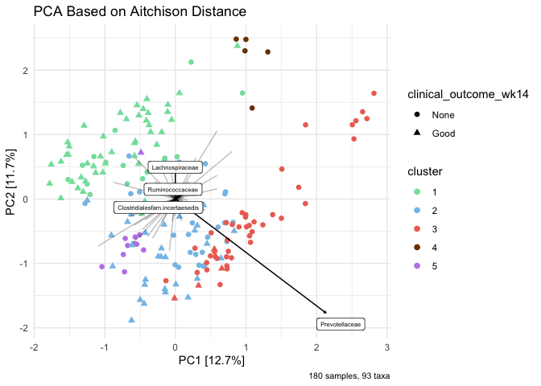
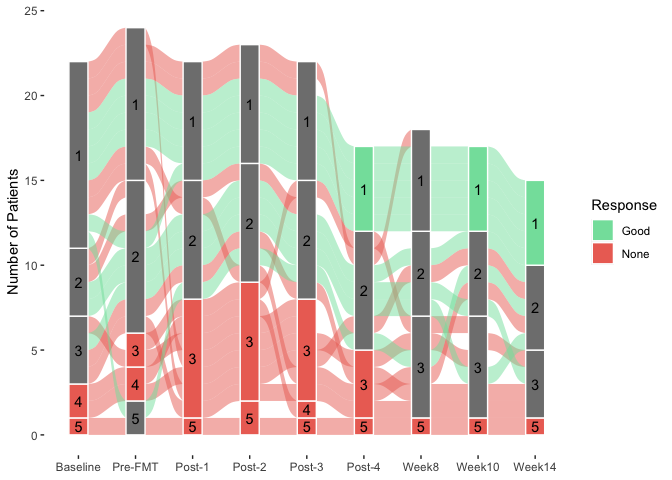

Dirichlet Multinomial Mixture Models
================
December 2022

## Load required packages

``` r
library( dplyr )
library( magrittr )
library( knitr )
library( tidyverse )
library( reshape2 )
```

``` r
library( phyloseq )
library( microbiome )
library( DirichletMultinomial )
library( microViz )
library( ggalluvial )
```

## Load the data

Here we use the compositional count abundance dataset, because of the
requirements of the Dirichlet multinomial mixed model.

## Preprocessing of the data

``` r
# Aggregate to family level
physeq_mOTU = aggregate_taxa( physeq_mOTU, "family" )
physeq_mOTU
```

    ## phyloseq-class experiment-level object
    ## otu_table()   OTU Table:         [ 94 taxa and 207 samples ]
    ## sample_data() Sample Data:       [ 207 samples by 17 sample variables ]
    ## tax_table()   Taxonomy Table:    [ 94 taxa by 6 taxonomic ranks ]

``` r
# Store information in a dataframe
df = abundances( physeq_mOTU )
df.count = as.matrix( t( df ))
```

## Cluster 1000 times

Note that this function takes a long time to run.

``` r
all_clusters_1000 = list() # save all clusters
output_vector_1000 = list() # save best number of clusters
for ( i in ( 1:1000 )) {
  set.seed( i )
  all_clusters_one = lapply( 1:10, dmn, count = df.count, verbose = FALSE )
  all_clusters_1000[[ i ]] = all_clusters_one
  laplace.met = base::sapply( all_clusters_one, DirichletMultinomial::laplace )
  output_vector_1000[[ i ]] = all_clusters_one[[ which.min(unlist( laplace.met ))]]
}
```

## Save results

``` r
saveRDS( all_clusters_1000, "all_clusters_1000.rds" )
saveRDS( output_vector_1000, "output_vector_1000.rds" )
```

## Evaluate clusters

``` r
clus_2 = numeric()
clus_3 = numeric()
clus_4 = numeric()
clus_5 = numeric()
clus_6 = numeric()
clus_7 = numeric()

for ( i in 1:1000 ) {
  if ( length(output_vector.donors[[ i ]]@mixture$Weight ) == 2 ) {
    clus_2[ i ] = output_vector.donors[[ i ]]@goodnessOfFit[ "Laplace" ]
  }
  else if ( length( output_vector.donors[[ i ]]@mixture$Weight ) == 3 ) {
    clus_3[ i ] = output_vector.donors[[ i ]]@goodnessOfFit[ "Laplace" ]
  }
  else if ( length( output_vector.donors[[ i ]]@mixture$Weight ) == 4 ) {
    clus_4[ i ] = output_vector.donors[[ i ]]@goodnessOfFit[ "Laplace" ]
  }
  else if ( length( output_vector.donors[[ i ]]@mixture$Weight ) == 5 ) {
    clus_5[ i ] = output_vector.donors[[ i ]]@goodnessOfFit[ "Laplace" ]
  }
  else if ( length( output_vector.donors[[ i ]]@mixture$Weight ) == 6 ) {
    clus_6[ i ] = output_vector.donors[[ i ]]@goodnessOfFit[ "Laplace" ]
  }
  else if ( length( output_vector.donors[[ i ]]@mixture$Weight ) == 7 ) {
    clus_7[ i ] = output_vector.donors[[ i ]]@goodnessOfFit[ "Laplace" ]
  }
}

length( na.omit( clus_2 )) # 0
```

    ## [1] 0

``` r
length( na.omit( clus_3 )) # 0
```

    ## [1] 0

``` r
length( na.omit( clus_4 )) # 161
```

    ## [1] 161

``` r
length( na.omit( clus_5 )) # 39
```

    ## [1] 39

``` r
length( na.omit( clus_6 )) # 21 
```

    ## [1] 21

``` r
length( na.omit( clus_7 )) # 779
```

    ## [1] 779

``` r
# AICs
min( clus_4, na.rm = TRUE ) # 23899.43
```

    ## [1] 23899.43

``` r
min( clus_5, na.rm = TRUE ) # 23788.53
```

    ## [1] 23788.53

``` r
which.min( clus_5 ) # model 479
```

    ## [1] 479

``` r
min( clus_6, na.rm = TRUE ) # 23813.3
```

    ## [1] 23813.3

``` r
min( clus_7, na.rm = TRUE ) # 23883.82
```

    ## [1] 23883.82

## Model with lowest AIC

``` r
output.479 = output_vector.donors[[ 479 ]]
sample.479 = apply( mixture( output.479 ), 1, which.max )
```

## Bacterial importance

``` r
# importance of bacteria in each cluster based on comparisons with 1 cluster
p0 = fitted( all_clusters.donors[[ 479 ]][[ 1 ]], scale = TRUE ) # scale by theta -- with only 1 cluster
# fitted function describes the contribution of each taxonomic group
p4 = fitted( output.479, scale = TRUE ) # three clusters
colnames( p4 ) = paste( "m", 1:5, sep="" )
meandiff = colSums( abs( p4 - as.vector( p0 )))
# The posterior mean difference between the best and single-component Dirichlet multinomial model measures how each component differs from the population average;

# sum( meandiff )

diff = rowSums( abs( p4 - as.vector( p0 ))) # fitted values of taxa from cluster 3 - cluster 1 to get difference
o = order( diff, decreasing = TRUE ) # order the taxa based on their difference from highest to lowest

cdiff = cumsum( diff[ o ]) / sum( diff )
df = head( cbind( mean = p0[ o ], p4[ o, ], diff = diff[ o ], cdiff ), 10 ) # get the taxa corresponding to order for each cluster (m1, m2, m3)
df
```

    ##                                      mean           m1         m2          m3
    ## Prevotellaceae                 0.02456515 0.0008969067 0.04141599 0.457289452
    ## Lachnospiraceae                0.12133094 0.1656082322 0.08144812 0.068580742
    ## Clostridialesfam.incertaesedis 0.10483629 0.0988671630 0.16684679 0.062252387
    ## Bacteroidaceae                 0.06827260 0.1191684672 0.06051809 0.046592198
    ## Clostridiaceae                 0.05405575 0.0498973589 0.04506324 0.027903968
    ## Rikenellaceae                  0.03157224 0.0367268802 0.04371864 0.012096098
    ## Ruminococcaceae                0.20034856 0.2379544641 0.21062126 0.128732513
    ## Firmicutesfam.incertaesedis    0.02194363 0.0146420341 0.01855625 0.009373869
    ## Coriobacteriaceae              0.02543216 0.0157748781 0.02483811 0.012260842
    ## Oscillospiraceae               0.03211806 0.0309944860 0.05060425 0.021120766
    ##                                         m4          m5       diff     cdiff
    ## Prevotellaceae                 0.005958965 0.011753212 0.50466151 0.1835787
    ## Lachnospiraceae                0.316938488 0.031324645 0.42252415 0.3372786
    ## Clostridialesfam.incertaesedis 0.058288885 0.174831958 0.22710660 0.4198923
    ## Bacteroidaceae                 0.033727842 0.025098229 0.15804989 0.4773855
    ## Clostridiaceae                 0.055688578 0.152326124 0.13920588 0.5280239
    ## Rikenellaceae                  0.009820930 0.101215400 0.12817165 0.5746484
    ## Ruminococcaceae                0.197268431 0.199428735 0.12349460 0.6195715
    ## Firmicutesfam.incertaesedis    0.019346463 0.073325324 0.07723760 0.6476679
    ## Coriobacteriaceae              0.051876743 0.004487767 0.07081164 0.6734268
    ## Oscillospiraceae               0.009050042 0.015177624 0.07061551 0.6991143

## Plot bacterial importance

``` r
for ( k in seq( ncol( fitted( output.479 )))) {
  d = melt( fitted( output.479 ))
  colnames( d ) = c( "OTU", "cluster", "value" )
  d = subset( d, cluster == k ) %>%
    arrange( value ) %>%
    mutate( OTU = factor( OTU, levels = unique( OTU ))) %>%
    filter( abs( value ) > quantile( abs( value ), 0.8 ))
  
  p = ggplot( d, aes( x = OTU, y = value )) +
    geom_bar( stat = "identity" ) +
    coord_flip()
  print( p )
}
```

<!-- --><!-- --><!-- --><!-- --><!-- -->

``` r
# cluster 1 - green
# cluster 2 - blue
# cluster 3 - red
# cluster 5 - purple (like cluster 4 in other results)

# cluster 4 -- donors
```

## Plot clusters per patient and per timepoint

``` r
physeq_mOTU.patients = subset_samples(physeq_mOTU, subject_id != "Donor A" )
physeq_mOTU.patients = subset_samples(physeq_mOTU.patients, subject_id != "Donor B" )
```

``` r
sample.479.nodonors = sample.479[ -c( 181:207 )]

physeq_mOTU.patients@sam_data$cluster = sample.479.nodonors
physeq_mOTU.patients@sam_data$cluster = as.factor( physeq_mOTU.patients@sam_data$cluster )
```

``` r
physeq.comp = microbiome::transform( physeq_mOTU.patients, "compositional" )
df.fam = abundances( physeq.comp )
df.fam = t( df.fam )
df.fam = as.data.frame( df.fam )

df.count = abundances( physeq_mOTU.patients )
df.count = t( df.count )
df.count = as.data.frame( df.count )

# Combine abundances and sample data
df.all = data.frame( df.fam, physeq_mOTU.patients@sam_data )
df.all$timepoint.new = as.factor( df.all$timepoint.new )
df.all$treated_with_donor = as.factor( df.all$treated_with_donor )
df.all$pretreatment = as.factor( df.all$pretreatment )
df.all$clinical_outcome_wk14 = as.factor( df.all$clinical_outcome_wk14 )
df.all$cluster = as.factor( df.all$cluster )

df.all$timepoint.new = factor( df.all$timepoint.new,
levels = c( "Baseline", "Pre-FMT" , "Post-1", "Post-2", "Post-3", "Post-4", "Week8", "Week10", "Week14" ))

df.all.count = data.frame( df.count, physeq_mOTU.patients@sam_data ) 

# Select patient ID, time, cluster and clinical outcome
df.sub = df.all %>% select( subject_id, timepoint.new, cluster, clinical_outcome_wk14 )

df.sub$cluster = as.factor( df.sub$cluster )
df.sub$timepoint.new = factor( df.sub$timepoint.new, levels = c( "Baseline", "Pre-FMT", "Post-1", "Post-2", "Post-3", "Post-4", "Week8", "Week10", "Week14" ))
df.sub$clinical_outcome_wk14 = recode_factor( df.sub$clinical_outcome_wk14, None = "Non-Responder", Good = "Responder" )
```

``` r
# cluster 1 - green
# cluster 2 - blue
# cluster 3 - red
# cluster 5 - purple (like cluster 4 in other results)

# cluster 4 -- donors
colors = c( "#82E0AA", "#85C1E9", "#EC7063", "#7B3F00", "#BD86EB" )

ggplot( df.sub, aes( x = timepoint.new, y = subject_id, fill = cluster )) + xlab( "Timepoint" ) +
       geom_tile( color = "grey20" ) + ylab( "Subject ID" ) + labs( fill = "Cluster" ) +
  facet_grid( clinical_outcome_wk14 ~ ., space = "free_y", scales = "free_y" ) +
  theme( panel.grid.major = element_blank(), panel.grid.minor = element_blank(), panel.border = element_blank()) + scale_fill_manual( values = colors )
```

<!-- -->

``` r
# subject 105 and 121 were both from Donor A
```

``` r
# clinical response
df.bar.resp = df.all %>% group_by( cluster ) %>% count( clinical_outcome_wk14 ) %>% mutate( freq = n / sum( n ))

df.bar.resp$cluster = as.factor( df.bar.resp$cluster )

df.bar.resp
```

    ## # A tibble: 9 × 4
    ## # Groups:   cluster [5]
    ##   cluster clinical_outcome_wk14     n   freq
    ##   <fct>   <fct>                 <int>  <dbl>
    ## 1 1       None                     17 0.274 
    ## 2 1       Good                     45 0.726 
    ## 3 2       None                     25 0.446 
    ## 4 2       Good                     31 0.554 
    ## 5 3       None                     42 0.913 
    ## 6 3       Good                      4 0.0870
    ## 7 4       None                      5 1     
    ## 8 5       None                     10 0.909 
    ## 9 5       Good                      1 0.0909

``` r
colors = c( "#82E0AA", "#85C1E9", "#EC7063", "#7B3F00", "#BD86EB" )

ggplot( df.bar.resp, aes( fill = cluster, y = n, x = clinical_outcome_wk14 )) + geom_bar( position = "fill", stat = "identity", width = 0.7 ) + ylab( "Percentage (%)" ) + theme( panel.grid.major = element_blank(), panel.grid.minor = element_blank(),
panel.background = element_blank()) + theme( axis.title.x = element_blank()) + labs( fill = "Cluster" ) + scale_fill_manual( values = colors ) + theme( aspect.ratio = 2/1 )
```

<!-- -->

## PCA plot clusters of patients

``` r
pca.1.2 = physeq_mOTU.patients %>% tax_transform( "clr", rank = "unique" ) %>% # best graph
  ord_calc( method = "PCA" ) %>%
  ord_plot(
    axes = c( 1, 2 ), 
    color = "cluster", fill = "cluster", shape = "clinical_outcome_wk14", plot_taxa = c( "Prevotellaceae", "Ruminococcaceae", "Lachnospiraceae", "Clostridialesfam.incertaesedis" ), size = 2
  ) + scale_color_manual(values = c( "#82E0AA", "#85C1E9", "#EC7063", "#7B3F00", "#BD86EB" )) +
  # scale_shape_manual(values = c(
    # Baseline = "circle", FMT1 = "circle cross", FMT2 = "circle open", FMT3 = "square", FMT4 = "square cross", Week7 = "square open",
    # Week8 = "triangle", Week10 = "triangle open", Week14 = "diamond" )) +
  # ggplot2::stat_ellipse(
    # ggplot2::aes( colour = clinical_outcome_wk14 )
  #) +
  ggtitle( # title
    label = "PCA Based on Aitchison Distance",
  ) +
  labs( caption = "180 samples, 93 taxa" ) # caption at bottom

pca.1.2
```

<!-- -->

## PCA plot with donors

``` r
physeq_mOTU@sam_data$cluster = sample.479
physeq_mOTU@sam_data$cluster = as.factor(physeq_mOTU@sam_data$cluster)

physeq_mOTU@sam_data$type = c(rep("Subject", 180), rep("Donor A", 13), rep("Donor B", 14))
physeq_mOTU@sam_data$type = as.factor( physeq_mOTU@sam_data$type)

pca.1.3 = physeq_mOTU %>% tax_transform("clr", rank = "unique") %>% # best graph
  ord_calc(method = "PCA") %>%
  ord_plot(
    axes = c(1, 2), 
    color = "cluster", fill = "cluster", shape = "type", plot_taxa = c("Prevotellaceae", "Ruminococcaceae", "Lachnospiraceae", "Clostridialesfam.incertaesedis"), size = 2
  ) + scale_color_manual(values = c("#82E0AA", "#85C1E9", "#EC7063", "#7B3F00", "#BD86EB")) +
  #scale_shape_manual(values = c(
    #Baseline = "circle", FMT1 = "circle cross", FMT2 = "circle open", FMT3 = "square", FMT4 = "square cross", Week7 = "square open",
    #Week8 = "triangle", Week10 = "triangle open", Week14 = "diamond")) +
  #ggplot2::stat_ellipse(
    #ggplot2::aes(colour = clinical_outcome_wk14)
  #) +
  ggtitle( # title
    label = "PCA Based on Aitchison Distance",
  ) +
  labs(caption = "180 samples, 93 taxa") # caption at bottom

pca.1.3
```

<!-- -->

## Alluvial plot clustering

``` r
physeq_mOTU.patients@sam_data$cluster = as.factor( physeq_mOTU.patients@sam_data$cluster )
physeq_mOTU.patients@sam_data$timepoint.new = factor( physeq_mOTU.patients@sam_data$timepoint.new, levels = c( "Baseline", "Pre-FMT", "Post-1", "Post-2", "Post-3", "Post-4", "Week8", "Week10", "Week14" ))

two_colors = c( "#82E0AA", "#EC7063" )

pl1 = ggplot( physeq_mOTU.patients@sam_data,
       aes( x = timepoint.new, stratum = cluster, alluvium = subject_id,
           fill = clinical_outcome_wk14, label = clinical_outcome_wk14 )) +
  ylab( "Number of Patients" ) +
  scale_fill_manual( values = two_colors ) +
  geom_flow( stat = "alluvium" ) +
  geom_stratum( color = "white" ) +
  geom_text( stat = "stratum", aes( label = after_stat( stratum )))

pl2 = pl1 + theme( axis.title.x = element_blank(),  panel.grid.major = element_blank(),
    panel.grid.minor = element_blank(),
    panel.border = element_blank(),
    panel.background = element_blank()) + guides( fill = guide_legend( title = "Response" ))

pl2
```

    ## Warning: Using the `size` aesthetic in this geom was deprecated in ggplot2 3.4.0.
    ## ℹ Please use `linewidth` in the `default_aes` field and elsewhere instead.

<!-- -->
