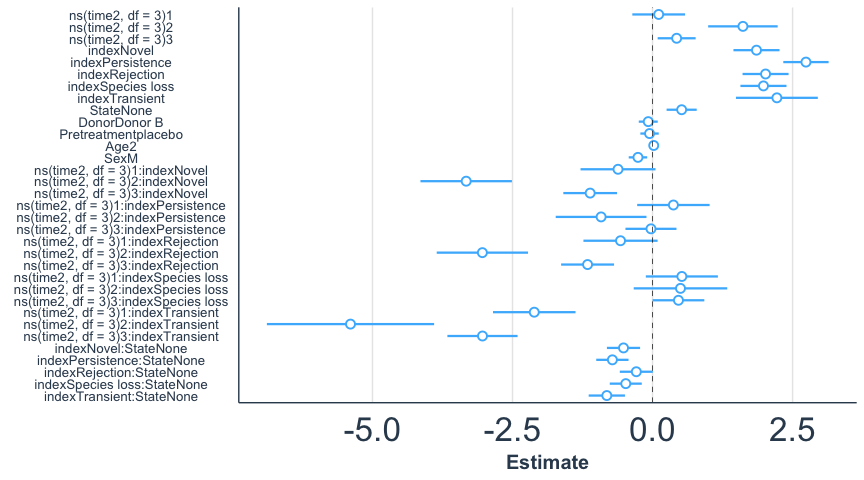

Ecological outcome
================
December 2022

## Load required packages

``` r
library( dplyr )
library( magrittr )
library( knitr )
library( tidyverse )
library( reshape2 )
```

``` r
library( phyloseq )
library( microbiome )
library( devtools )
library( stringr )
```

``` r
library( aod )
library( nlme )
library( lme4 )
library( splines )
library( jtools )
```

## Load the data

Here we use the relative abundance dataset.

## Select ‘average’ donor mOTUs

``` r
donor_A_phyloseq <- subset_samples( physeq_mOTU, subject_id == "Donor A" )
donor_A_phyloseq
```

    ## phyloseq-class experiment-level object
    ## otu_table()   OTU Table:         [ 1552 taxa and 13 samples ]
    ## sample_data() Sample Data:       [ 13 samples by 17 sample variables ]
    ## tax_table()   Taxonomy Table:    [ 1552 taxa by 7 taxonomic ranks ]

``` r
## Now determine the actual 'core' or persistent species per donor
donor_A_core_species <- core_members(
  x = donor_A_phyloseq,
  detection = 0.001, # detection limit is the same as the general limit (0.1%)
  prevalence = 6 / ( length( sample_names( donor_A_phyloseq ))),
  include.lowest = TRUE
  # select only bacteria that occur at at least 2 different timepoints
)

donor_B_phyloseq <- subset_samples( physeq_mOTU, subject_id == "Donor B" )
donor_B_phyloseq
```

    ## phyloseq-class experiment-level object
    ## otu_table()   OTU Table:         [ 1552 taxa and 14 samples ]
    ## sample_data() Sample Data:       [ 14 samples by 17 sample variables ]
    ## tax_table()   Taxonomy Table:    [ 1552 taxa by 7 taxonomic ranks ]

``` r
donor_B_core_species <- core_members(
  x =  donor_B_phyloseq,
  detection = 0.001, # detection limit is the same as the general limit (0.1%)
  prevalence = 6 / ( length( sample_names( donor_B_phyloseq ))),
  include.lowest = TRUE
  # select only bacteria that occur at at least 2 different timepoints
)
```

## Select patient mOTUs per timepoint

``` r
# Collect data for patients per timepoint
# and convert to dataframe for easier processing
baseline_bacteria <- psmelt( physeq_mOTU ) %>%
  filter( timepoint.new == "Baseline" ) %>%
  filter( Abundance > 0 ) %>%
  arrange( subject_id )

# Now list all species present in each patient before FMT
baseline_bacteria.select <- select( baseline_bacteria, OTU, subject_id, treated_with_donor )
# Make a list per recipient
baseline_per_recipient <- unstack(baseline_bacteria.select[ ,1:2 ])

# Collect data for patients per timepoint
# and convert to dataframe for easier processing
Pre_FMT_bacteria <- psmelt( physeq_mOTU ) %>%
  filter( timepoint.new == "Pre-FMT" ) %>%
  filter( Abundance > 0 ) %>%
  arrange( subject_id )

# Now list all species present in each patient before FMT
Pre_FMT_bacteria.select <- select( Pre_FMT_bacteria, OTU, subject_id, treated_with_donor )
# Make a list per recipient
Pre_FMT_per_recipient <- unstack( Pre_FMT_bacteria.select[ ,1:2 ])

# Collect data for patients per timepoint
# and convert to dataframe for easier processing
Post_1_bacteria <- psmelt( physeq_mOTU ) %>%
  filter( timepoint.new == "Post-1" ) %>%
  filter( Abundance > 0 ) %>%
  arrange( subject_id )

# Now list all species present in each patient before FMT
Post_1_bacteria.select <- select( Post_1_bacteria, OTU, subject_id, treated_with_donor )
# Make a list per recipient
Post_1_per_recipient <- unstack( Post_1_bacteria.select[ ,1:2 ])

# Collect data for patients per timepoint
# and convert to dataframe for easier processing
Post_2_bacteria <- psmelt( physeq_mOTU ) %>%
  filter( timepoint.new == "Post-2" ) %>%
  filter( Abundance > 0 ) %>%
  arrange( subject_id )

# Now list all species present in each patient before FMT
Post_2_bacteria.select <- select( Post_2_bacteria, OTU, subject_id, treated_with_donor )
# Make a list per recipient
Post_2_per_recipient <- unstack( Post_2_bacteria.select[ ,1:2 ])

# Collect data for patients per timepoint
# and convert to dataframe for easier processing
Post_3_bacteria <- psmelt( physeq_mOTU ) %>%
  filter( timepoint.new == "Post-3" ) %>%
  filter( Abundance > 0 ) %>%
  arrange( subject_id )

# Now list all species present in each patient before FMT
Post_3_bacteria.select <- select( Post_3_bacteria, OTU, subject_id, treated_with_donor )
# Make a list per recipient
Post_3_per_recipient <- unstack( Post_3_bacteria.select[ ,1:2 ])

# Collect data for patients per timepoint
# and convert to dataframe for easier processing
Post_4_bacteria <- psmelt( physeq_mOTU ) %>%
  filter( timepoint.new == "Post-4" ) %>%
  filter( Abundance > 0 ) %>%
  arrange( subject_id )

# Now list all species present in each patient before FMT
Post_4_bacteria.select <- select( Post_4_bacteria, OTU, subject_id, treated_with_donor )
# Make a list per recipient
Post_4_per_recipient <- unstack( Post_4_bacteria.select[ ,1:2 ])

# Collect data for patients per timepoint
# and convert to dataframe for easier processing
Week8_bacteria <- psmelt( physeq_mOTU ) %>%
  filter( timepoint.new == "Week8" ) %>%
  filter( Abundance > 0 ) %>%
  arrange( subject_id )

# Now list all species present in each patient before FMT
Week8_bacteria.select <- select( Week8_bacteria, OTU, subject_id, treated_with_donor )
# Make a list per recipient
Week8_per_recipient <- unstack( Week8_bacteria.select[ ,1:2 ])

# Collect data for patients per timepoint
# and convert to dataframe for easier processing
Week10_bacteria <- psmelt( physeq_mOTU ) %>%
  filter( timepoint.new == "Week10" ) %>%
  filter( Abundance > 0 ) %>%
  arrange( subject_id )

# Now list all species present in each patient before FMT
Week10_bacteria.select <- select( Week10_bacteria, OTU, subject_id, treated_with_donor )
# Make a list per recipient
Week10_per_recipient <- unstack( Week10_bacteria.select[ ,1:2 ])

# Collect data for patients per timepoint
# and convert to dataframe for easier processing
Week14_bacteria <- psmelt( physeq_mOTU ) %>%
  filter( timepoint.new == "Week14" ) %>%
  filter( Abundance > 0 ) %>%
  arrange( subject_id )

# Now list all species present in each patient before FMT
Week14_bacteria.select <- select( Week14_bacteria, OTU, subject_id, treated_with_donor )
# Make a list per recipient
Week14_per_recipient <- unstack( Week14_bacteria.select[ ,1:2 ])
```

## Obtain results per patient per sample

``` r
# Remove donors
physeq_mOTU = subset_samples( physeq_mOTU, subject_id != "Donor A" )
physeq_mOTU = subset_samples( physeq_mOTU, subject_id != "Donor B" )
```

``` r
sub.id <- physeq_mOTU@sam_data[[ "subject_id" ]] %>% unique()
mOTUs.all <- physeq_mOTU@otu_table %>% rownames()
times <- physeq_mOTU@sam_data[[ "timepoint.new" ]] %>% unique()
```

``` r
data.recipient <- matrix( nrow = length( mOTUs.all ), ncol = 11 )  
colnames( data.recipient ) <- c( "mOTUs", "Donor", "Baseline" ,"Pre_FMT", "Post_1", "Post_2", "Post_3",
                          "Post_4", "Week8", "Week10", "Week14" )
data.recipient[ ,1 ] <- mOTUs.all 
head( data.recipient )
```

    ##      mOTUs               Donor Baseline Pre_FMT Post_1 Post_2 Post_3 Post_4
    ## [1,] "ref_mOTU_v3_00077" NA    NA       NA      NA     NA     NA     NA    
    ## [2,] "ref_mOTU_v3_00084" NA    NA       NA      NA     NA     NA     NA    
    ## [3,] "ref_mOTU_v3_00085" NA    NA       NA      NA     NA     NA     NA    
    ## [4,] "ref_mOTU_v3_00086" NA    NA       NA      NA     NA     NA     NA    
    ## [5,] "ref_mOTU_v3_00087" NA    NA       NA      NA     NA     NA     NA    
    ## [6,] "ref_mOTU_v3_00095" NA    NA       NA      NA     NA     NA     NA    
    ##      Week8 Week10 Week14
    ## [1,] NA    NA     NA    
    ## [2,] NA    NA     NA    
    ## [3,] NA    NA     NA    
    ## [4,] NA    NA     NA    
    ## [5,] NA    NA     NA    
    ## [6,] NA    NA     NA

``` r
# The list to store the results
listofresults <- list()

for( i in 1:length( physeq_mOTU@sam_data[[ "subject_id" ]] %>% unique())){
  patient = sub.id[[ i ]]
  patient.characteristics <- physeq_mOTU@sam_data[ paste( patient, "-FMT1", sep = "" )] %>% as.matrix()
  
  # select donor bacteria
  if( patient.characteristics[ ,"treated_with_donor" ] == "Donor A" ){
  Donor = donor_A_core_species
  } else if( patient.characteristics[ ,"treated_with_donor" ] == "Donor B" ) {
  Donor = donor_B_core_species }
  
  # select patient characteristics of interest
  patient.characteristics <- paste( patient.characteristics[ ,"subject_id" ] %>% as.character(), "-" , patient.characteristics[ ,"clinical_outcome_wk14" ] %>%
                                     as.character(), "-", patient.characteristics[ ,"treated_with_donor" ] %>% as.character(), "-",
                                   patient.characteristics[ ,"pretreatment" ] %>% as.character(), "-", patient.characteristics[ ,"age" ] %>% as.character(), "-",
                                   patient.characteristics[ ,"sex" ] %>% as.character())

  # mOTUs present/absent data
  for( j in 1:nrow( data.recipient )) {
    data.recipient[j,2] <- ifelse( data.recipient[j,1] %in% Donor, 1, 0)
    
    data.recipient[j,3] <- ifelse( data.recipient[j,1] %in% baseline_per_recipient[[ patient ]], 1, 0 )
    data.recipient[j,4] <- ifelse( data.recipient[j,1] %in% Pre_FMT_per_recipient[[ patient ]], 1, 0 )
  
    data.recipient[j,5] <- ifelse( data.recipient[j,1] %in% Post_1_per_recipient[[ patient ]], 1, 0 )
    data.recipient[j,6] <- ifelse( data.recipient[j,1] %in% Post_2_per_recipient[[ patient ]], 1, 0 )
    data.recipient[j,7] <- ifelse( data.recipient[j,1] %in% Post_3_per_recipient[[ patient ]], 1, 0 )
    data.recipient[j,8] <- ifelse( data.recipient[j,1] %in% Post_4_per_recipient[[ patient ]], 1, 0 )
    data.recipient[j,9] <- ifelse( data.recipient[j,1] %in% Week8_per_recipient[[ patient ]], 1, 0 )
    data.recipient[j,10] <- ifelse( data.recipient[j,1] %in% Week10_per_recipient[[ patient ]], 1, 0 )
    data.recipient[j,11] <- ifelse( data.recipient[j,1] %in% Week14_per_recipient[[ patient ]], 1, 0 )
    }
  
  data.recipient.sel <- data.recipient[apply(data.recipient[ ,-1 ], 1, function(x) !all( x == 0 )),] %>% as.data.frame()
  data.recipient.sel %>% head()
  data.recipient.sel[ ,2:11 ] <- sapply(data.recipient.sel[ ,2:11 ],as.numeric )
  data.recipient.sel[ ,2:11 ] %>% colSums()
  data.recipient.sel[ ,2:11 ][ data.recipient.sel[ ,2:11 ] %>% colSums() == 0 ] <- NA
  data.recipient.sel %>% head()
  
  # Possible combinations
  expand.grid( rep( list( 0:1 ), 3 ))
  expand.grid( rep( list( 0:1 ), 4 ))
  
  data.recipient.results <- matrix( ncol = 9, nrow = nrow( data.recipient.sel ))
  colnames( data.recipient.results ) <- c( "mOTUs", "Pre_FMT", "Post_1", "Post_2", "Post_3",
                                        "Post_4", "Week8", "Week10", "Week14" )
  data.recipient.results <- data.recipient.results %>% as.data.frame()
  data.recipient.results[ ,"mOTUs" ] <- data.recipient.sel[ ,"mOTUs" ]
  data.recipient.results %>% head()

  # Analyse the Pre_FMT timepoint
  for( j in 1:nrow( data.recipient.results )) {
    data.recipient.results[ j, 2 ] <- 
      if( is.na( data.recipient.sel[j,2] ) | is.na(data.recipient.sel[j,3]) | is.na(data.recipient.sel[j,4]) ) {
        NA
      } else if( data.recipient.sel[j,2] != 0 & data.recipient.sel[j,3] == 0 & data.recipient.sel[j,4] == 0 ) {
        "Rejection" 
      } else if( data.recipient.sel[j,2] != 0 & data.recipient.sel[j,3] != 0 & data.recipient.sel[j,4] == 0 ) {
        "Species loss" 
      } else if( data.recipient.sel[j,2] == 0 & data.recipient.sel[j,3] != 0 & data.recipient.sel[j,4] == 0 ) {
        "Species loss" 
      } else if( data.recipient.sel[j,2] != 0 & data.recipient.sel[j,3] != 0 & data.recipient.sel[j,4] != 0 ) {
        "Persistence" 
      } else if( data.recipient.sel[j,2] == 0 & data.recipient.sel[j,3] != 0 & data.recipient.sel[j,4] != 0 ) {
        "Persistence" 
      } else if( data.recipient.sel[j,2] != 0 & data.recipient.sel[j,3] == 0 & data.recipient.sel[j,4] != 0 ) {
        "Colonisation" 
      } else if( data.recipient.sel[j,2] == 0 & data.recipient.sel[j,3] == 0 & data.recipient.sel[j,4] != 0 ) {
        "Novel" 
      } else if( data.recipient.sel[j,2] == 0 & data.recipient.sel[j,3] == 0 & data.recipient.sel[j,4] == 0 ) {
        "Absent"
      }
  }

  # Analyse the post_1 timepoint
  data.recipient.sel %>% head()
  data.recipient.sel.2 <- data.recipient.sel
  data.recipient.sel.2 <- data.recipient.sel.2 %>% 
    replace( is.na( data.recipient.sel.2 ), 0 ) %>% 
    dplyr::mutate( Pre_FMT2 = Baseline + Pre_FMT )
  data.recipient.sel.2 <- data.recipient.sel.2[ c( 1, 2, 12, 5:11 )]
  data.recipient.sel.2 %>% head()

  for( j in 1:nrow( data.recipient.results )) {
    data.recipient.results[j,3] <- 
      if( is.na(data.recipient.sel[j,5]) ) {
        NA
      } else if( data.recipient.sel.2[j,2] != 0 & data.recipient.sel.2[j,3] == 0 & 
          data.recipient.sel.2[j,4] == 0 & data.recipient.sel.2[j,5] == 0 ) {
        "Rejection" 
      } else if( data.recipient.sel.2[j,2] == 0 & data.recipient.sel.2[j,3] != 0 & 
                 data.recipient.sel.2[j,4] == 0 & data.recipient.sel.2[j,5] == 0 ) {
        "Species loss" 
      } else if( data.recipient.sel.2[j,2] != 0 & data.recipient.sel.2[j,3] != 0 & 
                 data.recipient.sel.2[j,4] == 0 & data.recipient.sel.2[j,5] == 0 ) {
        "Species loss" 
      } else if( data.recipient.sel.2[j,2] == 0 & data.recipient.sel.2[j,3] == 0 & 
                 data.recipient.sel.2[j,4] != 0 & data.recipient.sel.2[j,5] == 0 ) {
        "Species loss" 
      } else if( data.recipient.sel.2[j,2] == 0 & data.recipient.sel.2[j,3] != 0 & 
                 data.recipient.sel.2[j,4] != 0 & data.recipient.sel.2[j,5] == 0 ) {
        "Species loss" 
      } else if( data.recipient.sel.2[j,2] != 0 & data.recipient.sel.2[j,3] != 0 & 
                data.recipient.sel.2[j,4] != 0 & data.recipient.sel.2[j,5] == 0 ) {
        "Species loss" 
      } else if( data.recipient.sel.2[j,2] != 0 & data.recipient.sel.2[j,3] == 0 & 
               data.recipient.sel.2[j,4] != 0 & data.recipient.sel.2[j,5] == 0 ) {
        "Species loss" 
      } else if( data.recipient.sel.2[j,2] == 0 & data.recipient.sel.2[j,3] == 0 & 
                 data.recipient.sel.2[j,4] == 0 & data.recipient.sel.2[j,5] != 0 ) {
        "Novel" 
      } else if( data.recipient.sel.2[j,2] != 0 & data.recipient.sel.2[j,3] == 0 & 
                data.recipient.sel.2[j,4] == 0 & data.recipient.sel.2[j,5] != 0 ) {
       "Colonisation" 
      } else if( data.recipient.sel.2[j,2] != 0 & data.recipient.sel.2[j,3] == 0 & 
               data.recipient.sel.2[j,4] != 0 & data.recipient.sel.2[j,5] != 0 ) {
        "Colonisation" 
      } else if( data.recipient.sel.2[j,2] == 0 & data.recipient.sel.2[j,3] != 0 & 
               data.recipient.sel.2[j,4] == 0 & data.recipient.sel.2[j,5] != 0 ) {
        "Transient" 
      } else if( data.recipient.sel.2[j,2] != 0 & data.recipient.sel.2[j,3] != 0 & 
               data.recipient.sel.2[j,4] == 0 & data.recipient.sel.2[j,5] != 0 ) {
        "Transient" 
      } else if( data.recipient.sel.2[j,2] == 0 & data.recipient.sel.2[j,3] == 0 & 
               data.recipient.sel.2[j,4] != 0 & data.recipient.sel.2[j,5] != 0 ) {
        "Persistence" 
      } else if( data.recipient.sel.2[j,2] == 0 & data.recipient.sel.2[j,3] != 0 & 
               data.recipient.sel.2[j,4] != 0 & data.recipient.sel.2[j,5] != 0 ) {
        "Persistence" 
      } else if( data.recipient.sel.2[j,2] != 0 & data.recipient.sel.2[j,3] != 0 & 
               data.recipient.sel.2[j,4] != 0 & data.recipient.sel.2[j,5] != 0 ) {
        "Persistence" 
      } else if( data.recipient.sel.2[j,2] == 0 & data.recipient.sel.2[j,3] == 0 & 
               data.recipient.sel.2[j,4] == 0 & data.recipient.sel.2[j,5] == 0 ) {
        "Absent" 
      }
  }

  # analyse the post_2 timepoint
  data.recipient.sel.2 %>% head()
  data.recipient.sel.3 <- data.recipient.sel.2
  data.recipient.sel.3 %>% head()

  for( j in 1:nrow( data.recipient.results )) {
    data.recipient.results[j,4] <- 
      if( is.na( data.recipient.sel[j,6] ) ) {
        NA
      } else if( data.recipient.sel.3[j,2] != 0 & data.recipient.sel.3[j,3] == 0 & 
          data.recipient.sel.3[j,4] == 0 & data.recipient.sel.3[j,5] == 0 ) {
        "Rejection" 
      } else if( data.recipient.sel.3[j,2] == 0 & data.recipient.sel.3[j,3] != 0 & 
                 data.recipient.sel.3[j,4] == 0 & data.recipient.sel.3[j,5] == 0 ) {
        "Species loss" 
      } else if( data.recipient.sel.3[j,2] != 0 & data.recipient.sel.3[j,3] != 0 & 
                 data.recipient.sel.3[j,4] == 0 & data.recipient.sel.3[j,5] == 0 ) {
        "Species loss" 
      } else if( data.recipient.sel.3[j,2] == 0 & data.recipient.sel.3[j,3] == 0 & 
                 data.recipient.sel.3[j,4] != 0 & data.recipient.sel.3[j,5] == 0 ) {
        "Species loss" 
      } else if( data.recipient.sel.3[j,2] == 0 & data.recipient.sel.3[j,3] != 0 & 
                 data.recipient.sel.3[j,4] != 0 & data.recipient.sel.3[j,5] == 0 ) {
        "Species loss" 
      } else if( data.recipient.sel.3[j,2] != 0 & data.recipient.sel.3[j,3] != 0 & 
                 data.recipient.sel.3[j,4] != 0 & data.recipient.sel.3[j,5] == 0 ) {
        "Species loss" 
      } else if( data.recipient.sel.3[j,2] != 0 & data.recipient.sel.3[j,3] == 0 & 
                 data.recipient.sel.3[j,4] != 0 & data.recipient.sel.3[j,5] == 0 ) {
        "Species loss" 
      } else if( data.recipient.sel.3[j,2] == 0 & data.recipient.sel.3[j,3] == 0 & 
                 data.recipient.sel.3[j,4] == 0 & data.recipient.sel.3[j,5] != 0 ) {
        "Novel" 
      } else if( data.recipient.sel.3[j,2] != 0 & data.recipient.sel.3[j,3] == 0 & 
                 data.recipient.sel.3[j,4] == 0 & data.recipient.sel.3[j,5] != 0 ) {
        "Colonisation" 
      } else if( data.recipient.sel.3[j,2] != 0 & data.recipient.sel.3[j,3] == 0 & 
                 data.recipient.sel.3[j,4] != 0 & data.recipient.sel.3[j,5] != 0 ) {
        "Colonisation" 
      } else if( data.recipient.sel.3[j,2] == 0 & data.recipient.sel.3[j,3] != 0 & 
                 data.recipient.sel.3[j,4] == 0 & data.recipient.sel.3[j,5] != 0 ) {
        "Transient" 
      } else if( data.recipient.sel.3[j,2] != 0 & data.recipient.sel.3[j,3] != 0 & 
                 data.recipient.sel.3[j,4] == 0 & data.recipient.sel.3[j,5] != 0 ) {
        "Transient" 
      } else if( data.recipient.sel.3[j,2] == 0 & data.recipient.sel.3[j,3] == 0 & 
                 data.recipient.sel.3[j,4] != 0 & data.recipient.sel.3[j,5] != 0 ) {
        "Persistence" 
      } else if( data.recipient.sel.3[j,2] == 0 & data.recipient.sel.3[j,3] != 0 & 
                 data.recipient.sel.3[j,4] != 0 & data.recipient.sel.3[j,5] != 0 ) {
        "Persistence" 
      } else if( data.recipient.sel.3[j,2] != 0 & data.recipient.sel.3[j,3] != 0 & 
                 data.recipient.sel.3[j,4] != 0 & data.recipient.sel.3[j,5] != 0 ) {
        "Persistence" 
      } else if( data.recipient.sel.3[j,2] == 0 & data.recipient.sel.3[j,3] == 0 & 
                 data.recipient.sel.3[j,4] == 0 & data.recipient.sel.3[j,5] == 0 ) {
        "Absent" 
      }
  }

  # Analyse the post_3 timepoint
  data.recipient.sel.3 %>% head()
  data.recipient.sel.4 <- data.recipient.sel.3
  data.recipient.sel.4 <- data.recipient.sel.4 %>% dplyr::mutate(Post_FMT = Post_1 + Post_2 )
  data.recipient.sel.4 <- data.recipient.sel.4[ c( 1:3, 11, 6:10 )]
  data.recipient.sel.4 %>% head()
  
  for( j in 1:nrow( data.recipient.results )) {
    data.recipient.results[j,5] <- 
      if( is.na( data.recipient.sel[j,7] ) ) {
        NA
      } else if( data.recipient.sel.4[j,2] != 0 & data.recipient.sel.4[j,3] == 0 & 
          data.recipient.sel.4[j,4] == 0 & data.recipient.sel.4[j,5] == 0 ) {
        "Rejection" 
      } else if( data.recipient.sel.4[j,2] == 0 & data.recipient.sel.4[j,3] != 0 & 
                 data.recipient.sel.4[j,4] == 0 & data.recipient.sel.4[j,5] == 0 ) {
        "Species loss" 
      } else if( data.recipient.sel.4[j,2] != 0 & data.recipient.sel.4[j,3] != 0 & 
                 data.recipient.sel.4[j,4] == 0 & data.recipient.sel.4[j,5] == 0 ) {
        "Species loss" 
      } else if( data.recipient.sel.4[j,2] == 0 & data.recipient.sel.4[j,3] == 0 & 
                 data.recipient.sel.4[j,4] != 0 & data.recipient.sel.4[j,5] == 0 ) {
        "Species loss" 
      } else if( data.recipient.sel.4[j,2] == 0 & data.recipient.sel.4[j,3] != 0 & 
                 data.recipient.sel.4[j,4] != 0 & data.recipient.sel.4[j,5] == 0 ) {
        "Species loss" 
      } else if( data.recipient.sel.4[j,2] != 0 & data.recipient.sel.4[j,3] != 0 & 
                 data.recipient.sel.4[j,4] != 0 & data.recipient.sel.4[j,5] == 0 ) {
        "Species loss" 
      } else if( data.recipient.sel.4[j,2] != 0 & data.recipient.sel.4[j,3] == 0 & 
                 data.recipient.sel.4[j,4] != 0 & data.recipient.sel.4[j,5] == 0 ) {
        "Species loss" 
      } else if( data.recipient.sel.4[j,2] == 0 & data.recipient.sel.4[j,3] == 0 & 
                 data.recipient.sel.4[j,4] == 0 & data.recipient.sel.4[j,5] != 0 ) {
        "Novel" 
      } else if( data.recipient.sel.4[j,2] != 0 & data.recipient.sel.4[j,3] == 0 & 
                 data.recipient.sel.4[j,4] == 0 & data.recipient.sel.4[j,5] != 0 ) {
        "Colonisation" 
      } else if( data.recipient.sel.4[j,2] != 0 & data.recipient.sel.4[j,3] == 0 & 
                 data.recipient.sel.4[j,4] != 0 & data.recipient.sel.4[j,5] != 0 ) {
        "Colonisation" 
      } else if( data.recipient.sel.4[j,2] == 0 & data.recipient.sel.4[j,3] != 0 & 
                 data.recipient.sel.4[j,4] == 0 & data.recipient.sel.4[j,5] != 0 ) {
        "Transient" 
      } else if( data.recipient.sel.4[j,2] != 0 & data.recipient.sel.4[j,3] != 0 & 
                 data.recipient.sel.4[j,4] == 0 & data.recipient.sel.4[j,5] != 0 ) {
        "Transient" 
      } else if( data.recipient.sel.4[j,2] == 0 & data.recipient.sel.4[j,3] == 0 & 
                 data.recipient.sel.4[j,4] != 0 & data.recipient.sel.4[j,5] != 0 ) {
        "Persistence" 
      } else if( data.recipient.sel.4[j,2] == 0 & data.recipient.sel.4[j,3] != 0 & 
                 data.recipient.sel.4[j,4] != 0 & data.recipient.sel.4[j,5] != 0 ) {
        "Persistence" 
      } else if( data.recipient.sel.4[j,2] != 0 & data.recipient.sel.4[j,3] != 0 & 
                 data.recipient.sel.4[j,4] != 0 & data.recipient.sel.4[j,5] != 0 ) {
        "Persistence" 
      } else if( data.recipient.sel.4[j,2] == 0 & data.recipient.sel.4[j,3] == 0 & 
                 data.recipient.sel.4[j,4] == 0 & data.recipient.sel.4[j,5] == 0 ) {
        "Absent" 
      }
  }
  
  # analyse the post 4 timepoint
  data.recipient.sel.4 %>% head()
  data.recipient.sel.5 <- data.recipient.sel.4
  data.recipient.sel.5 <- data.recipient.sel.5 %>% dplyr::mutate(Post_FMT = Post_FMT + Post_3 )
  data.recipient.sel.5 <- data.recipient.sel.5[ c( 1:4, 6:9 )]
  data.recipient.sel.5 %>% head()
  
  for( j in 1:nrow( data.recipient.results )) {
    data.recipient.results[j,6] <- 
      if( is.na( data.recipient.sel[j,8] ) ) {
        NA
      } else if( data.recipient.sel.5[j,2] != 0 & data.recipient.sel.5[j,3] == 0 & 
          data.recipient.sel.5[j,4] == 0 & data.recipient.sel.5[j,5] == 0 ) {
        "Rejection" 
      } else if( data.recipient.sel.5[j,2] == 0 & data.recipient.sel.5[j,3] != 0 & 
                 data.recipient.sel.5[j,4] == 0 & data.recipient.sel.5[j,5] == 0 ) {
        "Species loss" 
      } else if( data.recipient.sel.5[j,2] != 0 & data.recipient.sel.5[j,3] != 0 & 
                 data.recipient.sel.5[j,4] == 0 & data.recipient.sel.5[j,5] == 0 ) {
        "Species loss" 
      } else if( data.recipient.sel.5[j,2] == 0 & data.recipient.sel.5[j,3] == 0 & 
                 data.recipient.sel.5[j,4] != 0 & data.recipient.sel.5[j,5] == 0 ) {
        "Species loss" 
      } else if( data.recipient.sel.5[j,2] == 0 & data.recipient.sel.5[j,3] != 0 & 
                 data.recipient.sel.5[j,4] != 0 & data.recipient.sel.5[j,5] == 0 ) {
        "Species loss" 
      } else if( data.recipient.sel.5[j,2] != 0 & data.recipient.sel.5[j,3] != 0 & 
                 data.recipient.sel.5[j,4] != 0 & data.recipient.sel.5[j,5] == 0 ) {
        "Species loss" 
      } else if( data.recipient.sel.5[j,2] != 0 & data.recipient.sel.5[j,3] == 0 & 
                 data.recipient.sel.5[j,4] != 0 & data.recipient.sel.5[j,5] == 0 ) {
        "Species loss" 
      } else if( data.recipient.sel.5[j,2] == 0 & data.recipient.sel.5[j,3] == 0 & 
                 data.recipient.sel.5[j,4] == 0 & data.recipient.sel.5[j,5] != 0 ) {
        "Novel" 
      } else if( data.recipient.sel.5[j,2] != 0 & data.recipient.sel.5[j,3] == 0 & 
                 data.recipient.sel.5[j,4] == 0 & data.recipient.sel.5[j,5] != 0 ) {
        "Colonisation" 
      } else if( data.recipient.sel.5[j,2] != 0 & data.recipient.sel.5[j,3] == 0 & 
                 data.recipient.sel.5[j,4] != 0 & data.recipient.sel.5[j,5] != 0 ) {
        "Colonisation" 
      } else if( data.recipient.sel.5[j,2] == 0 & data.recipient.sel.5[j,3] != 0 & 
                 data.recipient.sel.5[j,4] == 0 & data.recipient.sel.5[j,5] != 0 ) {
        "Transient" 
      } else if( data.recipient.sel.5[j,2] != 0 & data.recipient.sel.5[j,3] != 0 & 
                 data.recipient.sel.5[j,4] == 0 & data.recipient.sel.5[j,5] != 0 ) {
        "Transient" 
      } else if( data.recipient.sel.5[j,2] == 0 & data.recipient.sel.5[j,3] == 0 & 
                 data.recipient.sel.5[j,4] != 0 & data.recipient.sel.5[j,5] != 0 ) {
        "Persistence" 
      } else if( data.recipient.sel.5[j,2] == 0 & data.recipient.sel.5[j,3] != 0 & 
                 data.recipient.sel.5[j,4] != 0 & data.recipient.sel.5[j,5] != 0 ) {
        "Persistence" 
      } else if( data.recipient.sel.5[j,2] != 0 & data.recipient.sel.5[j,3] != 0 & 
                 data.recipient.sel.5[j,4] != 0 & data.recipient.sel.5[j,5] != 0 ) {
        "Persistence" 
      } else if( data.recipient.sel.5[j,2] == 0 & data.recipient.sel.5[j,3] == 0 & 
                 data.recipient.sel.5[j,4] == 0 & data.recipient.sel.5[j,5] == 0 ) {
        "Absent" 
      }
  }
  
  # analyse the Week 8 timepoint
  data.recipient.sel.5 %>% head()
  data.recipient.sel.6 <- data.recipient.sel.5
  data.recipient.sel.6 <- data.recipient.sel.6 %>% dplyr::mutate(Post_FMT = Post_FMT + Post_4 )
  data.recipient.sel.6 <- data.recipient.sel.6[ c( 1:4, 6:8 )]
  data.recipient.sel.6 %>% head()
  
  for( j in 1:nrow( data.recipient.results )) {
    data.recipient.results[j,7] <- 
      if( is.na( data.recipient.sel[j,9] ) ) {
        NA
      } else if( data.recipient.sel.6[j,2] != 0 & data.recipient.sel.6[j,3] == 0 & 
          data.recipient.sel.6[j,4] == 0 & data.recipient.sel.6[j,5] == 0 ) {
        "Rejection" 
      } else if( data.recipient.sel.6[j,2] == 0 & data.recipient.sel.6[j,3] != 0 & 
                 data.recipient.sel.6[j,4] == 0 & data.recipient.sel.6[j,5] == 0 ) {
        "Species loss" 
      } else if( data.recipient.sel.6[j,2] != 0 & data.recipient.sel.6[j,3] != 0 & 
                 data.recipient.sel.6[j,4] == 0 & data.recipient.sel.6[j,5] == 0 ) {
        "Species loss" 
      } else if( data.recipient.sel.6[j,2] == 0 & data.recipient.sel.6[j,3] == 0 & 
                 data.recipient.sel.6[j,4] != 0 & data.recipient.sel.6[j,5] == 0 ) {
        "Species loss" 
      } else if( data.recipient.sel.6[j,2] == 0 & data.recipient.sel.6[j,3] != 0 & 
                 data.recipient.sel.6[j,4] != 0 & data.recipient.sel.6[j,5] == 0 ) {
        "Species loss" 
      } else if( data.recipient.sel.6[j,2] != 0 & data.recipient.sel.6[j,3] != 0 & 
                 data.recipient.sel.6[j,4] != 0 & data.recipient.sel.6[j,5] == 0 ) {
        "Species loss" 
      } else if( data.recipient.sel.6[j,2] != 0 & data.recipient.sel.6[j,3] == 0 & 
                 data.recipient.sel.6[j,4] != 0 & data.recipient.sel.6[j,5] == 0 ) {
        "Species loss" 
      } else if( data.recipient.sel.6[j,2] == 0 & data.recipient.sel.6[j,3] == 0 & 
                 data.recipient.sel.6[j,4] == 0 & data.recipient.sel.6[j,5] != 0 ) {
        "Novel" 
      } else if( data.recipient.sel.6[j,2] != 0 & data.recipient.sel.6[j,3] == 0 & 
                 data.recipient.sel.6[j,4] == 0 & data.recipient.sel.6[j,5] != 0 ) {
        "Colonisation" 
      } else if( data.recipient.sel.6[j,2] != 0 & data.recipient.sel.6[j,3] == 0 & 
                 data.recipient.sel.6[j,4] != 0 & data.recipient.sel.6[j,5] != 0 ) {
        "Colonisation" 
      } else if( data.recipient.sel.6[j,2] == 0 & data.recipient.sel.6[j,3] != 0 & 
                 data.recipient.sel.6[j,4] == 0 & data.recipient.sel.6[j,5] != 0 ) {
        "Transient" 
      } else if( data.recipient.sel.6[j,2] != 0 & data.recipient.sel.6[j,3] != 0 & 
                 data.recipient.sel.6[j,4] == 0 & data.recipient.sel.6[j,5] != 0 ) {
        "Transient" 
      } else if( data.recipient.sel.6[j,2] == 0 & data.recipient.sel.6[j,3] == 0 & 
                 data.recipient.sel.6[j,4] != 0 & data.recipient.sel.6[j,5] != 0 ) {
        "Persistence" 
      } else if( data.recipient.sel.6[j,2] == 0 & data.recipient.sel.6[j,3] != 0 & 
                 data.recipient.sel.6[j,4] != 0 & data.recipient.sel.6[j,5] != 0 ) {
        "Persistence" 
      } else if( data.recipient.sel.6[j,2] != 0 & data.recipient.sel.6[j,3] != 0 & 
                 data.recipient.sel.6[j,4] != 0 & data.recipient.sel.6[j,5] != 0 ) {
        "Persistence" 
      } else if( data.recipient.sel.6[j,2] == 0 & data.recipient.sel.6[j,3] == 0 & 
                 data.recipient.sel.6[j,4] == 0 & data.recipient.sel.6[j,5] == 0 ) {
        "Absent" 
      }
  }
  
  # analyse the Week 10 timepoint
  data.recipient.sel.6 %>% head()
  data.recipient.sel.7 <- data.recipient.sel.6
  data.recipient.sel.7 <- data.recipient.sel.7 %>% dplyr::mutate(Post_FMT = Post_FMT + Week8 )
  data.recipient.sel.7 <- data.recipient.sel.7[ c( 1:4, 6:7 )]
  data.recipient.sel.7 %>% head()
  
  for(j in 1:nrow( data.recipient.results )) {
    data.recipient.results[j,8] <- 
      if( is.na( data.recipient.sel[j,10] ) ) {
        NA
      } else if( data.recipient.sel.7[j,2] != 0 & data.recipient.sel.7[j,3] == 0 & 
          data.recipient.sel.7[j,4] == 0 & data.recipient.sel.7[j,5] == 0 ) {
        "Rejection" 
      } else if( data.recipient.sel.7[j,2] == 0 & data.recipient.sel.7[j,3] != 0 & 
                 data.recipient.sel.7[j,4] == 0 & data.recipient.sel.7[j,5] == 0 ) {
        "Species loss" 
      } else if( data.recipient.sel.7[j,2] != 0 & data.recipient.sel.7[j,3] != 0 & 
                 data.recipient.sel.7[j,4] == 0 & data.recipient.sel.7[j,5] == 0 ) {
        "Species loss" 
      } else if( data.recipient.sel.7[j,2] == 0 & data.recipient.sel.7[j,3] == 0 & 
                 data.recipient.sel.7[j,4] != 0 & data.recipient.sel.7[j,5] == 0 ) {
        "Species loss" 
      } else if( data.recipient.sel.7[j,2] == 0 & data.recipient.sel.7[j,3] != 0 & 
                 data.recipient.sel.7[j,4] != 0 & data.recipient.sel.7[j,5] == 0 ) {
        "Species loss" 
      } else if( data.recipient.sel.7[j,2] != 0 & data.recipient.sel.7[j,3] != 0 & 
                 data.recipient.sel.7[j,4] != 0 & data.recipient.sel.7[j,5] == 0 ) {
        "Species loss" 
      } else if( data.recipient.sel.7[j,2] != 0 & data.recipient.sel.7[j,3] == 0 & 
                 data.recipient.sel.7[j,4] != 0 & data.recipient.sel.7[j,5] == 0 ) {
        "Species loss" 
      } else if( data.recipient.sel.7[j,2] == 0 & data.recipient.sel.7[j,3] == 0 & 
                 data.recipient.sel.7[j,4] == 0 & data.recipient.sel.7[j,5] != 0 ) {
        "Novel" 
      } else if( data.recipient.sel.7[j,2] != 0 & data.recipient.sel.7[j,3] == 0 & 
                 data.recipient.sel.7[j,4] == 0 & data.recipient.sel.7[j,5] != 0 ) {
        "Colonisation" 
      } else if( data.recipient.sel.7[j,2] != 0 & data.recipient.sel.7[j,3] == 0 & 
                 data.recipient.sel.7[j,4] != 0 & data.recipient.sel.7[j,5] != 0 ) {
        "Colonisation" 
      } else if( data.recipient.sel.7[j,2] == 0 & data.recipient.sel.7[j,3] != 0 & 
                 data.recipient.sel.7[j,4] == 0 & data.recipient.sel.7[j,5] != 0 ) {
        "Transient" 
      } else if( data.recipient.sel.7[j,2] != 0 & data.recipient.sel.7[j,3] != 0 & 
                 data.recipient.sel.7[j,4] == 0 & data.recipient.sel.7[j,5] != 0 ) {
        "Transient" 
      } else if( data.recipient.sel.7[j,2] == 0 & data.recipient.sel.7[j,3] == 0 & 
                 data.recipient.sel.7[j,4] != 0 & data.recipient.sel.7[j,5] != 0 ) {
        "Persistence" 
      } else if( data.recipient.sel.7[j,2] == 0 & data.recipient.sel.7[j,3] != 0 & 
                 data.recipient.sel.7[j,4] != 0 & data.recipient.sel.7[j,5] != 0 ) {
        "Persistence" 
      } else if( data.recipient.sel.7[j,2] != 0 & data.recipient.sel.7[j,3] != 0 & 
                 data.recipient.sel.7[j,4] != 0 & data.recipient.sel.7[j,5] != 0 ) {
        "Persistence" 
      } else if( data.recipient.sel.7[j,2] == 0 & data.recipient.sel.7[j,3] == 0 & 
                 data.recipient.sel.7[j,4] == 0 & data.recipient.sel.7[j,5] == 0 ) {
        "Absent" 
      }
  }
  
  # analyse the Week 14 timepoint
  data.recipient.sel.7 %>% head()
  data.recipient.sel.8 <- data.recipient.sel.7
  data.recipient.sel.8 <- data.recipient.sel.8 %>% dplyr::mutate(Post_FMT = Post_FMT + Week10 )
  data.recipient.sel.8 <- data.recipient.sel.8[ c( 1:4, 6 )]
  data.recipient.sel.8 %>% head()
  
  for( j in 1:nrow( data.recipient.results )) {
    data.recipient.results[j,9] <- 
      if( is.na( data.recipient.sel[j,11] ) ) {
        NA
      } else if( data.recipient.sel.8[j,2] != 0 & data.recipient.sel.8[j,3] == 0 & 
                 data.recipient.sel.8[j,4] == 0 & data.recipient.sel.8[j,5] == 0 ) {
        "Rejection" 
      } else if( data.recipient.sel.8[j,2] == 0 & data.recipient.sel.8[j,3] != 0 & 
                 data.recipient.sel.8[j,4] == 0 & data.recipient.sel.8[j,5] == 0 ) {
        "Species loss" 
      } else if( data.recipient.sel.8[j,2] != 0 & data.recipient.sel.8[j,3] != 0 & 
                 data.recipient.sel.8[j,4] == 0 & data.recipient.sel.8[j,5] == 0 ) {
        "Species loss" 
      } else if( data.recipient.sel.8[j,2] == 0 & data.recipient.sel.8[j,3] == 0 & 
                 data.recipient.sel.8[j,4] != 0 & data.recipient.sel.8[j,5] == 0 ) {
        "Species loss" 
      } else if( data.recipient.sel.8[j,2] == 0 & data.recipient.sel.8[j,3] != 0 & 
                 data.recipient.sel.8[j,4] != 0 & data.recipient.sel.8[j,5] == 0 ) {
        "Species loss" 
      } else if( data.recipient.sel.8[j,2] != 0 & data.recipient.sel.8[j,3] != 0 & 
                 data.recipient.sel.8[j,4] != 0 & data.recipient.sel.8[j,5] == 0 ) {
        "Species loss" 
      } else if( data.recipient.sel.8[j,2] != 0 & data.recipient.sel.8[j,3] == 0 & 
                 data.recipient.sel.8[j,4] != 0 & data.recipient.sel.8[j,5] == 0 ) {
        "Species loss" 
      } else if( data.recipient.sel.8[j,2] == 0 & data.recipient.sel.8[j,3] == 0 & 
                 data.recipient.sel.8[j,4] == 0 & data.recipient.sel.8[j,5] != 0 ) {
        "Novel" 
      } else if( data.recipient.sel.8[j,2] != 0 & data.recipient.sel.8[j,3] == 0 & 
                 data.recipient.sel.8[j,4] == 0 & data.recipient.sel.8[j,5] != 0 ) {
        "Colonisation" 
      } else if( data.recipient.sel.8[j,2] != 0 & data.recipient.sel.8[j,3] == 0 & 
                 data.recipient.sel.8[j,4] != 0 & data.recipient.sel.8[j,5] != 0 ) {
        "Colonisation" 
      } else if( data.recipient.sel.8[j,2] == 0 & data.recipient.sel.8[j,3] != 0 & 
                 data.recipient.sel.8[j,4] == 0 & data.recipient.sel.8[j,5] != 0 ) {
        "Transient" 
      } else if( data.recipient.sel.8[j,2] != 0 & data.recipient.sel.8[j,3] != 0 & 
                 data.recipient.sel.8[j,4] == 0 & data.recipient.sel.8[j,5] != 0 ) {
        "Transient" 
      } else if( data.recipient.sel.8[j,2] == 0 & data.recipient.sel.8[j,3] == 0 & 
                 data.recipient.sel.8[j,4] != 0 & data.recipient.sel.8[j,5] != 0 ) {
        "Persistence" 
      } else if( data.recipient.sel.8[j,2] == 0 & data.recipient.sel.8[j,3] != 0 & 
                 data.recipient.sel.8[j,4] != 0 & data.recipient.sel.8[j,5] != 0 ) {
        "Persistence" 
      } else if( data.recipient.sel.8[j,2] != 0 & data.recipient.sel.8[j,3] != 0 & 
                 data.recipient.sel.8[j,4] != 0 & data.recipient.sel.8[j,5] != 0 ) {
        "Persistence" 
      } else if( data.recipient.sel.8[j,2] == 0 & data.recipient.sel.8[j,3] == 0 & 
                 data.recipient.sel.8[j,4] == 0 & data.recipient.sel.8[j,5] == 0 ) {
        "Absent" 
      }
  }
  data.recipient.results.meta <- cbind( data.recipient.results, patient.characteristics )
  listofresults[[ i ]]  <- data.recipient.results.meta

  # print( i )
  }
  
head( listofresults[[ 1 ]])
```

    ##               mOTUs   Pre_FMT       Post_1       Post_2       Post_3
    ## 1 ref_mOTU_v3_00095     Novel    Transient    Transient Species loss
    ## 2 ref_mOTU_v3_00312    Absent       Absent       Absent       Absent
    ## 3 ref_mOTU_v3_00321    Absent        Novel        Novel  Persistence
    ## 4 ref_mOTU_v3_00719    Absent Species loss Species loss Species loss
    ## 5 ref_mOTU_v3_00852 Rejection    Rejection    Rejection    Rejection
    ## 6 ref_mOTU_v3_00853 Rejection    Rejection    Rejection    Rejection
    ##         Post_4        Week8       Week10       Week14
    ## 1 Species loss Species loss Species loss Species loss
    ## 2        Novel Species loss  Persistence Species loss
    ## 3 Species loss Species loss Species loss Species loss
    ## 4 Species loss  Persistence Species loss Species loss
    ## 5    Rejection    Rejection    Rejection    Rejection
    ## 6    Rejection    Rejection    Rejection    Rejection
    ##                   patient.characteristics
    ## 1 101 - Good - Donor A - placebo - 58 - F
    ## 2 101 - Good - Donor A - placebo - 58 - F
    ## 3 101 - Good - Donor A - placebo - 58 - F
    ## 4 101 - Good - Donor A - placebo - 58 - F
    ## 5 101 - Good - Donor A - placebo - 58 - F
    ## 6 101 - Good - Donor A - placebo - 58 - F

``` r
# count data
resultscounts <- list()
for(i in 1:length( listofresults )){
  resultscounts[[i]] <- listofresults[[i]] %>% 
    pivot_longer(cols = c(Pre_FMT, Post_1, Post_2, Post_3,
                          Post_4, Week8, Week10, Week14), names_to = "timepoint", values_to = "index") %>% 
    group_by(timepoint) %>% 
    mutate(index = factor(index, levels = c("Rejection", "Species loss",
                                                "Novel", "Colonisation", "Transient", "Persistence",  
                                                "Absent" ))) %>% 
    filter(index != "Absent") %>%
    summarise(n = c((table(index)))) %>% 
    mutate(index = c("Rejection", "Species loss",
                       "Novel", "Colonisation", "Transient", "Persistence",  
                       "Absent")) 
  
  resultscounts[[ i ]]$timepoint = factor(resultscounts[[ i ]]$timepoint, levels = c(  "Pre_FMT","Post_1", "Post_2", "Post_3",
                                                        "Post_4", "Week8", "Week10", "Week14" ))
  resultscounts[[ i ]]$patient.characteristics <- listofresults[[i]]$patient.characteristics %>% unique()
  resultscounts[[ i ]][c('Patient_ID', 'State', 'Donor', 'Pretreatment', 'Age', 'Sex')] <- str_split_fixed(resultscounts[[ i ]]$patient.characteristics, ' - ', 6)
  resultscounts[[ i ]] <- resultscounts[[ i ]][c('Patient_ID', 'State', 'Donor', 'Pretreatment', 'Age', 'Sex' ,'timepoint', 'index', 'n')]
}
```

``` r
results.all.count <- bind_rows( resultscounts, .id = "column_label" )
results.all.count <- results.all.count[ c( 2:10 )]
```

## Save results

``` r
save( results.all.count, file = "results.all.count.short.Rda" )
```

## Investigate results

``` r
dim( results.all.count )
```

    ## [1] 1092    9

``` r
head( results.all.count )
```

    ## # A tibble: 6 × 9
    ## # Groups:   timepoint [1]
    ##   Patient_ID State Donor   Pretreatment Age   Sex   timepoint index            n
    ##   <chr>      <chr> <chr>   <chr>        <chr> <chr> <fct>     <chr>        <int>
    ## 1 101        Good  Donor A placebo      58    F     Post_1    Rejection       24
    ## 2 101        Good  Donor A placebo      58    F     Post_1    Species loss   123
    ## 3 101        Good  Donor A placebo      58    F     Post_1    Novel           31
    ## 4 101        Good  Donor A placebo      58    F     Post_1    Colonisation     8
    ## 5 101        Good  Donor A placebo      58    F     Post_1    Transient       26
    ## 6 101        Good  Donor A placebo      58    F     Post_1    Persistence    186

``` r
typeof( results.all.count )
```

    ## [1] "list"

``` r
hist( results.all.count$n, n = 50 )
```

<!-- -->

``` r
results.all.count$timepoint %>% unique()
```

    ## [1] Post_1  Post_2  Post_3  Post_4  Pre_FMT Week10  Week14  Week8  
    ## Levels: Pre_FMT Post_1 Post_2 Post_3 Post_4 Week8 Week10 Week14

``` r
results.all.count$index %>% unique()
```

    ## [1] "Rejection"    "Species loss" "Novel"        "Colonisation" "Transient"   
    ## [6] "Persistence"  "Absent"

## Preprocessing for modeling

``` r
# Remove category 'Absent', because always 9
results.all.count <- results.all.count  %>% filter( index != "Absent" )

# Remove information in Pre-FMT transient category (because always 0)
results.all.count$n[ results.all.count$timepoint == "Pre_FMT"&results.all.count$index == "Transient" ] <- NA

# make time categorical (translate to weeks)
results.all.count$time <- 0
results.all.count$time[ results.all.count$timepoint == "Pre_FMT" ] <- 0
results.all.count$time[ results.all.count$timepoint =="Post_1" ] <- 1
results.all.count$time[ results.all.count$timepoint == "Post_2" ] <- 2
results.all.count$time[ results.all.count$timepoint == "Post_3" ] <- 3
results.all.count$time[ results.all.count$timepoint == "Post_4" ] <- 4
results.all.count$time[ results.all.count$timepoint == "Week8" ] <- 8
results.all.count$time[ results.all.count$timepoint == "Week10" ] <- 10
results.all.count$time[ results.all.count$timepoint =="Week14" ] <- 14

# Rescale time, because of the warning (Model is nearly unidentifiable: very large eigenvalue)
results.all.count$time2 <- results.all.count$time / 52

# Rescale age
results.all.count$Age <- results.all.count$Age %>% as.numeric()
results.all.count$Age2 <- results.all.count$Age / 10
```

## Model the ecological outcomes

``` r
# with 3 splines
model.eco <- glmer.nb( n ~ ns( time2, df = 3 )  * index + State * index + Donor + Pretreatment + Age2 + Sex + ( 1 | Patient_ID ), 
                        data = results.all.count[ results.all.count$Patient_ID != "109" & 
                                                 results.all.count$Patient_ID != "117", ])
summary( model.eco )
```

    ## Generalized linear mixed model fit by maximum likelihood (Laplace
    ##   Approximation) [glmerMod]
    ##  Family: Negative Binomial(2.8665)  ( log )
    ## Formula: 
    ## n ~ ns(time2, df = 3) * index + State * index + Donor + Pretreatment +  
    ##     Age2 + Sex + (1 | Patient_ID)
    ##    Data: 
    ## results.all.count[results.all.count$Patient_ID != "109" & results.all.count$Patient_ID !=  
    ##     "117", ]
    ## 
    ##      AIC      BIC   logLik deviance df.resid 
    ##   7936.4   8109.4  -3932.2   7864.4      867 
    ## 
    ## Scaled residuals: 
    ##     Min      1Q  Median      3Q     Max 
    ## -1.6008 -0.6422 -0.1543  0.4202  8.3875 
    ## 
    ## Random effects:
    ##  Groups     Name        Variance Std.Dev.
    ##  Patient_ID (Intercept) 0.02177  0.1475  
    ## Number of obs: 903, groups:  Patient_ID, 22
    ## 
    ## Fixed effects:
    ##                                      Estimate Std. Error z value Pr(>|z|)    
    ## (Intercept)                           1.93585    0.21325   9.078  < 2e-16 ***
    ## ns(time2, df = 3)1                    0.10926    0.24001   0.455 0.648947    
    ## ns(time2, df = 3)2                    1.61324    0.31656   5.096 3.46e-07 ***
    ## ns(time2, df = 3)3                    0.42996    0.17292   2.487 0.012900 *  
    ## indexNovel                            1.85525    0.20966   8.849  < 2e-16 ***
    ## indexPersistence                      2.73841    0.20635  13.271  < 2e-16 ***
    ## indexRejection                        2.01738    0.20954   9.628  < 2e-16 ***
    ## indexSpecies loss                     1.97985    0.20983   9.435  < 2e-16 ***
    ## indexTransient                        2.21955    0.37275   5.955 2.61e-09 ***
    ## StateNone                             0.51940    0.13715   3.787 0.000152 ***
    ## DonorDonor B                         -0.07695    0.08642  -0.890 0.373224    
    ## Pretreatmentplacebo                  -0.05369    0.08367  -0.642 0.521016    
    ## Age2                                  0.02085    0.02519   0.828 0.407756    
    ## SexM                                 -0.26049    0.08425  -3.092 0.001989 ** 
    ## ns(time2, df = 3)1:indexNovel        -0.61663    0.34149  -1.806 0.070967 .  
    ## ns(time2, df = 3)2:indexNovel        -3.32706    0.41651  -7.988 1.37e-15 ***
    ## ns(time2, df = 3)3:indexNovel        -1.11399    0.24434  -4.559 5.14e-06 ***
    ## ns(time2, df = 3)1:indexPersistence   0.37201    0.32979   1.128 0.259304    
    ## ns(time2, df = 3)2:indexPersistence  -0.91873    0.41333  -2.223 0.026231 *  
    ## ns(time2, df = 3)3:indexPersistence  -0.02836    0.23233  -0.122 0.902832    
    ## ns(time2, df = 3)1:indexRejection    -0.57204    0.33770  -1.694 0.090277 .  
    ## ns(time2, df = 3)2:indexRejection    -3.03817    0.41583  -7.306 2.75e-13 ***
    ## ns(time2, df = 3)3:indexRejection    -1.16000    0.24108  -4.812 1.50e-06 ***
    ## ns(time2, df = 3)1:indexSpecies loss  0.52303    0.32821   1.594 0.111029    
    ## ns(time2, df = 3)2:indexSpecies loss  0.49850    0.42600   1.170 0.241928    
    ## ns(time2, df = 3)3:indexSpecies loss  0.46222    0.23568   1.961 0.049856 *  
    ## ns(time2, df = 3)1:indexTransient    -2.11181    0.37585  -5.619 1.92e-08 ***
    ## ns(time2, df = 3)2:indexTransient    -5.39242    0.76161  -7.080 1.44e-12 ***
    ## ns(time2, df = 3)3:indexTransient    -3.03605    0.31955  -9.501  < 2e-16 ***
    ## indexNovel:StateNone                 -0.51858    0.15108  -3.433 0.000598 ***
    ## indexPersistence:StateNone           -0.71716    0.14698  -4.879 1.06e-06 ***
    ## indexRejection:StateNone             -0.29007    0.15033  -1.930 0.053656 .  
    ## indexSpecies loss:StateNone          -0.47811    0.14572  -3.281 0.001034 ** 
    ## indexTransient:StateNone             -0.81657    0.16522  -4.942 7.72e-07 ***
    ## ---
    ## Signif. codes:  0 '***' 0.001 '**' 0.01 '*' 0.05 '.' 0.1 ' ' 1

    ## 
    ## Correlation matrix not shown by default, as p = 34 > 12.
    ## Use print(x, correlation=TRUE)  or
    ##     vcov(x)        if you need it

``` r
plot_summs( model.eco ) +
theme( panel.grid.major = element_line(),
    panel.grid.minor = element_blank(),
    panel.border = element_blank(),
    axis.line = element_line(),
    text = element_text( family = 'Helvetica' ),
    legend.title = element_blank(), 
    axis.text = element_text( size = 25 ),
    axis.title = element_text( size = 15 ))
```

    ## Loading required namespace: broom.mixed

<!-- -->

``` r
wald.test( Sigma = vcov( model.eco ), b = fixef( model.eco ), Terms = c( 5, 6, 7, 8, 9, 15:34 )) # ecological index
```

    ## Wald test:
    ## ----------
    ## 
    ## Chi-squared test:
    ## X2 = 2283.2, df = 25, P(> X2) = 0.0

``` r
wald.test( Sigma = vcov( model.eco ), b = fixef( model.eco ), Terms = c( 10, 30, 31, 32, 33, 34 )) # Clinical state 
```

    ## Wald test:
    ## ----------
    ## 
    ## Chi-squared test:
    ## X2 = 35.9, df = 6, P(> X2) = 2.9e-06

``` r
wald.test( Sigma = vcov( model.eco ), b = fixef( model.eco ), Terms = c( 14 )) # Sex
```

    ## Wald test:
    ## ----------
    ## 
    ## Chi-squared test:
    ## X2 = 9.6, df = 1, P(> X2) = 0.002

``` r
wald.test( Sigma = vcov( model.eco ), b = fixef( model.eco ), Terms = c( 13 )) # Age
```

    ## Wald test:
    ## ----------
    ## 
    ## Chi-squared test:
    ## X2 = 0.69, df = 1, P(> X2) = 0.41

``` r
wald.test( Sigma = vcov( model.eco ), b = fixef( model.eco ), Terms = c( 12 )) # Pretreatment
```

    ## Wald test:
    ## ----------
    ## 
    ## Chi-squared test:
    ## X2 = 0.41, df = 1, P(> X2) = 0.52

``` r
wald.test( Sigma = vcov( model.eco ), b = fixef( model.eco ), Terms = c( 11 )) # Donor
```

    ## Wald test:
    ## ----------
    ## 
    ## Chi-squared test:
    ## X2 = 0.79, df = 1, P(> X2) = 0.37

## Plot ecological outcomes per timepoint per disease state

``` r
State.labs <- c( "Responders", "Non Responders")
names( State.labs ) <- c( "Good", "None" )

ggplot( results.all.count,
        aes( x = timepoint, y = n, col = index )) + 
  geom_jitter() + 
  theme_bw() +
  geom_boxplot( alpha=0.2 ) + 
  facet_grid( State ~ index, scales = "free",
              labeller = labeller(State = State.labs )) +
  theme( text = element_text( size = 20 ),
         axis.text.x = element_text( angle = 45, hjust = 1 )) 
```

<!-- -->

## Plot ecological outcomes per timepoint per patient

``` r
State.labs <- c( "Responder", "Non Responder")
names( State.labs ) <- c( "Good", "None" )

ggplot( data = results.all.count, aes( x = timepoint, y = n, color = index )) +
  geom_point( size = 2 ) +
  geom_line( aes( group = index )) +
  facet_wrap( facets =  State ~ Patient_ID  ,
              labeller = labeller(State = State.labs ),
              ncol = 9, nrow = 3) +
  scale_y_log10() +
  theme_bw() +
  ggtitle( "Indices per patient" ) +
  labs( x = "Timepoint", y = "n (log)" ) +
  theme( text = element_text( size = 20 ),
         axis.text.x = element_text( angle = 90 )) 
```

    ## `geom_line()`: Each group consists of only one observation.
    ## ℹ Do you need to adjust the group aesthetic?
    ## `geom_line()`: Each group consists of only one observation.
    ## ℹ Do you need to adjust the group aesthetic?

<!-- -->
