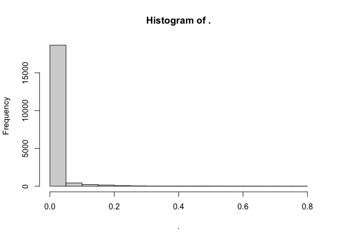
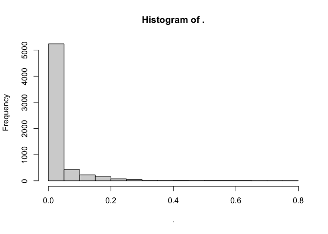

FECBUD Data Preprocessing
================
December 2022

## Load required packages

``` r
library( dplyr )
library( magrittr )
library( knitr )
library( tidyverse )
```

``` r
library( phyloseq )
library( microViz )
library( microbiome )
```

## Load the data

Two datasets are available, one with the relative abundances and one
with the counts. Here we use the relative abundance dataset

``` r
physeq_mOTU
```

    ## phyloseq-class experiment-level object
    ## otu_table()   OTU Table:         [ 33570 taxa and 209 samples ]
    ## sample_data() Sample Data:       [ 209 samples by 17 sample variables ]
    ## tax_table()   Taxonomy Table:    [ 33570 taxa by 7 taxonomic ranks ]

The data includes 209 samples (including the donor samples) and 33570
mOTUs

## Preprocessing of the data

``` r
# The mOTU data has two more samples, but those samples do not contain mOTUs
physeq_mOTU@otu_table %>% colSums()
physeq_mOTU <- prune_samples(! sample_sums(physeq_mOTU) == 0, physeq_mOTU)

# Removes taxa where phyloseq::taxa_sums() is equal to zero
physeq_mOTU.filt = phyloseq_validate(physeq_mOTU, remove_undetected = TRUE)

# Remove Archaea class
physeq_mOTU.filt@tax_table[,1] %>% table()
physeq_mOTU.filt <- subset_taxa(physeq_mOTU.filt, kingdom != "Archaea")
```

``` r
physeq_mOTU.filt
```

    ## phyloseq-class experiment-level object
    ## otu_table()   OTU Table:         [ 1552 taxa and 207 samples ]
    ## sample_data() Sample Data:       [ 207 samples by 17 sample variables ]
    ## tax_table()   Taxonomy Table:    [ 1552 taxa by 7 taxonomic ranks ]

After filtering the data, we are left with 207 samples and 1552 mOTUs.

``` r
# Correct the name of Coriobacteriaceae
physeq_mOTU.filt = microbiome::merge_taxa2( physeq_mOTU.filt, pattern = "_Coriobacteriaceae", name = "Coriobacteriaceae" )

# Change the partial responders to none responders (wk14 and wk10)
physeq_mOTU.filt@sam_data$clinical_outcome_wk14 = gsub( "Partial", "None",
                                                        physeq_mOTU.filt@sam_data$clinical_outcome_wk14)
physeq_mOTU.filt@sam_data$clinical_outcome_wk14 = factor(physeq_mOTU.filt@sam_data$clinical_outcome_wk14, 
                                                         levels = c( "None", "Good" ))

physeq_mOTU.filt@sam_data$clinical_outcome_wk10 = gsub( "Partial", "None",
                                                        physeq_mOTU.filt@sam_data$clinical_outcome_wk10 )
physeq_mOTU.filt@sam_data$clinical_outcome_wk10 = factor( physeq_mOTU.filt@sam_data$clinical_outcome_wk10, 
                                                          levels = c( "None", "Good" ))

# Change the timepoint levels
physeq_mOTU.filt@sam_data[[ "timepoint" ]] = factor( physeq_mOTU.filt@sam_data[[ "timepoint" ]],
                                                     levels = c( "Baseline", "FMT1" , "FMT2", "FMT3", "FMT4",
                                                                 "Week7","Week8", "Week10", "Week14" ))
```

## Save the data

``` r
saveRDS( physeq_mOTU.filt, "FECBUD_physeq_filt_relativeabundances.rds" )
# saveRDS( physeq_mOTU.filt, "FECBUD_physeq_filt_countdata.rds" )
```

# Create dataframe object of families

## Agglomerate to family level

``` r
# Agglomerate on family level
IBD.physeq.glom <- physeq_mOTU.filt %>% tax_glom( "family" )  # Note that if NA, all put in the same category
# View the new phyloseq object
IBD.physeq.glom 
```

    ## phyloseq-class experiment-level object
    ## otu_table()   OTU Table:         [ 95 taxa and 207 samples ]
    ## sample_data() Sample Data:       [ 207 samples by 17 sample variables ]
    ## tax_table()   Taxonomy Table:    [ 95 taxa by 7 taxonomic ranks ]

The data consist of 95 different bacterial families

## Get all the taxa names

``` r
# Substract the taxonomy table   
tax.tab <- IBD.physeq.glom %>% tax_table()
# Keep only the last column
familynames <- tax.tab[,5] %>%  as.character()
# Get the OTUs from the otu table
otu.tab <- IBD.physeq.glom %>%  otu_table() %>% t()
# Keep only the names
otus <- otu.tab %>% colnames()
# Combine otus and names
names <- cbind( otus, familynames ) 
```

## Function to extract the abundances

``` r
pickdata <- function (x, otu.name) {
  xx <- abundances(x)
  meta <- sample_data(x)
  if (otu.name %in% rownames(xx)) {
    xxx <- as.vector(xx[otu.name, ])
  }
  else if (otu.name %in% colnames(meta)) {
    xxx <- unlist(meta[, otu.name])
  }
}
```

## Store the abundances in a long dataframe

``` r
# make a list to store the abundances per family
results_list <- vector( mode = "list", length = nrow( names ) )
# loop through all families
for ( i in 1:nrow( names ) ) {
  # get the data with the pickdata function
  density.data <- pickdata( IBD.physeq.glom, as.character( names[ i, 1 ] ) )
  
  # combine with meta data
  meta <- IBD.physeq.glom %>% meta()
  family.names <- names[ i,2 ]
  density.data.df <- cbind( family.names, density.data, meta )
  
  results_list[[i]] <- density.data.df
}

# make a dataframe for every family
new.names <- physeq_mOTU.filt@tax_table[,5:6] %>% as.data.frame()
families <- new.names["family"] %>% unique() %>% as.data.frame()
rownames(families) <- NULL
families <- families[,1] %>% as.character()
dataframe.abundances.families <- do.call( "rbind", results_list )
IBD.data.family <- dataframe.abundances.families[dataframe.abundances.families$family.names %in% families,]
```

## Investigate the data

``` r
IBD.data.family$family.names %>% unique()  
```

    ##  [1] "Enterobacteriaceae"                                                          
    ##  [2] "Pseudomonadaceae"                                                            
    ##  [3] "Leuconostocaceae"                                                            
    ##  [4] "Enterococcaceae"                                                             
    ##  [5] "Hafniaceae"                                                                  
    ##  [6] "Firmicutesfam.[Erysipelotrichaceae/Lachnospiraceae]"                         
    ##  [7] "Pasteurellaceae"                                                             
    ##  [8] "Streptococcaceae"                                                            
    ##  [9] "Neisseriaceae"                                                               
    ## [10] "Firmicutesfam.[Veillonellaceae/Ruminococcaceae]"                             
    ## [11] "Actinobacteriafam.[Sanguibacteraceae/Actinomycetaceae/Promicromonosporaceae]"
    ## [12] "Actinomycetaceae"                                                            
    ## [13] "Actinobacteriafam.[Actinomycetaceae/Streptomycetaceae]"                      
    ## [14] "Clostridialesfam.[Clostridiaceae/Heliobacteriaceae]"                         
    ## [15] "Selenomonadaceae"                                                            
    ## [16] "Bacteroidaceae"                                                              
    ## [17] "Firmicutesfam.[Lachnospiraceae/Lactobacillaceae]"                            
    ## [18] "Lactobacillaceae"                                                            
    ## [19] "Morganellaceae"                                                              
    ## [20] "Bifidobacteriaceae"                                                          
    ## [21] "Firmicutesfam.[Erysipelotrichaceae/Peptostreptococcaceae]"                   
    ## [22] "Clostridialesfam.[Clostridiaceae/Ruminococcaceae]"                           
    ## [23] "Sutterellaceae"                                                              
    ## [24] "Campylobacteraceae"                                                          
    ## [25] "Acetobacteraceae"                                                            
    ## [26] "Akkermansiaceae"                                                             
    ## [27] "Bacteriafam.[Lactobacillaceae/Rhodospirillaceae]"                            
    ## [28] "Barnesiellaceae"                                                             
    ## [29] "Clostridialesfam.[Clostridiaceae/Christensenellaceae]"                       
    ## [30] "Clostridialesfam.[Lachnospiraceae/Clostridiaceae]"                           
    ## [31] "Coriobacteriaceae"                                                           
    ## [32] "Firmicutesfam.[Erysipelotrichaceae/Clostridiaceae]"                          
    ## [33] "Clostridialesfam.[Eubacteriaceae/Clostridiaceae]"                            
    ## [34] "Firmicutesfam.[Carnobacteriaceae/Acidaminococcaceae]"                        
    ## [35] "Lachnospiraceae"                                                             
    ## [36] "Clostridialesfam.[Lachnospiraceae/Ruminococcaceae]"                          
    ## [37] "Clostridialesfam.[Lachnospiraceae/Clostridiaceae/Ruminococcaceae]"           
    ## [38] "Bacteroidalesfam.[Porphyromonadaceae/Barnesiellaceae]"                       
    ## [39] "Moraxellaceae"                                                               
    ## [40] "Odoribacteraceae"                                                            
    ## [41] "Acidaminococcaceae"                                                          
    ## [42] "Prevotellaceae"                                                              
    ## [43] "Bacteriafam.incertaesedis"                                                   
    ## [44] "Fusobacteriaceae"                                                            
    ## [45] "Corynebacteriaceae"                                                          
    ## [46] "Peptoniphilaceae"                                                            
    ## [47] "Desulfovibrionaceae"                                                         
    ## [48] "Oscillospiraceae"                                                            
    ## [49] "Carnobacteriaceae"                                                           
    ## [50] "Clostridialesfam.[Eubacteriaceae/Ruminococcaceae]"                           
    ## [51] "Comamonadaceae"                                                              
    ## [52] "Micrococcaceae"                                                              
    ## [53] "Tannerellaceae"                                                              
    ## [54] "Ruminococcaceae"                                                             
    ## [55] "Catabacteriaceae"                                                            
    ## [56] "Firmicutesfam.[Erysipelotrichaceae/Eubacteriaceae/Clostridiaceae]"           
    ## [57] "Rhodospirillaceae"                                                           
    ## [58] "Brachyspiraceae"                                                             
    ## [59] "Myxococcaceae"                                                               
    ## [60] "Eubacteriaceae"                                                              
    ## [61] "Staphylococcaceae"                                                           
    ## [62] "Proteobacteriafam.incertaesedis"                                             
    ## [63] "Peptostreptococcaceae"                                                       
    ## [64] "Christensenellaceae"                                                         
    ## [65] "Muribaculaceae"                                                              
    ## [66] "Synergistaceae"                                                              
    ## [67] "Bacillalesfam.incertaesedis"                                                 
    ## [68] "Dehalococcoidalesfam.incertaesedis"                                          
    ## [69] "Clostridialesfam.incertaesedis"                                              
    ## [70] "Firmicutesfam.incertaesedis"                                                 
    ## [71] "Eggerthellaceae"                                                             
    ## [72] "Erysipelotrichaceae"                                                         
    ## [73] "Clostridiaceae"                                                              
    ## [74] "Rikenellaceae"                                                               
    ## [75] "Lentisphaeraefam.incertaesedis"                                              
    ## [76] "Veillonellaceae"                                                             
    ## [77] "Verrucomicrobiafam.incertaesedis"                                            
    ## [78] "Burkholderialesfam.incertaesedis"                                            
    ## [79] "Mycoplasmataceae"                                                            
    ## [80] "Clostridiafam.incertaesedis"                                                 
    ## [81] "Eggerthellalesfam.incertaesedis"                                             
    ## [82] "Atopobiaceae"                                                                
    ## [83] "Bacteroidalesfam.incertaesedis"                                              
    ## [84] "Flavobacteriiafam.incertaesedis"                                             
    ## [85] "Porphyromonadaceae"                                                          
    ## [86] "Elusimicrobiafam.incertaesedis"                                              
    ## [87] "Flavobacteriaceae"                                                           
    ## [88] "Oxalobacteraceae"                                                            
    ## [89] "ClostridialesFamilyXIII.IncertaeSedis"                                       
    ## [90] "Mollicutesfam.incertaesedis"                                                 
    ## [91] "Coriobacterialesfam.incertaesedis"                                           
    ## [92] "Coriobacteriiafam.incertaesedis"                                             
    ## [93] "Leptotrichiaceae"                                                            
    ## [94] "Alphaproteobacteriafam.incertaesedis"

``` r
IBD.data.family %>% names()
```

    ##  [1] "family.names"          "density.data"          "subject_id"           
    ##  [4] "filename"              "file_id"               "timepoint"            
    ##  [7] "timepoint.new"         "sample_id.new"         "days_offset"          
    ## [10] "treated_with_donor"    "age"                   "sex"                  
    ## [13] "pretreatment"          "clinical_outcome_wk10" "clinical_outcome_wk14"
    ## [16] "raw_reads"             "human_reads"           "human_percentage"     
    ## [19] "high_quality_reads"

``` r
IBD.data.family$subject_id %>% table()
```

    ## .
    ##     101     102     103     104     105     106     107     108     109     110 
    ##     855     855     665     855     475     855     855     855     190     855 
    ##     111     112     113     114     115     117     118     119     120     121 
    ##     855     855     855     475     855     190     665     665     855     760 
    ##     122     123     124     125 Donor A Donor B 
    ##     570     475     855     855    1235    1330

``` r
IBD.data.family$sample_id.new %>% table()
```

    ## .
    ## 101-Baseline   101-Post-1   101-Post-2   101-Post-3   101-Post-4  101-Pre-FMT 
    ##           95           95           95           95           95           95 
    ##   101-Week10   101-Week14    101-Week8 102-Baseline   102-Post-1   102-Post-2 
    ##           95           95           95           95           95           95 
    ##   102-Post-3   102-Post-4  102-Pre-FMT   102-Week10   102-Week14    102-Week8 
    ##           95           95           95           95           95           95 
    ##   103-Post-1   103-Post-2   103-Post-3   103-Post-4  103-Pre-FMT   103-Week10 
    ##           95           95           95           95           95           95 
    ##    103-Week8 104-Baseline   104-Post-1   104-Post-2   104-Post-3   104-Post-4 
    ##           95           95           95           95           95           95 
    ##  104-Pre-FMT   104-Week10   104-Week14    104-Week8 105-Baseline   105-Post-1 
    ##           95           95           95           95           95           95 
    ##   105-Post-2   105-Post-3  105-Pre-FMT 106-Baseline   106-Post-1   106-Post-2 
    ##           95           95           95           95           95           95 
    ##   106-Post-3   106-Post-4  106-Pre-FMT   106-Week10   106-Week14    106-Week8 
    ##           95           95           95           95           95           95 
    ## 107-Baseline   107-Post-1   107-Post-2   107-Post-3   107-Post-4  107-Pre-FMT 
    ##           95           95           95           95           95           95 
    ##   107-Week10   107-Week14    107-Week8 108-Baseline   108-Post-1   108-Post-2 
    ##           95           95           95           95           95           95 
    ##   108-Post-3   108-Post-4  108-Pre-FMT   108-Week10   108-Week14    108-Week8 
    ##           95           95           95           95           95           95 
    ## 109-Baseline  109-Pre-FMT 110-Baseline   110-Post-1   110-Post-2   110-Post-3 
    ##           95           95           95           95           95           95 
    ##   110-Post-4  110-Pre-FMT   110-Week10   110-Week14    110-Week8 111-Baseline 
    ##           95           95           95           95           95           95 
    ##   111-Post-1   111-Post-2   111-Post-3   111-Post-4  111-Pre-FMT   111-Week10 
    ##           95           95           95           95           95           95 
    ##   111-Week14    111-Week8 112-Baseline   112-Post-1   112-Post-2   112-Post-3 
    ##           95           95           95           95           95           95 
    ##   112-Post-4  112-Pre-FMT   112-Week10   112-Week14    112-Week8 113-Baseline 
    ##           95           95           95           95           95           95 
    ##   113-Post-1   113-Post-2   113-Post-3   113-Post-4  113-Pre-FMT   113-Week10 
    ##           95           95           95           95           95           95 
    ##   113-Week14    113-Week8 114-Baseline   114-Post-1   114-Post-2   114-Post-3 
    ##           95           95           95           95           95           95 
    ##  114-Pre-FMT 115-Baseline   115-Post-1   115-Post-2   115-Post-3   115-Post-4 
    ##           95           95           95           95           95           95 
    ##  115-Pre-FMT   115-Week10   115-Week14    115-Week8   117-Post-2  117-Pre-FMT 
    ##           95           95           95           95           95           95 
    ## 118-Baseline   118-Post-1   118-Post-2   118-Post-3  118-Pre-FMT   118-Week10 
    ##           95           95           95           95           95           95 
    ##   118-Week14 119-Baseline   119-Post-1   119-Post-2   119-Post-3   119-Post-4 
    ##           95           95           95           95           95           95 
    ##  119-Pre-FMT    119-Week8 120-Baseline   120-Post-1   120-Post-2   120-Post-3 
    ##           95           95           95           95           95           95 
    ##   120-Post-4  120-Pre-FMT   120-Week10   120-Week14    120-Week8 121-Baseline 
    ##           95           95           95           95           95           95 
    ##   121-Post-1   121-Post-2   121-Post-3   121-Post-4  121-Pre-FMT   121-Week10 
    ##           95           95           95           95           95           95 
    ##    121-Week8 122-Baseline   122-Post-1   122-Post-2   122-Post-3  122-Pre-FMT 
    ##           95           95           95           95           95           95 
    ##    122-Week8 123-Baseline   123-Post-1   123-Post-2   123-Post-3  123-Pre-FMT 
    ##           95           95           95           95           95           95 
    ## 124-Baseline   124-Post-1   124-Post-2   124-Post-3   124-Post-4  124-Pre-FMT 
    ##           95           95           95           95           95           95 
    ##   124-Week10   124-Week14    124-Week8 125-Baseline   125-Post-1   125-Post-2 
    ##           95           95           95           95           95           95 
    ##   125-Post-3   125-Post-4  125-Pre-FMT   125-Week10   125-Week14    125-Week8 
    ##           95           95           95           95           95           95 
    ##    Donor_A-1   Donor_A-10   Donor_A-11   Donor_A-12   Donor_A-13    Donor_A-2 
    ##           95           95           95           95           95           95 
    ##    Donor_A-3    Donor_A-4    Donor_A-5    Donor_A-6    Donor_A-7    Donor_A-8 
    ##           95           95           95           95           95           95 
    ##    Donor_A-9    Donor_B-1   Donor_B-10   Donor_B-11   Donor_B-12   Donor_B-13 
    ##           95           95           95           95           95           95 
    ##   Donor_B-14    Donor_B-2    Donor_B-3    Donor_B-4    Donor_B-5    Donor_B-6 
    ##           95           95           95           95           95           95 
    ##    Donor_B-7    Donor_B-8    Donor_B-9 
    ##           95           95           95

``` r
IBD.data.family %>% head()
```

    ##         family.names density.data subject_id         filename file_id timepoint
    ## 1 Enterobacteriaceae 0.0000000000        101 CY11446.fastq.gz CY11446  Baseline
    ## 2 Enterobacteriaceae 0.0002395946        101 CY11449.fastq.gz CY11449      FMT1
    ## 3 Enterobacteriaceae 0.0000000000        101 CY11452.fastq.gz CY11452      FMT2
    ## 4 Enterobacteriaceae 0.0005540793        101 CY11455.fastq.gz CY11455      FMT3
    ## 5 Enterobacteriaceae 0.0000000000        101 CY11458.fastq.gz CY11458      FMT4
    ## 6 Enterobacteriaceae 0.0000000000        101 CY11461.fastq.gz CY11461    Week10
    ##   timepoint.new sample_id.new days_offset treated_with_donor age sex
    ## 1      Baseline  101-Baseline          62            Donor A  58   F
    ## 2       Pre-FMT   101-Pre-FMT          82            Donor A  58   F
    ## 3        Post-1    101-Post-1           0            Donor A  58   F
    ## 4        Post-2    101-Post-2          96            Donor A  58   F
    ## 5        Post-3    101-Post-3         103            Donor A  58   F
    ## 6        Week10    101-Week10         246            Donor A  58   F
    ##   pretreatment clinical_outcome_wk10 clinical_outcome_wk14 raw_reads
    ## 1      placebo                  Good                  Good   3255433
    ## 2      placebo                  Good                  Good   3668939
    ## 3      placebo                  Good                  Good   4049160
    ## 4      placebo                  Good                  Good   3725242
    ## 5      placebo                  Good                  Good   3430628
    ## 6      placebo                  Good                  Good   3059581
    ##   human_reads human_percentage high_quality_reads
    ## 1      305675        9.3896879            2763190
    ## 2        4828        0.1315912            3461216
    ## 3        4261        0.1052317            3803090
    ## 4        5322        0.1428632            3519302
    ## 5        4313        0.1257204            3222085
    ## 6        3196        0.1044587            2816646

``` r
IBD.data.family %>% summary()
```

    ##  family.names        density.data       subject_id          filename        
    ##  Length:19665       Min.   :0.000000   Length:19665       Length:19665      
    ##  Class :character   1st Qu.:0.000000   Class :character   Class :character  
    ##  Mode  :character   Median :0.000000   Mode  :character   Mode  :character  
    ##                     Mean   :0.009770                                        
    ##                     3rd Qu.:0.001308                                        
    ##                     Max.   :0.750690                                        
    ##                                                                             
    ##    file_id             timepoint    timepoint.new      sample_id.new     
    ##  Length:19665       FMT1    :2280   Length:19665       Length:19665      
    ##  Class :character   FMT3    :2185   Class :character   Class :character  
    ##  Mode  :character   Baseline:2090   Mode  :character   Mode  :character  
    ##                     FMT2    :2090                                        
    ##                     FMT4    :2090                                        
    ##                     (Other) :6365                                        
    ##                     NA's    :2565                                        
    ##   days_offset     treated_with_donor      age            sex           
    ##  Min.   :  0.00   Length:19665       Min.   :22.00   Length:19665      
    ##  1st Qu.: 27.00   Class :character   1st Qu.:32.00   Class :character  
    ##  Median : 44.00   Mode  :character   Median :40.00   Mode  :character  
    ##  Mean   : 82.77                      Mean   :44.94                     
    ##  3rd Qu.: 82.00                      3rd Qu.:52.00                     
    ##  Max.   :756.00                      Max.   :74.00                     
    ##                                                                        
    ##  pretreatment       clinical_outcome_wk10 clinical_outcome_wk14
    ##  Length:19665       None:8740             None:9405            
    ##  Class :character   Good:8360             Good:7695            
    ##  Mode  :character   NA's:2565             NA's:2565            
    ##                                                                
    ##                                                                
    ##                                                                
    ##                                                                
    ##    raw_reads         human_reads      human_percentage   high_quality_reads
    ##  Min.   :  511447   Min.   :    490   Min.   : 0.01956   Min.   :   25680  
    ##  1st Qu.: 2454331   1st Qu.:  11659   1st Qu.: 0.38208   1st Qu.: 1573645  
    ##  Median : 2882066   Median : 204232   Median : 6.75899   Median : 2250122  
    ##  Mean   : 3069052   Mean   : 548234   Mean   :20.21670   Mean   : 2269474  
    ##  3rd Qu.: 3320059   3rd Qu.: 868597   3rd Qu.:31.63406   3rd Qu.: 2778767  
    ##  Max.   :11743137   Max.   :4485735   Max.   :98.34088   Max.   :11163974  
    ## 

``` r
IBD.data.family %>% str()
```

    ## 'data.frame':    19665 obs. of  19 variables:
    ##  $ family.names         : chr  "Enterobacteriaceae" "Enterobacteriaceae" "Enterobacteriaceae" "Enterobacteriaceae" ...
    ##  $ density.data         : num  0 0.00024 0 0.000554 0 ...
    ##  $ subject_id           : chr  "101" "101" "101" "101" ...
    ##  $ filename             : chr  "CY11446.fastq.gz" "CY11449.fastq.gz" "CY11452.fastq.gz" "CY11455.fastq.gz" ...
    ##  $ file_id              : chr  "CY11446" "CY11449" "CY11452" "CY11455" ...
    ##  $ timepoint            : Factor w/ 9 levels "Baseline","FMT1",..: 1 2 3 4 5 8 9 6 7 1 ...
    ##  $ timepoint.new        : chr  "Baseline" "Pre-FMT" "Post-1" "Post-2" ...
    ##  $ sample_id.new        : chr  "101-Baseline" "101-Pre-FMT" "101-Post-1" "101-Post-2" ...
    ##  $ days_offset          : num  62 82 0 96 103 246 174 111 118 0 ...
    ##  $ treated_with_donor   : chr  "Donor A" "Donor A" "Donor A" "Donor A" ...
    ##  $ age                  : num  58 58 58 58 58 58 58 58 58 44 ...
    ##  $ sex                  : chr  "F" "F" "F" "F" ...
    ##  $ pretreatment         : chr  "placebo" "placebo" "placebo" "placebo" ...
    ##  $ clinical_outcome_wk10: Factor w/ 2 levels "None","Good": 2 2 2 2 2 2 2 2 2 1 ...
    ##  $ clinical_outcome_wk14: Factor w/ 2 levels "None","Good": 2 2 2 2 2 2 2 2 2 1 ...
    ##  $ raw_reads            : num  3255433 3668939 4049160 3725242 3430628 ...
    ##  $ human_reads          : num  305675 4828 4261 5322 4313 ...
    ##  $ human_percentage     : num  9.39 0.132 0.105 0.143 0.126 ...
    ##  $ high_quality_reads   : num  2763190 3461216 3803090 3519302 3222085 ...

``` r
# Abundances
IBD.data.family$density.data %>% summary()
```

    ##     Min.  1st Qu.   Median     Mean  3rd Qu.     Max. 
    ## 0.000000 0.000000 0.000000 0.009770 0.001308 0.750690

``` r
IBD.data.family$density.data %>% hist()
```

<!-- -->

``` r
select <- IBD.data.family$density.data > 0
IBD.data.family$density.data[select] %>% summary()
```

    ##      Min.   1st Qu.    Median      Mean   3rd Qu.      Max. 
    ## 0.0000901 0.0015237 0.0050289 0.0307658 0.0251755 0.7506899

``` r
IBD.data.family$density.data[select] %>% hist()
```

<!-- -->

``` r
IBD.data.family$filename %>% unique()
```

    ##   [1] "CY11446.fastq.gz" "CY11449.fastq.gz" "CY11452.fastq.gz"
    ##   [4] "CY11455.fastq.gz" "CY11458.fastq.gz" "CY11461.fastq.gz"
    ##   [7] "CY11464.fastq.gz" "CY11545.fastq.gz" "CY11549.fastq.gz"
    ##  [10] "CY11467.fastq.gz" "CY11470.fastq.gz" "CY11473.fastq.gz"
    ##  [13] "CY11476.fastq.gz" "CY11479.fastq.gz" "CY11482.fastq.gz"
    ##  [16] "CY11485.fastq.gz" "CY11542.fastq.gz" "CY11539.fastq.gz"
    ##  [19] "CY11488.fastq.gz" "CY11491.fastq.gz" "CY11494.fastq.gz"
    ##  [22] "CY11497.fastq.gz" "CY11500.fastq.gz" "CY11554.fastq.gz"
    ##  [25] "CY11551.fastq.gz" "CY11503.fastq.gz" "CY11506.fastq.gz"
    ##  [28] "CY11509.fastq.gz" "CY11512.fastq.gz" "CY11515.fastq.gz"
    ##  [31] "CY11518.fastq.gz" "CY11521.fastq.gz" "CY11560.fastq.gz"
    ##  [34] "CY11557.fastq.gz" "CY11524.fastq.gz" "CY11527.fastq.gz"
    ##  [37] "CY11530.fastq.gz" "CY11533.fastq.gz" "CY11536.fastq.gz"
    ##  [40] "CY17264.fastq.gz" "CY17268.fastq.gz" "CY17272.fastq.gz"
    ##  [43] "CY17276.fastq.gz" "CY17280.fastq.gz" "CY17284.fastq.gz"
    ##  [46] "CY17288.fastq.gz" "CY17292.fastq.gz" "CY17296.fastq.gz"
    ##  [49] "CY17300.fastq.gz" "CY17304.fastq.gz" "CY17308.fastq.gz"
    ##  [52] "CY17312.fastq.gz" "CY17316.fastq.gz" "CY17320.fastq.gz"
    ##  [55] "CY17324.fastq.gz" "CY17328.fastq.gz" "CY17332.fastq.gz"
    ##  [58] "CY17337.fastq.gz" "CY17340.fastq.gz" "CY17344.fastq.gz"
    ##  [61] "CY17348.fastq.gz" "CY17352.fastq.gz" "CY17356.fastq.gz"
    ##  [64] "CY17360.fastq.gz" "CY17364.fastq.gz" "CY17368.fastq.gz"
    ##  [67] "CY17372.fastq.gz" "CY17376.fastq.gz" "CY17380.fastq.gz"
    ##  [70] "CY17384.fastq.gz" "CY17388.fastq.gz" "CY17392.fastq.gz"
    ##  [73] "CY17396.fastq.gz" "CY17400.fastq.gz" "CY17404.fastq.gz"
    ##  [76] "CY17408.fastq.gz" "CY17412.fastq.gz" "CY17416.fastq.gz"
    ##  [79] "CY17420.fastq.gz" "CY17424.fastq.gz" "CY17428.fastq.gz"
    ##  [82] "CY17432.fastq.gz" "CY17436.fastq.gz" "CY17440.fastq.gz"
    ##  [85] "CY17444.fastq.gz" "CY17448.fastq.gz" "CY17452.fastq.gz"
    ##  [88] "CY17456.fastq.gz" "CY17460.fastq.gz" "CY17464.fastq.gz"
    ##  [91] "CY17468.fastq.gz" "CY17472.fastq.gz" "CY17476.fastq.gz"
    ##  [94] "CY17480.fastq.gz" "CY17484.fastq.gz" "CY17488.fastq.gz"
    ##  [97] "CY17492.fastq.gz" "CY17496.fastq.gz" "CY17502.fastq.gz"
    ## [100] "CY17504.fastq.gz" "CY17508.fastq.gz" "CY17514.fastq.gz"
    ## [103] "CY17516.fastq.gz" "CY17521.fastq.gz" "CY17524.fastq.gz"
    ## [106] "CY17528.fastq.gz" "CY17532.fastq.gz" "CY17536.fastq.gz"
    ## [109] "CY17540.fastq.gz" "CY17544.fastq.gz" "CY17548.fastq.gz"
    ## [112] "CY17553.fastq.gz" "CY17557.fastq.gz" "CY17560.fastq.gz"
    ## [115] "CY17564.fastq.gz" "CY17568.fastq.gz" "CY17572.fastq.gz"
    ## [118] "CY17576.fastq.gz" "CY19641.fastq.gz" "CY19643.fastq.gz"
    ## [121] "CY19644.fastq.gz" "CY19645.fastq.gz" "CY19646.fastq.gz"
    ## [124] "CY19647.fastq.gz" "CY19648.fastq.gz" "CY19649.fastq.gz"
    ## [127] "CY19650.fastq.gz" "CY19651.fastq.gz" "CY19652.fastq.gz"
    ## [130] "CY19653.fastq.gz" "CY19654.fastq.gz" "CY19696.fastq.gz"
    ## [133] "CY19716.fastq.gz" "CY19717.fastq.gz" "CY19656.fastq.gz"
    ## [136] "CY19657.fastq.gz" "CY19658.fastq.gz" "CY19700.fastq.gz"
    ## [139] "CY19701.fastq.gz" "CY19702.fastq.gz" "CY19703.fastq.gz"
    ## [142] "CY19677.fastq.gz" "CY19678.fastq.gz" "CY19704.fastq.gz"
    ## [145] "CY19705.fastq.gz" "CY19706.fastq.gz" "CY19707.fastq.gz"
    ## [148] "CY19708.fastq.gz" "CY19709.fastq.gz" "CY19679.fastq.gz"
    ## [151] "CY19680.fastq.gz" "CY19710.fastq.gz" "CY19711.fastq.gz"
    ## [154] "CY19712.fastq.gz" "CY19713.fastq.gz" "CY19714.fastq.gz"
    ## [157] "CY19715.fastq.gz" "CY21084.fastq.gz" "CY21085.fastq.gz"
    ## [160] "CY21086.fastq.gz" "CY21087.fastq.gz" "CY21088.fastq.gz"
    ## [163] "CY21089.fastq.gz" "CY21090.fastq.gz" "CY21091.fastq.gz"
    ## [166] "CY21092.fastq.gz" "CY21093.fastq.gz" "CY21096.fastq.gz"
    ## [169] "CY21097.fastq.gz" "CY21094.fastq.gz" "CY21095.fastq.gz"
    ## [172] "CY21098.fastq.gz" "CY21099.fastq.gz" "CY21100.fastq.gz"
    ## [175] "CY21101.fastq.gz" "CY21102.fastq.gz" "CY21105.fastq.gz"
    ## [178] "CY21106.fastq.gz" "CY21103.fastq.gz" "CY21104.fastq.gz"
    ## [181] "TUB2807.fastq.gz" "TUB2808.fastq.gz" "TUB2809.fastq.gz"
    ## [184] "TUB2810.fastq.gz" "TUB2799.fastq.gz" "TUB2800.fastq.gz"
    ## [187] "TUB2801.fastq.gz" "TUB2802.fastq.gz" "TUB2803.fastq.gz"
    ## [190] "TUB2797.fastq.gz" "TUB2804.fastq.gz" "TUB2805.fastq.gz"
    ## [193] "TUB2806.fastq.gz" "TUB2819.fastq.gz" "TUB2820.fastq.gz"
    ## [196] "TUB2821.fastq.gz" "TUB2822.fastq.gz" "TUB2823.fastq.gz"
    ## [199] "TUB2798.fastq.gz" "TUB2811.fastq.gz" "TUB2812.fastq.gz"
    ## [202] "TUB2813.fastq.gz" "TUB2814.fastq.gz" "TUB2815.fastq.gz"
    ## [205] "TUB2816.fastq.gz" "TUB2817.fastq.gz" "TUB2818.fastq.gz"

``` r
IBD.data.family$file_id %>% unique()
```

    ##   [1] "CY11446" "CY11449" "CY11452" "CY11455" "CY11458" "CY11461" "CY11464"
    ##   [8] "CY11545" "CY11549" "CY11467" "CY11470" "CY11473" "CY11476" "CY11479"
    ##  [15] "CY11482" "CY11485" "CY11542" "CY11539" "CY11488" "CY11491" "CY11494"
    ##  [22] "CY11497" "CY11500" "CY11554" "CY11551" "CY11503" "CY11506" "CY11509"
    ##  [29] "CY11512" "CY11515" "CY11518" "CY11521" "CY11560" "CY11557" "CY11524"
    ##  [36] "CY11527" "CY11530" "CY11533" "CY11536" "CY17264" "CY17268" "CY17272"
    ##  [43] "CY17276" "CY17280" "CY17284" "CY17288" "CY17292" "CY17296" "CY17300"
    ##  [50] "CY17304" "CY17308" "CY17312" "CY17316" "CY17320" "CY17324" "CY17328"
    ##  [57] "CY17332" "CY17337" "CY17340" "CY17344" "CY17348" "CY17352" "CY17356"
    ##  [64] "CY17360" "CY17364" "CY17368" "CY17372" "CY17376" "CY17380" "CY17384"
    ##  [71] "CY17388" "CY17392" "CY17396" "CY17400" "CY17404" "CY17408" "CY17412"
    ##  [78] "CY17416" "CY17420" "CY17424" "CY17428" "CY17432" "CY17436" "CY17440"
    ##  [85] "CY17444" "CY17448" "CY17452" "CY17456" "CY17460" "CY17464" "CY17468"
    ##  [92] "CY17472" "CY17476" "CY17480" "CY17484" "CY17488" "CY17492" "CY17496"
    ##  [99] "CY17502" "CY17504" "CY17508" "CY17514" "CY17516" "CY17521" "CY17524"
    ## [106] "CY17528" "CY17532" "CY17536" "CY17540" "CY17544" "CY17548" "CY17553"
    ## [113] "CY17557" "CY17560" "CY17564" "CY17568" "CY17572" "CY17576" "CY19641"
    ## [120] "CY19643" "CY19644" "CY19645" "CY19646" "CY19647" "CY19648" "CY19649"
    ## [127] "CY19650" "CY19651" "CY19652" "CY19653" "CY19654" "CY19696" "CY19716"
    ## [134] "CY19717" "CY19656" "CY19657" "CY19658" "CY19700" "CY19701" "CY19702"
    ## [141] "CY19703" "CY19677" "CY19678" "CY19704" "CY19705" "CY19706" "CY19707"
    ## [148] "CY19708" "CY19709" "CY19679" "CY19680" "CY19710" "CY19711" "CY19712"
    ## [155] "CY19713" "CY19714" "CY19715" "CY21084" "CY21085" "CY21086" "CY21087"
    ## [162] "CY21088" "CY21089" "CY21090" "CY21091" "CY21092" "CY21093" "CY21096"
    ## [169] "CY21097" "CY21094" "CY21095" "CY21098" "CY21099" "CY21100" "CY21101"
    ## [176] "CY21102" "CY21105" "CY21106" "CY21103" "CY21104" "TUB2807" "TUB2808"
    ## [183] "TUB2809" "TUB2810" "TUB2799" "TUB2800" "TUB2801" "TUB2802" "TUB2803"
    ## [190] "TUB2797" "TUB2804" "TUB2805" "TUB2806" "TUB2819" "TUB2820" "TUB2821"
    ## [197] "TUB2822" "TUB2823" "TUB2798" "TUB2811" "TUB2812" "TUB2813" "TUB2814"
    ## [204] "TUB2815" "TUB2816" "TUB2817" "TUB2818"

``` r
IBD.data.family$raw_reads %>% unique()
```

    ##   [1]  3255433  3668939  4049160  3725242  3430628  3059581  3213051  3349243
    ##   [9]  3533958  3218250  3303228  3093041  3859173  3695497  3340074  3761730
    ##  [17]  2887811  3344623  2583035  3655811  3046631  3721782  2619545  3049741
    ##  [25]  2318571  3592090  3349040  2702572  3704137  3312453  2824655  3012725
    ##  [33]  3327577  2820557  2236887  3074926  1707891  2882066  1409782  2839929
    ##  [41]  2664191  2610459  3722915  2602300  3112836  3156226  2290068  2445075
    ##  [49]  3014972  2822638  2966742   511447  3035768  2998246  3167550  3165744
    ##  [57]  3170140  3151868   637052  2611523  2614306  2449374  8630566  3224314
    ##  [65]  3983602  3083916  3369239 11461634  2477628  6483820  3538263  2644206
    ##  [73]  3899505  4175878  3858736  3136713  4208126  3166119  2431717  3170559
    ##  [81]  2826515  3046241  2016426  3304265  3029818  2269658  2889545  2325160
    ##  [89]  2933381  2531432  4145238  3238061  3038558  3570874 10571923  3633224
    ##  [97]  2976079  1980315  2679412  2533277 11743137  2782174  2558326  9474853
    ## [105]  2208776  3276856  3088855  3681132  2350787  3320059  2879252  2155777
    ## [113]  2912104  2637803  3090151  2894869  4383542  3826697  2388166  2454331
    ## [121]  3558944  1971898  2634195  3150078  2546355  3359630  2928644  1585019
    ## [129]  3788934  4418865  2920637  3407394  2818266  2440409  2689982  1564553
    ## [137]  2758767  1945456  2517957  2143579  2751097  2418182  2624714  2951858
    ## [145]  3051276  2301821  2210105  2389778  2171214  2281158  2716694  3357079
    ## [153]  3446791  3038205  2520778  4552153  2532126  2076651  1869958  2413494
    ## [161]  2306610  1432266  1879165  2724801  2044433  3683213  2283142  2622899
    ## [169]  2331789  2869422  2268314  2472544  2522287  2208453  2758623  2424379
    ## [177]  2643623  2362601  2535739  3051437  2995667  3058016  2654973  2597176
    ## [185]  2364489  2870787  3390036  2627691  2088012  2092900  1956127  2858310
    ## [193]  1690337  3027598  3180565  4766924  4051787  4419319  2669433  1923854
    ## [201]  4138899  2505273  2551702  2041713  2741047  2481773  2204725

``` r
IBD.data.family$human_reads %>% unique()
```

    ##   [1]  305675    4828    4261    5322    4313    3196    3070    3592    3461
    ##  [10]  886749  241370 1064003 1691152  213178  197016  257561  195187  570154
    ##  [19]  588995  558695  294555   39128    3778  207428    5275   26080  164478
    ##  [28]  274091   38288  303994  182461  120549  602006   96005  601166   69455
    ##  [37]  560718  429592  813177   99383   57917   21031  100521  101644   90555
    ##  [46]   22511  509178 1052983 1875104 1140382  503466  263291 1494061   79866
    ##  [55]    8098  294965  225139  817960  130197   30516   11176 1084532   12313
    ##  [64]   13434  109422    9807  837875  765804  862796 4121379  153114 1249192
    ##  [73]  970687   19713  165369  680817  627099 2275949 1277964  794450  138858
    ##  [82] 1050893 1982971 1112941  929947  383610  591565  603347   14849  396607
    ##  [91]  974008 1024330  427207 1089860   61998  525618  491819 1875887  186962
    ## [100] 2436528  131718    7654  123348 4485735    8101 1475888 2097674  276972
    ## [109] 1825443   26607  213270  617556   18373    9376    7047    6351   11390
    ## [118]   15511 1446440 1572967  209871  868597   23325   31825   52384   41944
    ## [127]  144321 1060734  959353 1807392 2574237 1795477  498737  388327 1255787
    ## [136] 1227620  526564 1377408 1482110    1086     941  780381   31413 2744891
    ## [145]   14637 1537582  834879 1389189 1952366 1600159 2193505   82327  147405
    ## [154]  177496   13636   65770  645861 1531301 1621495 2177139 1965570 1056784
    ## [163] 1546695   73067 1294505 1222771  559023  255911   66971  761927  204232
    ## [172]  330943  640353   35759   42331  245625    1467     776    5079   11659
    ## [181]     814     686     649     758     589     939     663     623     606
    ## [190]     490     622     567    1018    1010    1932     872     874     978
    ## [199]     578     841     772     587     521     806     754     537

``` r
IBD.data.family$human_percentage %>% unique()
```

    ##   [1]  9.38968795  0.13159118  0.10523170  0.14286320  0.12572042  0.10445875
    ##   [7]  0.09554781  0.10724812  0.09793552 27.55376369  7.30709476 34.39989965
    ##  [13] 43.82161670  5.76858810  5.89855195  6.84687630  6.75899496 17.04688391
    ##  [19] 22.80243977 15.28238194  9.66822040  1.05132434  0.14422352  6.80149560
    ##  [25]  0.22751082  0.72603972  4.91119843 10.14185746  1.03365507  9.17730757
    ##  [31]  6.45958533  4.00132770 18.09142208  3.40376032 26.87511707  2.25875354
    ##  [37] 32.83101790 14.90569612 57.68104572  3.49948890  2.17390570  0.80564376
    ##  [43]  2.70006165  3.90592937  2.90908355  0.71322523 22.23418693 43.06546834
    ##  [49] 62.19308173 40.40128419 16.97033311 51.47962545 49.21525624  2.66375741
    ##  [55]  0.25565500  9.31739901  7.10186301 25.95159442 20.43742112  1.16851355
    ##  [61]  0.42749395 44.27792571  0.14266735  0.41664677  2.74681055  0.31800477
    ##  [67] 24.86837532  6.68145572 34.82346825 63.56405637  4.32737759 47.24261272
    ##  [73] 24.89256970  0.47206839  4.28557434 21.70479097 14.90209656 71.88450592
    ##  [79] 52.55397729 25.05709561  4.91269284 34.49802560 98.34087638 33.68195348
    ##  [85] 30.69316375 16.90166536 20.47260036 25.94862289  0.50620768 15.66729819
    ##  [91] 23.49703443 31.63405507 14.05953087 30.52081927  0.58644014 14.46698580
    ##  [97] 16.52573739 94.72669752  6.97772496 96.18087560  1.12165940  0.27510860
    ## [103]  4.82143402 47.34358412  0.36676422 45.03975762 67.91105442  7.52409857
    ## [109] 77.65242023  0.80140142  7.40713213 28.64656224  0.63091840  0.35544732
    ## [115]  0.22804711  0.21938817  0.25983554  0.40533651 60.56697901 64.08944026
    ## [121]  5.89700203 44.04877940  0.88546975  1.01029244  2.05721512  1.24847081
    ## [127]  4.92791203 66.92247853 25.31986569 40.90172476 88.13957366 52.69355408
    ## [133] 17.69659074 15.91237370 46.68384398 78.46458381 19.08693268 70.80129286
    ## [139] 58.86160884  0.05066293  0.03420454 32.27139231  1.19681611 92.98858549
    ## [145]  0.47970095 66.79850431 37.77553555 58.13046233 89.92047767 70.14678510
    ## [151] 80.74170297  2.45234026  4.27658654  5.84213376  0.54094411  1.44481084
    ## [157] 25.50666910 73.73896721 86.71291013 90.20693650 85.21466568 73.78405966
    ## [163] 82.30756746  2.68155363 63.31853379 33.19848730 24.48481084  9.75679963
    ## [169]  2.87208663 26.55332677  9.00369173 13.38471631 25.38779290  1.61918773
    ## [175]  1.53449746 10.13146047  0.05549203  0.03284516  0.20029664  0.38208228
    ## [181]  0.02717258  0.02243285  0.02444469  0.02918555  0.02491024  0.03270880
    ## [187]  0.01955731  0.02370903  0.02902282  0.02976731  0.02504950  0.02176111
    ## [193]  0.03354361  0.03362401  0.03175536  0.04052928  0.02152137  0.01977680
    ## [199]  0.03663699  0.03004386  0.02031941  0.03081500  0.02300425  0.02551779
    ## [205]  0.02940482  0.03038151  0.02435678

``` r
IBD.data.family$high_quality_reads %>% unique()
```

    ##   [1]  2763190  3461216  3803090  3519302  3222085  2816646  3013974  3186611
    ##   [9]  3350586  2223795  2883218  1914770  2070466  3260727  2986629  3358696
    ##  [17]  2545707  2653076  1909805  2945226  2612698  3489295  2455073  2692027
    ##  [25]  2172155  3381031  3003649  2296856  3511555  2863726  2465485  2747616
    ##  [33]  2581856  2537391  1530596  2885928  1081570  2349403   561317  2508297
    ##  [41]  2415872  2321108  3447093  2252583  2778767  2967514  1633552  1302516
    ##  [49]  1063738  1545432  2319496   217261  1444388  2703956  2958167  2659470
    ##  [57]  2744935  2070790   433468  2338789  2344726  1282836  8013408  2851700
    ##  [65]  3638907  2761733  2386964 10213296  1504094  2250122  3131373  1314871
    ##  [73]  2808755  3878995  3509601  2310106  3352920   832605  1041688  2218588
    ##  [81]  2387827  1839662    25680  2041902  1907376  1610936  2130357  1573645
    ##  [89]  2608045  1897326  3018531  2033454  2430618  2330751  9648665  2940889
    ##  [97]  2239561    93899  2296083    84891 11163974  2587674  2242825  4843970
    ## [105]  2039220  1712055   930944  3216870   467663  3091323  2378947  1392156
    ## [113]  2627449  2383011  2832872  2615106  4098065  3607807   764416   748845
    ## [121]  2969467  1010356  2174362  2704438  2139836  2820057  2347457   423296
    ## [129]  2570856  2414297   312565  1439314  2009597  1637322  1241743   271758
    ## [137]  1954052   453818   866150  1725022  2411506  1307028  2116203   167734
    ## [145]  2562409   626181  1186143   853503   188184   565068   432951  2805054
    ## [153]  2878721  2457629  2054606  3960275  1533247   430561   185185   183124
    ## [161]   267820   256518   261481  2258099   609828  2291654  1439556  1935010
    ## [169]  1912654  1773268  1651698  1762765  1526078  1691451  2178681  1776197
    ## [177]  2110114  1882437  2058965  2417931  2509808  2676385  2138703  2085490
    ## [185]  1965683  2349824  2841438  2165621  1630085  1645733  1475051  2323301
    ## [193]  1348800  2557638  2725380  4365427  3631626  4026558  2182264  1518664
    ## [201]  3820149  1942402  2018550  1597338  2229795  2045601  1742729

``` r
# Remove the variables that we will not use
IBD.data.family = subset(IBD.data.family, select = -c(filename, file_id, raw_reads, human_reads,
                                                      human_percentage, high_quality_reads) )
```

``` r
IBD.data.family$timepoint %>% unique()
```

    ##  [1] Baseline FMT1     FMT2     FMT3     FMT4     Week10   Week14   Week7   
    ##  [9] Week8    <NA>    
    ## Levels: Baseline FMT1 FMT2 FMT3 FMT4 Week7 Week8 Week10 Week14

``` r
IBD.data.family$timepoint.new %>% unique()
```

    ##  [1] "Baseline" "Pre-FMT"  "Post-1"   "Post-2"   "Post-3"   "Week10"  
    ##  [7] "Week14"   "Post-4"   "Week8"    "10"       "11"       "12"      
    ## [13] "13"       "1"        "2"        "3"        "4"        "5"       
    ## [19] "6"        "7"        "8"        "9"        "14"

``` r
IBD.data.family$days_offset %>% unique()
```

    ##  [1]  62  82   0  96 103 246 174 111 118  50  27  35  41  70  98  49  56  97 105
    ## [20] 112  29 126 133  20  34  76 107  28  54  22  30  37  44  84 114  51  58  63
    ## [39]  21  42 117  19 106  57  66 101  72 100  45  32  33 119  18  25  39  47  71
    ## [58]  99  69  24  46  59  74  53  60 532 588 630 756 120 224 252 273 301 322 371
    ## [77] 495 329 354 476 528 644  26 157 164 189 203 241 321

``` r
# subset per family
IBD.data.subset <- IBD.data.family %>% 
  subset( ., family.names == "Lachnospiraceae" ) 

IBD.data.subset$treated_with_donor %>% table()
```

    ## .
    ## Donor A Donor B 
    ##      91     116

``` r
IBD.data.family$age %>% hist(., main = "Age")
```

<!-- -->

``` r
mean.Age <-  IBD.data.family$age %>% mean()
# recode around mean age ~45 years
IBD.data.family$age2 <- as.numeric( IBD.data.family$age - mean.Age )

IBD.data.subset$sex %>% table()
```

    ## .
    ##   F   M 
    ## 104 103

``` r
IBD.data.subset$pretreatment %>% table()
```

    ## .
    ## budesonide    placebo 
    ##        107         73

``` r
IBD.data.subset$clinical_outcome_wk10 %>% table()
```

    ## .
    ## None Good 
    ##   92   88

``` r
IBD.data.subset$clinical_outcome_wk14 %>% table()
```

    ## .
    ## None Good 
    ##   99   81

## Save the dataframe

``` r
saveRDS( IBD.data.family, file = "dataframe.abundances.families.relativeabundance.rda" )
# saveRDS( IBD.data.family, file = "dataframe.abundances.families.countdata.rda" )
```
