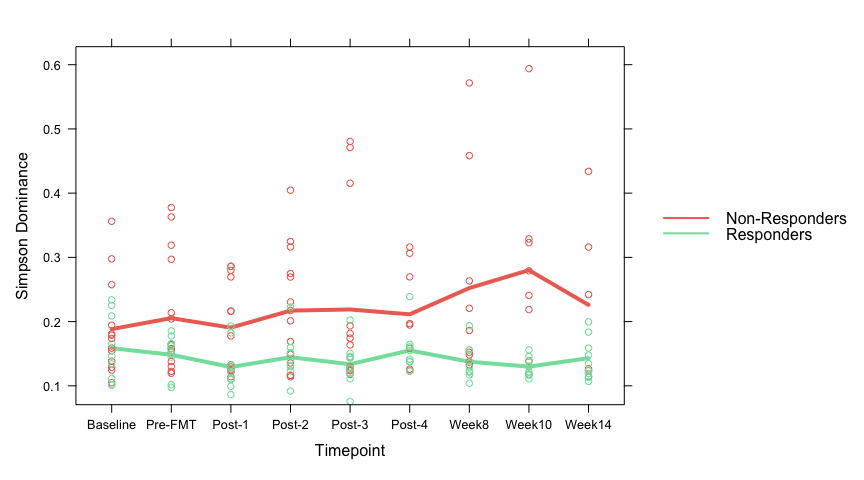

Modelling Simpson Dominance
================
December 2022

## Load required packages

``` r
library( dplyr )
library( magrittr )
library( knitr )
library( tidyverse )
```

``` r
library( phyloseq )
library( microbiome )
library( lattice )
library( latticeExtra )
```

``` r
library( nlme)
library( splines )
library( jtools ) 
library( aod )
library( predictmeans )
library( sjPlot )
```

## Load the data

Here we use the relative abundance dataset. If you use the count
dataset, make it compositional.

## Preprocessing of the data

``` r
# Aggregate to family level
physeq_mOTU = aggregate_taxa( physeq_mOTU, "family" )
physeq_mOTU
```

    ## phyloseq-class experiment-level object
    ## otu_table()   OTU Table:         [ 95 taxa and 207 samples ]
    ## sample_data() Sample Data:       [ 207 samples by 17 sample variables ]
    ## tax_table()   Taxonomy Table:    [ 95 taxa by 6 taxonomic ranks ]

``` r
# Remove donors
physeq_mOTU = subset_samples( physeq_mOTU, subject_id != "Donor A" )
physeq_mOTU = subset_samples( physeq_mOTU, subject_id != "Donor B" )
```

## Calculate the Simpson dominance index

``` r
# Simpson Dominance
dominance.df = dominance( physeq_mOTU )$simpson
physeq_mOTU@sam_data$simpson = dominance.df

# Store in a dataframe
df.div = physeq_mOTU@sam_data %>% as.matrix() %>% as.data.frame()

df.div$timepoint.new = as.factor( df.div$timepoint.new )
df.div$timepoint.new = factor( df.div[[ "timepoint.new" ]],
                              levels = c( "Baseline", "Pre-FMT" , "Post-1", "Post-2", "Post-3", "Post-4", "Week8", "Week10", "Week14" ))
df.div$clinical_outcome_wk14 = as.factor( df.div$clinical_outcome_wk14 )
df.div$clinical_outcome_wk14 = factor( df.div$clinical_outcome_wk14, levels = c( "None", "Good" ))
df.div$age = as.numeric( df.div$age )
df.div$treated_with_donor = as.factor( df.div$treated_with_donor )
df.div$pretreatment = as.factor( df.div$pretreatment )
df.div$sex = as.factor( df.div$sex )
df.div$subject_id = factor( df.div$subject_id )
df.div$simpson = as.numeric( df.div$simpson )

str(df.div)
```

    ## 'data.frame':    180 obs. of  18 variables:
    ##  $ subject_id           : Factor w/ 24 levels "101","102","103",..: 1 1 1 1 1 1 1 1 1 2 ...
    ##  $ filename             : chr  "CY11446.fastq.gz" "CY11449.fastq.gz" "CY11452.fastq.gz" "CY11455.fastq.gz" ...
    ##  $ file_id              : chr  "CY11446" "CY11449" "CY11452" "CY11455" ...
    ##  $ timepoint            : chr  "Baseline" "FMT1" "FMT2" "FMT3" ...
    ##  $ timepoint.new        : Factor w/ 9 levels "Baseline","Pre-FMT",..: 1 2 3 4 5 8 9 6 7 1 ...
    ##  $ sample_id.new        : chr  "101-Baseline" "101-Pre-FMT" "101-Post-1" "101-Post-2" ...
    ##  $ days_offset          : chr  " 62" " 82" "  0" " 96" ...
    ##  $ treated_with_donor   : Factor w/ 2 levels "Donor A","Donor B": 1 1 1 1 1 1 1 1 1 2 ...
    ##  $ age                  : num  58 58 58 58 58 58 58 58 58 44 ...
    ##  $ sex                  : Factor w/ 2 levels "F","M": 1 1 1 1 1 1 1 1 1 1 ...
    ##  $ pretreatment         : Factor w/ 2 levels "budesonide","placebo": 2 2 2 2 2 2 2 2 2 1 ...
    ##  $ clinical_outcome_wk10: chr  "Good" "Good" "Good" "Good" ...
    ##  $ clinical_outcome_wk14: Factor w/ 2 levels "None","Good": 2 2 2 2 2 2 2 2 2 1 ...
    ##  $ raw_reads            : chr  " 3255433" " 3668939" " 4049160" " 3725242" ...
    ##  $ human_reads          : chr  " 305675" "   4828" "   4261" "   5322" ...
    ##  $ human_percentage     : chr  " 9.38968795" " 0.13159118" " 0.10523170" " 0.14286320" ...
    ##  $ high_quality_reads   : chr  " 2763190" " 3461216" " 3803090" " 3519302" ...
    ##  $ simpson              : num  0.1016 0.0976 0.1109 0.0919 0.1111 ...

## Save the data

``` r
saveRDS( df.div, file = "diversity_measures.rds" )
```

## Plot the Simpson Dominance

``` r
# None responders
df.none = subset( df.div, clinical_outcome_wk14 == "None" ) # changed filter to subset
df.none$timepoint.new = factor( df.none$timepoint.new, levels = c( "Baseline", "Pre-FMT", "Post-1", "Post-2", "Post-3", "Post-4", "Week8", "Week10", "Week14" ))

# Good responders
df.good = subset( df.div, clinical_outcome_wk14 == "Good" )
df.good$timepoint.new = factor( df.good$timepoint.new, levels = c( "Baseline", "Pre-FMT", "Post-1", "Post-2", "Post-3", "Post-4", "Week8", "Week10", "Week14" ))
```

``` r
a = xyplot( simpson ~ timepoint.new, data = df.none, xlab = "Timepoint", ylab = "Simpson Dominance",
           panel = function( x, y ) {
             panel.average( x, y, horizontal = FALSE, col = "#EC7063", lwd = 4 )
           },
           key = list( space = "right", 
                      lines = list( col = c( "#EC7063", "#82E0AA" ), lty = c( 1, 1 ), lwd = 2 ), 
                      text = list( c( "Non-Responders", "Responders" ))))

b = xyplot( simpson ~ timepoint.new, data = df.good, xlab = "Timepoint",
           panel = function( x, y ) {
             panel.average( x, y, horizontal = FALSE, col = "#82E0AA", lwd = 4, type = "l", lty = 1 )
           })

c = xyplot( simpson ~ timepoint.new, data = df.none, type = "p", col = "#EC7063" )

d = xyplot( simpson ~ timepoint.new, data = df.good, type = "p", col = "#82E0AA" )

simpson.plot = a + as.layer( b ) + as.layer( c ) + as.layer( d )
simpson.plot
```

<!-- -->

## Mixed models

``` r
df.div$timepoint.new = as.numeric( df.div$timepoint.new )
hist( df.div$simpson ) 
```

<!-- -->

``` r
df.div$simpson.new = log( df.div$simpson ) # transformation to get closer to a normal distribution
hist( df.div$simpson.new )
```

<!-- -->
We have used time as a numeric value and added a spline at knots = 7.

``` r
# random slopes
lme.slope.simpson = lme( simpson.new ~ sex + age + pretreatment + treated_with_donor + clinical_outcome_wk14 * ns(timepoint.new, knots = 7), 
                        data = df.div, 
                        random = ~ ns( timepoint.new, knots = 7 ) | subject_id )

tab_model( lme.slope.simpson )
```

<table style="border-collapse:collapse; border:none;">
<tr>
<th style="border-top: double; text-align:center; font-style:normal; font-weight:bold; padding:0.2cm;  text-align:left; ">
 
</th>
<th colspan="3" style="border-top: double; text-align:center; font-style:normal; font-weight:bold; padding:0.2cm; ">
simpson.new
</th>
</tr>
<tr>
<td style=" text-align:center; border-bottom:1px solid; font-style:italic; font-weight:normal;  text-align:left; ">
Predictors
</td>
<td style=" text-align:center; border-bottom:1px solid; font-style:italic; font-weight:normal;  ">
Estimates
</td>
<td style=" text-align:center; border-bottom:1px solid; font-style:italic; font-weight:normal;  ">
CI
</td>
<td style=" text-align:center; border-bottom:1px solid; font-style:italic; font-weight:normal;  ">
p
</td>
</tr>
<tr>
<td style=" padding:0.2cm; text-align:left; vertical-align:top; text-align:left; ">
(Intercept)
</td>
<td style=" padding:0.2cm; text-align:left; vertical-align:top; text-align:center;  ">
-1.47
</td>
<td style=" padding:0.2cm; text-align:left; vertical-align:top; text-align:center;  ">
-1.74 – -1.19
</td>
<td style=" padding:0.2cm; text-align:left; vertical-align:top; text-align:center;  ">
<strong>\<0.001</strong>
</td>
</tr>
<tr>
<td style=" padding:0.2cm; text-align:left; vertical-align:top; text-align:left; ">
sex \[M\]
</td>
<td style=" padding:0.2cm; text-align:left; vertical-align:top; text-align:center;  ">
0.27
</td>
<td style=" padding:0.2cm; text-align:left; vertical-align:top; text-align:center;  ">
0.10 – 0.44
</td>
<td style=" padding:0.2cm; text-align:left; vertical-align:top; text-align:center;  ">
<strong>0.004</strong>
</td>
</tr>
<tr>
<td style=" padding:0.2cm; text-align:left; vertical-align:top; text-align:left; ">
age
</td>
<td style=" padding:0.2cm; text-align:left; vertical-align:top; text-align:center;  ">
-0.01
</td>
<td style=" padding:0.2cm; text-align:left; vertical-align:top; text-align:center;  ">
-0.01 – -0.00
</td>
<td style=" padding:0.2cm; text-align:left; vertical-align:top; text-align:center;  ">
<strong>0.002</strong>
</td>
</tr>
<tr>
<td style=" padding:0.2cm; text-align:left; vertical-align:top; text-align:left; ">
pretreatment \[placebo\]
</td>
<td style=" padding:0.2cm; text-align:left; vertical-align:top; text-align:center;  ">
0.06
</td>
<td style=" padding:0.2cm; text-align:left; vertical-align:top; text-align:center;  ">
-0.11 – 0.22
</td>
<td style=" padding:0.2cm; text-align:left; vertical-align:top; text-align:center;  ">
0.494
</td>
</tr>
<tr>
<td style=" padding:0.2cm; text-align:left; vertical-align:top; text-align:left; ">
treated with donor \[Donor<br>B\]
</td>
<td style=" padding:0.2cm; text-align:left; vertical-align:top; text-align:center;  ">
-0.04
</td>
<td style=" padding:0.2cm; text-align:left; vertical-align:top; text-align:center;  ">
-0.22 – 0.14
</td>
<td style=" padding:0.2cm; text-align:left; vertical-align:top; text-align:center;  ">
0.622
</td>
</tr>
<tr>
<td style=" padding:0.2cm; text-align:left; vertical-align:top; text-align:left; ">
clinical outcome wk14<br>\[Good\]
</td>
<td style=" padding:0.2cm; text-align:left; vertical-align:top; text-align:center;  ">
-0.11
</td>
<td style=" padding:0.2cm; text-align:left; vertical-align:top; text-align:center;  ">
-0.39 – 0.17
</td>
<td style=" padding:0.2cm; text-align:left; vertical-align:top; text-align:center;  ">
0.433
</td>
</tr>
<tr>
<td style=" padding:0.2cm; text-align:left; vertical-align:top; text-align:left; ">
timepoint new \[1st<br>degree\]
</td>
<td style=" padding:0.2cm; text-align:left; vertical-align:top; text-align:center;  ">
0.28
</td>
<td style=" padding:0.2cm; text-align:left; vertical-align:top; text-align:center;  ">
-0.07 – 0.62
</td>
<td style=" padding:0.2cm; text-align:left; vertical-align:top; text-align:center;  ">
0.115
</td>
</tr>
<tr>
<td style=" padding:0.2cm; text-align:left; vertical-align:top; text-align:left; ">
timepoint new \[2nd<br>degree\]
</td>
<td style=" padding:0.2cm; text-align:left; vertical-align:top; text-align:center;  ">
0.26
</td>
<td style=" padding:0.2cm; text-align:left; vertical-align:top; text-align:center;  ">
-0.08 – 0.60
</td>
<td style=" padding:0.2cm; text-align:left; vertical-align:top; text-align:center;  ">
0.126
</td>
</tr>
<tr>
<td style=" padding:0.2cm; text-align:left; vertical-align:top; text-align:left; ">
clinical outcome wk14<br>\[Good\] × timepoint new<br>\[1st degree\]
</td>
<td style=" padding:0.2cm; text-align:left; vertical-align:top; text-align:center;  ">
-0.41
</td>
<td style=" padding:0.2cm; text-align:left; vertical-align:top; text-align:center;  ">
-0.93 – 0.12
</td>
<td style=" padding:0.2cm; text-align:left; vertical-align:top; text-align:center;  ">
0.130
</td>
</tr>
<tr>
<td style=" padding:0.2cm; text-align:left; vertical-align:top; text-align:left; ">
clinical outcome wk14<br>\[Good\] × timepoint new<br>\[2nd degree\]
</td>
<td style=" padding:0.2cm; text-align:left; vertical-align:top; text-align:center;  ">
-0.26
</td>
<td style=" padding:0.2cm; text-align:left; vertical-align:top; text-align:center;  ">
-0.73 – 0.21
</td>
<td style=" padding:0.2cm; text-align:left; vertical-align:top; text-align:center;  ">
0.276
</td>
</tr>
<tr>
<td colspan="4" style="font-weight:bold; text-align:left; padding-top:.8em;">
Random Effects
</td>
</tr>
<tr>
<td style=" padding:0.2cm; text-align:left; vertical-align:top; text-align:left; padding-top:0.1cm; padding-bottom:0.1cm;">
σ<sup>2</sup>
</td>
<td style=" padding:0.2cm; text-align:left; vertical-align:top; padding-top:0.1cm; padding-bottom:0.1cm; text-align:left;" colspan="3">
0.07
</td>
</tr>
<tr>
<td style=" padding:0.2cm; text-align:left; vertical-align:top; text-align:left; padding-top:0.1cm; padding-bottom:0.1cm;">
τ<sub>00</sub> <sub>subject_id</sub>
</td>
<td style=" padding:0.2cm; text-align:left; vertical-align:top; padding-top:0.1cm; padding-bottom:0.1cm; text-align:left;" colspan="3">
0.04
</td>
<tr>
<td style=" padding:0.2cm; text-align:left; vertical-align:top; text-align:left; padding-top:0.1cm; padding-bottom:0.1cm;">
τ<sub>11</sub> <sub>subject_id.ns(timepoint.new, knots = 7)1</sub>
</td>
<td style=" padding:0.2cm; text-align:left; vertical-align:top; padding-top:0.1cm; padding-bottom:0.1cm; text-align:left;" colspan="3">
0.14
</td>
<tr>
<td style=" padding:0.2cm; text-align:left; vertical-align:top; text-align:left; padding-top:0.1cm; padding-bottom:0.1cm;">
τ<sub>11</sub> <sub>subject_id.ns(timepoint.new, knots = 7)2</sub>
</td>
<td style=" padding:0.2cm; text-align:left; vertical-align:top; padding-top:0.1cm; padding-bottom:0.1cm; text-align:left;" colspan="3">
0.16
</td>
<tr>
<td style=" padding:0.2cm; text-align:left; vertical-align:top; text-align:left; padding-top:0.1cm; padding-bottom:0.1cm;">
ρ<sub>01</sub>
</td>
<td style=" padding:0.2cm; text-align:left; vertical-align:top; padding-top:0.1cm; padding-bottom:0.1cm; text-align:left;" colspan="3">
-0.66
</td>
<tr>
<td style=" padding:0.2cm; text-align:left; vertical-align:top; text-align:left; padding-top:0.1cm; padding-bottom:0.1cm;">
</td>
<td style=" padding:0.2cm; text-align:left; vertical-align:top; padding-top:0.1cm; padding-bottom:0.1cm; text-align:left;" colspan="3">
0.30
</td>
<tr>
<td style=" padding:0.2cm; text-align:left; vertical-align:top; text-align:left; padding-top:0.1cm; padding-bottom:0.1cm;">
ICC
</td>
<td style=" padding:0.2cm; text-align:left; vertical-align:top; padding-top:0.1cm; padding-bottom:0.1cm; text-align:left;" colspan="3">
0.38
</td>
<tr>
<td style=" padding:0.2cm; text-align:left; vertical-align:top; text-align:left; padding-top:0.1cm; padding-bottom:0.1cm;">
N <sub>subject_id</sub>
</td>
<td style=" padding:0.2cm; text-align:left; vertical-align:top; padding-top:0.1cm; padding-bottom:0.1cm; text-align:left;" colspan="3">
24
</td>
<tr>
<td style=" padding:0.2cm; text-align:left; vertical-align:top; text-align:left; padding-top:0.1cm; padding-bottom:0.1cm; border-top:1px solid;">
Observations
</td>
<td style=" padding:0.2cm; text-align:left; vertical-align:top; padding-top:0.1cm; padding-bottom:0.1cm; text-align:left; border-top:1px solid;" colspan="3">
180
</td>
</tr>
<tr>
<td style=" padding:0.2cm; text-align:left; vertical-align:top; text-align:left; padding-top:0.1cm; padding-bottom:0.1cm;">
Marginal R<sup>2</sup> / Conditional R<sup>2</sup>
</td>
<td style=" padding:0.2cm; text-align:left; vertical-align:top; padding-top:0.1cm; padding-bottom:0.1cm; text-align:left;" colspan="3">
0.390 / 0.620
</td>
</tr>
</table>

``` r
plot_summs( lme.slope.simpson )
```

<!-- -->

## Wald test

``` r
wald.test( Sigma = vcov( lme.slope.simpson ), b = fixef( lme.slope.simpson ), Terms = c( 6, 9, 10 )) # clinical outcome wk14
```

    ## Wald test:
    ## ----------
    ## 
    ## Chi-squared test:
    ## X2 = 10.1, df = 3, P(> X2) = 0.018

``` r
wald.test( Sigma = vcov( lme.slope.simpson ), b = fixef( lme.slope.simpson ), Terms = 2 ) # sex
```

    ## Wald test:
    ## ----------
    ## 
    ## Chi-squared test:
    ## X2 = 10.8, df = 1, P(> X2) = 0.00099

``` r
wald.test( Sigma = vcov( lme.slope.simpson ), b = fixef( lme.slope.simpson ), Terms = 3 ) # age
```

    ## Wald test:
    ## ----------
    ## 
    ## Chi-squared test:
    ## X2 = 13.9, df = 1, P(> X2) = 0.00019

``` r
wald.test( Sigma = vcov( lme.slope.simpson ), b = fixef( lme.slope.simpson ), Terms = 4 ) # pretreatment
```

    ## Wald test:
    ## ----------
    ## 
    ## Chi-squared test:
    ## X2 = 0.49, df = 1, P(> X2) = 0.49

``` r
wald.test( Sigma = vcov( lme.slope.simpson ), b = fixef( lme.slope.simpson ), Terms = 5 ) # donor
```

    ## Wald test:
    ## ----------
    ## 
    ## Chi-squared test:
    ## X2 = 0.25, df = 1, P(> X2) = 0.62

The Wald test gives a significant result for clinical outcome at wk14,
sex and age.
